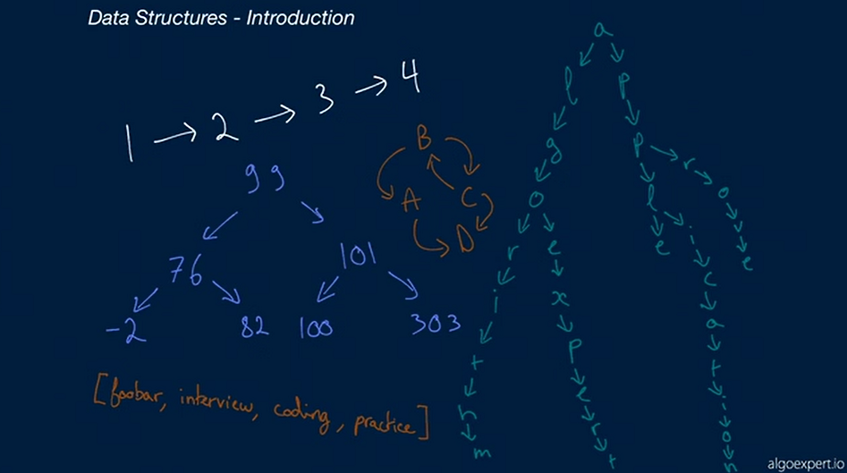

# AlgoExpert Notes
## Myles Thomas
### 5/25/2023
#### algoexpert.io
---

---
# Data Structures Crash Course
---
# Lesson 1: Introduction

Introduction
- Why we need data structures for coding interviews?
    - They are a good way to test if you are a good problem solver
    - Underlying idea: Don't require much knowledge 
        - Law/Medicine are not like this
        - You could give algoexpert problems to a smart person and they may figure it out 

    - 2 types of knowledge needed: 
        - Basic level coding skills
            - self explanatory

        - Data structures
            - These are the tools we need

            - Good: You don't need much knowledge on data structures
                - It is focused on a few foundational data structures 

            - Bad: Data Structures is a deep topic

Final Point
- data structures as the foundational building blocks
    - The actual problems: test your ability to use the building blocks 

---
### Lesson 2: What are data structures?

Coding
- Manipulating data
    - Running joke: Big tech workers move data from 1 spot to another all day long 

    - Example: Working on front end of app
        - You change data and present it on the screen a different way
    

Data Structures
- Help you organize and manage data
    - humans use data structures everyday!
        - Example: directories of your email inbox

- "A collection of data values, the relationships among them, and the functions that can be done to the data"
    - Things to note: 
        - Relationships between data
        - Operations done on data

---
### Lesson 3: Complexity Analysis

### Headline: 

2 dimensions: 
- time
- space

### Prerequisites:

##### Complexity Analysis
The process of determining how efficient an algorithm is
- usually involves finding two things:
    1. Time Complexity
    1. Space Complexity

- measures how "good" and algorithm is ie. if there is a "better" one available
    
##### Time Complexity
A measure of how fast an algorithm runs
- central concept in the field of algorithms/coding interviews
- expressed using Big O notation

##### Time Complexity
A measure of how much auxiliary memroy an algorithm takes up
- central concept in the field of algorithms/coding interviews
- expressed using Big O notation

### My notes from the video:

Just like data structures help you tackle the problems, complexity analysis is to help you understand data structures 
- the bedrock of coding questions 

Most coding questions
- have multiple solutions
    - they are not equal!
    - in an actual interview, you will probably find an answer, and get "can you do better?"

What makes 1 solution better than another?
- Time or Space complexity improvements

Big picture: 
- Time: how fast
- Space: how much memory

Better solution: 
- may have tradeoffs between time/space
    - it depends on the use case, for which is better

Last thing - tying it back to data structures 
- performing operations on data structures takes time/space
    - these relationships have time/space ramifications 
    - different data structures have different time/space
        - need to find the ones that are best for your use case!

---
### Lesson 4: Memory

### Headline: 

a

### Prerequisites:

##### 

### Key Terms:

##### 

### My notes from the video:

a

---
### Lesson _: _

### Headline: 

a

### Prerequisites:

##### 

### Key Terms:

##### 

### My notes from the video:

a

---
### Lesson _: _

### Headline: 

a

### Prerequisites:

##### 

### Key Terms:

##### 

### My notes from the video:

a

---
### Lesson _: _

### Headline: 

a

### Prerequisites:

##### 

### Key Terms:

##### 

### My notes from the video:

a

---
### Lesson _: _

### Headline: 

a

### Prerequisites:

##### 

### Key Terms:

##### 

### My notes from the video:

a

---
### Lesson _: _

### Headline: 

a

### Prerequisites:

##### 

### Key Terms:

##### 

### My notes from the video:

a

---
### Lesson _: _

### Headline: 

a

### Prerequisites:

##### 

### Key Terms:

##### 

### My notes from the video:

a

---
### Lesson _: _

### Headline: 

a

### Prerequisites:

##### 

### Key Terms:

##### 

### My notes from the video:

a

---
### Lesson _: _

### Headline: 

a

### Prerequisites:

##### 

### Key Terms:

##### 

### My notes from the video:

a

---
### Lesson _: _

### Headline: 

a

### Prerequisites:

##### 

### Key Terms:

##### 

### My notes from the video:

a

---
### Lesson _: _

### Headline: 

a

### Prerequisites:

##### 

### Key Terms:

##### 

### My notes from the video:

a

---
### Lesson _: _

### Headline: 

a

### Prerequisites:

##### 

### Key Terms:

##### 

### My notes from the video:

a

---
### Lesson _: _

### Headline: 

a

### Prerequisites:

##### 

### Key Terms:

##### 

### My notes from the video:

a

