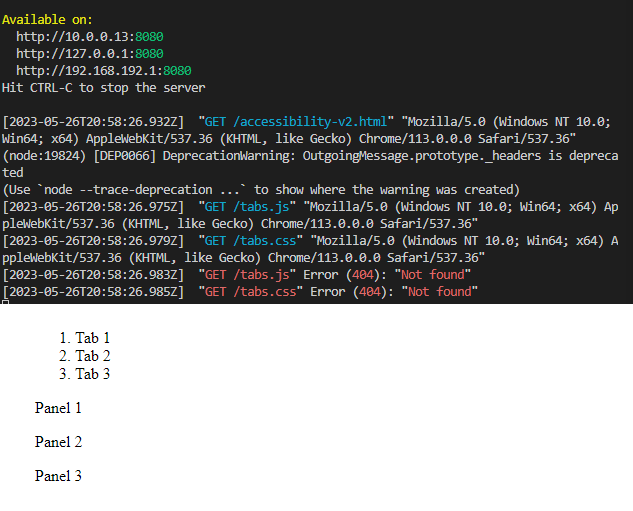

Instructions

1. Copy and paste code into accessibility.html

2. Open terminal in directory as accessibility.html

3. Install node.js:
- npm init -y
- npm install http-server -g

4. Run command to start server: http-server

5. Go to google chrome:
- localhost:8080
OR 
- localhost:8080/accessibility.html

Note: I don't have .css or .js setup, so the file doesn't end up looking good at all in the browser: 

   
Bad:
![alt text for screen readers] (./bad.png)