# FrontEndExpert Notes
## Myles Thomas
### 5/25/2023
#### algoexpert.io
---

There are 5 Courses in FrontEndExpert: 
1. HTML Crash Course
1. CSSCrash Course
1. JavaScript Crash Course
1. React Crash Course
1. Web Dev Fundamentals

---
# HTML Crash Course


---
# Lesson 1: Introduction

HTML
- weird topic
    - people assume you know it even though not classes available with depth
        - there is a lot of complexity that can set you apart 

- although modern frameworks abstract away HTML, these are still HTML!
    - all frameworks must up rendering HTML (it is the building block!)
    - All content on the webpage is HTML
    - Example: JavaScript
        - Using javascript to add functionality - it will help knowing HTML 

    - JavaScript and CSS quesions will be easier if you know HTML

---
# Lesson 2: HTML Basics

## Header:

In order to build a solid foundation, we need to start w/ the basics!

## Key Terms:

### HTML 
HyperText Markup Language
- The primary language of the web
    - contains the content and structure of a webiste

https://developer.mozilla.org/en-US/docs/Web/HTML

### Tag
The primary method of marking up content using HTML
- Tags use the syntax: ```<tagname>content</tagname>```
    - Example:
        - Paragraphs use the 'p' tag:
            - This creates the paragraph "Hello World": 

            - ```<p>Hello World</p>```

- Elements: 
    - Left side tag: Opening tag
        - 
    
    - Right side tag: Closing tag
        - 

    - Everything inside of the tag: Content
        - gets rendered on the page 

- Tags:
    - Some tags don't have any content, known as: 
        - Empty tags
        - Self-closing tags
            - Either use opening tag syntax or ```<tagname/>```

        - Example: 
            - Horizontal rules use the hr tag
                - Create horizontal rule: ```<hr>``` OR ```<hr />```

### Attribute 
Extra information provided to HTML elements, similar to functions parameters.
- Attributes use this syntax: 
    - ```<tagname attribute="value">content</tagname>```
        - The attribute name will always come after the tag name (with a space between them)
        - The quoted value will be separated from the attribute name by an equals sign
            - Example: Input of type "checkbox": ```<input type="checkbox" />```

- A small number of attribues are booleans, rather than strings.
    - Any value for a boolean attribute will be treated as true
        - Examples: all of these would be disabled:
            - ```<input type="checkbox" disabled="disabled" />```
            - ```<input type="checkbox" disabled="true" />```
            - ```<input type="checkbox" disabled />```

---

### < !DOCTYPE html> 

The required first line of every HTML file, for telling the browser what version of HTML to use 
- A doctype of html will use the modern HTML5 standard
    - While a page will usually render properly without a doctype declaration, they should still be included 
        - some older browsers will not render pages following a more modern specification ("quirks" mode)

### < head>
The tag containing metadata about the HTML document
- it is anything that is not displayed on the page/screen
- the ```<head>``` head of the HTML file should be the 1st tag within the ```<html>```  tag

- The < title >  is the only required tag within the ```<head>```
    - This tag gives the page a title, which is used for the name of the tab in most browsers
        - Also gets used for search results in many search engines

https://developer.mozilla.org/en-US/docs/Web/HTML/Element/head      


### ```<body>``` 
The tag containing the content of the webpage 
- The ```<body>```  of the HTML file should be the 2nd tag within the ```<html>```  tag (right below ```<head>``` )
                

## My notes from the video:

HyperText Markup Language
- HyperText: text with hyperlinks 
- Markup Language: annotate text

Example: 
- My Blog Post              (heading)
    - 2 sections:           
        - Day 1             (sub-heading)
            - text          (paragraph)
        - Day 2             (sub-heading)
            - text          (paragraph)

How do we make annotations?
- Tags
    - Example: Hello World
        - ```<p>hello world</p>```
            - ```<p>...</p>``` are known as ankle brackets
            - most tags follow this, besides:
                - empty tags
                    - horizontal
                    - self closing tags
                        - more on these next

Thematic Break/Horizontal Tag/Self closing tag
- ```<hr>```: 
    - annoying because you don't know if a line is ending

- ```<hr/>```: 
    - this is preferred 
        - these are personal preferences 

Attributes
- Functional parameters

- Example: Check box
    - ```<input/ >```: Takes a regular input
    - ```<input type="chechbox"/ >```: Takes an checkbox input

Comments
- Looks similar to tags:
    - Open comment:  ```<!--``` 
    - Close comment: ```-->```

Whitespace
- Doesn't matter/is ignored in HTML
    - it will be collapsed

- Any of the following space characters:
    - spaces
    - tabs
    - new lines

    - Example:
        - These are the same: 
            1. ```<p>This is text</p>```

            2. ...
            ``` html
            <p>
            This
            is
            text
            </p>
            ```


Full HTML File
1. Doctype: ```<!DOCTYPE html>```
- tells the browser we want to use the most modern version of HTML
    - we can ignore this argument usually

1. HTML tag 
- root of the document 

- always contains these 2 tags: 
    1. Head
        - Holds metadata about the webpage (Not seen on the page) 
            - 1 tag required: ```<title>```
                - Used for tab name / search engines / others

    2. Body
        - All elements seen on the page
            - Paragraph: ```<p>Hello World</p>```


---
# Lesson 3: Semantic HTML 

## Header:

If a human were to read your markup code without any accompanying visual representation, would they understand the structure of your page?

## Key Terms:

### Semantic HTML 
HTML that clearly describes the content of the page 
- HTML loses its semantic meaning when tags are misused/overused
    - Examples: ```<div>```, ```<span>```

- Semantic HTML includes the usage of *semantic grouping tags*, which give meaning to different sections of the page 

    - Some commonly used semantic grouping tags/Elements: 

        - ```<article>```: self-contained
            - independently distributable content
                - (could be itself on the internet)

        - ```<section>```: thematic grouping of content
             - not self contained 
                - (could NOT be itself on the internet)

        - ```<header>```: Intro content

        - ```<main>```: Main content
            - Limited to 1 per page

        - ```<nav>```: A section of links
            - Oftentimes: For the primary navigation of the page

        - ```<aside>```: Non-vital content 
            - indirectly related to main content
                - (page would still make sense without this content)

        - ```<footer>```: Footer 
            - oftentimes: contains copyright information


## My notes from video:

Semantic HTML
---
Does your file make sense without seeing the browser?
- Example: when using a screen reader, we can't see it

- need a way to show what content should be grouped with what other content

Back to Blog Post Example: 
- Group 1: Day 1
    - 
- Group 2: Day 2
    - 
- Group 3: Day 1 + Day 2 (Entire blog post)
    - 

Example: AlgoExpert Reviewed
- Picture: 

    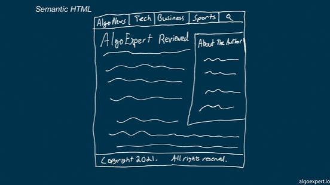

- Semantic Groupings: 

    - Article: 'AlgoExpert Reviewed'

    - Section: 

    - Header: 'AlgoNews'
        - name of website

    - Main: 

    - nav: tech/business/sports
        - These are links right by the header 

    - aside: 'About the author'
        - we can ready the article without this 

    - Footer: copyright
        - 

---
# Lesson 4: Essential HTML Tags

## Header:

These HTML tags are virtually everywhere 
- ubiquitous/on every page


## Key Terms:

## Paragraph tag (```<p>```)

Used for blocks of text
- Can contain other elements that are part of the paragraph
    - Example: Images

https://developer.mozilla.org/en-US/docs/Web/HTML/Element/p


## Heading tags
HTML tags represented by one of the following:
- ```<h1>``` (top level heading)
- ```<h2>``` (secondary heading)
...
- ```<h6>``` (bottom level heading)

https://developer.mozilla.org/en-US/docs/Web/HTML/Element/Heading_Elements


## ``````
The image tag
- this is an empty tag
- a real one should always contain these 2 things: 
    - src: the path to the image (can be relative or absolute)
    - alt: Alternative text to be used with screen readers OR anytime the image can't be displayed

    ``` html
    
    ```

https://developer.mozilla.org/en-US/docs/Web/HTML/Element/img

## ```<ul>```
Unordered list tag
- used for a list where the order does not matter
    - by default, most browsers will show this as a bulleted list

    - can contain any # of < li> tags, as in this example: 

    ``` html
    <ul>
        <li>AlgoExpert<li>
        <li>SystemsExpert<li>
        <li>MLExpert<li>
        <li>FrontendExpert<li>
    </ul>
    ```

https://developer.mozilla.org/en-US/docs/Web/HTML/Element/ul

## ```<ol>```
Ordered list tag
- used for a list where the order matters
    - by default, most browsers will show this as a numbered list

    - can contain any # of < li> tags, as in this example: 

    ``` html
    <ol>
        <li>Step 1<li>
        <li>Step 2<li>
        <li>Step 3<li>
    </ol>
    ```
https://developer.mozilla.org/en-US/docs/Web/HTML/Element/ol

## ```<li>```
list item tag
- Used for individual elements, in both ordered/unordered lists
- List items can also contain other lists to create nested lists
    - Example: 

    ``` html
    <ol>
        <li>Step1</li>
        <li>
            Step 2:
            <ol>
                <li>Substep 1:</li>
                <li>Substep 2:</li>
            </ol>
        </li>
        <li>Step 3</li>
    </ol>
    ```

https://developer.mozilla.org/en-US/docs/Web/HTML/Element/li

## ```<pre>```
Preformatted text tag
- Preserves whitespace
    - Can be useful for when indentation and newlines need to be preserved

    ``` html
    <pre>
        *
       ***
      *****
     *******
    *********
       | |
    </pre>
    ```

https://developer.mozilla.org/en-US/docs/Web/HTML/Element/pre

## ```<br>```
Line break tag
- used to create a line break in text
- Popular uses: 
    - Introduction of email
    - New lines in a poem

- Warning:
    - Tag should not be used for spacing out elements that we could otherwise do with CSS

    ``` html
    <p>
        Dear User, <br />
        We hope you are enjoying FrontendExpert!
    </p>
    ```

https://developer.mozilla.org/en-US/docs/Web/HTML/Element/br

## ```<hr>```
Horizontal rule tag
- used to create a thematic break between content (drawn as a horizontal line by default)

``` html
<p>Part 1</p>
<hr />
<p>Part 2</p>
```

https://developer.mozilla.org/en-US/docs/Web/HTML/Element/hr

## ```<a>```
Anchor tag
- Used for linking to other pages
- Tag should include an 'href' attribute w/ path to the page being linked (absolute or relative)

``` html
<a href="https://algoexpert.io">AlgoExpert</a>
```

https://developer.mozilla.org/en-US/docs/Web/HTML/Element/a

## ```<em>```
Emphasis tag
- Usually rendered as italics 

``` html
<p>I <em>need</em> to study!</p>
```

https://developer.mozilla.org/en-US/docs/Web/HTML/Element/em

## ```<strong>```
Strong tag
- Usually renders as bold 

``` html
<p><strong>Note: </strong> This is very important!!!!</p>
```

https://developer.mozilla.org/en-US/docs/Web/HTML/Element/strong

## My notes from video:

Essential HTML Tags

Before starting
- Semantic markup is important
    - We want to describe as best as possible
    - We will not look at output in this video!

- Tags provide content structure, not layout/style

Paragraph (```<p>```)

Headings (```<h1>``` ... ```<h6>```)
- Font size does NOT equal heading level
    - Change that later

Images (``````)
- src: path
- alt: alternative text 
    - internet is down / screen readers

Lists (```<ol>``` or ```<ul>```)
- ordered: 
    - 1,2,3,4

- unordered:
    - -,-,-,-,

Preformated text ( ```<pre>```)
- preserves whitespace

Line break (```<br />```)
- self closing tag
- not a replacement for CSS
    - has semantic meaning 

Horizontal rule (```<hr />```)
- similar to br tag
- Splitting up different pieces of content
    - Don't think of it as a horizontal line (can use CSS for that )

Anchor Tag (```<a href="..."> content...<a/>```)
- for hyperlinks
    - href: path/url
    - target: if you want to open a new tab/window
        - defaults to opening new tab

Emphasis (```<em>```)
- Not just italics! Use CSS for that

Strong (```<strong>```)
- Same as emphasis, basically
    - remember, don't use unless it shows importance!

---
# Lesson 5: Tables

## Header:

Tables are best used to organize your page layout
- Table layouts are outdated af

## Key Terms:

## ```<table>```
Table HTML tag for representing data with rows/columns
- General rule: anything that could go into a spreadhseet can also make sense in a table

- A variety of tags associated with tables, these are the most common: 

    - ```<tr>```: single row in the table

    - ```<th>```: heading in the table
        - Use with scope attribute (row/col) to choose what the content is a heading for 

    - ```<td>```: a single piece of data in the table
        - a cell

    - ```<thead>```: a grouping tag for the heading of a table
        - usually containing 1 single < tr> with column headings

    - ```<tbody>```: a grouping tag for the body of the table
        - used for containing the primary rows of data 

    - ```<tfoot>```: a grouping tag for the footer of the table 

    - ```<caption>```: caption/title for the table

    
https://developer.mozilla.org/en-US/docs/Web/HTML/Element/table

## My notes from video:

Tables
- tabular data with rows/column
    - if it belongs in a spreadsheet

Note: CSS w/ HTML tags makes more sense, sometimes

Note: A lot of this table stuff is dumb, JavaScript will do the job WAY better

Here is our code example, commented out: 

This can also be found here: 
/FrontendExpert/5 - Tables/tables.html


---
# Lesson 6: Forms

## Header:

Many joke that frontend developers spend their time editing buttons on forms
- Let's find out how to do it, just in case

## Key Terms:

## ```<form>``` 
HTML tag for a section of interactive inputs
- used for submitting information to the server
- forms usually contain the following:
    - a variety of label-input 
    - submit button

- Example: 
    ``` html
    <form>
        <label for="username">Username:</label>
        <input for="text" id="username" />

        <label for="password">Password:</label>
        <input for="password" id="password" />

        <button>Submit</button>
    </form>
    ```
https://developer.mozilla.org/en-US/docs/Web/HTML/Element/form

## My notes from video:

HTML Forms
- will re-visit with JavaScript course to save data in a server/database
- start taking inputs from user

Logic
- label: title for text box
    - for: which id input it is for 

- input: where the user writes into text box
    - id: lets labels find it 
    - name: what the server knows it as
    - type: text/password/etc.
    - placeholder: grey letters
        - for text

Form validation:
- What if we want passwords to meet a threshold of length? 
    - input minlength="6"
- What if we want to require a box to be filled?
    - input required


Other types of data: 

Date
- pick a date 

Checkbox
- binary check or no

Radio
- have multiple buttons 
    - looks ugly, but CSS can get them on 1 line!

Look at the examle here:
/FrontendExpert/6 - Forms/forms.html

---
# Lesson 7: Document Object Model 

## Header:

Document Object Model
- Time to learn about this because apparently everybody has heard about it, except for me!

## Key Terms:

## Document Object Model
The programming interface for interacting with an HTML document (represented as a tree data structure)
- Each HTML element is a node in the DOM tree
    - Nested content represents children in the tree

## My notes from video:

DOM

What actually happens to our HTML? 
1. Browser recieves our HTML as a text file
- 

2. Browser turns text file into DOM (Document Object Model) tree
- 

3. Browser turns DOM tree and generates UI (user interface)


Purpose of DOM:
- Keeps track of what is on the page

- Provides an API
    - Can interact with the API via JavaScript 

- Tree Structure
    - Elements and text are stored as nodes \
        - Rare node: comets

Example: Document Object Model
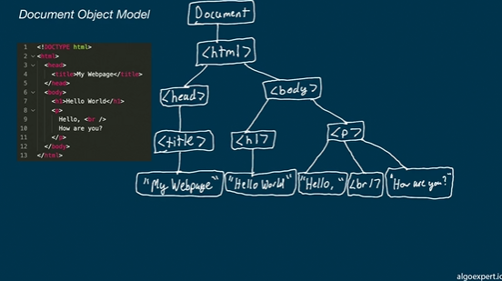

Example can be found here: 
/FrontendExpert/7 - Forms/forms.html


---
# Lesson 8: Acessibility

## Header:

Accessible web development leads to a better user experience for all.
- Also, a more inclusive internet 

Let's look at the following: 
- some best practices to follow
- markup elements to include when designing (with accessibility in mind)

## Key Terms:

## Accessibility
Building applications usable by as many people as possible!
- Oftentimes: Utilizing semantic HTML 
    - Ensuring the application works with various assistive technologies


## Accessibility Tree
A tree representation of the page, focusing on information specific to accessibility
- Each node in this tree contains information such as the following:
    - role
    - state
    - name
    - description

- Accessibility tree is created from the DOM tree
    - Keeps in sync with it 
    - Assistive technoligies (ie. screen readers) interact with the accessisibility tree instead of directly with the DOM

https://developer.mozilla.org/en-US/docs/Glossary/Accessibility_tree

## WAI-ARIA (Web Accessibility Initiative - Accessible Rich Internet Applications)
Specification for accessible HTML created by the World Wide Web (W3C)
- Oftentimes, referred to as just ARIA

- Contains a set of HTML attributes that can be added to provide extra information to the accessibility tree.

- ARIA attributes are grouped into 3 major categories: 

    1. Roles: What the element is doing
    - used to define the purpose of the element

    - Subgroups: 

        - Landmark: Major content areas
            - "Navigational landmarks"

        - Structure: Document structure info

        - Widget: Interactive elements

        - Window: Sub-windows in the browswer

        - Live Region: Regions with dynamically changing content  

    2. Properties: Extra meaning and characteristics of the element
    - example: labels

    3. States: Current state of the element
    - example: if it is disabled

https://developer.mozilla.org/en-US/docs/Learn/Accessibility/WAI-ARIA_basics


## My notes from video:

Accessibility - Building Websites for Everyone
- We want people of all ability to use our websites
    - Some use the following: 
        - keyboard
        - assisting technologies (screen reader)

Accessibility tree
- Similar to the DOM tree
    - Has info for accessibility 

    - 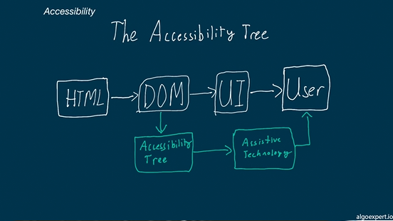

- Nodes have: 
    - name
    - description
    - role
    - state

Writing Accessible HTML
1. Use descriptive content, labels, and alt attributes

2. Use semantic elements
- Accessibility tree automatically gets filled in 

3. Test keyboard controls 
- Ensure you can navigate to all parts of websites with keywords 
    - properly interact with inputs


WAI-ARIA (Web Accessibility Initiate)
- Proivdes moves attributes to use in HTML (to fill out the accessibility tree)
    - Roles: what an element does
    - Properties: extra meaning ie. labels
    - States: current state ie. disabled

Landmark Roles
- Major content areas
    - First thing user navigates to when using technologies
    - Examples: 
        - Banner
        - Main
        - Navigation

        ``` html
        <div role="banner">
            <hi>My Accessible Webpage</hi>
        </div>
        ```

Structured Roles
- Document structural information 
    - a little bit less important 
    - Examples: 
        - Tooltip
        - List
        - Table

        ``` html
        <section role="list">
            <div role="listitem">First item</div>
            <div role="listitem">Second item</div>
            <div role="listitem">Third item</div>
        </section>
        ```

Widget
- Identify interactive elements
    - Some of these align with elements we already have, but some widget roles exist and good to use 
- Examples: 
    - Tab
    - Searchbox
    - Button

    ``` html
    <div role="button">
        Click on me!!!
    </div>
    ```

Window Roles
- Sub windows in the browser
    - Remove some content from the rest of the page
    - Usually in a module, such as: 
        - Dialog (separate content)
        - Alert dialog (separate content w/ high importance)

        ``` html
        <div role="dialog" aria-labelledby="title">
            <h2 id="title">Successfully saved changes!</h2>
            <button>Dismiss</button>
        </div>
        ```

Live Region Roles
- Dynamically changes content
    - Will be checked on periodically to notify user of changes
        - Timing on checks depends on content type, such as: 
            - timer
            - log
            - alert

            ``` html
            <ol role="log">
                <li>Chat message 1</li>
                <li>Chat message 2</li>
                <li>Chat message 3</li>
            </ol>
            ```

Aria Live
- Dynamic changing content and importance
    - Tells how often we need to change it
    - Examples: 
        - Off: Don't announce changes
        - Polite: Announce changes when idle
        - Assertive: Announce changes as soon as possible
            - very important alert messages

        ``` html
        <div aria-live="polite">
            My content is about to change!
        </div>
        ```

Aria Properties
- Used to improve accessibility of website

- Examples: 

    - Aria-label: Label not visible on UI
        - part of markup tree/accessibility tree
            - nice for something that is easy to see but won't be visible on markup tree

    - Aria-labelledby: Another element as a label, passed by ID
        - Using another element as the entire label
            - Similar to "for" attribute

    - Aria-description: More detail than labels
        - Longer and more detailed 

    - Aria-describedby: Another element as a description, passed by ID
        - Works just like labelledby

    ``` html
    <div role="dialog" aria-labelledby="title">
        <h2 id="title">Successfully saved changes</h2>
        <button>Dismiss</button>
    </div>
    ```

Aria States
- Provide stateful information
    - Usually used for inputs 

- Examples: 

    - aria-checked: checkbox state 

    - aria-disabled: element is disabled 
    
    - aria-expanded: expanded or collapsed
    
    - aria-hidden: not visible on page
    
    - aria-pressed: toggle is currently on/pressed
    
    - aria-selected: element is currently selected
    
    - much more!
        - pretty much anything you could think of that you'd need to tell the user

    ``` html
    <div roles="checkbox" aria-checked="true">
        I am checked rn!
    </div>
    ```
    
Other concerns
- Browser compatibility
    - Some people use old browsers, we need to account for them
        - some cutting edge features won't be supported

- CSS Accessibility
    - Use the following in good practice: 

        - Contrast (colors make elements stand out different)
        - Legible font
        - Mobile support (4k monitor vs. phone)
        - etc.

- Internationalization (il8n)
    - language support
    - Test with different "styles" of languages
        - We want support for different regions
        - Some text goes vertically vs. horizontally

Code Example:
Can be found here:
[Another_on_this_local_device] (C:/Users/Myles/OneDrive/Documents/algoexpert.io/FrontendExpert/html_crash_course/8 - Accessibility/accessibility.html)

Takeaways
- 

---
# Lesson 9: Meta Tags

## Header:

Metadata is special information about your webpage
- can be used by search engines and web browsers to do cool stuff
    - where do you define this data?

## Key Terms:

## ```<meta>```
HTML tag for providing extra metadata about a webpage
- Most meta tags will use 'name' and 'content' pair for the type of metadata and its value 

- Common metadata tags: 

    ``` html
    <!-- Sets the character encoding to utf-8 -->
    <meta charset="utf-8" />

    <!-- Allows for custom responsive CSS, rather than the default scaling behavior or small devices -->
    <meta name="viewport" content="width=device-width, initial-scale=1" />

    <!-- Sets the page author to utf-8 -->
    <meta name="author" content="Myles Thomas" />

    <!-- Sets the page description to utf-8 -->
    <meta name="description" content="Ace the frontend interviews!" />
    ```

## Favicon
"Favorite icon"
- the icon for a web page
    - browswers usually show these in a variety of places, such as: 
        - next to the tab name

    - favicons are created using the < link> tag:

        ``` html
        <link rel="icon" href="favicon.png" />
        ``` 

## ```<base>```
Tag for setting the document base URL 
- Used for all relative links on the page

    - Example: 

    ``` html
    <!-- This line goes in the <head> -->
    <base href="https://algoexpert.io">

    <!-- This would go to https://algoexpert.io/frontend -->
    <a href="/frontend">FrontendExpert</a>
    ```

Learn more: https://developer.mozilla.org/en-US/docs/Web/HTML/Element/base

## My notes from video:

Meta Tags 

HTML head tag
- used for information that is not on the page

- 1 required: title
    - name of tab in browswer
    - browswer history
    - accessiblity


# CSS Crash Course


---
# Lesson 1: Introduction

Intro

CSS

- Primary way to add color/styling

- Can change colors/animations

- Syntax is Very simple
    - Can be complex ie. stacking on 3D/Z axis

- Frustration 

    - Hard to debug

    - Lack of understanding of core concepts

Core concepts:

- Box model

- Stacking elements

Deep dives

- Fundamental for interviews

    - Don't want to get stuck centering a page lol

- Fundamental for being a good frontend engineer

    - Must know feasability of design

- Quiz type

    - Fundamentals

- Best practices must be practiced

- Maximize productivity 


# Lesson 2: CSS Basics

Your journey to CSS mastery begins with the basics

# Key Terms

## CSS (Cascading Style Sheets)

Primary styling guide of the web

- Language is used to describe the style/layout of HTML documents

Learn more: https://developer.mozilla.org/en-US/docs/Web/CSS


## Cascading

The order that stylesheets are used

- Can be grouped into 3 main categories:
    
    - User Agent Stylesheets: Contain browser defaults for styles 
        - these get lowest level of precedence

    - User stylesheets: Contain user preferences saved in the browser
        - Overrides user agent stylesheets

    - Author Stylesheets: Contain the CSS code we write
        - Get highest level of precedence
            - Assuming 'limportant' has not been used

Learn more: https://developer.mozilla.org/en-US/docs/Web/CSS/Cascade


## Declaration

A CSS property-value pair in the form property: value

Learn more: https://developer.mozilla.org/en-US/docs/Web/CSS/Syntax#css_declarations


## Declaration Block

A group of declarations surrounded by {}

Example: 

``` css
{
    color: blue;
    margin: 10px;
}
```

Learn more: https://developer.mozilla.org/en-US/docs/Web/CSS/Syntax#css_declaration_blocks


## Ruleset

A selector, followed by a declaration block for styling elements matching the selector with the declarations in the declaration block.

Rulesets follow this syntax: 

``` css
selector {
    property: value;
    property: value;
}
```

Learn more: https://developer.mozilla.org/en-US/docs/Web/CSS/Syntax#css_rulesets

## ```<link>```

A self-closing HTML tag for linking external resources, usually CSS stylesheets

- When linking a stylesheet, ```<link>``` takes 2 attributes: 

1. rel: the relationship to the other document
- this should be 'stylesheet'

2. href: the path to the linked file
- relative or absolute

Learn more: https://developer.mozilla.org/en-US/docs/Web/HTML/Element/link


# Notes from the video

Cascading Style Sheets

2 purposes: 

1. Style our website
- Fonts, colors

2. Describe the layout
- Size/position of elements

3 Main types of style sheets: 

1. User-agent stylesheets

2. User stylesheets

3. Author stylesheets
- highest level of preference 


Declarations
- individual rules
    - exampmle: 
    ``` css
    property: value;
    color: red;
    ```

Ruleset
- Has 2 primary components: 
    1. selector: which elements are effected
    2. declaration block: collections of declarations

``` css
hi, p {
    color: blue;
    margin: 10px; 
}
```
- selector: h1, p (header1, paragraph)
- declaration block: color and margin declartions 

Comments
- easy, and can be multiple lines: 

``` css
/* This is how to make a comment
a
a
a
a
*/ and now this would be an error
```


Linking CSS back to HTML
- goes in the head so it doesn't go in the page
- 2 attributes: 
    - rel: says what the relationship is to the HTML
    - href: path
        - usually is styles.css

``` css
<link rel="stylesheet" href="name-of-file.css" />
```

That's really it for CSS basics!

Here is an example: 

1. Create directory '2 - Basics':
- npm init -y
- npm install http-server -g

2. Put code into 'basics.html' and 'styles.css':

3. Start server:
- http-server

4. Optional: Make changes and have them reflect on the screen: 
- Ctrl-F5

Code examples to learn from:

``` html
<!DOCTYPE html>
<html lang="en">
    <head>
        <title>CSS Basics</title>
        <link rel="stylesheet" href="styles.css">
    </head>
    <body>
        <h1>Hello World from H1!</h1>
        <p>I am a paragraph...</p>
    </body>
</html>
```

``` css
h1 {
    text-align: center;
    color: brown;
    font-weight: normal;
    text-decoration: underline;
}

p {
    background-color: rebeccapurple;
    color: white;
    text-align: right;
    min-height: 100px; /* min-height is better than height because large default font would be trapped in */
    font: 1.25rem; /* rem:  root em, font size relative to the size of the root element (HTML tag's) */
    width: 30%; /* width: 30% of page */
}
```


# Lesson 3: Selectors

CSS offers a selection of selectors for you to select from

# Key Term

## Selector

A pattern used at the beginning of a ruleset for choosing which elements will be affected by the declarations.

Variety of selector types: 
- Type selector: Selects all of the elements of a specific HTML tag
    - Example: h1 would select all ```<h1>``` elements

- Class selector: Selects all elements with a specific HTML class attribute
    - Class selectors are prefixed with ```.```
    - For example: ```.foo```
        - that would select all HTML elements with the ```attribute class="foo"```

- ID Selector: Selects an element with a specific HTML ID attribute
    - ID selectors are prefixed with a ```#```
    - Example: ```#bar```
        - that would select the HTML element with the ```attribute id="bar"```

- Attribute Selector: Selects all elements with a specific HTML attribute set to a specific value 
- These are surrounded by ```[]``` and use ```=``` as a delimiter between the attribute name/value
- Example: ```[type="submit"]``` would select all elements with a type attribute set to "submit"

- Excluding the value will select all elements with the attribute set to any value 
- Example: ```[type]``` would select all elements with the type attribute set, regardless of value. 

- Attribute selectors can also use special syntax for basic pattern matching within the value.
    - There are a variety of options here, but these are some of the more common ones: 

        - ```[href*="algoexpert.io"]```: this would select all elements with an href attribute with the text "algoexpert.io" at any location

        - ```[href$="algoexpert.io"]```: this would select all elements with an href attribute at the end

        - ```[href^="algoexpert.io"]```: this would select all elements with an href attribute at the beginning

- Combinator: Combines multiple selectors to select elements based on their location in the DOM

- A few types of combanitors: 

    - Descendant combinator: Represented by a space (``` ```)
        - format: ```selector1 selector2```
    - Selects all elements that match ```selector2``` and are a descendant of an element matching ```selector1```.
        - A descendant does not need to be a direct child 
        - Example: Think of a folder with 3 sub-directories, it would match 

    - Child combinator: Represented by ```>```
        - format: ```selector1 > selector2```
    - Selects all elements that match ```selector2``` and are a sibling of an element matching ```selector1```.
        - The element matching  ```selector2``` must come after the element matching ```selector1```

    - Sibling combinator: Represented by ```~```
        - format: ```selector1 ~ selector2```
    - Selects all elements that match ```selector2``` and are a sibling of an element matching ```selector1```
        - The element matching ```selector2``` must come after the element matching ```selector1```

    - Adjacent sibling combinator: Represented by ```+```
        - format: ```selector1 + selector2```
    - Selects all elements that match ```selector2``` and have an element matching ```selector1``` directly before them in the DOM 

Learn more: https://developer.mozilla.org/en-US/docs/Web/CSS/CSS_Selectors


# Notes from the video: 

CSS Selectors
- being more specific with the elements that we select

Start by making this super basic example before adding to styles.css: 


Note: run.sh to setup directory, manually call http-server


``` css
/* This would grab everything with class="red"*/
.red {
    color: white;
}

/* This would grab everything, period*/
* {
    color: red;
}

/*This would grab everything with id="red" */
#red {
    color: black;
}

/*This would grab everything with type 'a' AND href=='https://algoexpert.io' */
a[href="https://algoexpert.io"] {
    color: green;
}

/*This would grab everything with type 'a' AND href STARTS WITH'https://algoexpert.io' */
a[href^="https://algoexpert.io"] {
    color: green;
}

/*Combinator Selectors*/

/*Look for paragraphs, anywhere inside of footer*/
footer p {
    color: pink;
}

/*Child selector: Look for paragraphs, directly inside of footer
Div paragraph is inside of div AND inside of footer, so it stays black*/
footer > p {
    color: pink;
}

/*Sibling Selectors*/
/*Shares same parents ie. right next to each other*/

/*Get any paragraph that is a sibling of h2*/
h2 ~ p {
    color: aqua;
}

/*Get any anchor tag that is adjacent to h2*/
/*Systems expert top line is adjacent, the others are not!*/
h2 + a {
    color: brown;
}
```

# Lesson 4: Pseudo Classes And Elements

# Key Terms

## Pseudo Class
An addition to a CSS Selector for selecting based on the current state of the element

- Start with ```:```
- example: ```button:hover``` would select buttons currently hovered over

Learn more: https://developer.mozilla.org/en-US/docs/Web/CSS/Pseudo-classes

## Pseudo Element
An addition to a CSS selector for selecting a specific portion of the element 
- Starts with ```::```
- example: ```p::first-letter``` would select the first letter of paragraphs

- ```::before``` and ```::after``` are special pseudo elements that insert child before or after the content of the element, allowing for styling before/after the comment
    - Oftentimes, used with the CSS ```content``` property (not always)

Learn more: https://developer.mozilla.org/en-US/docs/Web/CSS/Pseudo-elements

# Notes from the video: 

Pseudo Classes and Elements
- for selecting based on current state in the doc 
    - Example: Just elements that are currently disabled
    - Example: First letter/first line 

``` css
/*Pseudo Classes
------------------------------------*/

/*Links that are un-visited*/
a:link {
    color: red
}

/*When we come back it is purple, 
hence the links that are un-visited part...
- Now we are taking the 1 <a> that's visited and making it green */
a:visited {
    color: green;
}

/*Style based on current state 
ie. "what they are currently doing"*/
input:focus {
    outline: 10px solid blue; /*When I click box, it gets huge and blue*/
}

/*Select invalid inputs
Output must be 6+ or it will be red once you click out*/
input:invalid:not(:focus) {
    outline: 15px solid red;
} /*When you start typing, both this and the big blue are true!
CSS will default to this since it is lower in the .css file
Add :not(:focus) so fix this, so it waits for you to stop typing!
ie. 
Blue: Hello World
Red: Hello*/

/*Select elements based on location in the DOM
This takes the 1st paragraph in a set of direct sibling 'Go to' */
p:first-of-type {
    color: orange;
    font-size: 32px; /*16x is default*/
}

p:last-of-type {
    color: purple;
    font-size: 8px;
}

/*Selects odd/even/(2n-1 is odd)*/
p:nth-of-type(2n-1) {
    color: pink;
}

/*look at every element ie. div: whos your first child */
p:first-child {
    color: greenyellow;
    font-size: 24px;
}


/*Pseudo Elements
------------------------------------*/

/*first letter (of all <p>)*/
p::first-letter {
    font-size: 2em; /*2x size of current font*/
}

/*before and after are self explanatory*/
p::before {
    content: ">";
}
p::after {
    content: "!"; /*make sure HTML is on same line to avoid whitespace*/
}
```


# Lesson 5: Selector Specificity

Humans often resort to violence as a means of conflict

CSS takes a math approach to settling disputes

# Key Term

## Specificity 
The algorithm used by the browser to determine which CSS declarations to use when an element is selected by 2 rulesets with the same property 
- Roughly calculated by counting the number of each selector type involved in a selector and multiplying by a weight
- These weights are as follows: 

    - Inline styles: 1000
        - Not recommended: This is writing CSS in your HTML file (Trump card)

    - IDs: 100

    - Classes: 10

    - Pseudo-Classes: 10

    - Attributes: 10

    - Elements: 1

    - Pseudo-Elements: 1

    
Learn more: https://developer.mozilla.org/en-US/docs/Web/CSS/Specificity


# Notes from the video: 

Selector Specifity
- Conflicting rulesets

Specific selectors win!
- The most "specific" selector gets used
    - Default: Last rule in the stylesheet (if they tie)

Example: 

``` css
a[href="https://algoexpert.io"] {
    color: green;
}

section.links a {
    color: red;
}
```

Scores: 

1. 11
- a: 1 (element)
- href: 10 (attribute)

2. 12 - winner
- section: 1 (element)
- link: 10 (attribute)
- a: 1 (element)

Override: ```!important```
- "This is so important, use it regardless"
    - avoid using this, it ruins the cascading nature of CSS

    - When it can be useful: Using a library


# Lesson 6: CSS Units

Most units are useless, but time to learn

# Key Terms

## Absolute Unit
A unit whose value is not dependent on something else
- its size will be constant regardless of context 
    - example: ```px```

## Relative Unit
A unit whos value is dependent on something else
- Most frequently used relative units: 
    - ```em```: Relative to the font size (parent font size)
        - Example: Font size is ```14px```, with ```1.5em``` you'd get 21px

    - ```rem```: Relative to the root element's font size
        - This is usually ```16px``` (unless overridden by user's stylesheet)
        - Author stylesheets can change this by setting a font size on the html selector OR the ```:root``` pseudo class
        - example: by default, ```1.5rem``` will be ```24px```

    - ```%```: A percentage 
        - Usually of the parents value for the same property
            - Example: width of ```50%``` would be half the size of parent's width

    - ```vw```: A percentage of the width of the viewport
        - Example:  ```50vw``` would be half width of viewport

    - ```vh```: A percentage of the height of the viewport
        - Example:  ```50vh``` would be half height of viewport

    - ```ch```: The number of characters on a line
        - Based on the size of the "0" character in the element's font 
            - Can be useful to prevent paragraphs from spanning more than -70 characters in width (it can be hard to read)

# Notes from the video: 

How To Choose Units

Lengths: 
- most basic: px (absolute)
    - inches/cm don't get used much 

- common: em/rem

- relative to viewport: vm/vh

- width based on characters: ch

- percentage: %

How to choose units? 
- be consistent with code of existing project

Width/Height
- %: relative to parent
- vw/vh: relative to viewport
- ch: for paragraph widths
- rem: close to absolute value 
    - last resort: px

Margin/Padding
- rem: for closer to absolute values
- em: to scale with font size
- px: for small values (last resort)

Borders/Shadows
- px: small values 
    - we often don't want to actually scale these
- rem/em
    - note: scaling doesn't always look great 

Font Size
- rem: best
- em: confusing with large projects due to large chain of parents
- last resort: px
    - will prevent user preferences

Colors
- keywords: red/blue
    - avoid super common colors for full projects because they are generic and stand out 

- Hex RGB: #4B7DAF (red, green, blue)
    - most common

- RGB: rgb(75, 125, 175)
    - RGBA: rgba(75, 125, 175, .5)
        - note: 'a' is for alpha value at end (transparency)

- HSL: hsl(210, 40%, 49%)
    - HSLA: hsla(210, 40%, 49%, .5) 
        - note: 'a' is for alpha value at end (transparency)

Quick Demo: 
/6 - CSS Units

``` css
/*new stuff*/
html {
    font-size: 24px; /*makes all html scale up from 16 to 24*/
}

/*Fix the paragraph that is super long (bad user experience)*/
p {
    width: 60ch; /*60 character/line regardless of window size (using 50% is a bad idea)*/
}

/*for the id="parent"*/
#parent {
    font-size: 1.5em;
    width: 60%;
    border: 2px solid black;
}

/*old stuff*/

/*for the id="red"*/
#red {
    font-size: 1em;
    width: 50%;
    background-color: red;
}
/*for the id="blue"*/
#blue {
    font-size: 1rem;
    width: 50vw; 
    background-color: rgba(75, 125, 175, 0.3); /*hard to read: #4b7daf*/
} /*a: alpha value for shade/transparency*/

/*for the id="green"*/
#green {
    font-size: 16px; /*doesn't scale with html, which is bad*/
    width: 10rem;
    background-color: green;
}
/*for anything inside of div*/
div {
    margin: 10px;
    color: white;
}
```

# Lesson 7: Block vs. Inline
block
block
inline inline inline

# Key Terms: 

## Block Element 
An element with its ```display``` property set to ```block```. These have a few key properties: 
- they start on new lines 
- by default they span the entire width of their parent 

Learn more: https://developer.mozilla.org/en-US/docs/Glossary/Block-level_content

## Inline Element 
An element with its ```display``` property set to ```inline```. These have a few key properties:

- they start immediately after the content behind them (without a new line)
- they span the width of their content 
- ```width``` and ```height``` properties with no effect on them

Learn more: https://developer.mozilla.org/en-US/docs/Glossary/Inline-level_content

## Inline-Block Element
An element with its ```display``` property set to ```inline-block```. These have a few key properties:
- they start immediately after the content before them (without a new line)
- they span the width of their content
    - by default, but this can be changed


# Notes from the video: 

Code examples: 

``` css
/*Border is currently taking up the entire width of the body
- its defaults to block level element
    - defaults to entire width of parent
    - starts on new line

p is the parent of em, so if we change p's width, em will change too */

p {
    display: inline-block; /*middle ground: */
    width: 30vw;
    border: 2px solid black;
}

em {
    /*width: 100vw;
    height: 100vh;*/ /*these do nothing at first: inline elements look at width of content */

    border: 2px solid blue;

    /*display: block; this makes the height/width turn on*/
    /*margin: 10px; splits them up a bit */ 
}


```

# Lesson 8: Box Model

Think outside/inside the box!

# Key Terms: 

## Box Model
A box surrounding all elements on the document used for layout 
- Consists of the following:
    - content
    - padding
    - border
    - margin

Learn more: https://developer.mozilla.org/en-US/docs/Learn/CSS/Building_blocks/The_box_model

## ```padding```
A property used to create extra space within an element, between the ```content``` and ```border```
- the ```padding``` CSS property is shorthand for ```padding-top```, ```padding-right```, ```padding-bottom```, and ```padding-left``` (in that order)

Learn more: https://developer.mozilla.org/en-US/docs/Web/CSS/padding

## ```border```
A property used to create a border around the content and padding of an element
- The ```border``` CSS property is shorthand for ```border-color```, ```border-style```, and ```border-width```, which it takes as space separated values (in any order)
- Example: ```border: 1px solid black```: this would create 1 pixel w/ solid black border

- A ```border-radius``` can also be used to create rounded corners on an element, regardless if it has a border
    - This defines the radius of the corners, and a value of ```50%``` is often used on square elements to create a circle!

Learn more: https://developer.mozilla.org/en-US/docs/Web/CSS/border

## ```margin```
A property used to create extra space around an element. 
- The ```margin``` CSS property is shorthand for ```margin-top```, ```margin-right```, ```margin-bottom``` and ```margin-left``` (in that order) 

- A value of `auto` can also be used to allow the browser to choose margins
    - this will usually center block elements horizontally

Adjacent Horizontal vs. Adjacent Vertical:
-  horizontal margins: will be added together to determine the space between elements
- Vertical margins: will be collapsed usually (only the larger margin value will be used)

Learn more: https://developer.mozilla.org/en-US/docs/Web/CSS/margin

# Notes from the video: 

Box Model
- how element show up on the page 
- using the following: 
    - margin
    - border
    - padding
    - content of those elements

Initial state: 

``` html
<!DOCTYPE html>
<html lang="en">
    <head>
        <title>Box Model</title>
        <link rel="stylesheet" href="styles.css">
    </head>
    <body>
        <p>I'm a paragraph!</p>
        <p>I'm <em>another</em> paragraph!</p>
    </body>
</html>
```

``` css
p {
    margin: 24px;
    padding: 10px;
    border: 2px solid black;
    background-color: lightblue;
}
```


How to get to this screen^:
Chrome > Right click on page > 'Inspect'
- Reference: https://www.google.com/search?q=view+chrome+elements+styles&oq=view+chrome+elements+styles+&aqs=chrome..69i57j33i160l5j33i22i29i30l2.3456j0j7&sourceid=chrome&ie=UTF-8

Order: 
1. Content: in the middle
1. Padding: between content and the border
1. Border: 2px solid black
1. Margin: space that element says "this is minimum space between me and other elements
- minimum: the margins don't add together
    - 2 elements with 24px don't add to 48, they stay at 24
        - "Collapsing margins"
            - vertical: use the bigger margin value  
            - horizontal: add the values up 

What happens when he disables 'margin' in styles.css:
- The margin defaults back to 1em, which is what the user agent stylesheet says
    - this is the default if styles.css doesn't say otherwise


Examples:

``` css
p {
    /*Pushes the element below the 1st paragraph down */
    margin-bottom: 48px;
}
```

``` css
p {
    /*These are the same exact 2 things: */
    margin-top: 48px;
    margin-right: 24px;
    margin-bottom: 0;
    margin-left: 10px;

    margin: 48px 24px 0 10px; /*Top/right/bottom/left (clockwise) */
}
```

Margin-auto: allows the browser to make a decision
- most of the time, this defaults to 0
    - the paragraphs are nearly touching each other
    - 

``` css
/*centered*/
p {
    margin: auto;
    width: 30%
}

/* NOT centered*/
p {
    width: 30%
}

/*Common way to get a simple layout: */
p {
    margin: 24px auto;
    width: 30%
}
```

One more trick with margin: Negative margin values!

``` css
p {
    margin-left: -10px;
}
```

What negative margin values do here: 
- shifts the elements 10 pixels to the left
    - it pulls it closer
        - avoid using: can create weird effects
        

Going into the element of the word "another" that was emphasized:

``` html
<p>I'm <em>another</em> paragraph!</p>
```

``` css
element.style {
    margin: 24px;
}

em {
    font-style: italic;
}
```

See the following state:
- horizontal margin: working
- vertical margin: none


Why?

Vertical Margins have no impact on inline elements!
- this is true for padding as well


Padding

``` css
p {
    padding: 10px;
}
```

- Very similar to margin
    - Works the same way ie. has 4 values top/right/bottom/left

    - Not everything works the exact same!

        - Padding cannot do the following: 
            - Take negative values

- Difference between padding and margin:
    - 
    - "space goes inside of the border, rather than outside of the border"

- Purpose:
    - YES: Push the border closer to/farther away from the content
    - NO: Push the element away from other elements


Borders

``` css
p {
    border: 2px solid black; /*standard border all 4 sides*/
}
```

``` css
p {
    border-top: 2px solid red;
    border-bottom: 2px solid black;
    border-radius: 10px; /*adds curvature instead of sharp corners: 50% means circular shape*/
}
```


Box Model Ending Notes/Overview:
- Very powerful way to lay out our elements


Elements of the box model:
1. Content
- The middle/actual content of our element

1. Padding
- Outside of content
- Space between the element and the border
    - Background colors WILL affect this (it affects anything inside of the border)

1. Border
- Edges of the element

1. Margin
- Space between 2 different elements
- Remember: 
    - Vertical: collapsed
    - Horizontal: add the values together


# Lesson 9: Box Sizing

*insert joke about countries/CSS both having to share border conflicts*

# Key Terms

## ```box-sizing```
A CSS property for specifying how width and height should be calculated for the selected element

- Default value: ```content-box```
    - Sets the width and height to only control the size of the content 

    - However: a value of ```border-box``` would include the size of the padding and border as well

    - Examples: 

        - An element has the following givens: 

        ``` css
        e {
            width: 100px;
            padding: 12px;
            border: 24px;
        }
        ```

        - Example 1: content-box (Default value) 
            ``` css
            box-sizing: content-box;
            ```
            - Adding this would take up a total of 172px of width
                - this includes the padding and border 2x to account for the left/right sides
                    - 100 + (2 * 12) + (2 * 24) = 172

        - Example 2: border-box 
            ``` css
            box-sizing: border-box;
            ```
            - Only 100px of width

        
Learn more: https://developer.mozilla.org/en-US/docs/Web/CSS/box-sizing

# Notes from the video:

Example Output: 


CSS Code: 

``` css
#container {
    width: 300px;
    background-color: lightblue;
}

#child {
    width: 100%;
    border: 10px solid black;
    padding: 12px;
    background-color: orange;
}
```

What is happening: 
- "Child" is overflowing because it is not accounted for in the width

- Remedy:

    - Box sizing property!

        - This makes width 100% contain the padding/border

            - 100% for width: width of 300px - padding - border

        ``` css
        * {
            box-sizing: border-box;
        }
        ```

        - 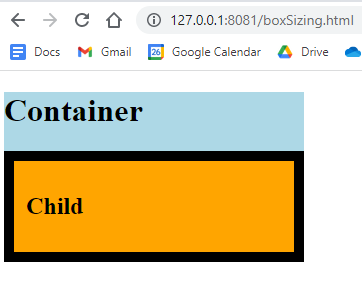


Ending Note: If you are joining an existing project, check to see if they use border-box or content-box!


# Lesson 10: Position

Commonly known as one of the following:
- "why doesn't this work" 
- "I hate CSS"
- "I need a drink"

# Key Term

## ```position```
A CSS property for setting how the browser should position an element in the document

- Default value: `static`

- Can take a variety of values: 

    - `static`: The element follows the flow of the document  

    - `fixed`: The element is positioned relative to the viewport and is removed from the normal flow of the document
        - `top`, `right`, `bottom`, `left`, properties can be used to move the element

    - `relative`: The element is positioned in the same place as it would be with `static`
        - Can use these to reposition it: `top`, `right`, `bottom`, `left`

    - `sticky`: The element will act similar to a `relative` positioned element, but once it scrolls off screen it will stay fixed to the screen
        - Essentially acting as `position: fixed`
        - This is particularly useful for menu bars (think how the menu bar should 'stick' to the top of the screen, no matter where the user scrolls)

    - `absolute`: By default, the element acts the same as `fixed`, except the element will be positioned relative to the document (instead of the viewport)

        - What this means: 

            - as the page is scrolled, it will move with the page (rather than staying at the same viewport location)

            - however, if any *ancestor* has a position value other than `static`, then it will be positioned relative to that nearest positioned ancestor

                - ancestor: "An element that contains (at any level) other elements is an ancestor of the elements that it contains."

Learn more: https://developer.mozilla.org/en-US/docs/Web/CSS/position

# Notes from the video: 


CSS Positioning

Example Output: 


CSS Code: 

``` css
p {
    font-size: 1.75rem;
    margin: 1.5rem;
    padding: 1rem;
    border: 2px solid black;
}

body > p {
    background-color: lightblue;
}

#box {
    width: 15rem;
    height: 10rem;
    border: 2px solid black;
    background-color: lightgreen;
}

#long {
    background-color: lightyellow;
}
```

What is happening in the CSS Code: 

1. Setting up basic paragraph styling

1. Selector for body of first paragraph

1. Set width/height/border of Box

1. Set background of long paragraph


All of the elements on the page are 'static' positioned right now
- default, everything scrolls normally

---
Options besides static/default: 

- `fixed`: Puts the element in 1 fixed location

    - Typically avoid this setting, there are better options!

    ``` css
    #box {
        position: fixed;
        top: 10px;
    }
    ```

- These settings will have the green box 10 pixels from the top, even when you scroll down:

    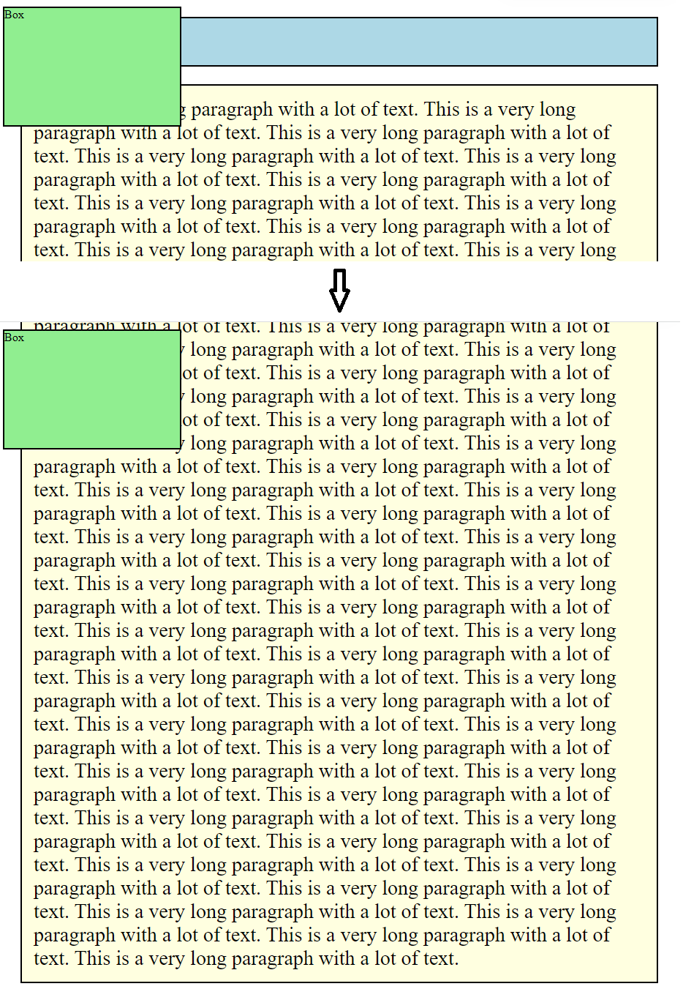

- More examples: 

    ``` css
    #box {
        bottom: 10px; /*Will be stuck to the bottom*/
    }
    ```

    ``` css
    #box {
        left: 100px; /*Will be 100px from the left side*/
    }
    ```

- `relative`: Stick the element where it would have been normally, but then offset using top/left 
    - Simple/easy to use

    ``` css
    #box {
        position: relative;
        top: 5px;
        left: 100px;
    }
    ```

- `sticky`: Mixture between relative/fixed
    - My words: "Starts relative, becomes fixed"
    - The idea here is to keep the element where it was at the start

    ``` css
    #box {
        position: sticky;
        top: 1px;
    }
    ```

    - Great for things you always want access to: 
        - Navigation bars
        - 

    - Beware: You don't want it to block things below it on the page
        - Some older browsers also don't support `sticky`

- `absolute`: Very similar to position `fixed`
    - Difference: When you scroll, it will stay where it was on the page
        - Absolute to: where it is on the page of the document 
        - Not Absolute to: Browser window 

    - This is not always the case!
        - If the parent of (or anything above) an `absolute` element, will instead be absolute to that parent item

        - Example: 

        ``` css
        section {
            position: relative;
        }

        #box {
            position: absolute;
            top: 0px;
            left: 100px;
            
        }
        ```

        - Notice how it is now 0 pixels from the top and 100 pixels from the left of this new section ie. the top of the long paragraph:

            

            - Not from the spot it was on the page before, which in this case using `fixed` had it 0/100 from the top/left of the entire webpage:

                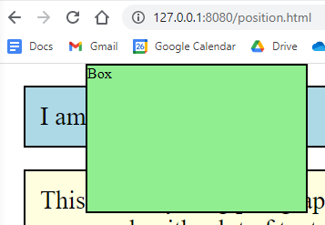

                - (Remember: The Green Box is inside of a `section`)

        - Next Question... What if you want the element to not be on top of the elements, like this here where the green box is on top of the long paragraph?

            - Answer: z-index

            ``` css
            long {
                z-index: 2;
            }
            ```

            - What this does: 

                - When you save, nothing happens (stacking context: we need to create a new one when we use z-index)

                ``` css
                long {
                    position: relative;
                    z-index: 2;
                }
                ```

                - Doing this will lead to the green box now being behind the long paragraph: 

                

                - For proof, bump up the green box by 10 pixels so that we can now see it: 

                ``` css
                #box {
                    top: -10px;
                }
                ```
                

            - Note: z-index sets the order

                - "Z-indexes compete with each other"

            - Examples:

            1. Box on top
            ``` css
            #long {
                z-index: 2;
            }

            #box {
                z-index: 3;
            }
            ```

            1. Long paragraph on top
            ``` css
            #long {
                z-index: 4;
            }

            #box {
                z-index: 3;
            }
            ```
     
    - One more property of note: `float`
        - Similar to position, removes elements from normal flow
        - Allows elements to flow around other elements
            - Very powerful, can do it with multiple items

        - What float does:
            - Take this element and push it to one side of the container (left in the upcoming example)
            - Allow the elements below it to wrap around it wherever there is empty space on the other side

        - Example: The paragraph will now wrap around the box

        ``` css
        #box {
            float: left;
        }
        ```
        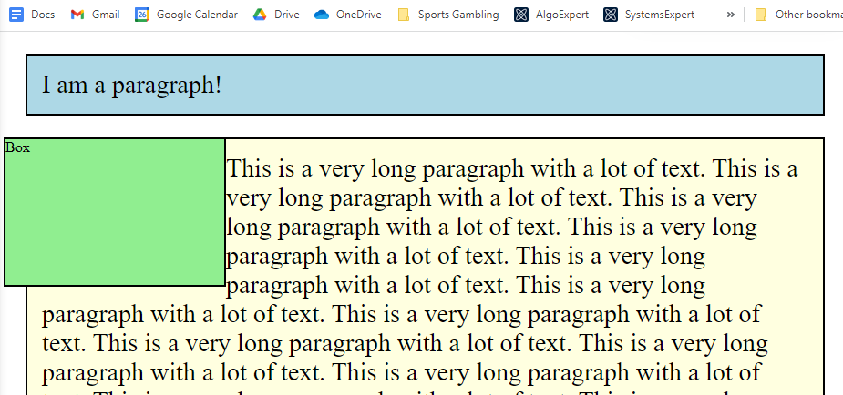
        ``` css
        /*Also, ensure these settings too since we are not using position OR z-index rn: */
        section {
            /*position: relative;*/
        }
        #box {
            /*position: absolute;*/
            /*z-index: 3;*/
        }

        #long {
            /*position: relative;*/
            /*z-index: 4;*/
        }
        ```

        - Sometimes you need not all of the elements to listen/pay attention to float: `clear`
            - "I just want to go below what is floating on the left and the right"
                - To clear the left, you also have to clear the right one

        ``` css
        #long {
            clear: both; /**/
            clear: both; /*Go below item that is floating right*/
        }
        ```

Takeaways/Closing thoughts
- Try to use position sparingly
    - Especially avoid fixed/absolute 
    
    
# Lesson 11: Stacking Contexts

CSS goes 3D!

(This video is about how Z-index actually works in CSS)

# Key Term

## Stacking Context
A group of elements positioned together on the z-axis
- Stacking Contexts can be nested within other Stacking Contexts
- `z-index` values are used to determine the layering/ordering of elements
    - Only elements with the same *stacking context parent*

Learn more: https://developer.mozilla.org/en-US/docs/Web/CSS/CSS_positioned_layout/Understanding_z-index/Stacking_context

# Notes from the video: 

Example Output: 

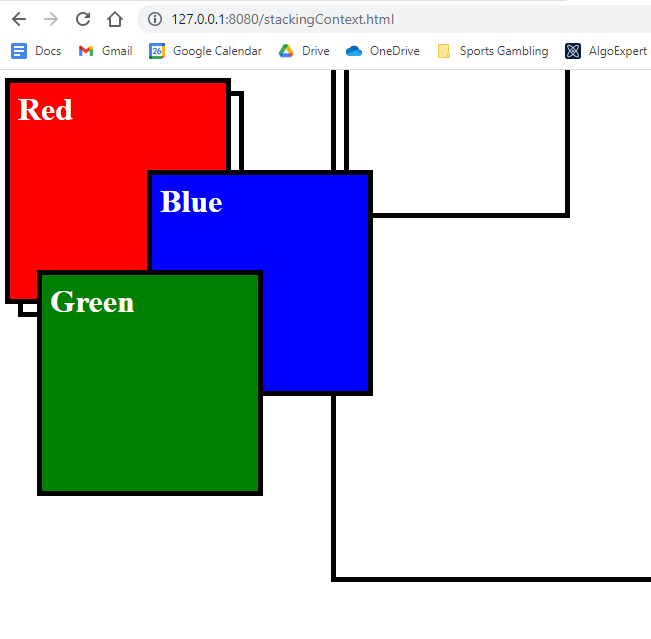

CSS Code: 

``` css
/*Boxes*/
#red {
    z-index: 1;
    background-color: red;
}

#blue {
    z-index: 2;
    top: 100px;
    left: 150px;
    background-color: blue;
}

#green {
    z-index: 3;
    top: 200px;
    left: 40px;
    background-color: green;
}

/*Basic Properties*/
div {
    position: fixed;
    width: 200px;
    height: 200px;
    border: 5px solid black;
    padding: 0.5rem;
    color: white;
    font-size: 2rem;
    font-weight: bold;
}
```

Current State:
- Z index is in order visually (everything is stacked)

- The `position: fixed` argument for `div` is what has created the stacking context
    - There are other ways to create the stacking context

    - Other examples of creating stacking context: 
        - `position: sticky`
        - `position: relative`
        - `transform` 


Stacking Context
- Grouping of elements on the Z-axis
    - In the example above, each is acting as its own stacking context
        - Each value is position fixed
        - "How high up in the z-axis is this stacking context?"
            - When each element has its own stacking context, the 1-2-3 makes sense 

            - What happens if we create a stacking context for the section? ie. 

            ``` css
            section {
                position: fixed;
                z-index: 4;
            }
            ```

            - Answer: Green gets pushed to the back/bottom

                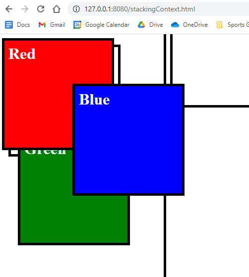

            - Shouldn't green be ahead since it has z-axis 1 and red/blue have 2/3?

                - This part of the .html explains: 

                ``` html
                <section>
                    <div id="red">Red</div>
                    <div id="blue">Blue</div>
                </section>
                <div id="green">Green</div>
                ```

                - This entire `section` is a stacking context
                    - Remember: position is fixed right now

                - Outside of `section` ie. Green is a completely different stacking context 
                    - This is a sibling stacking contexts
                        - This is because they are on the same level (root level) within the stacking context ie. highest level besides the base document's stacking context

            - Back to the example...

            - `section`:  z-index of 4 
                - It will be above anything that has a value less than 4

            - `#green`:  z-index of 3
                - It will be below anything that has a value of 4 or greater 

        - Moral of the story: `#red` and `#blue` have z-index of less than 3, but because they are inside of `section` (which has z-index of 4), they are 

            - `#red` and `#blue` are compared to each other WITHIN their stacking context parent (`section`)
                - This is also why Blue is on top of Red! (2 > 1)

                

            - What happens if we change the z-index of blue to -1?

            ``` css
            #blue {
                z-index: -1;
            }
            ```

                - Answer: Blue is now behind red 
                
                    - Note: Still ahead of green, since Blue's parent (`section`) is still ahead of Green (4 > 3)

                
            
Ending Notes on Stacking Context
- Tons of ways to create a stacking context
    - If you are running into bugs, you might have more/less stacking contexts than you are currently aware of!


# Lesson 12: Flexbox

Commonly known as the following: 
- "I can finally position things"
- "CSS ain't so bad"
- "wow, I haven't punched my monitor today"

# Key Term

## Flexbox
A layout model particularly useful for building responsive designs with row/column layouts 
- Also known as "Flexible Box Layout Module" 

- An element can be made a *flex container* with this `display: flex`
    - All of its children will automatically be laid out as *flex items*

- For flex containers, these are some of the common properties used to layout their flex items: 

    - flex-direction: Determines which direction is the *main-axis*, either `row` or `column`

        - Additionally, `row-reverse` and `column-reverse` can be used to reverse the order of flex items

    - justify-content: Determines how elements are positioned along the *main-axis*

        - Possible values: 
            - `flex-start`
            - `flex-end`
            - `center`
            - `space-around`
            - `space-between`
            - `space-evenly`

    - align-items: Determines how elements are positioned along the cross-axis (the one selected by `flex-direction`)

        - Possible values: 
            - `flex-start`
            - `flex-end`
            - `center`
            - `baseline`
            - `stretch`

    - flex-wrap: Determines if flex items can wrap to new lines

        - Possible values: 
            - `wrap`
            - `nowrap`
            - `wrap-reverse`
                - used to wrap flex items with the lines in reverse order

    - align-content: Determines how lines are positioned along the cross-axis when flex items are wrapping on multiple lines

        - Possible values: 
            - `flex-start`
            - `flex-end`
            - `center`
            - `space-around`
            - `space-between`
            - `stretch`

    - `flex-flow`: A shorthand for `flex-direction` and `flex-wrap`
            
    - `gap`: Determines the amount of space between flex items
        - This can take 1 or 2 length values
            - If given 2, they will be treated as a row gap and a column gap, respectively 

            - Alternatively, a `row-gap` and `column-gap` property can be specified to individually set the gap between rows/columns

- For flex items, these are some of the common properties to position themsevles:

    - `align-self`: Overrides the `align-items` value used for the flex container

    - `flex-basis`: Sets the initial size of the flex item along the main-axis 
        - (essentially this will act as width for the row axis and height for the column axis)

    - flex-grow: Determines if the flex item is able to grow into extra space
        - If value is 0: Flex item will not grow
        - If value is NOT 0: Flex item will take up as much extra space as possible
            - The higher the value, the more the flex item will grow and take up more space

        - Example: 

            - Item A has a value of 1
            - Item B has a value of 2
                - Item B will take up 2x as much extra sapce 
                    - Note: This does not mean it will be 2x as large - Only that it will take up 2x the extra space!

    - flex-shrink: Determines if a flex item is able to shrink in the case that the flex items are too large for the container 
        - If value is 0: Flex item will not shrink
        - If value is NOT 0: Flex item will shrink as small as possible
            - The higher the value, the more the flex item can potentially shrink 

    - flex: Shorthand property for `flex-grow`, `flex-shrink` and `flex-basis` (in that order)

    - order: Moves the flex-item to a different location amongst the other flex items, rather than using the order defined in the DOM

        - All flex items default to having a value of 0

        - If value is -1: Would move an item before all other items that have not changed their order

        - If value is 1: Would place item at the end    

Learn more: https://developer.mozilla.org/en-US/docs/Web/CSS/CSS_Flexible_Box_Layout

# Notes from the video: 

Flexbox
- Layout system for building responsive websites
    - "Allows us to build websites that will re-size based on the size of the window"
    - Creates a great user experience, regardless of the screen sizes!

Example Output: 


CSS Code: 

``` css
section {
    height: 90vh;
    border: 2px dotted black;
}

.red {
    height: 75px;
    background-color: red;
}

.green {
    height: 125px;
    background-color: green;
}

.blue {
    height: 100px;
    background-color: blue;
}

/*Generic Styling*/
div {
    border: 5px solid black;
    padding: 0.5rem;
    color: white;
    font-size: 2rem;
    font-weight: bold;
}
```

What is going on in this example: 

- 

Getting into the actual Flexbox

What Flexbox is:

- Allows us to do the following:

    - Define a flexbox container: Whatever you set to `display: flex` becomes the flexbox container

        - The items inside of it are now flex items

- Example: 

    - Flexbox container: `section`

        - This would make all 3 `div` items in `section` become flex items, changing the way they will be laid out on the page: 

        ``` css
        section {
            display: flex;
        }
        ```
        
        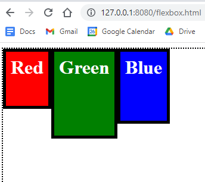
        
        - All of the div's will now be on 1 line instead of stretching out the entire page, the stretch the width of their content

            - This is a default property of flexbox


        - Note: This only affects direct children of `section`

            - Nested items are not flex items themselves


Properties of flexbox: 

- `flex-direction`: 

    - `flex-direction: row`: Put all flex items horizontally (in a row)
        - main axis = horizontal
        - cross axis = vertical
    
    - `flex-direction: column`: Stack the flex items vertically (on top of each other)
        - main axis = vertical
        - cross axis = horizontal

    - `flex-direction: row-reverse`: Put all flex items horizontally (reverse order, throws everything to the right)

        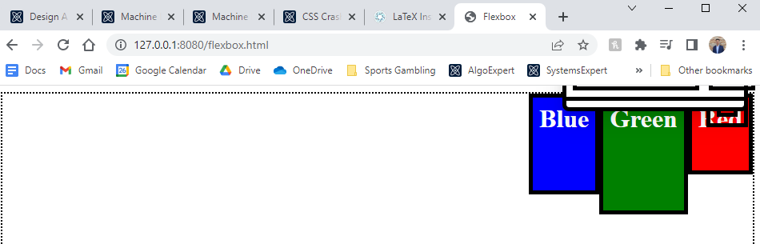

    - `flex-direction: column-reverse`: Stack the flex items vertically (reverse order, throws everything to the bottom)

        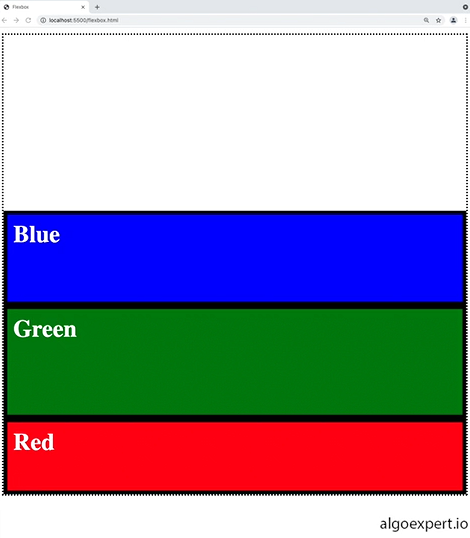


- `justify-content`: Changes how the items are ordered/presented

    - `justify-content: flex-start`: Put everything at the start of the main axis

    - `justify-content: flex-end`: Put everything at the end of the main axis

    - `justify-content: space-around`: Evenly space out the elements

        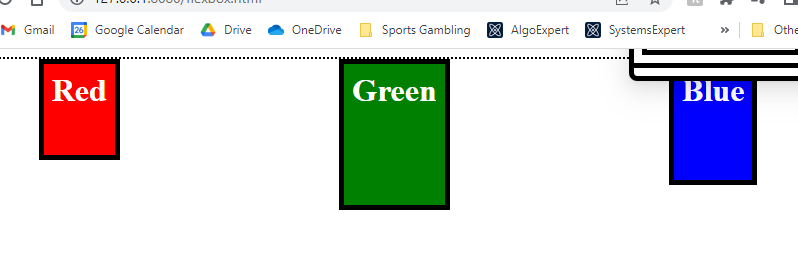

    - `justify-content: space-between`: Same as space-around, except doesn't put space around the elements (they get pushed all the way to the edge)

        

    - Combining properties:

        ``` css
        section {
            display: flex;
            flex-direction: row-reverse;
            justify-content: flex-end;
        }
        ```

        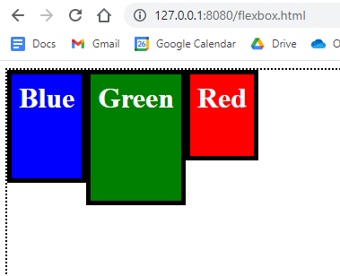


- `align-items`: Just like `justify-content`, but for the cross-axis

    - `align-items: flex-end`: Goes to the end of the cross axis

    - `align-items: flex-end`: Goes to the center

        - Example of easy way to center all direct children: 

        ``` css
        section {
            display: flex;
            flex-direction: row;
            justify-content: center;
            align-items: center;
        }
        ```

        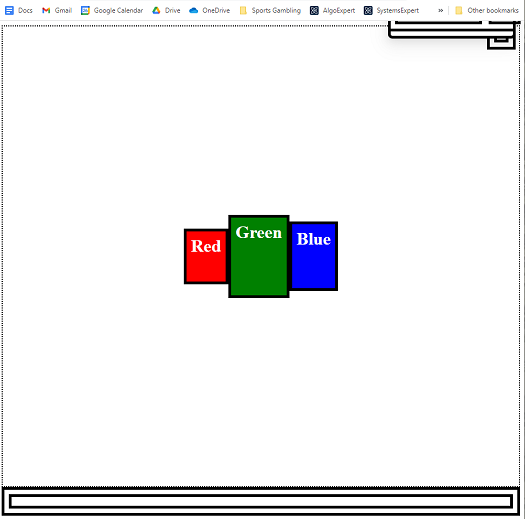

        - There is no space between these items though... here's how to fix that!

- `gap`: Flexbox's version of margin, good way to get even spacing between items

    - It lets you choose the gap between items (instead of setting them all individually)

    - `gap: 10px`: Puts 10 pixels between each flex item in the container

        ``` css
        section {
            display: flex;
            flex-direction: row;
            justify-content: center;
            align-items: center;

            gap: 10px; /**/
        }
        ```

        


Examples with more than 3 flex items: 

Note: We changed the HTML's Body: 

``` html
<body>
    <section>
        <div class="red">Red</div>
        <div class="green">Green</div>
        <div class="blue">Blue</div>   
    </section>
</body>
```

=> 

``` html
<body>
    <section>
        <div class="red">Red</div>
        <div class="green">Green</div>
        <div class="blue">Blue</div>
        <div class="red">Red</div>
        <div class="green">Green</div>
        <div class="blue">Blue</div>
        <div class="red">Red</div>
        <div class="green">Green</div>
        <div class="blue">Blue</div>  
    </section>
</body>
```
    
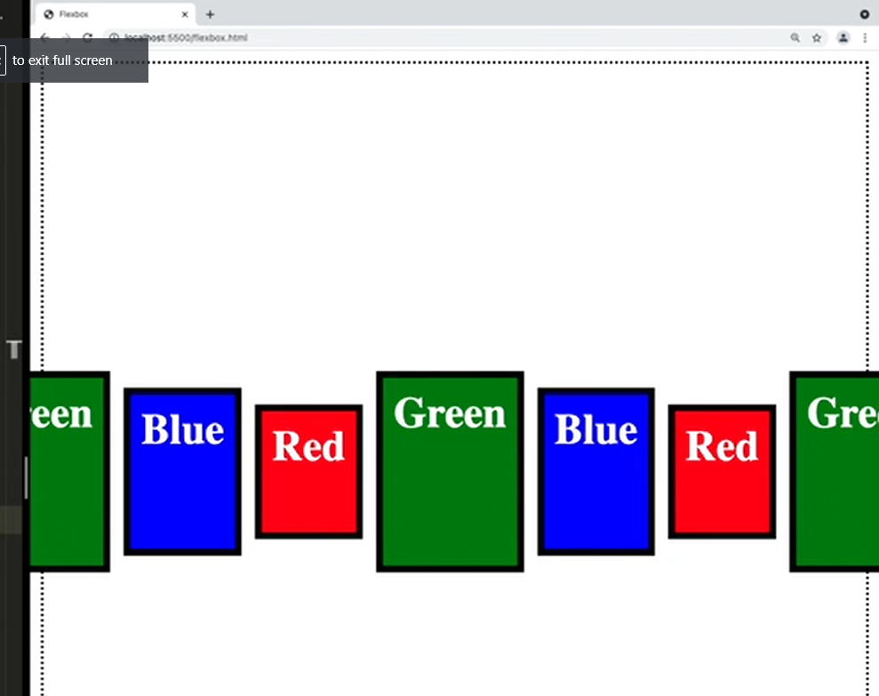

- We have to scroll to see everything

    - Overflow from flex container!

    - How do we fix this? 


- `flex-wrap`: Changes how the values wrap around when overflowing

    - `flex-wrap: nowrap`: Default value, this is how we see it right now where the values are overflowing
        - Not ideal!

    - `flex-wrap: wrap`: Goes to a new line when you run out of space

    - `flex-wrap: wrap-reverse`: Similar to `row-reverse`, you still get a wrap effect, just in reverse order

        


- `flex-flow`: Lets you use flex-direction/flex-wrap in the same call

- Example: These are equivalent, just shorter syntax:

    ``` css
    section {
        flex-direction: row;
        flex-wrap: wrap;
    }
    ```

    ``` css
    section {
        /*flex-direction: row;
        flex-wrap: wrap;*/
        flex-flow: row wrap;
    }
    ```

Now that we have multiple rows, we need to have a way to choose how close the rows will be together!

- We used `align-items` for this; but, when we have a `flex-wrap`, only align items wtihin their individual rows: 

    - See how the are pushed to the top of their rows with this code: 

    ``` css
    section {
        display: flex;
        flex-flow: row wrap;
        justify-content: center; 

        justify-content: center;
        align-items: flex-start;
    }
    ```

    

    - How to fix this?


- `align-content`: Allows you to have more control over where the rows go

    - `align-content: center`: Puts rows all the way in the center

    - `align-content: space-between`: Same as before

    - `align-content: space-around`: Same as before


That is pretty much all for flex container!


Properties for How to change how a single flex item is aligning in the group:
(Let's use the red class as an example)

- `order`: Where in the order do we want this item to be

    - `order: 0`: Default value, everything stays as-is (Everything is in the order set in .html/the DOM)

    - `order: -1` Pushes all values to the beginning of the order

    ``` css
    .red {
        order: -1;
    }
    ```

    

    - `order: 1` Pushes all values to the end of the order

    ``` css
    .red {
        order: 1;
    }
    ```

    


- `flex-grow`: If there is extra space, how much of it should this element take up?

    - `flex-grow: 0`: Default value, everything stays as-is (nothing will take up extra space!)

    - `flex-grow: 1`: When there is extra space, this element will take up as much extra space as possible

        - Look at how the red element steals all of the space in the bottom row (where there was lots of extra space):

        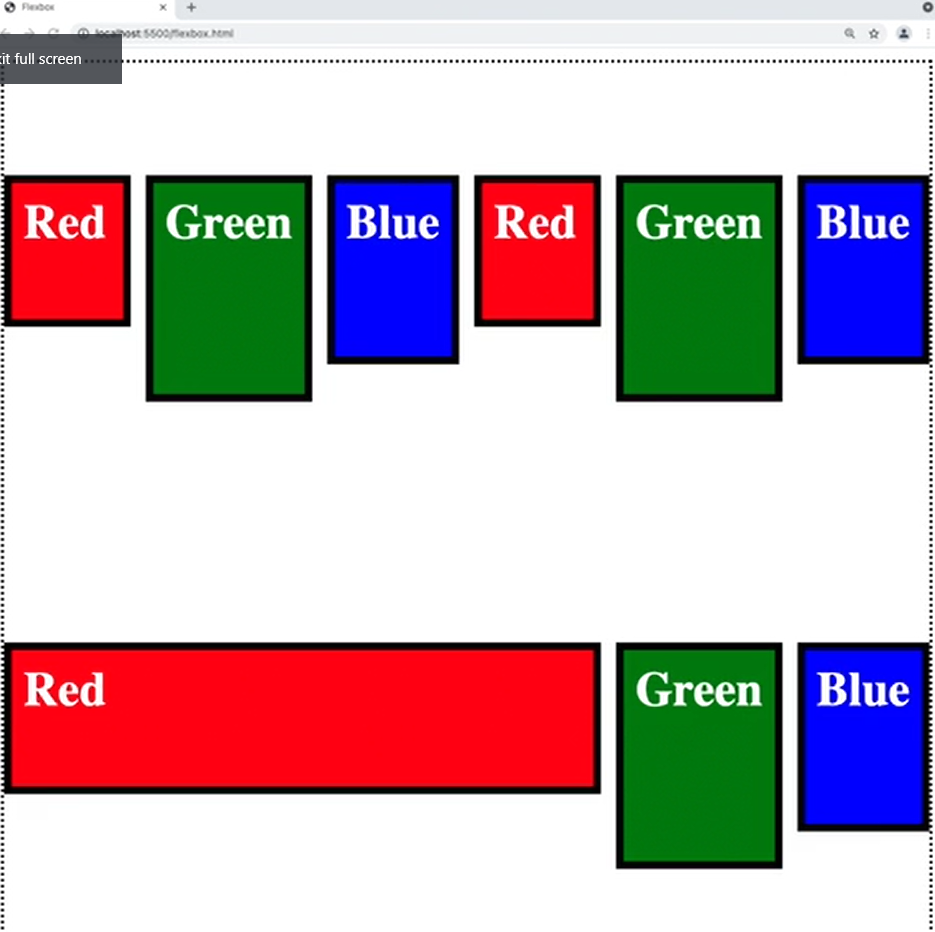

        - Note: On the 1st line, there is no extra space to take up, so nothing changes

        - These values are proportions, as seen in the following code example with red AND green having values of >= 1:

        ``` css
        .red {
            flex-grow: 1;
        }

        .green {
            flex-grow: 2;
        }
        ```

        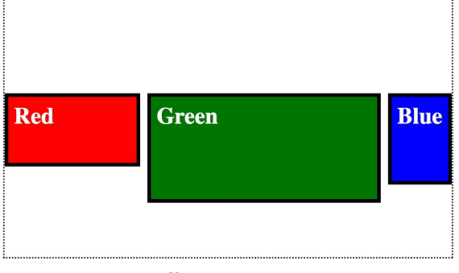

        - Notice how green takes up 2x as much space than red, and blue still takes up 0!
    

- `flex-shrink`: Whether or not this element is able to/allowed to shrink

    - `flex-grow: 1`: Default value, It is allowed to shrink!

    ``` css
    .green {
        width: 100vw;
        flex-shrink: 1;
    }
    ```

    

    - Notice how green is not taking up 100vw, it is just taking up the size of the parent/container

    - `flex-grow: 0`: This element CANNOT shrink.

    ``` css
    .green {
        width: 100vw;
        flex-shrink: 0;
    }
    ```

    

    - Notice how green is now overflowing out of the container!


- `flex-basis`: This is however much space I want to take up, in whatever the main axis direction is

- Examples: 

    - Green elements getting 100vw in height:

    ``` css
    section {
        display: flex;
        flex-flow: column wrap;
    }


    .green {
        flex-basis: 100vw;
        flex-shrink: 0;
    }
    ```

    

    - Note: If we move `flex-shrink` back to 1, they will go back to simply filling up the entire space: 

        - (It is less than their flex-basis width)

    ``` css
    .green {
        flex-shrink 1;
    }
    ```

    


- `flex`: Short hand for flex-grow, flex-shrink, and flex-basis

- Example: These are equivalent, just shorter syntax:

    ``` css
    section {
        flex-grow: 1;
        flex-shrink: 0;
        flex-basis: 200px;
    }
    ```

    ``` css
    section {
        /*flex-grow: 1;
        flex-shrink: 0;
        flex-basis: 200px;*/
        flex 1 0 200px;
    }
    ```

    - Explanation: 

        - `flex-grow: 1`: Allow the green elements to grow, if there is extra space

        - `flex-shrink: 0`: The green elements cannot shrink down to a smaller size than their `flex-basis`
        
        - `flex-basis: 200px`: This is the smallest size the green elements can be 

            - Since there are more than `200px` of space in each row, see how the green elements grow beyond that

            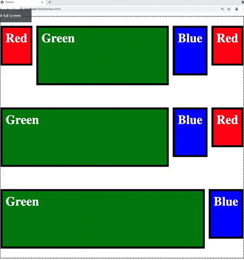

        - What happens if `flex-basis` is `2000px`?

            - "I have a base size of 2000 pixels, I can grow if there is more space than that, and I am not allowed to shrink"

            

        - What happens if `flex-shrink` is `1`?

            - "This can shrink, and now the green elements will shrink back down to the size of the container"

            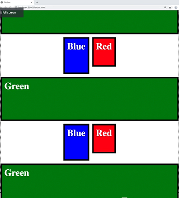


That is all of the flexbox properties that you need to know!

Takeaways: 
- A bit of a learning curve to thinking in flexbox
    - Which elements need to be `flex containers`?
    - Which elements need to be `flex items`?
    - Which `flex properties` do we need to set to get elements to lay out exactly how we want them to?
    
- All in all, super intuitive way to lay out pages
    - Everything will grow and flex 
    - Great way to get responsive websites
    - Sizes change depending on space on the screen

# Lesson 13: CSS Grid

Grid Layout
- "I have complete positional mastery over any 2-D space"
- "CSS is actually awesome"
- "so this is what true happiness feels like."

# Key Term

## CSS Grid
A layout model used for creating responsive layouts of multiple rows and columns

- An element can be made a *grid container* with `display: grid`

    - All of its direct children will automatically be laid out as *grid items* in a single *cell*

- *grid area*: Rectangular sub-section of a grid

- *grid lines*: The dividers between each row and column

- *tracks*: The rows/columns created by *grid area* and *grid lines*


Common Properties for grid containers, used to layout their grid items: 

- `grid-template-columns`: Determines the number of columns and their sizes

    - The unit `fr` can be used as a fractional unit here to create a responsive design

- `grid-template-rows`: Determines the number of rows and their sizes

    - The unit `fr` can be used as a fractional unit here to create a responsive design

- `grid-template-areas`: Creates names for grid areas that grid items can place themselves in 

- `justify-content`: Determines how grid tracks are aligned along the `inline-axis` (row)

- Possible values: 
    - `start`
    - `end`
    - `center`
    - `space-around`
    - `space-between`
    - `space-evenly`

- `align-content`: Determines how grid tracks are aligned along the `block-axis` (column) 

- Possible values: 
    - `start`
    - `end`
    - `center`
    - `space-around`
    - `space-between`
    - `space-evenly`

- `align-items`: Determines how grid items are aligned in columns (ie. the *block-axis*) 

- Possible values: 
    - `start`
    - `end`
    - `center`
    - `stretch`

- `justify-items`: Determines how grid items are aligned in rows (ie. the *inline-axis*) 

- Possible values: 
    - `start`
    - `end`
    - `center`
    - `stretch`

- `place-items`: A shorthand for both `align-items` and `justify-items` 
    - 1 value provided: applies to both
    - 2 values provided: applies to `align-items`, then `justify-items`

- `gap`: Determines the amount of space between grid items
    - 1 length value provided: Can use `row-gap` or `column-gap`
    - 2 length value provided: Row gap, column gap (respectively) 


For grid items, these are some of the most common properties used to position themsevles: 

- `grid-column-start`: Determines what column this item starts on (Based on a line number)

- `grid-column-end`: Determines what column this item end on (Based on a line number)

- `grid-column`: Shorthand for both `grid-column-start` and `grid-column-end`
    - Specified in the format `start / end`

- `grid-row-start`: Determines what row this items starts on (Based on a line number)

- `grid-row-end`: Determines what row this items ends on (Based on a line number)

- `grid-row`: Shorthand for both `grid-row-start` and `grid-row-end`
    - Specified in the format `start / end`

- `grid-area`: Places the item in a grid-area based on a name created in `grid-template-areas`

- `align-self`: Overrides the `align-items` value used for the grid container

- `justify-self`: Overrides the `justify-items` value used for the grid container

- `place-self`: Shorthand for both `align-self` and `justify-self`
    - In the same format as `place-items`

Learn more: https://developer.mozilla.org/en-US/docs/Web/CSS/CSS_Grid_Layout

# Notes from the video: 

CSS Grid
- Different way to layout using CSS
    
    - Usually used for 2D layouts

    - While Flexbox was good for laying out elements that scale naturally with screen size, CSS Grid has more properties control over exact locations elements will end up in

        - Especially when there are more rows/columns

Example Output: 


CSS Code: 

``` css
body > * {
    border: 5px solid lightblue;
}
```

What is going on in this example: 
- CSS
    - Light blue borders on all direct children of the body
        - Each direct child will be the direct grid items

- HTML
    - Heading
    - Body
        - Header

        - Main
            - Heading
            - Content Paragraph

        - Aside
            - Paragraph

        - Footer
            - Paragraph

Goal: 
- Change the layout:
    - `heading`
    - `aside` content next to `main` content
    - `footer`
- We could do this with Flexbox, but it would be more difficult


Getting into the actual CSS Grid

How to turn the body into a CSS Grid Container:

``` css
body {
    display: grid;
}
```

In this example: 

- Grid Container: Body
- Grid items (all direct children): 
    - Header
    - Main
    - Aside
    - Footer

Properties we commonly set: 

- `grid-template-columns`: How many columns do we want/how large do we want them to be

    - Space separated sizes for each column

    Example: 

    ``` css
    body {
        display: grid;
        grid-template-columns: 100px 200px 100px;
    }
    ```

    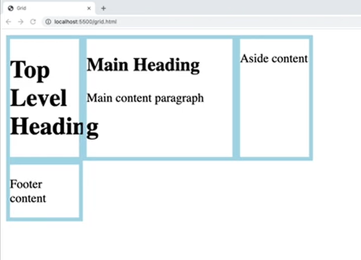

    - See how there is left column of `100px`, middle of `200px`, and right of `100px`

    - This is not ideal: We had 4 grid items and 3 columns, so we end up with 2 rows since the footer had to get pushed down

- Implicit Grid: The browser decided how many rows we need based on # of items we have

    - How to change this? Explicit Grid!

    ``` css

    ```

    ![]
    
- Fractional Unit: The hardcoding of pixels is typically a bad idea, so we will use fractional units (`fr`) to 

    - What it means: "Take up as much space as I can, proportional to other `fr` units"

    ``` css
    body {
        grid-template-columns: 1fr 2fr 1fr;
    }
    ```

    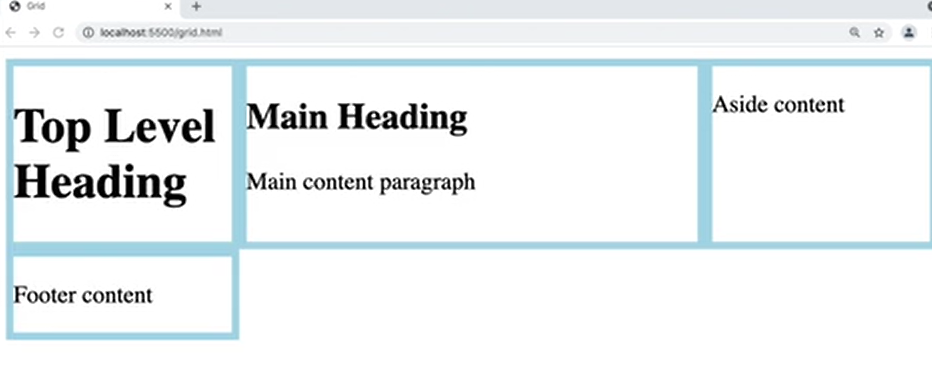

    - Notice how the entire width is now spanned, and Main is 2x larger than left/right!

    - One issue with `fr`: Sometimes, the columns can get too small (especially w/ small browser windows)

        Remedy: Wrapping `grid-template-columns` in `minmax`:

        ``` css
        body {
            grid-template-columns: minmax(1fr) 2fr 1fr;
        }
        ```

        

        - See how now, the Top Level Heading column got bigger 

            - Thisis because `200px` > `1fr` in this situation

                - If we change to `20px`, it will still stay at `1fr`, which is good!

- `grid-template-rows`: How many rows do we want/how large do we want them to be

    - Space separated sizes for each column

        Example: 

        ``` css
        body {
            display: grid;
            grid-template-columns: 3fr 1fr;
            grid-template-rows: 1fr 3fr 1fr;
        }
        ```

        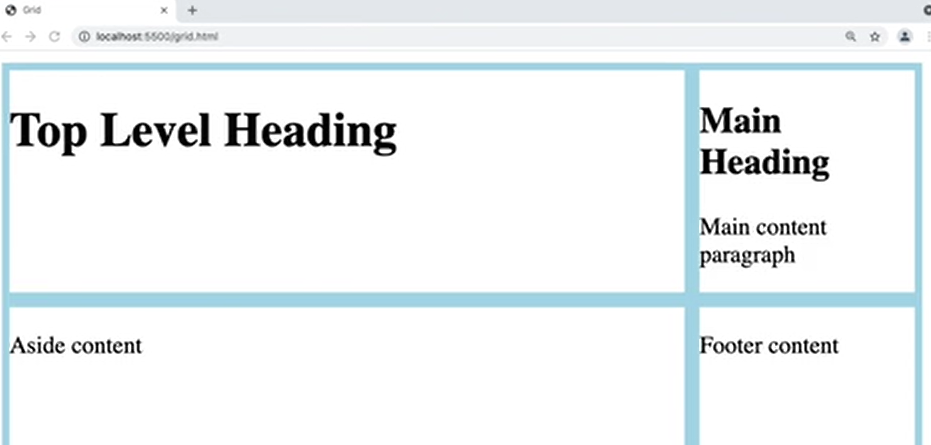

        - See how we cannot see the 3rd row yet (no content has been pushed there yet)

            - How to choose where in the grid the content will go: Our next topic!


Note: These are both the same:

``` css
body {
    grid-template-rows: 1fr 3fr 1fr;
}
```

``` css
body {
    grid-template-rows: repeat(3, 1fr);
}
```

Note: `Track`: Column OR Row

We have figured out how to size our elements, but now we need to actually lay out/position our elements where we want them!

- `grid-column-start`, `grid-column-end` and `grid-column`: Where does this column start/end

    - Column in this case: The column lines (between the individual columns)

    Example:

    ``` css
    header {
        grid-column-start: 1;
        grid-column-end: 3;
    }
    ```

    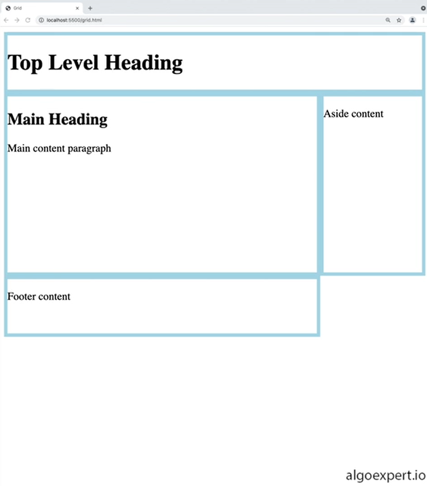

    - Notice how the Heading is now spanning over 3 column (from 1-3)

        - This would be the same as our code above: 

        ``` css
        header {
            grid-column-start: span 2;
        }
        ```

        - "Take up 2 columns, from this spot!"
            
            - It naturally starts at 1, so 1 + 0 is the default, but 1 + span2 means it will cover 3 total

    - Best way to do this: `grid-column`

        - The following examples means the same thing: 

        ``` css
        header {
            grid-column-start: 1;
            grid-column-end: 3;
        }
        ```

        ``` css
        header {
            grid-column: 1 / 3;
        }
        ```

    - Giving grid lines names

        - It can be confusing remember the 1's and 3's from above. These two examples both would have the same result: 

        ``` css
        body {
            display: grid;
            grid-template-columns: 3fr 1fr;
            grid-template-rows: 1fr 3fr 1fr;
        }

        header {
            grid-column: 1 / 3;
        }
        ```

        ``` css
        body {
            display: grid;
            grid-template-columns: [left] 3fr [middle] 1fr [right];
            grid-template-rows: 1fr 3fr 1fr;
        }

        header {
            /*grid-column: 1 / 3;*/
            grid-column: left / right;
        }
        ```

        

- `grid-row`: Same as `grid-column`

    - 
    
    We don't want to do this, but here's an example of how to push an element down to the 2nd row: 

    ``` css
    header {
        grid-row: 2;
    }
    ```

There is another way besides grid-column and grid-row to choose where an element ends up in the Grid system: 

- `grid-template-areas`: Named *areas* that items can go into

    - Nice because it keeps all of the layout information in 1 place

        - The instructor prefers this method!

    - Area: Rectangular portion of the grid (A sub-section)

        - a

    Example similar to the ones above: 

    ``` css
    body {
        display: grid;
        grid-template-columns: [left] 3fr [middle] 1fr [right];
        grid-template-rows: 1fr 3fr 1fr;
        grid-template-areas:

        /*Col 1*//*Col 2*/
            "header header"   /*Row 1*/
            "main aside"        /*Row 2*/
            "footer footer";     /*Row 3*/
    }

    header {
        grid-area: header;
    }

    main {
        grid-area: main;
    }

    aside {
        grid-area: aside;
    }

    footer {
        grid-area: footer;
    }
    ```

    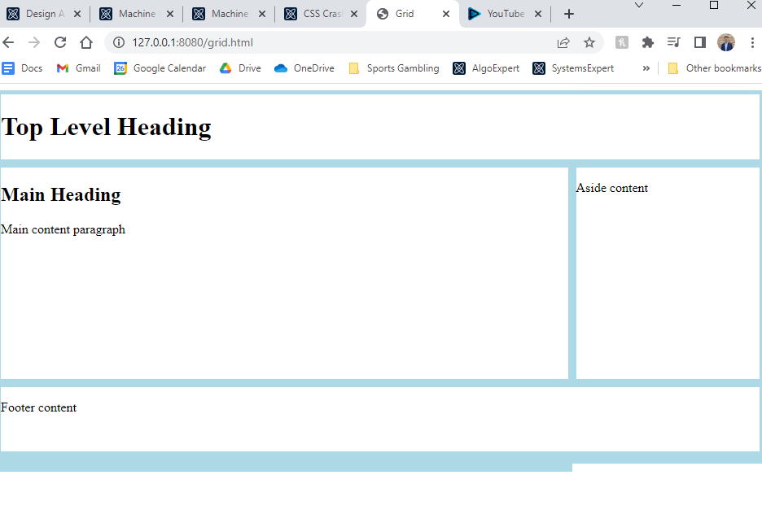

    And if we wanted to switch header and aside, so that aside was on the left: 

    (Simply switch the order to 'aside main')

    ``` css
    body {
           /*Col 1*//*Col 2*/
            "header header"     /*Row 1*/
            "aside main"        /*Row 2*/
            "footer footer";     /*Row 3*/
    }
    ```

    


That's all there really is to laying out CSS elements in the CSS Grid!

Extra properties to change how the grid is going to look + how the individaul grid items will work within the grid:

- `gap`: Puts space between the grid units
    
    - Works how it does in Flexbox

        ``` css
        body {
            gap: 10px;
        }
        ```

        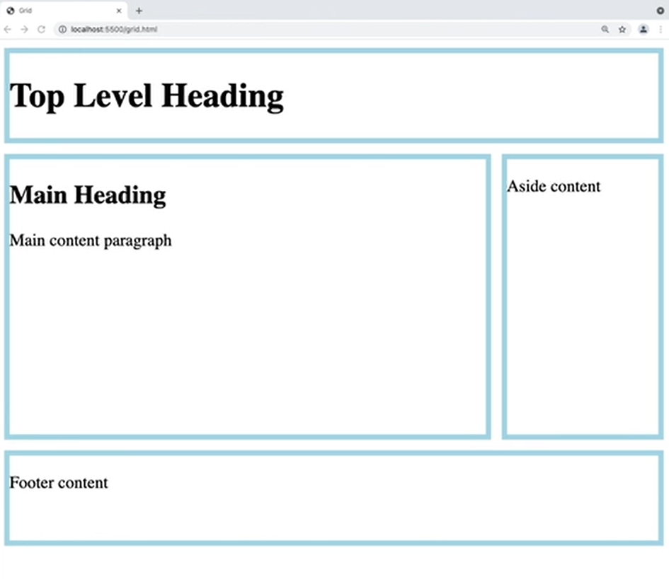


- `justify-items`: 

    - `justify-items: center`: Centers items so they don't fill up the entire page 

- `align-items`: 

    - `align-items: center`: Vertically centers the items

- `place-items`: `justify-items` and `align-items`

    - Example: `place-items: center`

Note: You can put these on either the entire body, or just an individual item!

- To put them on yourself: 

    - `justify-self: center`
    - `align-self: center`
    - `place-self: center`

That is all of the properties for CSS Grid!

One last thing: 
- You can use nesting
- Examples: 
    - Flex boxes inside of grids
    - Grids inside of flex boxes
    - More!

- Example of this: Main as both a grid item and flex box:

``` css
main {
    display: flex;
    grid-area: main;
    
    flex-direction: column;
    /*
    justify-content: center;
    align-items: center;
    */
}
```

In general, this is how we will lay out ALL of our content:

- Grids for 2D layouts

- Flexboxes for single row layouts/ single column layout

    - Could also be used for multi-column / multi-row layouts (not recommended)

        - Be careful with this: flex-wrap has less control over where exactly the wrapping will happen ie. which elements will be on which lines


# Lesson 14: Working With Images

Are images content or style?

# Key Term

## Image Sprite

A group of images all included in a single image file.

- These images are usually split on the client using the CSS `background-image` property, along with the `background-position`

- Primary benefit of sprites: 

    - Reduce the total file size
    
    - Reduce the # of files the client needs to download

        - These will both decrease page load times!


# Notes from the video: 

Working With Images
- How and when to use image tags

    - You can also do image tags in HTML, so that's the issue

Are images content or style?

- Content: HTML
    - Image is part of the context

- Style: CSS
    - Removing it would not change the page's meaning

        - These are not absolute rules - always use your best judgement!!


Primary way in CSS: 

`background-image`: Primary way to add an image in CSS

- Takes relative/absolute path as argument

- Sets image as background of the element

    - ie. it will go behind other content if that element has more content

- Properties: 

    - `background-clip`: Where the image will be clipped off/cropped, based on box model

        - `background-clip: padding-box`: causes the background to extend just outside the padding (but not to the border)

        - `background-clip: border-box`: will extend to outside of the border
        
        - `background-clip: conntet-box`: content will only be size of the content

        - `background-clip: text`: background will only be around the text

            - Is not used very often due to low # of use cases

        - More on `background-clip`:

            - This property also works for background colors if we want them to extend to different part of box model


    

    - `background-origin`: Where the background start

        - `background-origin: padding-box`: Top-left corner of background image will be at top-left of the padding

            - Usually, you'll set `background-origin` to the same as `background-clip`

                - Not always tho!

        - More on `background-origin`:

        - It differs since it cannot have text as a value

    - `background-repeat`: Specifies if they background should repeat, if the element is larger than the background image

        - Values: `repeat` or `no-repeat`


    - `background-size`: Specifies the size of the image

        - Usually, it goes as 2 space-separated values: 

            - Width
            - Height

        ``` css
        main {
            background-size: 50% auto;
        }
        ```

        - `auto`: scales the images while keeping its natural proportions/size

            - Aspect ratio doesn't change!

        - `cover`: Scales image / stretches it as large as possible to fill the container

            - Crops out any portions that end up outside of the elements
            
        - `contain`: Will make the image as large as possible, without cropping OR changing proportions


Image Spriting: Include multiple images in 1 file

- Then, the splitting up that file on the client before displaying it to the user

    - More bandwidth efficient

        - Tradeoff: It can make the code less readable

- Use `background-position` to "get" individual images out of the larger image

    - How: Property was intended to move a background back inside of the image container, but with clever sizing it can be used just to use a certain portion of the larger image that you want


Code Editor Example: 

CSS Code: 

``` css
#algoexpert {
    width: 300px;
    height: 200px;
    border: 10px dashed black;
    padding: 10px;
    background-image: url("algoexpert.png");
}
```

Output: 


- See how this image is super cropped and all we can see is the top 

    (It is overflowing out of the box)

    For reference, original photo: 


How to fix this: 

- `background-size`: This will make the image itself bigger/smaller

    - `100px`

        ``` css
        #algoexpert {
            background-size: 100px 100px;
        }
        ```

        - Note: It will repeat automatically, and because your new image is tiny at `100px` by `100px`, it does
        
        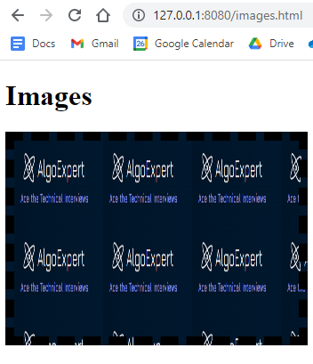

    - `contain`: Stretch it as long as it possibly can, without having to change the aspect ratio / proportions

        ``` css
        #algoexpert {
                    background-size: contain;
                }
        ```

        - 

        

    - `cover`: Fill out the entire container, crop the rest of it out 

        ``` css
        #algoexpert {
            background-size: cover;
        }
        ```

        - 

        


- `background-repeat`: Fixing repeating

    - `repeat`: The default

    - `no-repeat`: Make it not repeat

        ``` css
        #algoexpert {
            background-size: contain;
            background-repeat: no-repeat;
        }
        ```

        


- `background-origin`: Decide where your image is going to start

    - `border-box`: Starts at the top left

        ``` css
        #algoexpert {
            background-origin: border-box;
        }
        ```

        

- `background-clip`: Decides where your image gets clipped

    - `border-box`: Image gets clipped to the size of the content

        ``` css
        #algoexpert {
            background-origin: border-box;
            background-clip: content-box;
        }
        ```

        

        - We lose the edges of the image here

            - This is because the background clip is smaller than the background border box

Note: A good way to the image inside of the border is with this combo

``` css
#algoexpert {
    background-origin: padding-box;
    background-clip: padding-box;
}
```


How to take advantage of "Sprite" or "Spriting" we learned about earlier: 

Go back to the HTML and un-comment the following sections: 
1. HTML
1. CSS

Once you get the `sprites.png`, your page should look like this before proceeding: 


Note: 
- Blue: CSS-3
- Red: HTML-5

Goal: Have the `div` for CSS and the `div` for HTML to have the image from the Sprite inside of them

How to do so: 

- Push the HTML logo over to the left, so it is next to the html `div`

``` css
#html {
    width: 256px; /*We know size of images*/
    height: 256px;
    background-image: url(sprites.png);
    background-position: -286px -10px;
}
```

- Push the CSS logo over to the right, so it is next to the css `div`

``` css
#css {
    width: 256px; 
    height: 256px;
    background-image: url(sprites.png);
    background-position: -10px -10px;
}
```

- Remove image tag since we no longer need the full image with both in them:

``` html
<!-- 
```

- Final step: Right now, the HTML/CSS `div`'s are being used as images

- What we want: We want to declare that explicity!

``` html
<div id="html" role="img" aria-label="HTML Logo"></div>
```

``` html
<div id="css" role="img" aria-label="CSS Logo"></div>
```

Final product: 

![]

- Note: the `aria-label` has nothing to do with this section, but it is good practice catering for those reading screens!


Takeaways from this section: 

- Using HTML vs. CSS: Total Grey Area!

    - Most of the time: 

        - img tag in HTML
        - edit those tags/width/height in CSS

    - Also acceptable for using CSS: 

        - `background-image`

        - image spriting


# Lesson 15: CSS Inheritance

Much like biological organisms can pass down traits,

CSS elements pass down properties from parent to child

# Key Term

## CSS Inheritance

How elements choose a value when none has been explicitly declared in any stylesheet.

- All properties are either inherited or non-inherited

    - Inherited: Take parent's value

    - Non-Inherited: Take `initial` value

- While the default groupings of inherited/non-inherited is usually all that's needed, this can be changed by using any of these values for any declaration: 

    - inherit: The value should inherit from its parent, regardless of if it normally an inherited property.

    - initial: The value should be set to the default value of CSS specification.

        - Note: This is oftentimes different than browser defaults

    - unset: The value should be set to `inherit` if it is normally inherited; otherwise, `initial`

        - This can be useful for "resetting" browser defaults from the user agent stylesheet

    - revert: The value should revert back to the next stylesheet in the cascade

        - For author stylesheets, this would act as if the author did not write any declaration for the property

            - But, it would still honor the user agent and user stylesheets as normal

Learn more: https://developer.mozilla.org/en-US/docs/Web/CSS/inheritance


# Notes from the video: 

CSS Inheritance


Basic example setup:

Heading and button: 

``` html
<main>
    <h1>Inheritance</h1>
    <button>Click Me</button>
</main>
```

Basic stylesheet:

``` css
main {
    color: red;
    border: 2px solid black;
}
```


- Questions about this: 

    - Why is H1 (Inheritance) red when it wasn't made that in the selector?

    - Why is H1 getting the color, but not the border?

    - Why isn't the button colored?

        - Answer to all: 2 things

            1. Inheritance

            1. User stylesheet (browser)


Every property in CSS is either inherited, or not.

- Inherited: Defaults to parent's value, if it hasn't been set

    - Goes up parent tree to find a set value 

    - Examples: 

        - Color

- Non-Inherited: Defaults to parent's value, if it hasn't been set

    - Only looks at itself

    - Examples: 

        - Border


This makes sense, but then why isn't the button red?

Example with inspect/code to show: 


- Even though color is an inherited property, this button's user agent stylesheet is already setting a color!

    If you scroll down further...

    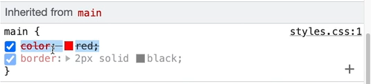

    Meanings of this photo:
    
    - Crossed out: Color is crossed out, meaning that it is being over-written by the user agent stylesheet

    - Greyed out: Border is faded/greyed out, meaning that it is a property that is not usually inherited

        - You can change this behavior if you'd like


Example of changing behavior for over-written/non-inherited properties: 

``` css
button {
    color: inherit;
}
```

- This will overwrite the user agent stylesheet, causing the button to have red text: 

    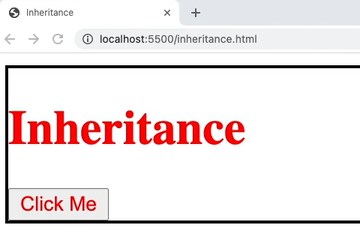


If you want, you can change this behavior for the border too, even though it is a non-inherited property:

``` css
button {
    color: inherit;
    border: inherit;
}
```


More properties that work similarly to `inherit`

- `initial`: Looks at just the CSS Spec ie. says the following:

    - "Don't worry about the user style agent sheet OR inheritance, just go look at CSS specification"

        - In this example, CSS Specification has black for buttons, so it will become that 


- `unset`: If this is inherited by default, just inherit; If not, go to the initial value from CSS Spec 

    - Very useful for un-doing what the user agent stylesheet does

    Example

    ``` css
    button {
        border: unset;
    }
    ```

    This removes the `border` from the user agent style sheet

    - Because border is not an inherited property, it goes all the way to the initial value from CSS Spec ie. no border

- `revert`: Looks at the style sheet(s) above in CSS Cascading

    Example: 

    ``` css
    button {
        border: revert;
    }
    ```

    This is the author stylesheet
    
    - What if the author did not declare the property?
    
        Now it will go back to the user agent and user stylesheets as normal


This is a powerful property to use with what we just learned:

- `all`: Look at every single property and set them all to this value

    Example: 

    ``` css
    button {
        all: unset;
        border: revert;
    }
    ```

    We have lost all of the user agent stylesheets
        
    - (besides border, since `revert` has made it go back to the user agent stylesheet)

    - Without this, it would just inherit everything from main!

    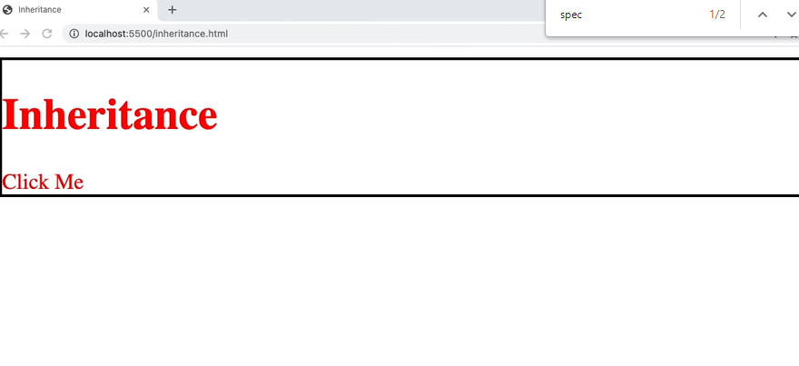

    - The properties also all look like regular text now

        - This is because we have inherited it from the header


Takeaways: 
- CSS Spec = Defaults

- Most of the time: Don't need to worry about inheritance

    - It will work how we expect it to

    - Good to know for scenarios where something looks weird because of 1 of the following 2 reasons: 

    1. User agent stylesheet is overriding values that we expected to be inherited

    1. A property that we thought was an inherited property, actually is not


# Lesson 16: Responsive Design

AlgoExpert is a perfect example of a beautifully responsive website

- Resize your browser all you want, the layout will not break!

# Key Term

## Mobile First Design

Building websites or applications with mobile devices as the primary use case - Then, scaling them up to larger devices with a responsive CSS

- In general, it is easier to scale a design up to larger screen than the opposite (scale large ones down to small)

- Along with massive growth of mobile phones/browsing, this makes a mobile 1st design a great dev. workflow!

# Notes from the video: 

Responsive Design 
- How to use CSS Media Queries to make our websites more responsive/scale to different screen sizes

Example w/ CSS Grid setup: 

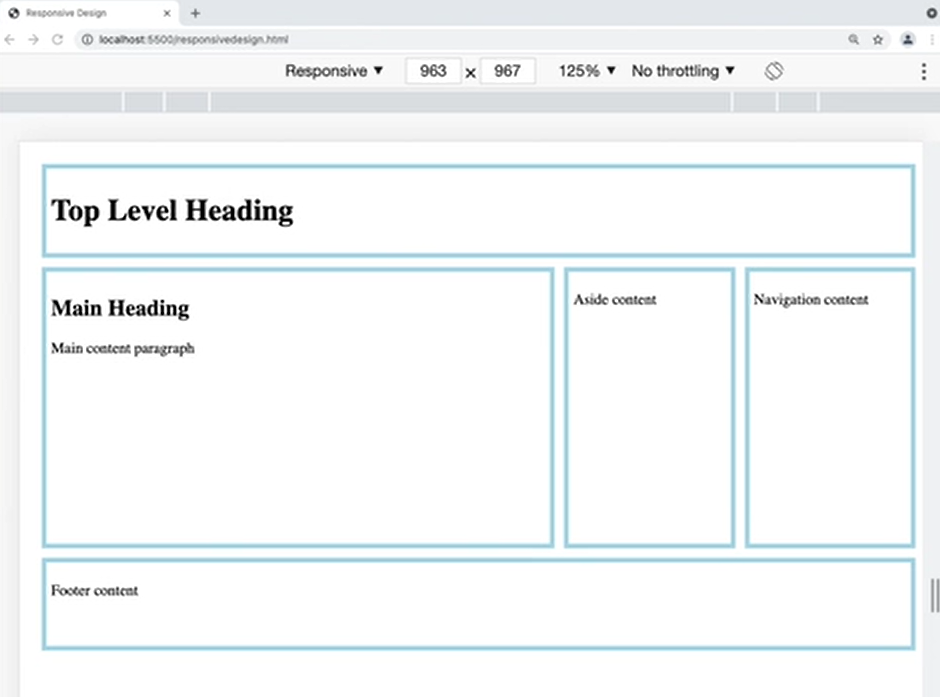

This output looks fine on our system, but our grid layout is not going to make sense on a smaller screen!

- Chrome gives you the option to change your screen size with the development tools

    - How to setup Devtools in Chrome:

        1. Inspect: Ctrl-Shift-I

        1. Toggle devie toolbar: Ctrl-Shift-M 

- Notes: Why do we use Devtools?

    - Speeds up the debugging process

        - Instead of going back and forth between writing code/tabbing to browser/refreshing page to see changes

            - If you are stuck on a tricky bug, the feedback loop is sped up and it helps a lot with speed

    - Visual work in the browser

        - You want to see the results of your changes as quickly as possible

            - Feedback loop is important

        - It is why designing in the broswer is possible

    - Pick apart any website!

        - See how it was made

        - See why browser is rendering the way it is

    - References: 
    
    - https://devtoolstips.org/tips/en/simulate-devices/#:~:text=You%20can%20do%20it%20even,Shift%2BM%20on%20macOS).

    - https://www.youtube.com/watch?v=V8op4qMmSsk

    - https://developer.chrome.com/docs/devtools/open/


- See what happens when you do that, it looks horrible and essentially we are just zooming out:


How to fix this? 

- Go back to HTML and add meta tag: 

    ``` html
    <head>
        <meta 
        name="viewport" 
        content="width=device-width, initial-scale=1" />
        <!-- NoteL This was already here...
        <title>Inheritance</title>
        <link rel="stylesheet" href="styles.css">  -->
    </head>
    ```

    This defines the way that the viewport is going to scale.

    This is a very typical mobile-optimized site's HTML!
    
    We learned about this in the HTML crash course, but reminders: 

    - `<meta>`: Meta tags define metadata about an HTML document

        - Metadata = information about data

            - These always go inside of the `<head>`, since they specify things such as the following: 

                - Character set
                - Page description
                - Keywords/Author
                - Viewport settings

            - Not displayed on the screen, but used by browsers and is machine parsable 

    - `name="viewport"`: Lets HTML know we want a viewport meta tag

        - The browser's view point is the area of the window in which the web content can be seen

            - Often, not same size as rendered page, so browser provides (scrollbars to access all content)

    - `content="width=device-width, initial-scale=1"`: 

        - `width`: Controls the size of the viewport

        - `initial-scale`: Controls the zoom level when the page is first loaded


Now that we have written the right HTML, we need to write responsive CSS!

Adding media queries:

First, what exactly is a media query?

According to Tim:

- Media Query: We want to run some CSS, based on a condition.

    - Usually: These conditions are min/max screen sizes

        - There are more, but not focusing on that now!
        
- My definition: A conditional ie. use this if the condition is TRUE, otherwise ignore this code

Example: 

``` css
@media (max-width: 800px) {
    body {
        grid-template-columns: 1fr; /*Normal value for mobile devices - since they are skinny*/
        grid-template-rows: 1fr 1fr 3fr 1fr 1fr;
        grid-template-areas:
        "header"
        "nav"
        "main"
        "aside"
        "footer";
    }
}
```

In this example, the conditional is that the max-width is `800px` 
("The max width allowed here is `800px`")

- If width < 800px, run this code.

- If width >= 800px, you can ignore this code.

Testing it out:

When we load this in our browser, it looks normal:

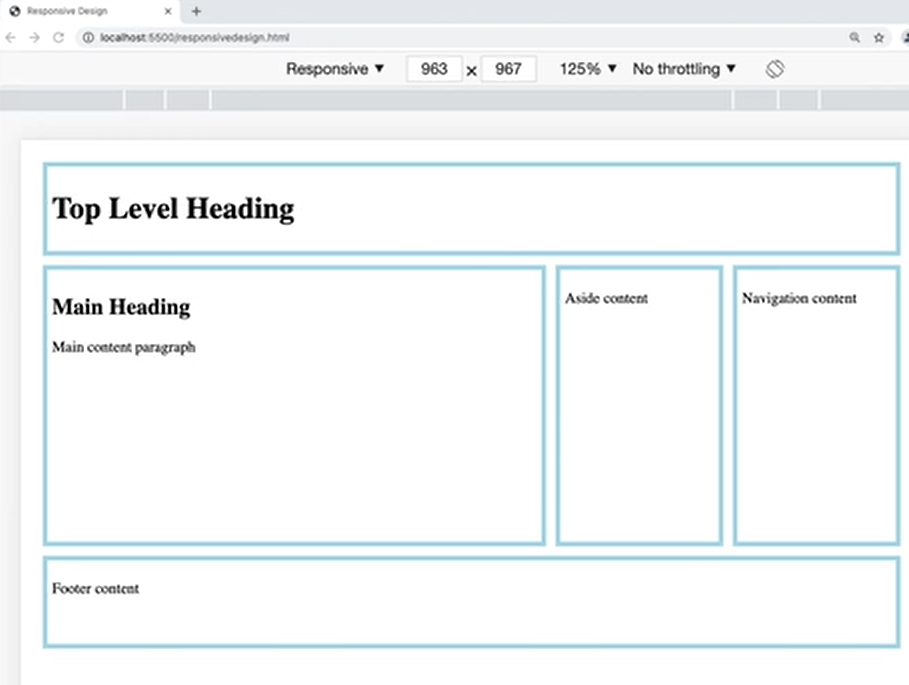

BUT... when we re-size the window to be smaller than `800px`, look what happens!


Notice with the red box, the width dropped below `800px`

This is the power of the responsive design really showing for the first time.

- Note: On smaller screens, we usually use 1 column for the `grid-template-columns` w/ only `1fr` since mobile devices are very skinny


We can also use multiple media queries on the same page, based on different screen sizes

- Make sure to have the numbers descending, as with smaller screens we want to be even more concise

Example: Putting this below the code for the `800px` one:

``` css
@media (max-width: 600px) {
    aside {
        display: none;
    }

    body {
        grid-template-columns: 1fr; /*Not necessary, its the same!*/
        grid-template-rows: 1fr 1fr 3fr 1fr;
        grid-template-areas:
        "header"
        "nav"
        "main"
        /*"aside" Remove this from the areas */
        "footer";
    }
}
```

What is going on here:

- The aside is not that important, so we are not showing it. We do this by the following: 

    - Set `display: none` for the aside

    - Remove the row that was being used by aside in `grid-template-areas`

    - Remove `aside` from the arguments for `grid-template-areas`

    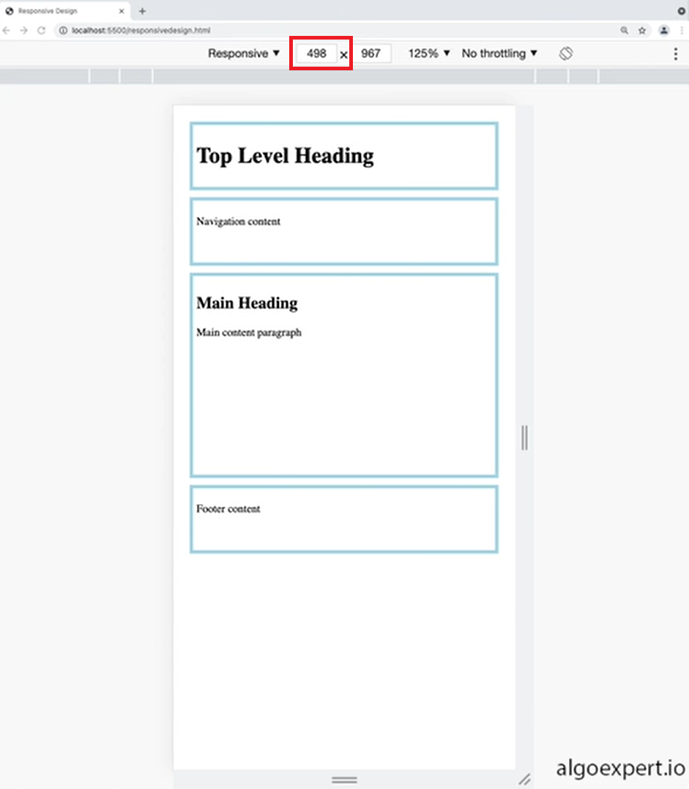

    - Not necessarily a great idea just removing something, but good for demonstrations

        - Should probably show it in a better way next time


General debugging tip: If your media queries are not working, make sure you have the meta tag in your HTML!!

This would not work, for example:

``` html
<head>
        <!-- <meta 
        name="viewport" 
        content="width=device-width, initial-scale=1" /> -->
        <title>Inheritance</title>
        <link rel="stylesheet" href="styles.css">
    </head>
```


Finally, the concept known as Mobile First Design:

What is Mobile First Design?

- First: Build a website that is optimized for a mobile device

- Second: Add media queries to make it work on larger browsers

    - This is not what we did today, but just to note

    - Why do we prefer mobile first design?

        1. It is easier to scale UP then Down

        1. More and more of the internet is being consumed from mobile phones nowadays

How to change what we did today into a mobile first design:

- Put the CSS from the 800px media query into the regular code

- Put the regular CSS code down at the bottom in a media query with the args `min-width: 800px`

    - "If you are larger than 800px, scale up"


Takeaways:
- CSS Media Queries are super powerful
- Use them as often as possible!


# Lesson 17: Animations

The cool animations scattered across the AlgoExpert website that are "pretty neat"... all come from CSS

# Key Terms

## Transitions

A CSS Module for smoothly transitioning between values when a value is changed.

Transitions can be defined with a combinations of these properties: 

- `transition-property`: The name of the CSS property

- `transition-duration`: How long it takes

- `transition-timing-function`: How the transition should progress.

    Can take a variety of keyword values, such as: 

    - `linear`

    - `ease-in`

    - Custom values using `cubic-bezier()` or `steps()`


- `transition-delay`: How long to wait before starting

Alternatively, the `transition` property can be used as shorthand for all of these.

The order: 

1. duration
1. delay
- after that, the order doesn't matter!

Example: This would do the following:
- set the width to smoothly transition linearly
- it would take 1 second
- it would occur 2 seconds after the value is changed

``` css
transition: width 1s linear 2s;
```

Learn more: https://developer.mozilla.org/en-US/docs/Web/CSS/CSS_Transitions

## Animations

A CSS module for animating properties 

- Very similar to transitions, but with more control!

An animation is defined using keyframes, as well as these other properties: 

- `animation-name`: The name of the keyframes animation

- `animation-duration`: How long it will take

- `animation-fill-mode`: If the element should stay in its animated position after the animation completes OR if it should move back to the starting position
    
    - Specified with `backwards`, `forwards`, or `both`

- `animation-direction`: Whether the animation goes in 

    Values: 

    - `normal`
    
    - `reverse`

    - `alternate`: used to switch between `normal` and `reverse`

    - `alternate-reverse`: start w/ `reverse`, end with `normal`

- `animation-iteration-count`: How many times to run the animation

    - `infinite` is an option


- `animation-play-state`: Tells us if the animation is currently `running` or `paused`.

    - Particulary useful for pausing an animation using JavaScript!

- `animation-timing-function`: How the animation should progress through the keyframes.

    Can take keywords, such as: 

    - `linear`

    - `ease-in`

    - Custom values using `cubic-bezier()` or `steps()`


- `animation-delay`: How long to wait before starting


Alternatively, the `animation` property can be used as shorthand for all of these.

The first time value will be used for the duration, the 2nd used for a delay. After that, the order doesn't matter 

- assuming the `animation-name` is not using a conflicting keyword with another possible value

The order: 

1. duration
1. delay
- after that, the order doesn't matter!

Example: This would do the following:
- 2 second delay
- run the move animation over 3 seconds duration
- use the ease timing function
- animation will run indefinitely, alternating order each time

``` css
animation: move 3s ease infinite alternate 2s;
```

Learn more: https://developer.mozilla.org/en-US/docs/Web/CSS/CSS_Animations


## @keyframes

A keyword for defining points within an animation timeline.

An animation is made up of a variety of keyframes

- The browser will fill in spaces between the keyframes based on the timing function

Keyframes are used with this syntax:

``` css
@keyframes animation-name {
    from {
        property: value;
        property: value;
    }

    50% {
        property: value;
        property: value;
    }

    to {
        property: value;
        property: value;
    }
}
```

The `from` and `to` keywords are equivalent to `0%` and `100%`
- `from` = `0%` 
- `to` = `100%`

Learn more: https://developer.mozilla.org/en-US/docs/Web/CSS/@keyframes

# Notes from the video: 

CSS Animations

Example: 

``` html
<!DOCTYPE html>
<html lang="en">
    <head>
        <title>Animations</title>
        <link rel="stylesheet" href="styles.css">
    </head>
    <body>
        <div>Animations</div>
    </body>
</html>
```

``` css
div {
    background-color: lightblue;
    width: 30%;
    height: 6em;
    border-radius: 12px;
    padding: 12px;
    margin: 4em;
}
```


2 ways to create CSS Animation:

1. `Transition` Property - Allows you to transition from one property value to another

Example: Take width and expand to a wider width

- You can make the transition smooth, if you want

2. `Animation` Property - Similar, but gives you more granular control of how things are working


Let's start by making a transition: 

We want the width of this `div` to change once it has been hovered over.

``` css
div:hover {
    width: 50%;
}
```

It works, but looks ugly because it just jumps out to 50% instantly

How do we fix this? 

- Smooth transitions with `transition`:

``` css
div {
    transition-property: width;
    transition-duration: 1s;
}
```

This makes it MUCH smoother than before.


- `transition-property`: Chooses what kind of transition

- `transition-duration`: How long it will take


One top of these 2 properties, there are 2 other properties we can define a transition with: 

- `transition-timing-function`: Defines how exactly it is going to happen

    - `linear`: Perfectly smooth and linear

        - Speed is constant/doesn't change

    - `ease`: Ease into it 

        - Much smoother

    - ``: Maybe something else!

- `transition-delay`: How long we wait until the animation occurs

    - Example: `1s`


You can also simply use `transition`:


``` css
div {
    transition-property: width;
    transition-duration: 1s;
    transition-timing-function: ease;
    transition-delay: 1s;
}
```

``` css
div {
    transition: width 1s ease 1s;
}
```

(These are the same thing)

Next: What if I want to transition more than 1 property?

Example: I want to do the following when hover occurs:
- Change Width
- Transform
    - Moves elements around on the page

``` css
div:hover {
    width: 50%;
    transform: rotate(180px);
}
```

Done, Right? Wrong.

In the div {}, we have only mentioned that we hope to change the width! We need to change the following line of code:

Current state:

``` css
div {
    transition: width 1s ease 1s;
}
```

Fixed (Way #1): 

``` css
div {
    transition: all 1s ease 1s;
}
```

- The `all` tells CSS to listen to every value we want to change 

Fixed (Way #2): 

``` css
div {
    transition: width 1s ease 1s, transform 1s ease 0s;
}
```

- This is more precise

    - Notice how I changed the delay time to 0s for the transform: We have more control doing it this way!

Let's look at it working!


Note: Remember that rotation will happen first, as it has a 0s delay on it.

That's all there is to transitions!
- easy
- straightforward
- very powerful nonetheless

    - Can account for most of the animation-type effects that we would want

        - Especially based on state

            Examples of state: 

            - hover

    - Can also be control by JavaScript

        Example: Button is clicked, add a CSS class to create the transition for us


When we need more granular control + functionality, we will turn to `animation` property!

Note before starting: Remove your code from the examples using transitions:

``` css
div {
    background-color: lightblue;
    width: 30%;
    height: 6em;
    border-radius: 12px;
    padding: 12px;
    margin: 4em;
/* 
    transition: width 1s ease 1s, transform 1s ease 0s;
}

div:hover {
    width: 50%;
    transform: rotate(180deg);
} */
```

Animation in CSS

`animation`: 

    - Uses @keyframes to 

- `@keyframes`: Defines all of different values for the animations at different points in time 


Example of creating an animation that changes halfway (50%) of the way there

``` css
@keyframes move {
    50% {
        transform: translate(200px, 0px);
    }

    100% {
        transform: translate(200px, 300px);
    }
}
```

Note: This animation will do the following: 
- halfway there: `translate` will  

    - It has capabilities to move the element in both the x/y direction

- all the way there: `translate` will move the element in both the x/y direction

Don't forget to go back up to `div` and add the `animation` property so that `div` will listen to the @keyframes and know what to do!

``` css
div {
    animation-name: move;
    animation-duration: 3s;
}
```

Results: 

Start: (0% there):


Step 1 (50% there): 


Step 2 (100% there): 

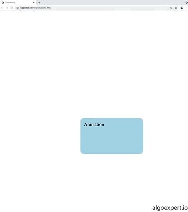

Nicely done! The animation returns to where it started

- What if we want the element to stay over there in the bottom right?

    - This is where `animation-fill-mode` comes in 


Example code: 

``` css
div {
    animation-name: move;
    animation-duration: 3s;
    animation-fill-mode: forwards;
    animation-direction: reverse;
    animation-iteration-count: 2;
    animation-play-state: running;
}
```

Once I hover over this elements, it will go from the end point to the start point (2x)

- It kinda teleports back to the end point between iteration 1 and 2, that is ugly, note for later I guess

Explanation of properties/variables:

- `animation-fill-mode`: Allows us to choose if the elements stays where it ends, or goes back to where it started

    - `forwards`: Starts and ends like normal 

    - ``: 

- `animation-direction`: Chooses if the element goes from start > end, or end > start

    - `reverse`: Starts at endpoint, ends at startpoint 

    - ``: 

- `animation-iteration-count`: How many times to run the animation

    - 3: Will go back/forth 3 times, then stop animating

    - `infinite`: Keeps going as long as page is open/CSS is running

- `animation-play-state`: How many times to run the animation

    - `paused`: Will pause if we stop hovering

    - `running`: Will keep going if we stop hovering

    - Note: Super useful with JavaScript 

        - If we ever have a button we want users to click to to stop animation

            - We don't use this directly in CSS much (if we don't have JavaScript to change the value, its just not going to work OR be in default state of `running`) 

Just like transitions, we can set a timing function:

- `animation-timing-function`: Works same way as with transitions

    - `linear`: works as usual
    
    - `ease`: works as usual

    For the special ones...

    - `cubic-bezier()`: A function on the x/y plane

        - The steeper the slope, the faster the animation will run at that point of the animation

            Example: (Note, it takes 2 sets of x/y pairs)

            ``` css
            div {
                animation-timing-function: cubic-bezier(0.2, 0.6, 0.6, 0.2);
            }
            ```

            - Don't worry about this much, just know what it is

                - You won't usually derive this by hand

    - `steps`: How many steps should be taken to between the values (rather than a smooth transition)

        - It glitches around the screen in steps 

        Example: 

            ``` css
            div {
                animation-timing-function: steps(3);
            }
            ``` 

Finally, looking at shorthand notations: 

- `animation`

``` css
div {
    animation: move 3s forwards reverse 2 running steps(3);
/* 
    animation-name: move;
    animation-duration: 3s;
    animation-fill-mode: forwards;
    animation-direction: reverse;
    animation-iteration-count: 2;
    animation-play-state: running;
    animation-timing-function: steps(3); */
}
```

- `@keyframes`: Can use the following shortcuts if you want: 

    - `to` = `100%`

    - `from` = `0%`

Two examples that are the exact same:

``` css
@keyframes move {
    50% {
        transform: translate(200px, 0px);
    }

    100% {
        transform: translate(200px, 300px);
    }
}
```

``` css
@keyframes move {
    from {
        transform: translate(0px, 0px);
    }

    50% {
        transform: translate(200px, 0px);
    }

    to {
        transform: translate(200px, 300px);
    }
}
```

Well, that's it for Animations!
- "Incredibly powerful tools with just CSS alone"


# Lesson 18: CSS Variables

You can declare variables in CSS
- I had no idea

# Key Term

## Custom Properties

(Also known as variables)

Used to keep track of repeated values in CSS

- Custom variables start with `--` and can be included in any ruleset

- Most commonly: They are defined on the `:root` ruleset so the variables will be accessible throughout the website

- Custom properties are then used with `var()` CSS Function

Example: This code defines a custom property called `--main-color`, and uses it for a background color!

``` css
:root {
    --main-color: #00334C;
}

main {
    background-color: var(--main-color);
}
```

Learn more: https://developer.mozilla.org/en-US/docs/Web/CSS/Using_CSS_custom_properties

# Notes from the video: 

Starting Example:

HTML:

2 Main Sections: 

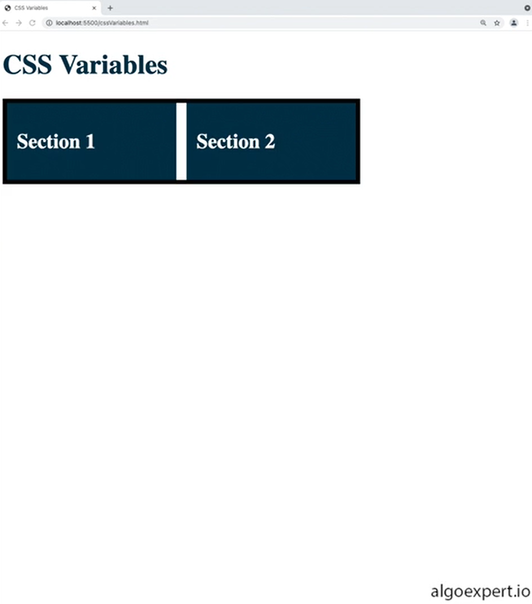

CSS Code: 

``` css
h1 {
    color: #00334C;
}

h2 {
    padding: 12px;
    color: white;
}

main {
    display: flex;
    border: 5px solid black;
    gap: 12px;
    width: 412px;
}

section {
    flex-basis: 200px;
    flex-shrink: 0;
    flex-grow: 0;
    background-color: #00334C;
}
```

Explanation: 

Header 1's
- Dark blue text

Header 2's
- Padding
- White text

Main
- Flextable
    - becomes the flexbox container w/ flex items inside
- Black border
- 12px Gap between elements
- Width of 412px

Section
- flex-basis of 200px
    - ie. Sets the initial size of the flex item along the main-axis (width in this case)

- flex-shrink of 0
    - ie. Flex item will not shrink

- flex-grow of 0
    - ie. Flex item will not grow

- Dark blue background color

We proceed...

What issues do we see with this CSS file?

1. The same color is repeated in `h1` and `section`

Just like in regular coding, we don't want to re-write any code 

- It is bad practice

- Remedy: Use a global variable

2. Hard coding `412px` in `main`
This isn't inherently bad, but when you know that reason why it is:

We have 2 sections, both are 200px: 200px*2 = 400px

We also have a gap between the 2 section: 1*12px = 12

Add these together: `412px`

- Remedy: Use a global variable 


How to make a global variable?

`:root` psuedo-class
- It makes variables accessible throughout the whole document

    - We could also use `html` tag, but this is better right now

``` css
:root {
    --main-color: #00334C;
}
```

Now that we have this main color, change the prior CSS Code in `h2` and `section` to reflect the change:

``` css
h1 {
    color: var(--main-color);
}

section {
    background-color: var(--main-color);
}
```

Change the main color and see what happens!

``` css
:root {
    --main-color: pink;
}
```

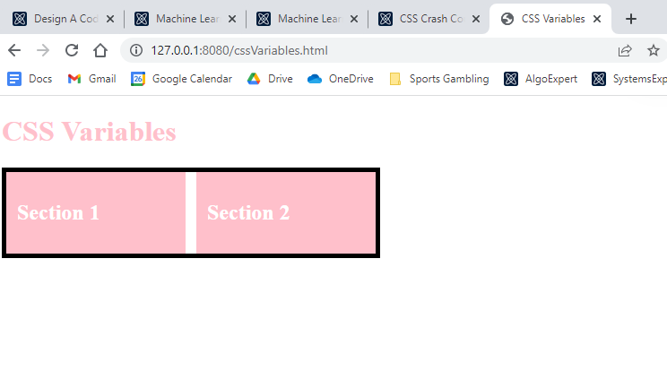

Perfecto!

Next issue: Where we hard-coded values for width:

``` css
:root {
    --section-size: 200px;
    --flex-gap: 12px;
}

main {
    gap: var(--flex-gap);
    width: calc((var(--section-size) * 2) + var(--flex-gap))
}

section {
    flex-basis: var(--section-size);
}
```

The output looks the exact same now.

Note: Make sure to wrap equations and global/root variable with `calc()`


Let's change the size of `--section-size` and `--gap-size` and see what happens~

``` css

```


Perfecto!

One last thing:

If we changed `:root` to `main`, it would only affect things inside of the `main` tag.

``` css
main {
    --main-color: purple;
    --section-size: 300000px;
}
```

Actual last thing:

Something that comes with CSS by default is `:root`, there are other options that we won't cover.


# Lesson 19: Frameworks and Preprocessors

Frameworks and preprocessors are like super steriods for your style sheets

Use them! (Your code will be unstoppable)

# Key Terms

## CSS Framework

Pre-written code that can be used to simplify development.

Oftentimes, these include:

- Ready to use classes

- Pre-built components

- Responsive layout systems

## Preprocessor

A program that converts code of another syntax into CSS that the browser can understand.

Usually, these add new features to CSS to make the code...

- Easier to read

- Easier to write

- Easier to maintain


# Notes from the video: 

Frameworks vs. Preprocessors

Framework: Pre-written code

Preprocesso: Add language functionality


To set expectations:

- We won't discuss individual frameworks

- High level similarities and differences

Oftentimes, you hear framework as a generic term, but there are 2 categories of tools we are discussing here.

1. Frameworks: Pre-written code to speed up development 

- Pre-written stylesheets

- Pre-written components 

2. Preprocessor: Adds funcionality to the language 

- Converts another language of code into CSS

- Adds nice features and speeds up development

- Good Quality code


Examples of common frameworks: 

Tailwind: Customizable utility classes to use in HTML for pre-made CSS

- Used very frequently throughout the industry

Example: Create classes for us of each of the different background colors we may be using on our website

- Then, add those classes to the HTML elements that need them
    
    - They will have the background color (we won't need to write CSS manually)

- Results of tailwind:

    - Don't need to write much CSS Code at all

    - Easy to build design that are responsive 

        - The styling information being inside of HTML may turn some users away (HTML files can get harder to read)


Bootstrap: Responsive pre-built components, grid layout system

- Arguably the most popular CSS Framework
    
    - Developed by Twitter to develop consistent designs that are responsive 

    - Comes with a variety of components to quickly make a professionally viable website w/ little effort

    - Due to its popularity, you may want to be careful using its components (it will look basis)

- Has an extremely powerful grid layout system
    
    - Somewhat similar to CSS's built-in version

    - Makes building high quality layouts extremely easy

- Another downside: You have to add a large CSS file to your webiste

    Results of this:

    - Slow page loading times

    - Difficult to customize components

        - You might need to do searching to see what to override


Materialize: Follows Google Material UI Design System

- Similar to Bootstrap

- Google Developers were inspired by concept of paper and ink

    - Focus on making design that felt familiar, even when on a screen

        - This design system has been extremely successful for Google

- Comes with many pre-built responsive components that you can use directly in your website.

    - Good for a professional feel right out of the box

- Drawbacks: 

    - Websites need to follow Google Material UI Design System

        - Throughout, so there is consistency with components

        - Also its biggest strength

    - In general, still a well-thought out design 

        - Be conscious/careful of being consistent with their principles


Foundation: Highly flexible UI components

- Grid system for responsive design 

- Easier to customize than the other frameworks

    - Remember: The deciding factor is which is best for YOUR use-case, so this doesn't necessarily matter


Bulma: CSS only framework

- Most CSS Frameworks require that you have some of their JavaScript code on your website 

    - Bulma doesn't do this

        - They are less opinionated about the implementation of your components

        - Purely is focused on assisting with styling!

- Least popular on the list

    - More work to get up and running. 

        Why?

        - Writing more Javascript code than other options


Takeaway from this section:

- These are just a few of the frameworks out there

- Tons more to explore

    - Beware: Many are similar, so these got popular for a reason (they are the best!)


Common Preprocessors

Note before starting: 
- Not as many out there

    - Still tons of options


Sass: Langauge extension of CSS

- By far the most popular 

- Provides its own syntax

    - Good for more functionality

- Examples for what it has:

    - Variables
    
    - mixins
    
    - @extends
    
    - nesting
    
    - looping


Less: Similar to Sass

- Easy to learn

- Comparison to Sass:

- JavaScript based while Sass is Ruby

- Less popular than Sass

- They both have similar features


Stylus: Similar to Sass, just different syntax

- Focuses on making the syntax simple

    - All punctuations marks are optional

        Examples: 

        - braces

        - colons / semi-colons

        - commas


- Appealing for those with Python background

    - CSS becomes much more similar to Python when you use Stylus Processor


PostCSS: Highly customizable plugin collection

- JavaScript based

- Much different option

    - High focus on customization

- Comes with a lot of plugins

    - Can choose which ones you want to use to transform your CSS

        - This is almost like building your own preprocessor for your specific project

            Example: Parse your CSS and make it work on various version of browsers


When should I use these??

Frameworks: It depends

Good: 
- For small teams
- For quick development
- If you want to focus on features

Bad:
- If you want to re-invent the wheel
- There is value in building out your own components to have your website feeling unique

Overall:
- Many large companies still use frameworks
- Make sure you are putting in the substantial work to customize to have it fit with your own style


Preprocessors: Almost always yes!

Good: 
- Sass is great
    All of them do the following:
    - Easier to write
    - More maintainable 
    - Less likely to contain bugs

Bad:
- Nothing wrong with using normal/pure CSS
- New CSS coders may want to learn it better by doing all of this by hand
    - Tools can steal learning exp.


# CSS Methodologies And Best Practices

Congrats, you're almost there

Final video: 
- Advanced methodologies
- High-level concepts

Now we will know how to write good CSS!

# Key Terms

## BEM - Block, Element, Modifier CSS methodology

Breaks CSS Classes into 3 categories: 

1. Blocks: Standalone elements with their own meaning.

- Referenced simply by the name of the block

    Example: `class="menu"`

1. Elements: Parts of a block without their own meaning.

- Referenced by the name of the block, two underscores, then the name of the element

    Example: `class="menu__item"`

Modifiers: Flags to change styles for blocks or elements, such as *disabled* or *selected*.

- These are prefixed by the class they modify and two dashes, and they are included in addition to that original class.

    Example: `class="menu menu--disabled"`


## OOCSS - Object Oriented CSS Methodology

Based on object-oriented programming principles

- Can be applied to CSS Class Design by treating UI components as objects.

    Styles are the given one of the two categories:

    - Structure: "Invisible" properties such as width/margin

    - Skin: "Visible" properties such as color/border

Along with separating structure and skin into classes, OOCSS makes a clear distinction between **content** and **containers**

- Containers should function the same (Regardless of the content inside of them)

- Content should not depend on the container it is nested within


## Atomic CSS 

A CSS Methodology based on the idea of minimizing any repeated declarations

- Rather than creating classes based on components, Atomic CSS creates utility classes based on single declarations

    Example: in an Atomic CSS, a "margin-12" class might be created that adds 12 pixels of margin

    - Rather than including that declaration on ALL of the components needing 12 pixels of margin

    - **Stack overflow**: "Atomic operation" means an operation that appears to be instantaneous from the perspective of all other threads. You don't need to worry about a partly complete operation when the guarantee applies.

## SMACSS - Scalable and Modular Architecture For CSS

Note: SMACSS aka "Smacks"

Methodology that splits CSS into 5 different categories, each of which get their own file: 

- Base: Page defaults

    - Usually just type selectors

- Layout: Major structural layout of the page, using ID and class selectors

    - Classes are prefixed with `l-` or `layout-`

        Example: Navigation element might have the class `l-nav`

- Module: Smaller re-usable components

    - Usually using class selectors without any name prefixes

- State: Specific states for layouts or modules

    - Usually using class selectors

        Examples: `disabled`, `selected`

- Theme: Style rules for layouts and modules related to a theme

    - Oftentimes, based on user preferences ie. dark mode

## ITCSS - Inverted Triangle CSS Methodology

Methodology that mostly focuses on the order of CSS Code, rather than having opinions on naming conventions.

Primary idea here: Have generic styles, which should have the largest reach across elements and the least specific selectors.

- The exact layers of the triangle can be changed to fit the needs of a specific project

General structure looks like this: 

- Settings: Global variables affecting the entire website

- Tools: Mixins and functions for use with preprocessors

- Generic: High level generic styles

    - Usually to reset browser defaults for consistency across browsers

- Elements: Defaults for elements using type selectors

- Objects: The most generic classes

    - Oftentimes, for larger containers

- Components: Classes for individual UI components

- Trumps: `!important` overrides

    - Only use when they are needed!

# Notes from the video: 

CSS Methodologies and Best Practices

Ultimate Goal: What is good CSS?
- How do we write CSS that scales to large projects, but still is easy to maintain

Common Themes Across: 

Stay consistent:

- Should be easy to find code in your codebase

- You should assume classes exists for a given components

Keep separation from HTML: 

- Minimize how much we intrude on HTML

- Optimal outcome: We have an HTML file that looks like raw markup

    - No style information whatsoever

        - Many methodologies sacrifice this (for other benefits)

Focus on responsive design:

- Avoid using absolute values

- Will ensure our websites probably scale regardless of website

Respect the cascade, avoid `!important`:

- This will prevent us from writing "CSS hacks"

    - There is usually a better solution

    - Some methodologies will solve this by minimizing the difference in specificities in selectors

        - We can also ensure that we are using cascading + specificity rules as they were intended by CSS Spec

Don't repeat your code ie. use variables, group similar components: 

- DRY = Don't repeat yourself!

    - "There’s also a general principle called the Rule of Three. Martin Fowler popularized it and attributed it to Don Roberts. It basically states that two instances of duplicate code don’t require refactoring. But when you need to repeat the code a third time, then it’s time to refactor the code into an abstraction."

- Use variables for repeated styles

- Group similar components w/ common classes


Specific Implementations w/ Methodologies:


## BEM - Block, Element, Modifier CSS methodology

Breaks CSS Classes into 3 categories: 

1. Blocks: Standalone elements with their own meaning.

- Referenced simply by the name of the block

    Example: `class="menu"`

1. Elements: Parts of a block without their own meaning.

- Referenced by the name of the block, two underscores, then the name of the element

    Example: `class="menu__item"`

Modifiers: Flags to change styles for blocks or elements, such as *disabled* or *selected*.

- These are prefixed by the class they modify and two dashes, and they are included in addition to that original class.

    Example: `class="menu menu--disabled"`

    You can also do this with the menu__item:

    Example: `class="menu__item menu__item--selected"`


Upsides of BEM: 

- It makes our CSS very easy to write and maintain

- Only using classes helps to avoid issues w/ specificity

    - By making every selector in CSS a class, every selector has the same specificity!

Downsides of BEM: 

- Causes our HTML to get pretty long 

    - Verbose class names like `class="menu__item menu__item--selected"` don't help!

- It does restrict our code 


## OOCSS - Object Oriented CSS Methodology

Components as "Objects"

- Structure: "Invisible" properties such as width/margin

- Skin: "Visible" properties such as color/border

Content vs. Containers

- clear distinction between **content** and **containers**

    - Containers should function the same (Regardless of the content inside of them)

    - Content should not depend on the container it is nested within

Upsides of OOCSS
- 

Downsides of OOCSS:
-  Lots of small classes
    - Makes HTML code less readable 
    - Similar to BEM

## Atomic CSS 

Concept: Avoid any repeated declarations

- Make classes for them

    - Many single declarations

    - Names based on function

Example: Paragraph with
- Medium-Sized Text
- Blue Font
- 12px of margin

``` css
class="text-med text-blue margin-12"
```

Good for: 
- DRY CSS (no repeats)
Bad for: 
- Separating CSS from HTML


## SMACSS - Scalable and Modular Architecture For CSS

Note: Might not need all 5 for every project

Splits CSS into 5 different files: 

- Base: Page defaults

    - Usually just type selectors

- Layout: Major structural layout, using ID and class selectors
    - Classes are prefixed with `l-` or `layout-`
        Example: Navigation element might have the class `l-nav`

- Module: Smaller re-usable components
    - Usually using class selectors with no name prefixes

- State: State for layouts or modules
    - Usually using class selectors passed with `is-`
        Examples: `is-disabled`, `is-selected`

- Theme: Style rules for modules/layouts related to a theme
    - Oftentimes, user preferences ie. dark mode
        - Many websites won't need this at all

## ITCSS - Inverted Triangle CSS Methodology

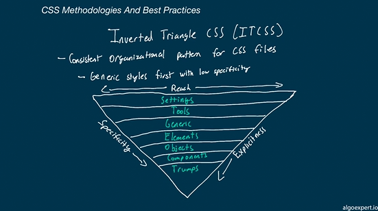

About ordering of CSS Code
- Not opinions like naming conventions

Primary idea: Start with generic selectors
- They will reach the most elements on the page
    - Hence, the top of the triangle having the longest reach


General structure: 

- Settings: Global variables affecting the entire website
    - Has the most reach
        - Least Specific / Least Explicit

- Tools: Mixins and functions 
    - If you are using a preprocessor that supports those

- Generic: Generic layer
    - "High level generic styles"
    - Usually to reset browser defaults
        - Ensures consistency across browsers

- Elements: Type selectors

- Objects: The most generic classes
    - Oftentimes, for larger containers

- Components: Holds style for individual UI components
    - A majority of our CSS goes here

- Trumps: `!important` overrides
    - Make SURE they are at the bottom
        - Only use when they are needed!

Takeaways: 
- These are not the only layers possible for the triangle
    - Principle of organization would still apply w/ more or less

More Takeaways on this entire chapter: 
- Following a CSS Methodology can be a great way to ensure you have consistent/scalable CSS Code
- At the same time, don't feel restricted!
    - Many projects will combine between methodologies
        - Whatever makes sense for your use case, and this is OK!


Performance Concerns
(in other words: how to minimize page load times)

- Know that rowsers read CSS from right to left:

    Example: `#specific > p`

    - The browser will look at every paragraph in the entire page!

- Avoid expensive properties
    - ID's are the fastest, but that would be horrible code
        - Hard to maintain

    Examples to avoid:
    - `box-shadow`
    - `transform`
    - `position: fixed`
    - `:nth-child`
    - etc.

    - Note: Browsers are really fast, so don't worry too much about this
        - Difference between performance of selectors usually is not a big deal in the modern web
        - Prioritize clean code!

- Avoid unused code
    This does the following:
    - Wastes the browser's time
    - Increases file size

    This sounds simple but happens in a couple of ways:
    - Deleting HTML code, then deleting to delete the CSS it was related to
    - When a website gets extremely large and has all its CSS in one file
        Example: Amazon
        - If Amazon gave all of its code to the browser at 1 time, it would take forever to load

Learning point: Only give the browser the CSS Code that you need at the given time ie. the page you are currently on!
- Or, components/pages the user is likely to navigate to soon

- Minimzize CSS Files
    - These will remove whitespace and other wasted characters
        - Keeps file sizes smaller
        - Important for larger projects
            - Particularly if using a framework like Bootstrap

- Defer non-essential CSS 
    - It will prevent render blocking 
        - Note: What are render-blocking resources? Render-blocking resources are portions of code in website files, usually CSS and JavaScript, that prevent a web page from loading quickly.

        - If we have styles that are not necessary on the initial page, place them in another file and defer loading them
            - Example: Styles for mobile page 

            - There are a few ways to do this, but they're all a bit "hacky":
            1. Change relationship from stylesheet to pre-load
            - Tells the browser to load this in as soon as possible
                - Then we incldue `as=` so it knows it is a style sheet

            ``` css
            <link rel="preload" as="style" href="styles.css" onload="this.onload=null; this.rel='stylesheet'" />
            <noscript>
                <link rel="stylesheet" href="styles.css">
            </noscript>
            ```

Closing Thoughts
- There are other methodologies out there, but they all tend to cover the same principles
- Performance is not as important due to the modern web
    - This micro-optimizations do absolutely nothing usually
        - Not worth sacrificing trade-offs like code maintainability

Note: Right before JavaScript Crash Course, I decided to put figures in their own modules...

---
# JavaScript Crash Course

# Lesson 1: Introduction

JavaScript is the 3rd (and arguably most important) pillar of the holy trinity of the modern web

Master it and you can breathe life into any webpage!

# Notes from the video

JavaScript
- Primary programming language of the web
- Resembles a lot of other languages
    - Java/Python
    - Has a ton of unique properties too 
        - Can really set you apart as a frontend engineer

Something different about JavaScript: Usually executed inside of the user's browser
- Other languages we run on our local computers...

Because of this:
- Pros:
    - Unique set of features we can take advantage of 

- Cons: 
    - Need to be aware of limitations of browsers

        Example: Event Loop
        - JavaScript all executes in a single thread
        - Browser uses an "event loop" to mimic concurrency
            - Understanding how this event loop works is incredibly important for interacting with asynchronous programming
                - Need it for working with APis

Note: Asynchronous programming = allows you to start a long-running task and still be responsive to other events while that task runs (rather than having to wait until that task has finishes)

Starting out: 
- Syntax
- Types
- Operators

Next - Nuanced: 
- Model for Object Oriented Programming
- How closures are used for scoping of identifiers

Last: 
- Work with browser to manipulate the document to create interactive webpages that respond to user input and communicate w/ the server 

Prepare of frontend interviews: 
- Deep knowledge of JavaScript is the most important skill
    - Very likely you will have to implement functions (just like questions on this FrontendExpert site)
    - Questions will test your understanding of his topics
        - Almost impossible to solve without specialized knowledge of how JavaScript language is working 

Also, you may be asked to write JS to add functioality to webpage
- Not to test knowledge, but practical knowledge

JS is very important!!

# Lesson 2: JavaScript Basics

# Key Terms

## JavaScript
The primary programming language of the web
- Primarily used for adding functionality to websites
- General purpose, multi=paradigm programming language with dynamic typing

Learn more: https://developer.mozilla.org/en-US/docs/Web/JavaScript

## Paradigm
A style of programming
- Oftentimes: languages are built with a specific paradigm in mind
    - Javascript is known as a multi-paradigm langauge (because it allows for programming in a variety of paradigms)

Major paradigms include:

- Event-driven: Functions can be made to respond to events
    - ie. when a user clicks on a an element or scrolls down the page

- Functional: Functions can be written as "pure functions" 
    - ie. functions will always have the same output for a given set of arguments
    - Support for first class and higher order functions:
        - First class functions: 
        - Higher order functions: This means that functions can be treated as normal values, passed as arguments to other functions and returned from functions 

- Object-oriented: Objects can be created as custom data stroes that inherit from each other

- Imperative: Programs can be written by explicitly describing the control flow 
    - loops/conditionals

- Declarative: Describing desired output (with implicit control flow)
    - Oftentimes: Associated with functional programming 
        - ie. using the forEach function to loop over an array, instead of a for-loop

## Primitive
The most basic data types of a language. In Javascript, there are 7 primitive types:

- Number: Numeric values
    - no difference between int/floats (integers/decimal values)
- BigInt: Integers too large to store in a number
    - Not used often
- Boolean: true/false
    - keywords in lowercase
- String: Sequence of characeters
- Symbol: A dynamically generated unique value
- Null
    - must be assigned (no value)
- Undefined
    - value has not been assigned at all

Note: JS has a `typeof` operator that can get the type of a value as a lowercase string
- Beware: This function has some special casing
    - example: `typeof function` will return "function" even though functions are just objects

Learn more: https://developer.mozilla.org/en-US/docs/Glossary/Primitive

# Notes from the video

Javascript is constantly evolving
- ECMAScript: standardized version

Javascript engine:
- Executes code in the browser
- Just in time complication (interpreted)
    - Better performance

Examples shown in the video:

### Numbers

``` js
// create a variable
// dynamic typing: you do not need to specify the type of value
let num = 10; // semicolon denotes end of line, optional (although you should use them)

// print
console.log(num);

// const = same as let, but you cannot change the value after the fact!
const num2 = 20;
// num2 = 999 this would be an error...
console.log(num2);
```

``` js
let num = 10.5;
let strNum = '10px';
console.log(Math.random());
console.log(Number(strNum));
console.log(parseInt(strNum));
```

``` js
let num = 10;
console.log('10' == num); //compares value
console.log('10' === num);//compares value AND type
```

``` js
// powers
let num = 10.5;
console.log(Math.pow(2, 3))
```

``` js
console.log(10 ** 'a'); //nan
console.log(Infinity); //infinity
console.log(-Infinity);//negative infinity
console.log(BigInt(100));//100n
console.log(100n);//100n
```

``` js
console.log(typeof 100); //number
console.log(typeof 100n);//bigint
```


### Strings

``` js
let str = 'abcd';

console.log(str); //abcd
console.log(str + 'efg'); //abcdefg
console.log(str + 1); //abcd1

console.log(str == 'abcd');   //true
console.log(str == 'abcd123'); //false
```

``` js
//template literal
console.log(`
Hey
Myles is ${23}
Newline
`)
```

``` js
let str = 'abcd';

console.log("Long string\
keeps going") //long stringkeeps going
```

``` js
let str = 'abc';

console.log(str[0]);
console.log(str.charAt(0));
console.log(str[1]);
console.log(str.charAt(1));
console.log(str[2]);
console.log(str.charAt(2));
```

``` js
let str = 'abc';

console.log(str.includes('a')); //true

console.log(str.includes('z'));//false
console.log(str.startsWith('z'));//false
console.log(str.endsWith('z'));//false
```

``` js
let str = 'abc';

console.log(str.toUpperCase()); //ABC
console.log(str.toLowerCase()); //abc
```

``` js
let str = 'abcdefg';

console.log(str.substr(1));   //bcdefgf
console.log(str.substr(1, 2));//bc

console.log(str.slice(1));   //bcdefgf
console.log(str.slice(1, 2));//b
```

``` js
let str = 'abcd';

console.log(str.padStart(3, '-')); //length of  3 min: abcd
console.log(str.padStart(10, '-'));//length of 10 min: ------abcd

console.log(str.padEnd(3, '-')); //length of  3 min: abcd
console.log(str.padEnd(10, '-'));//length of 10 min: abcd------
```

``` js
let str = '                   abcd';

console.log(str.trim()); //abcd
console.log(str.trimStart()); //abcd
console.log(str.trimEnd()); //                     abcd
```

``` js
let str = 'a,b,c,d';

console.log(str.split(',')); // returns list/array of [a,b ,c,d]
```

### Objects

``` js
//brackets: key-value pairs
//(you can re-assign values of const person, but not person)
const person = {
    name: 'Conner',
    course: 'FrontendExpert', // good practice is leaving the trailing comma!
}

console.log(person); //{ name: 'Conner', course: 'FrontendExpert' }
console.log(typeof person); //object


console.log(JSON.stringify(person)); //{"name":"Conner","course":"FrontendExpert"}
console.log(typeof JSON.stringify(person)); //string

console.log(JSON.parse(JSON.stringify(person))); //{ name: 'Conner', course: 'FrontendExpert' }
console.log(typeof JSON.parse(JSON.stringify(person))); //object

console.log(person.course); // frontendexpert

person.name = 'Myles';
console.log(person.name); //Myles
```

``` js
//Create new map
//Map: works similarly to a standard object
// - difference: Map has the following:
//     - functions for getting keys/values
//     - not restricted to keys of strings/symbols
const map = new Map();

map.set(123, 'hello');
console.log(map); //Map(1) { 123 => 'hello' }


console.log(map.get(123));

map.set(456, 'world');
console.log(map);//Map(2) { 123 => 'hello', 456 => 'world' }
console.log(map.size);//2

console.log(map.get(698888));//undefined
```

``` js
//Sets
// - only have unique values (un-ordered list)
const set = new Set();

set.add('hello');
set.add('world');
set.add('world'); // does nothing!

console.log(set); //Set(2) { 'hello', 'world' }
console.log(set.has('blah blah'));//false
console.log(set.size);//2

set.delete('hello');
console.log(set); //Set(1) { 'world' }
console.log(set.has('world'));//true
console.log(set.size);//1
```

Note on Set/Map:
- Usually used: Objects and arrays
- Sometimes: Set and Map
    
    If you need the following:
    - keys that are not strings


### Arrays

Note: Under the hood, arrrays are objects.

``` js
const arr = [1,2,3];

console.log(arr); //[ 1, 2, 3 ]
console.log(arr[0]); //1

arr.push(402020);
console.log(arr.length); //4

console.log(typeof arr); //object
```

### Functions

``` js
function addTwo(num = 99) {
    return num + 2;
}

console.log(addTwo(3)); //5
console.log(addTwo()); //101
```

Notes:
- Functions can be passed around like standard values
- Functions are objects

``` js
function addTwo(num = 99) {
    return num + 2;
}

function callFunc(func, param) {
    console.log(func(param));
}

callFunc(addTwo, 10);//12
```

``` js
function addTwo(num = 99) {
    return num + 2;
}
// it is both an object and a function...
console.log(typeof addTwo);//function
console.log(addTwo instanceof Object); //true
```


### Looping


``` js
// For loop
for (let i=0; i < 4; i++) {
    if (i==1){
        continue;
    }
    console.log(i);
} //0,2,3
```

``` js
//While loop
let i = 0;
while (i < 4) {
    console.log(i);
    i ++;
} //0,1,2,3
```

Note: This is an interesting way of having the code run BEFORE it checks the condition.

``` js
// Do loop
let i=0;
do {
    console.log(i);
    i++;
}
while (i < 0); //0
```

``` js
// For-of loop
for (const value of 'abc') {
    console.log(value);
}//a,b,c
```

``` js
const obj = {
    name: "Myles",
    course: "FrontendExpert",
}

for (const key in obj) {
    console.log(key);
} //name,course

for (const key in obj) {
    console.log(obj[key]);
} //Myles, FrontendExpert

for (const key in obj) {
    console.log(key, obj[key]);
} //name Myles, course FrontendExpert
```

``` js
// forEach loop (with arrays)
[1,2,3].forEach(function(value) {
    console.log(value);
})//1,2,3
```

Note above:
- Functions was passed in as a parameter
    - Anonymous function syntax: We did not give it a name


### Conditionals


``` js
const condition = false;

if (condition) {
    console.log('it was true!');
}
else if (condition === false) {
    console.log('it was false!');
} else {
    console.log('default');
}
```


``` js
// Switch statements
const myNum = 2;

switch (myNum) {
    case 1:
        console.log('it was 1');
        break;
    case 2:
        console.log('it was 2');
    default:
        console.log('default (it gets here even if 1 or 2)');    
}
```


``` js
const myNum = 10;

console.log(myNum > 5 ? 'Greater than 5' : 'Less than 5');
// ? meaning: if
// : meaning: else 

```


### Error Handling

``` js
throw new Error('oh no'); //throws error and does not run

console.log('we do not end up getting to this line of code...');
```


``` js
try {
    throw new Error('oh no');
} catch (error) {
    console.log(error);
}

console.log('error was caught, but code still runs after!');
```

### Comments


``` js
// Single line comment
```


``` js
/*
Multi
line
comment
*/
```


### Console function

``` js
console.log('value'); //prints regular 'value'
console.error('error message'); //prints in red
console.debug('debug message'); //rarely used

console.table(
    [[1, 2], 
    ['hello', 'world']]
)

console.count() // 1
console.count() // 2

console.countReset();
console.count(); //1

// different counts for different values
console.count(); //2, because default is already at 1
console.count('hey'); // starts new at 1

console.time();
console.timeLog(); // very short time
console.timeEnd(); //can also use this to reset the default..

console.time('longer');
for (let i=0; i < 100000000; i ++) {
    continue;
}
console.timeLog('longer'); // longer time

// Trace: logs out where we are in the code
function foo() {
    console.trace();
}
foo();
```


### Strict mode

Put this string at the top of your file:

``` js
'use strict';
```

What this does:
- Code is executed in slightly stricter manner
    - Finds bugs for us

Note: can also be used at the function level

``` js
function foo() {
    'use strict';
    x = 5;

}
foo();
```

# Lesson 3: Variables and Scoping

What do you call something that is both a paradox and a misnomer
- a constant variable

# Key Terms

## let
A keyword for declaring a block-scoped variable 
- Cannot be accessed before initialization

Learn more: https://developer.mozilla.org/en-US/docs/Web/JavaScript/Reference/Statements/let

## var
A keyword for declaring a function-scoped variable
- Automatically initialized to `undefined` when it is hoisted

Learn more: https://developer.mozilla.org/en-US/docs/Web/JavaScript/Reference/Statements/var

## const
A keyword for declaring a constant value
- Has same behavior as variables declared with `let`
- They cannot be re-assigned, though

Learn more: https://developer.mozilla.org/en-US/docs/Web/JavaScript/Reference/Statements/const

## Block Scope
The behavior of a variable that is only accessible inside of the block it was defined
- Most of the time: the block will simply be the nearest pair of curly braces to the declaration

## Function Scope
The behavior of a variable that is accessible anywhere inside of the function it was defined

## Hoisting
The process by which the JavaScript engine moves variable declarations to the top of their scope ie. allocating memory for them before reaching the line of code where they are declared
- Variables declared with `var`: Initialized to `undefined` until reaching the line of code that init's the variable
- Variables declared with `let`/`const`: Not initialized - cannot be accessed before the line of code that init's it

``` js
console.log(varNum); // undefined
console.log(letNum); // reference error

var varNum = 5;
let letNum = 5;

console.log(varNum); // 5
console.log(letNum); // 5
```

Learn more: https://developer.mozilla.org/en-US/docs/Glossary/Hoisting


# Notes from the video

Variables in JavaScript and the ways we can define them.

Hosting: When a variable is declared, it goes to the top of its scope.
- Declaration happens first

``` js
// Hardly a difference
var varNum = 0;
let letNum = 0;

console.log('varNum', varNum);
console.log('letNum', letNum);
```

``` js
console.log('varNum', varNum); // undefined: it was hoisted
console.log('letNum', letNum); // cannot reference letNum before initialization!

var varNum = 0;
let letNum = 0;

console.log('varNum', varNum);
console.log('letNum', letNum);
```

Scoping:

``` js
function test() {
    var varNum = 0;
    let letNum = 0;
    console.log('varNum', varNum);
    console.log('letNum', letNum);
}

test();
```

Currently:
- varNum AND letNum are scoped to the entire function
    - This will not always be the case!

Explanation for this:

``` js
function test() {
    if (true) {
        var varNum = 0;
        let letNum = 0;
    }
    console.log('varNum', varNum);
    console.log('letNum', letNum);
}

test();
```

What happens here:
- varNum: accessible in the entire function
- letNum: NOT accessible in the entire function, only in its block
    - whether true or false, letNum is not declared once that if-statement is gone

Which is better, `var` or  `let`?
- Most of the time: let

    Why?
    - Rules that define let are more natural
        - Hoisting is un-natural
    - We do not want variables available throughout our function in places we don't want them

Var: Unlike other programming languages
Let: IS like other programming languages
- Good for someone coming from Python


One more keyword: `const`

``` js
function test() {
    const constNum = 0;
    let letNum = 0;

    letNum = 2; //good
    constNum = 4;//error!

    console.log('letNum', letNum);
    console.log('constNum', constNum);
}

test();
```

What does const do:
- It is essentially `let`, but it is constant ie. you cannot change it!
    - "Constant variable can never have an equal sign after it ever again"

Note: You can mutate constant values, just not reassign them:

``` js
function test() {
    const arr = [1,2,3];

    arr.push(4); // good
    console.log(arr);

    arr = [1,2,3,4] //error
}

test();
```

In Javascript: 
- Most of the time: We want to call functions on our values
    - Re-assigning is avoided

### In summary:

Most commonly used: `const`
Used when we need to re-assign: `let`
Avoid: `var`


# Lesson 4: Arrays

The quintessential data structure that can be used in a wide array of different situations

## Key Terms

### Array
A data structure for storing lists of information

JavaScript arrays:
- mutable
- can contain different data types
    - not recommended, but you can do it
- has special syntax for creating and updating them

``` js
const arr = [1,2,3];
console.log(arr[1]); // 2
```

Learn more: https://developer.mozilla.org/en-US/docs/Web/JavaScript/Reference/Global_Objects/Array

## Notes from the video

Fill method:

``` js
const arr = new Array(5);
arr.fill(0);
console.log(arr); // [0,0,0,0,0]
```

Edit items in an array:

``` js
const arr = [1,2,3];
console.log(arr[2]); // 3
console.log(arr.includes(3)); //true
```

indexOf / lastIndexOf:

``` js
const arr = [1,2,3,3];

console.log(arr.indexOf(3)); //2
console.log(arr.lastIndexOf(3));//3
```

Add/remove elements to/from the array:

``` js
const arr = [1,2,3];

arr.push(4,5,6);//append values to end o(1)

arr.pop(); //remove last o(1)

arr.unshift(69); //add at beginning (as if it was a queve) [o(n)]

console.log(arr); //[69,1,2,3,4,5]

arr.shift(); //remove from beginning

console.log(arr); //[1,2,3,4,5]
```

Arrays are objects
- Most data structures in JavaScript are!

``` js
const arr = [1,2,3];

console.log(typeof arr); //object
console.log(Array.isArray(arr)); //true
console.log(arr instanceof Array); //true (not used as often)
```

Deleting/Replacing items:

``` js
// .splice(): inplace changes array

// starting index: replacement from
// n: number of elements we want to delete
// optional: values to replace the deleted values w/
let arr = [1,2,3];
arr.splice(0, 2);
console.log(arr); //[3]

arr = [1,2,3];
arr.splice(1, 1);
console.log(arr); //[1, 3]

arr = [1,2,3];
arr.splice(0, 1, 'hello', 'world');
console.log(arr); //[ 'hello', 'world', 2, 3 ]
```

More arrays:


``` js
// .slice(): take a subset of an array

// starting index: inclusive
// ending index: exclusive

// n: number of elements we want to delete
// optional: values to replace the deleted values w/
const arr = [1,2,3];

const newArr = arr.slice(1, 3);
console.log(newArr); // [2, 3]
```

``` js
// add two arrays together
const arr = [1,2,3];
const newArr = arr.concat(['hello', 'world']);
console.log(newArr);
```


``` js
// reverse an array (inplace)
const arr = [1,2,3];
arr.reverse();
console.log(arr);
```


``` js
// .join(): combine all elements in an array into a string
// - param: delimiter (comma is default delimiter)
const arr = [1,2,3];

let str = arr.join(' - ');

console.log(arr);
console.log(str);
```

Loop through elements in the array:

``` js
const arr = [1,2,3];

// old way
for (let i=0; i < arr.length; i++) {
    console.log(arr[i]);
}

// for-of loop
for (const value of arr) {
    console.log(value);
}

// forEach
arr.forEach(function(value, index, array) {
    console.log(value, index, array);
});

// forEach WITH 'this' arg
arr.forEach(function(value, index, array) {
    console.log(value, index, this);
}, {num: 10}); // we don't use the 'this' argument very often...
```

Map function:
- What it does: Creates a new array based on the return values 

``` js
const arr = [1,2,3];

const mappedArray = arr.map(function(value, index) {
    return value + index //+ this.num;
}, {num: 10});

console.log(mappedArray);

const mappedArray2 = arr.map(function(value, index, array) {
    console.log(array);
    return value + index + this.num;
}, {num: 10});

console.log(mappedArray2);
```

Functions similar to array.map():

Filter: Creates a new array
- only adds elements that pass a condition


``` js
const arr = [1,2,3];

const filteredArray = arr.filter(function(value, index, array) {
    return value > this.num;
}, {num: 1});

console.log(arr); //1,2,3
console.log(filteredArray);//2,3
```

Find: Returns first value that matches a condition

``` js
const arr = [1,2,3];

const foundValue = arr.find(function(value, index, array) {
    return value > this.num;
}, {num: 1});

console.log(arr); //1,2,3
console.log(foundValue);//2
```

findIndex: returns the index of a value

``` js
const arr = [1,2,3];

const foundIndex = arr.findIndex(function(value, index, array) {
    return value > this.num;
}, {num: 1});

console.log(arr); //1,2,3
console.log(foundIndex);//1
```

Every: Does every element in the array fulfull these conditions?

``` js
const arr = [1,2,3];

const allPass = arr.every(function(value, index, array) {
    return value > this.num;
}, {num: 1});

console.log(arr); //1,2,3
console.log(allPass);//false
```

Some: If at least one...

``` js
const arr = [1,2,3];

const atLeastOnePasses = arr.some(function(value, index, array) {
    return value > this.num;
}, {num: 1});

console.log(arr); //1,2,3
console.log(atLeastOnePasses);//true
```

Note: I have been keeping them in, but you can remove the parameters from the function that you are not using...


.reduce()

Reduce: 

``` js
const arr = [1,2,3];

const sum = arr.reduce(function(accumulator, currValue) { // can add index and array, not 'this' though
    console.log('here');
    return accumulator + currValue;
})

console.log(arr);
console.log(sum);
```

``` js
// With default value of 0
const arr = [1,2,3];

const sum = arr.reduce(function(accumulator, currValue) {
    console.log('here');
    return accumulator + currValue;
}, 0)

console.log(arr);
console.log(sum);
```

.reduceRight()
- Works from right to left

``` js
const arr = [1,2,3];

const sum = arr.reduceRight(function(accumulator, currValue) { // can add index and array, not 'this' though
    console.log('here');
    return accumulator - currValue;
}, 0) // -6
// removing this will end at 0 because start at 3, then minus 2, minus 1 = 0

console.log(arr);
console.log(sum);
```

Sorting arrays:

``` js
const arr = [5,7,3,0];

arr.sort(); // does it inplace

console.log(arr); // [0,3,5,7]
```

``` js
const arr = [5,7,3,0];

arr.sort(compareNumbers);

function compareNumbers(firstNumber, secondNumber) {
    if (firstNumber == 3) {
        return -1;
    }
    if (secondNumber === 3) {
        return 1;
    }

    return secondNumber - firstNumber;
    
}

console.log(arr); // [3,7,5,0]
```

# Lesson 5: Objects

Why is JavaScript a mean programming language? It objectifies almost everything.

## Key Terms

### Object
The base non-primitive data structure of JavaScript used to store key-value pairs
- Usually: Keys are the strings
    - Symbols can also be used
- Values: Can be any time

Objects are usually declared with the object literal syntax, ie. 

``` js
const website = {
    name: 'AlgoExpert',
    domain: 'algoexpert.io',
};
```

Learn more: https://developer.mozilla.org/en-US/docs/Web/JavaScript/Data_structures#objects

### Symbol
A primitive value in JavaScript used for unique values
- Crearted using the `Symbol(description)` function, which returns a unique symbol
    - Even if two symbols have the same description, they will still be considered unique

- While symbols created with `Symbol(description)` are completely unique, symbols can also be created using `Symbol.for(key)`
    - This works the same way, except two calls to this function with the same key will return the same symbol (based on a global symbol registry)

Learn more: https://developer.mozilla.org/en-US/docs/Web/JavaScript/Reference/Global_Objects/Symbol

Note: Primitive vs. Non-primitive
- Primitive: Immutable (can NOT be modified)
- Non-Primitive: Mutable (can be modified)

## Notes from the video

Objects: Most basic data structure

``` js
const myKey = 'key'

const website = {
    name: 'AlgoExpert',
    rating: 5,
    founders: [
        'Clement',
        'Antoine',
    ],
    isAwesome: true,
    'multi word key': 0,
    //this is possible
    [myKey]: 1234
    
}

console.log(website);
console.log(website.name); //more popular
console.log(website['name']);//used if you have dash or spaces OR using a variable
```

How to change the object/website:

``` js
const website = {
    name: 'AlgoExpert',
    rating: 5,
    founders: [
        'Clement',
        'Antoine',
    ],
}
console.log(website.name); //AlgoExpert
website.name = 'FrontendExpert';
console.log(website.name); //FrontendExpert
delete website.name
console.log(website.name); //undefined
```

Note: Two objects are not equal to each other based on their values

``` js
const website = {
    name: 'AlgoExpert',
    rating: 5,
    founders: [
        'Clement',
        'Antoine',
    ],
}

console.log({} == {}); //false

const obj = {};
console.log(obj===obj); //true
```

Some nifty short-hand notation:

``` js
const name = 'Myles';
const obj = {
    name,
};

console.log(obj); //{ name: 'Myles' }
```

Another way to make an object:

``` js
const obj = new Object();
console.log(obj); //{}
obj.name = 'Myles';
console.log(obj); //{ name: 'Myles' }
```

### Functions constructors

``` js
const website = {
    name: 'AlgoExpert',
    rating: 5,
    founders: [
        'Clement',
        'Antoine',
    ],
}

// Functions constructor
function Website(name, rating, founders) {
    this.name = name;
    this.rating = rating;
    this.founders = founders;
}

const frontendExpert = new Website('FrontendExpert', 5, ['Myles'])

console.log(frontendExpert); //Website { name: 'FrontendExpert', rating: 5, founders: [ 'Myles' ] }
```

### Symbols


``` js

```

Properties of Symbols that are useful:
- Hidden from most iteration functions

Scenario: Add a value to an object that we got back from a 3rd party API
- Want to make sure that our property doesn't interfere with any of the 3rd party API's code
    - Example: object already has `id`, so we add id as `Symbol(id)`

``` js
const id = Symbol('id');
const id2 = Symbol('id2');


const obj = {
    [id]: 1234,
    [id2]: 0,
    id: 'hello',
    id: 'world',
};

console.log(obj); // { id: 'world', [Symbol(id)]: 1234, [Symbol(id2)]: 0 }
```

You still cannot have duplicate keys, so it will take the last object given.
Example: Above


Sometimes, you want the symbol to be the same
- You want the same symbol to exist on multiple different objects 

``` js
const id3 = Symbol.for('id3');
const id4 = Symbol.for('id3'); // global symbol registry

console.log(id3===id4); //true
```


### Checking if a key is in an object

``` js
const website = {
    name: 'AlgoExpert',
    rating: 5,
    founders: [
        'Clement',
        'Antoine',
    ],
}

// Method #1: in operator (Looks at properties on object AND objects it inherits from)
console.log('name' in website); //true

// Method #2 (RECOMMENDED): hasOwnProperty (Looks at properties on object)
console.log(website.hasOwnProperty('name')); //true

// Example of inheritance in action - notice how toString is nowhere coded on this ...
console.log('toString' in website); //true
console.log(website.hasOwnProperty('toString')); //false - it is not defined on website object


// Method #3: !== undefined (checking if it is not undefined)
console.log(website.name !== undefined); //true
website.name = undefined;
console.log(website.name !== undefined); //false
```

Add methods to the object we are creating:

``` js
const website = {
    name: 'AlgoExpert',
    rating: 5,
    founders: [
        'Clement',
        'Antoine',
    ],
    sayHello: () => console.log('hello!!')
};

website.sayHello();
```


``` js
// Better syntax (for writing methods)
const website = {
    name: 'AlgoExpert',
    rating: 5,
    founders: [
        'Clement',
        'Antoine',
    ],
    sayHello() {
        console.log('hello!!')
    },

    get getRating() {
        return this.rating;
    },

    set setRating(value) {
        this.rating = value;
    }

};

website.sayHello();

console.log(website.getRating); //notice how we use this as a standard property...

website.setRating = 6;
console.log(website.getRating);
```

### Make an object inherit from another object

``` js
const website = {
    name: 'AlgoExpert',
    rating: 5,
    founders: [
        'Clement',
        'Antoine',
    ],
};

const obj = {
    __proto__: website
};

console.log(obj); // {} (it has no own properties)

// Note: Objects look at the inherited object IF the object itself does not have it
console.log(obj.name); // AlgoExpert
console.log(obj.rating); // 5
```

Adding key-values to the object, and iterating over it:

Own keys and values:

1. Own keys: Object.keys(obj)
- returns array with the keys
    - excludes keys that are not its own ie. inherited properties/keys
    - excludes non-enumerable keys
        - string names: enumerable (stay)
        - Object: non-enumerable (does not stay)

2. Own values: Object.values(obj)

3. Own keys AND values: Object.entries(obj)
- Nested array of key-value pairs


``` js
const website = {
    name: 'AlgoExpert',
    rating: 5,
    founders: [
        'Clement',
        'Antoine',
    ],
};

const obj = {
    foo: 'bar',
    [Symbol('id')]: 0,
    __proto__: website
};

console.log(Object.keys(obj));  // ['foo']
console.log(Object.values(obj)); //['bar']
console.log(Object.entries(obj));//['foo', 'bar']

Object.entries(obj).forEach(function([key, value]) {
    console.log(key, value);
}) // foo bar
```

How to keep inherited properties:

Method #2: for (key in obj)
- Keeps: 
    - Own
    - Proto (inherited)

- Removes:
    - non-enumerable
    - Symbols

``` js
const website = {
    name: 'AlgoExpert',
    rating: 5,
    founders: [
        'Clement',
        'Antoine',
    ],
};

const obj = {
    foo: 'bar',
    hello: 'hello',
    [Symbol('id')]: 0,
    __proto__: website
};

for (key in obj) {
    console.log(key);
} //foo
// hello
// name
// rating
// founders
```


### How to Copy and Object

Method #1: 
- Copies:
    - Enumerable OWN properties

- Does not copy:
    - Non-Enumerables
    - Inhertied/Proto

``` js
const website = {
    name: 'AlgoExpert',
    rating: 5,
    founders: [
        'Clement',
        'Antoine',
    ],
};

const obj = {
    foo: 'bar',
    hello: 'hello',
    [Symbol('id')]: 0,
    __proto__: website
};

const myObj = {
    original: 123,
};

console.log(myObj); // { original: 123 }

// 1st arg: Object to copy onto
// 2nd arg: Object we are taking values from 
Object.assign(myObj, obj); 

console.log(myObj); // { original: 123, foo: 'bar', hello: 'hello', [Symbol(id)]: 0 }
```

### More functions

Object.freeze(): Freezes an object
- "You can no longer change this obejct"
    - Makes it immutable (does this inplace)
    - Cannot add new properties
    - Cannot change properties

Note: You cannot un-freeze a frozen object

``` js
const website = {
    name: 'AlgoExpert',
    rating: 5,
    founders: [
        'Clement',
        'Antoine',
    ],
};

console.log(Object.isFrozen(website)); // false
console.log(website); // { name: 'AlgoExpert', rating: 5, founders: [ 'Clement', 'Antoine' ] }

Object.freeze(website);
website.name = 'FrontendExpert'; // cannot change existing
website.foo = 'bar'; // cannot add anything new

console.log(Object.isFrozen(website)); // returns true (it is frozen!)
console.log(website); // { name: 'AlgoExpert', rating: 5, founders: [ 'Clement', 'Antoine' ] }

// How to unfreeze
// You can't unfreeze!
```

Object.seal()
- Similar to freezing an object
    - Cannot add new properties
    - CAN change properties


``` js
const website = {
    name: 'AlgoExpert',
    rating: 5,
    founders: [
        'Clement',
        'Antoine',
    ],
};

console.log(Object.isSealed(website)); // false
console.log(website); // { name: 'AlgoExpert', rating: 5, founders: [ 'Clement', 'Antoine' ] }

Object.seal(website);
website.name = 'FrontendExpert'; // CAN change existing
website.foo = 'bar'; // cannot add anything new

console.log(Object.isSealed(website)); // returns true (it is frozen!)
console.log(website); // { name: 'FrontendExpert', rating: 5, founders: [ 'Clement', 'Antoine' ] }
```

### Last functions

toString(): Turns an object into `[object Object]`
- Not useful: Does this by default

``` js
const website = {
    name: 'AlgoExpert',
    rating: 5,
    founders: [
        'Clement',
        'Antoine',
    ],
};

console.log(website.toString()); // [object Object]
```

Better way:
- Why it is useful: Anytime there is an internal functions that needs to convert the object into a function, it's going to call the .toString() function

``` js
const website = {
    name: 'AlgoExpert',
    rating: 5,
    founders: [
        'Clement',
        'Antoine',
    ],
};

console.log(website.toString()); // [object Object]

website.toString = function() {
    return 'Hello World';
};

console.log(website.toString()); // Hello World

website.toString = function() {
    return "Website Name: " + website.name;
};

console.log(website.toString()); // Website Name: AlgoExpert
```

.valueOf(): Prints out the actual objects
- Purpose: When object needs to be converted to a primitive
    - Usually no need to override it, although we will try that below

``` js
const website = {
    name: 'AlgoExpert',
    rating: 5,
    founders: [
        'Clement',
        'Antoine',
    ],
};

console.log(website.valueOf()); // { name: 'AlgoExpert', rating: 5, founders: [ 'Clement', 'Antoine' ] }

website.valueOf = function() {
    return website.rating;
}

console.log(website.valueOf()); // 5
```

.toPrimitive(): 
- Uses a symbol
    - Function that takes in a hint
        - number
        - string
        - ambiguous (idk)

- This function takes precedence over toString() or valueOf (it overrules them)
- Can be complicated to edit

``` js
const website = {
    name: 'AlgoExpert',
    rating: 5,
    founders: [
        'Clement',
        'Antoine',
    ],

    [Symbol.toPrimitive](hint) {
        if (hint === 'number') {
            return website.rating;
        }
        else if (hint === 'string') {
            return website.name
        }
        else {
            return 'default';
        }
    }
};

website.toString = function() { // this is over-ruled / ignored
    return 'Hello World';
}
website.valueOf = function() { // this is over-ruled / ignored
    return 999;
}

console.log(String(website)); // AlgoExpert
console.log(Number(website)); // 5

// 
console.log("\nThese act differently, surprisingly...")
console.log(10 - website); // 5 (- is subtraction)
console.log(10 + website); // 10default (+ can be division OR concat - here it concat)
```


## Lesson 6: Equality And Type Coercion

== == ===
However...
== !== ===

## Key Terms

### Loose Equality
The most basic equality operator in JavaScript using `==`.
- Loose equality compares values regardless of types 

Steps:
1. If both values are either `null` or `undefined`, return true

2. Convert all `booleans` to `numbers`. `true` converts to 1, `false` converts to 0

3. If comparing a `number` to a `string`, convert the `string` to a `number`

4. If comparing a `object` to a `string`, convert the `object` using its `toString()` OR `valueOf()` methods.

5. If the types are the same, follow the same rules as *strict equality*

In general: Strict equality should be preferred
- It is easier to predict

Loose equality
- Can be useful for checking against `null` and `undefined` at once with `value == null`

Learn more: https://developer.mozilla.org/en-US/docs/Web/JavaScript/Reference/Operators/Equality

### Strict Equality
A JavaScript equality operator using `===`
- Compares both values AND types

Steps:
1. If either value is `NaN`, return false.

2. If the values have different types, return false.

3. If both values are `null` or both values are `undefined`, return true.

4. If both values are `objects`, return true IF they are the same object. Otherwise, false.

5. If both values are of the same primitive type, return true if the values are the same. Otherwise, false.

Learn more: https://developer.mozilla.org/en-US/docs/Web/JavaScript/Reference/Operators/Strict_equality

## Notes from the video

### Loose vs. Strict Equality

Equality / Type Coercion
1. Loose equality
2. Strict equality

``` js
// (loose equality)
console.log(5 == 5);  // true 
console.log(5 == '5');  // true

// (strict equality)
console.log(5 === 5); // true 
console.log(5 === '5'); // false 
```

### Type Coercion

Implicit Type Coercion: When JavaScript changes the type of 1 or both of the values in the comparison
- Usually: It tries to convert values to number

Explicit Type Coercion: When we change the types ourselves

``` js
console.log(Number(true)); // 1
console.log(Number(false)); // 0

console.log(Boolean(10)); // true
console.log(Boolean(0)); // false

console.log(typeof String(0)); // string
console.log(typeof 0); // number
```

### NaN

NaN: Result when you do math and you cannot do it
- NaN = "Not a number"
- It is not equal to anything!
    - Remember: Any comparison with a coercision to NaN will be false

``` js
console.log(Number('abcdefg')); // NaN
console.log(NaN == NaN); // false, even with loose equality
console.log(Number('abcdefg') == NaN); // false, even with loose equality
```

### Checking for null and undefined

Use loose equality for null and undefined:
- The only values that null/undefined are each to are each other!
    - x == null checks for null and undefined at the same time

``` js
const x = 5;

console.log(null==null); // true
console.log(null===null); // true
console.log(undefined==undefined); // true
console.log(undefined===undefined); // true

console.log(null==undefined); // true
console.log(null===undefined); // false


if ((x === null) || (x === undefined)) { // if x is null or undefined...
    console.log("x is null or undefined");
}
else {
    console.log("x is NOT null or undefined");
}

// This below checks the same thing
// Why: The only values that null/undefined are each to are each other!
// - it checks for null and undefined at the same time
if (x == null) { // if x is null or undefined...
    console.log("x is null or undefined");
}
else {
    console.log("x is NOT null or undefined");
}
```

### Object Equality

Comparing objects:
- We are checking if they are the same object, NOT if the contents are the same

``` js
console.log({} == {});  // false
console.log({} === {}); // false

const obj = {};
console.log(obj == obj); // true
console.log(obj === obj); // true

const arr = [];
console.log(arr == arr); // true
console.log(arr === arr); // true

const arr2 = [];
console.log(arr == arr2); // false
```

### Which one should we be using?

95-99% of the time: Use strict equality
- Not many times we want to assume that objects have same type

1-5% of the time: `x == null`
- You can also just do the `if ((x === null) || (x === undefined))` method


# Lesson 7: Syntactic Sugar and Modern JavaScript

Not as sweet as table sugar, but delightful nonetheless.

## Key Terms

### Arrow Function
A more concise function syntax
- Particularly useful: For replacing short anonymous functions

Basic syntax: 

``` js
(param1, param2) => {
    doSomething(param1, param2);
    return 'hello world';
}
```

However: If an arrow functions only requires one line, then the curly braces and return keyword can be removed
- Additionally: when these are used inline ie. for a call to the array map function, the semicolon must be removed
- Finally: If there is only 1 parameter, the parentheses around the parameter can also be removed

For example: This code will create an array with the values doubled:

``` js
[1,2,3,4].map(num => num * 2);
```

Constraints: There are a few constraints to arrow functions (we will explore them in this crash course)
- Most important constraint: They do not have `this` binding
- Additionally: Cannot be used as constructors or generators

Learn more: https://developer.mozilla.org/en-US/docs/Web/JavaScript/Reference/Functions/Arrow_functions

### Desctructing Assignment
A JavaScript syntax for saving values from an array or object in variables. Example: 

``` js
const [first, second] = [1,2,3];
console.log(first); // 1
console.log(second); // 2

const { name } = { name: 'Conner' };
console.log(name); // 'Conner'
```

When destructuring an object, fields can also be renamed. Example: 

``` js
const { name: firstName } = { name: 'Conner' };
console.log(firstName); // 'Conner'
```

Destructuring can also be used in a function parameter, for example: 

``` js
function printName({name}) {
    console.log(name);
}
```

Learn more: https://developer.mozilla.org/en-US/docs/Web/JavaScript/Reference/Operators/Destructuring_assignment

### Rest Operator
A JavaScript operator using `...` for condensing multiple elements into a single array
- Uses the same syntax as the *spread operator*, but functionally is essentially the opposite

Rest syntax: Can be used in both arrays and objects to get all of the values not be destructed. Example: 

``` js
const arr = [1,2,3,4];
const [first, second, ...rest] = arr; // rest is [3, 4]

const obj = {key1: 1, key2: 2, key3: 3, key4: 4};
const { key1, key2, ...rest } = obj; // rest is {  key3: 3, key4: 4 }
```

Moreover, rest syntax can be used for function parameters to accept an infinite number of arguments, which are accessible as an array. For example: 

``` js
function myFunc(...myArguments) {
    console.log(myArguments);
}

myFunc(1,2,3,4); // logs [1,2,3,4]
```

Learn more: https://developer.mozilla.org/en-US/docs/Web/JavaScript/Reference/Functions/rest_parameters

### Spread Operator
A JavaScript operator using `...` for expanding iterables into individual elements
- Example: `myFunction(...myArray)` would pass each value in myArray as individual arguments to myFunction.

The spread syntax can also be used to combine 2 arrays.
- For example: `[...arr1, ...arr2]` would make a single array with all of the values of both arrays

Similarly: objects can be spread as well 
- Example: `{key: 'value', ...otherObj}` would add all of the fields from the other object into this object.

Moreoever, `{...obj}` can be used as a shallow clone of an object, since it creates a new object with the same fields.

Learn more: https://developer.mozilla.org/en-US/docs/Web/JavaScript/Reference/Operators/Spread_syntax

### Template Literal
Strings created using backticks `` that allow for inlining expressions, rather than needed concatenation.
- Inlined expressions use the syntax `${}`
- For example: ``Hello ${name}`` would have the same output as ` `Hello` + name`

Template literals also allow for *tagging* to write a function the defines custom behavior for the template literals.
- Tagging can be read about further in the MDN documentation, but doesn't really get used very often.

Learn more: https://developer.mozilla.org/en-US/docs/Web/JavaScript/Reference/Template_literals

### Null Coalescing
Also referred to as *nullish coalescing*, an operator using `??` for providing a default value if a value is null.
- if the value on the left side of the operator is not null or undefined, that value is used
- otherwise: the value on the right side of the operator is used

Example: 

``` js
const num = null ?? 1234; // 1234
const num2 = undefined ?? 1234; // 1234
const num3 = 5678 ?? 1234; // 5678
const num4 = '' ?? 1234; // ''
```

Learn more: https://developer.mozilla.org/en-US/docs/Web/JavaScript/Reference/Operators/Nullish_coalescing

### Optional Chaining
A JavaScript operator using `?.` for reading object properties without throwing an error if the object is null

Example: 
- `person?.company?.website` Will act the same as `person.company.website`, however if any values in the chain are null or undefined, it will return undefined (rather than throwing an error)

Learn more: https://developer.mozilla.org/en-US/docs/Web/JavaScript/Reference/Operators/Optional_chaining

### Short Circuit Evaluation
A method of utilizing the evaluation order of JavaScript to conditionally run code.
- Usually: uses the `&&` operator
    - Because for it to return true, both the left and right side expressions must be true

- Since the browser runs code from left to right, if it encounters false on the left side, it does not even run the code on the right side (This can be used to conditionally run code)

Example:

``` js
true && myFunc(); // calls myFunc()
false && myFunc(); // does NOT call myFunc()
```

Less commonly: Short circuit evaluation can also be used with the `||` operator
- This operator only needs 1 expression to be true, so if the left side is true, the right side will not be evaluated
    - Essentially, the opposite of the behavior with `&&`

Example: 

``` js
true || myFunc(); // does NOT call myFunc()
false || myFunc(); // calls myFunc()
```

## Notes from the video

Making our code more concise and easier to read!

First example: 


### Anonymous and Arrow Method

- Arrow method is new

``` js
const arr = [1,2,3,4];

const doubled = arr.map(double);

function double(num) {
    return num * 2;
}

console.log(doubled); // [ 2, 4, 6, 8 ]

// Method #2: This should be the same... good for single callback
const doubled2 = arr.map(function(num) { // gets rid of function name!
    return num * 2;
});

console.log(doubled2); // [ 2, 4, 6, 8 ]

// Method #3: New way: Arrow function!
const doubled3 = arr.map((num) => {
    return num * 2;
});

console.log(doubled3); // [ 2, 4, 6, 8 ]
```

This doesn't even look that much cleaner... why is this better?

We can inline all of this in 1 line!
- get rid of return statemnt
- get rid of curly braces {}
- get rid of semicolon

``` js
const arr = [1,2,3,4];
const doubled = arr.map((num) => num * 2);
console.log(doubled); // [ 2, 4, 6, 8 ]
```

Note: This only works with a single line and single expression

One more thing: If there is only 1 parameter, you can get rid of even more!
- get rid of the parentheses around the parameters

``` js
const arr = [1,2,3,4];
const doubled = arr.map(num => num * 2);
console.log(doubled); // [ 2, 4, 6, 8 ]
```

This is very concise and easy to read!

### Destructuring Assignment AND ...rest Syntax

``` js
const arr = [1,2,3,4];

// These both do the exact same thing
const first = arr[0];
const second = arr[1];
// console.log(first, second); // 1 2

const [first, second, ...rest] = arr;
console.log(first, second); // 1 2
console.log(rest); // [ 3 , 4]
console.log(arr); // [ 1, 2, 3, 4 ]
```

### Destructuring Objects

We can do the above with objects, too!

``` js
const arr = [1,2,3,4];

const person = {
    name: "Myles",
    website: "FrontendExpert",
};

const { name: firstName, ...rest } = person;
console.log(firstName); // Myles
console.log(rest); //  { website: 'FrontendExpert' }
```

Note: We can also give default values in the case that a value does not exist:

``` js
const arr = [1,2,3,4];

const person = {
    name: "Myles",
    website: "FrontendExpert",
    company: "Foo",
};

const { name: firstName, company='AlgoExpert', ...rest } = person;
console.log(firstName); // Myles
console.log(company); // Foo (we don't use the defined default value...)
console.log(rest); //  { website: 'FrontendExpert' }
```

Desctructure when passing an object as a parameter to a function:

``` js
const arr = [1,2,3,4];

const person = {
    name: "Myles",
    website: "FrontendExpert",
};

// Old way
function printName(person) {
    console.log(person.name);
}

printName(person); // Myles

// New way
function printName2({name}) {
    console.log(name);
}

printName2(person); // Myles
```


### ...spread Syntax

Spread operator: Similar to ...rest operator
- Take an array, separate out the values as separate entities

``` js
const arr = [1,2,3,4];

function add(x, y) {
    console.log(x + y);
}

add(arr[0], arr[1]); // 3
add(...arr); // 3

const arr2 = [1];
add(...arr2); // NaN
```

Using spread operator in definition of another array:

``` js
const arr = [1,2,3,4];
const arr2 = [5,6,7,8];

const combined = [...arr, 69,  ...arr2];
console.log(combined);
```

Using spread to take infinite arguments in a function:

``` js
const arr = [1,2,3,4];

function logParams(x, ...rest) {
    console.log(x); // 1
    console.log(rest); // [ 2,3,4 ]
}

logParams(1,2,3,4);
```

### Template Literals

Template Literals: Same thing as an f-string

``` js
const name = "Myles";
const age = 25;

console.log(`Hello ${name}, you are ${age}`) // Hello Myles, you are 25
```


### Nullish Coalescing

Nullish Coalescing: Similar to a 1-line if-else statement

``` js
const name = "Myles";

// Old way
// if name is null: Default Name
// if name is NOT null: name
const defaultName = name != null ? name : 'Default name';
console.log(`Hello, ${defaultName} !!!`)

// Null coalescing operator (this is cleaner)
const defaultName2 = name ?? 'Default name';
console.log(`Hello, ${defaultName2} !!!`)
```


### Optional Chaining

Without chaining:

``` js
const person = {
    company: {
        website: 'AlgoExpert.io',
    }
}
console.log(person.company.website); // AlgoExpert.io

const person2 = {
    // company: {
    //     website: 'AlgoExpert.io',
    // }
}
console.log(person2.company.website); // error message !!!
```

With chaining!
- Returns undefined in the case that something that your are calling does not exist

``` js
const person2 = {}
console.log(person2?.company?.website); // undefined
```

### Bonus: Combining Nullish Coalescing w/ Optional Chaining

Super helpful for objects coming from an API/codebase that could be nuls

``` js
const person = {
    company: {
        website: 'AlgoExpert.io'
    }
}
console.log(person?.company?.website ?? 'Backup'); // AlgoExpert.io

const person2 = {}
console.log(person2?.company?.website ?? 'Backup'); // Backup
```

### Short Circuit Evaluation

Notes
- More concise than an if-else statements
- Not good practice (hacky)

``` js
const shouldRunCode = true;

function logWorld() {
    console.log('Hello World');
}

shouldRunCode && logWorld(); // Hello World (same as doing if else)
```

# Lesson 8: Connecting JavaScript to HTML

A little more nuanced than simply throwing a `<script>` tag into your HTML...

## Key Term
`<script>`
The HTML tag for adding JavaScript to the document.
- Usually: the `<script>` appears in the `<head>` with no children
    - Instead of children, it usually has the *src* attribute set to the path of the JS file

- By default: Scripts block the browser from continuing to parse/render the rest of the DOM until the script has finished downloading and executing
    - There are 2 boolean attributes that can change this behavior:

        - defer: Fetch the script asynchronously without blocking the page
            - Only execute the script after the DOM has finished being parsed

        - async: Fetch the script asynchronously witout blocking the page
            - Whenever the script is ready, stop parsing the DOM and execute the script
                - This is usually only for scripts that do not need access to the DOM (otherwise, the behavior would be inconsistent based on how quickly the script downloaded)

Alternatively: Scripts were traditionally placed at the bottom of the `<body>` to ensure the DOM finished loading before running the script
- However: This is slower than using the *defer* method/attribute, since the script will not be downloaded until reaching the script tag at the end of the body.

Learn more: https://developer.mozilla.org/en-US/docs/Web/HTML/Element/script

## Notes from the video

Start by doing the following:
- Copy the connectingJS.html file

    ``` html
    <!DOCTYPE html>
    <html lang="en">
        <head>
            <title>Connecting JS to HTML</title>
        </head>
        <body>
            <button>Click Me</button>
        </body>
    </html>
    ```

- Run it in Chrome
    - cd FrontendExpert/javascript_crash_course/8_connecting_javascript_to_html
    - start connectingJS.html

- Copy the server.js code

    ``` js
    const button = document.querySelector('button'); // get button element off the page
    button.addEventListener('click', setBackgroundColor); // when button is clicked, run this function

    function setBackgroundColor() {
        document.body.style.backgroundColor = '#00334C';
    }
    ```

Let's start connecting the two:

- Add functionality 

    ``` html
    <!-- Line 5, under <title> -->
    <script src="script.js"></script>
    ```

Note:
- We are adding it to the head because it doesn't need to be displayed on the page (it is not content)
- script tag is NOT a self closing tag
    - this is because you can write JS code directly inside of it
        - Usually: You link in a JS file

When I click on the button, it still does not work. Why?
- If you look at this code, the browser goes from top to bottom
- We are referencing the button (line 5) before it even exists in the DOM/html file! (line 8) 

### Solution #1: Move the script tag to the bottom

Classic method - Bad idea for the following reasons:
- Semantics (weird having a script in the body)
- Takes extra time (you have to download all of the html before getting into the script)

### Solution #2: Solve in Javascript

Top of JS file:
- We are not running any of the code until this even fires

``` js
window.addEventListener('DOMContentLoaded', main); // Run main once all of the content is loaded

function main() {
    const button = document.querySelector('button'); // get button element off the page
    button.addEventListener('click', setBackgroundColor); // when button is clicked, run this function

    function setBackgroundColor() {
        document.body.style.backgroundColor = '#00334C';
    }
}
```

This method works!

You can also change '' with 'load;:
- 'DOMContentLoaded': just waits for browser to finish creating DOM tree
- 'load': waits for images etc. to be loaded as well

Negatives:
- Have to make JS code uglier (more code too)

### Solution #3: defer (BEST solution)

Defer: Essentially does what we just did, but the HTML does it for us!
- "Download this script and parse it, but don't actually run any of this code until the DOM content loaded event has completed"

``` html
<script src="script.js" defer></script>
```

Pros:
- Cleaner JS
- Cleaner HTML
- JS is not executed until DOM is done loading 


### Solution #4: async

async: Similar to defer
- "Load the script asynchronously. when it is ready, just execute it"

Negatives
- Can lead to inconsistent behavior (depending on how fast the browser finishes in the DOM/script)


### Takeaway from video

Use the `defer` attribute!

``` html
<script src="script.js" defer></script>
```

- start connectingJS.html


# Lesson 9: DOM Manipulation

An acceptable form of manipulation.

## Key Term

### Dom Manipulation
Using JavaScript to change the content, structure, or styles of the page

There are lots of functions/properties related to dom manipulation, but here are the most common ones: 

Getting elements:

- document.getElementById(id): Gets a single element based on its `id` attribute.

- document.querySelector(cssSelector): Gets a single element based on a CSS selector.
    - If multiple elements match the selector, return the first one

- document.querySelectorAll(cssSelector): Gets all elements matching a CSS selector as a NodeList

- document.getElementsByTagName(tagName): Gets all elements with a specific HTML tag as an HTMLCollection

- document.getElementsByClassName(className): Gets all elements with a specific class as an HTMLCollection

Settings Attributes:

- element.style.property: Sets a CSS property using inline styles
    - Although, CSS classes should usually be preferred
    - The style object will only contain inline styles (not those set with CSS)

- element.setAttribute('attribute', 'value'): Sets an HTML attribute to a specific value

- element.textContent: The text content of an element, including that of any children.
    - Note: this is slightly different from the following:
        - element.innerText, which only gets text that is actually rendered
        - element.innerHTML, which only gets the entire HTML code as a string
        
- element.attribute: An alternative to setAttribute function
    - Attributes can be directly edited via their property name
    - Example: `element.value` would get the value attribute from element

- element.classList: An object for updating CSS classes
    - Specifically: this contains 3 primary functions
        - add(className)
        - remove(className)
        - toggle(className)

Adding And Removing Elements: 

- document.createElement(tagName): Creates a new HTML element

- document.createTextNode(text): Creates a text node as an alternative to setting textContext

- document.createDocumentFragment(): Creates a document fragment, which is useful for appending multiple elements at once after a loop

- element.appendChild(element): Appends an element to the end of the contents of another element

- element.append(node1, node2, ...): Appends 1 or more nodes (elements OR text) to the end of the contents of another element

- element.prepend(node1, node2, ...): Prepends 1 or more nodes (elements OR text) to the beginning of the contents of another element

- element.remove(): Removes the element from the DOM

Sizes and scrolling:

- window.innerWidth: The width of the browser window

- window.innerHeight: The height of the browser window

- window.getComputedStyle(element): Gets styles as they are currently rendered on the page
    - converted to pixels

- element.clientHeight: The height of visible content and padding

- element.offsetHeight: The height of visible content, padding, borders, and scrollbars

- element.scrollHeight: The height of all content and padding, including content scrolled out of the view

- element.offsetTop: The distance from the outer top border of the element to the inner top border of the nearest positioned parent

- element.scrollIntoView(): Scrolls the container so the element is in view

- element.scrollTo(optionsObj): Scrolls the element to a specified *top* value in the options object
    - Additionally: `behavior: 'smooth'` will create a smooth transition


## Notes from the video

Interacting with the dome using markup!

### DOM Manipulation Overview

What our JS/HTML/CSS current have:
- A basic page
    - 3 list items
    - scrollable div

Couple notes:

``` css
#scrollable {
    overflow: auto;
    /* If the content is larger than the height, make it have a scroll bar  */
}
```

Let's move over to the JS file and start manipulation the DOM with JavaScript!

### Steps to view JS/HTML/CSS in Google Chrome:

Method #1: 
- Command Line: start FrontendExpert/javascript_crash_course/9_dom_manipulation/domManipulation.html

- Right click > Inspect > Console
    - When you write JavaScript code, save your .js file and refresh the browser to see it

        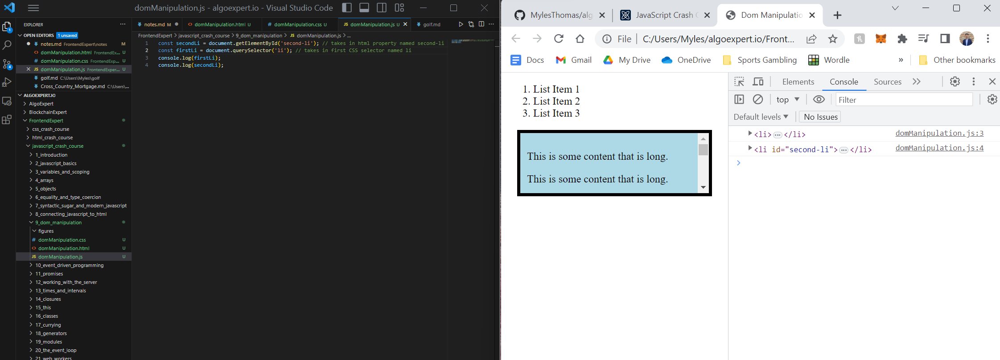


Method #2: 
- Change into directory: cd FrontendExpert/javascript_crash_course/9_dom_manipulation
- Check for version of node.js: node -v
- Install the command-line http server: npm install http-server -g
- Run the command-line http server: http-server
- http://127.0.0.1:8080 > Ctrl-C > Click on HTML File
- Right click > Inspect > Console


Note: If you get this error: "cannot be loaded because running scripts is disabled on 
this system.", do the following:
- Powershell > Run as Admin > Yes
- View current execution policy: Get-ExecutionPolicy
    - Mine says 'Restricted'
- Change the execution policy: Set-ExecutionPolicy RemoteSigned > y
    - RemoteSigned meaning: This policy enables you to run locally-created scripts, while scripts downloaded from the internet must be signed by a trusted publisher to execute.
- Verify the new policy: Get-ExecutionPolicy
- Close and reopen the PowerShell window to apply the changes.

Note: If you get this error "Devtools failed to load source map: Could not load content for ...", do the following:
- Google Chrome > Right click > Inspect > Settings > Sources 
- Uncheck the following:
    - "Enable JavaScript source maps"
    - "Enable CSS source maps"

### Selecting Elements

document object `document`: Contains most of the functions for interacting with the DOM

``` js
// Ways of grabbing 1 elements
const secondLi = document.getElementById('second-li'); // takes in html property named second-li
const firstLi = document.querySelector('li'); // takes in first CSS selector named li
console.log(firstLi);
console.log(secondLi);

// Get all queries for a selector
const listItems = document.querySelectorAll('li'); // comes in an iterable NodeList
console.log(listItems); 

console.log(listItems.length); // 3

// Iterate over NodeList
// 1
listItems.forEach(li => {
    console.log(li); // []
})
// 2
Array.from(listItems).map(li => {
    console.log(li); // []
})

// More ways to get multiple elements
// Note: do NOT recommend getting these way
// NodeList > HTMLCollection
// - Example: HTMLCollection does not have .forEach()
console.log(document.getElementsByClassName('list-item')); // add class="list-item" to an HTML item to get this
console.log(document.getElementsByTagName('li')); // HTMLCollection with 3 list items
```


### Editing DOM Nodes

``` js
const listItems = document.querySelectorAll('li'); // 

console.log(listItems.style); // undefined 

// listItems[0].style.color = 'red'; // change text color
// listItems[0].style.backgroundColor = 'blue'; // change background color
listItems[0].textContent = 'Changed!'; // change the text

// we don't use these as much:
listItems[0].value = 5; // change the value's order in the listItems (makes the #'s start at 5)
listItems[0].setAttribute('value', '7'); // same as above (pass in as string)
listItems[0].setAttribute('class', 'blue big'); // changes this to be of class='blue' and 'big'

// removes / add
listItems[0].classList.remove('big'); // changes 'blue big' into just 'blue'
listItems[0].classList.remove('blue'); // changes 'blue' into just ''
listItems[0].classList.add('big', 'blue'); // adds it right back

// toggle: If class is already there, remove it! if not, add it!
listItems[0].classList.toggle('big'); // removes big
listItems[0].classList.toggle('big'); // add big

// change className (used less often: best to use classList)
// listItems[0].className = 'blue big'; //
```

### Creating DOM Nodes


``` js
const listItems = document.querySelectorAll('li');

// Create DOM node
const p = document.createElement('p'); // nothing apppears on the page yet...
p.textContent = "Hello World";

// Add to the DOM
document.body.appendChild(p); // appendChild: takes in nodes
document.body.append('appended text'); // append: works with text OR nodes
document.body.prepend('prepended text'); // preppend: works with text OR nodes

const text = document.createTextNode('text Node'); 
p.append(text); // adds text node to the already existing p node

// Working with editable innerHTML (NOT recommended)
console.log(document.querySelector('ol').innerHTML); // 
document.body.innerHTML += '<p>HTML Test String</p>'; 
// document.body.innerHTML += '<script>doSomethingBad()</script>'; 

document.body.innerHTML = ''; // exception: clears out the entire element (useful for removing an entire container)
console.log(document.innerHTML); // 
```


#### Creating DOM Nodes in a loop

``` js
const listItems = document.querySelectorAll('li');
const p = document.createElement('p');
const text = document.createTextNode('text Node'); 
p.append(text); 

document.body.prepend(p);

for (let i = 0; i < 3; i++) {
    const parent = document.querySelector('ol');
    const li = document.createElement('li');
    li.textContent = `List item with i=${i}`;
    parent.append(li); 
}

// Issues with this loop:
// 1. We don't need to cal querySelector every loop
// 2. Looping with .append() means you need to render the page at every loop
// - Fix with a list OR
// - Fix with a fragment (your own little DOM - not on the page so does not cause renders!)
//     - Better option: Fragment
const parent2 = document.querySelector('ol');
//const listItemsToAdd = [];
const fragment = document.createDocumentFragment();
for (let i = 0; i < 3; i++) {
    const li2 = document.createElement('li');
    li2.textContent = `List item with i=${i}`;
    //listItemsToAdd.push(li2);
    fragment.append(li2); 
}
//parent.append(...listItemsToAdd); // 
parent.append(fragment); 
```

### Removing items from the DOM

``` js
const listItems = document.querySelectorAll('li');
const p = document.createElement('p');
const text = document.createTextNode('text Node'); 
p.append(text); 
document.body.prepend(p);

// const parent = document.querySelector('ol');
// const fragment = document.createDocumentFragment();
// for (let i = 0; i < 3; i++) {
//     const li = document.createElement('li');
//     li.textContent = `List item with i=${i}`;
//     fragment.append(li); 
// }
// parent.append(fragment);

// Removing items from the DOM
console.log(listItems[0].parentNode); // <ol> ... </ol>
// listItems[0].parentNode.removeChild(listItems[0]); old way
listItems[0].remove(); // new way
console.log(listItems[0].parentNode); // null ('List Item 1' is gone)
```

### DOM Sizes

``` js
const listItems = document.querySelectorAll('li');

console.log(window.innerWidth); //  width  = 339
console.log(window.innerHeight); // height =  842

console.log(listItems[0].style.fontSize); // empty string (font size is not set on element, so it is not on style)

// Get what the browser is currently displaying, instead!
let a = window.getComputedStyle(listItems[0]).fontSize;
console.log(a); // 16px (root element is set to this, so)

listItems[0].classList.add('big'); 
let b = window.getComputedStyle(listItems[0]).fontSize;
console.log(b); // 32px (16px * 2em = 32px)
```


#### Scrollable Container Sizes


``` js
const listItems = document.querySelectorAll('li');

const scrollable = document.getElementById('scrollable'); // grabs the scrollable element

// Remember: it is currently overflowing - take that into account when we get sizes!
console.log(scrollable.clientHeight); // 90: height of visible content of the pattern (90 = 70 + 10 borderpx on each side)
console.log(scrollable.offsetHeight); // 100: clientHeight + border (90 + 5px border each side)
console.log(scrollable.scrollHeight); // 342: total height of content (even content out of view) + padding

// offsetTop: distance from outer border to inner positioned parent border
console.log(scrollable.offsetTop); // Scrollable container to top of the page

console.log(scrollable.querySelectorAll('p')[0].offsetTop); // 26: 1st list item, to top of scrollable container (border + padding = 26)
console.log(scrollable.querySelectorAll('p')[5].offsetTop); // 196: 6th list item, to top of scrollable container
```


### Scrolling

Important: Sometimes we need to automatically scroll the content


``` js
const listItems = document.querySelectorAll('li');
const scrollable = document.getElementById('scrollable'); // grabs the scrollable element

// Move the scrolable down to a certain item (without touching mouse)
scrollable.querySelectorAll('p')[5].scrollIntoView();

// How to smoothly transition:
scrollable.scrollTo({
    top: scrollable.querySelectorAll('p')[2].offsetTop,
    behavior: 'smooth'
});
```

# Lesson 10: Event-Driven Programming

The old adage "better to be proactive than reactive" does not apply here!

## Key Terms

### Event-Driven Programming
A programming paradigm where code runs as a response to events
- Usually: initiated by the user

How to create an event listener: `element.addEventListener(eventName, callback, useCapture)`
- If the 3rd argument is `true`, the callback will fire during the capturing phase (instead of the default bubbling phase)

Additionally: `addEventListener` can be called with an options object as the 3rd parameter instead of the `useCapture` boolean. This object can contain the following possible values:

- capture: The same as the boolean argument option; `true` for capturing, `false` for bubbling

- once: if `true`, automatically removes the event listener after the event fires one time

- passive: if `true`, indicates to the browser that `event.preventDefault()` will not be called. 
    - Useful for the browser to optimize performance
        - (especially w/ mobile scrolling events such as `touchstart` and `touchmove` to indicate to the browser that scrolling will not be cancelled)

- signal: An `AbortSignal`, usually coming from an `AbortController`.
    - If the signal's `abort()` method is called, the event listener will be removed

To remove an event listener:
- `element.removeEventListener(eventName, callback, useCapture)`
OR 
- `element.removeEventListener(eventName, callback, optionsObj)`
    - Uses the same parameters as creating the event listener


### Event Propogation
The process by which an event travels through the DOM to call event listeners on nested elements.

Consists of 3 phases:
1. Capturing: The event travels down from the root of the document to the event target
2. Target: The event fires on the event target
3. Bubbling: The event travels up from the event target to the root of the document

At any point in the propogation process, an event listener can call `event.stopPropogation()`, which will stop the propogation process.


### Event Delegation
The process of using a single event listener on a parent element to manually delegate events to children (rather than using event listeners on each child)

Event delegation takes advantage of *event propogation*
- Example: After clicking on a button, that event will bubble up to the parent container

In the event a container has many children that all have similar event listeners, event delegation can make substantial performance improvements
- Lowers total number of active event listeners
- The `event.target` property can be used to determine which child was the source of the event


## Notes from the video

### addEventListener()

``` js
const button = document.querySelector('button'); // select the button with JS

// Event propogation: 
// 1. capturing: starts at root, traverse down DOM until target
// - no event listeners are actually called
// 2. target: fire the event on the actual element
// 3. bubbling: when we move back up
// - calls events on all elements we see
button.addEventListener('click', onClick); // When this button is clicked, run this command!
document.body.addEventListener('click', onClick); // 

function onClick(event) {
    // console.log(event);
    // console.log(event.type);
    console.log(event.target);
    console.log(this); // usually: same as event.target (not always, as in this case)
    // console.log('you clicked the button!');
}
```

Test it out:
- cd FrontendExpert/javascript_crash_course/10_event_driven_programming
- node -v
- npm install http-server -g
- http-server
- http://127.0.0.1:8080
- Right click > Inspect > Console

OR 
- start FrontendExpert/javascript_crash_course/10_event_driven_programming/eventDrivenProgramming.html


How to stop dealing with Propogation?

### stopPropogation()

"Stop going through any more phases"

``` js
const button = document.querySelector('button'); 
button.addEventListener('click', onClick);
// document.body.addEventListener('click', onClick); // doesn't get called!
document.body.addEventListener('click', onClick, true); // true: has it fire during capture phase (1st)


function onClick(event) {
    //event.stopPropagation();
    console.log(event.target);
    console.log(this); 
}
```

Note: Not all events propogate


### preventDefault()

Prevents our browser's default behavior from occurring
- Doesn't get used a ton

``` js
function onClick(event) {
    event.preventDefault(); // stops browser's behavior 
    console.log(event.target);
    console.log(this); 
}
```

### 3rd parameter: Options Object

4 different possibles values:

#### 1. capture
- true: fire during capture phase
- false: fire during bubbling phase

#### 2. once
- true: first 1x
- false: keeps firing

#### 3. passive
- true: we are not going to call event.preventDefault
    - this is good for specific events ie. touchscreen/touchmove
- false: 

#### 4. signal
- You can abort an event ie. remove the event listener


``` js
const button = document.querySelector('button');

button.addEventListener('click', onClick, {
    capture: true,
    once: true,
    passive: true,
    signal: AbortController.signal
});

// abortController.abort(); // removes the event listener

function onClick(event) {
    console.log(event.target);
    console.log(this); 
}
```

### removeEventListener()
Manually get rid of an event listener.

Nothing will happen in this script:

``` js
const button = document.querySelector('button');

button.addEventListener('click', onClick);

button.removeEventListener('click', onClick);

function onClick(event) {
    console.log(event.target);
    console.log(this); 
}
```

### Common Events

`dblclick`: You need to press the button twice to fire the event.
`mousedown`: You need to press the button down to fire the event.
`mouseup`: You need to press the button up to fire the event.


``` js
const button = document.querySelector('button');

// We usually just use click, but these are other options:

button.addEventListener('dblclick', onClick); // double 
button.addEventListener('mousedown', onClick); // when mouse goes down
button.addEventListener('mouseup', onClick); // when mouse goes up

function onClick(event) {
    console.log(event.target);
    console.log(this); 
}
```

### Keyboard keys down:
- There is also `keyup`

``` js
window.addEventListener('keydown', event => {
    console.log(event.code); // prints the key your press
});
```

### Scrollable

scrollTop: How far down we are scrolling

``` js
const scrollable = document.getElementById('scrollable');

scrollable.addEventListener('scroll', event => {
    console.log(event.target.scrollTop);
})
```

mouseenter: Logs out the x,y coordinates of where the mouse is
mousemove: Logs out the x,y when you move the mouse 
- Fires even more

``` js
const scrollable = document.getElementById('scrollable');

scrollable.addEventListener('mouseenter', event => { // mousemove
    console.log(event.pageX, event.pageY);
})
```

### Drag and Drop

First: Add the following to your HTML
- What this means: This element CAN be draggable
    - (only images default to draggable - need to set it manually)

``` html
<!--  -->
<button draggable="true">Click Me</button>
```

``` js
const scrollable = document.getElementById('scrollable');
const button = document.querySelector('button');

button.addEventListener('dragstart', event => {
    console.log(event);
});

// How to drop the element somewhere
scrollable.addEventListener('drop', event => {
    scrollable.prepend(button);
});

// Fires whenever you hover over
// - prevents default behavior so that we can now drop it inside of the scrollable
scrollable.addEventListener('dragover', event => {
    event.preventDefault();
});
```

### Event Delegation

Event Delegation: Sometimes we have some container that we need to run events on the contents of the container
- All contents may have the same event listener
- The more event listeners we add to the browser, the slower our page runs
    - Not a problem with 10, but it can if you scale up

Goal of Event Delegation: 
- Have event listener be on the parents
- Utilize propogation to have parents call functions based on target of event ie. which child was clicked on

Example (with a scrollable container):

``` js
const scrollable = document.getElementById('scrollable');
const button = document.querySelector('button');

scrollable.addEventListener('click', event => {
    // "If we click on something inside of the container"
    if (event.target !== this) {
        event.target.textContext = 'Clicked'; // if you click on a paragraph, the text changes!
    }
    else {
        event.target.textContext = 'You broke something';
    }
});

// Note: This callback should use a standard function to create a 'this' context
```

Why this is better:
- only 1 event listener
- less code


# Lesson 11: Promises

We promise you that by the time you finish this video, you'll understand how promises work in JS
- Can then do cool asynchronous stuff
- Could also just abandon frontend dev

## Key Terms

### Promise
An object used for asynchronous operations
- These objects have a state of `pending`, `fulfilled`, or `rejected`

How to create a promise: `Promise()` constructor, which takes in a callback function (aka an *executor*)
- This callback function has 2 callback options as params:
    - resolve(value): Fulfills the promise + sets its value
    - reject(error): Rejects the promises and sets an error message

- The promise object has 3 primary functions:
    - then(fulfilledFn, rejectedFn): Calls fulfilledFn if the Promise is fulfilled, rejectedFn if tis is rejected.
        - Returns a new fulfilled promise with the return value of the callback function.

    - catch(rejectedFn): Calls rejectedFn if the promise is rejected.
        - Returns a new fulfilled Promise with the return value of the callback function

    - finally(callback): Calls the callback function whenever the promise is settled (fulfilled OR rejected)

Since these functions all return a new Promise, they can be chained together, ie:

``` js
promise.then(doX).then(doY).catch(handleError).finally(doZ)
```

Learn more: https://developer.mozilla.org/en-US/docs/Web/JavaScript/Reference/Global_Objects/Promise


### async function
A function declared using `async`: Causes the function to implicitly return a Promise and allowing for usage of the `await` keyword
- Asynchronous functions are primarily an alternative syntax to chaining calls to `Promise.then`

Learn more: https://developer.mozilla.org/en-US/docs/Web/JavaScript/Reference/Statements/async_function

### await
A keyword indicating that JS should wait for a Promise to settle before continuing execution of the code.
- Traditionally, this is only available in *async functions*, but it can also be used at the top level of modules.

Learn more: https://developer.mozilla.org/en-US/docs/Web/JavaScript/Reference/Operators/await


## Notes from the video

Promises and Asynchronous code

Promises:
- contains a state
    - pending
    - fulfilled
    - rejected

``` js
// state -> pending, fulfilled, rejected

const promise = new Promise((resolve, reject) => {
    resolve(2);
});

console.log(promise); // Promise { 2 }

const promise2 = new Promise((resolve, reject) => {
    // resolve(2);
});

console.log(promise2); // Promise { <pending> }

const promise3 = new Promise((resolve, reject) => {
    reject(2);
});

console.log(promise3); // Promise { <rejected> 2 } AND throws an error!
```

Steps to run this:
- save code
- Ctrl-Alt-N

Note: We have not learned how to catch the error above yet.

### Creating Promises

This example shows how promises work
- after 1 second: pending
- after 1.5 seconds: it has been fulfilled

``` js
// state -> pending, fulfilled, rejected

const promise = new Promise((resolve, reject) => {
    setTimeout(() => resolve(2), 1000);
});

console.log(promise); // Promise { <pending> }

setTimeout(() => console.log(promise), 1500); // Promise { 2 }
```

Note: setTimeout is not the best way to do this
- won't work since we don't know much long processes will take beforehand...

### .then() Method

What .then() does: 
- Takes in a callback function that has a value ie. arrow function
- Waits for the promise to settle before running the callback function
    - (it is waiting for the state to change from `pending` to `fulfilled`)


``` js
const promise = new Promise((resolve, reject) => {
    setTimeout(() => resolve(2), 1000);
});

console.log(promise); // Promise { <pending> }

promise.then(value => console.log(value)); // 2
```

### Catching Erros

2nd parameter of .then(): A callback function in the case of an error
- Can also use '.catch()'

``` js
// state -> pending, fulfilled, rejected

const promise = new Promise((resolve, reject) => {
    //setTimeout(() => resolve(2), 1000);
    setTimeout(() => reject(new Error('Something went wrong')), 1000);
});

console.log(promise); // Promise { <pending> }

promise.then(
    value => console.log(value), // calls this is resolve
    error => console.log('oh no ' + error) // calls this bc we have reject on line 5
); 

// Another way to do the same thing!
promise.then(console.log).catch(error => console.log('Oh no ' + error));
```

How does this work?
- .then() returns itself a promise with the input value
    - passes value through if it is not resolved
- .catch() does the same thing
    - except with reject, of course

One last way to make a promise or reject:

``` js
let promise = Promise.resolve(3); 
console.log(promise); // Promise { 3 }
promise.then(console.log).catch(error => console.log('Oh no ' + error)); // 3

promise = Promise.reject(3); 
console.log(promise); // Promise { <rejected> }
promise.then(console.log).catch(error => console.log('Oh no ' + error)); // Oh no 3
```

### Chaining .then() calls

``` js
let promise = Promise.resolve(3);

console.log(promise); 

// 1. normal
promise
    .then(value => value * 2)
    .then(value => value + 1)
    .then(console.log)
    .catch(error => console.log('Oh no... ' + error)); // 7

// 2. catching error
promise
    .then(value => value * 2)
    .then(value => value + 1)
    .then(value => {
        throw new Error('Something went wrong'); // this throws an error
    })
    .then(console.log) // we never get here...
    .catch(error => console.log('Oh no... ' + error)); // this catches the error!

// 3. catching error AND still having a return value
promise
    .then(value => value * 2)
    .then(value => value + 1)
    .then(value => {
        throw new Error('Something went wrong'); 
    })
    .then(console.log)
    .catch(error => {
        console.log('Oh no... ' + error) // still spits out error...
        return 210;
    })
    .then(console.log); // 210
```

### .finally()

Works just like .then and .catch
- 1 difference: Does not take/get value or error message as a parameter (takes no parameters)
- it always runs (regardless of )

``` js
let promise = Promise.resolve(3);

console.log(promise); 

promise
    .then(value => value * 2)
    .then(value => value + 1)
    .then(value => {
        throw new Error('Something went wrong'); 
    })
    .then(console.log)
    .catch(error => {
        console.log('Oh no... ' + error) 
        return 210;
    })
    .then(console.log)
    .finally(() => console.log('Done!')); // this gets run at the end (no matter what)
```

Next, a few more Promise functions:

### Promise.all()

What it does:
- takes in an array
    - this array will be an array of promises

- it returns a new promise!

``` js
let promise = Promise.resolve(3);

console.log(promise); 

Promise.all([
    Promise.resolve(3),
]).then(console.log); // [ 3 ]

Promise.all([
    Promise.resolve(3),
    Promise.resolve(2),
]).then(console.log); // [ 3 ,2 ]
```

So, what is the point of this Promise.all() function?
- It waits for all of the promises to settle

Why is this good?
- If any of the promises in the array `reject`, the whole thing rejects
    - This is good because: You can catch rejects? 

``` js
let promise = Promise.resolve(3);

Promise.all([
    Promise.resolve(3),
    Promise.resolve(2),
    new Promise((res, rej) => setTimeout(() => res(5), 1000))
]).then(console.log).catch(console.log); // [ 3, 2, 5]
```

### Promise.race()

Promise.race(): Whichever promise solves first, that's the value we get!

``` js
let promise = Promise.resolve(3);

Promise.race([
    new Promise((res, rej) => setTimeout(() => res(5), 5000)),
    new Promise((res, rej) => setTimeout(() => res(3), 3000)),
    new Promise((res, rej) => setTimeout(() => res(1), 1000)),
    
]).then(console.log).catch(console.log); // 1

// If another one rejects, it still takes the fastest accept
Promise.race([
    new Promise((res, rej) => setTimeout(() => res(5), 5000)),
    new Promise((res, rej) => setTimeout(() => rej(3), 3000)), // notice how this is 'rej'
    new Promise((res, rej) => setTimeout(() => res(1), 1000)),
    
]).then(console.log).catch(console.log); // 1
```

### Promise.any()

Promise.any(): The first promise to fulfill!
- in order of the list (it waits for any to have a state of `fulfilled`)

If none fulfull: We must catch the error!
- it is a different error ie. an error that says EVERYTHING failed
    - We can still catch it tho

``` js
let promise = Promise.resolve(3);

Promise.race([
    new Promise((res, rej) => setTimeout(() => rej(5), 5000)), // rej
    new Promise((res, rej) => setTimeout(() => rej(3), 3000)), // rej
    new Promise((res, rej) => setTimeout(() => rej(1), 1000)), // rej
    
]).then(console.log).catch(() => console.log('All rejected')); // All rejected
```


### async / await

#### async

async: makes a function implicity return a `Promise`

``` js
function tester() {
    return 3;
}

console.log(tester()); // 3

async function testerAsync() {
    return 3;
}

console.log(testerAsync()); // Promise { 3 }
```

This is nice, but we also get another value: We can use the await keyword

#### await

await: Waits for the promise to settle before it continues
- similar to .then()
- you can only use `await` when inside of an `async` function!
    - top level of module, technically too...

``` js
async function tester() {
    const value = await new Promise((res, rej) => setTimeout(() => res(3), 1000)); // Promise { <pending> }
    console.log(value); // 3
}

console.log(tester()); // the 2 above outputs:

tester(); // 3
```

#### How to catch an error with async / await

``` js
async function tester() {
    try {
        const value = await new Promise((res, rej) => {
            // setTimeout(() => res(3), 1000)
            setTimeout(() => rej(new Error('Error: Something went wrong')), 1000);
        });
        console.log(value);
    } catch (error) {
        console.log('Oh no ' + error);
    }
}

tester(); // changes to rej in line 4, so this runs as 'Oh No Error: Something went wrong'
```

And if you don't want to use the try/catch syntax.....
- Combine the 2 syntaxes!

Remember:
- asynchronous functions always return promises


``` js
async function tester() {
    return await new Promise((res, rej) => {
        setTimeout(() => rej(new Error('Error: Something went wrong')), 1000);
    });
}

tester().then(console.log).catch(error => console.log("Oh No " + error)); // returns same error
```

### Takeaways from Video

Takeaways:
- Many different ways to do the same thing
    - it is up to your preference async/await vs. then/catch
        - async/await: newer version


# Lesson 12: Working With The Server

Why did the man name his dog "JavaScript"?
Because it was always up for a game of fetch !

## Key Term

### fetch
A JavaScript function for making network requests.

`fetch(url)`: Returns a pending promise
- Once the network request completes, the promise will either resolve or reject
    - Any response other than a network error will result in a resolved Promise
    - The `url` param can either be a string OR `URL` object

This function can also take an options object as a 2nd parameter. Here are some of the most common options:

- method: The request method as a string
    - ie. 'GET' or 'POST'

- body: The body of the request
    - Oftentimes: used to pass `FormData`

- headers: Headers to be added to the network request
    - Oftentimes: by creating `Headers` object
        - standard objects work here too!

- signal: An *AbortSignal*, usually coming from *AbortController*
    - If the signal's `abort()` method is called, the request will be aborted

When the request comes back from the server, the Promise returned by fetch will resolve to a `Response` object.

This object has a variety of properties and methods for interacting with the network response

Here are some useful responses:

- response.text(): Returns a Promise with a text representation of the response body

- response.json(): Returns a Promise with an object representation of the response body

- response.status: A number representation of the response status code
    - Successful request: 200-299 range (usual it is 200)

- response.ok: A boolean represenation of the response status code
    - Successfuly request: true
    - Everything else: false

- response.headers: A `Headers` object containing the headers included with the response.

Learn more: https://developer.mozilla.org/en-US/docs/Web/API/fetch


## Notes from the video

### Intro

Fetch ie. how we interact with the server.

Code we start out with:

``` html
<!-- Get this faster with 'html:5' -->
<!DOCTYPE html>
<html lang="en">
<head>
    <title>Fetch</title>
    <script src="fetch.js" defer></script>
</head>
<body>
    <h1>Fetch</h1>
    <form>
        <label for="name">Name</label>
        <input type="text" name="name" id="name">
        <button>Submit</button>
    </form>
</body>
</html>
```

``` js

```

Summary of base code:
- basic HTML file with a name input and submit button
- JS file with 4 API's
    - pretend they were already implemented and came from a backend Dev


### Configuring a mock API on localhost:3000

Doing the work that the back end developer "did" in the video:

Notes:
- [Quick learning on RESTful APIs](https://aws.amazon.com/what-is/restful-api/)
- [Instructions](https://dev.to/myogeshchavan97/how-to-easily-create-and-host-your-own-rest-api-without-writing-a-single-line-of-code-2np4)

Steps:

1. Set local environment / Install the json-server npm package
- cd FrontendExpert\javascript_crash_course\12_working_with_the_server
- npm init -y
- npm install json-server

2. Create a new .gitignore file so that node _modules will not be pushed to Github
- New file > .gitignore > node_modules
- Why: 
    - The node_modules folder has a massive size (up to Gigabytes).
    - It is easy to recreate the node_modules folder via packages.json.
    - It is unnecessary to commit code that you didn't write (in most cases).

- .gitignore File:

    ```
    node_modules
    ```

3. Create a new file db.json

``` json
{
  "users": [
    {
      "id": 1,
      "name": "David",
      "age": 30
    },
    {
      "name": "John",
      "id": 2,
      "age": 40
    }
  ]
}
```

4. Open package.json file and add the scripts section inside it:

``` json
"scripts": {
    "start": "json-server db.json",
}
```

5. Start the application
- npm start
    - view it here: http://localhost:3000/
        - click /users under the resources section, you will see the contents of db.json

Note: To have json formatted, install the JSON Formatter browser extension
- https://json-formatter.js.org/
OR
- https://chrome.google.com/webstore/detail/json-formatter/gpmodmeblccallcadopbcoeoejepgpnb


Congratulations! you've just written your own REST API server without writing a single line of code
- Now we can make GET, POST, PUT, PATCH and DELETE API calls to our own API.

6. Setup Postman desktop to host your API
- it appears he is using [Postman](https://www.postman.com/), which is an API platform for building/using APIs.
    - Sign up for Free > Sign up with Google > Accept
    - Download Desktop App > Windows 64-bit > run .exe
    - Sign in > Continue using with Google Account > Open Postman

7. Create a new collection for Users API Service
Collection = A grouping of saved requests (easy for re-using certain API requests)
- My workplace > Collections > Create a new Collection
    - Rename > 'Users API Service'

8. Save some requests into the collection

- Making Get API request to get all users
    - Users API Service > Add Request > Ctrl-E to rename > 'Get users' > GET > http://localhost:3000/users > Send > Ctrl-S to save
        - Note: you should see the list of 2 objects
        
- Making POST API request to add a new user
    - Users API Service > Add Request > Ctrl-E to rename > 'Add user' > POST > http://localhost:3000/users > Body > Add the code below to 'raw' (Change from 'text' to 'JSON' on the right) > Send > Ctrl-S to save

        ``` json
        {
            "id": 3,
            "name": "Mike",
            "age": 38
        }
        ```

        - Note: go back to 'Get users', you should see the new/3rd object in the list of data

- Making PUT API request to update a user
    - Users API Service > Add Request > Ctrl-E to rename > 'Update user' > PUT > http://localhost:3000/users/3 > Body > Add the code below to 'raw' (Change from 'text' to 'JSON' on the right) Send > Ctrl-S to save

        ``` json
        {
            "name": "Myles",
            "age": 25
        }
        ```

        - Note: go back to 'Get users', you should see the updated/3rd object in the list of data

- Making DELETE API request to delete a user
    - Users API Service > Add Request > Ctrl-E to rename > 'Delete user' > DEL > http://localhost:3000/users/1 > Send > Ctrl-S to save
        - Note: go back to 'Get users', you should no longer see the 1st piece of data
    
9. Save the changes
- Command line: s
    - This will save the db.json as db-183888448.json

10. Optional: Deploy the application
- I chose not to do this because this is already part of a Git repo

### Configuring 4 APIs/RESTful API on localhost:3000

0. Create a new collection for these 4 APIs
- Collections > Create new Collection > Rename 'Frontend Expert JS Lesson 12'

1. Regular GET (returns text)

...


### GET Request

First, make sure that you have a command prompt open that is keeping localhost:3000 alive.

Next, open up .html file in Port 5050 (Inspect > Console will have results from .js file)
- VSCode > Go Live > Inspect > Console
    - Note: The API's in his video are not shown but we know they are on 8080... I ended up using Port 3000 with npm start + Postman Desktop

``` js
// Ugly way
// start: ?
// key: firstName
// &: more 
// key: lastName
fetch(BASE_API + '?firstName=Myles&lastName=Thomas') // (another way of doing the 2 lines below)
```

### URL Query Parameters

Open a new command prompt
- cd FrontendExpert\javascript_crash_course\12_working_with_the_server

``` js
const BASE_API = 'http://localhost:3000/users'; // GET
const JSON_API = 'http://localhost:3000/users'; // same as bove, comes back as json
const POST_API = 'http://localhost:3000/users'; // POST
const SLOW_API = 'http://localhost:3000/users'; // GET, except it is slow

console.log(fetch(BASE_API));

// Making a request to the API
const url = new URL(BASE_API); 
url.searchParams.set('firstName', 'Myles'); // key => value 
url.searchParams.set('lastName', 'Thomas');

fetch(url)
    .then(res => res.text()) // Put the response into text
    .then(console.log) // Log the text
    .catch(error => console.error('oh no ' + error));

console.log('After fetching...');
```

Notes: 
- after fetching.... will run first
    - the asynchronous nature will have the Promise be pending while the rest of the code runs


### XMLHttpRequest

What is XMLHttpRequest: Another way to make requests
- old version before fetch() was implemented
- we won't use this much, if at all...

``` js
// XML HTTP Request (Another way of doing above...)
const request = new XMLHttpRequest();
request.addEventListener('load', function() {
    console.log(this.responseText);
});

request.open('GET', BASE_API);
request.send();
```


### async / await

This is an alternative to using chains!

``` js
const BASE_API = 'http://localhost:3000/users'; // GET
const JSON_API = 'http://localhost:3000/users'; // same as bove, comes back as json
const POST_API = 'http://localhost:3000/users'; // POST
const SLOW_API = 'http://localhost:3000/users'; // GET, except it is slow

// How to use async/await (instead of chaining then functions)
async function main() {
    // Setup
    const url = new URL(BASE_API);
    url.searchParams.set('firstName', 'Myles');
    url.searchParams.set('lastName', 'Thomas');

    // Make fetch request
    try {
        const response = await fetch(url); // waits for fetch to resolve
        const text = await response.text(); // waits for response to resolve
        console.log(text);

        // logging helpful stuff...
        console.log(response.status);
        console.log(response.ok);

    } catch (error) {
        console.error('oh no ' + error);
    }
}

main(); // 200, true
```


### Parsing JSON

Using JSON API instead of BASE_API
- make sure to use response.json() instead of response.text()
    - can use `response.headers` with an if-else if for some reason, we don't know what the return value will be...

Notes:
- Fetching from BASE_API:
    - return: text = text()
        - no need to use JSON.parse(text)

- Fetching from JSON_API:
    - return: obj = json()
        - use JSON.parse(text)

- Can use `response.headers` to figure out what our API is returning
    - we should know this already!!


``` js
const BASE_API = 'http://localhost:3000/users'; // GET
const JSON_API = 'http://localhost:3000/users'; // same as bove, comes back as json
const POST_API = 'http://localhost:3000/users'; // POST
const SLOW_API = 'http://localhost:3000/users'; // GET, except it is slow

async function main() {
    try {
        const response = await fetch(JSON_API); 
        console.log(response.headers.get('content-type')); 

        // const obj = await response.json();
        // console.log(obj);

        // this does the same thing...
        const text = await response.text();
        console.log(JSON.parse(text));

        console.log(response.status);
        console.log(response.ok);

    } catch (error) {
        console.error('oh no ' + error);
    }
}

main(); // 200, true
```


### POST API

With post API: Need to tell fetch we are making a post!
- GET is the default, that's why we did not before...
- Use an inline object/dict
    - Use JSON.stringify(), which turns an object/JSON object into a JS notation string

``` js
const BASE_API = 'http://localhost:3000/users'; // GET
const JSON_API = 'http://localhost:3000/users'; // same as bove, comes back as json
const POST_API = 'http://localhost:3000/users'; // POST
const SLOW_API = 'http://localhost:3000/users'; // GET, except it is slow

async function main() {
    const data = {
        id: 11,
        name: 'Chris',
        age: 26,
    };
    console.log('data: ' + data);
    console.log('JSON.stringify data: ' + JSON.stringify(data));

    const headers = new Headers();
    headers.append('Content-Type', 'application/json; charset=utf-8');
    console.log('headers: ' + headers.get('Content-Type'));
    console.log('JSON.stringify headers: ' + JSON.stringify(headers));

    const options = {
        method: 'POST',
        body: JSON.stringify(data),
        headers
    };
    console.log('options: ' + options);
    console.log('JSON.stringify options: ' + JSON.stringify(options));

    try {
        const response = await fetch(POST_API, options); 
        console.log('content type: ' + response.headers.get('content-type')); 
        
        const text = await response.text();
        //console.log(JSON.parse(text));
        console.log(text);

        console.log(response.status);
        console.log(response.ok);

    } catch (error) {
        console.error('oh no ' + error);
    }
}

main();
```


### Working With Forms

Using the HTML page as the input for the name!

First, add event listener to the form
- form.addEventListener('submit', onSubmit): 

``` js
const BASE_API = 'http://localhost:3000/users'; // GET
const JSON_API = 'http://localhost:3000/users'; // same as bove, comes back as json
const POST_API = 'http://localhost:3000/users'; // POST
const SLOW_API = 'http://localhost:3000/users'; // GET, except it is slow

const form = document.querySelector('form'); // gets the form
form.addEventListener('submit', onSubmit) // listens for the submit button

async function onSubmit(event) {
    event.preventDefault(); // default = go to the url we submitted a form to (we don't want this)

    const options = {
        method: 'POST',
        // note: FormData != JSON
        body: new FormData(form) // has all key-value pairs from HTML
    };

    try {
        const response = await fetch(POST_API, options);
        const text = await response.text();
        console.log(text);
    } catch (error) {
        console.error('Oh no ' + error);
    }
}
```


### Aborting Requests

When working with code that doesn't come back quickly, we may want to add abortController
- abortController: calls a function after 2 seconds
    - "if this doesn't go through in 2 seconds, abort the fetch request!"
        - we will fall into the catcherror

``` js
const SLOW_API = 'http://localhost:3000/users'; // GET, except it is slow

async function main(event) {
    const abortController = new AbortController();
    setTimeout(() => abortController.abort(), 2000); // this function is called after 2 seconds

    try {
        const response = await fetch(SLOW_API, {
            signal: abortController.signal // signal takes in the signal property, aborting fetch treq.
        });

        const text = await response.text();
        console.log(text);
    } catch (error) {
        console.error('Oh no ' + error);
    }
}
```


# Lesson 13: Timers and Intervals

Why did the JavaScript timer stop running?
- it didn't do enough interval training...

## Key Terms

### setInterval
A JavaScript function for calling a function repeatedly over an interval.

Example: `setInterval(myFunction, 1000);`
- Calls myFunction every 1 second
    - however, could take longer if other code needs to finish running
- Function Returns an ID
- Interval can be cancelled by calling `clearInterval(intervalID);`

Learn more: https://developer.mozilla.org/en-US/docs/Web/API/setInterval

### setTimeout
A JavaScript function for delaying execution of a callback function.

Example: `setTimeout(myFunction, 1000);`
- Calls myFunction after 1 second
    - however, could take longer if other code needs to finish running
- Function Returns an ID
- Timeout can be cancelled by calling `clearTimeout(timeoutID);`

Learn more: https://developer.mozilla.org/en-US/docs/Web/API/setTimeout

### requestAnimationFrame
A JavaScript function for calling a callback function before the next browser repaint.
- Oftentimes; Used for animations to update the animation every frame

Example: `requestAnimationFrame(myFunction);` would call myFunction before the next repaint
- Function Returns an ID
- Callback can be cancelled by calling `cancelAnimationFrame(animationFrameID);`

Learn more: https://developer.mozilla.org/en-US/docs/Web/API/window/requestAnimationFrame


## Notes from the video

### Intro

Timers:
- intervals: call a function repeatedly over ie. every 1 second
- timeouts: delay the execution of a function ie. some amount of time
- call a function for every frame on the screen

### Getting Setup

``` html
<!DOCTYPE html>
<html lang="en">
<head>
    <title>Timers</title>
    <script src="timers.js" defer></script>
</head>
    <body>
        <div id="count">0</div>
        <button id="start">Start</button>
        <button id="stop">Stop</button>
    </body>
</html>
```

``` js
// start/stop/count elements
const start = document.getElementById('start');
const stop = document.getElementById('stop');
const count = document.getElementById('count');

// event listeers
start.addEventListener('click', startTime);
start.addEventListener('click', stopTime);

// functions for event listeners
function startTime() {
    //
}

function stopTime() {
    //
}
```

html: start/stop with a counter at 0
js: blank functions (rn) that respond when you hit start/stop buttons

How to get environment ready:
- Go Live with your html
    - VSCode > Go Live

- View .js outputs 
    - Right click in Chrome > Inspect > Console

- Update your .js file to see changes


### Intervals

Note; If you keep pressing the 'start' button, it counts faster
- you are creating more intervals to increase the count!

``` js
// start/stop/count elements
const start = document.getElementById('start');
const stop = document.getElementById('stop');
const count = document.getElementById('count');

// event listeers
start.addEventListener('click', startTime);
stop.addEventListener('click', stopTime);

let timerID;


// functions for event listeners
function startTime() {
    //window. (this is optional)
    timerID = setInterval(() => {
        console.log('starting...');
        count.textContent++; // add 1/increment
    }, 500); // 500 ms = 0.5 seconds
}

function stopTime() {
    clearInterval(timerID);
}
```

Notes:
- start, then stop, it will stop
- start, start, then stop, you cannot fully stop because you lost the `timerID` for the 1st one...


### Timeouts

Timeout: Works just like intervals!
- waits 1 second, then calls the function
- does NOT repeat it 
    - calls it 1x
- also returns an ID

Notes:
- If you clear the timeout ie. clearTimeout(timeoutID), even with 0ms timeout, it will never run
    - This is because of the event loop...

- clearInterval and clearTimeout both do the exact same thing!
    - good practice: use the appropriate name for the function you are using

``` js
// start/stop/count elements
const start = document.getElementById('start');
const stop = document.getElementById('stop');
const count = document.getElementById('count');

// event listeers
start.addEventListener('click', startTime);
stop.addEventListener('click', stopTime);

let timerID;

let timeoutID = setTimeout(() => {
    console.log('timeout');
}, 500);

// clearInterval(timeoutID);

// functions for event listeners
function startTime() {
    timerID = setInterval(() => {
        count.textContent++;
    }, 500); 
}

function stopTime() {
    clearInterval(timerID);
}
```


### Animation Frames

Animation Frames: similar to setInterval
- every time the browser is about the paint, it checks if there are `requestAnimationFrame`
    - if yes, will call a callback function

How to cancel the animation frame: `cancelAnimationFrame(animationFrameID);`

``` js
// start/stop/count elements
const start = document.getElementById('start');
const stop = document.getElementById('stop');
const count = document.getElementById('count');

// event listeers
start.addEventListener('click', startTime);
stop.addEventListener('click', stopTime);

let animationFrameID;

function startTime(timestamp) { // time since 'time origin'
    console.log(timestamp);
    // timerID = setInterval(() => {
    //     count.textContent++;
    // }, 500); 
    count.textContent++;
    animationFrameID = requestAnimationFrame(startTime);
}

function stopTime() {
    cancelAnimationFrame(animationFrameID);
}
```

### performance.now() + Date.now()

performance.now(): Same as timestamp
- gets number of milliseconds since 

Date.now(): 
- has more functions you can get creative with
    - day of 5 = Friday

``` js
const start = document.getElementById('start');
const stop = document.getElementById('stop');
const count = document.getElementById('count');
start.addEventListener('click', startTime);
stop.addEventListener('click', stopTime);

let animationFrameID;

// performance.now()
// Date.now()
setTimeout(() => {
    console.log(performance.now()); // 
    console.log(Date.now()); // # of milliseconds past Jan 1 1970
}, 1000);

// Another way to log the dates
const date = new Date(2025, 0, 10, 9, 25, 10, 30); 
date.setMonth(9);
console.log("date" + date);

function startTime(timestamp) { // time since 'time origin'
    console.log(timestamp);
    count.textContent++;
    animationFrameID = requestAnimationFrame(startTime);
}

function stopTime() {
    cancelAnimationFrame(animationFrameID);
}
```


# Lesson 14: Closures

Closures: An important concept that you absolutely must understand
- They are used all of the time!
- You have already used them without knowing it

## Key Terms

### Closure
A function, along with a saved reference to the lexical environment it was defined it.
- Simply put: This means functions have access to all of the variables in the scope at the time of definition, even if the parent function has retured.

Learn more: https://developer.mozilla.org/en-US/docs/Web/JavaScript/Closures

### Lexical Environment
An internal data structure used for keeping track of identifiers (variable and function names) and their values
- A lexical environment stores all of the locally available identifiers as well as a reference to the parent environment

### Lexical Scoping
The scoping system in JavaScript that ensures all code blocks have access to all identifiers in their parent environment
- When an identifier is not defined locally: JavaScript will look to the parent environment for it
    - If still not found: It will look in the grandparent's environment
        - the cycle continues..., and then it looks in the global envir


## Notes from the video

### Setup

Starting out JS file:

``` js
const globalNum = 5;

function logNum() {
    const localNum = 1;
    console.log(globalNum + localNum);
}

logNum();
```

### Closures Overview

What is happening? Lexical Scoping

logNum has access to the following:
- local variables
- global variables (via closure)
    - local scope is used first, but then it will look at parent, parent's parent, up to global

``` js
function example() {
    const num = 5; // this is never looked at (local scope declared a 10)

    function logNum(num) {
        console.log(num);
    }

    logNum(10);
}

example(); // 10
```

An example using a return function:

``` js
function example() {
    const num = 5;

    return function() {
        console.log(num);
    }
}

const innerFunction = example();

innerFunction(); // 5
```

Many programming languages: Garbage collector collects because the example is done running

JavaScript: Creates a closure
- constant `innerFunction` still has access to `num`

### Applications of Closures

Private methods:

``` js
function makeFunctions() {
    let privateNum = 0;

    function privateIncrement() {
        privateNum ++;
    }

    return {
        logNum: () => console.log(privateNum),
        increment: () => {
            privateIncrement();
            console.log('Incremented!');
        }
    }
}

const { logNum, increment } = makeFunctions();
const { logNum: logNum2, increment: increment2 } = makeFunctions();

logNum(); // 0
console.log(privateNum); // would return an error (out of scope)
increment();
logNum(); // 1

// logNum2 has access to different variables!
// - created with different calls to makeFunctions()
//     - They have different parents
logNum2(); // 0
increment2();
logNum2(); // 1
```

What is going on here:

- Functions `makeFunctions()` returns 2 functions.
    - 2 things that are private to the private scope:
        - const: privateNum
        - function: privateIncrement()
            - the outside does not have access to these 

    - 2 things that are public to external
        - function: logNum
        - function: increment


### Interview Question Example

``` js
for (let i = 0; i < 3; i++) {
    setTimeout(() => {
        console.log(i);
    }, 500);
} // 0,1,2

console.log(i); // error!

for (var i = 0; i < 3; i++) {
    setTimeout(() => {
        console.log(i);
    }, 500);
} // 3,3,3

console.log(i); // 3
```

What happens here:
- Closure is created
    - even when the for loop is finished 500 ms later, `console.log(i)` has access to the i variable

What happens if you change `let` to `var`?
- let: 0,1,2
- var: 3,3,3

Why?
- let: *Block scoped* 
    - only scoped inside of those curly bracews
        - when you use let in a for loop, it creates a 'new' variable with each iteration

- var: *Function scoped*
    - scoped globally (since we are not in a function)
        - we get the same i variable each time
            - you still end up doing an `i++` at the end (which is why you get 3,3,3 and not 2,2,2)

### Parting Notes

Think about scoping of let vs. Var
- let: new variable
- var: same variable each time

Which closures are being created?
- If closures are created at time of declaration of function, none of the time is it executed

(In the example, closures are created during the loops, even though function is not created for 500 ms)


# Lesson 15: This

This might be the most confusing concept in JavaScript.

## Key Term

### this
A JavaScript keyword for referencing the context in which the current code is running

The value of `this` is determined at runtime. In the browser, it follows these rules:

1. At the top level of a file (ie. the global context), `this` refers to the global object, the `window`

2. In a standard function without strict mode, `this` refers to the global object, the `window`

3. In a standard function in strict mode, `this` is undefined.

4. In an object method, `this` refers to that object.

5. In a constructor function, `this` refers to the object being constructed.

6. When using event listeners, the object being listened to will be bound to `this` (assuming a standard function was used)
- Example: `element.addEventListener('click', func)`
    - This would bind `element` to `this` inside of `func`.

Arrow functions do not create their own `this` context (they just retain the value of the enclosing context)

JavaScript also provides 3 functions for binding the value of this to functions:

1. func.bind(thisArg): Returns a function with `thisArg` bound to `this`.

2. func.call(thisArg, x, y): calls `func(x, y)` with `thisArg` bound to `this`.

3. func.apply(thisArg, [x, y]): calls `func(x, y)` with `thisArg` bound to `this`.

Learn more: https://developer.mozilla.org/en-US/docs/Web/JavaScript/Reference/Operators/this

## Notes from the video

### Setup / "this" keyword overview

``` html
<!DOCTYPE html>
<html lang="en">
<head>
    <title>This</title>
    <script src="this.js" defer></script>
</head>
<body>
    <button>Click Me</button>
</body>
</html>
```

``` js
console.log(this); // Window
```

Starting:
- HTML: button that says click me
    - Deploy to Port 5500 with 'Go Live' > Inspect > Console

- JS: Logs out the Window


### "this" in Functions

``` js
'use strict';

console.log(this); // Window

function logThis() {
    console.log(this);
}

logThis(); // undefined
```

Strict mode causes it to be undefined.


### "this" in Objects

``` js
'use strict';

function logThis() {
    console.log(this);
}

const obj = {
    num: 10,
    logThis
}

obj.logThis(); // When in an object, the 'this' keyword is the object itself!
```

### "this" in Event Listeners

``` js
'use strict';

const button = document.querySelector('button');

button.addEventListener('click', logThis);

function logThis() {
    console.log(this);
}

const obj = {
    num: 10,
    logThis
}

obj.logThis(); // Logs out what it was listening to ie. the Button (when clicked!)
```


### "this" in Arrow Functions

Slight nuance if it is an arrow function!
- they do NOT get their own `this`

``` js
'use strict';

const logThis = () => {
    console.log(this);
}

const button = document.querySelector('button');

button.addEventListener('click', logThis);

const obj = {
    num: 10,
    logThis
}

obj.logThis(); // Logs out window
```


### Binding "this"

Passing as the `this` parameter:

Bind: Functions of another function
- 

``` js
'use strict';

function logThis(x, y) {
    console.log(this);
    console.log(x, y);
}

const obj = {
    num: 10
};

logThis(); // undefined

const boundLogThis = logThis.bind(obj, 10, 20);

// We get the obj because we pass it into the bind
boundLogThis(); // {num: 10}; 10,20


logThis.call(obj, 10, 20); // gets the some reponse of {num: 10}; 10,20


// .apply(): works the same as call
logThis.apply(obj, [10, 20]); // gets the some reponse of {num: 10}; 10,20
```

Takeaway: `this` should almost ALWAYS be an object!


### Array Functions

``` js
'use strict'; // makes it log 'undefined' instead of the window

[1,2,3].forEach(function(num) {
    console.log(this);
    console.log(num);
});
```

Reminder: Arrow functions will log out the Window
- global this

Next: `this` argument of the callback function

``` js
'use strict'; // makes it log 'undefined' instead of the window

[1,2,3].forEach(function(num) {
    console.log(this);
    console.log(num);
}, {num: 10}); // we log out this object all 3 times
```

### "this" in Classes

`this` will refer to current object when called in a class method:

``` js
'use strict';

class Person {
    constructor(name) {
        this.name = name;
    }

    // method on the class
    speak() {
        console.log('Hello, I am ' + this.name);
    }
}

const conner = new Person('Conner');
const clement = new Person('Clement');

conner.speak(); // Hello, I am Conner
clement.speak(); // Hello, I am Clement
```

### Takeaways

This: Usually a runtime binding
- ie. it is based on the context
- most of the time: keywords will do what you want
    - be aware of intracacies


# Lesson 16: Classes

If you have only worked with languages that use class-based inheritance so far, then JavaScript's prototype-based inheritance will seem like anything BUT prototypical.

## Key Terms

### Prototypal Inheritance
The inheritance model used in JavaScript.
- Key difference between prototypal/classical inheritance:
    - prototypal: objects only inherit from other objects
    - other: using class blueprints

### Prototype Chain
The chain of inheritance created through object prototypes.
- When a property does not exist on an object, JavaScript will look to its prototype
    - If it doesn't exist on that object, it will look to its prototype
        - continues until chain ends w/ a null prototype

Internally: The prototype is stored on the `[[Prototype]]` property, but we cannot directly access this property.

We have alternative ways to get/set prototypes:

- `obj.__proto__`: Property was the original way to get/set the prototype of an object
    - is now depracted
    - still useful for debugging

- `Object.getPrototypeOf(obj)`: Returns the prototype object of `obj`.

- `Object.setPrototypeOf(obj, proto)`: Sets the prototype object of `obj` to `proto`.

- `Object.create(proto)`: Creates a new object with the prototype set to `proto`.

Learn more: https://developer.mozilla.org/en-US/docs/Web/JavaScript/Inheritance_and_the_prototype_chain

### Function Constructor
A function intended to be used to construct an object using the `new` operator.

When the new operator is used, a new object is automatically created.
- The prototype of the new object is then set to the `prototype` property of the constructor function
    - Remember: functions are just objects
- Finally: The constructor function is called with the new object bound to `this`.

By default: The `prototype` property of the function will be an object with its `constructor` property set to the function itself
- This can be changed

For example:

``` js
function Person(name) {
    this.name = name;
}

// This object will become the [[Prototype]] of
// any objects resulting from a new Person() call
Person.prototype = {
    constructor: Person,
    isHuman: true
}

const clement = new Person('Clement');
console.log(clement.isHuman); // true, comes from prototype object.
```

### Classi
A JavaScrpt syntax to emulate that of classical inheritance
- For the most part: it is syntactic sugar on top of function constructors
    - classes are actually just functions under the hood

Example class would look like:

``` js
class Person {
    static isHuman = true; // public static field
    #age; // private instance field

    constructor(name, age) {
        this.name = name; // public instance field
        this.#age = age;
    }

    // instance method
    speak() {
        console.log('Hello this is ' + this.name);
    }

    // instance getter function
    get age() {
        return this.#age;
    }

    // instance setter function
    set age(value) {
        this.#age = value;
    }
}


const conner = new Person('Conner', 24);
conner.speak(); // logs 'Hello this Conner'
console.log(conner.age); // getter fun returns 24
conner.age = 25; // calls setter functions

console.log(conner.#age); // Error (cannot access private field)
console.log(conner.name); // "Conner"
console.log(conner.isHuman); // undefined
console.log(Person.isHuman); // true
```

Classes can also extend other classes
- Internally: This creates a prototype chain
- In the class constructor `super` can be used to call the parent constructor
- `super.method()` can also be used in the class to call parent classes.

For example:

``` js
class Child extends Person {
    constructor(name, age, grade) {
        super(name, age);
        this.grade = grade;
    }
}
```

Learn more: https://developer.mozilla.org/en-US/docs/Web/JavaScript/Reference/Classes

## Notes from the video

### Setup

Create an empty .js file named classes.

### Prototypal Inheritance

Other languages: "Blueprint style classes"

JavaScript: Objects inherit from other instantiated objects

In practice:

``` js
const person = {
    isHuman: true
};

// child will inherit from person
// prototype: person
const child = Object.create(person);

// cannot do the following, so we must init with a Object.create()
//child.[[Prototype]] = person;

// this could work, but is depracated
//child = {};
//child.__proto__ = person;

console.log(person); // 

console.log(child); // it is empty at init...
console.log(child.isHuman); // child doesn't have isHuman, but its prototype does!

child.maxAge = 18;
console.log(child.maxAge); // 18
console.log(person.maxAge); // undefined
```

Alternatives to this syntax used above:

``` js
const person = {
    isHuman: true
};

// 1. creates object with [[Prototype]] of person
// 2. assign all values from 2nd object
const child = Object.assign(Object.create(person), {
    maxAge: 18
});

console.log(child.maxAge); // 18
console.log(person.maxAge); // undefined
```

Other methods, which are discouraged...
- Object.setPrototypeOf(child, person)
- __proto__: person
- .create() with extra args

An example showing how an object has access to its parents/proto:

``` js
const person = {
    isHuman: true
};

const child = Object.create(person);
child.maxAge = 18;

const john = Object.create(child);
john.name = 'John';

console.log(john.__proto__.__proto__); // { isHuman: true }
console.log(john.__proto__); // { maxAge: 18 }
console.log(john); // { name: 'John' }

// Recommended (better) syntax
console.log(Object.getPrototypeOf(Object.getPrototypeOf(john))); // { isHuman: true }
console.log(Object.getPrototypeOf(john)); // { maxAge: 18 }
console.log(john); // { name: 'John' }
```


One more thing to show: If properties change on any object, properties change on prototype as well:
- They are reference to live objects, not copies or anything like that!

``` js
const person = {
    isHuman: true
};

const child = Object.create(person);
child.maxAge = 18;

const john = Object.create(child);
john.name = 'John';

console.log(john.maxAge); // 18

child.maxAge = 69;

console.log(john.maxAge); // 69
```

Almost anything that is not a primitive is an object:

``` js
const person = {
    isHuman: true
};

const child = Object.create(person);
child.maxAge = 18;

const john = Object.create(child);
john.name = 'John';

const funcProto = Object.getPrototypeOf(() => {});
console.log(Object.getOwnPropertyNames(funcProto));
// [
//     'length',      'name',
//     'arguments',   'caller',
//     'constructor', 'apply',
//     'bind',        'call',
//     'toString'
//   ]

const arrayProto = Object.getPrototypeOf(([]));
console.log(Object.getOwnPropertyNames(arrayProto));
// [
//     'length',      'constructor',    'concat',
//     'copyWithin',  'fill',           'find',
//     'findIndex',   'lastIndexOf',    'pop',
//     'push',        'reverse',        'shift',
//     'unshift',     'slice',          'sort',
//     'splice',      'includes',       'indexOf',
//     'join',        'keys',           'entries',
//     'values',      'forEach',        'filter',
//     'flat',        'flatMap',        'map',
//     'every',       'some',           'reduce',
//     'reduceRight', 'toLocaleString', 'toString',
//     'at',          'findLast',       'findLastIndex'
//   ]

```

Takeaway:
- Arrays and Objects are objects
    - Objects with prototype set to object/array as prototype

### Function Constructors

What does the 'new' keyword actually do?
- This one:

    ``` js
    // simple constructor function
    function Person(name) {
        console.log('constructor is ran'); // this is called when a new person is created
        this.name = name;
    }

    const conner = new Person('Conner');
    console.log(conner); // Person { name: 'Conner' }
    console.log(conner.name); // Conner

    const myles = new Person('Myles');
    console.log(myles); 
    console.log(myles.name);
    ```

- every function has a function name .prototype
    - different than __proto__
    - it is a standard property on the function Object
        - What is it? an object itself / a blueprint for how the new keyword is going to work

First thing that we need: Constructor
- always need a constructor
    - default constructor: Person itself

    ``` js
    Person.prototype = {
        constructor: Person, // function that the prototype is on
        isHuman: true
    }
    ```

- other properties added:
    - isHuman: when this gets added to the prototype, it is also added to Conner

So, then what are the properties inside of the constructor?
- Instance Properties
    - different names
    - same prototypes

Examples:

``` js
// simple constructor function
function Person(name) {
    console.log('constructor is ran');
    this.name = name;
}

Person.prototype = {
    constructor: Person, // function that the prototype is on
    isHuman: true
}

const conner = new Person('Conner');
console.log(conner); // Person { name: 'Conner' }
console.log(conner.name); // Conner

// These next 2 lines of code do the same thing.
// (this works because the constructor for conner == Person)
const myles = new conner.constructor('Myles');
//const myles = new Person('Myles');
console.log(myles); 
console.log(myles.name);

console.log("\n");
console.log('are the names the same?');
console.log(myles.name === conner.name);
console.log('are the prototypes the same?');
console.log(Object.getPrototypeOf(conner) === Object.getPrototypeOf(myles));

// Adding another key-value pair to the prototype
Person.prototype['helloworld'] = 69;
console.log(myles.helloworld); // 69
console.log(conner.helloworld); // 69 (both can access it!)

// Idea of sharing prototypes works with functions too....
Person.prototype.speak = function() {
    console.log('Hello this is ' + this.name);
    console.log(this.isHuman);
}
console.log(myles.speak());
console.log(conner.speak());

// instanceof: is Person in the prototype chain?
// note: setting prototypes with 'setPrototypeOf' is a bad idea
console.log(conner instanceof Person);
console.log(myles instanceof Person); // true
```

### Polyfills

Polyfills: a piece of code (usually JavaScript on the Web) used to provide modern functionality on older browsers that do not natively support it

``` js
// Check if push exists.. if not, we define it!
console.log(Array.prototype.push)
if (Array.prototype.push === undefined) {    
    console.log('Creating a function for push...');
    Array.prototype.push = function(value) {
        this[this.length] = value;
    }
}

const arr = [1,2,3];
arr.push(4); // calls the function we just defined
console.log(arr);
```

Useful for when old browsers don't have something!

### Classes

Modern class syntax: 

``` js
class Person {
    // "fields" of the class
    static isHuman = true;

    // constructor 
    constructor(name) {
        this.name = name;
    }

    // methods for the class
    speak() {
        console.log('Hello this is ' + this.name);
    }

    // this can only be called by person because it is static....
    static greet() {
        console.log('greetings!')
    }

    // getters
    get getName() {
        return this.name;
    }

    // setters
    set changeName(value) {
        this.name = value;
    }
}

const conner = new Person('Conner');
const clement = new Person('Clement');

conner.speak();

//conner.isHuman = false; (cannot do this with the static property above)
console.log(Person.isHuman); // true
console.log(conner.isHuman); // undefined
console.log(clement.isHuman);// undefined (static means it is for the Person class, not individual humans)

```

### Inheritance with Classes

Inheritance with Classes

``` js
class Person {
    constructor(name) {
        this.name = name;
    }
    speak() {
        console.log('Hello this is ' + this.name);
    }
}

// Child: instance of Person 
// Person: -
class Child extends Person {
    #age; // private age

    constructor(name, age) {
        super(name) // calls constructor of class we are inheriting from! ie. Person
        this.#age = age;
    }
}

const child = new Child('John', 10);
child.speak();
console.log(child instanceof Person); // true
console.log(child instanceof Child);  // true
console.log(Person instanceof Function); // reminder that Person is a function, under the hood 
```

Notes on Private variables:
- cannot access via age (undefined) or #age (error)
    - this holds through with classes that inherit from it

- Private fields are not available on every browser


# Lesson 17: Currying

Currying  = weird (so pay attention)

## Key Term

### Currying
The process of transforming a function to treat its parameters as a sequence of individual function calls that each take one parameter

Example:
- regular: func(a, b, c)
- currying: func(a)(b)(c)

Currying is achieved by creating functions that return other functions (kinda like chaining) and they take advantage of *closures*

For example - a curried sum function:

``` js
function curriedSum(a) {
    return function(b) {
        return a + b
    };
}
```

This could then be used to create partial version of this function. For example:

``` js
// Add Four function
const addFour = curriedSum(4);
addFour(10); // 14
```


## Notes from the video

### What is currying

Function Currying/Curried versions of functions:
- each parameter is its own function call!

### Curried Sum

``` js
// regular
function sum(a, b, c) {
    return a + b + c;
}

// curried
function curriedSum(a) {
    return function(b) {
        return function(c) {
            return a + b + c;
        }
    }
}

console.log(sum(1,4,10)); // 15
console.log(curriedSum(1)(4)(10)); // 15
```

Due to closures created, all 3 of these variables are still in scope!
- inside innermost function...

### curry() Function

curry(): Takes in a function as parm, returns it as curried function

``` js
function sum(a, b, c) {
    return a + b + c;
}

function subtract(a, b, c){
    return a - b - c;
}

function curry(func) {
    return function(a) {
        return function(b) {
            return function(c) {
                return func(a, b, c);
            }
        }
    }
}

const curriedSum = curry(sum);
const curriedSubtract = curry(subtract);

console.log(sum(1,4,10)); // 15
console.log(curriedSum(1)(4)(10)); // 15
console.log(curriedSubtract(1)(4)(10)); // -13
```

Instead of returning a+b+c, your return `func(a, b, c)`
- pass in sum function as the parameter

We can simplify even more with arrow functions!

``` js
function curry(func) {
    return (a) => {
        return (b) => {
            return (c) => {
                return func(a, b, c);
            }
        }
    }
}
```

One step further: Implicit returns

``` js
function curry(func) {
    return (a) => (b) => (c) => func(a, b, c);
}
```

Nice!

### When to use Currying

I was thinking this at first: Why the hell would I ever use this?

Answer: Most of the time you do not!

Use cases we may want to use it: Part of another functions

Example:

``` js
function sum(a, b, c) {
    return a + b + c;
}

function curry(func) {
    return (a) => (b) => (c) => func(a, b, c);
}

const curriedSum = curry(sum);

const addFour = curriedSum(4);
console.log(addFour(10)(10)); // 24
```


# Lesson 18: Generators

While these bad boys won't bring the lights back on during a blackout, they'll reliably/efficiently power your applications whenever they are called upon!

## Key Term

### Generator
An iterable object created by using a *generator function*.

Generator function: Defined by using `function+`. Then, each `yield` results in another item being added to the iterable generator object.

A generator object has 3 methods:
1. next(value): Returns an object with the next value in the iterator and a *done* boolean.
- Optionally: passes a value back into the generator function

2. return(value): Adds a passed in argument to the iterable results and ends iteration.

3. throw(error): Throws an error, stopping code execution unless the error is caught.

Example: 

``` js
function* genNumbers() {
    const x = yield 1;
    yield x + 2;
    yield 3;
}

const generatorObj = getNumbers();
console.log(generatorObj.next().value); // 1
console.log(generatorObj.next(3).value); // 5
console.log(generatorObj.return(7).value); // 7
console.log(generatorObj.next().value); // undefined
```

Learn more: https://developer.mozilla.org/en-US/docs/Web/JavaScript/Reference/Global_Objects/Generator

## Notes from the video

### Overview

Generators:
- generator functions
- generators

`yield`: Similar to return, pauses the function where it was
- can do it multiple times to resume execution of the function

`generator.next()`: Executes the functions until it gets to a yield
- value: the value yielded
    - can also get this with `generator.next().value`
- done: false ie. we are not to the end of the function yet

``` js
function* genNumbers() {
    yield 1;
    yield 2;
    yield 3;
    return 4;
    yield 5; // we never get to this line of code
}

const generator = genNumbers(); // create the generator

console.log(generator.next()); // 1, false
console.log(generator.next()); // 2, false
console.log(generator.next()); // 3, false
console.log(generator.next()); // 4, true (return object OR no more yields makes it done)
console.log(generator.next()); // undefined, true
```

### return statements in Generators

Once you hit the return statement, as seen above:
- value: the return value
- done: true
    - anything after will be value=undefined, done=true

### Passing values into Generator Function

``` js
function* genNumbers(count) {
    for (let i=0; i < count; i++) {
        yield i;
    }
}

const generator = genNumbers(3);

console.log(generator.next()); // 1, false
console.log(generator.next()); // 2, false
console.log(generator.next()); // 3, false
console.log(generator.next()); // undefined, true
console.log(generator.next()); // undefined, true
```

### Iterating with For-of loop

``` js
function* genNumbers(count) {
    for (let i=0; i < count; i++) {
        yield i;
    }
    return 5; // we never get here
}

const generator = genNumbers(3);

for (value of generator) {
    console.log(value); // 0,1,2
}
```

Note: This method ignores the return statement
- Avoid these for of loops, tbh

### Passing Values Through calls to Generator.next()

``` js
function* genNumbers(count) {
    const value = yield 0;
    yield value + 3;
}

const generator = genNumbers(3);

console.log(generator.next()); // 0, false
console.log(generator.next(5)); // 8, false
// value was set at 0, but we changed it to 5 with generator.next(5), and then 5+3 = 8
```


### generator.return()

generator.return(): Similar to return statement inside of generator function
- 

Example: 

``` js
function* genNumbers(count) {
    const value = yield 0;
    yield value + 3;
}

const generator = genNumbers(3);

console.log(generator.next()); // 0, false
console.log(generator.return(5)); // 5, true
console.log(generator.return()); // undefined, true
console.log(generator.next(5)); // undefined, true
```

### generator.throw()

generator.throw(): Throws an error instead of running the code
- halts execution

Note:
- .return() lets your get to code after it, .throw() does not

Example: 

``` js
function* genNumbers(count) {
    const value = yield 0;
    yield value + 3;
}

const generator = genNumbers(3);

console.log(generator.next()); // 0, false
console.log(generator.throw(new Error('There was an error'))); // throws error

console.log(generator.next(5)); // we don't get to run this...
```

### Yielding to Generators

Now, look at generator functions that call each other!

Yielding to Generators
- use * to yield to another generator

``` js
function* generator1() {
    yield 1;
    yield 2;
}

function* generator2() {
    yield 3;
    yield 4;
}

function* getNumbers(count) {
    yield* generator1();
    yield 2.5;
    yield* generator2();
}

const generator = getNumbers();

console.log(generator.next()); // 1, false
console.log(generator.next()); // 2, false
console.log(generator.next()); // 2.5, false
console.log(generator.next()); // 3, false
console.log(generator.next()); // 4, false

console.log(generator.next()); // undefined, true
```

### Takeaways

- We don't use these much
    - good to know for technical interviews


# Lesson 19: Modules

Modules = a fancy way of saying "files"

## Key Terms

### Module
JavaScript code that runs in isolation, without "polluting" the global namespace

Traditionally: Modules were implemented using *immediately invoked function expressions*
Modern: we use `type="module"` attribute that can be added to script tags. This attribute has a few effects:
- Identifiers at the top level will be scoped to the file (rather than globally)
- The file will be in strict mode, by default
- The `await` keyword can be used at the top level
- The script will be deferred by default

Modules can then access each other by using the `import` / `export` keywords.

Example:

``` js
// File 1:
export const num = 10;

// File 2:
import { num } from 'file1.js';
```

Learn more: https://developer.mozilla.org/en-US/docs/Web/JavaScript/Guide/Modules

### Immediately Invoked Function Expression (IIFE)
A function that is immediately called after its definition
- Can be useful for a variety of purposes
    - most notably: create a function scope to isolate code with

There are a few ways to define an IIFE.
- Most common: Using an anonymous / arrow function
    - This function is then wrapped in (), which causes it to be treated as an expression
    - Finally, () is added to call the function

Example:

``` js
(function() {
    console.log('Wahoo!');
})();
```

Learn more: https://developer.mozilla.org/en-US/docs/Glossary/IIFE

## Notes from the video

### Setup

Steps:
- make new file 'modules.html', 'Person.js', 'helpers.js', 'modules.js'
    - new cmd
    - cd FrontendExpert\javascript_crash_course\19_modules
    - echo > modules.html
    - echo > Person.js
    - echo > helpers.js
    - echo > modules.js

- start up localhost:5500
    - Code out HTML file and keep it open
    - VSCode > Go live > Right click when in .html file > Inspect > Console

### Modules Overview

HTML File with 3 scripts
- Person: 
- helpers: 
- modules: 

Let's show how these JS files have access to each other:

``` js
// These js files have access to each other

frontendExpert(); // FrontendExpert is the best!

const conner = new Person('Conner');
conner.sayHello(); // Hi, this is Conner
```

Good practice: Keep different files for different parts of code
- Example of Amazon: cannot fit everything into 1 file!
    - individual classes
    - helper functions

We want to do this WITHOUT polluting the global namespace!
- added all variables to the global is bad
    - naming conflicts
    - coding conflicts with frameworks

- we want files scoped to their files
    - take individual parts of the files and export them

So, how do we make sure the 'conner' constant is only accessible in modules.js?

### Functions as Modules

What we know:
- constants are scoped to their block
- variables defined with var are scoped to a function

If we put all of our code in a function....

``` js
function myModule() {
    frontendExpert(); 

    const conner = new Person('Conner');
    conner.sayHello();
}

myModule(); // both get printed as before
```

- we are no longer in the global namespace (we are in a function)
- Issue:
    - we have a new global identifier ie. `myModule()`, which can now be called by any other file
    - How to solve this problem?

How to solve this problem:
- Method #1: anonymous function
    - this does not work bc no function to call

- Method #2 - Good solution: Wrap entire function in parentheses
    - What this does: "JavaScript, teach what is in this of these () as an expression"
        - we won't have to give a name to the function
        - add () to the end to call the function

This does what we want!
- same output as before
- does not mess with global namespace

``` js
(function() {
    frontendExpert(); 

    const conner = new Person('Conner');
    conner.sayHello();
})();
```

What is this: Immediately invoked function expression

Only problem now: We cannot access the functions from other .js files because they are inside of a function

### type="module" HTML Attribute

type="module": Add the immediately invoked function
- Removes from global namespace
    - no need to refer either

``` js
<script src="Person.js" type="module"></script>
<script src="helpers.js" type="module"></script>
<script src="modules.js" type="module"></script>
```

We could now remove the IIFE and put code back how it was. 

We stil have a problem: The files no longer have access to each other!
- We most export it so that other files can import them...

### import / export

We can solve our problem with imports/exports:

helpers.js:

``` js
export function algoExpert() {
    console.log('AlgoExpert is the best!');
}

export function frontendExpert() {
    console.log('FrontendExpert is the best!');
}
```

modules.js:

``` js
//import * as helpers from './helpers.js';
//import * as person from './Person.js';
import { algoExpert as algo, frontendExpert as frontend } from './helpers.js';
import { Person } from './Person.js';

algo();
frontend();

const conner = new Person('Conner');
conner.sayHello(); 
```

Note: You can export classes, just like functions

Person.js:

``` js
//export 
class Person {
    constructor(name) {
        this.name = name;
    }

    sayHello() {
        console.log(`Hi, this is ${this.name}`);
    }
}
//export default Person;
//export { Person as default }; // this is rare to see
export { Person };
```


export default: Instead of using {} syntax, you could use this
- I do not like this
- Solid choice if it is a class file with 1 export

### import()

Dynamically import modules: If imports are coming from a server, we want to be careful
- only import when truly necessary

How to use this: `await`
- adding `type="module"` in the HTML allows us to use `await`, even though we are not inside of a function!

``` js
const shouldSayFrontend = true;

if (shouldSayFrontend) {
    //const importedObj = await import ('./helpers.js');
    const { frontendExpert } = await import ('./helpers.js');
    frontendExpert();
}
```

Other changes that `type="module"` invokes:
- strict mode is on automatically ie. 'use strict'
- it changes what `this`
    - it will be undefined

Major change: We can import/export code without polluting the global namespace!

### nomodule scripts

Finally: We can do this with HTML in the case our browser does not import modules...
- script tag that tells browser to ignore the first 3 script tags
- in the case that 
    - good for handling users who use an old browser

``` html
<script src="nomoduleversion.js" nomodule></script>
```


# Lesson 20: The Event Loop

If JavaScript is a single-threaded programming language, then how is it able to run code a-synchronously?

The answer might throw you for a loop...

## Key Terms

### JavaScript Engine
A program used to execute JS code.

These engines can differ a lot in implementation across browsers, but for the most part there are 2 primary components

1. Heap: Used for memory allocation to story objects
- Think of an unstructured data store

2. Call Stack: A stack data structure that is used to keep track of currently executing functions
- Each function call pushes a stack frame onto the stack
    - stack frame has info about the function and its local variables
- When a function ends, it is popped off the stack
    - Note: If the stack is empty, there is no code running

### JavaScript Runtime Environment
The larger environment that JS is executed in. 
- In the browser, this environment provides access to a variety of *web APIs*
    - These APIs include functions for timers, HTTP requests, DOM manipulation, and more

### Event Loop
The concurrency model within JavaScript.
- This is a constantly running loop within the browser

Roughly follows this algorithm:
1. Remove one task from the task queue
2. Execute code until the call stack is empty
3. Execute microtasks one at a time until the microtask queue is empty
4. Render any changes to the DOM
5. Go to step 1

Learn more: https://developer.mozilla.org/en-US/docs/Web/JavaScript/Event_loop

### Task Queue
A queue data structure for storing asynchronous callbacks to be added to the call stack
- Also known as: Messaging Queue, Callback Queue, Macrotask Queue

Web APIs move callbacks into the task queue, where they wait for the call stack to be empty before executing.

### Microtask Queue
A queue data structure for storing microtasks, similar to the task queue.

Microtasks are primarily used for callback functions passed to `promise.then()`, `promise.catch()`, and `promise.finally()` as well as their `async`/`await` equivalents.
- Additionally: microtasks can be manually queued using the `queueMicrotask()` function

Microtasks can be considered to have a higher priority than standard tasks, since the entire microtask queue must be empty before the browser will move onto a new task.

### Chunking
A process for preventing slow functions from clogging the *call stack*, and thus making the entire page unresponsive.
- Core idea: take large tasks, split them into smaller ones

In practice: Chunking is usually achieved by using `setTimeout` after some iterations, forcing future chunks to move to the end of the task queue.


## Notes from the video

### Concurrency in JavaScript

JavaScript code is single threaded.
- Event loop / concurrency model is a weird name then... (misnomer)

Single Threaded
- 1 task executed at a time

How does it do multiple things at once?
- it lies in the event loop

### JavaScript Engine

JavaScript Engine: 
- Each browser has a JS engine 
    - chrome has v8 engine
- each browser/engine has 2 things:
    - heap: memory allocation
    - call stack: current executing


### Call Stack Example

Simple Example:

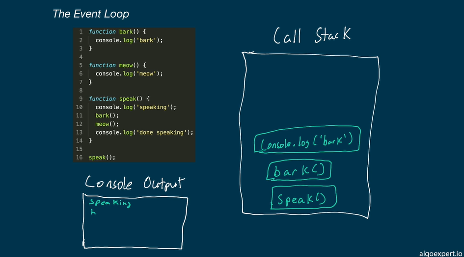

### JavaScript Runtime Engine

What happens if instead of foo() we do setTimeout(foo, 500)?
- it does not work
- we need another component for the system to work

JavaScript Engine is not doing all of the work - JavaScript Runtime Environment!
- provides functionality ontop of JS
- provides web APIs
    - setTimeout
    - fetch for HTTP requests

What happens when we call setTimeout: It calls on an API
- the code runs completely separate from our own (outside of engine)
    - when setTimeout is complete, it pops off call stack
    - browser keeps back of 500ms delay and callback to function foo()

What happens after 500ms ie. how does foo() get called?
- Task Queue

Task Queue: Data Structure
- when function is finished, Web API queues up foo() in the task queue
- task queue waits for call stack to be empty...
    - when it is, removes 1st task from queue and sends to call stack
        - in this example: task queue sends foo() to call stack AFTER main() is finished

### The Event Loop

This overall process: The Event Loop
1. Dequeue 1 task
2. Execute until the call stack is empty (task is complete!)
3. Render DOM changes
4. Repeat!
- will sit and wait if nothing to do

Key point: rendering does not happen in the middle of a task, it always happens after a task has been completed.

### Event Loop Example

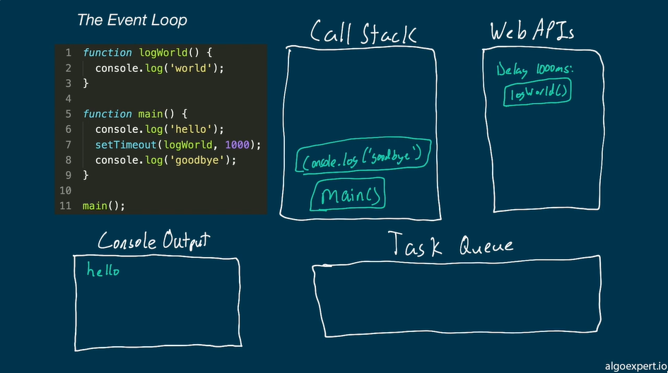

### setTimeout(func, 0)

There is still more nuance to see!

What happens if we call setTimeout with no delay ie. setTimeout(func, 0)?
- callback function does not run immediately
    - runs when stack is empty AND any tasks in front of it are done
    - low priority: "We can run the function, but wait for everything else to finish"

[Example](./figures/javascript/2.png)

Notes:
- logWorld() gets stuck in the Task Queue (has to wait until call stack is empty ie. main() is finished)

Key takeaway: Even with the 0 second delay, it still has the wait for all other code to be finished

### Slow Tasks

Avoid Slow Tasks!!
- they can block the page from rendering
- good rule: keep big computations on the server
    - more computational power on server than browser
        - chunking can help
        - web workers can help by running program separate of main

Another example:

[Example](./figures/javascript/3.png)

Notes:
- if superSlowFunction takes a minute, then the 1s delay for logWorld() has to wait that entire time in the task queue
    - UI will be completely unresponsive
    - besides the 1s delay, there is a lot of waiting

### Challenge Problem

Challenge Problem: What does mystery() do here?

``` js
function mystery() {
    console.log('first');
    setTimeout(() => console.log('second'), 1000);
    setTimeout(() => console.log('third'), 0);
    console.log('fourth');
    
}
```

Steps:
- mystery() is called
- console.log('first') is called and goes to console output 
- console.log('second') is called and after a 1s wait, Web API sends it to task queue
- console.log('third') is called and after a 0s wait, Web API sends it to task queue
    - console.log('third') is ahead of console.log('second') in task queue (it was sent there first)

- console.log('fourth') is called and goes to console output
- mystery() pops off, and now the call stack is empty.

- the task queue begins to empty (into the call stack)
    - console.log('third') goes to the call stack, then console output
    - finally, console.log('second') goes to the call stack, then console output


### Promises

What about promises? We must change our model to account for these.
- We need to add a 2nd queue to account for these: Micro task queue!

![Micro Task Queue]

Micro task queue: Role is to hold the callback function of promises
- anything to promise.then(), promise.catch(), promise.finally()
- async / await use it the same way

Micro Task Queue follows slightly different rules than the task queue!

### Event Loop Algorithm Re-visited

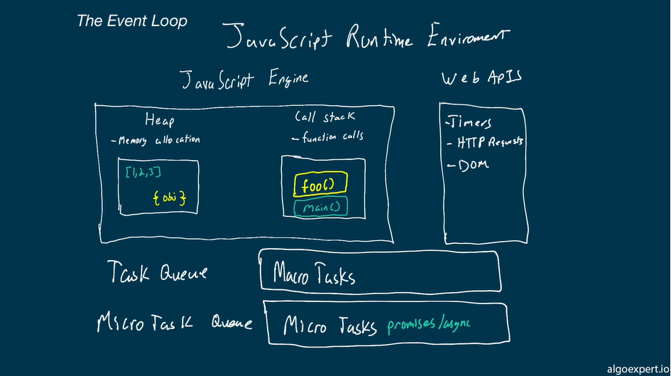

New Event Loop Rules:

1. Dequeue 1 task
2. Execute until the call stack is empty (task is complete!)
3. Execute all micro tasks until queue is empty
- this includes promises, etc.
4. Render DOM changes
5. Repeat!
- will sit and wait if nothing to do

### Event Loop Pseudocode

Psuedo code, after adding in the micro task queue:

``` js
while (true) {
    if (!taskQueue.isEmpty()) {
        execute(taskQueue.dequeue());
    }

    while (!microTaskQueue.isEmpty()) {
        execute(microTaskQueue.dequeue());
    }

    reRender();
}
```

### Promises Example

Example to combine all of these concepts:

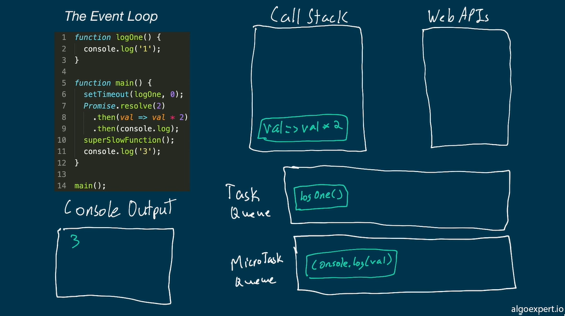

Notes:
- the 2nd .then() does not move into the micro task queue until after the 1st .then() is in the call stack
    - ie. after superSlowFunction() and console.log('3') are done
- logOne() goes last

### Why The Event Loop Matters

- Timers are not exact: Event a setTimeout() with 0 delay does not happen immediately
    - To be precise, need to use combination of date times and performance.now()
    - Good to know for interview for precision

- Promise callbacks can be delayed: If there are too many callbacks in microtask queue or if call stack is waiting for another function to finish
    - Promise callbacks still get higher priority than event/timer callbacks

- Slow tasks can be completely blocking: Avoid at all costs
    - chunking can help

### Chunking

Chunking: Split slow tasks into smaller ones

``` js
function chunkedSlowFunction() {
    setTimeout(processChunk, 0, 0); // 0 = no delay
}

// idea: after each 100,000 iterations, by making next chunk use
// setTimeout and push it to the back of the task queue,
// this frees up call stack for tasks/micro tasks to continue
// Powerful for clearing up these issues! (should ignore alltogether tho...)
function processChunk(start) {
    const end = start + 100000; // depends on your use case...
    for (let i = start; i < end; i++) {
        doCalculations(i);
    }
    if (end < 100000000) {
        setTimeout(processChunk, 0, end + 1); 
    }
}
```


# Lesson 21: Web Workers

JS just became multithreaded!

## Key Term

### Web Worker
A browser API for running scripts in a separate thread from the main execution thread.
- A worker object is created with the `Work(filePath)` constructor function
    - The argument to this function is a path to another .js file (that runs in a separate thread)

Workers can send messages back and forth with the main thread via the `postMessage(message)` method and the `onmessage` event. For example:

``` js
// main JavaScript file
const worker = new Worker ('worker.js');
worker.postMessage('hello');
worker.addEventListener('message', (event) => {
    console.log(event.data); // 'world'
});

// worker.js
postMessage('world');
addEventListener('message', (event) => {
    console.log(event.data); // 'hello'
});
```

In general: Most workers are dedicated workers
- Dedicated workers: They can only communicate with the script that created them
    - `SharedWorker`: can also be created to share a worker with multiple tabs or iframes
        - doesn't have widespread support across browsers yet...


## Notes from the video

### Setup

``` html
<!DOCTYPE html>
<html lang="en">
<head>
    <title>Web Workers</title>
    <script src="webWorkers.js" defer></script>
</head>
<body>
    <button id="slow">Slow Operation</button>
    <button id="say-hello">Say Hello</button>
</body>
</html>
```

``` js
// webWorkers.js
const slowButton = document.getElementById('slow');
const sayHelloButton = document.getElementById('say-hello');

slowButton.addEventListener('click', slowOperation);
sayHelloButton.addEventListener('click', sayHello);

function slowOperation() {
    for (let i = 0; i < 30000000000; i++) {
        1 + 2;
    }
    console.log('slow operation finished');
}

function sayHello() {
    console.log('hello world');
}
```

``` js
// worker.js
```

Steps:
- create the webWorkers.html file
    - html:5
- create webWorkers.js and worker.js
- VSCode > Go live on Port 5500 > Inspect > Console

### Intro
Web Workers = API provided by the browser
- not a core part of JavaScript
- something added to browsers to make our lives easier
- Purpose: run code in a separate thread
    - sometimes we have code that takes a long time, we don't want the block entire page!

### Dedicated Workers

Example: 

webWorkers.html: 
- 2 buttons
    - slow
    - say hello

webWorkers.js
- select both buttons with `document.getElementBy()`
- add click events on both buttons
    - slow operation iterates from 0 to 10000000
    - say hello goes right away to console.log()

How to fix this by using web worker:

``` js
// webWorkers.js
function slowOperation() {
    const pathToWorkerWhoRunsSeparateThread = 'worker.js';
    const worker = new Worker(pathToWorkerWhoRunsSeparateThread);
}
```

``` js
// worker.js
for (let i = 0; i < 30000000000; i++) {
    1 + 2;
}
console.log('slow operation finished');
```

Now that the long slow operations is done in a different thread, you can do the following:
- press 'slow operation' and wait
- press 'say hello' and have it work

Note: Cannot do any DOM manipulation in the worker...
- no access to the document


Next: Sometimes we want workers to interact with the main thread.
- let's use `worker.postMessage()` to do so:

``` js
// webWorkers.js
function slowOperation() {
    const pathToWorkerWhoRunsSeparateThread = 'worker.js';
    const worker = new Worker(pathToWorkerWhoRunsSeparateThread);
    worker.postMessage(10);
}
```

``` js
// worker.js
// add event listener
// - optional: self: reference to worker global scope (it works without self...)
//      - similar to window object in JS
//self.
addEventListener('message', event => {
    console.log(event.data);
});

// this does the same thing
// onmessage = function(event) {
//     console.log(event.data);
// }

console.log('slow operation finished');
```

Next: How to send info from worker.js to main file

``` js
// worker.js
addEventListener('message', event => {
    console.log(event.data);

    postMessage(event.data + 10);
});
```

``` js
// webWorkers.js
function slowOperation() {
    const pathToWorkerWhoRunsSeparateThread = 'worker.js';
    const worker = new Worker(pathToWorkerWhoRunsSeparateThread);
    worker.postMessage(10);

    worker.addEventListener('message', event => {
        console.log(event.data);
    });
}
```

Note: This happens via events, so it happens asynchronously!
- that is why 'slow operation finished' logs out before the 10 or the 20
    - need to wait for info to be sent between main/worker
    - also need to wait because call stack is not empty

A few more methods for worker:

worker.terminate(): Stop the worker from running
- prevents anything from happening, before the worker can do anything

```js
worker.terminate();
```

### Shared Workers

To this point: We have only looked at dedicated workers
- dedicated workers: Workers only accessible from the script that created them
    - ie. in this case the main script

- shared workers: Acessible 
    - different tabs in the same domain
    - iFrames, as well

Note: Almost no mobile browsers support this, so don't use this in production!
- good to know bc might become more common in the future


Biggest difference: Almost everything in a shared worker is specific to a port
- that is how the worker keeps track of who it is communicating with

Recommendation: Use worker.port.onmessage
- if you use the addEventListener() way, you will need to start the ports
    - who wants to do that!
        - can do it with `worker.port.start`...

Changes:
1. get the ports
- usually ports is length 1 for the 1 port
    - usually only 1 port per connection....

2. port.onmessage
- take a function that does our work
    - make sure to do port.postMessage

``` js
// webWorkers.js
worker.port.onmessage = function(event) {
    console.log(event.data);
};
```

We also need to make changes to worker file to make it a `shared worker`:
- instead of listening to messages at top level, we need to listen for a `connect` event
    - connect fires whenever something connects to this specific worker
        - reason we have this: there can be multiple connections, need to handle them individually
``` js
// worker.js
worker.port.onmessage = function(event) {
    const port = event.ports[0]; // 1st in array of length=1

    port.onmessage = function(event) {
        port.postMessage(event.data);
        // console.log(event.data); may not be able to post to console in some browsers..
    };
};
```

### Quick Recap

When you have a slow operation that does not depend on the DOM... use a web worker.
- it does not block the main thread
- browser still works as usual!

Note: Still would prefer to do everything on the server (if you can), the browser is not going to be as powerful as the server.


# Lesson 22: Browser Storage

These cookies tend to persist far longer than the delicious ones in your cupboard...

## Key Terms

### Cookies
The simplest form of browser storage
- Comprised of key-value pairs
- Most often: set by the server to store information 
    - ie. logged in user account
- Also: can be created via `document.cookie` in JS

### Local Storage


Learn more: https://developer.mozilla.org/en-US/docs/Web/API/Window/localStorage

### Session Storage


Learn more: https://developer.mozilla.org/en-US/docs/Web/API/Window/sessionStorage

### IndexedDB


Learn more: https://developer.mozilla.org/en-US/docs/Web/API/IndexedDB_API

## Notes from the video

### Setup

Write browserStorage.html: 
- html:5

``` html
<!DOCTYPE html>
<html lang="en">
<head>
    <title>BrowserStorage</title>
    <script src="browserStorage.js" defer></script>
</head>
<body>
    <h1>Browser Storage</h1>
</body>
</html>
```

- Create browserStorage.js
- Open .html file > Go Live on Port 5500 > Inspect > Console

### Cookies

Browser Storage: Have that information persist across sessions ie. you close a tab

Cookies: Most traditional form of browser storage
- key value pairs
- confusing API to work with

``` js
// appending values to document.cookie
document.cookie = 'user=Conner'; // user=Conner 
document.cookie = 'course=FrontendExpert'; // 'userConner; course=FrontendExpert 

// changing value
document.cookie = 'user=Myles'; 

// logging
console.log(document.cookie); // contains every cookie on a page
```

Notes:
- cookes expire when the session ends
    - you can change the timeframe

Deleting cookies: You cannot!
- you can set it to expire immediately, though

``` js
// utc formatted date (more traditional)
document.cookie = 'user=Clement; expires=`${new Date().toUTCString()}`'
// max age (# of seconds)
document.cookie = 'user=Clement; max-age=0' // this is WAY cleaner!!
```

More args:

- path: path within website where cookie is used
    - root
    - root/my_directory

``` js
document.cookie = 'user=Clement; path=/my_directory';
```

- secure: only allows https (no http)
    - does not take in a value

``` js
document.cookie = 'user=Clement; secure';
```

- samesite: "We don't ever want this cookie to be shared across origin"
    - strict

``` js
document.cookie = 'user=Clement; samesite=strict';
```

Try putting this in your script, and then do the following:
- Inspect > Application > Storage > Cookies > localhost:5500
- You will see the cookies you just saved
    - checkbox under 'Secure' for HTTPS only
    - 'Strict' for samesite


So... how do we get the values from our cookies?

current format when logged to console: `course=FrontendExpert; user=Clement`

Let's try and get these values!

``` js
const course = document
    .cookie
    .split('; ')
    .find(cookie => cookie.startsWith('course=')) // keep = sign to make sure we get the course
    // now get the value...
    .split('=')[1]; // grab second value because [0] would be 'course' here

console.log(course); // FrontendExpert
```

What this code did:
- iterate through array of cookies
- return value that 1st matches the callback function


Takeaway from Cookies
- difficult to deal with
    - lots of string manipulation!
    - really good libraries out there to do this for you...

### Web Storage

Web Storage API: Contains key value pairs (just like cookies)
- easier to work with
- more space to allocate with (if you run out of space for cookies)
- more specific to browser / JS
    - cookies are set by the server, for example

- local storage: 
    - does not expire (have to manually delete)
    - 

- session storage: 
    - expires at end of session
    - 

How to use local storage?

``` js
localStorage.setItem('user', 'Conner'); // set items
localStorage.setItem('course', 'FrontendExpert');
console.log(localStorage.getItem('user'));
console.log(localStorage.getItem('course'));

localStorage.removeItem('user') // delete 1 item
console.log(localStorage.getItem('user'));
console.log(localStorage.getItem('course'));

localStorage.clear(); // delete it all
console.log(localStorage.getItem('user'));
console.log(localStorage.getItem('course'));
```

Session Storage?
- do the same thing but change localStorage to sessionStorage

How to look at local and session storage:
- Inspect > Application > Storage
    - local storage > localhost:5500
    - session storage > localhost:5500

### IndexedDB

IndexedDB: Much more complicated (less popular)
- used for data more complex than key-values
    - Object store database
        - can store JS objectsa
            - even entire files!

        - not a relational database

Notes:
- everything is asynchronous
    - addEventListener() is used

``` js
// Create/Open up a database (makes a new one named '')
// - name of database: myDatabase
// - version number: 1
const request = indexedDB.open('myDatabase', 1);

// upgradeneeded: first the first time we make a database OR when we upgrade the database
request.addEventListener('upgradeneeded', event => {
    // 
    const database = event.target.result;

    // create database object store
    // - keyPath: the primary key
    const store = database.createObjectStore('users', {keyPath: 'id'}); 

    // creates another index that you can grab from later on
    // - a way to quickly search the store
    //     - param 1: name for the index
    //     - param 2: which object key to look through
    store.createIndex('name', 'name');

    // adding new records
    store.add({
        id: 0,
        name: 'Conner',
        course: 'FrontendExpert'
    });

    store.add({
        id: 1,
        name: 'Clement',
        course: 'AlgoExpert'
    });
})
```

How to view:
- Inspect > Application > Storage > IndexedDB > users

About the users page:
- key path: id
- Value: the entire JS object/dict

About the name index page:
- Key path: name
- Primary key: id
- Value: The entire JS object/dict

Connecting to a database that already exists
- 'success' happens whenever you connect to a database

``` js
const request = indexedDB.open('myDatabase', 1);

// sucess: first the first time we make a database OR when we upgrade the database
request.addEventListener('success', event => {
    const database = event.target.result;
    
    // use transactions to update the database
    database
        .transaction(['users'], 'readwrite') // 
        .objectStore('users')
        .add({
            id: 2,
            name: 'Ryan',
            course: 'MLExpert'
        }),

    // delete
    database
        .transaction(['users'], 'readwrite') // 
        .objectStore('users')
        .delete(1); // deletes id=1
})
```

View changes:
- Inspect > Application > Storage > IndexedDB > users > Press refresh

Finally: Get values from the database

``` js
const request = indexedDB.open('myDatabase', 1);

request.addEventListener('success', event => {
    const database = event.target.result;

    // get is asynchronous, need to wait for success event, so save into a request
    const req = database
        .transaction(['users'], 'readwrite')
        .objectStore('users')
        //.get(0); // get the index of id=1

        // you can also get via index of name, since we created that index
        .index('name') // note: this is non-unique, would return the 1st row with name == 'Ryan'
        .get('Ryan'); // 

    req.addEventListener('success', event => {
        console.log(event.target.result.name);
        console.log(event.target.result);
    })

})
```

### Takeaways

We don't use this often...
- Recommended: Local storage/session storage
- IndexedDB > cookies
    - everything has its own use case tho...


# Lesson 23: Data Structures with JavaScript

You thought you would escape data structures.. think again

## Key Terms

### Map

A built-in JavaScript class for holding key-value pairs. 

While similar to standard objects, there are a few key differences:
- Maps keys can be ANY type (object keys must be strings or symbols)
- Maps maintain insertion order for iteration (objects do not)
- Maps cannot easily be converted the JSON (objects can...)
- Mapps cannot utilize the prototype chain for inheritance (Objects can and do oftentimes...)

Learn more: https://developer.mozilla.org/en-US/docs/Web/JavaScript/Reference/Global_Objects/Map

### Set

A built-in JavaScript class for holding unique values, of any type.

Values are considered unique if they are different primitives or references to different objects (this means that two different objects with the same contents are considered unique from one another)

Values in Sets are kept in insertion order for when the Set is iterated over.

Learn more: https://developer.mozilla.org/en-US/docs/Web/JavaScript/Reference/Global_Objects/Set

### WeakMap

A built-in JavaScript class for holding key-value pairs, similar to the Map class.

2 primary differences:
- WeakMap can only hold objects as keys
    - primitive values cannot be added as keys

- WeakMaps hold "weak" references to objects, meaning that they do not prevent the objects from being garbage collected.
    - If no other references to an object exist, it can be garbage collected and automatically removed from the WeakMap
        - Because of this, you cannot iterate over WeakMaps

Learn more: https://developer.mozilla.org/en-US/docs/Web/JavaScript/Reference/Global_Objects/WeakMap

### WeakSet

A built-in JavaScript class for holding unique values, of any type, similar to the Set class.

However, a WeakSet acts just like a WeakMap, meaning that the values must all be objects, and references to those objects are "weakly" held.

Learn more: https://developer.mozilla.org/en-US/docs/Web/JavaScript/Reference/Global_Objects/WeakSet

## Notes from the video

### Setup

```sh
cd javascript_crash_course
mkdir 23_data_structures_with_javascript
cd 23_data_structures_with_javascript
echo > dataStructures.js
```

### Intro

Goal of video: NOT to teach data structures
- Purpose: How to use the common data structures in JS

Even if you are doing a frontend interview, you may get data structures questions.

### Stacks

There is no Stack in JavaScript. You can use an array though:

```js
const stack = [];
stack.push(1);
stack.push(2);
console.log(stack.pop()); // 2
```

Remember: 
- Stack: Last in, First out

### Queue

Just like stacks, you can use arrays for these:

```js
const queue = [];
queue.push(1);
queue.push(2);
console.log(queue.shift()); // 1
```

Remember: 
- Stack: First in, First out

Note: Shift is usually less efficient than pop
- Use .pop() if you can
    - .shift() used to be O(n), whereas pop is always O(1)

You can always used a linked list instead of an array, too.

### Maps

Option #1: JavaScript Object
- Used throughout the course

Option #2: Map

```js
const map = new Map();
map.set('test', 123);
map.set(10, 'ten');

console.log(map.get('test')); // 123
console.log(map.get(10)); // 'ten'
console.log(map.size) // 2

console.log(map.has('three-thousand')); // false
map.set('three-thousand', 3000); 
console.log(map.has('three-thousand')); // true


map.set({}, 41);
console.log(map.has({})); // false

const obj = {};
map.set(obj, 42); 
console.log(map.has(obj)); // true

map.delete(10);
console.log(map); // Map(4) { 'test' => 123, 'three-thousand' => 3000, {} => 41, {} => 42 }
map.clear();
console.log(map); // Map(0) {}
```

Next, how to iterate through the map:

```js

```

OK: When to use map vs. object?

Answer: Usually, it does not matter!

When does it matter, tho?
- Using keys that are not string/symbol: MAP
- Concerned about iterating through the map in order: MAP
- Something very simple: OBJECT
- Sending object to server via JSON: OBJECT
- Need inheritance: OBJECT

One final component of maps: If you have data already in the format of arrays, you can use that to instantiate the map

```js
// 2d array with each value in the array being another array
const map = new Map([['test', 123], [10, 'ten']]);

const iter = map.entries();
console.log(iter.next().value); // [ 'test', 123 ]
console.log(iter.next().value); // [ 10, 'ten' ]
console.log(iter.next().value); // undefined
```

### Sets

Sets: Very similar to map
- maps: key value pairs
- sets: just values
    - map where you don't care about values

```js
const set = new Set();

// add to set
set.add(123);
set.add(456);
console.log(set); // Set(2) { 123, 456 }

// check if value is in the set
let bool = set.has(69);
console.log(bool); // false

set.add({});
bool = set.has({});
console.log(bool); // false

// delete elements
console.log(set.has(123)); // true
set.delete(123);
console.log("deleting 123...");
console.log(set.has(123)); // false

// iterate through set
for (value of set) {
    console.log("for loop:"); 
}
set.forEach(value => {
    console.log("using for each method...")
})


// iters
const iter = set.values(); // can use .entries() or .keys(), values==keys
console.log(iter.next().value); // 456
console.log(iter.next().value); // {}
console.log(iter.next().value); // undefined

// remove duplicates from an array
const arr = [1,1,1,1,1,1,1,1,1,2,2,2,2,2,2,2,2,2,3,3,3,3,3,3,3,3];
console.log(arr);
console.log(Array.from(new Set(arr))); // [ 1, 2, 3 ]
```


### WeakSets + WeakMaps

```js
const weakSet = new WeakSet();

// weakSet.add(123); // error
weakSet.add({});
console.log(weakSet); // WeakSet { <items unknown> }
```

Purpose:
- WeakSet does not prevent garbage collection
    - traditionally: object cannot be garbage collected because a set or map is using it
    - other times when you want the object to be removed 
        - if you don't need the object anymore: it gets removed from the WeakSet

```js
const weakSet = new WeakSet();
const set = new Set();


// immediately invoked function expression
(function() {
    let obj = {"value": 1};
    weakSet.add(obj);
    set.add(obj);

    obj = {"value": 69};
    weakSet.add(obj);
    set.add(obj);

})();

// once it is done, the obj can be garbage collected.
console.log(weakSet); // WeakSet { <items unknown> }
console.log(set); // Set(2) { { value: 1 }, { value: 69 } }
```

Final point: You cannot iterate through weakSet
- you cannot check the size ie. with `.size`
    - it says undefined or `<items unknown>`
        - you need to use the `.has(obj)` to find if something is in it.

### Linked Lists

Linked Lists
- not provided by JavaScript (need to implement with a class or library)
- we will implement this linked list `Node` with a class/constructor

```js
class Node {
    constructor(value) {
        this.value = value;
        this.next = null;
    }
}

class LinkedList {
    constructor(){
        this.head = null;
    }

    addStart(value) {
        const node = new Node(value);
        // const tempHead = this.head
        // this.head = node;
        // node.next = tempHead;
        node.next = this.head;
        this.head = node;
    }

    addEnd(value) {
        const node = new Node(value);
        // iterate and add at the end...
        let curr = this.head;

        if (curr == null) {
            this.head = node;
            return;
        }

        while (curr.next) {
            curr = curr.next;
        }

        curr.next = node;
    }
}

const list = new LinkedList();
list.addStart(1);
list.addStart(2);
list.addStart(3);
list.addStart(4);

list.addEnd(69);

console.log(list); // LinkedList {
//     head: Node { value: 4, next: Node { value: 3, next: [Node] } }
//   }

console.log(list.head); // Node {
//     value: 4,
//     next: Node { value: 3, next: Node { value: 2, next: [Node] } }
//   }

console.log(list.head.next.next.next.next); // Node { value: 69, next: null }

console.log(list.head.next.next.next.next.next); // null

```

### Git

```sh
cd algoexpert.io
git status
git add .
git commit -m "Completed Lesson 23 of FrontendExpert's JavaScript Course"
git push -u origin main
git status
git log --oneline
```


# Lesson 24: JavaScript Frameworks

Another "React is good, Angular is bad" type of video?

## Key Terms

### JavaScript Library

A collection of pre-written JS code
- Usually: in the form of function that can be called throughout other projects to simplify the development process

### JavaScript Framework

A collection pre-written JS code that provides some additional structure to a project
- Often said: Frameworks are more "opinionated" than libraries
    - frameworks call your code
    - your code calls a library

## Notes from the video

### Frameworks vs. Libraries

Frameworks and Libraries
- used interchangably, but completely different things

Libraries: Collection of re-usable functions, "not opinionated"
- does not care how/where you use them
- they will work anywhere in your code

Framework: A provided structure for your code, "opinionated"
- concept: inversion of control: design pattern in which custom-written portions of a computer program receive the flow of control from a generic framework.


### Utility Libraries

Utility Library: Set of functions, fairly generic
- underscore: over 100 utility functions
    - useful for manipulating objects, arrays, functions, etc.

- lodash: purpose was to make a more consistent API for underscore
    - aimed for better performance

End result: 2 very good libraries
- pick which one you like!
- you can also use both...

### jQuery

jQuery: DOM manipulation library
- can be used instead of `fetch`
- historically: largest library on the web
    - over time, many have been adopted by other libraries/frameworks
        - some have even become part of JS
        - it is less popular than it used to be

Many people's opinion: Don't use jQuery on new projects

### React

React: Most popular library right now (made by Facebook)
- declarative user interface library: we use React to built out user interfaces
- JSX syntax for HTML in JavaScript: ability to write HTML inside of JS
    - React handles a lot of the work for us

React is the most framework-y library we use, but it is still a library, technically!
- key distinction: library for building out key components
    - building our own html elements, then React keeps a virtual DOM (is not rendered by browser yet)
        - react DOM takes the virtual dom and combines with normal DOM (visible to user)

At its core: React provides functions to make components
- is not opinionated!

### Angular

Angular: Framework for developing web applications (Made by Google)
- Angular (new) vs. Angular.js (older)
- Reusable components with HTML templates
    - we are writing actual HTML

- Comes with a collection of libraries and developer tools
    - besides syntax, this is biggest difference between React
    
Newest version of Angular ie. `Angular`: Defaults to TypeScript
- usually, it comes down to what you prefer

Common thought: Angular is harder to learn

### Vue

Vue: Progressive framework for building user interface
- Components built with HTML templates (also supports JSX)
- Uses a virtual DOM, similar to React

Best part about Vue: It is easy to add to a project
- you can use it incrementally, like a library adding little parts of Vue into your project

Result of this flexibility: Very popular recently! 
- Vue is very easy to learn

### Choosing a Framework

How to choose which to use, when there are 1000s there?
- learning curve: some are way harder (depends on person)
    - documentation: if they have good documentation, it is a good one to learn easier

- open source community: community around the framework ie. with React/Angular, there is a lot of support
    - the extra libraries made on top of the framework are the best
    - not just the community building it (they are active)

Remember: You do not ALWAYS need a framework!
- example: quick portfolio website: do you really need a framework?
    - would be easier with Vanilla HTML/CSS/JS

### Other Tools

Does not fall in category of Framework or Library...

Babel: Compiler for supporting new features in older browsers
- the ultimate polyfill

Webpack: Module bundler
- idea: creates a dependency graph
    - goes through all modules you use, and get all modules that those modules need
        - puts it all in 1 js file

- alternatives: rollup

Typescript: Superset of JS
- Programming language/framework around js
- "Strong typing": The main difference
    - include typing in our JS to prevent bugs
    - largest strong typing library/framework
        - flowJS is similar, with different syntax

Node: Backend JS runtime environment
- You can use JS for the backend with Node
- Most commonly used
    - alternatives: Dino

Note: We have not used Node because this is a frontend course...

### Git

```sh
cd algoexpert.io
git status
git add .
git commit -m "Completed Lesson 24 of FrontendExpert's JavaScript Course"
git push -u origin main
git status
git log --oneline
q
```


# Lesson 25: TypeScript

JavaScript, but better in every (?) single way!

## Key Term

### TypeScript

A superset of JavaScript addigng static typing.
- Primary purpose: prevent bugs related to incorrect types + improve development workflow

Note: Browsers only understand JavaScript, so TypeScript is compiled back into JS

Learn more: https://www.typescriptlang.org/

## Setup

Directory:

```sh
cd javascript_crash_course
mkdir 25_typescript
cd 25_typescript
echo > typescript.ts
```

And now for TypeScript installation:

```sh
npm install -g ts-node
tsc -v
```

[Reference Link](https://stackoverflow.com/questions/44764004/ts-node-is-not-recognized-as-an-internal-or-external-command-operable-program)

## Notes from the video

### Introduction to TypeScript

TypeScript = A supserset of JS
- What this means: JS syntax is valid for TypeScript, but TypeScript has more syntax
    - TypeScript lets you declare types

```ts
// works in JS (typescript.js)
let test = 123;
test = 'string';
console.log(test);

// does NOT work in TypeScript (typescript.ts)
let test = 123;
test = 'string';
console.log(test);
```

Manually declare a type:

```ts
let test: number = 123; // good
// let test: number = '123'; (error since '123' is not a number)
console.log(test);
```

The special any type: 
- basically a bail-out
- good for converting scripts, it is a catch-all
    - converts to standard JS rules

```ts
let test: any = 123;
test = '456789';
console.log(test);
```

Note: This type coercion is typically a bad idea.

What is the correct way to do this?

```ts
let test: number | string | boolean = 123;

test = '456789';
console.log(test); // '456789'

test = 0;
console.log(test); // 0

test = true;
console.log(test); // true

test = {};
console.log(test); // error!
```

Union type: "the variable can either be a string, or number"
- if you try to assign to something else, you get an error.

We can even name these union types as custom types:

```ts
type NumString = number | string;
let test: NumString = 123;
test = 'string456';
console.log(test);
```

What to use a custom type for: 
- Useful for using same type for multiple variables
    - Make sure they stay in sync

Now, these types we use do not need to be generic JS.

Here is an example of that:

```ts
type State = 'off' | 'on';
let test: State = 'off';
test = 'on';
console.log(test);

test = 'on1'; // this would cause an error
```

Great for:
- boolean, with more values
- example: Status
    - success
    - failure
    - error
    - pending

### Enums

Another way to handle the Union String case...

Enum = Enumerated Value
- 

```ts
enum State {
    On = 'on',
    Off = 'off',
}

let test: State = State.Off;
test = State.On;
console.log(test); // on
```

Instead of using the raw strings, we use the enum.
- If you do not init enum with values, you will get 0, 1, 2, ...
    - On: 0
    - Off: 1

### Functions

Let's look at a basic function:

```ts
function add(x, y) {
    return x + y;
}
```

This can create errors in JS. Why?
- if you pass in a string, it will concat the values (instead of math addition)

TypeScript can help easily fix this:

```ts
function add(x: number, y: number): number {
    return x + y;
}

const x = add(2, 2);
console.log(x); // 4
```

What did we do here:
- Set input types to number
- Set return type to number

If we do not want to return anything, we would set return type to void:

```ts
function add(x: number, y: number): void { // if you leave return type as number, you get an error
    // return x + y;
    console.log(x + y);
}

add(2, 2);
```

### Objects & Interfaces

Objects

Let's start with 2 basic Objects:

```ts
const conner = {
    name: 'Conner',
    course: 'FrontendExpert',
};

const clement = {
    name: 'Clement',
    course: 'AlgoExpert',
};

```

Types: Working as we expect
- Both key/values are strings

Clement and Connor are both the same type. How we we make sure it stays that way?

Interface!

Interface: 
- Created similarly to Enums

```ts
interface Instructor {
    name: String;
    course: String;
}

const conner: Instructor = {
    name: 'Conner',
    course: 'FrontendExpert',
    // age: 24, (this would give an error)
};

const clement: Instructor  = {
    name: 'Clement',
    course: 'AlgoExpert',
};

```

Notes:
- You say what the keys are with the objects
    - Traditional way: semicolon after the value
    - Newer TypeScript way: comma after the value

- We changed the declaration to have type 'Instructor'
    - If you try and add the `age` key to connor, you get an error
        - Type: 

We have made sure that connor and clement stay the same type!

What if we want age to be optional?

```ts
interface Instructor {
    name: String;
    course: String;
    age?: number;
}

```

Notes:
- Put a ? before the semicolon for the optional param to avoid an error in Clement's Instructor

Next, we can use interfaces with classes:

```ts
interface Instructor {
    name: string;
    course: string;
    age ?: 24;
}

class AlgoExpertInstructor implements Instructor {
    name: string;
    course: string;

    constructor(name: string) {
        this.name = name;
        this.course = 'AlgoExpert';
    }
}

const tim = new AlgoExpertInstructor('Tim');
console.log(tim); // AlgoExpertInstructor { name: 'Tim', course: 'AlgoExpert' }
```

Notes:
- We created a class
    - This class implements the Instructor Interface

- String vs. string
    - String: JavaScript string object
    - string: primitive value
        - usually we want the lowercase...


### Generics

Generics: Using the 
- Can be used in powerful ways with our functions and interfaces

Example: Let's say we have an array
- We have numbers AND a string for '4'
    - TypeScript does not prevent this
    - We can change this so that it give it a type
        - Strong typed like C++!

```ts
const arr: Array<number> = [1,2,3,4];
console.log(arr); // [ 1, 2, 3, 4 ]

// const arr2: Array<number> = [1,2,3,4, 'string does not belong', ];
console.log(arr); // this won't print anything because of an error


```

Using it with an interface:

```ts
interface GetterSetter<Key, Value> {
    set: (key: Key, value: Value) => void;
    get: (key: Key) => Value;
    
}

class StringNumGetterSetter implements GetterSetter<string, number> {
    map: Map<string, number> = new Map();

    set(key: string, value: number): void {
        this.map.set(key, value);
    }

    get(key: string): number {
        // error: Typescript: Type 'string | undefined' is not assignable to type 'string'
        // return this.map.get(key);

        // fix; Using the non-null assertion operator to solve the error
        // ie. non-null assertion
        return this.map.get(key)!; // 👈️ non-null assertion
    }
}
```

Notes:
- Created new interface that describes the shape of an object
    - Has functions inside of it
        - Get key (function)
        - Set key (function)

    - What is the type that these functions return?
        - Key: generic
        - Value: generics


### Takeaways on TypeScript

TypeScript: Recommended for any large-medium sized project
- Can prevent bugs
- Can also add extra layer of complexity with small projects

This video: High level TypeScript concepts
- You cannot master it without going through documenation / using it in your own codebase
    - Even better: Complete AlgoExpert problems with TypeScript!

### Git

```sh
cd algoexpert.io
git status
git add .
git commit -m "Completed Lesson 25 of FrontendExpert's JavaScript Course"
git push -u origin main
git status
git log --oneline
q
```


# Lesson 26: Debugging Strategies

console.log('did we hit this?')
...
console.log('i give up...')

## Key Term

### Developer Tools

A set of tooling provided by the browser the simplify the process of debugging frontend code.
- Example: Chrome comes with the Chrome DevTools

## Setup

Directory:

```sh
cd javascript_crash_course
mkdir 26_debugging_strategies
cd 26_debugging_strategies
echo > debuggingStrategies.html
echo > debuggingStrategies.css
echo > debuggingStrategies.js

```

```html
<!-- debuggingStrategies.html -->
<!DOCTYPE html>
<html lang="en">
<head>
    <!-- <meta charset="UTF-8">
    <meta name="viewport" content="width=device-width, initial-scale=1.0"> -->
    <title>Debugging Strategies</title>
    <link rel="stylesheet" href="debuggingStrategies.css" />
    <script src="debuggingStrategies.js" defer></script>
</head>
<body>
    <div id="circle"></div>
    <button>Move Right</button>
</body>
</html>
```

```css
/* debuggingStrategies.css */
#circle {
    position: relative;
    width: 50px;
    height: 50px;
    border-radius: 50%;
    background: red;
    margin-bottom: 12px;
}
```

```js
// debuggingStrategies.js
const button = document.querySelector('button');

button.addEventListener('click', moveRight);

function moveRight() {
    const circle = document.getElementById('circle');
    const { left } = getComputedStyle(circle);
    circle.style.left = left + 10;
}
```

What are code is doing:
- html: div that creates a red circle in the output, with a button
- css: makes circle visible
    - uses position relative so that the button moves the circle to the right a bit everything
        - it modifies the 'left' attribute
- js: selected the button
    - added event handler
        - get circle
        - get computed style of left value
        - set value to be previous value + 10

Fire this up in the development/local server:
- Make sure that 'Live Server' extension is download to VSCode
- Open up debuggingStrategies.html
- Start the live server
    - 'Go Live' button in bottom right

This will run the live server, and open your .html file in Google Chrome on Port 5500. 

To see console.log() and other debugging later, you should Open up the Inspect Page:
- Right click on .html page > Inspect > Console

One more thing: Chrome added support for source maps, so if you are using chrome, do the following:

- Go to the developer tools (F12 in the browser), then select the gear in the upper right corner, and go to Settings.

- Then, in Settings/Preferences, look for Sources, and disable the options:
    - "Enable JavaScript source maps"
    - "Enable CSS source maps"

Note: You can also view HTML this way:
- Download 'HTML Preview' extension
- Toggle Preview - ctrl+shift+v
- Open Preview to the Side - ctrl+k v

Another Note: As it currently stands, our program does not work how we want it to!

## Notes from the video

How do we figure out what is wrong with our program?

### console.log()

console.log(): Most simple way to debug code, also very powerful
- May be only debugger allowed to use during a coding interview!

Let's look at the console:
- Check for error messages
- Track through code where error/mishap is occurring

```js
const button = document.querySelector('button');

console.log(button); // expected: <button>Move Right</button>

button.addEventListener('click', moveRight);

function moveRight() {
    const circle = document.getElementById('circle');
    const { left } = getComputedStyle(circle);

    console.log(left);


    // circle.style.left = left + 10;

    // get correct number + concat with pixels
    circle.style.left = parseInt(left) + 10 + 'px'; // everytime i click it goes from 0 -> 10 -> 20 -> 30
}

```

Note:
- Jumping around to areas that could be problematic is better than putting prints everywhere


### debugger;

debugger: At each `debugger` breakpoint, JavaScript will stop executing, and let you examine JavaScript values.
- Has different effect depending on environment:
    - Chrome: If DevTools is open, a debugger will open up
    - Others: may be ignored
        - But fortunately, all modern browsers have a built-in JavaScript debugger.

```js
const button = document.querySelector('button');

button.addEventListener('click', moveRight);

function moveRight() {
    debugger;
    const circle = document.getElementById('circle');
    const { left } = getComputedStyle(circle);
    // console.log(left);
    // circle.style.left = parseInt(left) + 10 + 'px';
    // back to not working for the example...
    circle.style.left = left + 10;
}

```

Valuable information that you can see now that the debugger paused:
- Scope: Any variables
    - this: button
    - circle: undefined

- We now have options to move through the code:
    - play button: keep going
    - step over: 
    - step into: 
    - step out:
    - step: Click this to get to the next line of code
        - if you keep clicking next, you will notice that adding 10 to 0px won't work!

- You can also hover over values to see what they are

Remove the debugger statement and move on.

```js
function moveRight() {
    // debugger;
    ...
}
```
     
### Breakpoints

How to debug with 1000s of lines of code?

Head to Chrome > Inspect > Sources > Event Listener Breakpoints:
- You will see different types of event listeners
- You can add breakpoints without having to touch the .js file
    - We are interested in Mouse > Click events

Another way to add a breakpoint: 
- Right click on the line of code > Add breakpoint...

Good practice:
- Add breakpoint at end of function
- Check that all values appear as they should

### Network Tab

Network Tab: Shows all of the network requests that were made.

Head to Chrome > Inspect > Network.

You will see the following:
- Name of Requests
    - status
    - type
    - initiator
    - size
    - time

### Takeaways on Debugging

Almost all debugging goes in the Console/Sources tab.
- If you get an error by calling fetch, going into Network can help see the following:
    - what values came back
    - headers
    - etc.

### State of debuggingStrategies.js before pushing to Git

```js
// debuggingStrategies.js
const button = document.querySelector('button');

console.log(button);

button.addEventListener('click', moveRight);

function moveRight() {
    // debugger;
    const circle = document.getElementById('circle');
    const { left } = getComputedStyle(circle);
    console.log(left);

    circle.style.left = parseInt(left) + 10 + 'px';
}

```

### Git

```sh
cd algoexpert.io
git status
git add .
git commit -m "Completed Lesson 26 of FrontendExpert's JavaScript Course"
git push -u origin main
git status
git log --oneline
q
```


# Lesson 27: Writing Clean JavaScript

Time to get your hands dirty and learn how to write some clean JavaScript code - oxymoron perhaps intended.

## Key Terms

### Autoformatter

A program that automatically formats code based on a set of rules
- Makes it easy to maintain stylistic consistency
- Prettier is the most common autoformatter
    - there are alternatives out there too!

### Style Guid

A document describing the preferred coding style for a project or organization used to promote clean and consistent code.
- Many styles guide are open source
    - Example: Google JavaScript Style Guide

## Setup

Directory:

```sh
cd javascript_crash_course
mkdir 27_writing_clean_javascript
cd 27_writing_clean_javascript
echo > writingCleanJavascript.js
```

```js
// writingCleanJavascript.js
console.log("Hello world");
```

## Notes from the video

### What is clean Code?

Clean code: 
- Easy to understand
- Easy to update
- Easy to maintain

Idiomatic code: Follows standard practices of the language

### Use Modern Syntax

Try to incorporate this modern syntax into your code!

- Arrow functions
    - Use for small inline functions that don't need a `.this` context

- Destructuring
    - Good because you use a lot of objects

- Templates literals
    - Anytime you need to concat a string with another value

Advice: "Think in JavaScript" as opposed to writing in another function and then translating it into JS

### Avoid Callback Nesting

Having a callback function that takes in another callback function = Bad
- Each level of nesting makes it hard to follow
- They become more and more dependent on other functions

Better practice: Using promises
- async/await
    - by doing this, we can prevent having too many callback functions
    - makes code easier to read

### Don't Overuse 'this'

This does not mean we can never use it - but do not abuse it!

When not to use:
- Extra parameter
    - Binding values to this

Makes more sense to add parameters.

### Use Functional Programming

When coming from a more object oriented language, you should take note of this!

JavaScript = Multi-paradigm language
- Most of the time: Use JS as a functional language
- Utilize function chaining
    - Gives code a more declarative feel

### Code Autoformatters

Use Code Autoformatters!!

What is it?
- Automatically formats code on save
- Creates consistency across developers

Best autoformatter: Prettier

How to use Prettier?

Steps:

1. Head to https://prettier.io/ > 'Try it online'

2. Write some code
- It will automatically fix it on the right hand side!

3. Set optional params on the left side

### Style Guides

Style Guides: Not just for JS, is a set of guidelines
- Goal is not to be "correct", but to get consistency!
    - Pick 1 style guide and go with it

### Takeaways on Writing Clean JavaScript

Use Prettier!

### Git

```sh
cd algoexpert.io
git status
git add .
git commit -m "Completed Lesson 27 of FrontendExpert's JavaScript Course"
git push -u origin main
git status
git log --oneline
q
```

## Completing the JavaScript Crash Course

### Git

```sh
cd algoexpert.io
git status
git add .
git commit -m "Completed FrontendExpert's JavaScript Course"
git push -u origin main
git status
git log --oneline
q
```

--

# React Crash Course

## 0: Setup

```sh
cd FrontendExpert

mkdir react_crash_course
cd react_crash_course

mkdir 1_introduction
mkdir 2_react_basics
mkdir 3_jsx
mkdir 4_props
mkdir 5_event_driven_programming
mkdir 6_state
mkdir 7_component_lifecycle
mkdir 8_refs
mkdir 9_imperative_react
mkdir 10_contexts
mkdir 11_components_list
mkdir 12_performance
mkdir 13_writing_custom_hooks
mkdir 14_portals
mkdir 15_class_based_components
mkdir 16_error_handling
mkdir 17_debugging_react
mkdir 18_best_practices
mkdir 19_react_under_the_hood
mkdir 20_companion_libraries

```

Next, open your VSCode editor to the folder of 'react_crash_course'.

Finish by updating Git:

```sh
cd algoexpert.io

git status
git add .
git commit -m "Began FrontendExpert's React Course"
git push -u origin main
git status
git log --oneline
q
```

## 1: Introduction

### Key Terms

### Notes from the video

Other Crash Courses in FrontendExpert: Learning about common interview topics of Frontend Dev
- Companies want to see you be good with Vanilla JS
    - They can teach you everything else after...
        - Smaller and medium sized companies may test you out on the actual frameworks, so React is a good one to learn

This course: Learning about a JS Framework, React
- More realistic scenarios
- Start basics 
- Work way up using industry best practices
- React = Very valuable skill to have
    - You will probably work on a React project at some point
    - Good / translatable skills come from learning React

#### Git

```sh
cd algoexpert.io

git status
git add .
git commit -m "Completed Lesson 1 of FrontendExpert's React Course"
git push -u origin main
git status
git log --oneline
q
```

## 2: React Basics

### Key Terms

#### React

A JavaScript library developed by Facebook for building user interfaces.
- Uses a component-based architecture to create interfaces with an intuitive declarative approach

Learn more: https://react.dev/

#### Component

A reusable independent piece of a user interface.
- In modern React: Components are usually functional components
    - ie. simply functions that return JSX

Note: JSX = JavaScript XML, a syntax extension for linking XML and HTML in JS.

#### JSX (Short for JavaScript XML)

A JavaScript syntax extension for inlining XML and HTML in JavaScript.

For example: This code could be compiled into standard JavaScript functions calls to create a heading element:

```js
const h1 = <h1>Hello World</h1>;
```

Learn more: https://react.dev/learn/writing-markup-with-jsx

#### ReactDOM

A package used with React to work as the bridge between React elements and the actual DOM in the browser.
- The most frequently used ReactDOM function: `render`
    - Adds a component to the DOM

For example:

```js
ReacTDOM.render(
    <h1>Hello World</h1>,
    document.getElementById('root')
);
```

Learn more: https://react.dev/reference/react-dom

### Notes from the video

#### Setup

```sh
cd 2_react_basics
echo > 
```

#### Key Characteristics

React: JS Library for Building UI
- Sounds vague, but will expand on that.

Key Characteristics:
- Declarative: Describe what UI should look like, not all of implementation details
- Component-based: Reusable pieces of UIs, like custom HTML tags
- Undirectional data flow: Data flows in 1 direction (parents, down to children)
    - dynamic

Let's look closer at Components.

#### Component-Based

Component: Not specific to React, seen in a lot of Frameworks.

When looking at a UI, what are the different components?
- Generally speaking: Anything reusable or self contained should be a component

Example of FrontendExpert Questions page:

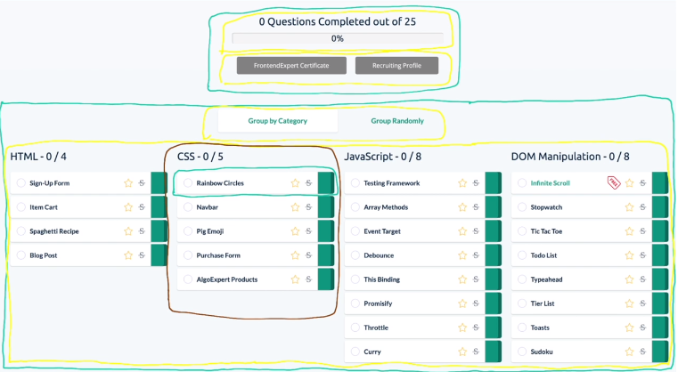

Components:

1. Progress indicator
- sub-component: title/text 
- sub-component: progress bar
- sub-component: 2 buttons below progress bar

2. Interview questions
- sub-component: tab car component (category vs. randomly)
- sub-component: container for all interview questions (4 of the same components with different props/params)
    - sub-component: list of interview questions


#### JSX

React components use JSX (JavaScript XML), ie. an extension for JS XML
- Not specific to React (Vue uses it)
    - Compiles into React, though

- Essentially: Using what looks like HTML in our JavaScript

```js
const hello = <p>Hello World</p>;
```

Note: See how there is a semicolon at the end, because this is still JavaScript.

How does this code above compile into JavaScript/what does it turn into?
- It goes from JavaScript code into React.createElement!

The following creates a React Element, which can be later append to a DOM:

```js
const element = (
    <p id="hello">
    Hello <em>World</em>
    </p>
);
```

=>

```js
var element = React.createElement(
    'p',
    { id: "hello" }, // optional props, key value pairs
    'Hello ', // extra parameters (children)
    React.createElement('em', null, 'World') // another React.createElement !
);
```

Notes:
- We use a parentheses for a multi-line JavaScript expression
- React.createElement is similar to document.createElement
    - We almost NEVER use this function directly, given that JSX compiles into this
        - Good to know, nonetheless!

Parameters:

React.createElement(type, [props], ...children)
- type: the type of _ our JSX compiles into
- optional props: object

#### ReactDOM

Final step: Take the React element we just created, and put it on the DOM. How do we do this?

Package: ReactDOM
- Package for inserting React elements into the DOM

```js
ReactDOM.render(element, DOMContainer);
```

#### Functional Components

We said we want to use re-usable components.
- So far: We have put JSX into variables
- What we actually want: Functional Components!

Functional Components: Functions that returns a React element ie. JSX
- 

Example:

```js
function SayHello() {
    return <p>Hello World</p>;
}
```

->

```js
// using the SayHello function from above^
function App() {
    return (
        <div>
            <SayHello /> // component is used as an element
            <p>Welcome to React!</p>
        </div>
    );
}
```

Notes:
- Instead of camel case, we are using Pascal case
    - Uppercase first letter: Custom components
    - Lowercase first letter: Standard HTML element
        - not all custom components will be functions though... there are classes (technically)

#### Creating React Apps

Many ways to create a React app, but let's start with the most common: `create-react-app`.

```sh
cd react_crash_course

npx create-react-app test-app
```

Notes:
- npx: comes with node.js
- test-app: the name of the new app

Now, run the app on localhost:

```sh
cd test-app

npm start
```

In your browser (at http://localhost:3000/), you should now see the standard template that comes with a React app.

Let's look at all of the files and directories that were created for us when we used `create-react-app`.

- `node_modules`: all of the dependencies downloaded
    - if you have worked with any other projects with node before, this is the same thing
    - you almost never need to open this/do anything with this!

- `public`: Contains vanilla files that are needed to send up to the browser
    - favicon.ico: icon that browser shows
        - make sure to change this!
    - index.html: the main file of our website
        - for the mostpart: standard HTML
        - has some interesting/important lines of code (these are not super important):
            - apple-touch-icon: the file used if an iPhone user saves your website to the home page
            - manifest.json file: what the icons/names should be
            - title tag: name of website
                - Default: 'React App'
            - body: 
                - noscript is there for users who have disabled JS
            - div: 
                - this is where we append values to in the DOM
    - logo192.png: used for template (we can delete this)
    - logo512.png: used for template (we can delete this)
    - robots.txt: tells robots how to treat your website
        - Example: google search engine

- `package-lock.json`: Standard file for node application

- `package.json`: Standard file for node application

- `README.md`: Has helpers for those starting out

- `src`: Source. The main directory we work from!
    - advice: organize this directory, or it will balloon on you
        - advice: 1 components per JS file, then organizational structure to find the files

    files in src:
    - logo.svg: a logo we probably won't use (can delete)
    - reportWebVitals.js: implementation of a function we probably won't use (can delete)
    - setupTest.js: If you do choose to write tests in App.test.js, this will run before
    - .gitignore: React automatically makes a git repo, so this will untrack certain files

    - App.css: The styling guide for the app
    - App.js: Will come back to this later
    - App.test.js: Can be useful (it shows how to write tests)
    - index.css: Styling guide
    - Index.js: Entry point of our application!

Note: What does index.js actually do:

```js
// imports
import React from 'react';
import ReactDOM from 'react-dom/client';
import './index.css';
import App from './App';
import reportWebVitals from './reportWebVitals';

// React.DOM.render is what puts React on the page
// - here, we are appending to the root from index.html
//      - we are appending App (will talk more about React.StrictMode later)
const root = ReactDOM.createRoot(document.getElementById('root'));
root.render(
  <React.StrictMode>
    <App /> // can put other imports or HTML here
  </React.StrictMode>
);

reportWebVitals(console.log); //  we do not need this, usually can delete it! (it gives performance metrics ... )
```

Note: create-react-app uses webpack, which essentially ignores the public directory

Let's take a look at the App.js file that Index.js is using:

```js
// app.js
import logo from './logo.svg'; // notice: photo is imported, then used as {logo} below!
import './App.css';

function App() {
  return (
    <div className="App">
      <header className="App-header">
        
        <p>
          Edit <code>src/App.js</code> and save to reload.
        </p>
        <a
          className="App-link"
          href="https://reactjs.org"
          target="_blank"
          rel="noopener noreferrer"
        >
          Learn React
        </a>
      </header>
    </div>
  );
}
// notice how App has to be exported (so that index.js can import it later)
export default App;
```

Notes:
- Usage of className instead of class

Let's change it to look like this:

```js
// app.js
// import logo from './logo.svg';
import './App.css';

function App() {
  return (
    <div>
      <SayHello />
      <SayHello />
    </div>
  );
}

function SayHello() {
  return <p>Hello World</p>;
}

export default App;

```

Notes:
- We will go much further on components in this crash course
- I commented out the top line of code that imports logo.svg since I am no longer importing it into App.js

#### Takeaways

Pros of create-react-app:
- saves TONS of time

Cons of create-react-app:
- many un-needed files that we have to delete

#### Git

```sh
cd algoexpert.io

git status
git add .
git commit -m "Completed Lesson 2 of FrontendExpert's React Course"
git push -u origin main
git status
git log --oneline
q
```

## 3: JSX

JSX = Short for JavaScript XML
- What happens when you try and combine JavaScript and HTML into one.
- Extremely important when working with React!

### Key Terms

#### React.Fragment

A React container component that renders its children without adding any additional DOM nodes.
- Can be used for returning multiple adjacent elements without wrapping them in an unnecessary element

Example:

```js
<React.Fragment>
    <h1>Hello World</h1>
    <p>React is Awesome!</p>
</React.Fragment>
```

Fragments can also be created by using an empty tag, rather than the `Fragment` export from React. For example:

```js
<>
    <h1>Hello World</h1>
    <p>React is Awesome!</p>
</>
```

Learn more: https://react.dev/reference/react/Fragment

#### Conditional Rendering

The process of changing the returned element of a component based on some condition.
- Can be achieved in a variety of ways
    - Most common: Utilizing ternary operators OR short circuit evaluation
        - This works because the following all render absolutely nothing:
            - null
            - undefined
            - true
            - false

For example:

```js
<React.Fragment>
    { myBool ? <h1>Hello World</h1> : null }
    { myOtherBool && <p>React is Awesome!</p> }
</React.Fragment>
```

Learn more: https://react.dev/learn/conditional-rendering

### Notes from the video

#### Setup

Head into `test-app/src` for this:

```js
// App.js
import './App.css';
import React from 'react';

export default function App() {
    return (
        <h1>Hello World</h1>
    );
}
```

```css
/* App.css */
.center {
    text-align: center;
}
```

#### JSX

Interesting import - You used to need this, but now you do not:

```js
import React from 'react';
```

Why don't we need it anymore?
- Any JSX used to compile into React elements
- Modern React: You do not need it
    - We will use it for something else, so keep it in!

Next, let's look at the `export default`:

```js
export default function App() {
    return (
        <h1>Hello World</h1>
    );
}
```

Because this function returns some JSX ie. `<h1>Hello World</h1>`, this function becomes a component.

#### Self-Closing Tags

Next, let's look at some things that are different between JSX and standard HTML.

When you use a self-closing tag, you must do the syntax with the forward slash at the end. Example:

```js
export default function App() {
    return (
        // error
        <h1>Hello <br> World</h1>
        // good
        <h1>Hello <br /> World</h1>
    );
}
```

#### Fragments

Let's talk about returning multiple JSX elements:

```js
// this gives an error
export default function App() {
    return (
        <h1>Hello World</h1>
        <p>Test<p>
    );
}
```

This would give an error, since we must always return a single JSX element.

What about this way, if we wrap the returns in a `div`?

```js
import './App.css';
import React from 'react';

export default function App() {
    return (
        <div>
            <h1>Hello World</h1>
            <p>Test</p>
        </div>
    );
}
```

This works! Try this out in your browser now:

```sh
cd test-app

npm start
```

You should see 'Hello World' at the header, and 'Test' beneath it.

What if we do not want to add a `div` to our code?
- This adds div to the DOM
    - Adding extra elements to the DOM will eventually slow down the page, make screen readers jobs hard, etc.

How do we wrap all of the elements?

React has built-in fragments just for this job!

Method #1:

```js
import './App.css';
import React from 'react';

export default function App() {
  return (
      <React.Fragment>
          <h1>Hello World</h1>
          <p>Test</p>
      </React.Fragment>
  );
}
```

Method #2:

```js
import './App.css';
// import React from 'react';

export default function App() {
  return (
      <>
          <h1>Hello World</h1>
          <p>Test</p>
      </>
  );
}
```

Notes:
- React.Fragment comes from import statement on Line 2
- After saving the App.js file, it will look the same, but this is better
    - We can use empty tags if we'd like
        - 1st difference: Can delete import on line 2
        - 2nd difference: No way to add a prop to the empty elements

My takeaway: For the mostpart, I will use the React.Fragment!

#### JavaScript Expressions

How do we use JavaScript Expressions inside of our JSX?

```js
// App.js
import './App.css';

export default function App() {
  const name = 'Myles';
  return (
      <>
          <h1>Hello {name.toUpperCase()}</h1>
          <p>Test</p>
      </>
  );
}
```

Notes:
- Curly braced syntax = JavaScript
- This is safe from injection attacks, as the JSX gets passed as a string regardless
    - even if a malicious actor tried to pass bad code...

#### Conditional Rendering

Start by writing some code that returns a different value depending on an error:

```js
// App.js
import './App.css';

export default function App() {
  const error = true;
  if (error) {
    return <h1>Error!</h1>;
  }
  return <h1>Success!</h1>;
}
```

This is one way - but we have more options!

Ternary operator:

```js
import './App.css';

export default function App() {
  const error = false;
  return error ? <h1>Error!</h1> : <h1>Success!</h1>;
}
```

Both of these methods are good, but have totally different return statements.
- You may not want this if it is a small part of the JSX

What to do now? Return a fragment with 2 different ternaries:

```js
import './App.css';

export default function App() {
  const error = true;
  return (
    <>
    {error ? <h1>Error!</h1> : null}
    {!error ? <h1>Success!</h1> : undefined}
    </>
  );
}

```

Notes:
- Using null is more popular than undefined/other values (for the else portion of if-else)
- Can use short circuit evaluation (&& and ||) if you'd like instead

One more way to do conditional rendering:

```js
import './App.css';

export default function App() {
  const error = false;
  return <h1>{error ? 'Error' : 'Success'}</h1>
}
```

Notes:
- When in the curly braces, make sure to use '' for strings since we are in JavaScript!

#### Attributes / Props

Let's remove the code from above and start looking at attributes, but better known as props!

This will create an input box that cannot go longer than 3 characters:

```js
import './App.css';

export default function App() {
  return (
    // using the Fragements again ...
    <>
      <label htmlFor="input">Input: </label>
      <input id="input" type="text" maxLength="3" />
    </>
  );
}

```

Notes:
- maxLength is camelCase, this is because JS/JSX decided to use camelCase
- for is a reserved word in JavaScript, so JSX uses htmlFor instead

We can also use JavaScript expressions for these values!

```js
import './App.css';

export default function App() {
  const props = {
    id: 'input',
    type: 'text',
    maxLength: '3',
    
  }
  return (
    <>
      <label htmlFor="input">Input: </label>
      <input {...props} placeholder="user" />
    </>
  );
}

```

Note: This combines props with the standard syntax, hence the `placeholder="user"`.

Next, change the code up so all we return is a paragraph:

```js
import './App.css';

export default function App() {
  return <p className="center">Hello World</p>
}

```

Notes:
- we have to use className instead of class=
- This code will center the 'Hello World'

Next, we can also use inline styles:

```js
import './App.css';

export default function App() {
  return <p style={{
    color: "red",
    textAlign: 'center',
    fontSize: '48px' // 48 works too
  }}>Hello World</p>
}

```

Notes:
- This makes the text large, red, and in the middle of the screen
- Good practice: Adding units at end of fontSize 
    - avoid using pixels

#### Git

```sh
cd algoexpert.io

git status
git add .
git commit -m "Completed Lesson 3 of FrontendExpert's React Course"
git push -u origin main
git status
git log --oneline
q
```

## 4: Props

Props in React = Things you pass from component to component (Simple, but useful!)

### Key Term

#### Props

A JavaScript object passed as a parameter to functional components.
- Contains all of the key-value pairs that were passed as attributes to the component.

For example, look at this JSX:

```js
<MyComponent message="hello" number={42} />
```

The `MyComponent` function would take in props with two key-value pairs:

```js
function MyComponent(props) {
    console.log(props.message); // "hello"
    console.log(props.number); // 42
    return <h1>Hello World!</h1>;
}
```

Learn more: https://react.dev/learn/passing-props-to-a-component

### Notes from the video

#### Setup

Current state of App.js:

```js
// import './App.css';

export default function App() {
  return (
    <>
      <h1>Hello Conner</h1>
      <h1>Hello Clement</h1>
    </>
  );
}
 
```

#### Props

Props = Attributes for our components
- Components: Custom HTML tags
- Props: Parameters to those functions

Motivation behind props?
- When there is redundancy, we want to make helper functions to avoid repeating code.

Example, turning the example from above into better code by using props:

```js
export default function App() {
  return (
    <>
      <Hello name="Conner" />
      <Hello name="Clement" />
      <Hello name="Myles" />

    </>
  );
}

function Hello(props) {
  return <h1>Hello {props.name}</h1>
}
```

Notes:
- We take in 'name' as a parameter to the function + we pass in the parameter via props

#### Destructuring Props

One thing people find annoying about props is that because we pass in 1 props variable, there is no way to look at the function and see what the prop expects.

Way to improve: Using Destructuring syntax!

```js
export default function App() {
  return (
    <>
      <Hello name="Conner" />
      <Hello name="Clement" />
      <Hello name="Myles" />
    </>
  );
}

function Hello({name}) {
  return <h1>Hello {name}</h1>
}
```

You can now look at this function and easily know what the function needs.

#### Default Props

We can use the destructuring to also have default values.

```js
// import './App.css';

export default function App() {
  return (
    <>
      <Hello name="Conner" />
      <Hello name="Clement" />
      <Hello name="Myles" />
      <Hello />
      
    </>
  );
}

function Hello({name = 'User'}) {
  return <h1>Hello {name}</h1>
}

// Hello.defaultProps = {
//   name: 'User'
// }
```

Notes:
- Method #1: Adding as params to the function
- Method #2: Using .defaultProps

They work the exact same way!
- Recommendation: Method #1
    - it is much more common than using .defaultProps

#### Children

Next, let's add another component, which is a comment that takes in some props:

```js
export default function App() {
  return (
    <Comment username="Conner" time={(new Date()).toString()}>
      <h1>Hello World</h1>
      <p>This is a comment!</p>
    </Comment>
  );
}

function Comment({username, time, children}) {
  return (
    <section>
      <p>{username} commented at {time}</p>
      {children}
    </section>
  )
}
```

Notes:
- `children` is the actual contents of the comment
    - It defaults to whatever is between opening/closing tags of `Comment`

More Notes:
- You do not need to use the Fragment braces because you are returning 1 Comment
- Concept of having components inside of components: component composition!
- Any of these custom components you make, only the actual DOM elements get added to the page 
    - Browser has no clue what a comment is, it only sees section/paragraph/children
    - Inspect > Elements, you will not see `Comment`, you just see the HTML elements
        - There may be a lot of nesting, but it eventually gets to HTML!


#### Git

```sh
cd algoexpert.io

git status
git add .
git commit -m "Completed Lesson 4 of FrontendExpert's React Course"
git push -u origin main
git status
git log --oneline
q
```

## 5: Event-Driven Programming

Old adage "better to be proactive than reactive" does NOT apply here!

### Key Term

#### SyntheticEvent

The object type passed to React event handler functions.
- Generally: Work the same as native events
    - Has more consistency across browsers, though

Learn more: https://react.dev/reference/react-dom/components/common#react-event-object

### Notes from the video

#### Setup

```js
// App.js
export default function App() {
  return (
    <button>Click Me</button>
  )
}

```

```sh
cd test-app

npm start
```

Next, head to Inspect > Console.

#### Event-Driven Programming

Specifically: Event-Driven Programming in React
- Remember: React code compiles down to JavaScript, so if you know how that works, you should understand most

What we will learn: Differences between Vanilla JS and React's Event-Driven Programming

Vanilla JS: addEventListener()
- not the React way to do things

React: Use JSX

General rule: With React, use JSX whenever possible!
- Avoid regular DOM manipulation
    - Use attributes/props

Try running this code and clicking the button to see an output in the console:

```js
export default function App() {
  return (
    <button onClick={() => {
      console.log('clicked');
    }}>Click Me</button>
  )
}

```

You can also create a named function instead:

```js
export default function App() {
  const handleClick = () => {
    console.log('clicked');
  };

  return (
    <button onClick={handleClick}>Click Me</button>
  )
}

```

Notes:
- Because we have handleClick inside the App component, that means we make a new handleClick every time the app renders
    - This is not good!

Moving it to the bottom is more typical:

```js
export default function App() {
  return (
    <button onClick={handleClick}>Click Me</button>
  )
}

function handleClick() {
  console.log('clicked');
};
```

Note: Standalone function keyword is preferred over the arrow function syntax (when outside of function)
- Avoids problems with 'hoisting'

#### Synthetic Events

Event Handlers in React: Works the same as standard JS!
- Take event as parameter
- Pass event to console

```js
export default function App() {
  return (
    <button onClick={handleClick}>Click Me</button>
  )
}

function handleClick(event) {
  console.log(event);
};
```

What is this? A synthetic based event.

Synthetic event: Object type passed to event handler functions
- Works same as standard event most of the time
    - Pros: Adds consistency across browsers

Note: Idk why you would need it, but if you wanted to use native event, you culd use event.nativeEvent


#### Adding Event Listeners

Next, what happens if we try to add a click event or any event to a custom component?

Remember: Browser controls event listeners
- Problem: Browser does NOT know about the custom components (since they end up just being standard DOM elements ie. HTML...)

Let's create another component to help explain:

What this custom component does:
- Adds style to the buttons (replaces native elements)

```js
// App.js
export default function App() {
  return (
    <MyButton onClick={handleClick}>Click Me</MyButton>
  );
}

function handleClick(event) {
  console.log(event);
};

function MyButton(props) {
  // make sure to add onClick={props.onClick}, or else the console won't log the event!
  // even better: use the spread syntax (...props) so that it inherits more than just onClick!
  return (
    <button
      {...props}
      style={{
        color: 'red'
      }}>
      {props.children}
    </button>
  );
}

```

Now, the custom button works like a regular button.

Notes:
- We don't need to have {props.children} if we already have {...props} at the top of the button.
- If we want, we can make the button a self closing tag.

#### Takeaways

Event Driven Programming is very similar in Vanilla JS as it is in React!

#### Git

```sh
cd algoexpert.io

git status
git add .
git commit -m "Completed Lesson 5 of FrontendExpert's React Course"
git push -u origin main
git status
git log --oneline
q
```

## 6: State

In React: State is how you store stuff (that's pretty much it - very useful!)

### Key Terms

#### State

Data specific to an instance of a component that persists between renders and causes re-renders when changed.
- "State, a component's memory"

Learn more: https://react.dev/learn/state-a-components-memory

#### Hook

A JavaScript function used to "hook" into React features such as state and the larger component lifecycle. The names of hooks always begin with *use*, and they cannot be called conditionally.

#### useState

A React hook for creating useful stateful components.
- The `useState` function takes in an initial state value (or a function that returns that initial value), and it returns an array with 2 elements:
    - current state value
    - setter function

For example:

```js
const [number, setNumber] = useState(42);
```

Learn more: https://react.dev/reference/react/useState

#### useReducer

An alternative React hook for creating stateful components
- Oftentimes: Used for more complex state

The `useReducer` function:
- takes in a reducer function and the initial state
- returns an array with 2 elements:
    - current state value
    - dispatch function

The reducer function takes in the previous state and an action object as parameters, then it returns the new state.
- Usually: the action object will have a `type` property, which will be used in a switch statement.

For example:

```js
function reducer(state, action) {
    swtich (action.type) {
        case 'increment':
            return {count: state.count + action.num};
        case 'decrement':
            return {count: state.count - action.num};
        default:
            throw new Error('Unknown action type');
    }
}
```

The dispatch function will then take in an object, which will be passed as the action to the reducer function.

For example:

```js
const [state, dispatch] = useReducer(reducer, {
    count: 0
});

return (
    <button onClick={() => dispatch({
        type: 'increment',
        num: 1
    })}>Increment</button>
);
```

Learn more: https://react.dev/reference/react/useReducer

#### Lifting State Up

A common React pattern of moving shared state up to the lowest common ancestor component in the tree.
- This allows for a single component to keep track of the state and pass the current value and setter function down through props.

Learn more: https://react.dev/learn/sharing-state-between-components#lifting-state-up-by-example

#### Controlled Component

A pattern of using React state to control the current state of an input, rather than allowing the native elements to control their own state (known as *uncontrolled component*).

For example: An input can be controlled via the `value` and `onChange` props:

```js
const [value, setValue] = useState('');
return <input value={value} onChange={e => setValue(e.target.value)} />;
```

Note: In React, the `onChange` works the same as `onInput`

Learn more: https://react.dev/learn/sharing-state-between-components#controlled-and-uncontrolled-components

### Notes from the video

#### Setup

Update App.js to have some code that does not work.
- This code will help us understand why we need state

```js
export default function App() {
  let count = 0;
  return (
    <>
      <button onClick={() => count++}>
          Increment
      </button>
      <p>Count: {count}</p>
    </>
  );
}

```

Start it up in Chrome:

```sh
cd test-app

npm start
```

The fact that this does not work right away, is going to show us WHY we need state! 

#### useState

Why doesn't anything happen when you click 'increment'?
- Good: The variable count IS incrementing by 1
- Bad: Nothing has told React to update the DOM
    - React is not fully reactive
    - We must tell it that something important happened that deserves a re-render

How to do this: State!
- Local to single instance of a component
- Is a value, like a variable
- Has a setter function
    - If setter function is called to change the state value, that instance of the component will render again (to update the component)

Let's see it in action!

```js
// not a default export, so use curly braces when importing!
import { useState } from "react";

export default function App() {
  const [count, setCount ] = useState(0);
  
  // let count = 0;
  return (
    <>
      <button onClick={() => setCount(count + 1)}>
          Increment
      </button>
      <p>Count: {count}</p>
    </>
  );
}

```

Notes:
- useState is a function
    - takes in default value (0)
    - need to de-structure the return value (an array)
        - count
            - you never want to change a state variable ie. count++
        - setter Function (setCount)
            - you will use this to change the count ie. setCount(count + 1)

- useState() is a hook, ie. it is special and hooks into react features
    - anything that starts with 'use' is a hook
    - we will look at hooks more later in the course
        - idea: return value from useState has ability to cause the component to re-render

Note: He used auto import, which I learned more about here (for which Extensions I should have in VSCode):
- [Link to StackOverflow](https://stackoverflow.com/questions/38210604/visual-studio-code-automatic-imports/53015835#53015835)

Next, learn 1 rule about hooks: Cannot be called conditionally!

Example:

```js
if (true) {
    const [count, setCount ] = useState(0);
}
```

Why this is an issue:
- React Hooks must be called in the same exact order in every component render
    - Internally, React depends on the ordering of the Hook Functions

#### useState Function Parameters

useState: Does not have to take in a value, can take in a function!

Example, which does the same as above:

```js
export default function App() {
  const [count, setCount ] = useState(() => {
    return 0;
  });
...
}
```

Purpose of this:
- If you have a complex computation (for how to determine initial state), it should be inside of a function
    - When JS renders, if an input for a function is a complicated function, then we need to wait for the complicated function EVERY time

This would be some mock code for that problem:

```js
const [count, setCount ] = useState(somethingComplicated());
```

Notes:
- If you have anything complicated, wrap it in a function
    - Value being passed to useState is now a function itself
        - JS doesn't need to execute the function before using useState

Now, it is pretty rare having to pass in a function to useState, so let's put the code back to having a default value of 0:

```js
export default function App() {
  const [count, setCount ] = useState(0);
...
}
```

#### Adding Multiple State Variables

Next, you must know that we can have multiple pieces of state, with 1 component
- All you have to do is multiple calls to useState()

For example:

```js
// not a default export, so use curly braces when importing!
import { useState } from "react";

export default function App() {
  const [count, setCount ] = useState(0);
  const [otherCount, setOtherCount ] = useState(50);
  
  return (
    <>
      <button onClick={() => setCount(count + 1)}>
          Increment
      </button>
      <p>Count: {count}</p>
      <button onClick={() => setOtherCount(otherCount + 10)}>
          Increment
      </button>
      <p>otherCount: {otherCount}</p>
    </>
  );
}

```

Notes:
- These are completely separate pieces of state
    - count: starts at 0, ++1
    - otherCount: starts at 50, ++10

Another fact about state is that it is specific to a single instance of a component.

Let's create another component to illustrate this idea:

```js
import { useState } from "react";

export default function App() {
  return (
    <>
      <Counter startingCount={0} />
      <Counter startingCount={100} />
    </>
  );
}

function Counter({startingCount = 0}) { // default value = 0
  const [count, setCount ] = useState(startingCount);

  return (
    <>
      <button onClick={() => setCount(count + 1)}>
          Increment
      </button>
      <p>Count: {count}</p>
    </>
  );
}

```

Notes:
- Both of the counters are on their own, separately both increment by 1
    - They are separate instances, w/ their own state
        - 1 starts at 0
        - 2 starts at 100

#### Setter Functions

1 thing about Setter Functions: They only update the state value once the component is able to re-render
- Until the call stack is empty, there is no re-render

This only increments by 1:

```js
<button onClick={() => {
    setCount(count + 1);
    setCount(count + 1);
    setCount(count + 1);
}}>
    Increment
</button>
```

Another key point: Whenever you have multiple state values, they will be batched together
- 

Let's look at an example with setCount AND setOtherCount:

```js
<button onClick={() => {
    setCount(count + 1);
    setCount(count + 1);
    setCount(count + 1);
    setOtherCount(otherCount + 1);
    
}}>
    Increment
</button>
```

All of the state values are updated, and then the re-render occurs.

If we want our setCount to use the value that was added before, we can pass in a function to setCount:

```js
<button onClick={() => {
    setCount(prevCount => prevCount + 1);
    setCount(prevCount => prevCount + 1);
    setCount(prevCount => prevCount + 1);
}}>
    Increment
</button>
```
Notes:
- While these setCount's are still run together, they are run in the order they are called (in a queue)
- When you call setCount with a function, it will take in the previous value from setCount
- Functions we are passing in are not relying on 'count' from the useState declaration

Let's put the function back to increment by 1 before moving on.

#### Object State

If we have a value of useState as an Object (or an Array, since it is an object), there are some special properties we need to be aware of!

Main thing: useState will not cause the component to re-render, unless you set the value of useState to another value
- You cannot change the values inside of the object itself
- You must set useState to a brand new object

For example, let's update this number:

```js
setCount({num: count.num + 1})
```

If we want to add a new property, we must create a new object, and spread the old object
- This is to 

```js
setCount({...count, otherCount: 0})
```

This creates a new object that has everything from count, in addition to new key-value pair of key=otherCount,value=0.

Since arrays are objects, the same holds true with Arrays:

```js
const [count, setCount ] = useState([1,2,3]);

setCount([...count, 4])
```

Let's reset back to startingCount = 0 before proceeding.

#### Lifting State Up

What if we wanted both counters to use the same state?
- Data/React moves in 1 direction, from parents down to children
    - The shared State needs to be high enough in the component tree that it can be sent down to the children we want it to.

How to do this?
- Move count, setCount into App()
    - Make sure to pass in count, setCount as params to function Counter() ie. Counter(){count, setCount}
- Updated App() so that when you call Counter in JSX, you are providing the required params

Let's see it in the code:

```js
import { useState } from "react";

export default function App() {
  const [count, setCount ] = useState(0);

  return (
    <>
      <Counter count={count} setCount={setCount} />
      <Counter count={count} setCount={setCount} />
    </>
  );
}

function Counter({count, setCount}) {
  return (
    <>
      <button onClick={() => setCount(count + 1)}>
          Increment
      </button>
      <p>Count: {count}</p>
    </>
  );
}

```

Now, if you click Increment, regardless of which one, both of the counts go up!

#### Controlled Components

What we want to show now: Controlled Components
- In a way, the counter is a controlled component
    - Uses setter as a prop
    - Uses whatever parent says as a method for what it does (when you click the button)

- Far more common usage of controlled components: Inputs!

Let's say we have another state, `value`, and let's add an input tag for this.
- We want our setter function called onChange

```js
import { useState } from "react";

export default function App() {
  const [count, setCount ] = useState(0);
  const [value, setValue ] = useState('');
  
  return (
    <>
      <input
        type="text"
        value={value}
        onChange={(event) => setValue(event.target.value)} />
      <Counter count={count} setCount={setCount} />
      <Counter count={count} setCount={setCount} />
    </>
  );
}

function Counter({count, setCount}) {
  return (
    <>
      <button onClick={() => setCount(count + 1)}>
          Increment
      </button>
      <p>Count: {count}</p>
    </>
  );
}

```

Now, the input element is controlled by the state.
- Whenever you type into the input box, it re-renders, the value changes, and we get the input of the new value.

Let's remove this input tag and the 2nd useState line before moving forward.

#### useReducer

Finally, an alternative to useState.
- Usually: useState
- Sometimes when it is more complex: useReducer

useReducer:
- Does not just take in state
    - Takes in a function (reducer)
    - Takes in state (as an object)
- Return value:
    - Does not return value/setter functions
    - Does return the current state object ie. state AND a dispatch function

Reducer function:
- input params:
    - previous state
    - action (an object)
- returns: new state
    - usually: the action object has `action.type`, which is used in a switch statement

Here is an implementation of useReducer and a reducer function:

```js
import { useReducer, useState } from "react";

function reducer(state, action) {
  switch (action.type) {
    case 'increment':
      //return {count: state.count + 1} 
      return {count: state.count + action.num}; // return an object with the new state
    case 'decrement':
      return {count: state.count - action.num};
    default:
      throw new Error('Unknown action type');
          
      
  }
}

export default function App() {
  const [state, dispatch ] = useReducer(reducer, {
    count: 0
  });
  
  return (
    <>
      <Counter
        count={state.count}
        onClick={() => dispatch({ // dispatch: calls the reducer (has to take in the reducer's action!)
          type: 'increment',
          num: 1 // increment by 1
        })} /> 

      <Counter
        count={state.count}
        onClick={() => dispatch({
          type: 'decrement',
          num: 100
        })} /> 
      
    </>
  );
}

function Counter({count, onClick}) { // change this to onClick
  return (
    <>
      <button onClick={onClick}> {/* change this to onClick */}
          Increment
      </button>
      <p>Count: {count}</p>
    </>
  );
}

```

Takeaways
- useReducer: Overkill
- useState: Pretty much always will do the trick!

#### Git

```sh
cd algoexpert.io

git status
git add .
git commit -m "Completed Lesson 6 of FrontendExpert's React Course"
git push -u origin main
git status
git log --oneline
q
```

## 7: Component Lifecycle

Let's take a peek into the fascinating life of a React component!

### Key Terms

#### Component Lifecycle

The different stages that an instance of a component goes through. There are 3 primary stages to the React lifecycle:

1. Mounting: The component renders for the 1st time

2. Updating: The component re-renders whenever state changes OR the props are updated by the parent component.
- A component may updated many times without ever mounting again

3. Unmounting: The componenet is removed from the DOM. (Final stage of the lifecyce)
- Component cannot update again once it has been unmounted
    - A new instance of the component can still be mounted, though

#### useEffect

A React hook for performing side effects around the component lifecycle. The `useEffect` hook takes in a callback function and an optional dependency array.

Dependency array:
- no dependency array is provided: callback function runs on EVERY render.
- dependency array provided: callback function runs on *mount* OR when an item in that array has changed
    - note: Objects must be new objects to be considered to have changed
    - to avoid bugs related to effects using stale values from previous renders, the dependency array should contain all values that the callback uses, that could change between renders.

The callback function can also return a cleanup function, which will run on *unmount* and before the main effect function runs on any re-renders.

Example:

```js
useEffect(() => {
    console.log('count changed');

    return () => console.log('cleanup count changed effect');
}, [count]);
```

Learn more: https://react.dev/reference/react/useEffect

#### useLayoutEffect

A React hook for performing side effects around the component lifecycle in the same way as `useEffect`. 

The only difference between the two functions is that `useLayoutEffect` works synchronously
- What this means: The effects always finish running before the browser paints
- This hook should only be used for effects that will make visual changes to the DOM
    - Otherwise: The synchronous nature will give worse performance than `useEffect`, without any benefits!

Learn more: https://react.dev/reference/react/useLayoutEffect

### Notes from the video

#### Setup

Create Counter.js and write some code:

```sh
cd test-app
cd src
echo > Counter.js
```

```js
// Counter.js
import { useState } from 'react';

export default function Counter() {
    const [count, setCount] = useState(0);
    const [bool, setBool] = useState(false);

    return (
        <div className='counter'>
            <button onClick={() => setBool(!bool)}>Re-Render</button>
            <button onClick={() => setCount(count + 1)}>Increment</button>
            <p>Count: {count}</p>
        </div>
    );
}
```

Update App.js:

```js
// App.js

```

View in Google Chrome:

```sh
cd test-app

npm start
```

What is going on in this App:
- State for isShown that defaults to true
- Button that toggles isShown from true/false
    - true: button says 'Hide Counter'
    - false: button says 'Show Counter'
        - Counter is either hidden or shown based on the isShown state

- Counter component from Counter.js
    - button 1: re-render (toggles the boolean state)
    - button 2: increment: works like a normal counter

Notes:
- The count resets when you hit 'show counter', because it is making a new counter.
- Re-Render currently does nothing
    - Changed values are not being displayed

#### Component Lifecycle

Idea of Component Lifecycle: The different stages a component can be in!

1. Mount / initial render: Component is added to screen for the first time
- Clicking 'Show Counter'

2. Updates / re-render: Whenever the state or props value is changing, it needs to update (Change values + update DOM)
- Clicking 'Increment'
- Clicking 'Re-Render'

3. Unmount / leave the screen: Component is being deleted 
- Clicking 'Hide Counter'


#### useEffect

Sometimes, we have to hook into a component lifecycle to do something. That is when useEffect comes in.

useEffect: 

```js
import { useState, useEffect } from 'react';
...
    const [count, setCount] = useState(0);
    const [bool, setBool] = useState(false);

    useEffect(() => {
        console.log('render');
    });
```

Notes on useEffect:
- useEffect runs after every render
    - YES: mount
    - YES: re-render
    - NO: unmounted

- Input: Usually use arrow functions
    - Can use regular/any function too
    - Just cannot use async functions

#### Dependency Array

Now, we only want to call this for certain renders. Let's add another useEffect() to help explain this:

```js
// Counter.js
import { useState, useEffect } from 'react';

export default function Counter() {
    const [count, setCount] = useState(0);
    const [bool, setBool] = useState(false);

    useEffect(() => {
        console.log('render');
    });

    useEffect(() => {
        console.log('pressed re-render');
    }, [bool]);

    useEffect(() => {
        console.log('mounted');
    }, []);

    return (
        <div className='counter'>
            <button onClick={() => setBool(!bool)}>Re-Render</button>
            <button onClick={() => setCount(count + 1)}>Increment</button>
            <p>Count: {count}</p>
        </div>
    );
}

```

Notes:
- You can (and usually will) have 2+ useEffect
    - They run in order

- 2nd argument of useEffect: Dependency array
    - Anything in this array determines when the effect will run
        - default: runs everytime
        - with dependency array: only run if an element changes!
            - empty array: only runs on mount

#### Cleanup Functions

Next, these effects can also return a 'cleanup' function.

Cleanup Functions: 
- Used to cleanup code from previous effect

In action:

```js
import { useState, useEffect } from 'react';

export default function Counter() {
    const [count, setCount] = useState(0);
    const [bool, setBool] = useState(false);

    useEffect(() => {
        console.log('count changed');

        return () => console.log('cleanup count changed');
    }, [count]);

    useEffect(() => {
        console.log('render');
    });

    return (
        <div className='counter'>
            <button onClick={() => setBool(!bool)}>Re-Render</button>
            <button onClick={() => setCount(count + 1)}>Increment</button>
            <p>Count: {count}</p>
        </div>
    );
}
```

Notes:
- Pressing 'Hide Counter' does the following:
    - print 'cleanup count change' (count changes)

- Pressing 'Increment' does the following:
    - print 'cleanup count change' (count changes)
    - print 'count changed' (count changes)
    - print 'render' (that useEffect has no dependency array, so it runs everytime!)


#### Avoiding Infinite Loops

One last thing with useEffect: Infinite Loops (Common error)

Let's look at this chunk of code:

```js
useEffect(() => {
    setCount(count + 1);
}, [count]);
```

What happens/Why this is bad:
- Count is in the dependency array
    - So: When count changes, useEffect needs to run
        - Then: This cause useEffect to run again, and again, and again

#### useLayoutEffect

Next, let's look at an example:

```js
import { useState, useEffect } from 'react';

export default function Counter() {
    const [count, setCount] = useState(0);
    const [bool, setBool] = useState(false);

    useEffect(() => {
        if (count === 3) {
            setCount(4);
        }
    }, [count]);

    useEffect(() => {
        console.log('render');
    });

    const startTime = new Date();
    while (new Date() - startTime < 100) {} // This does some stalling to help see what's going on on the screen

    return (
        <div className='counter'>
            <button onClick={() => setBool(!bool)}>Re-Render</button>
            <button onClick={() => setCount(count + 1)}>Increment</button>
            <p>Count: {count}</p>
        </div>
    );
}
```

useEffect: Runs asynchronously, after the render, and after being painted to the screen
- This causes the 3 to appear on the screen for a moment, and then become 4 after
    - This is not ideal, as we don't want 3 to show on the screen at all!
        - Most of the time, this does not matter, but there is a remedy...

useLayoutEffect: Runs synchronously AFTER the render, but BEFORE the painting to the screen
- This will allow the 3 to not appear on screen at all

Change this code to see it in action:

```js
import { useState, useEffect, useLayoutEffect } from 'react';
    ...
    useLayoutEffect(() => {
        if (count === 3) {
            setCount(4);
        }
    }, [count]);
```

What happens now:
- We get 1, 2, 4
    - When count is set to 3, we don't get it painted to the screen

Word of advice: Avoid using useLayoutEffect!
- Its synchronous nature can cause things to run slowly

#### Git

```sh
cd algoexpert.io

git status
git add .
git commit -m "Completed Lesson 7 of FrontendExpert's React Course"
git push -u origin main
git status
git log --oneline
q
```

## 8: Refs

In React, refs are special things to store special stuff.
- Easy
- Very useful!

### Key Terms

#### Ref

A React value specific to an instance of a component that persists between renders, but updating the value does not cause a re-render (unlike state)
- Oftentimes: Used to reference the DOM node associated with the component
    - Can be achieved with the attribute `ref`

Learn more: https://react.dev/learn/referencing-values-with-refs

#### useRef

A React hook for creating a ref.
- Input: Initial value
- Return: a ref

The ref is simply an object with a `current` property set to the current value:

```js
const div = useRef(null);
return <div ref={div}>This div has a ref</div>;
```

Learn more: https://react.dev/reference/react/useRef

#### React.forwardRef

A function used by a custom component to forward a ref attribute on to a child element.
- higher-order component: Which means, it takes in a component and returns a new one
    - input: component
    - return: component

- In this case: Takes a component that has a 2nd parameter for the ref

Example:

```js
function Parent() {
    const ref = useRef(null);
    return <Child ref={ref}>This child has a ref</Child>;
}

const child = forwardRef(function (props, ref) {
    return <div ref={ref}>{props.children}</div>;
});
```

Learn more: https://react.dev/reference/react/forwardRef

### Notes from the video

#### Setup

Update App.js to look like this:

```js
// App.js
import { useState } from "react";

export default function App() {
  const [seconds, setSeconds] = useState(0);

  const startTimer = () => {
    setInterval(() => {
      setSeconds(currSeconds => currSeconds + 1);
    }, 1000);
  };

  const stopTimer = () => {
    //
  };

  return (
    <>
      <button onClick={startTimer}>Start</button>
      <button onClick={stopTimer}>Stop</button>
      <p>seconds: {seconds}</p>
    </>
  );
}

```

What this is:
- State initialized to 0
    - seconds
    - setter: setSeconds

- startTimer function: starts an interval, updates the seconds variable
    - we use `setSeconds(currSeconds => currSeconds + 1);` to avoid any stale values

- stopTimer function: has not been implemented yet...

- return value: 2 buttons
    - start button
    - stop button
        - also, a paragraph to tell how many seconds have passed

Run in Chrome:

```sh
cd test-app

npm start
```

Open up the Console so we can view logging via Chrome > Inspect > Console.

#### useRef

Let's start writing the functionality for stopTimer:

```js
export default function App() {
  const [seconds, setSeconds] = useState(0);
  const [timerID, setTimerID] = useState(null);

  const startTimer = () => {
    setTimerID(setInterval(() => {
      setSeconds(currSeconds => currSeconds + 1);
    }, 1000));
  };

  const stopTimer = () => {
    clearInterval(timerID);
  };
```

What we did here:
- use clearInterval to Stop the interval
- Set timer ID (using state)
    - If we want a value to persist across renders, we must use state!
    - When we tried doing this with let timerID = 0, when we click startTimer, we lose access to timerID because it becomes null

Note: This is still sub-optimal, every time we start the interval, we call setTimerID (we don't need to re-render, so it is unnecessary)
- Only 1 render so not a big issue, but in other cases this could cause an infinite loop

How do we solve this so that updating timerID does not cause a re-render?

Answer: Make the state variable an object (instead of null!)
- Using an object with `current: null` will allow the App to function how we expect
- Why does this work:
    - We are no longer calling setTimerID (which causes a re-render...)
    - We are simply accessing/changing a value in the object
        - obj.current

```js
import { useState } from "react";

export default function App() {
  const [seconds, setSeconds] = useState(0);
  const [timerID, setTimerID] = useState({
    current: null,
  });

  const startTimer = () => {
    timerID.current = setInterval(() => {
      setSeconds(currSeconds => currSeconds + 1);
    }, 1000);
  };

  const stopTimer = () => {
    clearInterval(timerID.current);
  };

  return (
    <>
      <button onClick={startTimer}>Start</button>
      <button onClick={stopTimer}>Stop</button>
      <p>seconds: {seconds}</p>
    </>
  );
}

```
    
Notes
- Not the cleanest code, we are kind of hacking
    - not using setTimerID function (we get a warning "'setTimerID' is assigned a value but never used")
    - not using the state variable

Lucky for us: React has something built in to fix this! The ref.

```js
// App.js (line 5)

// old
const [timerID, setTimerID] = useState({
    current: null,
  });

// new
import { useState, useRef } from "react"; // import 
...
const timerID = useRef(null); // line 5
```

Notes:
- This works that same as useState with an object.current
    - It does not return a value with array and setter function, but just the timerID value!

- While refs have specific functionality, they are basically just syntactic sugar around passing a value to state, when you don't need the setter function
    - Value persists across renders
    - Changing the value never causes a re-render!

#### ref Attribute

Common use case of Ref: 

Start by putting the code in this state:

```js
import { useState, useRef } from "react";

export default function App() {
  const inputRef = useRef(null);
  console.log("Before render: " + inputRef); // null

  const focusInput = () => {
    inputRef.current.focus();
  };
  
  return (
    <>
      <input ref={inputRef}/>
      <button onClick={focusInput}>Focus</button>
    </>
  );
}

```

What we did:
- Return value: Input, button
- Goal: Input box w/ a button that has you 'focus' on the input text

Notes:
- We need the actual input from the DOM for `focusInput` in order to make it focus, so we used the React way of using JSX and useRef()
    - Created inputRef
    - In the JSX/return area, set the input's ref to be inputRef
    - Edited focusInput() so that it makes inputRef.current to .focus()

One key point: At the top of the function (before the DOM node is created), the inputRef is still null
- Point: cannot use inputRef until the first render completes!

#### forwardRef

Key point: Ref attributes can only be added to DOM nodes
- Cannot be added to custom components

This will give an error of "Warning: Function components cannot be given refs. Attempts to access this ref will fail. Did you mean to use React.forwardRef()?" AND "Uncaught TypeError: Cannot read properties of null (reading 'focus')":

```js
...
  return (
    <>
      <MyInput ref={inputRef}/>
      <button onClick={focusInput}>Focus</button>
    </>
  );
}

function MyInput(props) {
  return <input {...props} style={{color: 'red'}} />
}
```

But, there is a work-around/way to do this...

How to hack and add to custom components - forwardRef!

```js
const MyInput = forwardRef(function (props, ref) {
  return <input ref={ref} {...props} style={{color: 'red'}} />
});
```

You should now see your input with the custom color of red.

What we did here:
- Wrap entire functional component in a forwardRef
    - Remove name 'MyInput' from function
    - Save the forward ref as const 'MyInput'
    - Add `ref` as 2nd parameter
    - Use the ref (Tell the return value which DOM element is going to use the Ref)
        - ie. `<input ref={ref} ... >`

Note:

Idea: We are using an input that is not controlled by any state (using refs instead via `inputRef.current.value`) is known as an uncontrolled component
- Most of the time: Don't want to do this
    - Using a controlled component with state is best, typically

- For times we do want an uncontrolled component OR we want a Ref on a controlled component:
    - Use state for the value
    - Have values of un-controlled by using Ref

#### Callback Refs

To this point: We have created refs with `useRef`.

But, what if we want to use the ref callback to store a reference to a DOM node in an instance property:

```js
export default function App() {
  return (
    <>
      <MyInput ref={handleRef}/>
      {/* <button onClick={focusInput}>Focus</button> */}
    </>
  );
}

function handleRef(domNode) {
  console.log(domNode);
}
```

What we did here:
- handleRef(): Runs on mount and un-mount (not on all re-renders)
    - takes in: DOM node
    - gives back: 
        - when it runs on mount: domNode
        - when it runs on re-render: nothing at all
        - when it runs on unmount: null

Note: We don't use this very much!
- useRef hook does the job for most, such as:
    - focusing hooks
    - keeping track of a persistent value that we want to change, without re-rendering

#### Git

```sh
cd algoexpert.io

git status
git add .
git commit -m "Completed Lesson 8 of FrontendExpert's React Course"
git push -u origin main
git status
git log --oneline
q
```

## 9: Imperative React

This is where React starts to get a bit complicated. You've been warned...

### Key Term

#### useImperativeHandle

A React hook for customizing the value provided to a parent component when using a ref.

useImperativeHandle hook:
- Takes in a ref as 1st parameter
- Takes in a callback function
- Optional: Dependency array

The return value of the callback function will act as the `current` value of the ref.
- If any item in the dependency array changes between renders, the callback function will be invoked again to recalculate the `current` value

Since `useImperativeHandle` requires a ref on custom component, it should always be used with `React.forwardRef`.

For example:

```js
forwardRef(function (props, ref)) {
    const [count, setCount] = useState(0);

    useImperativeHandle(ref, () => {
        return {
            resetCount: () => setCount(0)
        };
    });

    return (
        <button onClick={() => setCount(count + 1)}>
            Increment
        </button>
    );
}
```

### Notes from the video

#### Setup

Current state of App.js:

```js
// App.js
import Counter from './Counter';
import CustomInput from './CustomInput';
import './App.css';

export default function App() {
  return (
    <>
      <Counter />
      <CustomInput placeholder="Type something..." />
      <button>
        Reset
      </button>
    </>
  );
}

```

Counter.js:

```js
// Counter.js
import { useState } from 'react';

export default function Counter() {
    const [count, setCount] = useState(0);

    return (
        <>
            <button onClick={() => setCount(count + 1)}>
                Increment
            </button>
            <p>Count: {count}</p>
        </>
    );
};

```

Finally, CustomInput.js:

```js
// CustomInput.js
import { useState } from 'react';

export default function CustomInput(props) {
    const [value, setValue] = useState('');

    return (
        <input
            {...props}
            value={value}
            onChange={event => setValue(event.target.value)}
            style={{color: 'red'}} />
    );
};

```

Goal here: Add clickEventHanldler to the reset button, that will reset 2 things:
- count
- text in custom input

Run in Google Chrome:

```sh
npm start
```

Right click > Inspect > Console.

#### Coding

What we know: React is a declarative library
- Sometimes: We want to use our components in an imperative way

Note: declarative vs. imperative
- declarative: specifying the result you want
- imperative: writing explicit sequence of commands


So, back to the example, let's think, how do we get the 'Reset' button to reset both of the components??
- Method 1: We can lift the state up
    - This would work, but separates the state from components they are related to
        - Does not make sense to have them higher up
            - In more complicated examples, this can cause app component to balloon out of control

- Method 2: Add a clickEventHandler to the buttons (We want an imperative way to control these components)
    - What we want this function to do:
        - RESET counter
        - RESET custom input
            - We cannot just do it like this currently, so we must do it another way

- Method 3: Use a Ref to reference the counter and custom input
    - 

```js
// import Ref
import { useRef } from 'react';

// add to App
const counterRef = useRef();
const customInputRef = useRef();

// add to JSX
...
<Counter ref={counterRef} />
<CustomInput ref={customInputRef} placeholder="Type something..." />

```

After this, we are sure to be able to come into this button and use onClick to reset both. No? Why is that?
- When we use a Ref, the current value is set equal to a DOM node
    - DOM nodes know nothing about React state
        - React state is handled by React...

What do we need to do, then?
- Go into Counter AND CustomInput components
    - control what values they pass to their parent as a ref

Steps to doing this:
1. Add a forwardRef
- Since it is a custom component, we need to use forwardRef
- Make sure to import forwardRef from 'react'
- Make sure the component takes in `props` and `ref`
- use another hook known as `useImperativeHandle()` from 'react'
    - inputs:
        - ref: 
        - function: 
    - outputs: object
        - object (returned from function, it is the current value of the ref)
            - key: .reset
            - value: function that will setCount(0)
    
Notes:
- Not going to pass ref to the button (or another element) - We don't want the ref to be equal to a DOM node, so
- If we only wanted to calculate return value on mount, we can add an empty dependency array, or could add something like [count]
    - Most of the time you don't add a dependency array

2. 

Let's head into these files and make the changes:

```js
// Counter.js
import { useState, forwardRef, useImperativeHandle } from 'react';

export default forwardRef(function Counter(props, ref) {
    const [count, setCount] = useState(0);

    useImperativeHandle(ref, () => {
        return {
            reset: () => setCount(0)
        };
    });

    return (
        <>
            <button onClick={() => setCount(count + 1)}>
                Increment
            </button>
            <p>Count: {count}</p>
        </>
    );
});
```

```js
// CustomInput.js
import { useState, forwardRef, useImperativeHandle } from 'react';

export default forwardRef(function CustomInput(props, ref) {
    const [value, setValue] = useState('');

    useImperativeHandle(ref, () => {
        return {
            reset: () => setValue('')
        };
    });

    return (
        <input
            {...props}
            value={value}
            onChange={event => setValue(event.target.value)}
            style={{color: 'red'}} />
    );
});

```

Finally, head back over to App.js and make the button's onClick call 2 things:
- counterRef.current.reset();
- customInputRef.current.reset();

```js
// App.js
<button onClick={() => {
    counterRef.current.reset(); // new
    customInputRef.current.reset(); // new 
}}>
    Reset
</button>

```

You can now head over to the browser, type into the customInput, increment the count, and when you press reset, everything goes back to the initial state!!

Takeaways:
- useImperativeHandle(): A hook that lets us use the componenet we have refs to, in an imperative way
    - We are calling some function from the components
    - Can also access any data that we pass up to the ref

- Use this with caution! ("escape hatch")
    - It is good to know about and can be helpful, but...
    - If you use it too much, that is not good because you take away from React's declarative nature!
        - Your code will get hard to read

#### Git

```sh
cd algoexpert.io

git status
git add .
git commit -m "Completed Lesson 9 of FrontendExpert's React Course"
git push -u origin main
git status
git log --oneline
q
```

## 10: Contexts

Just as context is important in real life, so too is it important in a React codebase!

### Key Terms

#### Context

A way to pass values down a component tree without needing to pass props through all of the components (this is known as prop drilling)
- Contexts are generally useful for global state, needed throughout an application/page
    - It would be very inconvenient to have to pass props to every element on the page...

Learn more: https://react.dev/learn/passing-data-deeply-with-context

#### React.createContext

A react function for creating a context object.
- Takes in: Default value, which is used if there is not a matching context provider in a tree

For example, this would create a context that could be used to keep track of a user's selected theme:

```js
const ThemeContext = createContext({
    mode: 'dark'
});
```

This context would then have a .provider component, which must be above any components in the tree that wish to use the context. The `value` prop will be passed as the value to all children using the context. For example:

```js
return (
    <ThemeContext.Provider value={{mode: 'dark'}}>
        {props.children}
    </ThemeContext.Provider>
);
```

Learn more: https://react.dev/reference/react/createContext

#### useContext

A React hook for using a context.
- Takes in: A context object (created with `createContext()`)
- Returns: The value from the first context provider of that context above it in the tree

For example:

```js
const theme = useContext(ThemeContext);
console.log(theme.mode); // 'dark'
```

Learn more: https://react.dev/reference/react/useContext

### Notes from the video

#### Setup

We have 5 JavaScript files this time around, so buckle up...

```sh
cd test-app
cd src

echo > App.js
echo > Profile.js
echo > WelcomeBanner.js
echo > Course.js
echo > UserContext.js 
```

```js
// App.js
import { useState } from 'react';
import Profile from './Profile';

const conner = {
  name: 'Conner',
  course: 'FrontendExpert', 
};

const clement = {
  name: 'Clement',
  course: 'AlgoExpert', 
};

export default function App() {
  const [user, setUser] = useState(conner); // default state: user = conner

  const toggleUser = () => {
    if (user === conner) {
      setUser(clement);
    } else {
      setUser(conner);
    }
  }

  return (
    <main>
      <Profile user={user} />
      <button onClick={toggleUser}>Toggle User</button>
    </main>
  );
}

```

```js
// Profile.js
import WelcomeBanner from './WelcomeBanner';
import Course from './Course';

export default function Profile({user}) {
    return (
        <>
            <WelcomeBanner user={user} />
            <Course user={user} />
            
        </>
    );
}

```

```js
// WelcomeBanner.js
export default function WelcomeBanner({user}) {
    return <h1>Hello {user.name}</h1>
}
```

```js
// Course.js
export default function Course({user}) {
    return <p>Your course is {user.course}</p>
}
```

```js
// UserContext.js

// empty for now, since the example works without it right now!

```

Run the App in Chrome:

```sh
npm start
```

What you should see:
- Hello 'name'
- Your course is 'course'

#### Prop Drilling

Context = Another form of state in React

Looking at App.js, we can see why it could be useful:
- State for a user
    - toggleUser: will be used to toggle between Conner/Clement

- Return value: Main tag
    - profile: takes in user as a prop
    - button: toggles the user

What this current state is known as:
- Lifting state up
    - State was lifted to App.js component (that is the lowest level component that has all of the components needing state, as its children)
- Prop drilling
    - Sending that state (or some prop) deeply down a React tree

This is fine, but in a more complex situation with more components, passing around props like that is not great!

This is where Context comes in.

#### Context

Context: Allows you to create some state that is accessible by all children (of a component)

Let's edit UserContext.js and create our first context:

```js
// UserContext.js
import { createContext } from "react"

export const UserContext = createContext({
    name: null, // default values
    course: null,
}); 

```

We have created a userContext with default values of null.

Head back over to App.js and implement the UserContext:
- Remember: Context works by sending some state down to all of the children

What to do:
- Import the context we just created
- Edit the return value to use UserContext as a JSX element
    - specifically: UserContext.Provider
        - creates state, sends the state down to all the children
            - only the pieces that actually need access to the actual user
                - ie. Profile, since it needs the `user={user}`

Note: Make sure to add `value={user}` in the UserContext.Provider
- This makes it so that anything inside of the UserContext has access to the user object
    - We no longer even need to pass it as a prop to Profile now!

```js
// App.js
import { UserContext } from './UserContext';
...
  return (
    <main>
      <UserContext.Provider value={user}>
        <Profile />
      </UserContext.Provider>
      <button onClick={toggleUser}>Toggle User</button>
    </main>
  );

```

#### useContext

Now, it does not work yet, because we have to go into the individual components and have them use the Context instead of using the prop.

Let's do that now:
- delete the prop from function inputs
- make a call to useContext hook function

```js
// Profile.js
import WelcomeBanner from './WelcomeBanner';
import Course from './Course';
import { useContext } from 'react';
import { UserContext } from './UserContext';

export default function Profile() {
    const user = useContext(UserContext);
    return (
        <>
            <WelcomeBanner user={user} />
            <Course user={user} /> 
        </>
    );
}

```

To explain this again:
- Profile gets the user from the UserContext
    - useContext looks for the 1st instance of a context provider of this type in the tree above it, ie. 
        - once we get the value from that state, we can use it just as if it was a prop

Once you save your files, go back to your App in Chrome.

Everything should be working again!

Now, we are still using props in the WelcomeBanner.js and Course.js files, so let's fix that:

```js
// Profile.js

import WelcomeBanner from './WelcomeBanner';
import Course from './Course';

export default function Profile() {
    return (
        <>
            <WelcomeBanner />
            <Course /> 
        </>
    );
}

```

```js
// WelcomeBanner.js
import { useContext } from 'react';
import { UserContext } from './UserContext';

export default function WelcomeBanner() {
    const user = useContext(UserContext);
    return <h1>Hello {user.name}</h1>
}
```

```js
// Course.js
import { useContext } from 'react';
import { UserContext } from './UserContext';

export default function Course() {
    const user = useContext(UserContext);
    return <p>Your course is {user.course}</p>
}
```

Once again, everything is working as before!

What we did for each (WelcomeBanner.js / Course.js):
- Add imports
- Remove prop from function input
- Add user = useContext(UserContext) to the function

Important Note: Profile.js, an intermediary component, does not even know that the Context exists
- Because it doesn't need to know, they don't need to be passing props down
    - Good: bc no prop drilling + more simple components overall

This is why Contexts are so powerful!!!

#### Custom Provider Components

Next goal: move some of this logic that is connected to the Context, into context itself!

What we are going to do:
- Move the objects into the Context
    - conner
    - clement
- Move the function(s) into the Context
    - toggleUser()

Let's move these into the UserContext!

Step 1: Create a UserContextProvider in UserContext.js
- Contains all extra logic (keep it all in one place)
- Input: {children}
- Output: UserContext.Provider with {children}

Step 2: Move the objects/function from App.js into UserContext.js
- Objects: clement/conner
- Function: toggleUser

Step 3: Add toggleUser() to the `value={}` of the UserContext.Provider in UserContext.js
- We need a way to call toggleUser() when the button is clicked on

Step 4: Go into App.js and replace UserContext.Provider with UserContextProvider
- This is our custom component, so make sure to import it from ./UserContext
- Another note: remove the value={user}, that is taken care of in UserContext.js

Step 5: Create a helper function in App.js
- What this helps with: It is a component to hold the children (just so we can use the ContextProvider)
- We need a way to allow the button in App.js to access toggleUser()
    - We de-construct and grag toggleUser() from useContext(UserContext)

Note: We cannot call useContext inside of App.js
- The ContextProvider is inside of App.js children, and it would need to be a parent!

Step 6: In App.js, edit the return value for the JSX
- use AppInteral instead of Profile
- You can also remove the button (it is in AppInteral already!)

Step 7: Go to the components that are using the context (WelcomeBanner.js/Course.js) and get the user from that object that is being returned
- De-construct user via `const { user } = useContext(UserContext);`

Step 8: In UserContext.js, make a couple last changes
- import useState
- update the default values to be the same shape
    - toggleUser: null
    - user: object
        - key: name
        - key: course

Note: This doesn't matter much, but it is good practice to update the created UserContext's default values

#### Takeaways

Context: Creates some state that can be accessible by all children of the context provider
- works just like state
    - when the value changes, the components will re-render (giving same effect as state) without using prop drilling to send values throughout children

This makes for much easier to read code!

#### Git

```sh
cd algoexpert.io

git status
git add .
git commit -m "Completed Lesson 10 of FrontendExpert's React Course"
git push -u origin main
git status
git log --oneline
q
```

## 11: Component Lists

Welcome to lists in React! Where this:

```js
<li>1</li>
<li>2</li>
<li>3</li>
```

Turns into this:

```js
<>{[1,2,3].map(num => <li key={num}>{num}</li>)}</>
```

### Key Term

#### Kep Prop

A prop passed to each element in a list to help React keep track of those elements.
- Should be unique identifiers

By passing key props, if the list changes, React can easily know which elements need to be mounted/updated/un-mounted.

For example, when rendering an array of messages from the server, message IDs could be used as a key prop:

```js
return (
    {
        messages.map(message => {
            return <p key = {message.id}>{message.text}</p>;
        });
    }
);
```

Learn more: https://react.dev/learn/rendering-lists#keeping-list-items-in-order-with-key

### Notes from the video

#### Setup

```js
// App.js
import { useState } from 'react';

export default function App() {
  const [items, setItems] = useState([]);
  const [newItem, setNewItem] = useState('');
  
  return (
    <>
      <ul>
        {/* { TO DO} */}
      </ul>

      <input
        type="text"
        value={newItem}
        onChange={(event) => setNewItem(event.target.value)}/>

      <button onClick={() => {
        setItems([...items, newItem]);
        setNewItem('');
      }}>
        Add List Item
      </button>
    </>
  );
}

```

View in the Browser:

```sh
npm start
```

View the Console via Chrome Right click > Inspect > Console.

#### Rendering Lists

How can we take an array of data, and turn it into a list of JSX elements that can be added to the DOM?

What we have right now:
- 2 items of state
    - items: default of empty array
    - newItem: default of empty string

- return value
    - unordered list
    - input value (input a new list item ie. newItem)
    - button (saves whatever you put in the input, into the items state array)

Goal: Create a list item for each item in the array

How to do this: 1 nice feature of React is that inside of a JSX return value, you can have an array of elements, that all get added to the screen 
- You need to add a "key" prop to each item in the list
    - This is makes sure that React knows which list item is which, so it can mount/un-mount/update the right components
    - We should not be hard coding these values, but should be using the items from useState.

#### Key Props

How do we do this?
- Create an array
- Use the .map function
    - convert the strings into list items
    - make sure to add a unique key prop

```js
// App.js
import { useState } from 'react';

export default function App() {
  const [items, setItems] = useState([]);
  const [newItem, setNewItem] = useState('');
  
  return (
    <>
      <ul>
        { items.map(item => {
          return (
            <li key={item}>{item}</li>
          );
        }) }
      </ul>

      <input
        type="text"
        value={newItem}
        onChange={(event) => setNewItem(event.target.value)}/>

      <button onClick={() => {
        setItems([...items, newItem]);
        setNewItem('');
      }}>
        Add List Item
      </button>
    </>
  );
}

```

Now, when you add a new list item, this works as you would expect:
- 1 caveat: if you add a duplicate item, you will get a warning message
    - "2 children have the same key"
    - make sure you always have unique keys!
        - most of the time you are iterating with data from the server, and they will be unique
        - backup: use an index

Example of using an index:

```js
...
<ul>
{ items.map((item, i) => {
    return (
    <li key={i}>{item}</li>
    );
}) }
</ul>
...
```

Note: Using index as a key should be LAST RESORT
- It can run into issues with React losing track of which element is which
    - Especially when elements are added in the middle of the list...

#### Fragments

One final point: Fragments

Example: We are returning a fragement, with list item inside of the fragment

```js
<ul>
{ items.map((item, i) => {
    return (
    <>
        <li key={i}>{item}</li>
        <li key="test">Test</li>
    </>
    );
}) }
</ul>
```

We now have the same issue as before! (The direct items inside of the list is now the fragment, not the list item, so we no longer have key items)

We cannot add a key prop to the fragment, so instead of using short name syntax, we have to use the full fragment name. Steps:
- import Fragment from react
- Use the full fragment name in the return value JSX
- add a `key` prop to the Fragment
    - ie. key={item}
    - you no longer need the keys for the children, as they are not in a list (the only items directly in the last are the Fragments!)

```js
<ul>
{ items.map((item, i) => {
    return (
    <Fragment key={item}>
        <li>{item}</li>
        <li>Test</li>
    </Fragment>
    );
}) }
</ul>
```

#### Takeaways

That is all you need to know to render a component list!
- Make sure any element directly in that list gets a key prop
- From there, add an array of elements into the JSX

#### Git

```sh
cd algoexpert.io

git status
git add .
git commit -m "Completed Lesson 11 of FrontendExpert's React Course"
git push -u origin main
git status
git log --oneline
q
```

## 12: Performance

To write performant React code, follow 2 simple steps:

Step 1: Never write the code below:

```js
useEffect(() => {
    setUselessNumber(uselessNumber + 1);
}, [uselessNumber]);
```

Step 2: Watch this video!

### Key Terms

#### useMemo

A React hook for memoizing a value.
- Takes in:
    - A function that returns a value to be memoized
    - dependency array
- Returns:
    - The memoized value
        - Only calls the passed in function to recalculate the value IF an item in the dependency array changes

Example:

```js
const value = useMemo(() => slowFunction(x, y), [x, y]);
```

Learn more: https://react.dev/reference/react/useMemo

#### useCallback

A React hook for memoizing a function. This function works the exact same as `useMemo`, except rather than memoizing the return value of a function, it memoizes the entire function.
- Can be useful for a variety of reasons
    - Example: If a callback function is passed into a dependency array that requires it to not change on every render

For example:

```js
const callback = useCallback(() => console.log(x, y), [x, y]);
```

Learn more: https://react.dev/reference/react/useCallback

#### React.memo

A React *higher-order component*
- takes in: a component
- returns: a memoized version of that componnet

If the props have not changed, wrapping a component in `React.memo` will cause it to avoid re-rendering
- Optional: This function can take in a 2nd callback function as a parameter
    - Determines when the component should re-render, with more fine control

For example, this component will only need to re-render when the number prop changes:

```js
function areEqual(oldProps, newProps) {
    return oldProps.number === newProps.render;
}

const MemoizedComponent = React.memo(myComponent, areEqual);
```

Learn more: https://react.dev/reference/react/memo

#### React.lazy

A React function for dynamically importing components, creating a potential performance boost when certain components are included in a module but not necessary for the initial render.
- Takes in: Callback function (that is run when the component is used)
- Returns: A call to the `import` function

Example:

```js
const LazyComponent = react.lazy(() => import ('./MyComponent'));
```

Learn more: https://react.dev/reference/react/lazy

#### React.Suspense

A react component for specifying a fallback interface while a child component is preparing to render (such as waiting for a lazy import)
- Takes in: `fallback` prop of a React element
- `children` prop: A suspending component

For example:

```js
<React.Suspense fallback={<LoadingIndicator />}>
    <LazyComponent>
</React.Suspense>
```

Learn more: https://react.dev/reference/react/Suspense

### Notes from the video

#### Setup

Setup App.js and MyButton.js:

```js
// App.js
import './App.css';
import { useState } from 'react';
import MyButton from './MyButton';

export default function App() {
  const [num, setNum] = useState(10);
  const [logValue, setLogValue] = useState('');

  return (
    <>
      <h1>Fib {num} is {fib(num)}</h1>
      <input
        type="number"
        value={num}
        onChange={(event) => setNum(parseInt(event.target.value))}
      />

      <input
        type="text"
        value={logValue}
        onChange={(event) => setLogValue(event.target.value)}
      />

      <MyButton onClick={() => {
        console.log(logValue)
      }}>Log Value</MyButton>
    </>
  );
}

function fib(n) {
  if (n === 2) return 1;
  if (n === 1) return 0;
  return fib(n - 1) + fib(n - 2);
}

```

```sh
cd src 

echo > MyButton.js
```

```js
// MyButton.js
export default function MyButton(props) {
    return <button {...props} style={{color: 'red'}} />;
}
```

View in Chrome:

```sh
cd test-app

npm start
```

View the Console via Right Click > Inspect > Console.

#### Intro

What we are going to look at in this video: Performance
- 2 main categories:
    - How to make renders more efficient / take less time
    - How to minimize the number of renders

Taking a look at our example, here is what we have:
- 2 pieces of state
    - number: 10
    - logValue: ''
- input: num
- input: text

- MyButton: A button that makes the text red
- fib function: 
    - Used as a placeholder for a slow function (we did not opitimze the time complexity of this function!) 

#### useMemo

Ways to make this code more performant:

First, we want to minimize how long 1 render takes. What is currently happening in each render?

- Create a huge return value
    - Calculate fib of the numeric input
        - Even if we type text into the 2nd input, which does not affect the 1st input/fib(num), we are still re-rendering

Memoization: an optimization technique that stores the results of expensive function calls to pure functions and returning the cached result when the same inputs occur again.

Idea: We do not need always calculate this function againt
- Parameters:
    - Parameters met: Calculate
    - Parameters NOT met: Don't do anything, use previous value

How to do this in React: Hook named `useMemo()`
- Input: Function
    - () => fib(num)
- Output: a return value of useMemo()
    - fibValue = fib(num)
        - This is only called IF something in a dependency array has changed
            - Here: Pass in dependency array of [num], so if we changed num, then we will call fib(num)

In the JSX that gets returned, make sure to change fib(num) for fibValue!

```js
// App.js
import './App.css';
import { useState, useMemo } from 'react';
import MyButton from './MyButton';

export default function App() {
  const [num, setNum] = useState(10);
  const [logValue, setLogValue] = useState('');

  const fibValue = useMemo(() => {
    console.log('calculating fib value');
    return fib(num); // this is returned IF num changes
  }, [num]);

  return (
    <>
      <h1>Fib {num} is {fibValue}</h1>
      <input
        type="number"
        value={num}
        onChange={(event) => setNum(parseInt(event.target.value))}
      />

      <input
        type="text"
        value={logValue}
        onChange={(event) => setLogValue(event.target.value)}
      />

      <MyButton onClick={() => {
        console.log(logValue)
      }}>Log Value</MyButton>
    </>
  );
}

function fib(n) {
  if (n === 2) return 1;
  if (n === 1) return 0;
  return fib(n - 1) + fib(n - 2);
}

```

Now, this is what we are seeing:
- change the input number: fib is calculated again
- change the input text: nothing happens!

Note: Even if a number is repeated ie. 10, we are doing the calculation again
- useMemo() IS checking if the dependency array is changing
- useMemo() is NOT saving the calls we have done to a cache or anything like that

Note: we could make it changed each time by making the dependency array `[num, logValue]`
- each letter typed has the value calculated again

Remove logValue from the dependency array and save before moving on.

To sum up this idea: If you have something calculated that does not change every render, use the useMemo() Hook
- It will save the component, from needing to calculate a value that hasn't changed, over again

#### React.memo

First, we looked at minimizing how long 1 render takes.

Next, we would like to minimize the number of renders we need to make!

Head over to MyButton.js and add this log statement so we can begin to understand just how often we are re-rendering the screen:

```js
// MyButton.js
export default function MyButton(props) {
    console.log('Rendering MyButton');

    // const startTime = new Date();
    // while (new Date() - startTime < 1000) {} (This will make the page take 1 second every render)

    return <button {...props} style={{color: 'red'}} />;
}
```

As it currently stands, we single time we add a new letter in the text input box, we are re-rendering the screen.
- Anytime the state changes, we are re-rendering MyButton

This is not optimal by any stretch of the imagination!

What if MyButton was slow to render? This would be a large issue. (Uncomment the code above and you'll see just how annoying it is...)

So, how do we fix this? We can memoize the entire component!
- What this will do: If the props have not changed, just use the old version of the component
    - Instead of updating it and rendering it again...

```js
// MyButton.js
import { memo } from 'react';

export default memo(function (props) {
    console.log('Rendering MyButton');

    const startTime = new Date();
    while (new Date() - startTime < 1000) {} // (This will make the page take 1 second every render)

    return <button {...props} style={{color: 'red'}} />;
});

```

What did we do here:
- Import memo from React
- Wrap the entire function/component that gets expored with memo()
    - similar to forwardRef function

Note: concept of functions that take in a component, and returns a new component, is known as a higher order component
- Typically we leave these functions as anonymous, so that's why we removed `MyButton` before (props)
    - This doesn't really matter tho...

What this is now saying: "In the case that the props have not changed, just use the previous version of this component"

Also worth noting: You can customize this behavior with a 2nd function

Example: areEqual

```js
import { memo } from 'react';

export default memo(function (props) {
    console.log('Rendering MyButton');

    const startTime = new Date();
    while (new Date() - startTime < 1000) {} // (This will make the page take 1 second every render)

    return <button {...props} style={{color: 'red'}} />;
}, areEqual);

function areEqual(prevProps, newProps) {
    return true;
}
```

What this does:
- Takes in previous/current props, tells you if they are equal
    - IF returns true: The component never needs to re-render (you are saying prevProps == newProps)
    - IF returns false: Re-rendering occurs

small aside: when you say it doesn't need to re-render, it does not guarantee it won't
- simple a performance increase (react CAN make it)
- do not rely on NEVER re-rendering
    - it should still work!

Delete the areEqual function as well as parameter #2 of the return value before moving along.
- Now, it will act as expected ie. just check if we have all of the same keys/value
    - If you change either inputs: Slow render
        - Rendering `MyButton` still takes 1 second
    - If you press the Log Value button: No re-render!
        - No need to re-render `MyButton`

#### 

Note: This does not fully work how we want yet. Why?
- In App.js, we are passing in a function as a prop
    - Each render of App.js component, we create a brand new function
        - Even tho it does the same thing, it is not equal, so MyButton will render everytime

How do we make sure that the function does not change, unless logValue changes?

We will memoize the function with useMemo() !

```js
import './App.css';
import { useState, useMemo } from 'react';
import MyButton from './MyButton';

export default function App() {
  const [num, setNum] = useState(10);
  const [logValue, setLogValue] = useState('');

  const fibValue = useMemo(() => {
    console.log('calculating fib value');
    return fib(num); // this is returned IF num changes
  }, [num]); // , logValue

  const onClickLog = useMemo(() => {
    console.log('clicking button ... ');
    return () => {
      console.log(logValue);
    };
  }, [logValue]); // only re-render if `logValue` changes

  

  return (
    <>
      <h1>Fib {num} is {fibValue}</h1>
      <input
        type="number"
        value={num}
        onChange={(event) => setNum(parseInt(event.target.value))}
      />

      <input
        type="text"
        value={logValue}
        onChange={(event) => setLogValue(event.target.value)}
      />

      <MyButton onClick={onClickLog}>Log Value</MyButton>
    </>
  );
}

function fib(n) {
  if (n === 2) return 1;
  if (n === 1) return 0;
  return fib(n - 1) + fib(n - 2);
}

```

What we did here:
- Created onClickLog()
    - Make it the onClick= for the MyButton in the return value of the JSX
        - This made it so that changing the logValue is the only way to get the MyButton to do the slow 1 second re-render

So, what is our current status now when we change items on the screen:
- Input number: Changes without re-rendering the slow MyButton
- Input text: Changes Renders the slow MyButton
- Log Value Button: Changes without re-rendering the slow MyButton

#### useCallback

useCallback: Makes it so that you do not need to nest functions when memoizing
- useMemo: Memoizes a value
- useCallback: Memoizes an entire function

```js
// App.js
import './App.css';
import { useState, useMemo, useCallback } from 'react';
import MyButton from './MyButton';

export default function App() {
  const [num, setNum] = useState(10);
  const [logValue, setLogValue] = useState('');

  const fibValue = useMemo(() => {
    console.log('calculating fib value');
    return fib(num); // this is returned IF num changes
  }, [num]); // , logValue

  const onClickLog = useCallback(() => {
    console.log('clicking button ... ');
    console.log(logValue);
  }, [logValue]); // only re-render if `logValue` changes
```


#### React.lazy

We still have the issue of the page taking 1 second to load due to `MyButton`, so how do we fix that?

For one, we don't even need `MyButton` on the initial render - we don't need it until something has been typed into the Logged Value input.

How to handle this: Change the import statement

Old:

```js
import MyButton from './MyButton';
```

New:

```js
const MyButton = lazy(() => import('./MyButton'));
```

Why is this better?
- We won't make the long/slow import of MyButton, until MyButton is actually used!

Lazy: Dynamically import
- Input: A component/function
- Output: A component that can be conditionally rendered

Make sure to conditionally render `MyButton` in the JSX return value from App.js:

```js
// App.js
{
    // if logValue exists; render; if not, don't render
    // initial render: NO MyButton
    logValue.length ?
        <MyButton onClick={onClickLog}>Log Value</MyButton> : 
        null
}
```

Now, when we do this, the page works fast. BUT, if we try to put text input into the logValue, we get an error!

Why do we get this error message that "A React component suspended while rendering, but no fallback UI was specified"?

"We got to this point where we lazily rendered MyButton (we tried to render once logValue.length was > 0), but then this is going to take some time, so we need to tell React what it needs to show in the UI while we wait for MyButton!

How to do this: Suspense!

#### Suspense

Suspense: Takes in a fallback that can be rendered while we Suspense/Wait on something to load
- 

Change our code from before to have suspense with the conditional rendering:

```js
// App.js
import { useState, useMemo, useCallback, lazy, Suspense } from 'react';
...
  return (
    <>
    ...
      {
        logValue.length ?
          (
            <Suspense fallback={<div>Loading...</div>}>
              <MyButton onClick={onClickLog}>Log Value</MyButton>
            </Suspense>
          ) : 
          null
      }
    </>
  );
}

```

What this does:
- While `MyButton` is suspended/loading, we instead will render a 'fallback'
    - Fallback: A prop that will be component

Now, 
- Changing number: Slow
- Changing text: Shows right away, 1 second wait for the `MyButton` to show up
    - logValue is a memoized component, does not slow down the page while we change fib

#### Takeaways

We have accomplished 2 powerful goals:
- Minimize number of renders
- Minimize speed of renders

Takeaways:
- It can be detrimental to memoize components that don't need them 
- Use these functions/methods sparingly!

#### Git

```sh
cd algoexpert.io

git status
git add .
git commit -m "Completed Lesson 12 of FrontendExpert's React Course"
git push -u origin main
git status
git log --oneline
q
```

## 13: Writing Custom Hooks

```js
const useIUnderstandCustomHooks = () => {
    const [IUnderstand, setIUnderstand] = useState(false);

    useEffect(() => {
        setIUnderstand(true);
    }, [customHooksVideoIsWatched]);

    return IUnderstand;
}
```

### Key Term

#### Custom Hook

A helper function that uses hooks.
- When hook code becomes redundant or too long to easily read, it can be helpful to move that code into a helper function
- To denote that this helper function uses a hook itself, the name should be prefixed with `use` just like the built-in React hook functions

Learn more: https://react.dev/learn/reusing-logic-with-custom-hooks

### Notes from the video

#### Setup

Edit the code in App.js:

```js
import { useState, useRef, useEffect,  } from 'react';

export default function App() {
  const [count, setCount] = useState(0);
  const [text, setText] = useState('');
  
  const prevCount = useRef();
  useEffect(() => {
    prevCount.current = count;
  }, [count]);

  const prevText = useRef();
  useEffect(() => {
    prevText.current = text;
  }, [text]);

  return (
    <>
      <button onClick={() => setCount(count + 1)}>Increment</button>
      <p>Count: {count}</p>
      <p>Previous render count: {prevCount.current}</p>

      <input
        value={text}
        onChange={(event) => setText(event.target.value)} />
      <p>Previous render text: {prevText.current}</p>
    </>
  );
}

```

Run it in Google Chrome:

```sh
npm start
```

Head to the Console via Chrome > Right click > Inspect > Console.

#### Full Tutorial

What is going on in this example:
- Increment button
- Count
    - Previous render count (each time there is a render, this updates to last render's value)
- Input Text box
    - Previous render text (each time there is a render, this updates to last render's value)

Note: Make sure NOT to confuse previous STATE with previous RENDER. (Previous render text/count can be the same as the previous render!)


How is this all working on the code:
- 2 states
    - count/setCount
    - text/setText

- 2 useRef(): Remember, these values don't cause re-render when changes!
    - prevCount()
    - prevText()

- Return JSX
    - Button: Increments count
    - Count: Displays count
    - Previous Render Count: Displays count
    - Text: Input for text
    - Previous Render Text: Displays text
    
So, this code all works, and nothing is wrong with it. But there is some redundancy...

- 2 different useEffect(), which both do essentially the same thing w/ different Refs

- 2 differnet useRef()
    - the 4 lines of code for prevCount are basically the EXACT same as for prevText

With traditional programming, we would see that an create a custom helper function.

This is exactly what a custom helper function that uses Hooks is!

Here is our Custom Helper Function:

```js
function usePrevious(value) {
  const prevRef = useRef();
  useEffect(() => {
    prevRef.current = value;
  }, [value]);

  return prevRef.current;
}
```

About this custom helper function:
- When you have a helper function that uses hooks, have it start with "use ..."
    - Since our function calls other Hook functions, we want to make sure React applies the same linting

- Next, 
    - Take values that are specific ie. prevText, and change to be more general ie. prevRef

- Make sure to make the return value prevRef.current!

We can now use this function, instead of the redundant code, ie:

```js
const prevCount = usePrevious(count);
const prevText = usePrevious(text);
```

Finally, the last thing we need to do is change is to remove the .current from the prevCount/prevText in the JSX return statement
- This is because usePrevious() already goes straight to prevRef.current for us!

```js
return (
    <>
      <button onClick={() => setCount(count + 1)}>Increment</button>
      <p>Count: {count}</p>
      <p>Previous render count: {prevCount}</p>

      <input
        value={text}
        onChange={(event) => setText(event.target.value)} />
      <p>Previous render text: {prevText}</p>
    </>
  );
```

We can now increment the count and change the text, as you'd expect!

#### Takeaways

Custom Hooks: Writing helper functions for our hooks
- There are an infinite amount you can write
- Make sure to start helper with 'use' prefix, if you are using React hooks (it becomes a hook itself...)
- Just like a standard helper function in standard JS, there are a few different times to write a custom hook:
    1. Redundancy (want code in 1 place)
    2. Lots of code (very long useEffect(), make it more readable, so component is easier to read)

You will see a variety of custom hooks as we proceed!

#### Git

```sh
cd algoexpert.io

git status
git add .
git commit -m "Completed Lesson 13 of FrontendExpert's React Course"
git push -u origin main
git status
git log --oneline
q
```

## 14: Portals

In React, portals are weird things that do weird stuff. That's pretty much it!

They're super useful tho...

### Key Term

#### Portal

A built-in method for rendering React elements into a DOM node outside of the parent React tree.

A portal is created by using the `ReactDOM.createPortal` function
- Takes in:
    - React element (gets appended the the 2nd arg, the DOM node)
    - DOM node

- Returns:

Note: The element will be appended to that DOM node, but it will still act the same as any other element in the original React tree (it can still take props, read from context providers, have events bubble up, etc.) 

Learn more: https://react.dev/reference/react-dom/createPortal

### Notes from the video

#### Setup

Update the code for App.js:

```js
// App.js
import { useState } from 'react';
import './App.css';

export default function App() {
  const [isHidden, setIsHidden] = useState(true);
  return (
    <>
      <div className="container">
        <button onClick={() => setIsHidden(!isHidden)}>
          {isHidden ? 'Show Modal' : 'Hide Modal'}
        </button>
        {isHidden || <Modal />}
      </div>

      <p className="other">
        Other Content
      </p>
    </>
  );
}

function Modal() {
  return <p className='modal'>Modal</p>
}

```

Next, update the code for App.css:

```css
/* App.css */
.container {
  position: relative;
  z-index: 0;
  background-color: lightgreen;
  height: 100px;
  padding: 10px;
}

.other {
  position: relative;
  z-index: 1;
  background-color: orange;
  height: 100px;
  padding: 10px;
}

.modal {
  position: fixed;
  z-index: 2;
  background-color: lightblue;
  width: 90px;
  height: 75vh;
  padding: 10px;
  top: 5vw;
  left: 50%;
  transform: translate(-50%);
}
```

Create index.html:

```sh
cd src

echo > index.html
```

```html
<!-- index.html -->
<!DOCTYPE html>
<html lang="en">
<head>
    <meta charset="UTF-8">
    <title>Portals</title>
</head>
<body>
    <div id="root"></div>
</body>
</html>

```

Run the code in the Browser:

```sh
npm start
```

View the Console via Chrome > Right click > Inspect > Console.

#### Full Video

What is currently in our example:
- state (boolean)
- Container div
    - Button (if clicked, changes state)
        - if state is false renders a `Modal`
- Paragraph (other content)
- Modal (a paragraph with className="modal")

Right now, this is probably not working how you'd expect it to...
- Modal is being created
    - You may think this means React is working, but it is below the other content
        - Sign that something may be wrong with our CSS!

What is going on in the CSS:
- .modal has a z-index of 2, which is higher than .container (0) and .other (1)
    - Why isn't it on top? / Why is it not working?
        - Stacking contexts. Essentially, because Modal is inside of Container div, the z-index of 2 only applies inside of that div
            - Outside of the div, the .container's z-index of 0 is used

How to solve this?
- Method #1: Move `Modal` outside of the container div
    - Let's not do this and pretend we need it inside...

- Method #2: Change the CSS
    - Getting rid of `position: relative` in .container and .other would do the job!
        - For sake of demonstration, pretend we need those CSS declarations like this too...

- Method #3: Use a Portal
    - Simple concept: Allows you to take a React element, leave it where it is, but when it is rendered on the DOM, change where it is rendered!


How we will do this:

Head over to index.html and add another div:

```html
<div id="root"></div>
<!-- new -->
<div id="modal-root"></div>
```

What we did here:
- Instead of putting `Modal` inside of the id="root" with the other elements, we used another div with id="modal-root"

Next, head back to App.js and create a Portal to move the Modal into that new div location we are creating:

```js
import { createPortal } from 'react-dom';

...

function Modal() {
  return createPortal(
    <p className='modal'>Modal</p>,
    document.getElementById('modal-root')
  );
}
```

What we did here:
- Imported createPortal from 'react-dom' (react-dom: bridge between react tree and DOM tree)
- Whenever we use Modal, change where it goes in the DOM
    - "Instead of adding the return value of Modal to where it is in the React Tree, append it to this other location!"

After saving, our Modal is now on top of the other elements!

Final point: When we use a portal, that element is still in its standard place in the React tree
- Access to props/context providers/events in the React tree

Example: Add an onClick event listener to the container div:

```js
// App.js
return (
    <>
      <div className="container" onClick={() => {
        console.log('Clicked container');
      }}>
...

```

After doing this, you will see 'Clicked container' in the console each time you click on the Modal. (You are essentially clicking on the container because of event bubbling)

Final note: Using a Portal does not change anything EXCEPT its actual location when it gets rendered on the DOM
- You won't use it very often, but good to know!
    - Most commonly used for: Modules/Tooltips

#### Git

```sh
cd algoexpert.io

git status
git add .
git commit -m "Completed Lesson 14 of FrontendExpert's React Course"
git push -u origin main
git status
git log --oneline
q
```

## 15: Class-Based Components

You'll never use these, but we still want you to watch a video about them.

### Key Term

#### Class-Based Component

A JavaScript class that extends the `React.Component` class and acts as a React component.
- All class-based components must implement a `render` method, which usually returns JSX similar to a functional component
- Instead of taking props as a parameter, all class-based components store their props in the `this.props` instance variable
    - Moreover, state is stored in `this.state` and updated using the `this.setState` method.

Class-based components cannot use hooks - instead, they can implement a variety of lifecycle methods that work similar to hooks. Here are some of the more commons ones:

- `componentDidMount`: Runs immediately after the component mounts.
    - Usually used for setting up subscriptions.

- `componentDidUpdate`: Runs immediately after the componenet updates due to a state or props change. 
    - Common use case: Network requests that depends on props or state

- `componentWillUnmount`: Runs right before a component unmounts
    - Usually used for cleaning up any subscriptions

- `shouldComponentUpdate`: Similar to `React.memo`, determines if the componenet should re-render based on new props and new state values

Learn more: https://react.dev/reference/react/Component

### Notes from the video

#### Setup

Update the code for App.js:

```js
// App.js
import { useState } from 'react';

export default function App() {
  return (
    <>
      <Counter startingCount={10} />
      <Counter />
    </>
  );
}

function Counter({ startingCount = 0 }) {
  const [count, setCount] = useState(startingCount);

  return (
    <>
      <button onClick={() => setCount(count + 1)}>
        Increment
      </button>
      <p>Count: {count}</p>
    </>
  );
}

```

Run the code in the Browser:

```sh
npm start
```

View the Console via Chrome > Right click > Inspect > Console.

#### Converting Functional to Class-Based

So far, we have seen "Functional Components"
- Functional Components: Functions that return JSX

Components can also be classed!
- Before Hooks, you had to use Classes
    - (if you wanted to work with State, or any lifecycle attribute)

Class-Based Components: Not seen very often in modern React
- Still very important to understand / useful

Starting out, let's take our code that is working, and turn it from Functional to Class-Based:

```js
// App.js
import { Component } from 'react';

export default function App() {
  return (
    <>
      <Counter startingCount={10} />
      <Counter />
    </>
  );
}

class Counter extends Component {
  constructor(props) {
      super(props);
      this.state = {
          count: props.startingCount ?? 0
      };
  }

  render() {
    return (
      <>
        <button onClick={() => {
          this.setState({
            count: this.state.count + 1
          });
        }}>
          Increment
        </button>
        <p>Count: {this.state.count}</p>
      </>

    );
  }
}

```

What we did here:

1. Turn Counter from `function` into `class`
- classes don't take any parameters, so remove that
- instead of taking parameters, extend React's `Component` class

2. Remove useState()
- Cannot use state, or any Hooks!

3. Change the return statement into a render() method
- It will call this function when we want to render 
    - Remember: Each class requires 1 method

4. Create an instance variable for our state (to define `setCount` and `count` - Once we remove the line with useState, these became undefined)
- count: this.props.startingCount ?? 0
    - "if startingCount is null/undefined, default to 0"
- setCount: 

Note: Can also do this with a constructor()

```js
class Counter extends Component {
    constructor(props) {
        super(props);
        this.state = {
            count: props.startingCount ?? 0
        };
    }

    ...

}
```

5. Have this.setState() method be called when we want to change 
- This is used for the onClick() for the button
    - Input: Entire state object

6. Have `count` come from `this.state.count`
- This needs to be changed in the return JSX for method render()


Everything should work now!

One small note:
- If you use a standard function in the onClick={} (instead of an arrow function), it will not work
    - Why? Because we used a function that created a new `this` context
        - Arrow functions do not create a new context, and still uses the context of the class

Advice for going forward:
- Arrow functions: Use them!

- If for some reason you HAVE to use a regular function: use .bind(this)
    - What it does: Binds the .this value of the class, to .this inside of the function

Example in action: 

```js
  render() {
    return (
      <>
        <button onClick={function() {
          this.setState({
            count: this.state.count + 1
          });
        }.bind(this)}>
          Increment
        </button>
        <p>Count: {this.state.count}</p>
      </>

    );
  }
```

For readability, let's go back to the arrow function before proceeding.

#### Lifecycle Methods

Next, let's look at Lifecycle Methods.
- Functional Component: useEffect() can Hook you into the React lifecycle
- Class-Based Components: Instead of that Hook, there are a variety of different methods to hook into different parts of the lifecycle:
    - componentDidMount
    - componentDidUpdate
    - componentWillUnmount
    - shouldComponentUpdate

##### Method #1: componentDidMount
- Works similar to a useEffect() that only runs on mount

```js
componentDidMount() {
    console.log('mounted');
  }
```

After running this, you will see 'mounted' logged out twice (1 for each instance of the counter)
- If you increment the counts, nothing happens!
    - it only runs on initial mounts, not every update...

##### Method #2: componentDidUpdate
- Invoked immediately after updating occurs, but is not called on the initial render.
    - Takes in 2 parameters:
        - prevProps
        - prevState

```js
componentDidUpdate(prevProps, prevState) {
    console.log(prevProps, prevState);
  }
```

What happens for this example:
- Pressing increment for 1st counter:
    - {startingCount: 10} > {count: 10}
    - {startingCount: 10} > {count: 11}
    - {startingCount: 10} > {count: 12}
    - etc.

- Pressing increment for 2nd counter:
    - {} > {count: 0}
    - {} > {count: 1}
    - {} > {count: 2}
    - etc.

##### Method #3: componentWillUnmount
- Runs when a component is about to unmount
    - 

```js
componentWillUnmount() {
    console.log('unmounting');
  }
```

You must add some state so that the component actually gets un-mounted:

```js
// App.js
export default function App() {
  const [shouldRender, setShouldRender] = useState(true);
  return (
    <>
      {/* <Counter startingCount={10} /> */}
      { shouldRender && <Counter /> }
      <button onClick={() => setShouldRender(!shouldRender)}>
        Toggle Counter
      </button>
    </>
  );
}
```

This code makes it so that the 2nd counter renders conditionally.
- Increment: Works as you'd expect
- Toggle Counter: unmounting
- Toggle Counter (again): mounted/unmounting/mounted

##### Method #4: shouldComponentUpdate
- Works very similar to React.memo() ie. whenever props/state changes, this method gets the new props/state as parameters
    - 2 params:
        - nextProps
        - nextState
    
    - IF function returns true: Re-render
    - IF NOT and returns false: do nothing (do not re-render)

```js
shouldComponentUpdate(nextProps, nextState) {
    console.log('should component update?');
    console.log(nextProps, nextState);
    return nextState.count < 3; // update will NOT happen IF nextState.count >= 3
  }
```

What happens now:
- Increment works as expected
    - Once count gets to 2, nothing will happen to the screen
        - `shouldComponentUpdate()` checks, and it returns false, so that's why it doesn't increment!

The state is still updated! but the component never gets re-rendered...

#### Refs

Next, let's look at Refs.

Creating a Ref:
- Functional component: useRef()
- Class-based component: createRef()

Full code with this.buttonRef:

```js
// App.js
import { Component, useState, createRef } from 'react';

export default function App() {
  const [shouldRender, setShouldRender] = useState(true);
  return (
    <>
      {/* <Counter startingCount={10} /> */}
      { shouldRender && <Counter /> }
      <button onClick={() => setShouldRender(!shouldRender)}>
        Toggle Counter
      </button>
    </>
  );
}

class Counter extends Component {
  constructor(props) {
      super(props);
      this.state = {
          count: props.startingCount ?? 0
      };
      this.buttonRef = createRef();
  }

  componentDidMount() {
    console.log('mounted');
    console.log(this.buttonRef);
  }

  render() {
    // console.log(this.buttonRef); 
    // (this would return null - the first time render is called, the component is not mounted on the screen - nothing to set the ref to!)
    return (
      <>
        <button ref={this.buttonRef} onClick={() => {
          this.setState({
            count: this.state.count + 1
          });
        }}>
          Increment
        </button>
        <p>Count: {this.state.count}</p>
      </>
    );
  }
}

```

#### Contexts

Next, let's define a Context at the top of our file:

```js
// App.js
const Theme = createContext({
  mode: 'dark'
});
```

What is this: A context to keep track of whether we are on dark/light mode!

Next, in the App component, add a context provider:

```js
// App.js
export default function App() {
  const [shouldRender, setShouldRender] = useState(true);
  return (
    <Theme.Provider value={{mode: 'dark'}}>
      {/* <Counter startingCount={10} /> */}
      { shouldRender && <Counter /> }
      <button onClick={() => setShouldRender(!shouldRender)}>
        Toggle Counter
      </button>
    </Theme.Provider>
  );
}
```

Make sure to add to both the opening and closing tag.

Now, if we want to use a Context with a Class component, we cannot use the useContext() hook!

We have 2 options instead:

1. Add a static variable `contextType`
- If anywhere inside this `Component` you were to log out `this.context`, it would be 
    - In this case: {mode: 'dark'}

```js
import { Component, useState, createRef, createContext } from 'react';

const Theme = createContext({
  mode: 'dark'
});

export default function App() {
  const [shouldRender, setShouldRender] = useState(true);
  return (
    <Theme.Provider value={{mode: 'dark'}}>
      { shouldRender && <Counter /> }
      <button onClick={() => setShouldRender(!shouldRender)}>
        Toggle Counter
      </button>
    </Theme.Provider>
  );
}

class Counter extends Component {
  static contextType = Theme;
  constructor(props) {
      super(props);
      this.state = {
          count: props.startingCount ?? 0
      };
      this.buttonRef = createRef();
  }

  componentDidMount() {
    console.log(this.context);
  }

  render() {
    return (
      <>
        <button ref={this.buttonRef} onClick={() => {
          this.setState({
            count: this.state.count + 1
          });
        }}>
          Increment
        </button>
        <p>Count: {this.state.count}</p>
        <p>Theme: {this.context.mode}</p> // new
      </>
    );
  }
}

```

This is fine, but we can only consume 1 Context at a time...
- What if we want multiple Contexts?

2. Add `Theme.Consumer` to the Return JSX in the render() function
- Takes a function in as the children

```js
  render() {
    // console.log(this.buttonRef); 
    // (this would return null - the first time render is called, the component is not mounted on the screen - nothing to set the ref to!)
    return (
      <>
        ...
        {/* <p>Theme: {this.context.mode}</p> */}
        <Theme.Consumer>
          {
            context => <p>Theme: {context.mode}</p>
          }
        </Theme.Consumer>
      </>
    );
  }
```

#### Takeaways

Most of the time: Functional Components
- More Modern

Some of the time: Class-based Components
-  Older
    - You can do anything in Classes, still
    - Syntax is different
    - More Verbose

#### Git

```sh
cd algoexpert.io

git status
git add .
git commit -m "Completed Lesson 15 of FrontendExpert's React Course"
git push -u origin main
git status
git log --oneline
q
```

## 16: Error Handling

Yes - even the Almighty React is not immune to errors.

Let's explore how to handle these unwanted fiends.

### Key Term

#### Error Boundary

A React component that catches errors in child components, preventing the entire application from crashing from a single error.
- Must be class-based components, in order to take advantage of 2 lifecycle methods:

    - `static getDerivedStateFromError(error)`: Called during the render phase and updates the current state of the component.

    - `componentDidCatch(error, errorInfo)`: Called during the commit phase for the purpose of side-effects related to the caught error

For example, this would be a compleete error boundary component:

```js
class ErrorBoundary extends Component {
    state = { hasError: false };

    static getDerivedStateFromError(error) {
        return { hasError: true };
    }

    componentDidCatch(error, errorInfo) {
        logErrorToServer(error, errorInfo);
    }

    render() {
        if (this.state.hasError) {
            return this.props.fallback;
        }

        // else...
        return this.props.children;
    }
}
```

Learn more: https://react.dev/reference/react/Component#catching-rendering-errors-with-an-error-boundary

### Notes from the video

#### Setup

Update the code for App.js:

```js
// App.js
export default function App() {
  return (
    <>
      <h1>Hello World</h1>
      <Buggy />
    </>
  );
}

function Buggy() {
  throw new Error('error');
  return <h1>Buggy</h1>;
}

```

Run the code in the Browser:

```sh
npm start
```

View the Console via Chrome > Right click > Inspect > Console.

Note: This is not going to load up right now, because due to the thrown error, that is where we go (Instead of seeing Hello World/Buggy which are both `h1`)

#### Full Tutorial

If an error is thrown anywhere in the React tree, the output is nothing!
- Commenting out the error will get what we expect, otherwise, we will get a blank screen

The issue: If we get 1 single error, React won't show anything
- In complex applications, 1 bug is pretty much inevitable

How do we handle this?

#### Error Boundary

Error Boundary: A special component that will determine what will happen if one of its children throws an error
- Uses Class-Based Components
- Extends from React's `Component`

- 2 inputs
    - children
    - fallback

- Has a render() method
    - Binary, as one of the following 2 is always true when we render:
        
        1. There is an error
        - return this.props.fallback
        - return <h1>Oh no, this is an error<h1>

        2. There is NOT an error
        - return this.props.children;
        
    - We will hold whether or not there is an error, in State

```js
// App.js
import { Component } from 'react';

export default function App() {
  return (
    <>
      <h1>Hello World</h1>
      <Buggy />
    </>
  );
}

function Buggy() {
  throw new Error('error');
  return <h1>Buggy</h1>;
}

class ErrorBoundary extends Component {
  state = { hasError: false };
  render() {
    if (this.state.hasError) {
      return this.props.fallback;
    }
    // else...
    return this.props.children;
  }
}

```

What we did here:
- Create our 1st ErrorBoundary Component
- Created state
    - hasError (false by default)


But, we need to actually know if there was an error!

In the past: Try-catch blocks
- Issue: This is Imperative
- What we need: Declarative (for React)

React has a lifecycle method we can use: `getDerivedStateFromError`
- Gets used if there is an error in the children
- Inputs: some error
- Outputs: new state

```js
static getDerivedStateFromError(error) {
    return { hasError: true }; // could return the error in this, if we want
}
```

Recap on what we have done so far in this Class:
- We have State (hasError)
    - IF there is an error in ANY of the children: Change state to hasError = true
    - Else: hasError = true

- We have a render() method, that depends on state
    - If hasError = true: return the fallback (comes from props)
    - If hasError = false: return the children 


#### Implement the ErrorBoundary Class

To use, in JSX, you will wrap any buggy component with `<ErrorBoundary>` tags
- Can be used on any component that we think MIGHT throw an error

```js
export default function App() {
  return (
    <>
      <h1>Hello World</h1>
      <ErrorBoundary fallback={<h1>There was an error...</h1>}>
        <Buggy />
      </ErrorBoundary>
    </>
  );
}
```

Now, if Buggy throws an error: We will render the fallback! (Which was passed in via ErrorBoundary tag)

Reminder: This `ErrorBoundary` only catches in components below it
- If you were to add an error to line 4 right where App() starts, you wouldn't catch it.
- The same would hold true by throwing it inside of ErrorBoundary/render() on line 27

#### componentDidCatch

Now, there is 1 more lifecycle method that we can use with these `ErrorBoundary` tags.

Remember: We have the `static getDerivedStateFromError(error)`
- This says what we do in the case of an error
- We don't want any side effects with this method, all we want to do is return the new state.
    - When there are side effects, we have another method to use

componentDidCatch(): 
- Runs during commit phase (later on down the line)
    - Difference: `getDerivedStateFromError` runs during the render phrase

- Inputs: 
    - error: error thrown
    - errorInfo: info about error thrown
- Outputs: 
    - 

Example:

```js
componentDidCatch(error, errorInfo) {
    logErrorToServer(error, errorInfo);
}
```

Note: This has not actually been implemented, just know it is mock code.

Idea for componentDidCatch: This is for side effects
- Code does not impact the render
    - Is for things that do not impact what is on the page
        - Example: Saving error messages

#### Takeaways

Key points:

1. Need to use a Class
- not a Hook method in React

2. Use `getDerivedStateFromError` to change the state (based on error/existence of error)

3. In render method, conditionally render if an error exists(based on the State)
- Can hard-code OR use props
- If no error, just return the children

#### Git

```sh
cd algoexpert.io

git status
git add .
git commit -m "Completed Lesson 16 of FrontendExpert's React Course"
git push -u origin main
git status
git log --oneline
q
```

## 17: Debugging React

```js
console.log('in the useEffect');
console.log('did this component render?');
console.log('why does this keep re-rendering?');
console.log('maybe VanillaJS is not so bad after all...');

```

### Key Terms

#### React.StrictMode

A React component for putting a component in strict mode.
- 2 primary benefits for assisting in debugging:
    1. It provides warnings when using depracated functions OR lifecycle methods.
    2. It double-invokes some functions (ie. functional components)
    - This helps find potential bugs related to side-effects in functions that should not have side-effects

Learn more: https://react.dev/reference/react/StrictMode

#### React.Profiler

A React component for tracking how often a component renders
- Requires 2 props:
    - `id`: A unique identifier
    - `onRender`: A callback function to run after the component renders (during the commit phase)\

For performance reasons, the Profiler is ignored in production mode.

Learn more: https://react.dev/reference/react/Profiler

#### React DevTools

An official React browser extension for debugging React.

### Notes from the video

#### Setup

Update the code for App.js and Index.js:

```js
// App.js

```

```js
// Index.js
import React from 'react';
import ReactDOM from 'react-dom';
import App from './App';

ReactDOM.render(
  <React.StrictMode>
    <App />
  </React.StrictMode>,
  document.getElementById('root')
);

```

Run the code in the Browser:

```sh
npm start
```

View the Console via Chrome > Right click > Inspect > Console.

#### Intro

Point of video: How to debug React code
- Will be the same as standard HTML and JS
- Will also look at React-specific tools!

Summary of the code we have now:
- 2 Counters
    - 1 w/ initial value of 5
    - 1 w/ initial value null

- Counter function
    - State, which uses input of initialValue (default 0)
    - Button that Increments the count

Remember: index.js is the entry point to this App

First thing to discuss: In index.js (The main JavaScript file)
- React.StrictMode

Now, what exactly is Strict Mode?

#### Strict Mode

Strict Mode: Helps you find issues in your code
- Gives you warnings in the console if you use depracated functions
- "Double Invocation"
    - In strict mode, your functions for componenets are invoked twice
        - Purpose: Avoid side effects
            - We don't want side effects in the main function
            - By doing things twice, you can see when you did things by accident
                - Does not happen in production

Note: React is allowed to re-render the DOM whenever it wants
- It doesn't do this usually, but if anything has side effects, it is best practice to put it inside of a ``

Let's see this double invocation in action:

```js
// App.js
import { useState } from 'react';

let renderCount = 0;

export default function App() {
  renderCount++;
  console.log('rendering');
  
  return (
    <>
      <Counter initialValue={5} />
      <Counter />
      <p>Render count: {renderCount}</p>
    </>
  );
}
```

What happens:
- rendering: logged only once
- render count: 2

Essentially what is happening: When double invocation is happening, the console.log()'s will only run once
- In new React (<= 17), you won't see the console logs get double invoked!

Note: As you may expect now - if you go back to Index.js and remove the React.StrictMode, you will only see a render count of 1. (No double invocation)

Takeaway: Always have strict mode and double invocation on, when developing!

#### Profiler

Profiler: Keeps track of when a component is rendering
- You can wrap any component in one
- Inputs: 
    - id: 
    - function: onRender = {}
        - funny, this doesn't actually run on render... (on commit, so AFTER render, and AFTER React is done running the main function)

Let's try it out!

Do the following and let's see what happens to our program:
- import Profiler form React
- change the Fragments into being `Profiler`
    - add id
    - add onRender function

```js
// App.js
export default function App() {
  renderCount++;
  console.log('rendering');
  
  return (
    <Profiler id='App' onRender={() => console.log('commit')}>
      <Counter initialValue={5} />
      <Counter />
      <p>Render count: {renderCount}</p>
    </Profiler>
  );
}
```

What is going on here:
- 'rendering' is printed
- 'commit' is printed (after the render, during the commit)

Admittedly: `Profiler` is not used very often! (If you are dealing with a hard to find bug, this can help for knowing that a component is only rendering when it should be!)

Note: Just like before, you can only use `Profiler` in development mode. (It will be ignored without StrictMode)

#### React DevTools

First, head into Components via Chrome > Right Click > Inspect > Components (It may be all the way to the right)

This is now essentially the same as the elements tab, but instead of HTML elements, it shows React elements.

Components
- App
    - Profiler
        - Counter
        - Counter

There are 4 actions you can do when you click on a Component:
- Suspend the component
- Inspect the DOM Element
- Log this component's data to the console
- View source code for this data

One more thing with the Components Tab - Custom Hooks!

Start by going into App.js and replacing `useState()` with a Custom Hook:

```js
// App.js
function Counter({initialValue}) {
  const [count, setCount] = useMyState(initialValue);

  return (
    <>
      <button onClick={() => setCount(count + 1)}>
        Increment
      </button>
      <p>Count: {count}</p>
    </>
  );
}

function useMyState(initialValue = 0) {
    useDebugValue('hello world');
    return useState(initialValue);
}

```

What does useMyState do:
- Handles the default value

Head back to Components > Counter, you will now see the Custom Hook of `MyState` with a value of 5!
- It remove the 'use' prefix, then gives the rest of the CustomHook's name

Note: Another thing you can do to add data to the MyState is the `useDebugValue()` from React.


One last thing - the Profiler tab. (This is different than the Profiler component, they are unrelated)

What can we do with the Profiler tab?
- Record while we do something on the page
    - Examples:
        - refresh
        - click buttons
    - We do this to see what components are re-rendering.

Try it out! Refresh the page, head to the Profiler tab, and do the following:
- Hit the record button for 'Starting Profiling'
- Increment the count
- Hit the 'Stop Profiling'

You should now see that none of the components on the page rendered, except for the Counter.

Note: You can hit the refresh button to have the profiling start over, and you can see which components are causing the initial render to take _ amount of time.

(Ours is running instantly, so not the best example right now - let's change that)

Add this code to make the Counter slow:

```js
// App.js
function Counter({initialValue}) {
  const [count, setCount] = useMyState(initialValue);

  const startTime = Date.now();
  while (new Date() - startTime < 500) {}
  ...
}
```

Save this, click the reload button in Profiler to start Profiling, and you will now see that each of our Counters took 1000ms to run.
- The entire app takes 2000ms to run
    - Double invoked is causing this ie. 500ms while loop * 2counters * 2 invocations
        - We only get a single thread, so they cannot run at the same time

Ending note: Profiler is a good way to see why a certain page is running slow!

#### Takeaways

Debugging React:
- Will mostly be the same as with Vanilla JavaScript / HTML
- These are a few extra tools to help make our lives easier

#### Git

```sh
cd algoexpert.io

git status
git add .
git commit -m "Completed Lesson 17 of FrontendExpert's React Course"
git push -u origin main
git status
git log --oneline
q
```

## 18: Best Practices

Just because you're using React doesn't mean that your code is safe from becoming a steaming pile of spaghetti.

Follow these best practices to avoid turning your code into a delicious Italian dish!

### Key Term

#### DRY Component

Short for "don't repeat your code", a principle involving refactoring any repeated code into helper functions.
- In React: We follow DRY principles in the following ways:
    - moving shared interfaces into helper components
    - moving common hook logic into custom hooks

### Notes from the video

#### Intro

How to write clean code that is the following:
- Easy to maintain
- Easy to update
- Easy for other people to read

#### Directory Structure

Rules
- 1 exported component per file
    - filenames match their component names (makes it easy to find)
        - smaller helper functions: OK

- Consistent organization
    - His advice: Separate `src` into sub-directories:

        - `components`: all of the components
            - `base`: design system components (can be included in Bootstrap)
            - `pages`: main components of application
                - `home`
                - `product`
                - etc.
            
        - `hooks`: useful throughout the application


Biggest thing: Be consistent!!

#### DRY Components

DRY = "Don't repeat your code"
- Refactor repeated UI into helper components
- Refactor repeated hook logic into custom hooks

Good practice:
- Create custom hooks, even if you don't need to repeat the code (Makes code easier to read)
- "If I can think of a good name for a hook, it probably makes sense to re-factor the code with that custom hook"
    - Hooks tend to be difficult to read, to this is good

#### Consistent CSS

There are a number of ways to include a stylesheet in a React component:
1. import syntax

```js
// Top of module
import "component.css";
```

Note: If you don't use webpack, this may not work

2. Inline style attributes
- Do NOT recommend!! (Makes code harder to read w/ all of the CSS information, it also has worse performance at times)

3. Global / Page-level Stylesheets
- Idea: Global styles/variables, then each page has its own stylesheet

4. CSS-in-JS libraries
- They all try to tackle problems of CSS not fitting in React ecosystem. Examples:
    - Styled Components
    - CSS Modules
    - Styled JSX
- Not necessary to use if you don't want to...

Main thing: Be consistent!!! (Pick 1, stick to it)

#### Keep HTML Semantic

Semantic HTML: Still important when writing React code, since React is still feeding HTML to the browser
- Use the correct grouping tags
    - don't just use div's everywhere, when you should be using `main`, `body`, etc.

- Focus on accessibility
    - alt attributes
    - aria
    - do anything you normally would do to keep HTML accessible!

- Avoid extra divs with fragments
    - It can be easy to get in the habit of spamming these
    - Use fragments
        - Especially if the div is only there for a single return value.

#### Miscellaneous Tips

Miscellaneous Tips

- Follow a style guide for consistency
    - Many companies have their own
    - For a smaller project, use an open source guide

- Stick to either ONLY functional or ONLY class-based components
    - Recommendation: Functional!

- Minimize prop-drilling
    - We don't want a bunch of props over-complicating our code
    - Use contexts or state management libraries
        - ie. Redux

- Avoid imperative code
    - Example: useImperativeHandle
        - Use this as a last resort
    - Imperative code makes things harder, especially because React is naturally Declarative

- Write self documenting code
    - You should be able to look at the name of the component, then look at its return value, to know what it is doing
    - If you find you have a confusing component, break it up!

#### Takeaways

Be consistent, it leads to clean code!

#### Git

```sh
cd algoexpert.io

git status
git add .
git commit -m "Completed Lesson 18 of FrontendExpert's React Course"
git push -u origin main
git status
git log --oneline
q
```

## 19: React Under The Hood

Okay, React is awesome, beautiful + magical.

But how does it work, exactly...?

### Key Terms

#### React Element

The internal object representation of a node in the React tree.
- React Elements can represent 1 of the following 2:
    - DOM nodes
    - React components

Learn more: https://legacy.reactjs.org/blog/2015/12/18/react-components-elements-and-instances.html#elements-describe-the-tree

#### Virtual DOM

A "virtual" representation of the DOM kept by React internally.
- This data structure is not tied to the actual DOM, so it is much quicker to update (than the actual DOM)

Learn more: https://legacy.reactjs.org/docs/faq-internals.html

#### Reconcilation

The algorithm used by React to determine the "diff" between 2 trees of React elements.
- After each state update, React runs the reconciliation algorithm to determine what has changed
    - Changelog is sent to the rendering function (in the case of the browser, this is the React DOM)
        - The rendering function can update the page using the information

Learn more: https://legacy.reactjs.org/docs/reconciliation.html

### Notes from the video

#### Intro

When we write some component and add it to the DOM, what is actually happening?

#### React.createElement

We know this is true:
- We write JSX
- JSX feeds into React.createElement()
- React.createElement() outputs a React element object
    - This is not a DOM node

To reiterate: JSX -> React.createElement() -> React element object

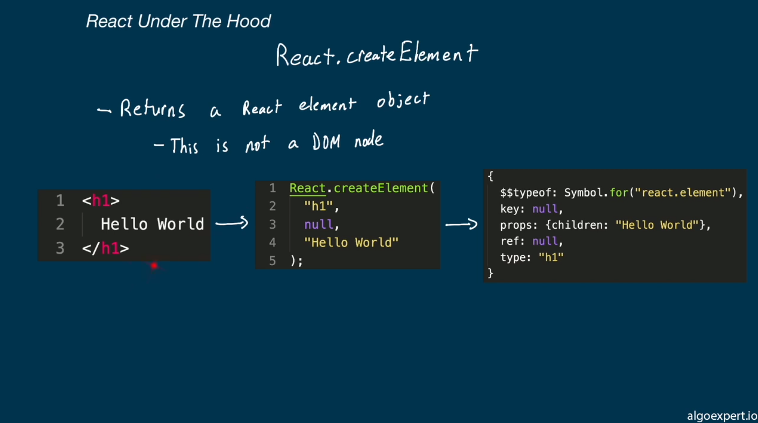

Most of the properties on this object look familiar:
- key: null (we did not set a key for <h1>)
- props: in this case only is taking the children, ie. "Hello World"
- ref: null (we don't have a ref)
- type: "h1"
- $$typeof: 
    - is not super important
    - idea: protect against injection attack
        - lets React know it did not come from JSON

#### ReactDOM.render

Once our JSX turns into a React element object, what do we do from there?

You call ReactDOM.render!

Function: ReactDOM.render: Traverses the React element object, turning them into DOM nodes
- Note: It is a tree, because of the props: {children: "Hello World"}

- Inputs:
    - React element object
    - Location to append DOM nodes
        - DOM nodes are appended to the 2nd argument's location

- Output: DOM nodes

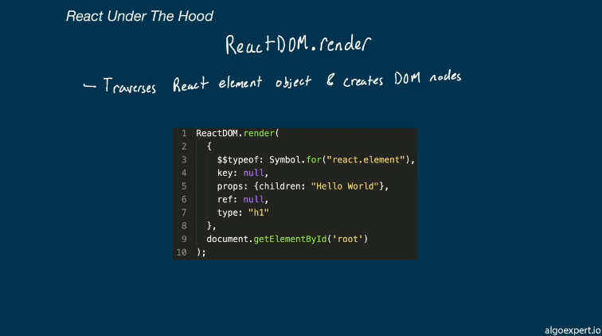

#### Virtual DOM

Now, that was the initial render. How does React keep up with Updates?

Virtual DOM.

Virtual DOM: The data structure created by nesting React Elements
- Important point: Much faster to update than the real DOM
    - Nothing needs to change on screen!
        - Standard DOM: Page has to update
        - Virtual DOM: You are just updating a JS Object

Note: Virtual DOM is a misnomer (React team is going away from this term)

#### Reconcilation

Now, if there is state update, React will need to update the real DOM as well. This is known as Reconcilation!

Reconcilation: An algorithm that React uses internally to figure out what has changed
- Takes old DOM object
- Takes new DOM object
- Figures out the difference! ("diff")

Goal: Figure out the differences, with the least/mininmum number of operations to change old into new!
- This all happens in the Virtual DOM
- Changelog is then sent to a rendering function
- Rendering function makes changes to the DOM

Note: This is where the Virtual DOM misnomer comes in, since it doesn't actually have to be the DOM
- Example: React.Native, which lets you write mobile apps with React, doesn't even have a DOM!
    - Uses reconcilation still
    - Uses different rendering function that takes changelog and creates a new output that mobile devices require

##### The algorithm

How Reconcilation calculates the "diff" of the virtual DOM after updates:

1. Check type: If root nodes are of different types: delete tree and rebuild
- least efficient type of change

2. Since type did not change, check attributes: If attributes changed, update existing nodes
- tell render-er it can update the existing nodes, just change their attributes
- example: if a class changed, the DOM node would be updated to have the new class (not replaced with a new DOM node)

3. Recurse on all children!
- repeat steps 1 and 2 for every child of the root node
    - go until leaf nodes/bottom of the tree

High level, that is it! There are other optimizations, though.

A term you may hear: Fiber

Fiber: A modern re-write of the reconciliation algorithm
- Focused on incremental rendering
- Knowing the changes is not important (very academic), but good to know at a higher level that incremental rendering is
    - "Chunk out" the rendering process
    - Break it up into multiple different steps
        - Prioritize more important things
            - Example: Slow animations

#### Keys

Final thing to look at: How the reconciliation algorithm handles keys!


When React recurses on children, it assumes the elements are in the same order.
- Keys: Lets us tell React which elements are which, so we don't need to rely on the elements being in the same order

Let's look at an example:

```html
<ol>
    <li key="first">First</li>
    <li key="second">Second</li>
</ol>
```

=> 

```html
<ol>
    <li key="zeroth">Zeroth</li>
    <li key="first">First</li>
    <li key="second">Second</li>
</ol>
```

What is going on here:
- Starting out -> First ordered list: 2 list items
- Final state -> Second ordered list: 3 list items
    - 3rd list item was added at the beginning (or prepended)

Situations:
- If we appended list item to end of list: Keys would NOT matter
    - React knows the 1st and 2nd items have not changed (still list item, still same content)
    - 3rd item would get added flawlessly 
 
- But, we prepended the list item to FRONT of list: Keys now DO matter
    - WITHOUT KEYS:
        1. React will compare 1st list item to 1st list item
            - First != Zeroth
                - Result: Update existing node

        2. React will compare 2nd list item to 2nd list item
            - Second != First
                - Result: Update existing node

        3. React will add the 3rd value (it did not exist before)
            - Second
                - Result: Create a new element

        - This is inefficient!

    - WITH KEYS:
        1. React will look at the key="zeroth" list item
            - React has not seen this key before, so
                - Result: Create a new element

        2. React will look at the key="first" list item
            - React HAS seen this key before
                - Result: No updated necessary

        3. React will look at the key="first" list item
            - React HAS seen this key before
                - Result: No updated necessary

        - This is much moreefficient!
            - React knows the 1st and 2nd items have not changed (still list item, still same content)
            - 3rd item would get added flawlessly


That is it for Keys, and why they are so important!
- Whenever you use dynamic data to create an array of children, ensure to give them all a key

 
#### Takeaways

This only scratches the surface, but should give a good idea of the following:
- Writing components
- Rendering them to the screen

#### Git

```sh
cd algoexpert.io

git status
git add .
git commit -m "Completed Lesson 19 of FrontendExpert's React Course"
git push -u origin main
git status
git log --oneline
q
```

## 20: Companion Libraries

### Key Terms

### Notes from the video

#### Setup

```sh
cd 20_companion_libraries
echo > 
```

#### 


####


#### Git

```sh
cd algoexpert.io

git status
git add .
git commit -m "Completed Lesson 20 of FrontendExpert's React Course"
git push -u origin main
git status
git log --oneline
q
```

