# FrontEndExpert Notes
## Myles Thomas
### 5/25/2023
#### algoexpert.io
---

There are 5 Courses in FrontEndExpert: 
1. HTML Crash Course
1. CSSCrash Course
1. JavaScript Crash Course
1. React Crash Course
1. Web Dev Fundamentals

---
# HTML Crash Course

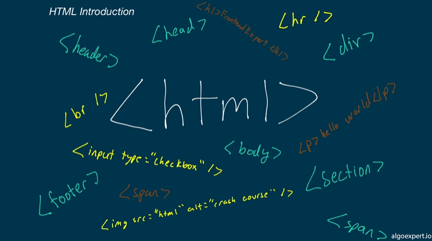

---
# Lesson 1: Introduction

HTML
- weird topic
    - people assume you know it even though not classes available with depth
        - there is a lot of complexity that can set you apart 

- although modern frameworks abstract away HTML, these are still HTML!
    - all frameworks must up rendering HTML (it is the building block!)
    - All content on the webpage is HTML
    - Example: JavaScript
        - Using javascript to add functionality - it will help knowing HTML 

    - JavaScript and CSS quesions will be easier if you know HTML

---
# Lesson 2: HTML Basics

## Header:

In order to build a solid foundation, we need to start w/ the basics!

## Key Terms:

### HTML 
HyperText Markup Language
- The primary language of the web
    - contains the content and structure of a webiste

https://developer.mozilla.org/en-US/docs/Web/HTML

### Tag
The primary method of marking up content using HTML
- Tags use the syntax: ```<tagname>content</tagname>```
    - Example:
        - Paragraphs use the 'p' tag:
            - This creates the paragraph "Hello World": 

            - ```<p>Hello World</p>```

- Elements: 
    - Left side tag: Opening tag
        - 
    
    - Right side tag: Closing tag
        - 

    - Everything inside of the tag: Content
        - gets rendered on the page 

- Tags:
    - Some tags don't have any content, known as: 
        - Empty tags
        - Self-closing tags
            - Either use opening tag syntax or ```<tagname/>```

        - Example: 
            - Horizontal rules use the hr tag
                - Create horizontal rule: ```<hr>``` OR ```<hr />```

### Attribute 
Extra information provided to HTML elements, similar to functions parameters.
- Attributes use this syntax: 
    - ```<tagname attribute="value">content</tagname>```
        - The attribute name will always come after the tag name (with a space between them)
        - The quoted value will be separated from the attribute name by an equals sign
            - Example: Input of type "checkbox": ```<input type="checkbox" />```

- A small number of attribues are booleans, rather than strings.
    - Any value for a boolean attribute will be treated as true
        - Examples: all of these would be disabled:
            - ```<input type="checkbox" disabled="disabled" />```
            - ```<input type="checkbox" disabled="true" />```
            - ```<input type="checkbox" disabled />```

---

### < !DOCTYPE html> 

The required first line of every HTML file, for telling the browser what version of HTML to use 
- A doctype of html will use the modern HTML5 standard
    - While a page will usually render properly without a doctype declaration, they should still be included 
        - some older browsers will not render pages following a more modern specification ("quirks" mode)

### < head>
The tag containing metadata about the HTML document
- it is anything that is not displayed on the page/screen
- the ```<head>``` head of the HTML file should be the 1st tag within the ```<html>```  tag

- The < title >  is the only required tag within the ```<head>```
    - This tag gives the page a title, which is used for the name of the tab in most browsers
        - Also gets used for search results in many search engines

https://developer.mozilla.org/en-US/docs/Web/HTML/Element/head      


### ```<body>``` 
The tag containing the content of the webpage 
- The ```<body>```  of the HTML file should be the 2nd tag within the ```<html>```  tag (right below ```<head>``` )
                

## My notes from the video:

HyperText Markup Language
- HyperText: text with hyperlinks 
- Markup Language: annotate text

Example: 
- My Blog Post              (heading)
    - 2 sections:           
        - Day 1             (sub-heading)
            - text          (paragraph)
        - Day 2             (sub-heading)
            - text          (paragraph)

How do we make annotations?
- Tags
    - Example: Hello World
        - ```<p>hello world</p>```
            - ```<p>...</p>``` are known as ankle brackets
            - most tags follow this, besides:
                - empty tags
                    - horizontal
                    - self closing tags
                        - more on these next

Thematic Break/Horizontal Tag/Self closing tag
- ```<hr>```: 
    - annoying because you don't know if a line is ending

- ```<hr/>```: 
    - this is preferred 
        - these are personal preferences 

Attributes
- Functional parameters

- Example: Check box
    - ```<input/ >```: Takes a regular input
    - ```<input type="chechbox"/ >```: Takes an checkbox input

Comments
- Looks similar to tags:
    - Open comment:  ```<!--``` 
    - Close comment: ```-->```

Whitespace
- Doesn't matter/is ignored in HTML
    - it will be collapsed

- Any of the following space characters:
    - spaces
    - tabs
    - new lines

    - Example:
        - These are the same: 
            1. ```<p>This is text</p>```

            2. ...
            ``` html
            <p>
            This
            is
            text
            </p>
            ```


Full HTML File
1. Doctype: ```<!DOCTYPE html>```
- tells the browser we want to use the most modern version of HTML
    - we can ignore this argument usually

1. HTML tag 
- root of the document 

- always contains these 2 tags: 
    1. Head
        - Holds metadata about the webpage (Not seen on the page) 
            - 1 tag required: ```<title>```
                - Used for tab name / search engines / others

    2. Body
        - All elements seen on the page
            - Paragraph: ```<p>Hello World</p>```


---
# Lesson 3: Semantic HTML 

## Header:

If a human were to read your markup code without any accompanying visual representation, would they understand the structure of your page?

## Key Terms:

### Semantic HTML 
HTML that clearly describes the content of the page 
- HTML loses its semantic meaning when tags are misused/overused
    - Examples: ```<div>```, ```<span>```

- Semantic HTML includes the usage of *semantic grouping tags*, which give meaning to different sections of the page 

    - Some commonly used semantic grouping tags/Elements: 

        - ```<article>```: self-contained
            - independently distributable content
                - (could be itself on the internet)

        - ```<section>```: thematic grouping of content
             - not self contained 
                - (could NOT be itself on the internet)

        - ```<header>```: Intro content

        - ```<main>```: Main content
            - Limited to 1 per page

        - ```<nav>```: A section of links
            - Oftentimes: For the primary navigation of the page

        - ```<aside>```: Non-vital content 
            - indirectly related to main content
                - (page would still make sense without this content)

        - ```<footer>```: Footer 
            - oftentimes: contains copyright information


## My notes from video:

Semantic HTML
---
Does your file make sense without seeing the browser?
- Example: when using a screen reader, we can't see it

- need a way to show what content should be grouped with what other content

Back to Blog Post Example: 
- Group 1: Day 1
    - 
- Group 2: Day 2
    - 
- Group 3: Day 1 + Day 2 (Entire blog post)
    - 

Example: AlgoExpert Reviewed
- Picture: 

    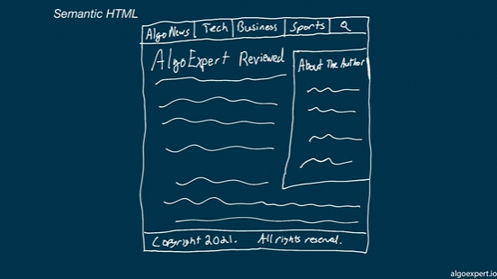

- Semantic Groupings: 

    - Article: 'AlgoExpert Reviewed'

    - Section: 

    - Header: 'AlgoNews'
        - name of website

    - Main: 

    - nav: tech/business/sports
        - These are links right by the header 

    - aside: 'About the author'
        - we can ready the article without this 

    - Footer: copyright
        - 

---
# Lesson 4: Essential HTML Tags

## Header:

These HTML tags are virtually everywhere 
- ubiquitous/on every page


## Key Terms:

## Paragraph tag (```<p>```)

Used for blocks of text
- Can contain other elements that are part of the paragraph
    - Example: Images

https://developer.mozilla.org/en-US/docs/Web/HTML/Element/p


## Heading tags
HTML tags represented by one of the following:
- ```<h1>``` (top level heading)
- ```<h2>``` (secondary heading)
...
- ```<h6>``` (bottom level heading)

https://developer.mozilla.org/en-US/docs/Web/HTML/Element/Heading_Elements


## ``````
The image tag
- this is an empty tag
- a real one should always contain these 2 things: 
    - src: the path to the image (can be relative or absolute)
    - alt: Alternative text to be used with screen readers OR anytime the image can't be displayed

    ``` html
    
    ```

https://developer.mozilla.org/en-US/docs/Web/HTML/Element/img

## ```<ul>```
Unordered list tag
- used for a list where the order does not matter
    - by default, most browsers will show this as a bulleted list

    - can contain any # of < li> tags, as in this example: 

    ``` html
    <ul>
        <li>AlgoExpert<li>
        <li>SystemsExpert<li>
        <li>MLExpert<li>
        <li>FrontendExpert<li>
    </ul>
    ```

https://developer.mozilla.org/en-US/docs/Web/HTML/Element/ul

## ```<ol>```
Ordered list tag
- used for a list where the order matters
    - by default, most browsers will show this as a numbered list

    - can contain any # of < li> tags, as in this example: 

    ``` html
    <ol>
        <li>Step 1<li>
        <li>Step 2<li>
        <li>Step 3<li>
    </ol>
    ```
https://developer.mozilla.org/en-US/docs/Web/HTML/Element/ol

## ```<li>```
list item tag
- Used for individual elements, in both ordered/unordered lists
- List items can also contain other lists to create nested lists
    - Example: 

    ``` html
    <ol>
        <li>Step1</li>
        <li>
            Step 2:
            <ol>
                <li>Substep 1:</li>
                <li>Substep 2:</li>
            </ol>
        </li>
        <li>Step 3</li>
    </ol>
    ```

https://developer.mozilla.org/en-US/docs/Web/HTML/Element/li

## ```<pre>```
Preformatted text tag
- Preserves whitespace
    - Can be useful for when indentation and newlines need to be preserved

    ``` html
    <pre>
        *
       ***
      *****
     *******
    *********
       | |
    </pre>
    ```

https://developer.mozilla.org/en-US/docs/Web/HTML/Element/pre

## ```<br>```
Line break tag
- used to create a line break in text
- Popular uses: 
    - Introduction of email
    - New lines in a poem

- Warning:
    - Tag should not be used for spacing out elements that we could otherwise do with CSS

    ``` html
    <p>
        Dear User, <br />
        We hope you are enjoying FrontendExpert!
    </p>
    ```

https://developer.mozilla.org/en-US/docs/Web/HTML/Element/br

## ```<hr>```
Horizontal rule tag
- used to create a thematic break between content (drawn as a horizontal line by default)

``` html
<p>Part 1</p>
<hr />
<p>Part 2</p>
```

https://developer.mozilla.org/en-US/docs/Web/HTML/Element/hr

## ```<a>```
Anchor tag
- Used for linking to other pages
- Tag should include an 'href' attribute w/ path to the page being linked (absolute or relative)

``` html
<a href="https://algoexpert.io">AlgoExpert</a>
```

https://developer.mozilla.org/en-US/docs/Web/HTML/Element/a

## ```<em>```
Emphasis tag
- Usually rendered as italics 

``` html
<p>I <em>need</em> to study!</p>
```

https://developer.mozilla.org/en-US/docs/Web/HTML/Element/em

## ```<strong>```
Strong tag
- Usually renders as bold 

``` html
<p><strong>Note: </strong> This is very important!!!!</p>
```

https://developer.mozilla.org/en-US/docs/Web/HTML/Element/strong

## My notes from video:

Essential HTML Tags

Before starting
- Semantic markup is important
    - We want to describe as best as possible
    - We will not look at output in this video!

- Tags provide content structure, not layout/style

Paragraph (```<p>```)

Headings (```<h1>``` ... ```<h6>```)
- Font size does NOT equal heading level
    - Change that later

Images (``````)
- src: path
- alt: alternative text 
    - internet is down / screen readers

Lists (```<ol>``` or ```<ul>```)
- ordered: 
    - 1,2,3,4

- unordered:
    - -,-,-,-,

Preformated text ( ```<pre>```)
- preserves whitespace

Line break (```<br />```)
- self closing tag
- not a replacement for CSS
    - has semantic meaning 

Horizontal rule (```<hr />```)
- similar to br tag
- Splitting up different pieces of content
    - Don't think of it as a horizontal line (can use CSS for that )

Anchor Tag (```<a href="..."> content...<a/>```)
- for hyperlinks
    - href: path/url
    - target: if you want to open a new tab/window
        - defaults to opening new tab

Emphasis (```<em>```)
- Not just italics! Use CSS for that

Strong (```<strong>```)
- Same as emphasis, basically
    - remember, don't use unless it shows importance!

---
# Lesson 5: Tables

## Header:

Tables are best used to organize your page layout
- Table layouts are outdated af

## Key Terms:

## ```<table>```
Table HTML tag for representing data with rows/columns
- General rule: anything that could go into a spreadhseet can also make sense in a table

- A variety of tags associated with tables, these are the most common: 

    - ```<tr>```: single row in the table

    - ```<th>```: heading in the table
        - Use with scope attribute (row/col) to choose what the content is a heading for 

    - ```<td>```: a single piece of data in the table
        - a cell

    - ```<thead>```: a grouping tag for the heading of a table
        - usually containing 1 single < tr> with column headings

    - ```<tbody>```: a grouping tag for the body of the table
        - used for containing the primary rows of data 

    - ```<tfoot>```: a grouping tag for the footer of the table 

    - ```<caption>```: caption/title for the table

    
https://developer.mozilla.org/en-US/docs/Web/HTML/Element/table

## My notes from video:

Tables
- tabular data with rows/column
    - if it belongs in a spreadsheet

Note: CSS w/ HTML tags makes more sense, sometimes

Note: A lot of this table stuff is dumb, JavaScript will do the job WAY better

Here is our code example, commented out: 

This can also be found here: 
/FrontendExpert/5 - Tables/tables.html


---
# Lesson 6: Forms

## Header:

Many joke that frontend developers spend their time editing buttons on forms
- Let's find out how to do it, just in case

## Key Terms:

## ```<form>``` 
HTML tag for a section of interactive inputs
- used for submitting information to the server
- forms usually contain the following:
    - a variety of label-input 
    - submit button

- Example: 
    ``` html
    <form>
        <label for="username">Username:</label>
        <input for="text" id="username" />

        <label for="password">Password:</label>
        <input for="password" id="password" />

        <button>Submit</button>
    </form>
    ```
https://developer.mozilla.org/en-US/docs/Web/HTML/Element/form

## My notes from video:

HTML Forms
- will re-visit with JavaScript course to save data in a server/database
- start taking inputs from user

Logic
- label: title for text box
    - for: which id input it is for 

- input: where the user writes into text box
    - id: lets labels find it 
    - name: what the server knows it as
    - type: text/password/etc.
    - placeholder: grey letters
        - for text

Form validation:
- What if we want passwords to meet a threshold of length? 
    - input minlength="6"
- What if we want to require a box to be filled?
    - input required


Other types of data: 

Date
- pick a date 

Checkbox
- binary check or no

Radio
- have multiple buttons 
    - looks ugly, but CSS can get them on 1 line!

Look at the examle here:
/FrontendExpert/6 - Forms/forms.html

---
# Lesson 7: Document Object Model 

## Header:

Document Object Model
- Time to learn about this because apparently everybody has heard about it, except for me!

## Key Terms:

## Document Object Model
The programming interface for interacting with an HTML document (represented as a tree data structure)
- Each HTML element is a node in the DOM tree
    - Nested content represents children in the tree

## My notes from video:

DOM

What actually happens to our HTML? 
1. Browser recieves our HTML as a text file
- 

2. Browser turns text file into DOM (Document Object Model) tree
- 

3. Browser turns DOM tree and generates UI (user interface)


Purpose of DOM:
- Keeps track of what is on the page

- Provides an API
    - Can interact with the API via JavaScript 

- Tree Structure
    - Elements and text are stored as nodes \
        - Rare node: comets

Example: Document Object Model
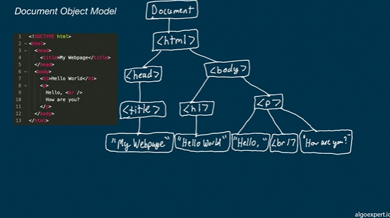

Example can be found here: 
/FrontendExpert/7 - Forms/forms.html


---
# Lesson 8: Acessibility

## Header:

Accessible web development leads to a better user experience for all.
- Also, a more inclusive internet 

Let's look at the following: 
- some best practices to follow
- markup elements to include when designing (with accessibility in mind)

## Key Terms:

## Accessibility
Building applications usable by as many people as possible!
- Oftentimes: Utilizing semantic HTML 
    - Ensuring the application works with various assistive technologies


## Accessibility Tree
A tree representation of the page, focusing on information specific to accessibility
- Each node in this tree contains information such as the following:
    - role
    - state
    - name
    - description

- Accessibility tree is created from the DOM tree
    - Keeps in sync with it 
    - Assistive technoligies (ie. screen readers) interact with the accessisibility tree instead of directly with the DOM

https://developer.mozilla.org/en-US/docs/Glossary/Accessibility_tree

## WAI-ARIA (Web Accessibility Initiative - Accessible Rich Internet Applications)
Specification for accessible HTML created by the World Wide Web (W3C)
- Oftentimes, referred to as just ARIA

- Contains a set of HTML attributes that can be added to provide extra information to the accessibility tree.

- ARIA attributes are grouped into 3 major categories: 

    1. Roles: What the element is doing
    - used to define the purpose of the element

    - Subgroups: 

        - Landmark: Major content areas
            - "Navigational landmarks"

        - Structure: Document structure info

        - Widget: Interactive elements

        - Window: Sub-windows in the browswer

        - Live Region: Regions with dynamically changing content  

    2. Properties: Extra meaning and characteristics of the element
    - example: labels

    3. States: Current state of the element
    - example: if it is disabled

https://developer.mozilla.org/en-US/docs/Learn/Accessibility/WAI-ARIA_basics


## My notes from video:

Accessibility - Building Websites for Everyone
- We want people of all ability to use our websites
    - Some use the following: 
        - keyboard
        - assisting technologies (screen reader)

Accessibility tree
- Similar to the DOM tree
    - Has info for accessibility 

    - 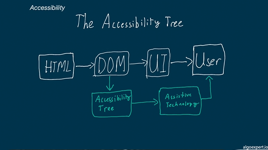

- Nodes have: 
    - name
    - description
    - role
    - state

Writing Accessible HTML
1. Use descriptive content, labels, and alt attributes

2. Use semantic elements
- Accessibility tree automatically gets filled in 

3. Test keyboard controls 
- Ensure you can navigate to all parts of websites with keywords 
    - properly interact with inputs


WAI-ARIA (Web Accessibility Initiate)
- Proivdes moves attributes to use in HTML (to fill out the accessibility tree)
    - Roles: what an element does
    - Properties: extra meaning ie. labels
    - States: current state ie. disabled

Landmark Roles
- Major content areas
    - First thing user navigates to when using technologies
    - Examples: 
        - Banner
        - Main
        - Navigation

        ``` html
        <div role="banner">
            <hi>My Accessible Webpage</hi>
        </div>
        ```

Structured Roles
- Document structural information 
    - a little bit less important 
    - Examples: 
        - Tooltip
        - List
        - Table

        ``` html
        <section role="list">
            <div role="listitem">First item</div>
            <div role="listitem">Second item</div>
            <div role="listitem">Third item</div>
        </section>
        ```

Widget
- Identify interactive elements
    - Some of these align with elements we already have, but some widget roles exist and good to use 
- Examples: 
    - Tab
    - Searchbox
    - Button

    ``` html
    <div role="button">
        Click on me!!!
    </div>
    ```

Window Roles
- Sub windows in the browser
    - Remove some content from the rest of the page
    - Usually in a module, such as: 
        - Dialog (separate content)
        - Alert dialog (separate content w/ high importance)

        ``` html
        <div role="dialog" aria-labelledby="title">
            <h2 id="title">Successfully saved changes!</h2>
            <button>Dismiss</button>
        </div>
        ```

Live Region Roles
- Dynamically changes content
    - Will be checked on periodically to notify user of changes
        - Timing on checks depends on content type, such as: 
            - timer
            - log
            - alert

            ``` html
            <ol role="log">
                <li>Chat message 1</li>
                <li>Chat message 2</li>
                <li>Chat message 3</li>
            </ol>
            ```

Aria Live
- Dynamic changing content and importance
    - Tells how often we need to change it
    - Examples: 
        - Off: Don't announce changes
        - Polite: Announce changes when idle
        - Assertive: Announce changes as soon as possible
            - very important alert messages

        ``` html
        <div aria-live="polite">
            My content is about to change!
        </div>
        ```

Aria Properties
- Used to improve accessibility of website

- Examples: 

    - Aria-label: Label not visible on UI
        - part of markup tree/accessibility tree
            - nice for something that is easy to see but won't be visible on markup tree

    - Aria-labelledby: Another element as a label, passed by ID
        - Using another element as the entire label
            - Similar to "for" attribute

    - Aria-description: More detail than labels
        - Longer and more detailed 

    - Aria-describedby: Another element as a description, passed by ID
        - Works just like labelledby

    ``` html
    <div role="dialog" aria-labelledby="title">
        <h2 id="title">Successfully saved changes</h2>
        <button>Dismiss</button>
    </div>
    ```

Aria States
- Provide stateful information
    - Usually used for inputs 

- Examples: 

    - aria-checked: checkbox state 

    - aria-disabled: element is disabled 
    
    - aria-expanded: expanded or collapsed
    
    - aria-hidden: not visible on page
    
    - aria-pressed: toggle is currently on/pressed
    
    - aria-selected: element is currently selected
    
    - much more!
        - pretty much anything you could think of that you'd need to tell the user

    ``` html
    <div roles="checkbox" aria-checked="true">
        I am checked rn!
    </div>
    ```
    
Other concerns
- Browser compatibility
    - Some people use old browsers, we need to account for them
        - some cutting edge features won't be supported

- CSS Accessibility
    - Use the following in good practice: 

        - Contrast (colors make elements stand out different)
        - Legible font
        - Mobile support (4k monitor vs. phone)
        - etc.

- Internationalization (il8n)
    - language support
    - Test with different "styles" of languages
        - We want support for different regions
        - Some text goes vertically vs. horizontally

Code Example:
Can be found here:
[Another_on_this_local_device] (C:/Users/Myles/OneDrive/Documents/algoexpert.io/FrontendExpert/html_crash_course/8 - Accessibility/accessibility.html)

Takeaways
- 

---
# Lesson 9: Meta Tags

## Header:

Metadata is special information about your webpage
- can be used by search engines and web browsers to do cool stuff
    - where do you define this data?

## Key Terms:

## ```<meta>```
HTML tag for providing extra metadata about a webpage
- Most meta tags will use 'name' and 'content' pair for the type of metadata and its value 

- Common metadata tags: 

    ``` html
    <!-- Sets the character encoding to utf-8 -->
    <meta charset="utf-8" />

    <!-- Allows for custom responsive CSS, rather than the default scaling behavior or small devices -->
    <meta name="viewport" content="width=device-width, initial-scale=1" />

    <!-- Sets the page author to utf-8 -->
    <meta name="author" content="Myles Thomas" />

    <!-- Sets the page description to utf-8 -->
    <meta name="description" content="Ace the frontend interviews!" />
    ```

## Favicon
"Favorite icon"
- the icon for a web page
    - browswers usually show these in a variety of places, such as: 
        - next to the tab name

    - favicons are created using the < link> tag:

        ``` html
        <link rel="icon" href"favicon.png" />
        ``` 

## ```<base>```
Tag for setting the document base URL 
- Used for all relative links on the page

    - Example: 

    ``` html
    <!-- This line goes in the <head> -->
    <base href="https://algoexpert.io">

    <!-- This would go to https://algoexpert.io/frontend -->
    <a href="/frontend">FrontendExpert</a>
    ```

https://developer.mozilla.org/en-US/docs/Web/HTML/Element/base

## My notes from video:

Meta Tags 

HTML head tag
- used for information that is not on the page

- 1 required: title
    - name of tab in browswer
    - browswer history
    - accessiblity


# HTML Crash Course

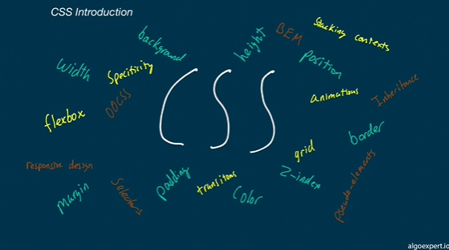

---
# Lesson 1: Introduction

Intro

CSS

- Primary way to add color/styling

- Can change colors/animations

- Syntax is Very simple
    - Can be complex ie. stacking on 3D/Z axis

- Frustration 

    - Hard to debug

    - Lack of understanding of core concepts

Core concepts:

- Box model

- Stacking elements

Deep dives

- Fundamental for interviews

    - Don't want to get stuck centering a page lol

- Fundamental for being a good frontend engineer

    - Must know feasability of design

- Quiz type

    - Fundamentals

- Best practices must be practiced

- Maximize productivity 


# Lesson 2: CSS Basics

Your journey to CSS mastery begins with the basics

# Key Terms

## CSS (Cascading Style Sheets)

Primary styling guide of the web

- Language is used to describe the style/layout of HTML documents

Learn more: https://developer.mozilla.org/en-US/docs/Web/CSS


## Cascading

The order that stylesheets are used

- Can be grouped into 3 main categories:
    
    - User Agent Stylesheets: Contain browser defaults for styles 
        - these get lowest level of precedence

    - User stylesheets: Contain user preferences saved in the browser
        - Overrides user agent stylesheets

    - Author Stylesheets: Contain the CSS code we write
        - Get highest level of precedence
            - Assuming 'limportant' has not been used

Learn more: https://developer.mozilla.org/en-US/docs/Web/CSS/Cascade


## Declaration

A CSS property-value pair in the form property: value

Learn more: https://developer.mozilla.org/en-US/docs/Web/CSS/Syntax#css_declarations


## Declaration Block

A group of declarations surrounded by {}

Example: 

``` css
{
    color: blue;
    margin: 10px;
}
```

Learn more: https://developer.mozilla.org/en-US/docs/Web/CSS/Syntax#css_declaration_blocks


## Ruleset

A selector, followed by a declaration block for styling elements matching the selector with the declarations in the declaration block.

Rulesets follow this syntax: 

``` css
selector {
    property: value;
    property: value;
}
```

Learn more: https://developer.mozilla.org/en-US/docs/Web/CSS/Syntax#css_rulesets

## ```<link>```

A self-closing HTML tag for linking external resources, usually CSS stylesheets

- When linking a stylesheet, ```<link>``` takes 2 attributes: 

1. rel: the relationship to the other document
- this should be 'stylesheet'

2. href: the path to the linked file
- relative or absolute

Learn more: https://developer.mozilla.org/en-US/docs/Web/HTML/Element/link


# Notes from the video

Cascading Style Sheets

2 purposes: 

1. Style our website
- Fonts, colors

2. Describe the layout
- Size/position of elements

3 Main types of style sheets: 

1. User-agent stylesheets

2. User stylesheets

3. Author stylesheets
- highest level of preference 


Declarations
- individual rules
    - exampmle: 
    ``` css
    property: value;
    color: red;
    ```

Ruleset
- Has 2 primary components: 
    1. selector: which elements are effected
    2. declaration block: collections of declarations

``` css
hi, p {
    color: blue;
    margin: 10px; 
}
```
- selector: h1, p (header1, paragraph)
- declaration block: color and margin declartions 

Comments
- easy, and can be multiple lines: 

``` css
/* This is how to make a comment
a
a
a
a
*/ and now this would be an error
```


Linking CSS back to HTML
- goes in the head so it doesn't go in the page
- 2 attributes: 
    - rel: says what the relationship is to the HTML
    - href: path
        - usually is styles.css

``` css
<link rel="stylesheet" href="name-of-file.css" />
```

That's really it for CSS basics!

Here is an example: 

1. Create directory '2 - Basics':
- npm init -y
- npm install http-server -g

2. Put code into 'basics.html' and 'styles.css':

3. Start server:
- http-server

4. Optional: Make changes and have them reflect on the screen: 
- Ctrl-F5

Code examples to learn from:

``` html
<!DOCTYPE html>
<html lang="en">
    <head>
        <title>CSS Basics</title>
        <link rel="stylesheet" href="styles.css">
    </head>
    <body>
        <h1>Hello World from H1!</h1>
        <p>I am a paragraph...</p>
    </body>
</html>
```

``` css
h1 {
    text-align: center;
    color: brown;
    font-weight: normal;
    text-decoration: underline;
}

p {
    background-color: rebeccapurple;
    color: white;
    text-align: right;
    min-height: 100px; /* min-height is better than height because large default font would be trapped in */
    font: 1.25rem; /* rem:  root em, font size relative to the size of the root element (HTML tag's) */
    width: 30%; /* width: 30% of page */
}
```


# Lesson 3: Selectors

CSS offers a selection of selectors for you to select from

# Key Term

## Selector

A pattern used at the beginning of a ruleset for choosing which elements will be affected by the declarations.

Variety of selector types: 
- Type selector: Selects all of the elements of a specific HTML tag
    - Example: h1 would select all ```<h1>``` elements

- Class selector: Selects all elements with a specific HTML class attribute
    - Class selectors are prefixed with ```.```
    - For example: ```.foo```
        - that would select all HTML elements with the ```attribute class="foo"```

- ID Selector: Selects an element with a specific HTML ID attribute
    - ID selectors are prefixed with a ```#```
    - Example: ```#bar```
        - that would select the HTML element with the ```attribute id="bar"```

- Attribute Selector: Selects all elements with a specific HTML attribute set to a specific value 
- These are surrounded by ```[]``` and use ```=``` as a delimiter between the attribute name/value
- Example: ```[type="submit"]``` would select all elements with a type attribute set to "submit"

- Excluding the value will select all elements with the attribute set to any value 
- Example: ```[type]``` would select all elements with the type attribute set, regardless of value. 

- Attribute selectors can also use special syntax for basic pattern matching within the value.
    - There are a variety of options here, but these are some of the more common ones: 

        - ```[href*="algoexpert.io"]```: this would select all elements with an href attribute with the text "algoexpert.io" at any location

        - ```[href$="algoexpert.io"]```: this would select all elements with an href attribute at the end

        - ```[href^="algoexpert.io"]```: this would select all elements with an href attribute at the beginning

- Combinator: Combines multiple selectors to select elements based on their location in the DOM

- A few types of combanitors: 

    - Descendant combinator: Represented by a space (``` ```)
        - format: ```selector1 selector2```
    - Selects all elements that match ```selector2``` and are a descendant of an element matching ```selector1```.
        - A descendant does not need to be a direct child 
        - Example: Think of a folder with 3 sub-directories, it would match 

    - Child combinator: Represented by ```>```
        - format: ```selector1 > selector2```
    - Selects all elements that match ```selector2``` and are a sibling of an element matching ```selector1```.
        - The element matching  ```selector2``` must come after the element matching ```selector1```

    - Sibling combinator: Represented by ```~```
        - format: ```selector1 ~ selector2```
    - Selects all elements that match ```selector2``` and are a sibling of an element matching ```selector1```
        - The element matching ```selector2``` must come after the element matching ```selector1```

    - Adjacent sibling combinator: Represented by ```+```
        - format: ```selector1 + selector2```
    - Selects all elements that match ```selector2``` and have an element matching ```selector1``` directly before them in the DOM 

Learn more: https://developer.mozilla.org/en-US/docs/Web/CSS/CSS_Selectors


# Notes from the video: 

CSS Selectors
- being more specific with the elements that we select

Start by making this super basic example before adding to styles.css: 

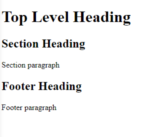

Note: run.sh to setup directory, manually call http-server


``` css
/* This would grab everything with class="red"*/
.red {
    color: white;
}

/* This would grab everything, period*/
* {
    color: red;
}

/*This would grab everything with id="red" */
#red {
    color: black;
}

/*This would grab everything with type 'a' AND href=='https://algoexpert.io' */
a[href="https://algoexpert.io"] {
    color: green;
}

/*This would grab everything with type 'a' AND href STARTS WITH'https://algoexpert.io' */
a[href^="https://algoexpert.io"] {
    color: green;
}

/*Combinator Selectors*/

/*Look for paragraphs, anywhere inside of footer*/
footer p {
    color: pink;
}

/*Child selector: Look for paragraphs, directly inside of footer
Div paragraph is inside of div AND inside of footer, so it stays black*/
footer > p {
    color: pink;
}

/*Sibling Selectors*/
/*Shares same parents ie. right next to each other*/

/*Get any paragraph that is a sibling of h2*/
h2 ~ p {
    color: aqua;
}

/*Get any anchor tag that is adjacent to h2*/
/*Systems expert top line is adjacent, the others are not!*/
h2 + a {
    color: brown;
}
```

# Lesson 4: Pseudo Classes And Elements

# Key Terms

## Pseudo Class
An addition to a CSS Selector for selecting based on the current state of the element

- Start with ```:```
- example: ```button:hover``` would select buttons currently hovered over

Learn more: https://developer.mozilla.org/en-US/docs/Web/CSS/Pseudo-classes

## Pseudo Element
An addition to a CSS selector for selecting a specific portion of the element 
- Starts with ```::```
- example: ```p::first-letter``` would select the first letter of paragraphs

- ```::before``` and ```::after``` are special pseudo elements that insert child before or after the content of the element, allowing for styling before/after the comment
    - Oftentimes, used with the CSS ```content``` property (not always)

Learn more: https://developer.mozilla.org/en-US/docs/Web/CSS/Pseudo-elements

# Notes from the video: 

Pseudo Classes and Elements
- for selecting based on current state in the doc 
    - Example: Just elements that are currently disabled
    - Example: First letter/first line 

``` css
/*Pseudo Classes
------------------------------------*/

/*Links that are un-visited*/
a:link {
    color: red
}

/*When we come back it is purple, 
hence the links that are un-visited part...
- Now we are taking the 1 <a> that's visited and making it green */
a:visited {
    color: green;
}

/*Style based on current state 
ie. "what they are currently doing"*/
input:focus {
    outline: 10px solid blue; /*When I click box, it gets huge and blue*/
}

/*Select invalid inputs
Output must be 6+ or it will be red once you click out*/
input:invalid:not(:focus) {
    outline: 15px solid red;
} /*When you start typing, both this and the big blue are true!
CSS will default to this since it is lower in the .css file
Add :not(:focus) so fix this, so it waits for you to stop typing!
ie. 
Blue: Hello World
Red: Hello*/

/*Select elements based on location in the DOM
This takes the 1st paragraph in a set of direct sibling 'Go to' */
p:first-of-type {
    color: orange;
    font-size: 32px; /*16x is default*/
}

p:last-of-type {
    color: purple;
    font-size: 8px;
}

/*Selects odd/even/(2n-1 is odd)*/
p:nth-of-type(2n-1) {
    color: pink;
}

/*look at every element ie. div: whos your first child */
p:first-child {
    color: greenyellow;
    font-size: 24px;
}


/*Pseudo Elements
------------------------------------*/

/*first letter (of all <p>)*/
p::first-letter {
    font-size: 2em; /*2x size of current font*/
}

/*before and after are self explanatory*/
p::before {
    content: ">";
}
p::after {
    content: "!"; /*make sure HTML is on same line to avoid whitespace*/
}
```


# Lesson 5: Selector Specificity

Humans often resort to violence as a means of conflict

CSS takes a math approach to settling disputes

# Key Term

## Specificity 
The algorithm used by the browser to determine which CSS declarations to use when an element is selected by 2 rulesets with the same property 
- Roughly calculated by counting the number of each selector type involved in a selector and multiplying by a weight
- These weights are as follows: 

    - Inline styles: 1000
        - Not recommended: This is writing CSS in your HTML file (Trump card)

    - IDs: 100

    - Classes: 10

    - Pseudo-Classes: 10

    - Attributes: 10

    - Elements: 1

    - Pseudo-Elements: 1

    
Learn more: https://developer.mozilla.org/en-US/docs/Web/CSS/Specificity


# Notes from the video: 

Selector Specifity
- Conflicting rulesets

Specific selectors win!
- The most "specific" selector gets used
    - Default: Last rule in the stylesheet (if they tie)

Example: 

``` css
a[href="https://algoexpert.io"] {
    color: green;
}

section.links a {
    color: red;
}
```

Scores: 

1. 11
- a: 1 (element)
- href: 10 (attribute)

2. 12 - winner
- section: 1 (element)
- link: 10 (attribute)
- a: 1 (element)

Override: ```!important```
- "This is so important, use it regardless"
    - avoid using this, it ruins the cascading nature of CSS

    - When it can be useful: Using a library


# Lesson 6: CSS Units

Most units are useless, but time to learn

# Key Terms

## Absolute Unit
A unit whose value is not dependent on something else
- its size will be constant regardless of context 
    - example: ```px```

## Relative Unit
A unit whos value is dependent on something else
- Most frequently used relative units: 
    - ```em```: Relative to the font size (parent font size)
        - Example: Font size is ```14px```, with ```1.5em``` you'd get 21px

    - ```rem```: Relative to the root element's font size
        - This is usually ```16px``` (unless overridden by user's stylesheet)
        - Author stylesheets can change this by setting a font size on the html selector OR the ```:root``` pseudo class
        - example: by default, ```1.5rem``` will be ```24px```

    - ```%```: A percentage 
        - Usually of the parents value for the same property
            - Example: width of ```50%``` would be half the size of parent's width

    - ```vw```: A percentage of the width of the viewport
        - Example:  ```50vw``` would be half width of viewport

    - ```vh```: A percentage of the height of the viewport
        - Example:  ```50vh``` would be half height of viewport

    - ```ch```: The number of characters on a line
        - Based on the size of the "0" character in the element's font 
            - Can be useful to prevent paragraphs from spanning more than -70 characters in width (it can be hard to read)

# Notes from the video: 

How To Choose Units

Lengths: 
- most basic: px (absolute)
    - inches/cm don't get used much 

- common: em/rem

- relative to viewport: vm/vh

- width based on characters: ch

- percentage: %

How to choose units? 
- be consistent with code of existing project

Width/Height
- %: relative to parent
- vw/vh: relative to viewport
- ch: for paragraph widths
- rem: close to absolute value 
    - last resort: px

Margin/Padding
- rem: for closer to absolute values
- em: to scale with font size
- px: for small values (last resort)

Borders/Shadows
- px: small values 
    - we often don't want to actually scale these
- rem/em
    - note: scaling doesn't always look great 

Font Size
- rem: best
- em: confusing with large projects due to large chain of parents
- last resort: px
    - will prevent user preferences

Colors
- keywords: red/blue
    - avoid super common colors for full projects because they are generic and stand out 

- Hex RGB: #4B7DAF (red, green, blue)
    - most common

- RGB: rgb(75, 125, 175)
    - RGBA: rgba(75, 125, 175, .5)
        - note: 'a' is for alpha value at end (transparency)

- HSL: hsl(210, 40%, 49%)
    - HSLA: hsla(210, 40%, 49%, .5) 
        - note: 'a' is for alpha value at end (transparency)

Quick Demo: 
/6 - CSS Units

``` css
/*new stuff*/
html {
    font-size: 24px; /*makes all html scale up from 16 to 24*/
}

/*Fix the paragraph that is super long (bad user experience)*/
p {
    width: 60ch; /*60 character/line regardless of window size (using 50% is a bad idea)*/
}

/*for the id="parent"*/
#parent {
    font-size: 1.5em;
    width: 60%;
    border: 2px solid black;
}

/*old stuff*/

/*for the id="red"*/
#red {
    font-size: 1em;
    width: 50%;
    background-color: red;
}
/*for the id="blue"*/
#blue {
    font-size: 1rem;
    width: 50vw; 
    background-color: rgba(75, 125, 175, 0.3); /*hard to read: #4b7daf*/
} /*a: alpha value for shade/transparency*/

/*for the id="green"*/
#green {
    font-size: 16px; /*doesn't scale with html, which is bad*/
    width: 10rem;
    background-color: green;
}
/*for anything inside of div*/
div {
    margin: 10px;
    color: white;
}
```

# Lesson 7: Block vs. Inline
block
block
inline inline inline

# Key Terms: 

## Block Element 
An element with its ```display``` property set to ```block```. These have a few key properties: 
- they start on new lines 
- by default they span the entire width of their parent 

Learn more: https://developer.mozilla.org/en-US/docs/Glossary/Block-level_content

## Inline Element 
An element with its ```display``` property set to ```inline```. These have a few key properties:

- they start immediately after the content behind them (without a new line)
- they span the width of their content 
- ```width``` and ```height``` properties with no effect on them

Learn more: https://developer.mozilla.org/en-US/docs/Glossary/Inline-level_content

## Inline-Block Element
An element with its ```display``` property set to ```inline-block```. These have a few key properties:
- they start immediately after the content before them (without a new line)
- they span the width of their content
    - by default, but this can be changed


# Notes from the video: 

Code examples: 

``` css
/*Border is currently taking up the entire width of the body
- its defaults to block level element
    - defaults to entire width of parent
    - starts on new line

p is the parent of em, so if we change p's width, em will change too */

p {
    display: inline-block; /*middle ground: */
    width: 30vw;
    border: 2px solid black;
}

em {
    /*width: 100vw;
    height: 100vh;*/ /*these do nothing at first: inline elements look at width of content */

    border: 2px solid blue;

    /*display: block; this makes the height/width turn on*/
    /*margin: 10px; splits them up a bit */ 
}


```

# Lesson 8: Box Model

Think outside/inside the box!

# Key Terms: 

## Box Model
A box surrounding all elements on the document used for layout 
- Consists of the following:
    - content
    - padding
    - border
    - margin

Learn more: https://developer.mozilla.org/en-US/docs/Learn/CSS/Building_blocks/The_box_model

## ```padding```
A property used to create extra space within an element, between the ```content``` and ```border```
- the ```padding``` CSS property is shorthand for ```padding-top```, ```padding-right```, ```padding-bottom```, and ```padding-left``` (in that order)

Learn more: https://developer.mozilla.org/en-US/docs/Web/CSS/padding

## ```border```
A property used to create a border around the content and padding of an element
- The ```border``` CSS property is shorthand for ```border-color```, ```border-style```, and ```border-width```, which it takes as space separated values (in any order)
- Example: ```border: 1px solid black```: this would create 1 pixel w/ solid black border

- A ```border-radius``` can also be used to create rounded corners on an element, regardless if it has a border
    - This defines the radius of the corners, and a value of ```50%``` is often used on square elements to create a circle!

Learn more: https://developer.mozilla.org/en-US/docs/Web/CSS/border

## ```margin```
A property used to create extra space around an element. 
- The ```margin``` CSS property is shorthand for ```margin-top```, ```margin-right```, ```margin-bottom``` and ```margin-left``` (in that order) 

- A value of `auto` can also be used to allow the browser to choose margins
    - this will usually center block elements horizontally

Adjacent Horizontal vs. Adjacent Vertical:
-  horizontal margins: will be added together to determine the space between elements
- Vertical margins: will be collapsed usually (only the larger margin value will be used)

Learn more: https://developer.mozilla.org/en-US/docs/Web/CSS/margin

# Notes from the video: 

Box Model
- how element show up on the page 
- using the following: 
    - margin
    - border
    - padding
    - content of those elements

Initial state: 

``` html
<!DOCTYPE html>
<html lang="en">
    <head>
        <title>Box Model</title>
        <link rel="stylesheet" href="styles.css">
    </head>
    <body>
        <p>I'm a paragraph!</p>
        <p>I'm <em>another</em> paragraph!</p>
    </body>
</html>
```

``` css
p {
    margin: 24px;
    padding: 10px;
    border: 2px solid black;
    background-color: lightblue;
}
```

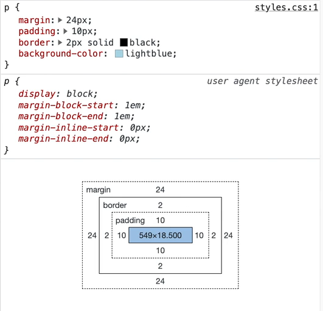

How to get to this screen^:
Chrome > Right click on page > 'Inspect'
- Reference: https://www.google.com/search?q=view+chrome+elements+styles&oq=view+chrome+elements+styles+&aqs=chrome..69i57j33i160l5j33i22i29i30l2.3456j0j7&sourceid=chrome&ie=UTF-8

Order: 
1. Content: in the middle
1. Padding: between content and the border
1. Border: 2px solid black
1. Margin: space that element says "this is minimum space between me and other elements
- minimum: the margins don't add together
    - 2 elements with 24px don't add to 48, they stay at 24
        - "Collapsing margins"
            - vertical: use the bigger margin value  
            - horizontal: add the values up 

What happens when he disables 'margin' in styles.css:
- The margin defaults back to 1em, which is what the user agent stylesheet says
    - this is the default if styles.css doesn't say otherwise


Examples:

``` css
p {
    /*Pushes the element below the 1st paragraph down */
    margin-bottom: 48px;
}
```

``` css
p {
    /*These are the same exact 2 things: */
    margin-top: 48px;
    margin-right: 24px;
    margin-bottom: 0;
    margin-left: 10px;

    margin: 48px 24px 0 10px; /*Top/right/bottom/left (clockwise) */
}
```

Margin-auto: allows the browser to make a decision
- most of the time, this defaults to 0
    - the paragraphs are nearly touching each other
    - 

``` css
/*centered*/
p {
    margin: auto;
    width: 30%
}

/* NOT centered*/
p {
    width: 30%
}

/*Common way to get a simple layout: */
p {
    margin: 24px auto;
    width: 30%
}
```

One more trick with margin: Negative margin values!

``` css
p {
    margin-left: -10px;
}
```

What negative margin values do here: 
- shifts the elements 10 pixels to the left
    - it pulls it closer
        - avoid using: can create weird effects
        

Going into the element of the word "another" that was emphasized:

``` html
<p>I'm <em>another</em> paragraph!</p>
```

``` css
element.style {
    margin: 24px;
}

em {
    font-style: italic;
}
```

See the following state:
- horizontal margin: working
- vertical margin: none

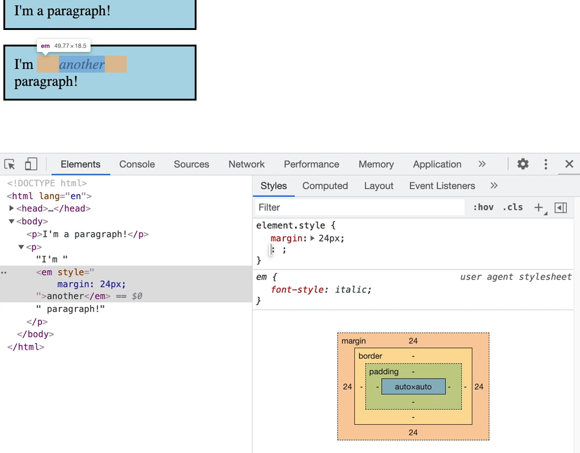

Why?

Vertical Margins have no impact on inline elements!
- this is true for padding as well


Padding

``` css
p {
    padding: 10px;
}
```

- Very similar to margin
    - Works the same way ie. has 4 values top/right/bottom/left

    - Not everything works the exact same!

        - Padding cannot do the following: 
            - Take negative values

- Difference between padding and margin:
    - 
    - "space goes inside of the border, rather than outside of the border"

- Purpose:
    - YES: Push the border closer to/farther away from the content
    - NO: Push the element away from other elements


Borders

``` css
p {
    border: 2px solid black; /*standard border all 4 sides*/
}
```

``` css
p {
    border-top: 2px solid red;
    border-bottom: 2px solid black;
    border-radius: 10px; /*adds curvature instead of sharp corners: 50% means circular shape*/
}
```


Box Model Ending Notes/Overview:
- Very powerful way to lay out our elements

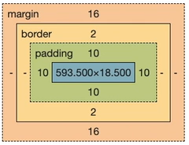

Elements of the box model:
1. Content
- The middle/actual content of our element

1. Padding
- Outside of content
- Space between the element and the border
    - Background colors WILL affect this (it affects anything inside of the border)

1. Border
- Edges of the element

1. Margin
- Space between 2 different elements
- Remember: 
    - Vertical: collapsed
    - Horizontal: add the values together


# Lesson 9: Box Sizing

*insert joke about countries/CSS both having to share border conflicts*

# Key Terms

## ```box-sizing```
A CSS property for specifying how width and height should be calculated for the selected element

- Default value: ```content-box```
    - Sets the width and height to only control the size of the content 

    - However: a value of ```border-box``` would include the size of the padding and border as well

    - Examples: 

        - An element has the following givens: 

        ``` css
        e {
            width: 100px;
            padding: 12px;
            border: 24px;
        }
        ```

        - Example 1: content-box (Default value) 
            ``` css
            box-sizing: content-box;
            ```
            - Adding this would take up a total of 172px of width
                - this includes the padding and border 2x to account for the left/right sides
                    - 100 + (2 * 12) + (2 * 24) = 172

        - Example 2: border-box 
            ``` css
            box-sizing: border-box;
            ```
            - Only 100px of width

        
Learn more: https://developer.mozilla.org/en-US/docs/Web/CSS/box-sizing

# Notes from the video:

Example Output: 

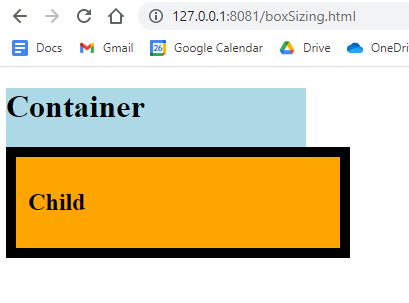

CSS Code: 

``` css
#container {
    width: 300px;
    background-color: lightblue;
}

#child {
    width: 100%;
    border: 10px solid black;
    padding: 12px;
    background-color: orange;
}
```

What is happening: 
- "Child" is overflowing because it is not accounted for in the width

- Remedy:

    - Box sizing property!

        - This makes width 100% contain the padding/border

            - 100% for width: width of 300px - padding - border

        ``` css
        * {
            box-sizing: border-box;
        }
        ```

        - 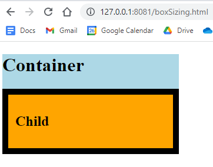


Ending Note: If you are joining an existing project, check to see if they use border-box or content-box!


# Lesson 10: Position

Commonly known as one of the following:
- "why doesn't this work" 
- "I hate CSS"
- "I need a drink"

# Key Term

## ```position```
A CSS property for setting how the browser should position an element in the document

- Default value: `static`

- Can take a variety of values: 

    - `static`: The element follows the flow of the document  

    - `fixed`: The element is positioned relative to the viewport and is removed from the normal flow of the document
        - `top`, `right`, `bottom`, `left`, properties can be used to move the element

    - `relative`: The element is positioned in the same place as it would be with `static`
        - Can use these to reposition it: `top`, `right`, `bottom`, `left`

    - `sticky`: The element will act similar to a `relative` positioned element, but once it scrolls off screen it will stay fixed to the screen
        - Essentially acting as `position: fixed`
        - This is particularly useful for menu bars (think how the menu bar should 'stick' to the top of the screen, no matter where the user scrolls)

    - `absolute`: By default, the element acts the same as `fixed`, except the element will be positioned relative to the document (instead of the viewport)

        - What this means: 

            - as the page is scrolled, it will move with the page (rather than staying at the same viewport location)

            - however, if any *ancestor* has a position value other than `static`, then it will be positioned relative to that nearest positioned ancestor

                - ancestor: "An element that contains (at any level) other elements is an ancestor of the elements that it contains."

Learn more: https://developer.mozilla.org/en-US/docs/Web/CSS/position

# Notes from the video: 


CSS Positioning

Example Output: 


CSS Code: 

``` css
p {
    font-size: 1.75rem;
    margin: 1.5rem;
    padding: 1rem;
    border: 2px solid black;
}

body > p {
    background-color: lightblue;
}

#box {
    width: 15rem;
    height: 10rem;
    border: 2px solid black;
    background-color: lightgreen;
}

#long {
    background-color: lightyellow;
}
```

What is happening in the CSS Code: 

1. Setting up basic paragraph styling

1. Selector for body of first paragraph

1. Set width/height/border of Box

1. Set background of long paragraph


All of the elements on the page are 'static' positioned right now
- default, everything scrolls normally

---
Options besides static/default: 

- `fixed`: Puts the element in 1 fixed location

    - Typically avoid this setting, there are better options!

    ``` css
    #box {
        position: fixed;
        top: 10px;
    }
    ```

- These settings will have the green box 10 pixels from the top, even when you scroll down:

    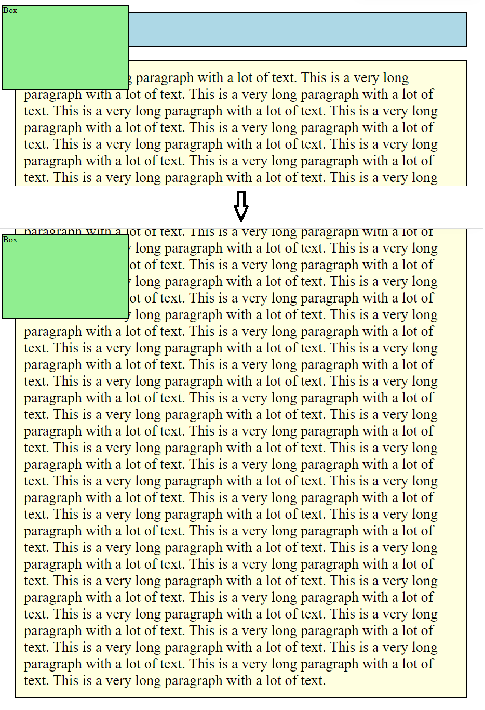

- More examples: 

    ``` css
    #box {
        bottom: 10px; /*Will be stuck to the bottom*/
    }
    ```

    ``` css
    #box {
        left: 100px; /*Will be 100px from the left side*/
    }
    ```

- `relative`: Stick the element where it would have been normally, but then offset using top/left 
    - Simple/easy to use

    ``` css
    #box {
        position: relative;
        top: 5px;
        left: 100px;
    }
    ```

- `sticky`: Mixture between relative/fixed
    - My words: "Starts relative, becomes fixed"
    - The idea here is to keep the element where it was at the start

    ``` css
    #box {
        position: sticky;
        top: 1px;
    }
    ```

    - Great for things you always want access to: 
        - Navigation bars
        - 

    - Beware: You don't want it to block things below it on the page
        - Some older browsers also don't support `sticky`

- `absolute`: Very similar to position `fixed`
    - Difference: When you scroll, it will stay where it was on the page
        - Absolute to: where it is on the page of the document 
        - Not Absolute to: Browser window 

    - This is not always the case!
        - If the parent of (or anything above) an `absolute` element, will instead be absolute to that parent item

        - Example: 

        ``` css
        section {
            position: relative;
        }

        #box {
            position: absolute;
            top: 0px;
            left: 100px;
            
        }
        ```

        - Notice how it is now 0 pixels from the top and 100 pixels from the left of this new section ie. the top of the long paragraph:

            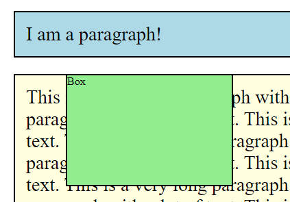

            - Not from the spot it was on the page before, which in this case using `fixed` had it 0/100 from the top/left of the entire webpage:

                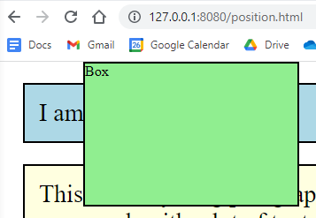

                - (Remember: The Green Box is inside of a `section`)

        - Next Question... What if you want the element to not be on top of the elements, like this here where the green box is on top of the long paragraph?

            - Answer: z-index

            ``` css
            long {
                z-index: 2;
            }
            ```

            - What this does: 

                - When you save, nothing happens (stacking context: we need to create a new one when we use z-index)

                ``` css
                long {
                    position: relative;
                    z-index: 2;
                }
                ```

                - Doing this will lead to the green box now being behind the long paragraph: 

                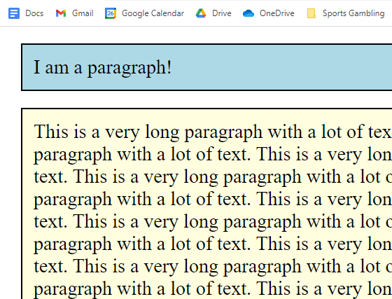

                - For proof, bump up the green box by 10 pixels so that we can now see it: 

                ``` css
                #box {
                    top: -10px;
                }
                ```
                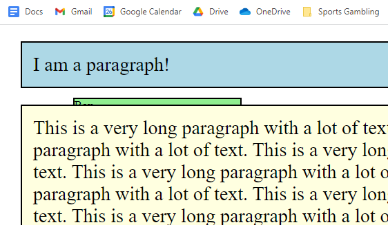

            - Note: z-index sets the order

                - "Z-indexes compete with each other"

            - Examples:

            1. Box on top
            ``` css
            #long {
                z-index: 2;
            }

            #box {
                z-index: 3;
            }
            ```

            1. Long paragraph on top
            ``` css
            #long {
                z-index: 4;
            }

            #box {
                z-index: 3;
            }
            ```
     
    - One more property of note: `float`
        - Similar to position, removes elements from normal flow
        - Allows elements to flow around other elements
            - Very powerful, can do it with multiple items

        - What float does:
            - Take this element and push it to one side of the container (left in the upcoming example)
            - Allow the elements below it to wrap around it wherever there is empty space on the other side

        - Example: The paragraph will now wrap around the box

        ``` css
        #box {
            float: left;
        }
        ```
        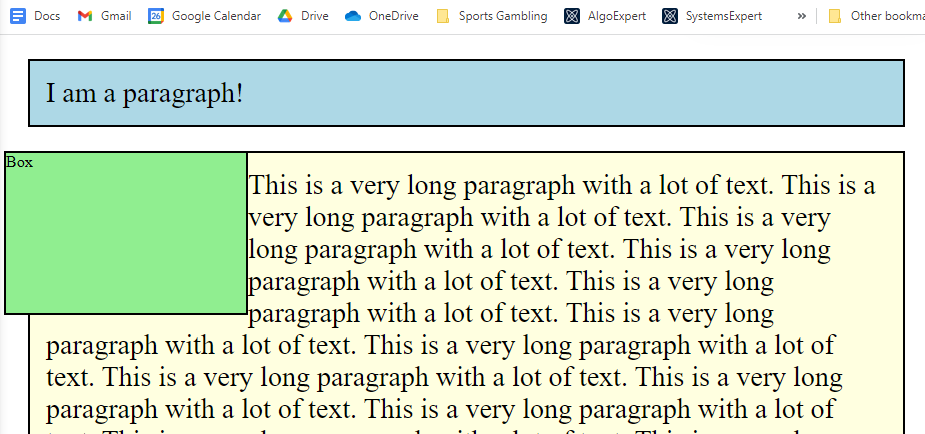
        ``` css
        /*Also, ensure these settings too since we are not using position OR z-index rn: */
        section {
            /*position: relative;*/
        }
        #box {
            /*position: absolute;*/
            /*z-index: 3;*/
        }

        #long {
            /*position: relative;*/
            /*z-index: 4;*/
        }
        ```

        - Sometimes you need not all of the elements to listen/pay attention to float: `clear`
            - "I just want to go below what is floating on the left and the right"
                - To clear the left, you also have to clear the right one

        ``` css
        #long {
            clear: both; /**/
            clear: both; /*Go below item that is floating right*/
        }
        ```

Takeaways/Closing thoughts
- Try to use position sparingly
    - Especially avoid fixed/absolute 
    
    
# Lesson 11: Stacking Contexts

CSS goes 3D!

(This video is about how Z-index actually works in CSS)

# Key Term

## Stacking Context
A group of elements positioned together on the z-axis
- Stacking Contexts can be nested within other Stacking Contexts
- `z-index` values are used to determine the layering/ordering of elements
    - Only elements with the same *stacking context parent*

Learn more: https://developer.mozilla.org/en-US/docs/Web/CSS/CSS_positioned_layout/Understanding_z-index/Stacking_context

# Notes from the video: 

Example Output: 

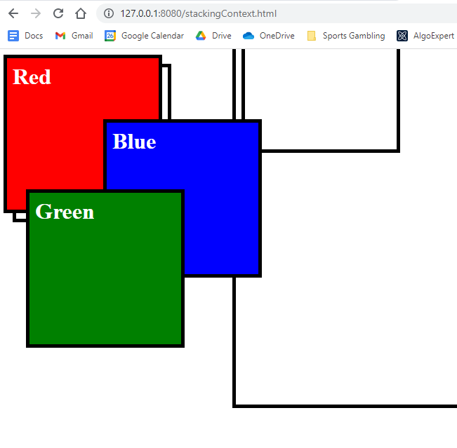

CSS Code: 

``` css
/*Boxes*/
#red {
    z-index: 1;
    background-color: red;
}

#blue {
    z-index: 2;
    top: 100px;
    left: 150px;
    background-color: blue;
}

#green {
    z-index: 3;
    top: 200px;
    left: 40px;
    background-color: green;
}

/*Basic Properties*/
div {
    position: fixed;
    width: 200px;
    height: 200px;
    border: 5px solid black;
    padding: 0.5rem;
    color: white;
    font-size: 2rem;
    font-weight: bold;
}
```

Current State:
- Z index is in order visually (everything is stacked)

- The `position: fixed` argument for `div` is what has created the stacking context
    - There are other ways to create the stacking context

    - Other examples of creating stacking context: 
        - `position: sticky`
        - `position: relative`
        - `transform` 


Stacking Context
- Grouping of elements on the Z-axis
    - In the example above, each is acting as its own stacking context
        - Each value is position fixed
        - "How high up in the z-axis is this stacking context?"
            - When each element has its own stacking context, the 1-2-3 makes sense 

            - What happens if we create a stacking context for the section? ie. 

            ``` css
            section {
                position: fixed;
                z-index: 4;
            }
            ```

            - Answer: Green gets pushed to the back/bottom

                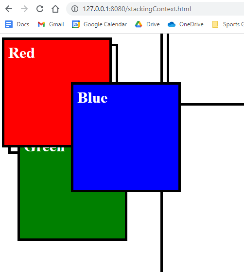

            - Shouldn't green be ahead since it has z-axis 1 and red/blue have 2/3?

                - This part of the .html explains: 

                ``` html
                <section>
                    <div id="red">Red</div>
                    <div id="blue">Blue</div>
                </section>
                <div id="green">Green</div>
                ```

                - This entire `section` is a stacking context
                    - Remember: position is fixed right now

                - Outside of `section` ie. Green is a completely different stacking context 
                    - This is a sibling stacking contexts
                        - This is because they are on the same level (root level) within the stacking context ie. highest level besides the base document's stacking context

            - Back to the example...

            - `section`:  z-index of 4 
                - It will be above anything that has a value less than 4

            - `#green`:  z-index of 3
                - It will be below anything that has a value of 4 or greater 

        - Moral of the story: `#red` and `#blue` have z-index of less than 3, but because they are inside of `section` (which has z-index of 4), they are 

            - `#red` and `#blue` are compared to each other WITHIN their stacking context parent (`section`)
                - This is also why Blue is on top of Red! (2 > 1)

                

            - What happens if we change the z-index of blue to -1?

            ``` css
            #blue {
                z-index: -1;
            }
            ```

                - Answer: Blue is now behind red 
                
                    - Note: Still ahead of green, since Blue's parent (`section`) is still ahead of Green (4 > 3)

                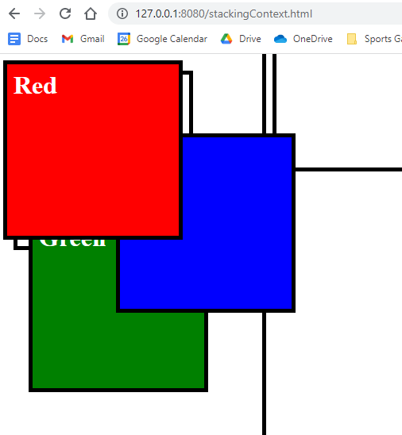
            
Ending Notes on Stacking Context
- Tons of ways to create a stacking context
    - If you are running into bugs, you might have more/less stacking contexts than you are currently aware of!


# Lesson 12: Flexbox

Commonly known as the following: 
- "I can finally position things"
- "CSS ain't so bad"
- "wow, I haven't punched my monitor today"

# Key Term

## Flexbox
A layout model particularly useful for building responsive designs with row/column layouts 
- Also known as "Flexible Box Layout Module" 

- An element can be made a *flex container* with this `display: flex`
    - All of its children will automatically be laid out as *flex items*

- For flex containers, these are some of the common properties used to layout their flex items: 

    - flex-direction: Determines which direction is the *main-axis*, either `row` or `column`

        - Additionally, `row-reverse` and `column-reverse` can be used to reverse the order of flex items

    - justify-content: Determines how elements are positioned along the *main-axis*

        - Possible values: 
            - `flex-start`
            - `flex-end`
            - `center`
            - `space-around`
            - `space-between`
            - `space-evenly`

    - align-items: Determines how elements are positioned along the cross-axis (the one selected by `flex-direction`)

        - Possible values: 
            - `flex-start`
            - `flex-end`
            - `center`
            - `baseline`
            - `stretch`

    - flex-wrap: Determines if flex items can wrap to new lines

        - Possible values: 
            - `wrap`
            - `nowrap`
            - `wrap-reverse`
                - used to wrap flex items with the lines in reverse order

    - align-content: Determines how lines are positioned along the cross-axis when flex items are wrapping on multiple lines

        - Possible values: 
            - `flex-start`
            - `flex-end`
            - `center`
            - `space-around`
            - `space-between`
            - `stretch`

    - flex-flow: A shorthand for `flex-direction` and `flex-wrap`
            
    - gap: Determines the amount of space between flex items
        - This can take 1 or 2 length values
            - If given 2, they will be treated as a row gap and a column gap, respectively 

            - Alternatively, a `row-gap` and `column-gap` property can be specified to individually set the gap between rows/columns

- For flex items, these are some of the common properties to position themsevles:

    - align-self: Overrides the `align-items` value used for the flex container

    - flex-basis: Sets the initial size of the flex item along the main-axis 
        - (essentially this will act as width for the row axis and height for the column axis)

    - flex-grow: Determines if the flex item is able to grow into extra space
        - If value is 0: Flex item will not grow
        - If value is NOT 0: Flex item will take up as much extra space as possible
            - The higher the value, the more the flex item will grow and take up more space

        - Example: 

            - Item A has a value of 1
            - Item B has a value of 2
                - Item B will take up 2x as much extra sapce 
                    - Note: This does not mean it will be 2x as large - Only that it will take up 2x the extra space!

    - flex-shrink: Determines if a flex item is able to shrink in the case that the flex items are too large for the container 
        - If value is 0: Flex item will not shrink
        - If value is NOT 0: Flex item will shrink as small as possible
            - The higher the value, the more the flex item can potentially shrink 

    - flex: Shorthand property for `flex-grow`, `flex-shrink` and `flex-basis` (in that order)

    - order: Moves the flex-item to a different location amongst the other flex items, rather than using the order defined in the DOM

        - All flex items default to having a value of 0

        - If value is -1: Would move an item before all other items that have not changed their order

        - If value is 1: Would place item at the end    

Learn more: https://developer.mozilla.org/en-US/docs/Web/CSS/CSS_Flexible_Box_Layout

# Notes from the video: 

Flexbox
- Layout system for building responsive websites
    - "Allows us to build websites that will re-size based on the size of the window"
    - Creates a great user experience, regardless of the screen sizes!

Example Output: 

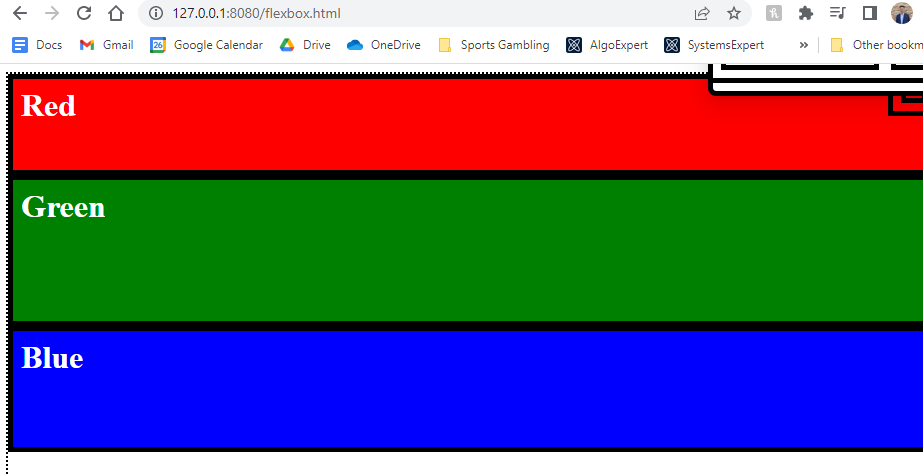

CSS Code: 

``` css
section {
    height: 90vh;
    border: 2px dotted black;
}

.red {
    height: 75px;
    background-color: red;
}

.green {
    height: 125px;
    background-color: green;
}

.blue {
    height: 100px;
    background-color: blue;
}

/*Generic Styling*/
div {
    border: 5px solid black;
    padding: 0.5rem;
    color: white;
    font-size: 2rem;
    font-weight: bold;
}
```

What is going on in this example: 

- 

Getting into the actual Flexbox

What Flexbox is:

- Allows us to do the following:

    - Define a flexbox container: Whatever you set to `display: flex` becomes the flexbox container

        - The items inside of it are now flex items

- Example: 

    - Flexbox container: `section`

        - This would make all 3 `div` items in `section` become flex items, changing the way they will be laid out on the page: 

        ``` css
        section {
            display: flex;
        }
        ```
        
        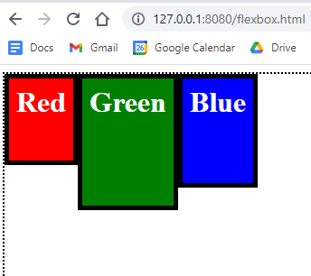
        
        - All of the div's will now be on 1 line instead of stretching out the entire page, the stretch the width of their content

            - This is a default property of flexbox


        - Note: This only affects direct children of `section`

            - Nested items are not flex items themselves


Properties of flexbox: 

- `flex-direction`: 

    - `flex-direction: row`: Put all flex items horizontally (in a row)
        - main axis = horizontal
        - cross axis = vertical
    
    - `flex-direction: column`: Stack the flex items vertically (on top of each other)
        - main axis = vertical
        - cross axis = horizontal

    - `flex-direction: row-reverse`: Put all flex items horizontally (reverse order, throws everything to the right)

        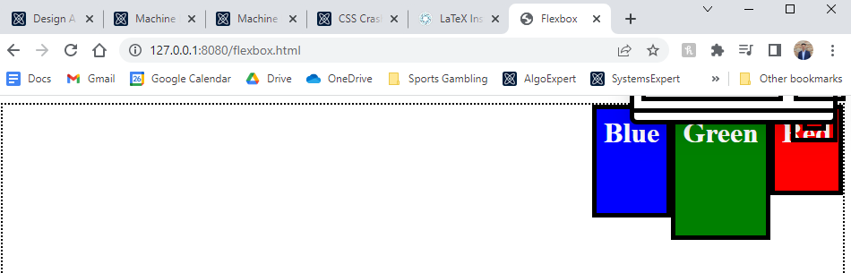

    - `flex-direction: column-reverse`: Stack the flex items vertically (reverse order, throws everything to the bottom)

        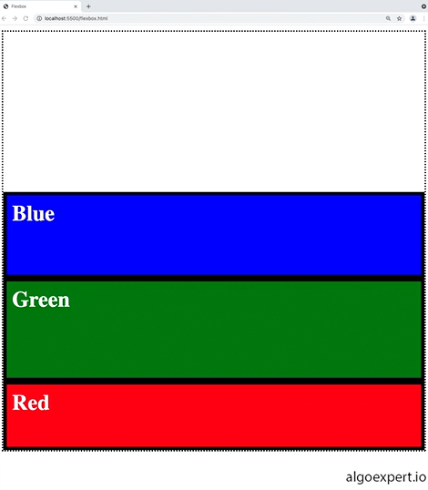


- `justify-content`: Changes how the items are ordered/presented

    - `justify-content: flex-start`: Put everything at the start of the main axis

    - `justify-content: flex-end`: Put everything at the end of the main axis

    - `justify-content: space-around`: Evenly space out the elements

        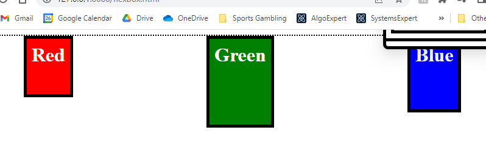

    - `justify-content: space-between`: Same as space-around, except doesn't put space around the elements (they get pushed all the way to the edge)

        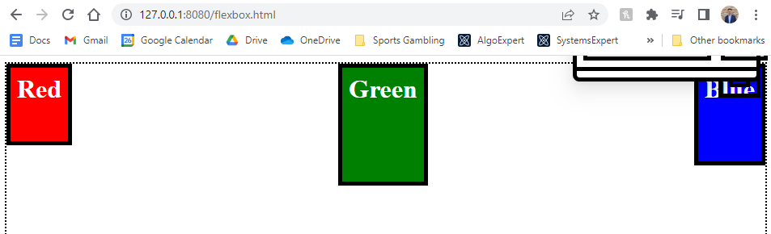

    - Combining properties:

        ``` css
        section {
            display: flex;
            flex-direction: row-reverse;
            justify-content: flex-end;
        }
        ```

        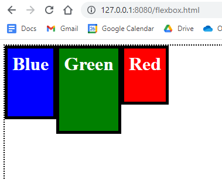


- `align-items`: Just like `justify-content`, but for the cross-axis

    - `align-items: flex-end`: Goes to the end of the cross axis

    - `align-items: flex-end`: Goes to the center

        - Example of easy way to center all direct children: 

        ``` css
        section {
            display: flex;
            flex-direction: row;
            justify-content: center;
            align-items: center;
        }
        ```

        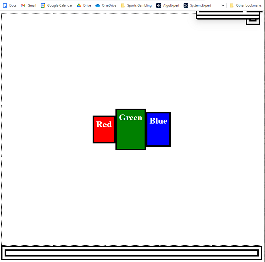

        - There is no space between these items though... here's how to fix that!

- `gap`: Flexbox's version of margin, good way to get even spacing between items

    - It lets you choose the gap between items (instead of setting them all individually)

    - `gap: 10px`: Puts 10 pixels between each flex item in the container

        ``` css
        section {
            display: flex;
            flex-direction: row;
            justify-content: center;
            align-items: center;

            gap: 10px; /**/
        }
        ```

        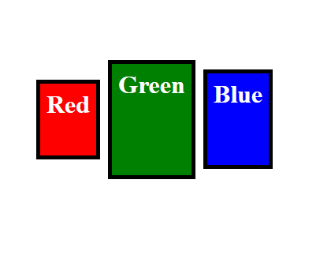


Examples with more than 3 flex items: 

Note: We changed the HTML's Body: 

``` html
<body>
    <section>
        <div class="red">Red</div>
        <div class="green">Green</div>
        <div class="blue">Blue</div>   
    </section>
</body>
```

=> 

``` html
<body>
    <section>
        <div class="red">Red</div>
        <div class="green">Green</div>
        <div class="blue">Blue</div>
        <div class="red">Red</div>
        <div class="green">Green</div>
        <div class="blue">Blue</div>
        <div class="red">Red</div>
        <div class="green">Green</div>
        <div class="blue">Blue</div>  
    </section>
</body>
```
    
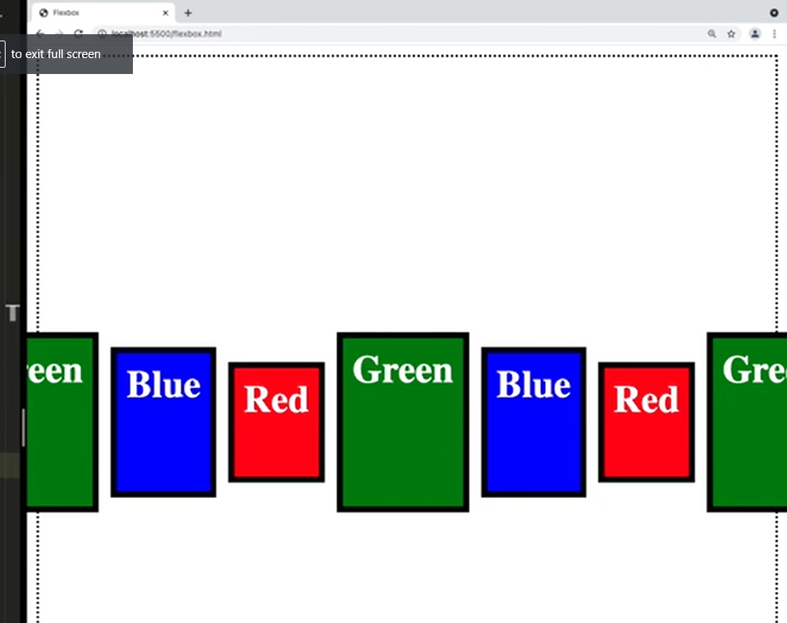

- We have to scroll to see everything

    - Overflow from flex container!

    - How do we fix this? 


- `flex-wrap`: Changes how the values wrap around when overflowing

    - `flex-wrap: nowrap`: Default value, this is how we see it right now where the values are overflowing
        - Not ideal!

    - `flex-wrap: wrap`: Goes to a new line when you run out of space

    - `flex-wrap: wrap-reverse`: Similar to `row-reverse`, you still get a wrap effect, just in reverse order

        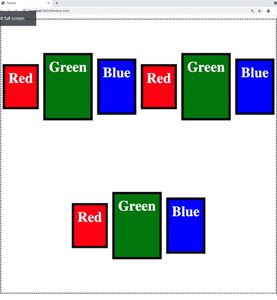


- `flex-flow`: Lets you use flex-direction/flex-wrap in the same call

- Example: These are equivalent, just shorter syntax:

    ``` css
    section {
        flex-direction: row;
        flex-wrap: wrap;
    }
    ```

    ``` css
    section {
        /*flex-direction: row;
        flex-wrap: wrap;*/
        flex-flow: row wrap;
    }
    ```

Now that we have multiple rows, we need to have a way to choose how close the rows will be together!

- We used `align-items` for this; but, when we have a `flex-wrap`, only align items wtihin their individual rows: 

    - See how the are pushed to the top of their rows with this code: 

    ``` css
    section {
        display: flex;
        flex-flow: row wrap;
        justify-content: center; 

        justify-content: center;
        align-items: flex-start;
    }
    ```

    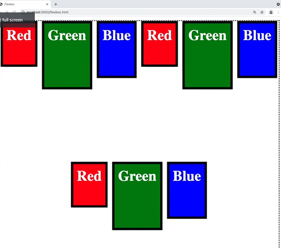

    - How to fix this?


- `align-content`: Allows you to have more control over where the rows go

    - `align-content: center`: Puts rows all the way in the center

    - `align-content: space-between`: Same as before

    - `align-content: space-around`: Same as before


That is pretty much all for flex container!


Properties for How to change how a single flex item is aligning in the group:
(Let's use the red class as an example)

- `order`: Where in the order do we want this item to be

    - `order: 0`: Default value, everything stays as-is (Everything is in the order set in .html/the DOM)

    - `order: -1` Pushes all values to the beginning of the order

    ``` css
    .red {
        order: -1;
    }
    ```

    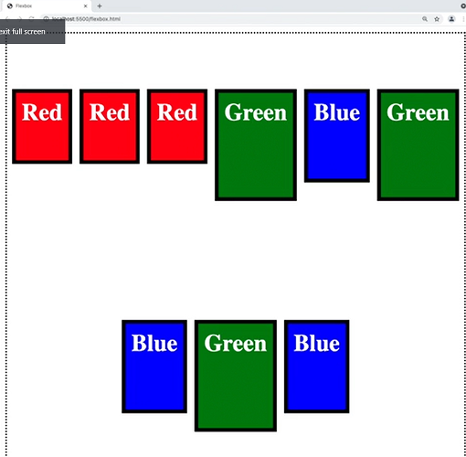

    - `order: 1` Pushes all values to the end of the order

    ``` css
    .red {
        order: 1;
    }
    ```

    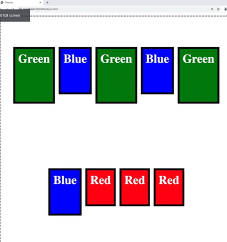


- `flex-grow`: If there is extra space, how much of it should this element take up?

    - `flex-grow: 0`: Default value, everything stays as-is (nothing will take up extra space!)

    - `flex-grow: 1`: When there is extra space, this element will take up as much extra space as possible

        - Look at how the red element steals all of the space in the bottom row (where there was lots of extra space):

        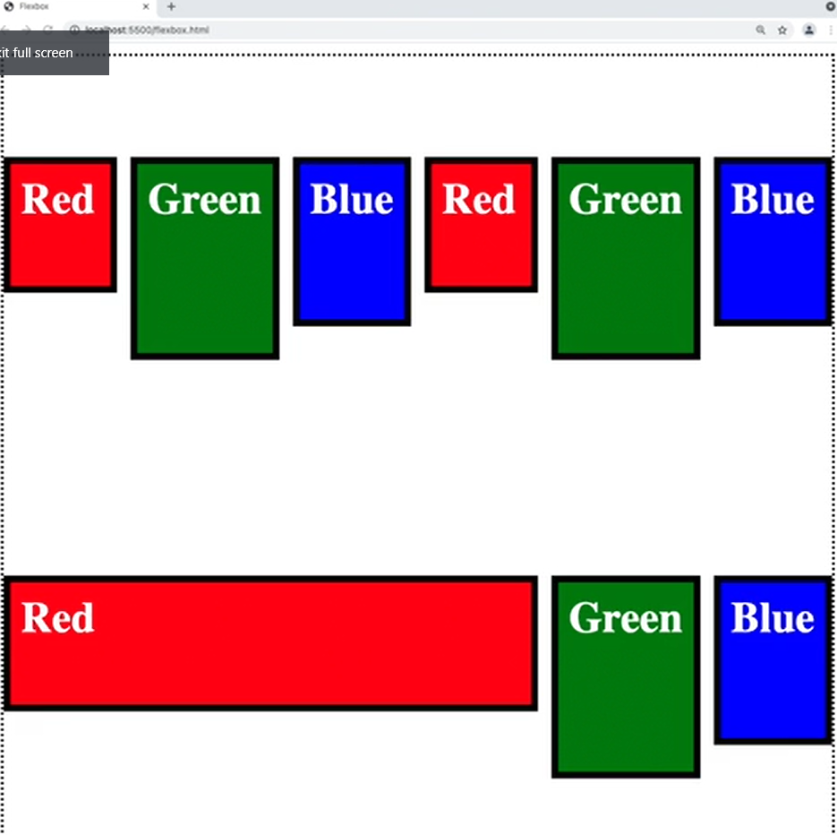

        - Note: On the 1st line, there is no extra space to take up, so nothing changes

        - These values are proportions, as seen in the following code example with red AND green having values of >= 1:

        ``` css
        .red {
            flex-grow: 1;
        }

        .green {
            flex-grow: 2;
        }
        ```

        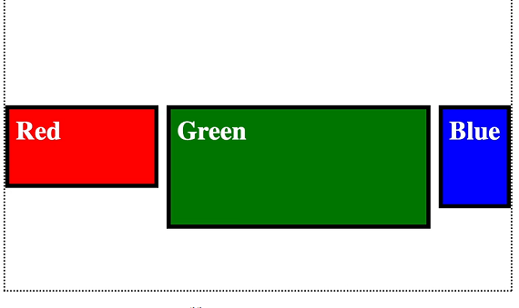

        - Notice how green takes up 2x as much space than red, and blue still takes up 0!
    

- `flex-shrink`: Whether or not this element is able to/allowed to shrink

    - `flex-grow: 1`: Default value, It is allowed to shrink!

    ``` css
    .green {
        width: 100vw;
        flex-shrink: 1;
    }
    ```

    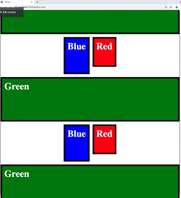

    - Notice how green is not taking up 100vw, it is just taking up the size of the parent/container

    - `flex-grow: 0`: This element CANNOT shrink.

    ``` css
    .green {
        width: 100vw;
        flex-shrink: 0;
    }
    ```

    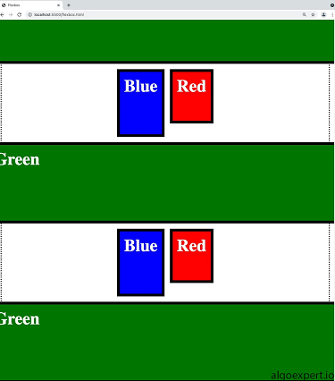

    - Notice how green is now overflowing out of the container!


- `flex-basis`: This is however much space I want to take up, in whatever the main axis direction is

- Examples: 

    - Green elements getting 100vw in height:

    ``` css
    section {
        display: flex;
        flex-flow: column wrap;
    }


    .green {
        flex-basis: 100vw;
        flex-shrink: 0;
    }
    ```

    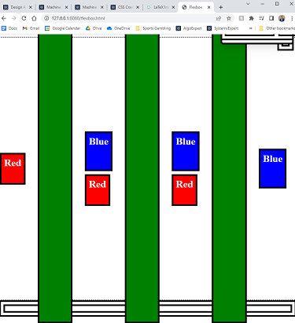

    - Note: If we move `flex-shrink` back to 1, they will go back to simply filling up the entire space: 

        - (It is less than their flex-basis width)

    ``` css
    .green {
        flex-shrink 1;
    }
    ```

    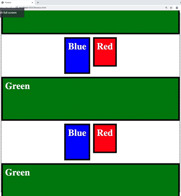


- `flex`: Short hand for flex-grow, flex-shrink, and flex-basis

- Example: These are equivalent, just shorter syntax:

    ``` css
    section {
        flex-grow: 1;
        flex-shrink: 0;
        flex-basis: 200px;
    }
    ```

    ``` css
    section {
        /*flex-grow: 1;
        flex-shrink: 0;
        flex-basis: 200px;*/
        flex 1 0 200px;
    }
    ```

    - Explanation: 

        - `flex-grow: 1`: Allow the green elements to grow, if there is extra space

        - `flex-shrink: 0`: The green elements cannot shrink down to a smaller size than their `flex-basis`
        
        - `flex-basis: 200px`: This is the smallest size the green elements can be 

            - Since there are more than `200px` of space in each row, see how the green elements grow beyond that

            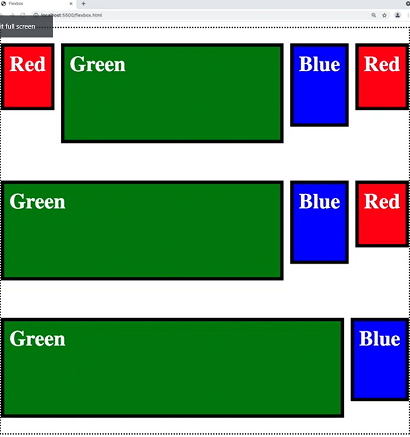

        - What happens if `flex-basis` is `2000px`?

            - "I have a base size of 2000 pixels, I can grow if there is more space than that, and I am not allowed to shrink"

            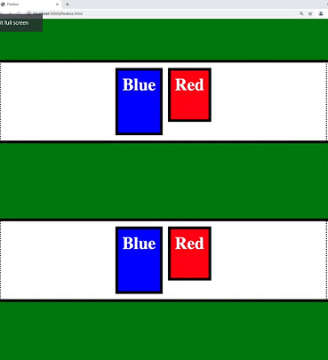

        - What happens if `flex-shrink` is `1`?

            - "This can shrink, and now the green elements will shrink back down to the size of the container"

            


That is all of the flexbox properties that you need to know!

Takeaways: 
- A bit of a learning curve to thinking in flexbox
    - Which elements need to be `flex containers`?
    - Which elements need to be `flex items`?
    - Which `flex properties` do we need to set to get elements to lay out exactly how we want them to?
    
- All in all, super intuitive way to lay out pages
    - Everything will grow and flex 
    - Great way to get responsive websites
    - Sizes change depending on space on the screen

# Lesson 13: CSS Grid

Grid Layout
- "I have complete positional mastery over any 2-D space"
- "CSS is actually awesome"
- "so this is what true happiness feels like."

# Key Term

## CSS Grid
A layout model used for creating responsive layouts of multiple rows and columns

- An element can be made a *grid container* with `display: grid`

    - All of its direct children will automatically be laid out as *grid items* in a single *cell*

- *grid area*: Rectangular sub-section of a grid

- *grid lines*: The dividers between each row and column

- *tracks*: The rows/columns created by *grid area* and *grid lines*


Common Properties for grid containers, used to layout their grid items: 

- `grid-template-columns`: Determines the number of columns and their sizes

    - The unit `fr` can be used as a fractional unit here to create a responsive design

- `grid-template-rows`: Determines the number of rows and their sizes

    - The unit `fr` can be used as a fractional unit here to create a responsive design

- `grid-template-areas`: Creates names for grid areas that grid items can place themselves in 

- `justify-content`: Determines how grid tracks are aligned along the `inline-axis` (row)

- Possible values: 
    - `start`
    - `end`
    - `center`
    - `space-around`
    - `space-between`
    - `space-evenly`

- `align-content`: Determines how grid tracks are aligned along the `block-axis` (column) 

- Possible values: 
    - `start`
    - `end`
    - `center`
    - `space-around`
    - `space-between`
    - `space-evenly`

- `align-items`: Determines how grid items are aligned in columns (ie. the *block-axis*) 

- Possible values: 
    - `start`
    - `end`
    - `center`
    - `stretch`

- `justify-items`: Determines how grid items are aligned in rows (ie. the *inline-axis*) 

- Possible values: 
    - `start`
    - `end`
    - `center`
    - `stretch`

- `place-items`: A shorthand for both `align-items` and `justify-items` 
    - 1 value provided: applies to both
    - 2 values provided: applies to `align-items`, then `justify-items`

- `gap`: Determines the amount of space between grid items
    - 1 length value provided: Can use `row-gap` or `column-gap`
    - 2 length value provided: Row gap, column gap (respectively) 


For grid items, these are some of the most common properties used to position themsevles: 

- `grid-column-start`: Determines what column this item starts on (Based on a line number)

- `grid-column-end`: Determines what column this item end on (Based on a line number)

- `grid-column`: Shorthand for both `grid-column-start` and `grid-column-end`
    - Specified in the format `start / end`

- `grid-row-start`: Determines what row this items starts on (Based on a line number)

- `grid-row-end`: Determines what row this items ends on (Based on a line number)

- `grid-row`: Shorthand for both `grid-row-start` and `grid-row-end`
    - Specified in the format `start / end`

- `grid-area`: Places the item in a grid-area based on a name created in `grid-template-areas`

- `align-self`: Overrides the `align-items` value used for the grid container

- `justify-self`: Overrides the `justify-items` value used for the grid container

- `place-self`: Shorthand for both `align-self` and `justify-self`
    - In the same format as `place-items`

Learn more: https://developer.mozilla.org/en-US/docs/Web/CSS/CSS_Grid_Layout

# Notes from the video: 


    
    


    

    

    


