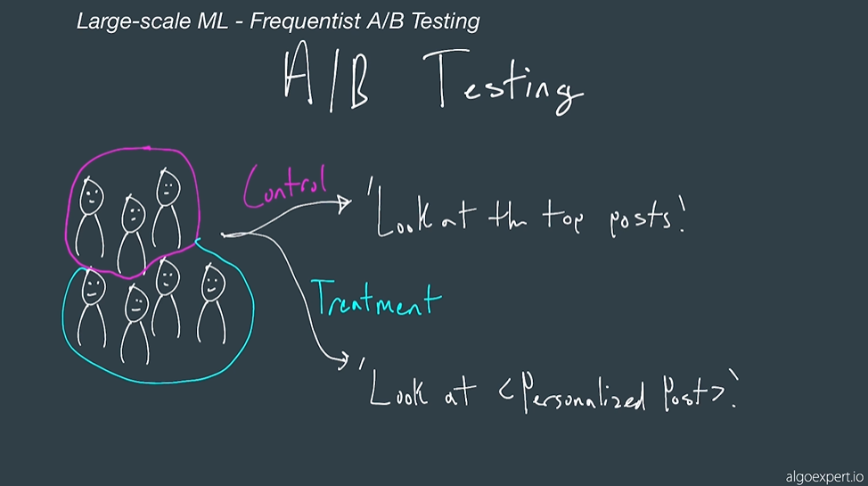
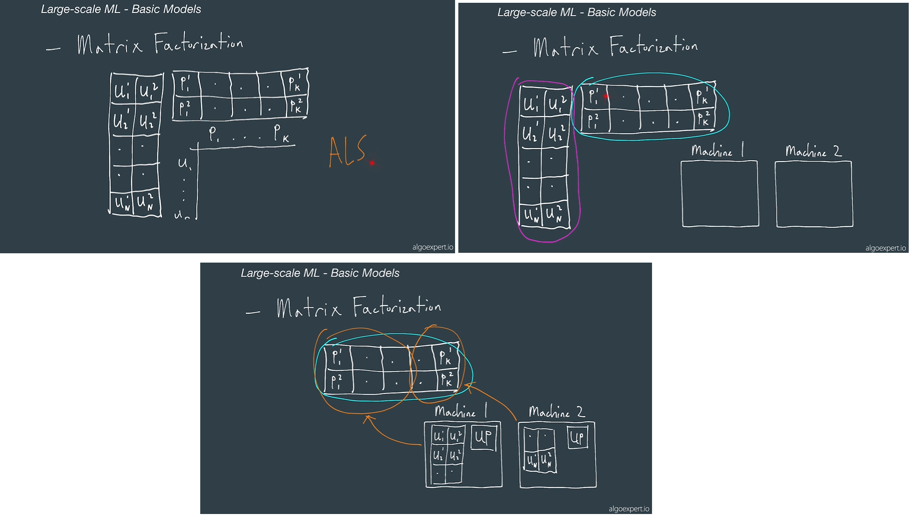
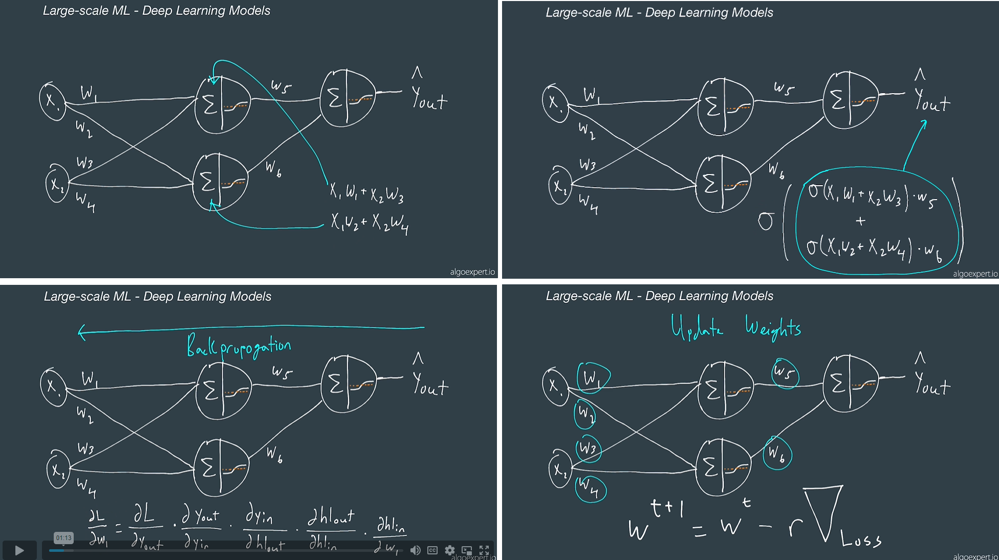
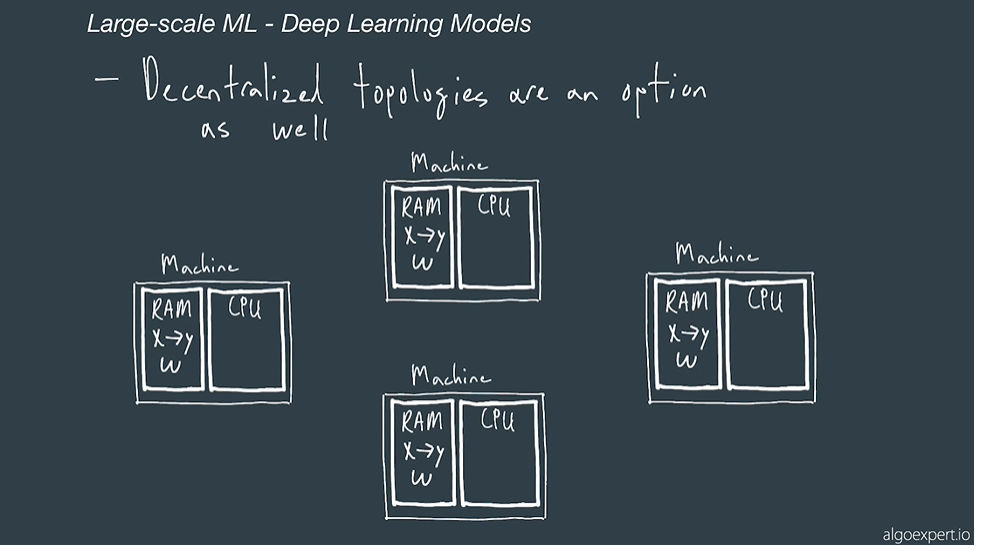

# MLExpert Notes
# Myles Thomas
# 6/12/2023
# algoexpert.io
---
![alt text for screen readers]

---

# Section 0 - Introduction

# Lesson 1: Introduction

Purpose of this course
- Learn practical applications of the field
- Learn the tools to design complex systems for enterprise-level companies 

# Key Terms

None

# Notes from the video

Integrating the models we learned in the ML Crash Course requires MANY more considerations

1. We usually don't have neatly laid out data/features to train on 
- Need processes to extract relevant features from raw data
2. We will be training models with 100's of millions of rows of data
- Some models will have billions of parameters
    - Need to be able to deal with models of this scale
3. The goal of the models is to impact businesses in a positive way + we need confidence that it can do so / create value
- Need tools to measure the value we are creating
4. Need to serve 10's of 1000's of requests per second
- Optimize for scalability and execution speed


# Section 1 - Data Support 


# Lesson 2: Data Ingestion

In order to do anything with an ML system, we have to feed it inputs. In this video:
- Look at technologies you can use to ingest data into your systems
- Review some considerations you can make throughout the process

# Key Terms

## Clickstream
An ordered series of interactions that users have with some interface
- Traditional sense: This can be literal clicks of the mouse on a desktop browser
    - Interactions can also come from touchscreens + conversational user interfaces

## Change Data Capture
The process of recording changes in the data within a database system.
- For instance: If a user cancels their Netflix subscription, then the row in some table will change to indicate that they're no longer a subscriber
    - The change in this row can be recorded and referenced later for analysis/audit purposes

## Apache Kafka
An open source software platform which provides a way to handle real-time data streaming

## Amazon Kinesis
An AWS product that provides a way to handle real-time data streaming

## Zookeeper
A service designed reliably coordinate distributed systems, examples:
- Naming service
- Configuration management
- Data synchronization
- Leader election
- Message queuing
- Notification systems

## Database
A Tool used to collect and organize data
- Typically: Database management systems allow users to interact with the database

## OLTP 
Online transaction processing. A system that handles (near) real-time business processes. 
- For example: A database that maintains a table of the users subscribed to Netflix, and which is then used to enable successful log-ins would be considered OLTP
    - Opposite of OLAP

## OLAP
Online analytical processing. A system that handles the analytical processes of a business:
- Reporting
- Auditing
- Business Intelligence
- For example: This may be a Hadoop cluster which maintains the user subscription history for Netflix
    - Opposite of OLTP

## Availability Zone (AZ)
Typically a single data center within a region which has 2 of more data centers.
- "multi-AZ": implies that an application/software resource is present across more than one AZ within a region
- This strategy allows the software resource to continue operating, even if a data center becomes unavailable


# Notes from the video

When we create large scale ML systems, we are going to have SOME form of ingestion.
- We want to get data into our system to do analysis, eventually ML algorithms

### Streaming Ingestion

#### Clickstream

Clickstream: Keeps track of user interactions with the interface

Examples: Mobile app, voice assistant, desktop
- Potentially millions of interactions per second! (coming from all the users)

Data ususally seen in a clickstream
- Date/time (When this click occurred)
- User-agent (What type of broswer they were using, mobile app, desktop,)
- UserID (if logged in)
- Request details (What page were they looking at/where did they click ie. get/details/`<video_id>`)
- SessionID (Helps keep track of somebody's info if they aren't logged in. keep track of their interactions: a cookie is associated with a device instead of a userID)
- IP Address (Where they are)
- Referrer (How they found our website: google, facebook, etc.)

2 Tools to go through these potentially millions of clicks per second:
1. Kafka
2. Kinesis

Note: Both of these may be referred to as 'PubSub' or Publish to Subscribe (Publishers don't send to specific receivers, but post content of certain topics that subscribers follow/subscribe to)

##### Kafka


Kafka: Open source Apache project

Creates 'Brokers'
- 'Brokers': Manage interactions between producers/consumers

    Example: Clickstream logs are sent to particular Kafka topics, where there are partitions on the broker, such that the consumers can consume from these brokers, to store these clickstream logs
    - Producer: Clickstream logs
    - Consumer: Storage 

What happens if these clickstream logs come in faster than 1 single broker can handle?

We have a 'brokered cluster':
- Every clickstream log will be sent to a particular partition
    - 1 of these brokers in the broker cluster will be assigned as leader
        - Leader makes sure that all reads/writes go through that partition, also replicates the repitition across other brokers in the broker cluster
        - Leader is elected via Leader Election w/ Zookeeper
            - Leader Election is Necessary for when the leader goes down, we need to elect a different cluster to take over as the new leader
        - Leader keeps track of different topics for each integration
            - ie. 1 topic coming from homepage, different topic coming from search page

Recap on Kafka:
- Kafka gives scalability so that we can add more an more brokers to the broker cluster
    - Allows for ability to support millions of clickstream logs/records coming in
        - To manage the brokers in this cluster, we use Zookeeper (a Zookeeper Cluster):
            - to keep track of which broker is assigned to which partition 
            - how to manage those replicas so that if a broker goes down, and another broker needs to come and take its place

##### Kinesis

![Kinesis]

Kinesis: Fully managed API service
(Another way to accomplish essentially the same thing as Kafka)
- Partitions in Kafka = Shards in Kinesis
    - Number of shards present can scale up

In our Example: Clickstream logs
In reality/in practice: They can be anything that has a streaming ingestion aspect of it
Examples:
- Web Crawler: Crawling the web, incrementally sending data to shards
- RSS Feed: Feed we listen to that gets sent to shards
- Storage: Another storage instance


### Change Data Capture

![Change Data Capture]

Change Data Capture: How we ingest changes to a database

Example: We have a database that keeps track of what User ID is subscribed to Netflix
- userID
- is_actively_subscribed, renewal_date

Modeling: Whether or not someone will renew
What variables do we care about?
- Current state (can't cancel if you are already cancelled)
- Previous state (see when they cancelled - statistics such as service usage)
Example: When did user 'x' cancel (tie to service usage before cancel)

Hypothesis: Their usages have gone down, before they decided to cancel

If we want to model this:
- Can't just look at the database that tells current state (subscribed or not)
- We need a history:
    - When did they (un)subscribe

Tool to use to get this: Change Data Capture
- Uses a log of changes to rows in a particular table
- Sends change logs to streaming tool ie. Kafka/Kinesis

Now: Producers are these different storage instances
- Any one of these storage instances can keep track of something like actively subscribed users to a service
    - Every time a row in a table is updated, we can look at the change logs associated with these databases
        - We can then, send that information to our Broker (Kafka) and our consumers can store this change in usage/actively subscribed user so that we can build a model for who will/will not renew their membership

#### OLTP vs. OLAP

OLTP: Online Transaction Processing
- Keeps track of who is currently subscribed
    - if you login, we now know to grant you certain privledges

OLAP: Online Analytical Processing
- Keeps track of WHEN you subscribed / WHEN you un-subscribed


### Live Video

![Live Video]

Live Video: Interesting video content from the following:
- Traffic cameras
- Security cameras
- Video streaming services


Example: HLS (HTTP Live Stream)
- H.264 compression
- AAC for sound
- Effectively chops MP4s up into segments, sends them out over HTTP

Producer: Surveillance Cameras
New Step: Collector
- Videos are sent to some 'collector' 
    - This layer is necessary to dis-asemble the video into a frame-by-frame representation
Broker: Kafka
Consumer: Storage 

Note: Live video could be used for a computer vision algorithm

Now that we have learned streaming ingestion, let's look at Batch Ingestion:

## Batch Ingestion


Batch Ingestion: Takes place when we want a periodic snapshot of a database

- Databases
    - Periodic 'snapshots' of the databases
    - Useful for 1st step when onboarding a new database to be ingested
        - Makes sure our storage system is up-to-date, before we start keeping track of changes

Essentially: We are dumping all data that's in the databases into the storage layer

### Considerations for Ingestion

#### Size of individual data
Examples:
- smaller: clickstream (map of a few keys and values)
- larger: entire video frames going to brokers

#### Rate at which data comes in
Examples: 
- slower: 1,000,000 records per month: subscription table
- faster: 1,000,000 records per seconds: clickstream


#### Support of data types (changing data types)
We need to make sure our brokers can handle this data!

#### High-availability (multi-AZ) + fault tolerance
If a broker goes down, another broker can seamlessly take over and save the day without losing any data

To avoid networking problems, you will want to replicate your partition data (in Kafka) across different availability zones
- Effectively: Putting brokers in different data centers across the country/world

## Example: Click Stream (Follow Along)

Defaut Configuration provides by Apache: 
- dataDir: c:/tmp/zookeeper
- clientPort=2181
- maxClientCnxns=0

Viewed these properites with this call: vim config/zookeeper.properties

Run the script 'zookeeper-server-start.sh' (Comes with this Kafka 2.11-0.10 version's installation)
- Start zookeepr server while feeding the properties file: bin/zookeeper-server-start.sh config/zookeeper.properties

Zookeeper has now started. Let's launch the Kafka broker itself: 

Call: vim config/server.properties
- has its own properties file (this is also the default when you download Kafka)

Now that we have seen the server properties, let's launch it: bin/kafka-server-start.sh config/server.properties

We have now started up our Kafka Broker. 
- In production, we would have several Zookeeper instances and Kafka instances (brokers)
    - This is a local test, so just have 1 and 1 

Finally, we need to set up a producer: 

Create a simple web-app which will have a simple click stream being produced from the web app, and have it sent to the Kafka broker to be later consumed.

Let's look at a simple server file that we have: vim server_two.py

Notes on this Python code:
- Flask is a lightweight web-framework

This is all we do in this Python code:
- Start the Flask app
- Connect the Flask app to our Kafka Broker (ie. running locally running on Port 9092)
- We have a home page with a search bar, it takes in a string/text to search for and has a submit button: 
    - On that submit button, we will call the '/search' function and forward it to the path
        - that path will form the clickstream record (named 'message')
            - This message will have the following:
                - 'request_path' ('/search')
                - 'search_term': What we searched for in the home page search bar
                - 'user_id': Here, we used a fixed value
                - 'ip_address': Here, also fixed
                - 'date': Whatever event the date took place
            
            - The message is then:
                - Printed to the console
                - Sent to the Kafka Broker (in form of Bytes)

            - The result of the search is going to be nothing, so
                - return value: "Sorry No Results Yet"

            Note: The producer sends the message to the Kafka Broker with an id='mlexpert'
            - This ID is our topic for the Pub-Sub model
                - In addition to the steps of setting up Zookeeper/Kafka Broker, you'd normally have to create your topic with another command 
                    - In our example, 'mlexpert' is alredy there for topic

Launch the server: flask run --host=0.0.0.0
- It is running on port 5000, so navigate there to see our simple page (Search term bar, submit button)
- The idea behind this all: Webpage sends a message to the Kafka broker that we set up earlier


So, how do we know the message went to/was received by the Kafka broker?
- Set up a simple Kafka Consumer, who will print results to our terminal

Call: bin/kafka-console-consumer.sh --topic mlexpert --bootstrap-server localhost:9092 --zookeeper localhost:2181
- Command that comes with Default installation of kafka: bin/kafka-console-consumer.sh
- Where the consumer will begin consuming: --topic mlexpert
- Where the Kafka broker is located: --bootstrap-server localhost:9092 
- Where the zookeeper is: --zookeeper localhost:2181

What happened?
- The webpage worked as expected, where the result said 'Sorry No Results Yet'
- In the terminal with our simple Kafka Consumer, the message was printed to the terminal
    - What this means: webpage did successfully send the message to our broker, and we had a consumer consume the clickstream record
    
In reality/practice: Millions of these could be sent per second!
- This was just a simple example

## Video Takeaways

We went over Streaming Ingestion Process:
- Clickstream
- Change Data Capture
- Live Video
More:
- Batch Ingestion
    - Incorporates the entirety of the database (not just the changes associated to them!)


# Lesson 2 - Data Storage

If you've gone through the Systems Design Fundamentals (I have), then you know how important having a high-performing storage model is to any system
- Guess what? computationally-expensive ML systems are certainly no exception!

## Hard Disk Drive (HDD)
A storage device which operates by setting bits on a spinning magnetic disk
- The capacity and read/write performance of the HDD are the main characteristics to consider when using an HDD within a system

## Data Replication
A strategy used to mitigate the potential of data loss in the event of a system or compononet failure
- Most basic form: Writing identical data to more than 1 device/location
- More efficient techniques include:
    - Erasure coding: Incorporates mathematics to recover lost data without referring to an explicit copy of the data

## Hadoop Distributed File System (HDFS)
An open source Apache Software product which provides a distributed storage framework

## Avro
A row-oriented data serializer provided by Apache

## Parquet 
A column-oriented data storage format provided by Apache

## Exactly-once Semantics
Guarantees that an object within a distributed system is processed exactly once

Other semantics include:
- Maybe
- At least once
- At most once 


# Notes from the video


Data Storage
- Going over what this storage layer above actually is!
    - We didn't go over the consumers in any detail besides calling them storage, time to dive into that now


Example: 1 Single computer machine
- Computer has 4 HDD's/Hard Disk Drives
- 100mb/s per HDD (How fast we can read and store data, per drive)
- Reading 1TB of data would take 40 minutes
    - Distributed 4 ways so that each gets 25% of the work

    If we did this to parallize the process...
    - Would take 40 minutes
    - Just 1 host, so no replication
        - If anything happens to your host, your data is gone!
        - If anythign happens to each of these individual drives, you lose roughly 25% of the data

Another example with better setup: 10 Machines
- Each computer still has 4 HDD's and they work at 100 mb/s, so the process would take about 15 minutes since each machine takes on 0.1TB
    - We had to distribute the data across more than 1 host in order to get this speed-up

- Another thing we can do since we have 2+ hosts: Replicate the data across the same cluster of hosts, as we had the original data stored in 
    
At the cost of adding a larger number of hosts, we have improved the following: 
- Bought faster read/write time
- Ability to replicate our data

It would be difficult to implimenet this 10-machine system on our own, but that is what we have Hadoop for!

### Hadoop Distributed File System


Hadoop: 

What it does:
- Data Nodes: Exist on machines that store your data for you (4 in this example)
- Name Node: Keeps track of which data is on which data node

Steps:
1. User uses the HDFS Client 
2. User presents a file to the HDFS client
3. HDFS Client partitions that data file up into smaller pieces
- Example: Splits 'file' into [A, B, C]
4. HDFS Client sends Part A to the Name Node
- Name node replies and says "Contact Data Nodes 1,2,3 to store this" ie. A -> [1,2,3]
    - HDFS Client then stores Part A in Data Nodes 1,2,3 (3 copies are stored in order to replicate the data)
5. This is repeated for partitions B and C of the file
- B -> [1,3,4]
- C -> [2,3,4]

This example recapped:
Our file is now distributed across the HDFS (Hadoop Distributed File System)
- Partitions are stored across data nodes
- Name node keeps track of:
    - original file
    - partitions (A,B,C)
    - locations of partitions ([1,2,3], [1,3,4], [2,3,4])

- Why this is useful: The user can simply use the HDFS Client to get the file that they just stored
    - Use name node to get a map:
        - Keys: Partition ie. A
        - Values: Data Nodes in which the block is stored on ie. [1,2,3]

Example: Order of Operations when HDFS Client attempts to get Partitions A of the file stored
1. Go to Data Node 1
- If Data Node 1 is up and running, Partition A is collected
- If not, it would go to the next Data Node that contains Partition A (Data Node 2, then 3, etc.)
    - This continues for all Nodes until everything from the original file is retrieved

### Good thing about HDFS
1. Very scalable
- Given enough data nodes across a cluster, we can store 10's of petabytes of data

### Problems with HDFS
1. The 'NameNode' is a singular point of failure
- If NameNode goes down, then the HDFS client can't contact it to read/wrtie files

What to do to prevent this from being an issue: Have 2 NameNodes running side-by-side!
- Active: Runs as usual...
- Passive: Will take-over as active if Active ever goes down

Hot Standby
- Achieves high availability (What we just did above with Active/Passive)

How do the 2 nodes stay in touch/contact to know if 1 of them is going out? 
- Journal Node Cluster

Journal Node Cluster: 
- Written to by: Active Node
- Read from: Passive Node
    - If active node goes down, the passive node just has to perform a few more reads to get up to speed with where the Active Node was

Just like how NameNodes can fail, Data Nodes will fail as well. What do we do in this situation?
- NameNode performs 'heartbeat' calls to all DataNodes
- Note: Heartback call = callout to a node that needs a reply "Yes, I'm OK"
    - If a DataNode doesn't reply after a few tries, the nameNode will replicate that failed dataNode's data and give it to other nodes in the cluster

In the case that the Active NameNode gets isolated (due to some network failure); it will still believe that it is active and will come online soon
- Instead, we want to promote this passive node to be the active

How do we ensure that only 1 node is active at a time?
- Zookeeper cluster is used for this

Zookeeper Cluster will manage Heartbeat connections between the Active Node/Passive Node 
- Additional tools ie. leader election will ensure that only 1 is active at a time

Note: Haddop 3 doesn't actually replicate the data in its entirety (simple replication), it uses "Erasure Coding"

Erasure Coding: 
- More efficient way of replicating data (which is why it is used, over just making 1 copy of the same data)

Parity Bit: If we remove one of the elements (data has gone missing in a data node), we can 'XOR' all of the other data that hasn't been lost 
- Along with the parity bit, we can retrieve the data that was lost 
- Google says: acts as a check on a set of binary values, calculated in such a way that the number of 1s in the set plus the parity bit should always be even

XOR: Not efficient
Reed-Solomon Encoding: Efficient!

Last video: Focusing on Producers/Broker
This video: We are focusing on Storage

How do we ensure that only 1 single instance of an event/record ends up in storage, when all parts of the system could fail?

Example: Click Stream Logs produce message > Message sent to broker > Broker acknowledges to the Producer, but while sending the acknowledgement, one of the following happens:
- Network connection is slightly un-reliable
- Broker itself goes down
The acknowledgement never gets acknowledged by the Producer. Now what?
- Producer will try and re-try that message and send again to the Broker
    - Broker receives 2 of the same duplicate message (and has no idea it should be dis-regarding 1 of them) 
        - This leads to the Consumer/Storage receiving both messages

Less Serious: Seeing in the storage layer that a user cancelled, when they already had cancelled
More serious: Dealing with transactions of purchases ie. Somebody's card gets charged multiple times
- Can't have this happen in a good system!!

How can we solve this Consumer/Broker relationship?
- Kafka Transactions!

![Kafka Transactions]

Kafka Transactions: Assigns a transactional ID to each record/row that is being sent to a broker
- Guarantees that each data committed to the broker is complete, and won't be repeated

Note: Kafka Streams API simplifies Code

Back to our example:
- We can de-duplicate the message since we used Kafka Transactions

We still have an issue: The same acknlowedgement issue can happen between the broker and consumer!
- The message gets sent, and while it is trying to be acknowledged, the broker goes down 
    - It eventualy tries to re-send the message, so now the Consumer/Storage got the message twice (again)

Tools we can use to fix this:


Kafka Connector Sink: 
- "Connects" the broker and the consumer together 
- HDFS Sink is a tool that can handle this for us 
    - Guarantees that a message will only be sent/delivered 1 time!

We can now be confident that our storage layer doesn't contain any duplicates.

Now, how are things actually being stored in the storage layer of HDFS?

### Storage 

2 main / most-common formats:

#### Avro


Avro = Row Oriented
- Comma separated values
- Semicolon at end to mark the end of an observation
    - continue on next line to make another row in the same format 

Pros: 
- Good for queries that need all columns ie. an entire row
- Good for heavy WRITE load
- Json schema supports evolution
    - If we want to add/remove field, change field name, Avro is good

#### Parquet


Parquet = Column oriented
- Commas between values in the list of a column
- Semicolon at end marks the end of an entire column

Pros: 
- Good for queries that only need some of the columns
- Good for heavy READ load
- Schema challenged with evolution
- Good for sparse data
    - If an entire column is sparse, you basically skip ahead to next column
- Good compression performance
    - Compress column values that are similar ie. City column, lots of people are from the same city, can compress that column much more efficiently that row-wise/Avro

## Demo to Store Items in HDFS


Steps:

1. Configure the HDFS Sync via Kafka
- Note: These don't mean much now
    - We will be writing JSON to HDFS for now (This is for readability)
    - Topic: 'mlexpert'
    - Sync destination: Master node of our hadoop cluster/HDFS cluster @ Port 8020

2. Start the connector up
- Call: bin/connect-standalone.sh config/connnect-standalone.properties config/quickstart-hdfs.properties

This runs a shell script that is included with basic installation of Kafka

We are providing the following:
- Shell script that comes with Kafka bin/connect-standalone.sh
- Providing a default properties file: config/connnect-standalone.properties
- Quickstart propoerties from before: config/quickstart-hdfs.properties
    - topic to listen to
    - destination to send (Port)

3. Go into our web-app interface that we made with Flask
- Instead of typing in 'hello' and seeing it on-screen, The consumer is HDFS Connector Sync
    - Will route all of the records to HDFS 

To make sure this works: Monitor what is inside of our Hadoop Distributed File System:
- Go to HDFS NameNode in Google Chrome: 
    Gives us a bunch of info on our running cluster, such as:
    - When it Started
    - Version
    - etc.
    - Configured Capacity

Let's look at what is inside of the filesystem itself!
- Utilities > Browse the file system
- Name > Topics > Name > mlexpert 
    - Note: This topic was created by HDFS sync
    - If we click into this, we see a single 'partition=0'
        - If we click into this partition, there is no data in here yet

4. Make data appear in partition=0
- Go back to our Flask web app > Hello > Submit
    - We still get the message on-screen that 'sorry no results yet' since we hard-coded that in, but...
- Go back to hadoop directory > Refresh
    - An item has appeared in the Hadoop File System!
        - Download the file > it looks the same as when the simple consumer was running (in Kafka)

Note: We can partition by other things
- If there is something ie. region/date, we can make sure the HDFS Sync connector (which is attached to Kafka), that it writes its partitions  whatever we decide to partition on.

Before Wrapping Up:

Since we decided to showed the NameNode that the interface is running on itself, let's look at the Datanodes:
- Hadoop > Datanodes
    - You will see there is 1 Datanode, Last contact was ~0s ago, and capacity is ~68.95GB remaining

## Overview of this video

HDFS: Allows us to store up to 10's of petabytes of data, across a cluster of machines

Exactly-once-delivery: Via ingestion engine - so data storage layer doesn't get duplicates of data, which can be really bad in some cases!!

Storage formats: Row (Avro) or Column (Parquet)


# Lesson 4 - Data Processing

Ingesting and storing data into your system is great, but without a robust processing engine to extract features and labels from that data, you won't get very far!
- Apache (once again) comes in clutch with some nifty solutions

# Key Terms

## Recommendation Carousel
A component within a graphical or conversational user interface which presents recommendations to a user
- This can include products, ads, media content, etc.

## Central Processing Unit (CPU)
A general purpose computer resource responsible for executing computer programs

## Seasonality 
The predictable changes of data throughout the calendar year

## Parallelization
When 2+ computer programs are executed at the same instant, across more than 1 processor

## Random Access Memory (RAM)
A device on a computer which stores the data and machine code of a running computer program

## Apache Spark
A software interface which provides implicit parallelism and fault tolerance across a cluster of machines

## Apache YARN
A software product responsible for managing compute resources across a cluster of machines

## Elastic MapReduce (EMR)
An Amaon Web Services product which provides users access to a Hadoop cluster

## Jupyter Notebook
A Project Jupyter product which provides an interactive workspace to execute code 

# Notes from the video

Previous videos: How to get clickstream data into Hadoop/HDFS
Current video: 
- We have to create feature from these messages

### Message Processing

Aggregation: Counting how many searches per user

Hypothesis
- Searching a lot: This user is using the product a lot 
- Searching rarely: This user is NOT using the product a lot 
    - They may cancel soon

More features:
- Joins: Combining messages from separate clickstream events
    - example: usage information from the recommendation carousel that users scroll through at the home page
        - collect this info, it is usage information that could help when predicting if someone might cancel

- Transformation: 
    - example: nth month of the month/year instead of date
        - Feature can decide if holiday, month, trends over time, etc.

How do we plan on processing the data?

Method #1: 1 Dual-core machine
- We send process messages for this device to take care of 
- Processor sends results back
- This goes on 

What happens if we get 50,000 requests per second?
- HDFS incurs 50,000 new records every second
- Takes 4 hours to get data to the processor
    - Even when it gets to the processor, we have to actual process the messages/data
        - Assuming 10 nanoseconds per message, with only 2 cores this will take 45 minutes

This will take 10 hours for only 3 months of data!!!

How to fix this: 

Method #2: Send of data to remote cluster 
- Stealing our idea of HDFS with disk space, but now with processing power 

Requirements:
1. Cluster resource management
- Given a cluster of machines, how much CPU/RAM do we have left in total?
    - We want to be able to assign more tasks to this cluster, without overloading it!

2. Computational Dependency Management (locality)
- If we want 2 operations done on 1 group of data, need to ensure they are done in order
    - If order doesn't matter, then parallelize 
    - If order matters, make sure the 2 tasks stay in order 

- Locality: If data we need is on a processor, hopefully it is close so we don't waste time transferring data

3. Manage saving final results to HDFS
- Need to save complete computations to storage layer
    - Even better: If we didn't have to transfer all data from HDFS to some compute cluster, and back
        - Save lots of time (can begin processing data since no need to transfer)
- 
4. Bonus: Share the same HDFS cluster


2 Tools We Will Use: 
1. Apache Spark
2. Apache YARN

### Apache Spark


### Apache YARN (Yet another resource negotiator)

Components of YARN:
- Resource Manager (1 per cluster)

    - Scheduler: Allocates cluster resources to whatever applications need it 

        - Node Manager (1 per node): 2 tasks
            - Negotiates with Resource Manager (RM) for resources requested by Application Master (AM)
            - Reports resource usage to Resource Manager (RM), so RM knows whether or not to assign more work to a particular node

            - Applications Master: Negotiates with the scheduler (in RM) for containers ie. more computing power
                - Accepts jobs to be run on a cluster

                - Containers: Abstraction representing RAM/CPU/Disk

How do these all work together?


Situation: We have a client who is using Apache YARN 

Steps: 
1. Client submits job to Resource Manager
2. Resource Manager starts a container (Application Manager) on the Node Manager
3. Node Manager requests some/more resources from the Resource Manager
4. Resource Manager look at all the nodes around and looks for a Node Manager with resources available. Starts the containers up fo the application master.
- This can be 2+ node managers who have resources to handle a container
5. Containers run the code that the user submitted to the resource manager in Step #1
Note: While/After job started running: User can check in on status of job by contacting application master
6. When the application has completed and all of the containers have finished their computational work, application master de-registers the application with the resource manager
7. Resource manager then cleans up all of the application master's containers, which were associated with that application
- Node managers are now free to take more jobs!

### What does Apache YARN do for us?

Good:
- We grouped 50 or so nodes/computers/machines together, making their CPU and RAM 1 giant super computer
    - YARN manages the resources so that we can assign multiple instances of work to that cluster

Bad:
- We have yet to gain computational dependency management (locality)

What we want: Write code in 1 place, have some tool/software organize those instructions to be highly optimized/parallelized when possible
- In effect: We want the user to be able to consider this entire cluster to be 1 single computer
(So they don't have to write any specialized code to be run across the cluster)

How do we do that?

Apache SPARK!

### Apache SPARK


Apache SPARK:

Components:
1. Driver: Converts the user's code to a set of tasks
- Task = smallest unit of work that Spark recognizes
- Also, the driver Schedules the tasks across 'executors' (Spark Executor is a process that runs on a worker node in a Spark cluster, and is responsible for executing tasks that were assigned by the Spark Driver)

2. Cluster Manager: YARN!
- Spark leverages Apache YARN as its cluster manager ie. YARN schedules jobs submitted to the cluster 

3. Executor: Runs tasks and returns results to the driver 

Example of this in action:

![Spark Example]

1. Driver receives job

2. Driver compiles code into an RDD DAG
- Driver makes sure that the code is ready to run in a distributed environment
- This includes:
    - Verifying schema/types/data structures
    - Optimizes your code ie. 'optimized logical plan'
    - Forms a Physical plan

Notes:
- RDD = Resilient Distributed Dataset
    - Effectively: Unit of data
- DAG = Directed Acyclic Graph
    - Example of what DAG does: "Join these 2 datasets, filter this dataset, group these datasets together"

3. DAG Scheduler ensures the correct order of stages/steps in the RDD DAG 
- Ensures they happen in the correct order 
    - Example: If we need to do a transformation before a join or vice versa, DAG Scheduler makes sure they happen in the right order 

4. Task Scheduler schedules the tasks for each stage
- Each 'stage' has a bunch of 'tasks' associated with that stage
    - This is the other scheduler that schedules the tasks, in each stage

Driver has now completed the process of creating Task and DAG Schedulers.

5. Driver distributes tasks to Executors
- 

6. Executors finish tasks and return data/results back to that DAG


### So, how does Apache Spark fit into Apache YARN?

![Apache Spark on YARN]

Driver: Inside of Application Master
Executors: Inside of Containers

Overall:
1. Resource Manager

2. Node Manager
- All node managers contain containers
    - 1 special  node managers will have the Application Master
        - This Application Master has the driver of the Spark Application

3. Container
- Contains Executors 

### Update for Requirements of Sending Data to a Remote Cluster

Requirements:
1. Cluster resource management
- YES: We can assign more tasks due to having a cluster of machines

2. Computational Dependency Management (locality)
- YES: DAG Scheduler ensures correct order of stages/steps
- Install YARN and Spark onto our HDFS Cluster, so that we don't have to move the data anywhere else! (locality)

3. Manage saving final results to HDFS
- YES: Install YARN and Spark onto our HDFS Cluster, so that we don't have to move the data anywhere else!

4. Bonus: Share same HDFS cluster
YES: All of the data is handled on 1 cluster

Downside of using Apache Spark on YARN:
1. Single Point of Failure exists: Resource Manager
- Can try and remedy this with Zookeeper's active/passive hot-standby modes


## Tutorial: Simple Example of Apache Spark on YARN, on HDFS

0. Setup before starting:

Download Elastic MapReduce (EMR):
- Link for help: [Link](https://docs.aws.amazon.com/emr/latest/ManagementGuide/emr-gs.html)
- 

1. ssh into main node of HDFS cluster: 
- Command Prompt: ssh -i /Users/Myles/Downloads/DataSupport.pem hadoop@ec2-54-191-21-120.us-west-2.compute.amazonaws.com

Notes: 
- Uses elastic MapReduce (easier than setting it up locally)
- Last time we saw main node of Hadoop cluster, it was in the web interface where we can browse the data nodes + file system
    - That works well for when that's what we want to do
    - In this case: We are using other software that is downloaded on Hadoop's cluster
        - Good way of using other software that is also downloaded on the Haddop cluster: ssh into the nameNode!

2. Pull up some spark code on our Hadoop cluster
- Pull up the already-existing file with 'vim': Command Prompt: vim pyspark_example.py

``` python
### Very simple pyspark file 

from pyspark.sql import SparkSession # import spark session (every app has a session)
spark = SparkSession.builder.appName("MLExpertApp").getOrCreate() # build spark object for... name of app: MLExpertApp
df = spark.read.json("/topics/mlexpert/partition=0/*.json") # read the partition of topic=mlexpert for all JSON files we have sent to this partition (Remember: The simple flask server)
df.show() # After we fetch the data, let's show it 

spark.stop() # Finish by stopping the spark session
```

About this code:
- It is using pyspark
    - PySpark: A way to write Spark code, but in Python

3. Use spark-submit to run the .py file
- Command Prompt: /bin/./spark-submit pyspark_example.py
    - spark-submit is a command in the /bin of Hadoop cluster
        - It will submit the job to the spark cluster 

After some time, you will see that the data we sent before is being printed out.
- The session is ended after this print 

Problem so far: It is hard to be interactive with this data
Remedy: PySpark interactive 

4. Repeat the task using PySpark Interactive
- Command Prompt: pyspark
    - This sets us up with a spark variable (basically, for free - we don't need to do the top 2 lines of code to initialize our own spark variable from the pyspark_example.py file!)

In SparkSession: 

``` python
df = spark.read.json("/topics/mlexpert/partition=0/*.json") 
df.show()
```

- We get the same result!

Note: This is just another way to interact with our Spark software 

## Tutorial: Same Use case, using Jupyter Notebooks!

Difference between this and prior example:
- Initialized session with jupyter notebooks, (instead of terminal and ssh's into the nameNode of the Hadoop cluster)
    - This jupyter notebook is running on a separate instance OUTSIDE of the cluster
        - It allows us to 'contact' the cluster, and submit jobs to it 

Note: Glue between this machine and the cluster: [Livy](https://livy.apache.org/)
- Livy provides an API to submit spark jobs outside of the cluster itself

Here is some _ looking at what we have done so far on _

![]

Instructions: 
1. Open a PySpark session in Jupyter Notebooks
- ........

``` python
df = spark.read.json("/topics/mlexpert/partition=0/*.json") 
df.show()
```

### Looking behind the scenes:

1[Behind the scenes]

Steps:
1. 


## Tutorial: More interesting Use case, using Jupyter Notebooks!

Let's re-write the json data `df` as parquet
- We went over parquet earlier, it is the column-oriented 
- Do this to see how to write/read different formats with Spark

``` python
# Grab all of the .parquet files from the /search directory within HDFS
df = spark.read.parquet("/search/*.parquet")
# Look at it
# Note; There would be more than 20 rows (in reality to warrant a spark cluster)
### This is just a simple tutorial example
df.show()
```

What if we want to build a model that will predict if the user will cancel their Netflix subscription?

What we have:
- All of their interactions with the 'search' functionality

Method: 
- For each user, Count the number of interactions they had 

How to do this: groupBy()


``` python
df.groupBy("user_id").count().show()
```

Note: You can also do this in SQL with a SQLContext:

``` python
from pyspark.sql import SQLContext
sqlContext = SQLContext(sc)
df.registerTempTable("df")
sqlContext.sql("SELECT COUNT(DISTINCT user_id) FROM df").show()
```

Next, transform column 'date' to be a real datetime, so we can interpret it properly:

``` python
from pyspark.sql.functions import to_timestamp

df = df.select('*', to_timestamp(df["date"], 'yyyy-MM-dd').alias('datetime'))
df = df.drop('date')
```

Now that they are not just strings, we will be able to use the dates
- What we want to look for: 
1. Recently, have they used it?
2. Recently, have they used it more or less than usual?
- Hypotheis: A user who is using it less lately, has a higher probability of cancelling

What the following code does:
- Get user counts for the last month
- Get user counts for the last week
- Get user counts for the last day
- Join the 3 tables together

``` python
from datetime imoprt datetimne, timedelta
from pyspark.sql.functions import to_timestamp
import pyspark.sql.functions as f

now = datetime.utcnow() - timedelta(days=30)
user_month_counts = df.where(df["datetime"].between(now - timedelta(days=30), now)).groupBy("user_id").count()
user_month_counts = user_month_counts.withColumnRenamed("count", "month_interaction_count")

user_week_counts = df.where(df["datetime"].between(now - timedelta(days=7), now)).groupBy("user_id").count()
user_week_counts = user_week_counts.withColumnRenamed("count", "week_interaction_count")

user_day_counts = df.where(df["datetime"].between(now - timedelta(days=1), now)).groupBy("user_id").count()
user_day_counts = user_day_counts.withColumnRenamed("count", "day_interaction_count")

user_month_counts = user_month_counts.join(user_week_counts, ['user_id'], 'left')
user_month_counts = user_month_counts.join(user_day_counts, ['user_id'], 'left')

user_month_counts.show()
```


Fill the Null values in day_interaction with 0's:

``` python
user_interaction_counts = user_interaction_counts.na.fill(0)
```

Write to .parquet, to save our progress:
- Make filename the time it was created

``` python
user_interaction_counts.write.parquet(f"/user_interaction_counts/{datetime.utcnow().strftime('%Y-%m-%d')}.parquet")
```

Now that we have features for our very basic model, let's join them up with the labels:

The following file has information on each user_id's weekly membership.

``` python
# read in data
df = spark.read.parquet("/membership_weekly/*.parquet")
# change date to datetime/timestamp
df = df.select('*', to_timestamp(df["date"], 'yyyy-MM-dd').alias('datetime'))
df = df.drop('date')
df.show()
```

![data with labels]

Info on this data:
- request_path: section of our website that the user_id interacted with
    - all used membership section of the website 
- action: What they decided to do
    - upgrade: 0
    - downgrade: 0 
    - cancel: 1 (we are trying to predict cancellations, so this will be label=1)

What we want to know: If a user cancelled their membership 1 week after the last interaction captured for that user_id

Focusing in people/user_id's who DID cancel:

```python
df = df.where(df["action"] == 'cancel').select(['user_id'])
```

Export and write:

``` python
from datetime import datetime
df.write.parquet(f"/membership_weekly_cancellations/{datetime.utcnow().strftime('%Y-%m-%d')}.parquet")
```

Now that we have features and labels:
- Features: 
- Labels

If ML Model is accurate, it would give our team 1 week to reach out to these user_id's!
- We will go over making this ML model later

### Video Recap/Ending Notes

1. By using Spark and YARN on the HDFS cluster itself, we can conduct efficient data processing.


# Lesson 5 - Processing Orchestration

Previous video: Looked at how you might manually process data
- This is not scalable
    - Need to remove the human element

Apache comes to help again!

# Key Terms

## Apache Airflow
A workflow management system that provides users a way to author, schedule, and execute software.

# Notes from the video

Last video:
- a
- a
- a

What if we want to do a process every 24 hours/incrementally, so that we don't need to do it manually?

Example: Data Processing
- Every 24 hours

- Ideally, not manual work

- Handle data dependencies
    What this means: Example, we have a single file joining features and labels:
    - That job cannot begin until we have already aggregated all features AND labels
        - Those were in their own Python files (Just like before, we want to parallelize when possible, but if order matters, make sure the order is correct!)

- Manage potentially thousands of scheduled jobs 
    Example: Not 1 model, but Large interface for customers
    - product pages
    - search pages
    - home pages

        We may need 1000's of processing jobs per day!
        - Jobs can depend on one another


Who can manage this for us?

## Apache Airflow


Apache Airflow: Uses the concept of a DAG
- Remember: DAG = Directed Acyclic Graph
    - Conceptual represenation of a series of activites
    - Order of activites is depicted by a graph, each circle representing an activity
        - some connected by lines (representing the flow from one activity to another)

Steps in basic example:
1. Get data (Can do this in parallel)
- Get data from location A ie. Search page
- Get data from location B ie. Carousel
2. Join data
3. Get data from another location C ie. 
4. Join data

We now have all features and labels in 1 place!
- This is what we use to train the Machine Learning Model

### Apache Airflow Offerings:

Webserver
- Flask App
- allows users to trigger DAGs
- browse DAG history (stored in database)

Scheduler
- Monitors the database to check state of tasks
- Fetches DAGs for DAGs to be executed (from Dag store, in order)
- Send DAG tasks to execution queue (to be executed by some worker)
- Writes DAG runs to the database
    - For History ie. which dags ran/were they successful/how long did they take to run

Worker
- Pulls the task queve (that the scheduler sent the task to)
- Runs the actual tasks
- Stores task state to the database (so scheduler is aware of its process)

Example Diagram of Apache Airflow playing out:


What we have here:
- User
- Webserver
- Scheduler
- Queue
- Workers (3 of them here)
- Database (PostgreSQL)
- DAG Store

Steps:
1. User on the web server triggers some DAG

2. Webserver fetches the DAG from DAG store
- Typically S3, or another distributed file store

3. Webserver contacts Scheduler to schedule that DAG to be run with the scheduler

4. Scheduler takes all of the tasks in that DAG, figures out which need to be run serialally/parallel, the submits them to the Queue

5. Workers constantly pull from queue to consume tasks from the queue and perform the work
- While workers are working, Scheduler will periodically check-in to see if the workers have finished up 

6. When the workers are done, they will say 'Task complete'
Idea: 
- Scheduler is monitoring the database to see if tasks are completed
- When they Scheduler will be able to sub-sequent tasks (ones that had dependencies)

7. Process for 4-6 continues until worker tasks are complete...
- Scheduler enqueues tasks/submits tasks to the queue
- Workers pull tasks
- Workers do tasks
- Workers update the database when task is complete 
- Scheduler will fetch more tasks

8. When all the tasks are done for DAG Scheduler, DAG scheduler adds DAG history to the database
- This allows the webserver to pull the database to check on that status of particular DAG run

9. Webserver relays back to the user that yes, the DAG run is complete
- User can now check the stats of that DAG run
    - failures/time it took/alter the schedule of that DAG


## Technologies behind each of these components

Workers: Celery Workers
- 

Queue: RabbitMQ
-

Scheduler
- 
- Now: Supports concurrency

Database
- 

DAG Store
- 

Web Server
- 

## Looking at Apache Airflow in Action

- Note: AWS and Google both offer a fully-managed Airflow Service

Right now, he is running an instance of Airflow on AWS:

Homepage: Has list of DAGs
- These DAGs are backed by Amazon S3, so there is an S3 bucket with this file in it

Note: He has 1 DAG: mlexpert_dag

Clicking on the DAG: 

1[Clicking on dag with 2 aggregates and 1 join](./largeScaleCourse/1-data-support/5-processing-orchestration/figures/2.png)

- 2 aggregate functions: `aggregate_search_interaction` and `aggregate_carousel_interaction`
    - These feed into the join
- 1 join function: `join_search_data_and_cancellation_data`

Note: Could have organized this different ie. 3 aggregations and 1 join
- Ideally: you want all tasks to be re-usable across different DAGs that your team owns

How do we actually program/create one of these DAGs?

Steps: 
1. Click 'Code' (next to refresh and details)
2. Look at the code backing this DAG:
- Note: All code written in Python

``` python
from airflow import DAG # Imports DAG from airflow

default_args = {
    standard...
}

dag = DAG(
    'mlexpert_dag', # name of dag
    default_args=default_args, # default args
    description="",
    schedule_interval=timedelta(days=1), # occurs 1x per day
    start_date=datetime(2021, 3, 8, 12, 0) # 1st scheduled day/time
)
```

Now that the DAG is defined, we need to actually adding tasks for the DAG to run!

Notes:

This is an SSH Operator - all it does is the following:
- Executes in the worker of the airflow instance we have
- this worker sends the command to the nameNode of Hadoop cluster
    - the Hadoop cluster is actually who runs the code
        - Spark-submit is submitting jobs to Hadoop


We do this for aggregating search data, carousel data, and then join them up.

``` python
t1 = SSHOperator(
    task_id='aggregate_search_interaction',
    command='spark-submit s3://bucket_name/aggregate_search_interaction.py <DATE>',
    ssh_hook=sshHook,
    dag=dag
)

t2 = SSHOperator(
    task_id='aggregate_carousel_interaction',
    command='spark-submit s3://bucket_name/aggregate_carousel_interaction.py <DATE>',
    ssh_hook=sshHook,
    dag=dag
)

t3 = SSHOperator(
    task_id='join_search_data_and_cancellation_data',
    command='spark-submit s3://bucket_name/join_search_data_and_cancellation_data.py <DATE>',
    ssh_hook=sshHook,
    dag=dag
)
```

Now, we need to decide the order for the tasks in this DAG
- for parallelization/sequence reasons

``` python
# Task 1 and Task 2 can be done in parallel
# After they are completed in parallel, you can feed them into and start task 3.
[t1, t2] >> t3
```

Note: If you go back and look at the graph view of this DAG, the two line up.

### Other things we can do in Airflow
Various:
Go back to the Airflow > DAGs screen
- tree view
- graph view 
- tasks duration
- recent tasks
- refresh the DAG

Admin:
- scroll down to connect ie. ssh_default 
    - that is attached to the nameNode of our Hadoop cluster

Note: When we saw our SSHOperator in the python code above, it knows to connect to our nameNode because of the connection configuration here

Security: 
- Users
- Roles
    - Assign permissions based on which users can/cannot execute certain DAGs

## Takeaways of video

Data Processing
- We can have jobs run every 24 hours
- Use Airflow DAGs to help create data dependencies ie. order of operations for parallization/serialization
- Can scale up to 1000's of jobs with Airflow

# Section 2 - Exploration 

# Lesson 6 - Workspaces

With your data support pipeline in place, the final missing piece of the puzzle is setting up an organized workspace from which you can explore all of your model combinations and ultimately manage every single bit of data (bit: pun intended)

# Key Terms

## Automated Machine Learning (Auto-ML)
A strategy which automates the process of applying features and labels to a machine learning model

## Data Governance
The method of managing, using, and protecting and organization's data

# Notes from the video

Now that we have the following set up:
- Data ingestion
- Data storage
- Data processing
- Process Orchestration periodically

Now we need to explore the data
- Where do we explore?

## Why we explore the data

### Explore features/labels/models

Completeness of data
- spare/not sparese
- stability ie. sporadic vs. the same today vs years ago 
- availability ie. is it available every single day
- free of bias
    - positive feedback loops

Pre-trained models
- transfer learning
    - embedded layers (to front some neural networks, so we don't have to train some parts from scratch)

Explainability (of models)
- Shapley Values
- Lime
- DeepLift
    - Helps us figure out what is causing certain model behaviors 

Model types
- Layered model ie. model that produces a feature for another model
- Ensemble model ie. take a vote
- Auto ML ie. automate which model works best for a dataset, including:
    - feature transformation
    - hyperparameter tuning
    - cross-validation

Feature importance
- know which features we want to keep/remove

This ROUGHLY sums up the process of exploration 

### Leverage Team Resources

Example: Team member wrote a library that helps us gauge feature importance better
- We want to be able to use that in our exploration

Team packages
- Sampling techniques

Collaboration
- Direct collaboration on which models to try

### Environment Management

Individualized exploration
- Example: I am exploring w/ Keras libraries and Tom is using XGBoost; we should be able to both get the libraries we need witout conflicts
    - Assign individual user per environment
        - Keep your own light-weight and free of other people's clutter

Production-ready for serving predictions
- Important later for having our models ready to serve up predictions to real live traffic 


### Spark / HDFS Access

Make sure we have access to all the data/computing power we need

### Asynchronous Use cases Support

Training
Hyperparameter tuning
Evaluation

Example: I am training a model, and I know it will take 2 hours
- I shouldn't have to wait 2 hours w/ computer open and on 
    - Should be able to leave and come back later and check progress without worrying about another process to complete

###  Data Access Governance

Protected data
- If I am using sensitive data, control who can access what data 

# Tools

JupyterHub/Jupyter Notebooks
- Amazon Sagemaker Studio
    - More filled out IDE

- Google Colab
    - 

- Azure ML workspace
    - 

Note: IDE's can connect to a remote cluster 

# Section 3 - Experimentation

# Lesson 7 - Frequentist AB Testing

A: Introducing A/B testing - frequently used frequentist perspective.
B: Cover frequentist testing - don't tell the Bayesians

# Key Terms

## A/B Testing
The process of measuring two or more different experiences across two or more subgroups of a population
- Goal: Measure the change in behavior of the subgroups, upon receiving the respective experiences

## A/A Test
An A/B test in which the experiences being tested are identical to one another
- This is done in an effort to determine statistical validity of the following:
    - the A/B tool
    - the metric being monitored
    - the analysis process being used

## User Agent
An identifier used to describe the software application which a user is using to interact with another software application

Example: an HTTP request to a website, typically includes the user agent so that the website knows how to render the webpage

## Session ID 
A unique identifier assigned to a user to keep track of a user's connected interactions.
- Session ID can be stored in the user's internet browser as a cookie

For instance: A session may include the following:
- User loggin in
- Purchasing an item
- Logging out

Here: the session ID would be used to reference the group of those 3 interactions.

## Cookie
A small piece of data stored by a browser which indicates stateful information for a particular website

For example: a cookie can be stored in your browser after you log in to a website to indicate that you are logged in
- This will stop subsequent pages from asking you to log in again!

# Notes from the video

Frequentist AB Testing

We have done the following:
- Ingested our data
- Processed our data
- Orchestrated the processing of data
- Explored our data

When we see promise in our model and want to test a model, we want to test it in production with real users
- Many ways to do this

### Form a hypothesis
Replace user experience with another, see how user will react to new experiences
- Examples: 

- Recommendation algorithm changes from recommending most popoular content to using an ML model for personalized experience/recs

- UI changes (commonly part of changes)

- Demand forecasting viewers of new release
    - Model to predict web tracffic so we can be prepared and buy hardware for the incoming traffic
        - Would notice if this messed up since the website would be tweaking out 

- ML based dynamic web caching
    - ML decides what items to cache, what not to cache
        - keep track of latency improvement / latencies seen by customer

Dependent variables:
- Incremental profit or revenue lift
- Number/rate/probability of ads clicked on
- Listening/screen time of an app

Directionality of dependent variables
- Be very specific about which way the dependent variables move (Will it go up/down/stay flat?)
- Anticipate multiple changes
    Example: 
    - If we make an assumption to what happens if revenue goes up, need to make assumption about the impact on profit 
        - If algo is lifting revenue, BUT also is pushing loss leaders,  you'd have a business loss selling that item
            - Have to hope customer purchased another item to make up for this 

Experiment participants
- Country
- time with platform: New users vs. long time users
- Web users vs. mobile/app users


Example of forming a hypothesis: 
"IF we replace x with y for some set of users, 
THEN [abc] will go [up/down]
AND [_] won't change"

How to test out hypothesis?

## A/B Testing

Consists of a control group where their experience remains unchanged
- Compare the reactions of the control group to that of the treatment group 

Determine if treatment should replace control
- If we can measure large enough difference between the 2 groups for some changes we were expecting, we can then determine if treatment should replace control

Example: 50% treatment/50% control

Experience: Recommendation algorithm that gives personalized content 
Control: Existing / most popular 
- If treatment results in more clicks/more revenue, we might decide to go that way

### Example



Example: We have a group of users and we send them push notifications
- We are running an app and want to see if a new personalized push notification will increase the rate of clicking on them, then increasing interaction with the app

Current status: 100% of users get the same notifications

Test: Multiple ways to go about this
- Will go over Frequentist approach in this example 

### Baseline

Baseline: What current controlled experience offers, based on some metric we care about 
- We need to beat this

Example: 7% CTP (click-through-probability)

### Minimum datatable change 
Smallest effect that can be measured

Example: We are at a 7% CTP, need to beat 7% by a certain amount (usually more than 1%) to cover the costs of our experiment 
- Practical significance boundary
    - If it doesn't beat _ number, it's not worth it!

Experiments cost in the following ways:
- time 
- employee resources
- new hardware 

### Power
% of the time the minimum datatable change is found, assuming it exists

Power = (1 - Beta)

### Significance
Percent of the time the minimum datatable change is found, assumimg it DOES NOT exist
- Represented as alpha

### Sample Size
How big each group should be to measure significance / power

How to get sample size:


p1 = baseline CTP = 7%
p2 = baseline + minimal datetable change = 7 + 1 = 8%
alpha = 0.05
beta = 1 - 0.8 = 0.2
- these are the common values for alpha/beta
so...
n =

Note: can measure from 1 tail or 2 tail Z
- 1 tail: only measuring the lift
- 2 tail: 

### Null Hypothesis
The case where the hypothesis is incorrect (so there's no difference between control/treatment)
- Accept null: no difference
- Reject null: YES difference

What does it mean to have a different?

Example: 8% vs. 7%
- We have to treat numbers with uncertainty since we have samples from 2-4 weeks, not population
    - How likely is an 8% CTP given that the null is true?
        - "How likely is it that we saw an 8% CTP for control group, given there's actually no difference"
            - If this p-value is tiny, then there's probably a real difference!

### p-value
Probability of seeing the result (or even greater) by random change if running experimeent every time
- Usually alpha=0.05

### Example: 


- Control: 7% CTP (n=1062)
- Treament: 8% CTP (n=982)

Note: Variation comes fronm randomly assigning groups

R = 
- (click through probability of the control group + CTP of treatment) / participants total
- used to calculate Z

Z value = 0.858
p-value: 0.1949
- Fail to reject to Null: Not difference

*Changes sample sizes to be 10x larger*
- Control: 7% CTP (n=10620)
- Treament: 8% CTP (n=9820)
p-value: 0.004
- There is a difference in the 2 groups 

If we accepted
- statistical significance difference between the 2 groups 


### Confidence intervals

We want intervals since we cannot be confident in projections from a sample  

Continue with the example: 

Note: We are only concerned with lift, so will do 1 sided CI's: (Lower bound, infinity)

lower bound - control: 5.72%
lower bound - treatment: 6.59%

What this means:
- "If we run the experiment 100 times, 95 will be above this lower bound"


## A/A Test

About: 
- Has control group
- Has treatment group
    - They both get the same experience!

Expectation: NOT statistically significant
- Differences should not be statistically significant (p-value > 0.05) because if they are, it shows randomness is in play 
    - They both have the same experience...

Verify A/B Testing
- Sample bias: If the function randomly assigning users is not random
- Incorrect analysis process: 

Overly sensitive metric
- Example: We are measuring/optimizing a metric with very high variance
- What we can do
    - A/A test it
    - Measure difference between Groups A and A
        - Assign the difference to be AT LEAST the minimal detectable change 
            - Helps because now we now that even if the populations are truly the same, we can see a different up to about this large 

### Tips/Best Practices when A/B Testing

Result extrapolation
- Through time: Want to run for at least 2 weeks
    - Help observe weekly variations
    - Need large enough sample size to extrapolate (dangerous assumptions)
        - ie. around holidays

- Through population: 
    - we are also assuming the sample we tested is representative of the population

Change effects
- Novelty effect: Users like something right away just because it is new
    - over time, their feelings revert back to normal (regression occurs)

- Change aversion: Users don't interact with something just because it is new
    - If we run the experiment longer, users will adapt and we will start to see changes 

- Time-intensive feedback
- Examples: University wants recommendation algorithm to recommend students into taking courses
    - Measure: Class attendance: Good for A/B test
        - 1 month is a good time 

    - Measure: Graduation rate: Bad for A/B test
        - Would take 4 years
            - Variance could come into play

Best Practice: Feedback should be received within the month
- depends on problem, though

### Infrastructure needed to run the A/B Test
Givens:
1. User
2. Application
3. User Allocator
- manages the A/B test

How to actually represent a user?
- Store a cookie in user's browser
    - indicates where experiment group somebody is in
    - only changes If user resets them manually
- UserID
    - will likely never change 
- DeviceID
    - not available on desktop
    - User can still log into another device and receive different experiment (confusing)
- IP address
    - less reliable

Best practice: We want something that is not going to change!
- If something is very likely to change across customers during this A/B test, it would invalidate our results

### Steps of A/B Test using Cookie in the Browser:
1. User calls app to use/access homepage

2. App calls user allocator to get an allocation
- ie. if the user gets assigned A/B control/treatment

3. User allocator generates an ID for the users and 
- Note: in this instance, not requiring users to log on (put a cookie in the browser)
    - key-value pair: key=cookie, value=A or B (group)
        ie. {'XGH413': 'A'}

4. App Return user to homepage of their group
- 'A' in this example

5. App also 'equips' the browser with the Cookie 
- User will get the same experiment every time 
    - Without this step, user could get different value generated and it would confuse things

Note: improvements for efficiency
- Cache: 
    - which users are in which group (app level)
    - user allocator may be doing multiple experiments at one time, so cache experiment ID and cookie
        - ie. {'experiment_and_cookie': 'EXP129_XGH413'}
            - Good idea, since 1 user can be a part of multiple experiments at 1 time

6. Report the metric/purchase
- We want to keep track of the metrics in our hypothesis
- Our hypothesis: If we show users Homepage A, they will increase purchases made
Example: 
- Purchase is made seconds/minutes/hours/days later (it depends)
- App tells user allocator to record the action
    - ie. RecordAction(Purchase, XGH413)

7. User allocator records/stores the following to database:
- The action the user took ie. purchase
- Group the user was in ie. A

10. Database tells HDFS about new record
- Database has ingestion process attached to it, that will feed into HDFS cluster
Example record in HDFS cluster:
{
    'exper_user_cookie_id': 'EXP129_XGH413',
    'allocation': 'A',
    'action': 'purchase'
}

11. Data Processing on these records
- Count page views A
- Count purchases A
- Count page views B
- Count purchases A

Once we have this data, turn it into actionable insights.


12. Data Processing #2 - Statistics/p-values
- p-value: 0.39
- CTP A: 7%
- CTP B: 8%
- CI LB A: 1.5%
- CI LB B: 1.69%

13. Statistics get sent/propogated to a web interface 
- People can go on and monitor/track/see history of their experiments


## Tools to A/B test with
- Optimizely
- Google Optimize
- Facebook PlanOut
    - you could even implement it by scratch if you wanted to...


# Lesson 8 - Bayesian AB Testing

Using your prior knowledge, there's a strong likelihood you'll see the benefits of Bayesian A/B tests over frequentist A/B tests
- Can always A/B test them if you don't!

# Key Terms

## Beta Distribution
This distribution is used to model percentages and proportions 
- ie. click through probabilities (CTP)

# Notes from the video

Bayesian A/B Testing

Last video
- A/B testing
    - control group
    - 1 or more treatment groups
- Idea: determine if treatment should replace control ie. Determine if treatment > control
    - using p-values and Ci's


### Bayesian: Using Bayes Rule


Idea of Bayes: Know probability of a hypothesis being true, given some data

Main takeaway
- Posterior and Prior are of same distribution


P(H|D) = Beta( alpha + clicks, beta + sends)

### It helps to visualize


Notes:
- alpha=1 and beta=1: uninformed prior
    - click through probability can take on ANY value between 0 and 1

Example: CTP = 2/10
- Beta distribution is centered at 20%
    - has less variance around its peak
    - variance shrinks as sample size increases

### Difference between Freq. and Bayesian

Frequentist: Compare prediction
- mean/proportion
- ci

Bayesian: Compare actual DISTRIBUTIONS
- probabilities

#### Bayesian Probability

"Probability B being greater than A"
- Sample from A and B posterior, and get the percentage of cases where B > A

Example: 
- Sample 1000 from A
- Sample 1000 from B
    - 

#### Bayesian Loss

The result of choosing B over A, if B is actually worse than A

Example: 


As you can see, the Blue (B) is ahead of Orange (A), but there is a small overlap
- "There is a chance that we pick B, but get results like A"

What we want to do: Sample the difference between A and B
- this gives us the 'Loss' from choosing B over A (in the case B is actually worse)
    - Will be in same units as our metric
        - Here, metric is CTP

Expected Loss
- Example:
- Assuming B > A
    - If it is not True, when we think it is ie. assumption is wrong: 
    
Loss = P(A > B) * max(CTP_a - CTP_b, 0)
- We take maximum of differences and 0, since all we care about is the loss

Expected Gain
- Example:
- Assuming B > A
    - If it is True, when we think it is ie. assumption is wrong:
    
Gain = P(B > A) * max(CTP_b - CTP_a, 0)
- We take maximum of differences and 0, since all we care about is the gain


### As we carry on the experiment, how do we know when to stop?

Stopping Criteron
- If expected loss is less than some threshold: Stop
    - Threshold should be something that you are comfortable with losing 

As the experiment goes on,
(Assume the 2 groups are indeed different):
- expected loss will shrink
    Why?
    - The distributions are getting farther apart
    -  the variance is growing thinner and thinner
        - even if you make a mistake, the probability of that happening is very low and grows smaller

Note: We have significantly more to win (expected gain) than to lose (expected loss) in this case

## Why Bayesian over Frequentist

1. Easier to interpret results
- p values and CI's are not as good as probabilities

2. Oftentimes: Fewer samples needed to reach launch decision
- Faster experiments
- Faster improvements

## Tools for Implementing Bayesian A/B Testing
Visual Web Optimizer
- Link: [WVO](https://vwo.com/)
- "VWO is the market-leading A/B testing tool that fast-growing companies use for experimentation & conversion rate optimization."


# Lesson 9 - Multi-Armed Bandit

Multi-Armed Bandit...

# Key Term

## Multi-Armed Bandit (MAB)
A process which provides a number of choices

# Notes from the video

Example: We have a control and Treatment experience
- Control: Top post
- Treatment: Personalized top posts

What if the treatment we are experimenting with is absolutely horrible? This is bad for a number of reasons:
- Stuck with 50% of users hating the app for 2 weeks

Note: You can cut the experiment short, but it is still a horrible thing that a lot of your customers had to deal with that 

### Method 1 of mitigating

Control: 99%
Treatment: 1%

Bad idea: Doesn't actually offset impact if it is bad
- It doesn't matter if we assign 50% or 1%, the same n=sample size needs to go through the experiment before we can decide its effectiveness ie. to measure it correctly

### Keep in mind Our actual goals:
Goals
- Minimize the negative business impacts
- Still experiment at a reasonable pace (2-4 weeks)

Example: 
2 days into experiment:
- Control: 7% CTP
- Treatment: 6% CTP

After 14 days: 
- Control: 5% CTP
- Treatment: 18% CTP

Note: We can't know this though...
- Is there a way to update the proportions who get a treatmeant dynamically?

### Tradeoff: Exploration vs. Exploitation

We could explore the less promising treatment
- Could miss a potentially better control

We could exploit the potentially better control
- Could miss an evenentually better treatment 


### Method 2 of mitigating: Epsilon Greedy Strategy


Epsilon Greedy Strategy: How it works
1. Measure in an experiment x days in
- 2 days in here

2. Route each customer to the better performing experience 
- Better performing = 1-epsilon = 1-0.1 = 0.9 = 90%
- Worse performing = epsilon = 0.1 = 10%

Note: We still sample a decent amount of the treatment group in the case that it begins to out-perform the control group

3. If the probabilities change to favor the other, flip the proportions
- Example: Control drops to 6%
    - Control: 10% share of traffic
    - Treatment: 90% share of traffic

### How much better is this strategy than A/B testing?

### Reward and Regret

![Reward and Regret]

#### Reward
The outcome of allocating a user to a particular experience

Total reward obtained by a MAB
- Sum of rewards obtained by allocating user 'u' to arm 'a' (Sigma(r_alpha_u))

Expected reward
- Avg. reward given by some arm to some users

#### Regret
Reward obtained from optimal arm minus the reward obtained from the arm chosen

Expected Regret:


- A/B testing: # of users * difference (between optimal arm - arm we chose)

- Epsilon Greedy: Same thing, but with a fraction
    - Some fraction of the users will be sent to the optimal arm

Notes:
- We want to maximize Expected Reward
- We want to minimze Expected Regret


Note: Problem with both of these is that they are linear
- Expected regret increases linearly with n=sample size in experiment

More optimal method:


### Thompson Sampling: 
The frequency a user should be allocated to an arm/experience should equal the probability of that experience being optimal 
- This is intuitive!

#### How do we know the probability of being optimal?


Use a beta distribution starting with no priors
- as users come in, we update the Beta distribution
    - Updated each time a user clicks/does not click on the push notifications

- Once we get enough clicks, the beta distributions will take shapes

#### How do we determine probability of one arm/experience being better? 

1. Sample Experience A's Beta Distribution 100x
2. Sample Experience B's Beta Distribution 100x
3. Probability being better = % of time the sample is greater than the other sample

#### How do we know when to stop?

We stop when there's a 95% chance that the 'VALUE' remaining is less than 1--%
- We have squeezed all of the juice out of the lemon 

Example:


Steps:
1. Take max sample across the arms
- Sample A: 7.2%
- Sample B: 9.2%
2. Take optimal arm: Run value add equation ie. (non optimal - optimal x) / optimal x
- Repeat for every sample in optimal distribution
3. Sort these 100 value adds 
- If 95% of the samples are below 1%, we will stop

What does this mean?
- 95% chance that the value remaining in the experiment is less than 1%
    - you have already squeezed all of the value!

Note: These are tunable parameters, but common values


### MAB vs. A/B

[MAB vs. A/B](./largeScaleCourse/3-experimentation/9-multi-armed-bandit/figures/5.png)

#### MAB
Pros
- Many arms
- More traffic automatically
- Short term result
- Focus on optimizing for best results

Cons
- Longer experiment (minimizes regret though)

#### A/B
Pros
- Few arms
- Good when results are needed long term
- Focus on learning 

Cons
- Higher regret
- Have to manually move people to the optimal arm


### Practical Considerations
1. How often to update Beta distribution
- Goes in with #2
    - If customer actions take long, updating the distribution becomes more troublesome (we may not have a choice!)

2. How long customer actions take to record
- Clicking on a notification or not: FAST
    - not always the case

3. Non-stationary user preferences
- User preferences change over time 
    - It could take a lot of work to incorporate this with Beta distributions because once their priors get going, it is hard to stop / adjust

4. Can be contextual 
- Reward associated depends on environemnt
    - Time of Day
    - Type of customer
    - What device they are using

### Tools to implement Multi--Armed Bandit
1. Optimizely
2. Visaul Web Optimizer
3. Vowpal Wabbit
- Has contextual benefits!


# Lesson 10 - Impact Estimation

In business, money talks, so if you want your super cool ML projects to be given the greenlight in a business setting, you need to prove they wil yield/add financial value

This video makes you a ProfitExpert!

# Key Terms

## Shadow Test
Running 2+ versions of software in parallel, while only surfacing the result of 1 of the experiences to the end user
- This is done in an effort to gauge the differences between the software versions

## Sample Selection Bias
The bias that occurs when sampling a population into one or more subgroups at random results in a systematic inclusion/exlusion of some data

## Experiment Collision
The event where one experiment unintentionally influences the result of one or more separate experiments

# Notes from the video

Pre-experiment
Last video: Experiments
- Types of experiments
- Different ways to run experiments 

This video: How to estimate the impact of these experiments, 2 ways:
- before we run them
- after we run them 

## Pre-experiment

### How much will it costs?

#### Time cost
- Minimum 2 weeks for actually running the experiment
    - This is a way of covering 1 entire business week AND 2+ weekends

Hypothetical Example: We are running a recommendation algorithm for some product page
- We want to give customers time to purchase AND return items
    - Think: Helpful to know if purchases went up, yet returns take away from the possible revenue gains

- 2 weeks to 2 months for the actual experiment
    - Larger companies: 3-4 months even 

### Steps we need to cover:
- Training data collection
- Model creation
- Experiment Infra
- Model Hosting: How to serve predictions
- Post experiment analysis

#### Headcount cost
(Assuming all of these people know ML)
- 1 SWE
- 1 DE
- 1 DS
(Minimum size for small-medium sized companies)
- Startup: May be 1 person

#### Opportunity Cost:
- Other non ML projects
    - New/other streams of revenue may be better than optimizing existing ones
        - ML just optimizes existing products

- Other ML projects
    - What other areas of the business could use ML?
        - Could they benefit more?
        - Could they drive more $$$?

#### Monetary Cost:
- The result of everything else
    - Units depend on size of company
    - Just note that these experiments are far from free

### Upside / How much will it benefit the company/customer?

Hypothetical: Pretend you build a perfect model:
- What does the result look like?
- Good rule of thumb: Cut of some ie. Take 1-10% of that result, what happens to revenue/profit now?
- Compare those to the cost of expirmenet 
    - 100k to run experiment
    - 200k (conservative for 250k with 2% lift) potential upside 

#### Detailed Example of relaying in terms of profit:
- GREAT ADVICE: Take 1%, 2%, 5%, 10% of that perfect result and see how that impacts revenue/profit

Here, we will use _%:
- 1000 daily visitors
- 3% sign up rate
- 50$ revenue per sign up

Perfect model (100% sign up rate): 1000 * 1 * $50 = $50,000/day
Current status (3%): 1000 * 0.03 * $50 = $1,500/day
What if our model could get us...
- 2% lift ie. 5%: 1000 * 0.05 * $50 = $2,500/day (improvement: $1,000/day, $365,000/year)
    - Profit margin: 2,500/1,500 - 1,500 = 66.7% profit margin!

This is how you relay sign-up rate back to profit.

Note: If you only speak in terms of the following, it gets difficult to make clear decisions on whether or not an experiment is worth it:
- sign ups
- cancellations
- screen time / ession time
- listening time

Relaying it in terms of monetary value will level the playing field
- You can compare different opportunites and have logic when deciding what to iterate on first!
- Clearly relaying across opportunites is crucial.

#### Compare these profit margins/revenue to the cost of experimentation

Example continued:
- $100,000 to run experiment
- $250,000 potential upside ($200,000 if we are being conservative)
- 3 people have to be on the project for 2 months
- fixed hardware costs
Results:
- If everything goes correctly, we double our money in 2 months
    - Doing it 6 times per year, we can 6x our money (600% annualized return)
        

#### 10x rule / Ways to increase return

Essentially: This is comparing the cost to the potential upside.

Ways to cut costs and/or improve annualized return:
- If we make it a 1 month experiment, we can 12x our money (1200% annualized return)
- Go from 3 workers to 2

Why 10x rule is good: If only 20% of projects go to plan, you still have 200% return
- Even if an experiment doesn't go to plan, it can be used elsewhere

#### Decide on point of diminished return
- "20% work will get you 80% of the way there"
    - Generally true in ML (simple models do the job)
        - If you want remaining 20%, you need super complex models 

### What are the risks to the business?

Potential risks:
- Loss of CTP
- Conversions
- Session time
- Customer familiarity/trust
    - Some customers may not like improvements ie. an update of push notifications

#### Customer trust
Data leakage
- If collecting confidential data, security and other measures come into play

Outages
- Any new software components incurs risk
    - How quickly can we stop the experiment?
        - Hugely important if a lot of your business model is dependent on this
        - Can't experiment until you get this down from 1 day to a few minutes

#### Risk of NOT experimenting 

Note: Compare these to the risk of NOT experimenting 
- Companies who survive are typically experimenting and that is how they stay relevant!

How to mitigate some of these worries/risks?

## Shadow Test


Shadow Test: A way to get understanding of how new experiences behave 

Example: We have some service/app

Steps:
1. User goes on the app's homepage 
2. 2 experiments run:
- Old: Recommendation/most popular appears first 
- New: Personalized algo
3. Log results from both
4. Send results of old/stable back to the App
5. App shows that to the user

What does this allow us to do?

Use the logs
1. Run sanity checks
- Looks for errors/faults
    - Real customer data and traffic is good for us to see

2. Measure differences
- Impacts of new changes
    - CPU/Memory/Disk/Latency


## Post-Experiment

### Is the experiment result valid?

### Bias correction
Sample selection bias: happens when users are places in groups and they behave differently or they act a certain way that has nothing to do with the treatment 

- Example: Treatment group saw increase in clicks, but that's because that group has a higer click probability regardless of treatment / control
    - it didn't matter that the control was better
        - need to correct for the bias!

How do we correct for this bias?
-

### Extrapolation Appropriate
Normal sanity checks:
- If done on holiday/payday/start of school, cannot extrapolate
- Compare to some time last year (adjusted for normal growth)
    - Example: 5% up, but last year you were 5% up, 0% change!

### Statistically valid/significant
Ways to measure: 
- Frequentist A/B: p-values
- Frequentist A/B: probability B > A 
    - and don't forget to incorporate expected loss
- Multi armed bandit (MAB): value remaining


### Experiment Collisions (often overlooked!!)
Was another experiment being done?
- Impact the same user experience
- Impact the same metrics

Note: Important that there are no collisions, so your numbers can be trusted for your experiment!

Carry over effects: When updated recommendation algorithm doesn't look successful, but maybe you get a new behavior if you wait a few weeks
- Example: Sale of an item just finished
    - Recommendation algo recommends that item a lot more
        - Probably won't be purchased as much because now the item is less cool/affordable 

Now that we have confirmed valid experiment results, now what?

## Is the new experience worth launching into production?

#### Variants and invariants:
Notes:
- Variants: used to demonstrate the termination of an iterative process.
- Invariants: a relationship among elements of the state of an iterative process which holds on as long as the process is executed.
    - Invariants are used for proving what the process does.

- Did the variants you expected to change actually change?
- Did any invariants change?
- Do any change in variants contradict?

Example Experiment results: 
- Session time goes up
- Ad revenue goes down

What does this mean?
- Maybe: Users are going to non-monetized pages in the app
    - Reinforcement that you want to learn what is changing, what is NOT changing, how they change together.


#### Did customer service metrics change?

Red flag for confusion or dissatisfcation: Spikes in support metrics

#### Did any cannibalization occur?

Pushing one product over another product can have unforseen implications!
- Think about a recommendation algo: If it recommends something, it is NOT recommending another 
    - ie. other product sales go down 

If you do all of this... Launch away!


# Section 4 - Large-Scale Training

# Lesson 11 - Basic Models

In ML Crash Course, we looked at a bunch of basic ML models, mostly theoretical though
- Let's revisit this and alter them to work towards large/enterprise level data settings!

# Key Terms

## MLlib
A library provided by Apache Spark which provides Spark clusters access to ML algorithms and related utilities
- MLlib provides a dataframe-based API
    - Unofficially, this is known as "Spark ML"

# Notes from the video

Previous videos:
- HDFS and Spark Cluster together can help produce features and labels
- Now, to explore models, we need to train models
    - automate training needed for launching the model (stay up-to-date with most recent features)

Idea of this video:

In this past, we looked at situations that are not scalable:
- models over 1 machine/processor
- Small datasets

Reality of industry/real world:
- Computing power over multiple computers 
- Very Large datasets
    - Need to parallelize/alter in order for things to work in a big data setting 

### How to train a basic model

#### Example: Gradient Boosted Tree


Givens:
- 100,000,000 rows of data 
- 200 features/columns each
- Roughly 200 split points per feature
    - What this means: Look at a quick example to explin

        ![example 1]

        - There are 200 split points, we have to select the best one for each feature
            - Going through 200 split points:
                - Find best split point
                - Recurse left
                - Recurse right
                - Repeat until we hit a stopping criterion 

            - Problem: We are not doing any of these in parallel, and we should take advantage of that!
                
What we can do to speed this up: 
1. Analyze every feature (and every split point for every feature), in parallel

2. Analyze every node on a particular level, in parallel (Less intuitive)
- Evaluate every feature and split point of that feature as we descend down the tree

3. Sort the values in order of best to worst
- One of major parts of gradient boosted tree is sorting the features in order to find best split points we can use:
    - By using original sorted list in a clever way, we can prevent needing to re-sort every time we evaluate a split point 

4. For gradient boosted trees: We CANNOT parallelize the ensemble technique of boosting (subsequent trees depend on previous tree..), but with random forest we can parallelize the construction of each tree in the ensemble 
- This is because there is no dependency:
    - Gradient boosted tree: Sequence of past gradient
    - Random forest: Each row in training data gets its own decision tree (ie. a "weak learner")

In general: All of these parallelized processes can speed up training by ~90%

### Matrix Factorization



Matrix Factorization: Uses ALS (Alternating Least Squares)
- Used to approximate used-product matrix OR user-item matrix so that the user-embedded matrix and product-embedded matrix will multiply together (and then approximate the original)
    - Alternates optimization between user-embedding and product-embedding
        - As it alternates, it performs least squares

Example: 
- 100,000 products
- 100,000,000 users
    - These embeddings can get quite large, so we can split these up while solving for the alternate embedding

What happens here:
- Performing ordinary least squares (OLS) on P, while locking in the value for U
    - We can multiply different sections of U across P so that we can follow OLS exactly, but still getting the benefit of splitting work across machines
    - As these machines calculate partial results, they communicate with each other to make sure all of the machines have all of the total results

### Logistic Regression


Logistic Regression: IF we had multiple machines available, we would be able to put the parameter coefficients across the cluster
- B0 and B1 on Machine 1, spread B0 and B1 to machines 2 and 3, machine 1 then spread mini-batches of data between the 2/3 machines 
    - Each machine 2/3  executes the model and gets part of the mini-batch gradient, sends it back to machine 1
    - Single machine 1 aggregate the partial mini batch gradients and add them up

Note: We probably won't actually use gradient descent
- Most models in production use '...' algorithm 
- Effectively: This is a variation of gradient descent where they don't just use the gradient, but uses the GRADIENT OF THE GRADIENT 
    - Helps us get more information of how we should update the coefficient of LR model

## Generalities about ML Algoritms
Parallelization: Almost always in Basic ML Models, there are variations that you can leverage parallelization
- This means a faster convergence to optimal parameter values!
    - We can train for less time, and usually have better models !

Note: Basic ML Models = anything besides deep learning

### How important is this speed/parallelization actually?

Example: Stock market prediction model
- We incorporate all prices of all stocks throughout the last 20 years

If our model takes 3 days to train, we can NEVER actually use it!!
- Need to parallize to get the benefits of ML 

How to best does this?  Spark's library called MLlib.

## Spark - MLlib


MLlib: Implements parallelized/optimized versions of many models

#### Examples of Models on MLlib:
- Linear/logistic regression
- SVMs
- Gradients Boosted Trees/Random Forests
- Naive Bayes
- Bisecting K means
- SVO/PCA
- Collaborative Filtering

Note: Cannot use K-NN in MLlib, but can use K-NN with other Spark libraries
- Usually: Just MLlib but just a different basic model 

Spark also offers:
- Ways to analyze the performance of models 
    - Thresholds
    - AUC

#### Examples of Offerings on MLlib:
- Feature standardization
- TF-IDF
- Feature Hashing
- Stop words removal
- One hot encoding
- Many more!

### Example: Using MLlib to train a model on predicting if user's of a website will cancel in the next week, or not

Info:
- Basic Model: MLlib's version of logistic regression.
- Data and features to predict with: User interaction data
- Classification task: Will users on the website cancel in the next week?


#### 0. Read in data from HDFS

``` python
df = spark.read.parquet("/cancellation_features_labels/*.parquet")

df.show()
```

What is in this data for each user_id:
- Feature #1: Monthly interaction count
- Feature #2: Weekly interaction count
- Feature #3: Daily interaction count
- Label: Cancelled within week (1 or 0)

#### 1. Isolate Features from Labels

##### Features

This simply creates a column `features` that takes each of the predictor column values and puts them into 1 ordered list.

We do this using a Vector Assembler.
- Input: 3 names for the predictors/features
- Output: `features`:
    - Features is a transformed column with all features in 1 list


``` python
from pyspark.ml.feature import VectorAssembler
assembler = VectorAssembler(
    inputCols=["month_interaction_count", "week_interaction_count", "day_interaction_count"],
    outputCol="features"
)

df = assembler.transform(df)
df.show()
```

##### Labels

This simply creates an identical column with the name `label`.

``` python
df = df.withColumn("label", F.col("cancelled_within_week"))
df.show()
```

##### How it looks after:

Features/Labels are now condensed into 2 columns:
- features: Series of lists ie. [941.0, 9.0, 0.0]
- labels: Series of integers ie. 1


#### 2. Begin creating our model

Does the following:
1. Import logistic regression from PySpark ML classification

2. Cache our data
    - Makes sure our data is available in all spark nodes!
        - Necessary: If our spark cluster isn't big enough to have all of the data in memory, some will spill over to the disk
        - This Cache Operation ensures we try to get everything 'in memory'

3. Split data into train/test sets

4. Define Logistic Regression object
- maxIter: max iterations we want our algorithm to do, when learning

5. Take our LogisticRegression object and fit our training data to it

6. Using trained model, get predictions from test set 
- .transform() will add `rawPrediction`, `probability`, and `prediction`

7. Look at predictions

``` python
# 1. 
from pyspark.ml.classification
# 2. 
df = df.cache()
# 3. 
training_data, test_data = df.randomSplit([0.6, 0.4])
# 4. 
lr = LogisticRegression(maxIter=10)
# 5. 
lrModel = lr.fit(training_data)
# 6.
predictions = lrModel.transform(test_data)
# 7.
predictions.show()
```

#### 3. Results

So far:
- With 10 training iterations (light work), our accuracy was 2/3 for 66%
    - In reality: Way more data and iterations, and hyperparameter tuning


# Lesson 12 - Deep Learning Models

Just like in previous video, we will put the practical in the academic and take a deeper look at deep-learning models

# Key Terms

## Model Parallelism
A machine learning model training strategy used to maximize the utilization of computer resources (CPUs/GPUs)
- The MODEL is distributed across 2+ devices

## Data Parallelism
A machine learning model training strategy used to maximze the utilization of computer resources (CPUs/GPUs)
- The DATA is distributed across 2+ devices

## Graphics Processing Unit (GPU)
A specialized device that has many cores, allowing it to perform many operations at one time
- Oftentime: Used within deep learning to accelerate training of neural networks
    - Takes advantage of the ability to perform many parallel computations

## Concurrency
When 2+ computer programs share a single processor
- GPU CONCURRENCY: Used when there is too much work for a single GPU.

# Notes from the video

### Refresher



Refresher - Basic neural network:
1. Sigmas take in the inputs (x1/x2) multiplied by weights (w1/w2) and take summation of connections to that Sigma/Sigmoid
- x1*w1 + x2*w3
- x1*w2 + x2*w4

2. Output layer Sigma takes inputs from the outputs of hidden layer
- ie. Sigma(x1*w1 + x2*w3) * w5
- ie. Sigma(x1*w2 + x2*w4) * w6

3. Output layer sigma gives the prediction
- ie. Sigma(
    Sigma((x1*w1 + x2*w3) * w5) + 
    Sigma((x1*w2 + x2*w4) * w6)
)

4. Y_out is the output of the final sigmoid
- After this forward pass it complete (we have y_hat), we use y_hat to determine the gradient of the loss w/ respect to all of the weights
    - This is done by Backpropogation
    - ie.  

5. After we have all of the gradients of the loss with respect to each weight, we can update each respective weight in terms of its gradient 

Now that we understand the basic NN model, let's look at how we represent these computations in a machine!

![Machine]

Machine:
- RAM: Memory
- CPU: 

### Computations

Order of operations:
1. RAM stores mini batch of examples
- X -> y (features -> Labels)

2. CPU fetches an example from RAM

3. CPU does a forward pass with this example to generate the loss
- Computation here: Matrix multiplication!

    

    - Put inputs (x1/x2) into a vector
    - Put weights (w1/w2/w3/w4) into a matrix
    - Multiply the input by its weights 
        - Use matrix multiplication rules to split out formula
        - Good to use this because linear algebra libraries are highly optimized (efficient matrix multiplication)

Note: matrix multiplication can also be used during the Backpropogation stage

4. Use the y_hat/prediction during Backpropogation to get a gradient with respect to the loss function

5. CPU places that loss function back in RAM
- This 2-5 repeats for all observations

6. Mini-batch gradient is put back in RAM
(to be used for the weight update)
- After all examples are done in the mini-batch, summation of the gradients is added up to be the total mini-batch of the gradient

Note: Low level operations like matrix multiplication, let's look at how a convolution can be seen as a matrix multiplication:

#### Convolutions and Matrix Multiplication


Remember: A convolution is formed when we filter an image with some kernel
- xi's of input image * wi's of kernel, summed up becomes value in convolutional layer

Old Way: Takes 4 Steps
1. Apply kernel to image in top left
....
4. Apply kernel to image in bottom right

New way: Flatten out the Kernel
1. Flatten kernel
- Same exact kernel matrix, but now flatten out into 1x9 vector (instead of 3x3)
2. Flatten section you would have overlayed the kernel with 
- Same exact 3x3 area, but now flatten out into a 1x9 vector
3. Multiply flattened sections by flattened kernel to end with 2x2
- Note: This Allows us to use optimized linear algebra libraries to compute convolutions

Operators: Need to be highly optimized for large scale ML 
- Usually: Done via concurrency
    Examples of operators:
    - Fully-connected layer
    - Convolution layer

Old way: Convolutions happen step-wise (as we slide the kernel with/along the image)
Concurrency: Executes all of those steps for the entire image at 1 time 
Parallelization: 
- Also extremely important for large scale ML 

Earlier example: 
- 1 machine 
- 1 CPU

Now: 
- 1 machine
- 3 CPUs
    - each CPU could grab an example from the mini-batch and independently calculate the gradient with respect to that individual example
    - when finished, store in RAM
    - Then, 1 of the CPU's will grab all of the gradient loss from the memory/RAM and add them up to get the mini-batch gradient
        - This can finally be stored in RAM and used for weight updates 

Software to implement this: Open multi-processing (Open np)
- This coordinates all of the processes across each of the CPUs
    - This is especially true when we have share memory ie. 1 machine and 3 CPU, they share RAM

### Learning about CPUs

CPUs generally havem ore than 1 core
- What does this mean: the CPU can handle more than 1 task at a time

``` python
# Find the number of cores on my machine
import multiprocessing

multiprocessing.cpu_count() # mine has 8
```

``` r
# Find the number of cores on my machine
parallel::detectCores() 
```

#### CPU's are very fast to compute things BUT have a low bandwidth

Example to illustrate how CPUs cannot support a lot of examples:
- Givens:
    - 1 CPU w/ 4 cores
        - ie. it can handle 4 examples at a time

- With 100m training examples, 0.1ms per example
    - Note: The 0.1ms comes from forward-pass, backpropogation, then update stages

- 45 minutes per Epoch
    - 10 epochs total would take 7 hours
        - Hyperparameter tuning will make this take even longer


How do we deal with CPU's having low bandwidth/throughput?

GPUs.

### GPUs


Graphics Processing Unit: Peripheral component to the CPU
- Machine can have all of the following:
    - RAM
    - CPU
    - GPU
        - Has multiple streaming multi-processors
            - Each of these has a series of cores

Note: Expensive GPUs can have over 50 multi-processors AND 60 cores per processor
- 50*60 = 3000 cores for 1 GPU!

##### GPU Speed

In general: Slower than making calculations on the CPU itself

Example to show: Have a single 1 example in Ram...
Steps:
1. Send it to CPU
2. Send it to GPU
3. GPU calculates gradient
4. GPU passes that back to CPU
5. CPU passes that back to RAM

What's the actual benefit here then, since there are more steps now?
- The bandwidth is much larger


Example to show: Have 100 million examples in RAM (10 GB total)...
Givens:
- 100 million examples
- 10 GB RAM
- Bandwidth between RAM/CPU: 25 GB/s
- Bandwidth between CPU/GPU: 8 GB/s
- GPU can hold up to 16GB of data
- 3,584 computations at a time can be done in the GPU
    - GPU has 56 streaming multi-processors
    - Each streaming multi-processor has 4 cores
- Computations still take 0.1ms
    - Same speed as CPU

Steps:
1. Send it to CPU
2. Send it to GPU
3. GPU calculates gradient
4. GPU passes that back to CPU
5. CPU passes that back to RAM
- Still account for bandwidth on transferring data on the way back

Results: 
- 1 Epoch takes 3 seconds to perform finding overall loss for the data 
    - We typicaly do mini-batches, but this example speaks for itself
- 10 epochs now takes 30 seconds
    - Compared to 7 hours....
    - This order of magnitute usually holds up, where GPU is THAT much faster than CPU.

Can we have more than 1 GPU? Yes!

##### Machines with more than 1 GPU

CPU has to be the organizer of the processing of all of the GPUs
- It ends up being the bottleneck (at first)

##### Method #1 of removing CPU Bottleneck: Cube Method

To remove this bottleneck, we allow the GPU's to converse with one another. How so?

NVLink (High speed GPU inter-connection)
- Gives direct memory access from 1 GPU to another GPU
    - How GPUs are able to talk/share information so that the CPU is not a bottleneck 
        - Terrabytes per second in throughput!

Note: Now that we know this, we will address CPUs and GPUs as intetchangable...

Problem: What if we cannot fit all of our data in RAM?

Example to illustrate:
Before:
- RAM needed to fit 10GB

Givens:
1 billion observations / rows of data
- Each row of data is now 200 columns/features
- 800 GB total!
    - Can't fit this all in RAM...

This is now too much to fit into RAM, so now we need to use a HDD (Hard Disk).

What impacts does using the hard disk have?
- Need to account for 100 mb/s bandwidth between HDD and RAM
    - 98% of the total training time is spent moving the data from HDD to RAM...

##### Method #2 of removing Bottleneck: Vertically Scale Machine Up

Similar to supercomputer
- Keep adding CPUs/GPUs until all of the data can fit on 1 machine

This isn't great since supercomputers are SUPER expensive....

##### Method #3 of removing Bottleneck: Vertically Scale Machine Up

What we do here:
- Spread our 80GB of data across 8 machines
    - Each machine gets 10GB of data

How this would work:


Steps:
1. CPUs would generate gradients for each part of the 80GB of data
2. The CPUs would ship all of the data via direct connection/neighbors to 1 machine
3. Machine 1 would aggregate all of the partial gradients into 1 total gradient (with respect to the loss)
- We can now upgrade the gradients/weights in the model

How did these CPUs communicate in Step #2?
- Ethernet
OR
- Direct communication with memory of devices (ie. InfiniDAM)
    - Note: This is very similar to SPARK

Why this may not be optimal: It is going to be 'synchronous'

Example to illustrate: 
- Using the same 8 machines
- Machine #5 goes down
    - In order to continue on, Machine #1 needs to wait for Machine #5 to turn back on before continuing (Network goes bad, machine goes down)

The entire training process is now stalled!
- If you scale to 1,000 machines, it is more than likely that >= 1 machine will be down at any given point

How can we scale up a non-Spark way in order to avoid this problem of single points of failure?

Downpour Stochastic Gradient Descent.

##### Downpour Stochastic Gradient Descent

We can forget the synchronous property and do the following:
1. Parameter server: 1 single machine responsible for the parameters/weights
2. Work machines: Pull current parameters of model from parameter server
    - Then pulls data from queue/fetches from some database to find respective gradients (given the current model weights)
    - When these machines finish finding the gradient, they ship the gradient loss back up to the Parameter server
3. Parameter server now updates the weights
4. Work machines who sent out the gradients repeat #2
- Re-fetch data
- Compute respective gradient
- Send up to parameter server

Note: This happens asynchronously, so any worker can be sending gradients while another can be receiving most recent weights from the server

Pros of Downpour Stochastic Gradient Descent:
1. If a node/Machine goes down, the Parameter Server can simply assign that work to a different machine

Problems with Downpour Stochastic Gradient Descent:
1. These machines will have stale parameters
- Meaning: When receiving a particular weight from the parameter server, it may be the case that there are more recent weights to be made available in a few seconds
- (Translation: Models could be executing their mini batches on old model params)
- Ways to mitigate this problem of stale parameters: "Barrier"
    - Synchronizes machines for if any 1 machine calls too far behind

Note: In practice, even with the parameter staleness, performance is still really good!

Setup in practice:
- More than 1 parameter server (Let's say 10 machines)
- Each parameter server has workers assigned to them
    - What does this introduce? Data Parallelism.

### Data Parallelism

![Data Parallelism]

Data Parallelism: Model is same for each machine, but different data/mini batches go to each machine 
- Effectively: We are parallelizing data across machines, but every machine has the same model

But... what if the model cannot fit in RAM or GPU?
- We must partition our model across different machines (Model Parallelism)

### Model Parallelism


Model Parallelism: In order for the forward pass or backpropogation to work, the machines need to communicate at points
- Generally: Works better with Convolutional NN's than fully connected NN's (if every node was attached to every other node, that's a lot more communication to be done!)

##### Model Parallelism - Method #1: 
Steps:
1. Split model into x parts
- Each machine gets 1/x ie. 1/4th of the model
2. Machines communicate at each point (where they would be connected) if it was in 1 machine

##### Model Parallelism - Method #2:
Steps: 
1. Split up the model by each layer of the NN
2. Distribute each layer to a separate machine

Intuitively: May not make sense, because before layer 2/machine 2 can start working, doesn't layer 1/machine 1 have to be finished?
- We can use 'Pipelining'

##### Pipelining


Pipelining: At any given time, each machine is calculating its own independent example
- Both for the forward pass AND backward propogation
Steps: 
1. Example 1 goes in 
2. Then examples 2 goes in
3. Then examples 3 goes in

Now.... what if the Model AND Data cannot fit into the RAM?
 - We combine them

#### What to do if Model AND Data cannot fit in RAM


Combine the following:
1. Parameter server architecture
2. Model parallism architecture
- Can introduce pipelining if we want
    - in this example, we introduce sections of the model across each machine....

Things to think about:
- Intermittent backup: Backups to calculations so that if machines go down, when we replace that machine, we don't have to re-calculate certain checkpoints
    - Checkpoints that we would have if we used backups

One implementation of intermitten backups: Project AtoM

![Project AtoM]

####

Parameter Server: Example of a 'Centralized Topology'
- Can require a lot of network bandwidth 
    - Typical: ie. up to 50 GB/s

- Mitigation involves trading staleness for less communication
    - Example: Instead of updating for each mini batch sample a worker gets, could pull a few mini batches from the queue/HDFS and update parameter after calculating 3-4 mini batches
        - This speeds things up (via less communication) but leads to more data staleness ()

- Can also compress data before sending
    - Can still achieve the same results!

Examples of Parameter Server
- TensorFlow
- MXNet

As opposed to centralized tologies, there are also de-centralized topologies!



De-centralized tologies: 
- No parameter server / leader
- Each machine still gets a section of the mini-batch
Steps:
1. Each machine calculates the gradients
2. Each machine communicates with every other machine to share their respectivegradient
- Now every machine has the total gradient
3. Each machine can update each of their weights appropriately 

Problems with this approach: 
1. Bandwidth is a limiting factor and makes this a bad strategy
- How to Improve? Ring Reduce

##### Ring AllReduce / Ring Reduce


Ring Reduce: 


Example: 
- Get ride of machine and put values to the gradients
- Each mini batch has 16 examples so the 4 machines get spread 4 examples per
    - Each element is the gradient with respect to example

Goal: Equip every machine with everybody else's gradient
1. Colors in example distinguish which machines will send which element first
2. Receiving machine adds up whatever value gets sent to it with that respective element
    - Colors get added to the same color
3.  Move to another element so that eventually all 4 orange are at 1 machine, all 4 purple at another, etc. so that each machine has a sum of 1 variable
4. Now, each machine sends its information in a random fashion so that all 4 machines have all 4 summations
5. Every machine now has the total gradient of the mini batch!

Note: This Ring Reduce method is preferred (over every machine sending what they have) is this requires far less bandwidth
- Ring Reduce = "Bandwidth Optimal" because each node's total computation does not depend on number of nodes in the ring
    - Preferred over parameter server OR peer to peer configuration because those DO depend on the # of nodes

Pros of Ring Reduce = "Bandwidth Optimal" Configuration:
1. Allows most of computational time to be calculating the gradient
2. Minimal time goes towards transferring data
- This allows for a linear speed up in number of GPUs added to the ring

##### Implementations of Ring all-reduce

Implementations of Ring all-reduce: 
- Horovod: Developed by Uber

### EXAMPLE: CPU VS. GPU VS. MANY GPUs

Jupyter Notebook:

Note: went into powershell and did 'pip install tensorflow' before this...

``` python
import tensorflow as tf
print(f"Number CPUs available: {len(tf.config.list_physical_devices('CPU'))}\n{tf.config.list_physical_devices('CPU')}")
print(f"Number GPUs available: {len(tf.config.list_physical_devices('GPU'))}\n{tf.config.list_physical_devices('GPU')}")
```

His output in AWS Sagemaker: 
- 1 CPU
- 8 GPUs

My output on local: 

Number CPUs available: 1
[PhysicalDevice(name='/physical_device:CPU:0', device_type='CPU')]
Number GPUs available: 0

Note: In the next section, would never use 8 GPUs for only 5 rows of data, but here is the example provided!

``` python


training_features = [
    [25.0, 9.0, 2.0],
    [21.0, 2.0, 1.0],
    [22.0, 5.0, 2.0],
    [36.0, 11.0, 1.0],
    [33.0, 7.0, 1.0],
]
training_label = [0,1,0,0,1,]

model = tf.keras.models.Sequential(
    [
        tf.keras.layers.Dense(5, input_dim=3, activation="relu"),
        tf.keras.layers.Dense(3, activation="relu"),
        tf.keras.layers.Dense(1, activation="sigmoid")
    ]
)

optimizer = tf.keras.optimizers.SGD(learning_rate=0.01)

model.compile(optimizer=optimizer, loss='binary_crossentropy', metrics=['binary_accuracy'])

with tf.device('/:CPU:0'):
    model.fit(training_features, training_label, epochs=20)
```

What is going on in this code:

Model: VSimple model using tensorflow
- More specifically: Keras high-level API on top of Tensorflow! (helps get us the sequential model)

- Sequential Model: 3 layers
    Represents the layers from neural network:
    1. 5 neurons for 5 input observations, input_dim=3 for 3 features per example, activation = "relu" for 
    2. Only 3 neurons, also activation = "relu"
    3. 1 neuron and activation = "sigmoid" for 

    Note: Layer 1 feeds into 2, 2 into 3, 3 into output/prediction

Optimizer: 
- Stochastic Gradient Descent w/ Learning rate o 0.01 (standard)

Compilation of model:
- Use optimizer, specify loss of binary_crossentropy, metrics are binary accuracy (gets printed out)

Selection of device:
- He has GPUs available to use too, but specifies CPU first
- Note: You will put in whatever is after 'physical_device' ie. `:CPU:0`

##### What happens when he switches device to GPU ie. `:GPU:0`

ie. 

``` python
with tf.device('/:GPU:0'):
    model.fit(training_features, training_label, epochs=20)
```

Results:
1. GPU converges to the loss much faster

##### What happens when he switches device to Mutliple GPUs in parallel ie. `:GPU:0, ..., :GPU:7`

ie. 

``` python
strategy = tf.distribute.MirroredStrategy()
with strategy.scope():
    model = tf.keras.models.Sequential([
        tf.keras.layers.Dense(5, input_dim=3, activation="relu"),
        tf.keras.layers.Dense(3, activation="relu"),
        tf.keras.layers.Dense(1, activation="sigmoid"),
    ])

    optimizer = tf.keras.optimizers.SGD(learning_rate=0.01)

    model.compile(optimizer=optimizer, loss="binary_crossentropy", metrics=['binary_accuracy'])

model.fit(training_features, training_label, epochs=20)
```

What is happening in this code:
- Mirrored strategy: Essentially, each GPU will mirror one another
    - What each GPU will do is...
        - define model
        - define optimizer
        - compile model

- Fit the model
    - All of the GPUs fetch data AND generate part of dataset
    - Loses and accuracies are now calculated across ALL GPUs instead of just 1
         

Results:
1. Using multiple GPUs allows us to get Accuracy of 80%, when the 1CPU/1GPU got only 60%
2. Our loss is also much lower (0.3747) than before! (0.948)

### GPU Takeaways
1. Peripheral component to the CPU
2. Slower than CPU for a single result
3. Much faster when bandwidth is needed since you can do a bunch of examples at once
4. Just like we can have multiple CPUs, we can have multiple GPUs
5. Downpour Stochastic Gradient Descent can be used to asynchronously train models
- Examples: RMSProp, Adam
6. Data Parallelism is good for when RAM/GPU cannot fit all of the mini batches
6. Model Parallelism is good for when the model cannot fit onto 1 machine
- Pipelining can be used with this to improve further
7. De-centralized topologies can used if If the Model AND Data cannot fit in RAM
8. Ring Reduce ie. "Bandwidth Optimal" can be used to improve bandwidth of de-centralized Topologies
- If the Model AND Data cannot fit in RAM


### In total - according to Ryan
1. Operator Level concurrency
- Convolutions, matrix multiplications on forward pass AND backpropogation

2. Model level parallelism
- Distributing Models AND/OR Data across 1 machine across multiple CPUs/GPUs

3. Distributed training
- Multiple machines that all have multiple CPU/GPUs


# Lesson 13 - Model Validation

Hyperparameter tuning of complex, business-grade ML Models can cost hundreds of thousands of dollars!
- It is imperative to optimize this process (minimize costs, be a ProfitExpert)

# Key Term

## Hyperparameter Optimization
The process of searching for the best possible values for the hyperparameters of a ML model

# Notes from the video

Model Validation

Trained model needs to be tuned against a validation set by its hyperparameters
- Running the model against the validation set can benefit from the same techniques in model training video

Note: Largest neural networks take $5,000,000 to train 1x!
- Cutting training iterations down is the goal here

Goal: Find the best hyperparameters, as fast as you can!
- This is tough to do in an efficient way!!
    - How can we do this better??

Let's look at these 3 methods.


### Method #1: Naive 

Learning rate: Uniform(0.00001, 0.1)
Batch size: Uniform(10, 1000)
Kernel Size: Uniform(3, 11)

About Naive Method: 
- Totally random search

### Method #2: Grid Search

Learning rate: [0.00001, 0.0001, 0.001, 0.01, 0.1]
Batch size: [10, 50, 100, ..., 1000]
Kernel Size: [3,5,7,9,11]

About Grid Search: 
- List possibilities that we want to try
- Better than naive/random
    - We can select intervals that are guaranteed to be meaningful
        - Example: Won't test out 0.01 and then 0.02
            - Would have no impact on results vs. testing set...


### Method #3: Bayesian Optimization


Bayesian Optimization: 

##### Example: Chance of loss with 50% dropout
Prior: 
- A guess right now. Given the dropout is 50%....
    - 0% change that loss = 0
    - 0% change that loss = 300
    - High chance that loss = 150
    

Dropout: The probability of training a given noe in a layer, where 1.0 means no dropout and 0.0 means no outputs from the layer (Good values usually between 0.5 and 0.8, and input layers usually are higher towards 0.8)
- We don't know if 30% or 50% or 60% is represented by this distribution (No matter what the dropout is, the prior is currently the same!)

How do we get better priors ie. find out which droput rates are more likely to lead to a good log loss?

Building a surrogate.


Surrogate: A rough approximation of the 

1. Setup the hypothetical distributions with no prior
- Draw a mean for the peak / most probable area of the distributions
- Draw a line representing Sd +/- 1 each way (same for all dropout rates still)
- Do this for all possible values of Dropout

2. Pick a value for Dropout
- Keep track of what log loss we get with this value of dropout

3. Collapse the distribution to the single point of data we now have 
- We have no uncertainty anymore here, and can use this value as prior to update information/surrouunding points on the graph 

4. Continue until we find the most optimal point

Note: Grid search finds the best point to, just a lot slower!!!

How did we know to (mathematically) to go into the middle area of the graph?

Expected Improvement.

#### Expected Improvement

![Expected Improvement]

Expected Improvement: Represents the probability of an improvement, as well the size of the improvement
- Takes into account the mean of the surrogate vs. the minimum loss (best param) seen so far
    - Algo Can be adjusted to explore more / exploit more

What does this mean?

Example: 


- There is a threshold above the best parameter yet found
    - We are willing to explore around, in hopes for an improvement

What the threshold implies: We are going to have to search in nearby areas for an expected improvement
- Higher standard deviations = High expected improvement

What happpens if we raise the threshold?
- We go further away from best known point
    - Trying to explore more promising options with higher expected improvement...

What happpens if we lower the threshold?
- We go closer to the best known point
    - Trying to exploit our knowledge and look for values really close...


#### Downsides of Bayesian Optimization

1. Not parallelizable like grid search / naive search (for the most part...)
- We need the updated information before we can take appropriate action ie. for the next iteration in the bayesian optimzation process


### Tools to Help us use Model Validation + Bayesian Optimization

1. Hyperopt
- Can work w/ Spark

2. AWS SageMaker
- Has Grid Search AND Bayesian Optimization

3. Google Vizier

#### Example with Hyperopt to tune a Logistic Regression Model


##### First: Try using grid search
- We specify possible values for the params to be

``` python
paramGrid = ParamGridBuilder().addGrid(lr.regParam, [0.1, 0.01])\ # regularization
    .addGrid(lr.elasticNetParam, [0,0, 0.5, 1.0])\ # elasticNet
    .addGrid(lr.threshold, [0.4, 0.5, 0.6])\ # threshold
    .addGrid(lr.maxIter, [10])\ # max iterations (we want only 10)
    .build()
```

##### Second: Try using Bayesian Optimization
- Params: We specify distributions, not possible values/explicit choices!

``` python
search_space = {
    'elasticNetParam': hp.uniform('elasticNetParam', 0, 1), # distribution between 0-1
    'regParam': hp.uniform('regParam', .01, .1), 
    'threshold': hp.uniform('threshold', .4, .6), 
}
```

- Model: Tree of Parzen estimators, a Bayesian method
    - "algorithm is designed to optimize quantization hyperparameters to find quantization configuration that achieve an expected accuracy target and provide best possible latency improvement."

``` python
algo = tpe.suggest
```

- How we minimize the loss function with the best hyperparams: fmin() 
    - w/ function, search space, algo, max evaluation

``` python
def train(params):


best_hyperparameters = fmin(
    fn=train, # Function user-defined
    space=search_space,
    algo=algo,
    max_evals=9 # note: earlier we had 18, only going to give them 9 this time!
)
```

What happens here in def train(params) function?
- Plugs in all parameters we want to try
- Fit model to training data
- Evaluate vs. test data
- Return the negative accuracy (Loss, we want to minimize it...)
    - Simple model, so can return STATUS=OK


##### Results: 

Bayesian Optimization with HyperOpt:
- Best accuracy = -(loss) = -(-0.8571) = 0.8571 = 85%
    - Improvement from before!!!

- Faster (less iterations needed)


#### Closing notes from this lesson: 
1. Hyperparameter Optimization with Bayesian Distributions can save you a LOT of money!!
- If the model in the example takes $10,000, you would save almost $100,000!!


# Section 5 - Productionization

# Lesson 14 - Productionization

Transitioning your model from the experimentation phase to a live production environment is the final step!

A lot of time/money/resources have been invested at this point.
- It is critical to reduce the human-error element as much as possible to ensure a smooth/successful launch!

# Key Terms

## Recall (Sensitivity)
The proportion of true positives that are correctly classified

## Precision
The proportion of true positives, divided by true positives + false positives


# Notes from the video

Productionalization

![Productionalization]

So far we have learned:

Large Scale ML Course
- Data Ingestion
    - Click stream
    - Data processing jobs
    - Data storage
    - Data Orchestration

- Data/Model Exploration
    - Workspaces
    - Data Access
        - Access to compute cluster as well for joins and aggregation
    - Model Access
        - Access to training infrastructure
    - Collaboration

- Experiment Design and Impact Estimation
    - A/B Testing
    - MAB
    - Experiment Tracking

Are we ready to run the experiment?
- In general, still no.

##### Reduce room for human error

Reduce is much as is practical!

How likely are we to make a mistake?
- If our software can make mistakes, we must also realize are humans can too!

Example 1: Small team
- 3 SWE
- 2 DE
- 2 DS
- 1 manager
- 1 UX Designer

If every person has a 1% chance of making a mistake and we run an experiment all 12 months of the year, we have a 66% chance of something going wrong.

Watch how this scales up as team increases!

Example 2: Large team
- 65 SWE
- 14 DE
- 25 DS
- 4 manager
- 12 UX Designer

99.99999% chance of something going wrong.

### Possible problems going wrong that we want to be conscious of

- Big deal/bad: Complete outage of a service
- Subtle: Swapping 2 feature columns in a data
    - This could go un-noticed for a long time... and is an error that can still be very detrimental

### How to Reduce Room for Human Error: Examples

##### Example: Data Ingestion

Automated tests: verify that performing some action on a website leads to some event making its way into the storage layer, after it passes through the ingestion process

Tools:
- Headless browser (web browswer w/o a GUI, provdes autoated control of a web page but executed via command line interface)
    - Chromium
    - Firefox

Tests like this will ensure that click stream events are accurate and complete!

##### Example: Data Processing Jobs

Unit Tests: Running tests against production data to validate (to some extent) that our data processing jobs are running correctly

Tools: 
- pytest: allows individuals to write test code in Python (for better programs)
- version control/code review: lets others look over the jobs

##### Example: Data Storage Jobs

Validate all Schema: 
- We want consistency across all partitions
- Make sure data gets preserved the exact same way it is entered (in terms of ingestion)

Ways to test/verify:
- After we do some click stream tests via headless browswer

##### Example: Data Orchestration

Make sure joins and data aggregations are happening correctly.
- This occurs in our Apache Airflow DAGs

Methods:
- Unittests
- Version control

##### Example: Data / Model Exploration

Make sure the environment in workspace == environment in production environment

Example: Data and Model exploration with Tensorflow v2.12.0
- We want our production traffic to also use TensorFlow v2.12.0

    - How to do this? Requirements.txt

###### Requirements.txt

Makes pip, the Python package mananger, install the exact same environment for production environment that users use.

How this works:
- Workspace environment: 
- Production environment: 
    - To productionize a Model/Data environment, you deploy Requirements.txt to that production environment

##### Example: Data Version-ing / Data Version Control ie. Data Management

Need to make sure that data itself is versioned:
- Origin of data
- Aggregations/Joins that were performed
    - Ensures that the exploration we did is repeatable amonst our colleagues

Note: This can include other transformations:
- TF-IDF
- Feature Scaling

We must have all of these things noted and made available elsewhere (to ensure repeatability)

Tools to use for Data Version-ing: 
- S3: Amazon
- DVC: Data Version Control (Git-like experience)

##### Example: Model Management

Need to know the following, that was trained:
- Model parameters trained
- Hyperparameters used
- Overall results/performance

(This is easily available at any stage of model development)

### Tools that do Model AND Data management

1. MLFlow
2. MLMD (ML Metadata)
3. SageMaker Studio

### Experiment Design and Impact Estimation

We should at all times be tracking the following about an experiment:
1. Who is it affecting?
2. What about these people is it affecting?
3. Where is it affecting them?
4. For how long will it affect them?

This helps with the following:
1. Avoiding experiment collisions
2. Provides a way to quickly look up past experiments (to see what works/doesn't work)
- It is just as important to know what did NOT work to avoid going down that rabbit hole again!

### Deployment

We will talk about Deployment more later - but, one of the goals of productionalization is to synchronize everything on Deployment!

Everything, meaning:
1. Model
2. Data the model expects
3. Environment (software packages)

Everything must fall in place together!

### Video Recap

We looked at ways to verify (automatically) that all of our processes are occurring in the way that we expect
- This is an effort to reduce human error; while transitioning from exporation/experimenting into a production environment

# Section 6 - Hosting

# Lesson 15 - Data Hosting

Production Environments have stricter performance requirements than testing environments
- Latency, especially
    - You are serving real users - every millisecond is precious!

In this video, How to leverage:
- In-memory databases
- Distributed caching

This will crush latency and keep users happy.

# Key Terms

## In-memory database
A database which relies either solely OR primarily on the computer's RAM

## Distributed Cache
A cache which is distributed across 2+ machines

# Notes from the video


### Example: We have setup a recommendation service after productionalizing our model

- Recommendation servive is up
- Model is production ready
- Model is now serving real traffic!

Steps:
1. User requests homepage
2. App calls get_recommendation() (tailored for that `user_id`)
3. Recommendation service, which is hosting our model, gives the recommendation to the app
4. The app returns the recommendation/recommended experience to the user's homepage

Let's think: 
- This recommendation service needed information about the user in order to run the model. How did it actually get that info?

Where the user's features may be:
1. Nowhere ie. cold start problem
2. They are in HDFS
- This is where data processing jobs store the final features

#### Problems with hosting data in HDFS
1. HDFS is not good for hosting data in low-latency situations

To fix this, we should offer a low-latency solution via a low-latency data serving layer
- This is where In-memory databases come in!

### In-memory Databases

![In-memory Databases]

Example of an In-memory Database: 

Steps:
1. User requests homepage
2. App calls get_recommendation(), and the data is on the device so it has the answer already (without having to go up to a database ie. HDFS)

How it works:
- When new feature get added to HDFS, a "hook" on HDFS tells Airflow, to tell the recommendation service to go up to HDFS for the newest data (gets all the data in bulk)

What is wrong with this approach?
1. The assumption that we can fit all of this data on 1 recommendation service/machine
- This assumes data can fit in memory/RAM or on Disk+Mmemory

Note: Tools to do this with: Redis, Memcached, Tarantool

2. Having to vertically scale 2 different

Example: If recommendation service bulk loads 30GB of data in memory w/ Redis, but now your requests 10x and you need 300GB in memory, you need to setup new machines (to make it work this way)

3. May need more hosts for requests
- If the requests keep scaling up, 1 recommendation service is a bottleneck that will slow you down
- This problem is similar to #2 because each machine has to load 300GB in memory every 24 hours, and that is not efficient way to scale up!

How to horizontally scale so that we can handle 1000 requests per second?

Distributed Cache.

### Solution #2: Distributed Cache

Distributed Cache: Multiple machines that make up a cluster.
- Machines/Recommendation Services share this cache so that don't need to all store in-memory databases
- Airflow tells the Distributed Cache to get the updated bulk data from HDFS every 24 hours

More Notes:
- Each machine in the cluster has some portion of the data 
    - Complex hashing is used so that if 3 machines, each have 1/3 of the data from HDFS
        - ie. hash the `user_id`'s so that 1/3 of user_id's data would be on each host

How it works: 
- Multiple recommendation services / Machines that handle traffic
- 1 distributed cache
    - Instead of hosting an in-memory database, the machines go to this distributed cache for data

#### Clients

Note: We have two more things to manage:

1. Need clients on each of the 3 recommendation services
- This is so we know which host (in the distributed cache) to call for each data

2. Manage the membership of each node in the Clusters
- 

How to do this? Zookeeper
What Zookeeper does:
- Makes sure not to call hosts who are out of the cluster ie. they are down or have been scaled down

##### Clients - Cache Handling

Another important thing these clients are good for is caching.
- If we have an extremely popular item, it is far more efficient to cache these item's data on the client themselves (as opposed to having the client reach up to the Distributed Cache)
- Idea: Have the Client store the top 1-3% most popular items in a cache
    - This will help save time / calls to the distributed cache

### Tools

- Apache Ignite

- DynamoDB (DAX / DynamoAccelerator)

- Redis (Elasticache)
    - Allows you to horizontally scale a Redis cluster


### Video Review

We cannot use HDFS to host data for production models:
- Strict latency requirements

What a better idea is instead:
- In memory database and/or
- Distributed Cache

# Lesson 16 - Model Hosting

We will continue down the hosting-optimization rabbit hole from before
- A true MLExpert is not satisfied until they've eradicated all traces of latency from their systems, even when serving millions of users!

# Key Terms

## Numba
A just-in-time Python compiler (A High Performance Python Compiler)
- Resolves a subset of Python programming language down to machine code

# Notes from the video

Last video:
- Distributed cache

What we didn't talk about
- The model gets hosted in the recommendation servers as well!

### What the servers will have to do:

1. Fetch the features
- User/Item/Product/Ad
    - Example: Video recommendation service, we'd need features of user AND videos to rank/recommend

2. Alter the features
- Append the user/item features
- Append online features, that were not in HDFS.
    - Device
    - Country
    - Referrer
    - etc.

3. Perform the inference
- ie. send the features into the model

4. Map inference to meaningful result
- Example: Turn an array of probabilities to 1 prediction

Note: All of these steps were done before in exploration!
- We trained and validated until accuracy was good enough, and now the inference needs to be repeated exactly

### How to ensure training exploration is same as production?

### Spark Pipeline
A library that allows you to create a DAG of stages
- Required to go from hosted features to useable prediction


Code Example: 

``` python
# split data into train/test
train_df, test_df = df.randomSplit([.8, .2])
train_df.show()

# use Spark Pipeline
from pyspark.ml import Pipeline
from pyspark.ml.classification import LogisticRegression
from pyspark.ml.feature import VectorAssembler
features_assembler = VectorAssembler(
    inputCols=["month_interaction_count", "week_interaction_count", "day_interaction_count"],
    outputCol="features"
)

label_assembler = VectorAssembler(
    inputCols=["cancelled_within_week"],
    outputCol="label"
)

lr = LogisticRegression(maxIter=10, regParam=0.001)

pipeline = Pipeline(stages=[features_assembler, label_assembler, lr])

# fit model
model = pipeline.fit(train_df)

# make predictions
prediction = model.transform(test_df)

# save model
model.save("s3://......")
```

#### Spark Pipeline
Allows you to make parts of code into 'stages' in a sequential pipeline.
Example of 'parts of code':
- VectorAssembler(): (turns feature columns into a `features` column of lists)
- VectorAssembler(): (turns label column into a `label` column )
- LogisticRegression(): Running the actual model with given hyperparams

We can now guarantee that the model we use in production is the EXACT same as the one used in the exploration phase!

Note: We also validated the data would be the same (in the last video)
- because the Distributed cache is downloading all of the data from HDFS

Pipeline: Extremely useful tool for when you begin productionalizing your models!

#### Quality of Service

Last video: Data is the same as in exploration (Data is downloaded from HDFS every 24 hours)
This video: Model is the same as in exploration

What else do we need??
- Quality of Service that the recomendation service provides

##### Latency

- Now that getting an ML inference is on the "critical path" of rendering the homepage, latency is a large concern

- As well, we can't parallelize feching the features and running them through the model 
    - Doing things in order can cause it to take awhile

Notes on importance of latency:
- Amazon found that 100ms of latency creates a 1% loss of revenue
- Google found an extra 0.5 second load time causes a 20% traffic delay
    - Equoates to billions of revenue!


#### Latency Management

##### Local Inferences vs. Remote inferences:

Option #1 - Local
- Would be nice/low latency if the inference runs on the recommendation service
    - Unforuntately... Typically: Recommendation service is in different language than model code
        - Example: Java_ vs. Python
        - There are workarounds such as Predictive Model Markup Language (PMML) (is a markup language for data mining)

    - When you want to update your model, you have to deploy to your service 
    - Same if you want to update your service
        - Dependency that you may not want

Option #2 - Remote
- Dedicated inference server is used, and all of the recommendation services call this server
- Pros:
    - Language agnostic
    - Deployments are no longer tied together
    - This configuration can accomidate, ie. hardware requirements outside of your typical web-server's hardware requirements

##### Langugage Optimizations
- Python = slow
    - C++ is 10-100x faster
    - Java is 10-50x faster
        - These languages are much harder for scientists to learn etc...

    - How to get past this: Numba!

###### Numba
Numba: Compiles the python code down to machine code
- Latencies similar to C/Fortran

##### Hardware
- In general for real time inferences: CPU > GPU for 1 off predictions 
    - GPU better for batches, but this is not batches!

- We will use CPU (since it is closer to memory)

##### Low-latency fallback + Circuit Breaker

These are for considering the worst case-scenarios...

Low Latency Fallback:

- Example: 
    - Call from client to inference service
    - Call from client to distributed cache
        - If a call takes too long, we need to be able to return a low-latency recommendation to the user!

Low-latency fallback
- Most popular products, or something more personalized

Note: Doesn't matter that much, just needs to be fast!

Circuit breakers:
For if anything goes down / network issues.
- After a certain number of re-tries to a distributed cache/inference service, the client will automatically fall back to the default experience
    - This should only happen until the services come back online 

##### Batch inference

Storing all pre-calculated inferences onto the distributed cache, instead of using an inference server.

When would this be ideal?
- No / minimal online features: ie. Device/Country/Referrer
- Inference space is small enough: 
    - Example to explain: Netflix has 100 million customers, 30 titles to recommend
        - CAN fit in memory
    - Example: Netflix has 100 million customers, 100 million similar products to recommend
        - can NOT fit in memory
            - This would be 1 quadrillion data updates per 24 hours! (and have to transfer all the 4 petabytes of data... better for online inference)


Tradeoff in Batch Inference: Latency goes up, cost for storing data goes down 
- Batch inference: For small / less expensive jobs
- Online inference: For large jobs that require an inference server for space

### Recap of Video

1. Spark Pipeline
- perserves the experience in exploration to be the same users see in production

2. Latency Management
- Local vs. Remote inferences
- Language optimizers
- Hardware
- Low latency fallback + circuit breaker
- Batch inference