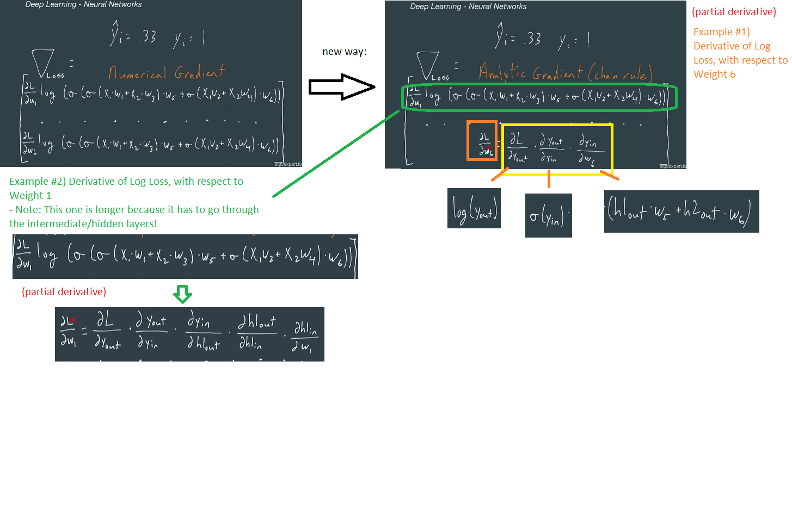

# MLExpert Notes
# Myles Thomas
# 6/2/2023
# algoexpert.io
---


---
# Lesson 1: Introduction

Purpose of this course: equip you with the foundational knowledge you need to ace any machine-learning interview and land a job in the industry. 
Let's get to work!

# Key Terms

## Ranking

Optimizing machine learning models to rank candidates.

- Typically, the goal is to order so that the candidates who are most likely to interact with (ie. purchase/view/like) are above other candidates

Examples: 
- Music
- Articles
- Podcasts 

## Supervised Learning

Optimized machine learning models based on previously observed features and labels

- Typically, the goal is to attach a label to some provided features

## Unsupervised Learning

An approach within machine learning that takes in unlabeled examples and produces patterns

- Typically, the goal is to discover something new/previously unknown

## Deep Learning

Optimizing neural networks
- Often has many hidden layers
- Can be supervised or unsupervised 

## Recommendation Systmes

Systems with the goal of presenting an item to a user that they will most likely purchase/view/like

Examples: 
- Music
- Movies
- Products

Note: Also called "recommender systems"

# Notes from the video: 

Machine Learning Crash Course

Supervised Learning:
- Tabular Data
    - Bitcoin prices
- Labels
    - Indicator of price going up/down


What if we want to make predictions with non-structured data?

Deep Learning:
- Unstructured Data
    - Images
- Labels
    - Indicator of truck/no truck in the photo

- We train the model by having it make predictions and letting it know it is wrong and right

What if we don't have labels?

Unsupervised Learning:
- Data
- No labels

Example: Given a bunch of tweets, have to group them together based on content
- Group like tweets together
    - Sports
    - Politics
    - etc.


Recommendations

Example: I'm browsing Youtube and there are 100's of videos that the service wants to recommend to you to watch next
- Youtube takes all of these videos that are related/think you may enjoy, and selects 1 to play next
    - Core idea, based on ranking


Ranking

Example: Open up tiktok
- There are 1,000,000's of tiktoks, how does it know which ones to put in my feed?
    1. Narrows down to 100 or so
    2. Use a ranking model to select 1,2,3
        - The goal is to have you keep scrolling, so the goal is to accurately rank!


# Prerequisites

Reviewing before "machine mastery"

# Key Terms

## Features

A set of quantities/properties describing 1 observation

Can be binary, categorical, ordinal or continuous:
- Binary: day, night
- Categorical: morning, afternoon, evening
- Ordinal: threatened, endangered, extinct
- Continuous: 1, 5, 3, 2

## Labels

Usually paired with a set of features for use in supervised learning

- Can be discrete or continuous

## Examples

Pairs of features/lables ie. observations

## Dimensions

Here, the number of features/columns with each row/observation

## Vector

Here, a feature vector is a list of features representing 1 example

## Matrix

An array of values (usually consists of multiple rows/columns)

## Matrix Transpose

An operator that flips a matrix over its diagonal

## Polynomial

A function with more than 1 variable/coefficient pair

## Derivative 

Indicates how much the output of a function will change with respect to a change in its input

## Probability

How likely something is to occur

Can be one of two:
- independent ie. roll of the dice
- conditional ie. drawing 2 cards without replacement

## Probability Distribution

A function taht takes in an outcome and outputs the probability of that outcome occurring

## Gaussian Distribution

Normal distribution: Common type of probability distribution that fits many real world examples

## Uniform Distribution

Probability distribution where each outcome is equally likely

Example: Rolling a normal 6 sided die

# Notes from the video: 

If you are hoping to interview, this is good to know the math behinds models

Matrix Multiplication
- Transpose
- Inverse
    - We won't talk about these much

Polynomials
- Linear
- Quadratic

Probability
- Conditionals (Bayesian)
- Distributions

Beta Distribution
- Good for rates
Example: 
- Did they click on the video/ad? 
- How likely are they to click based on the model so far?

# Supervised Learning

# Lesson 3: Naive Bayes

Naive baes lol

# Prerequisites

## Supervised Learning

Optimizing ML models based on previously observed features/labels

- Typically: Goal is to attach the most likely label to a group of features

# Key Terms

## Model

An approximation of a relationship between inputs/outputs

## Heuristic

An approach to finding a solution which is typically faster but less accurate

## Bernoulli Distribution

A distribution which evaluates a particular outcome as binary

- In Bernoulli Naive Bayes, a word was either in a message or not in a message

## Prior

The robability of a particular class, ignoring the features of 1 observation

## Likelihood

The probability of some features, given a particular class

## Evidence

The denominator of the Naive Bayes classifier

## Posterior

The probability of a class, given some features of 1 observation

## Vocabulary

A list of words that the Naive Bayes classifier recognizes

## Laplace Smoothing

A type of additive smoothing that mitigates the chance of encountering probability of 0

## Tokenization

The splitting of some raw textual input into individual words/elements

## Featurization

The process of transforming raw inputs into something a model can use for training/predicting

## Vectorizing

Transforms some input into something else

- Used in a step of featurizing

Example: Binary vectorizer transforms tokenized messages into a binary vector, indicating which items in the vocabulary appear in the message

## Stop Word

A word that doesn't add much predictive value

- These are usually discarded/thrown out

## Stemming

Removing the ending modifiers of words (leaving the stem of the word)

## Lemmatization

A more calculated form of stemming

- Ensures the proper lemma results from removing the word modifiers

Note: Lemma: proven proposition which is used as a stepping stone to a larger result.

# Notes from the video: 

Naive Bayes Classifier

Example: 

- You are watching this video and scrolling through instagram
- Someone sends you a DM and you click on it 
    - It is from a bot_123 and sends skeptical 
        - Don't recognize
        - They want money
        - They don't use my name at all
            - It would have been nice if Instagram had filter rules to not alert me of this spammy message

Filter rules:
- F(mesage) = 
    - Filter
    - Don't filter
- Example: Take all messages with the word bitcoin
    - We have 6 messages
    - Collect common words into a list
        - Rule: filter a message if it contains 2+ words
    - We want our model to give the the chance/probability that a message is spam
        - Spam: Send money to my Apple wallet
        - Not Spam: Hey, I found your wallet on the ground

Conditional Probability Statement
- P(spam | w)
    - What is the probability that a message is spam given these words?
    - P(spam | w) = P(spam) * P(w | spam) / 
    [P(spam) * P(w | spam) + P(not spam) * P(w | not spam)]

Bayes Theorem

Examples of priors for P(Spam) w/ 10 observations: 
- All are spam: P(spam) = 1.00
- None are spam: P(spam) = 0.00
- 2 are spam: P(spam) = 0.20
    - P(Not spam) = 0.80

Vocabulary (v): A list of words that the model understands/recognizes


P(w | spam)
... expanded
P(wallet, not any other word | spam)
... apply vocab
P(v47, not v0, ..., not v99 | spam)

vocab = v = [hi, hello, up, seatlle, ..., door]

Probability chain:


1. P(not v99 |
 spam)
2. P(not 9v8 | not v99, spam)
...
P(v47 | not v1,..., not v99, spam)

This would continue and keep multiplying
- Until we get the probability of the 47th word, given we had not seen any other word in the vocab in the message
- This is a lot of calculations!
    - Need to make assumptions or it would be too much/un-usable model

Assumption
- Presence (or absence) of a given word has no impact on presence/absence of any other word
    - We can cancel out all of the right sides of these equations

    

- This adds bias 
    - Can unfortunately hinder the models ability to pick up nuance in the messages
    - Example: Model doesn't increase probability of London, even though England is in the vocab too
        - Likely to appear together, but the simplified assumption model has the words isolated
        
        - Tradeoff: 
            - Good: Can use a model with large vocab
            - Bad: Independence assumption removes nuance

This simplified assumption is why it is called 'Naive Bayes'!
- Tends to work well in practice despite the Independence assumption

New equation now that we have simplied to naive bayes:


What we are doing now:
- Multiplying the probability of seeing certain words in a spam message
    - Treating every word independently (as if they aren't even in the same message)


Substitute that in our model:


Note: The following ~ means 'not spam:


Recap: all we have done is replace this:

P(w | spam)
OR
P(wallet, not any other word | spam)

With this:

P(v47 | spam) * ... * P(not v99 | spam)

Based on our naive independence assumption

How do we actually calculate these terms?
- P(v47 = 'wallet' | spam): "The probability that word 47 wallet appears in some spam message"
    - We calculate this by doing the following: 
        - Take all messages that are spam
        - Divide # containing wallet by total number
            - Example: 10 total messages; 2 are spam, 1 has 'wallet'
                - 1 / 2 = 0.50
            - Example: 10 total messages; 2 are spam, 2 has 'wallet'
                - 100%

    - Similar for 'probabilty our last word does not appear spam message':
        - Example: 99th word in vocab is 'door'
            - 10 total messages; 2 are spam, 0 have 'door'
                - count # of spam messages that door is in
                - 100% chance that messages with door are not spam 
                    - Do this for all other words

    - Similar for 'Probability our word 47 wallet does appears in the real/non-spam messages'
        - Example: Probabilty that 'wallet' appears in a not-spam message
            - 10 total messages; 8 are NOT spam, 2 of not spam have 'wallet'
                - 2/8 = 25% of non spam messages contain wallet

        - Another example: Probabilty that 'door' appears in a not-spam message
            - 10 total messages; 8 are NOT spam, 5 of not spam have 'door'
                - 5/8 =62.5% of non spam messages contain wallet
                    - Do this for all other words

    - In the end after doing all words: P(spam | w 'wallet') = 47.7%


    What happens if our message contains more than just a single word?
    - before: w = [wallet]
    - after: w = [wallet, door]

    - The tilde/~ 'not' in front of terms can now be reduced down to a binary representation
        - This is called vectorization
            - Example: w = [0, 0, ..., 1, ..., 0, 1]
            
More on Vectorization
- Useful for when dealing with these models with software 
- Example: Wallet 
    - Every value in array is 0, expect for w47 and w99 because those are wallet and door:

        


Laplace Smoothing: Helps in the case where a P(0) makes the entire numerator become 0 (because anything times 0 is 0)

Example: 
- 10 observations
- 2 are spam
- 0 / 2 = 0% contain the word door
    

What does laplace smoothing actually do here to get around this?
- We add 1 to the numerator AND denominator
    - Before: 0/2 = 0%
    - After: 1/3 = 33.3%

        

        - This is applied to every word, not just the ones with 0%!
            - VERY commonly used in these kinds of models to avoid any 0's


Now that we have gone over the model, let's look at how to pre-process the data before applying it for a model

Example message: Hey, good point here - this is interesting.

0. Input
"Hey, good point here - this is interesting."
- This is a string

1. Tokenization
['Hey', 'good', 'point', 'here', '-', 'this', 'is', 'interesting']
- Array of strings 

2. Stop word removal 
['Hey', 'good', 'point', '-', 'interesting']
- Removes unimportant 'stop words' from the array

3. Non-alphabetic removal
['Hey', 'good', 'point', 'interesting']
- Removes anything non-alphanumeric

4. Stemming
['Hey', 'good', 'point', 'interest']
- Removes the endings/suffixes at end of words
    - 'ing'
    - 'ed'
    - etc.

OR 
(Besides Stemming, there is Lemmatization, which is similar)

4. Lemmatization
['Hey', 'good', 'point', 'interest']
- Takes a more nuanced approach 
    - Examples:
        - Stemming: Studies -> Studi
        - Lemmatization: Studies -> Study
            - In our example above, they are the same

    - Pros: Takes a more nuanced approach
    - Cons: More computationally expensive
        - If you have large amounts of data, you might need to stick w/ Stemming

Note on Lowercasing:
- Don't do it right away
    - You can lose information/nuance
        Example: Mark(name) -> mark(name)
        - 

"Featurizing": The entire process from point A (raw message) to point B (something we can use in the naive based model)
- We now have features (instead of raw )
    - We can take this featurized input and represent it in terms of our vocabulary (This is vectorizing)

        

        - Will always be binary

Parts of model
- Priors: Training data
    

- Likelihoods: Training data w/ nuance accounting for response variable  
    
    - in our model, these are the presence or absence of words
        - This is a Bernoulli model
            - we will learn more about these alter

- Evidence: Solving for the result of this model, the posterior
    

What a fully trained model will look like: 

Priors:
- Prior spam
- Prior NOT spam
    - Both of these are on the entire training dataset ie. 65% vs. 35%
Likelihoods: 
- Likelihood spam
- Likelihood NOT spam
    - Key: A particular word in the vocabulary ('wallet')
    - Value: Probability of being in spam/not spam (0)
Evidence: 
- 
- 

[fully trained model](./crashCourse/1-supervised-learning/3%20-%20Naive%20Bayes/figures/13.png)


# Lesson 4: Performance

Is your model any good?
- is it an improvement over 1st heuristic?
- how do you even measure/quantify this?

# Key Terms

## Decision Point
A cut-off point in which anything below the cutoff is determined 1 class, anything above is another class 

Note: Also known as decision rule / threshold

## Accuracy
The number of true positives + true negatives / Sample size

## Unbalanced Classes
When one classes has more more rows/observations in the training data

## Model Training
Determining model parameters

## Confusion Matrix
Indicates true positives/negatives
- In binary case, its the 2x2 matrix

## Sensitivity
Proportion of true positives correctly classified
Note: Also known as recall

## Specificity
Proportion of true negatives correctly classified

## Precision
Number of true positives / (true positives + false positives)
- The quality of a positive prediction made

## F1 Score
The harmonic mean of the precision/recall
- Tells you how many times a model madee a correct prediction (across entire dataset)

## Validation
Technique of holding out part of the data to be tested after the training data

## Generalize
Ability for a model to perform well on the test set, as well as examples beyond the test set

## Receiver Operator Curve (ROCE Curve)
A plot of how well the specificity/sensitivity change as the decision threshold changes
- Default threshold: 0.50
- The area under the ROC Curve (known as AUC) is the probability that a randomly chosen positive example will have a higher prediction probability of being positive than a naive/randomly chosen negative example

## Hyperparameter 
Any parameter associated with a model that is not learned.

# Notes from the video: 

Model Performance
- last video we made a model

Point of this video:
- Is the model we built an improvement on filter rules/heuristic?
- What does this > sign mean?


Filter rules before ie. if any of these were true, it was predicted to be spam
- I'm not following the person
- They aren't following me
- First message doesn't contain my name

Note: this is our heuristic
- Model told us that Probability P(spam | w) = 47%
    - One can make the case: it makes sense to naively guess it is NOT spam since 53% of the time, you are right


Model Decision Rule Definition: 
- Goal: P(spam | w) = 
    - spam: probability >= 50%
    - not spam: probability < 50%

Begin evaluating performance of filter rules: 

- Start with easy calculation:
    - a

What I thought it was saying
    - Probabilty given that a rule is broken is 47% change it is spam 
        - That is less than guessing 50/50, so not good

Accuracy:
- easy to comprehend lol
    Example:
    - Model w/ 50% Cutoff: 96%
    - Filter rules: 96%
        - High number for 1st model!
        - Why are they the same?

- Not always a great metric to use
    - Overtraining to the imbalanced class
    - False positives are not being accounted for as more detrimental

Confusion matrix: 
- Correct: 
    - True Positive
    - True Negative
- Incrrect: 
    - False Positive
    - False Negative


Not clear who is performing better...

There are more metrics to look at!

Sensitivity:


- The model's ability to correctly classify the spam
    - It seems bad bc model is 1 worse than rules
        - It is not so bad
        - Notice the tiny sample sizes, as well
            - Note: Not for this example, but something like cancerous cells where a false negative is deadly, we would care more abot sensitivity

Specificity:


- Model's ability to correctly classify non-spam
    - Higher specificity = fewer false positives
        - In this case, specificity matters more because we really don't want a good message to be labeled as spam
            - The downsides are worse


Precision:


- If I classify something as 1=spam, how often am I right?
    - How many actually were spam?


F1 Score:


The point of the F1 score is the following:
- Harmonic mean of:
    - sensitivity
    - precision

- Not the best metric always
    - We lose information (when describing why to prefer/not prefer 1 model)

Takeaways:
- Reasons to prefer Model:
    - Less # of false positives
        - We would rather receive spam than miss out on real emails

How to control the trade-off between sensitivity/specificity?


Remember:
- Sensitivity: Less false negatives
- Specificity: Less false positives

Changing the decision threshold:
- Typically, default is 0.50
    - Increase to 0.75: Less are classified as spam
    - Decrease to 0.25: More are classified as spam


Takeaways from cutoff point changes: 
- At 55%, model beats heuristic
    - 50% doesn't account for specificity/false positives enough
    - 70% is too aggressive


Remember: The point of ML/Supervised Learning is to take labeled data to train a model on Out of Sample
- To make the most, we split into the following:
    - training
    - test
    - validation

Note: We have been looking at the performance on a test set
- Haven't used validation yet


What would we use the validation set for here?
- Decision point
    - Plotting an ROCE Curve


ROCE Curve


- Goal: Pick threshold that is farthest away and has the most area under that curved line
    - If we had another model to compare with: 
        - ROC Curve: AUC/Area under the Curve determines which model is better


Hyperparameter Tuning
-  Parameters that go long with the model, but you don't try
- ie. you choose them beforehand
    Example:
    - Laplace Smoothing: The amount of degree to which we apply this
        - None: leave as it
        - All: add +1 to numerator/denominator
    
Note: Other models have WAY more hyperparameters


Ways of doing Validation
1. Holdout Validation
    - Most basic
    - This is what we have done with the train/test sets

2. Cross validation w/ K-fold
    How this works: 
    - Instead of taking a random subset, we split the data up into k=5 groups and do this 5 times
        - Train the model with 1 of the groups being left out for validation
        - Record all of the performance metrics
    - Every performance metric is averaged together


- Pros:
    - Reduces chance that we overtrained ie. randomly go a training/holdout set with weird/noisy results
- Cons: 
    - It is much more computationally expensive (5x more in this case)

3. Leave-on-out
- Essentially same as K-Fold, except the validation set is only 1 observation
    - If you have 200 rows of data, train 200 models!
        - This typically overfits and is not optimal
        - It is reserved for cases where the dataset is very small

Note: We will usuallh use Holdout Validation since we have enough data

Takeaways from Series so far
1. Problem: We realized spam messages was an issue and we wanted to try and stop it
2. Hypothesis: Came up with a set of rules that could possibly fend of spam / reduce our problem
3. Simple Heuristic: Created filter rules
4. Measure Impact: Tracked/measured performance of filter rules
5. More complex technique: Decided to pursue a model-based appraoch
6. Measure impact: Tracked/measured performance of Model
7. Tune Model: We found shortcomings and wanted to improve our model performance to be better
- In our case, decision threshold changed from 50% to 55%
8. Replace existing technique
- We decided to go w/ the model > filter rules (heuristic)

Note: 

- Interviewers want to hear explanation of iterations 
    - If someone said they made a basic Naive Bayes and it fixed the spam problem, it would be a red flag that the process went too smoothly!!

    - Interviewers will hear the details of this process and the iterations that you had to go through

General tips on process:
1. If you are stuck at #4 measure impact:
- go back to #2 hypothesis to decide what metrics matters most for your use case
    - potentially even visit #1 the Problem to check if you are missing anything

2. If you get to step #7 and cannot beat the heuristic:
- go to #5 for a more complex technique
OR
- go to #2 and re-visit the feature you are using in your model
    - (feature engineering/selection)

3. When you get to step #8, make sure to tie it back to the busines object/problem and implication in the real world

    Think about spam use-case:
    - Not only does it help him since he won't have spam emails, but the model would be applied to many other things:
        - Instagram DM
    
HUGE point:
- Your manager's manager does not care about how you increased mdoel accuracy by 5%
    - He cares about this: "How much ADDITIONAL ad revenue will Instagram collect, as a result of having users less distracted by spam messages?"

Note We will take more about business impact later

Last takeaway: This process happens at different rates for different companies

Companies that are faster at iterating:
- Expiriments are...
    - Cheap to run
        - Time expense
        - $$$ expense
    - Failed experiments don't hurt/kill anybody
        - Health expense


# Lesson 5 - Naive Bayes Optimizations

More naive bayes... but it gets more interesting!

# Key Terms

## Multinomial Distribution
A distribution which models the probability of counts of an outcome

## TF-IDF (Term Frequency-Inverse Document Frequency)
A method of transforming features (usually counts of words) into values
- The values represent overall importance of different woreds across the document/documents

## Online Learning
Incremental learning within a model to represent an incrementally changing population

## N-gram
A series of adjacent words of length n

## Feature Hashing
Representing feature inputs, as a result of hashes modded by pre-determined value
Examples: 
- Articles
- Messages 

## scikit-learn
Most popular ML library in Python
Provides implementations of the following:
- regression
- classification
- clustering

## Kernel Density Estimation (KDE)
A way to estimate the probability distribution of some data 

# Notes from the video: 

Goals:
- Build on understand of Naive Bayes
- Expand on understanding of supervised learning

So far, we have focused on Binary Classification.


- There will be examples with more classes...


New Example: We work for the social journal company Medium
- We want to automatically classify articles into groups/tags

    Examples: 
    - Tech
    - Finance
    - Politics

We can use Naive Bayes!

Before: 2 terms in the denominator


Now: 3 terms in the denominator
- We are generalizing with a summation instead of writing it all out 
    - C = # of classes
        - Here, C=3


And finally, Re-write Naive Bayes with the summation in the denominator:


Starting Out:

Example: Tech

Priors: Take the number of tech, number of non-tech
- now we know the likelihood of an article being Tech
    - did the same with Spam


Likelihood: 

- Refresher: With Spam we counted the number of messages that contained a given word
    - ie. Wallet appeared in 1/2 spams, so 50% likelihood of wallet being in spam messages


Note: You can argue this is a bad idea for longer articles. Why though? 
- It has to do with Binary/Bournelli vs. Multinomial

Example: You have 2 articles:

1. Tech, about Apple M1 chips
- Mentions Taiwan 1 time

2. Travel Blog about Asia
- Mentions Taiwan 10 times

According to the Bournelli model these are the same.
- Looks at it in a binary way

We will go ahead with the Binomial
- Multinomial: Modeling the counts of each word in an article
    - This is an improvement over the binary nature of the Bournelli 
        - ie. the simple presence/absence of a word


Back to likelihood: Looking at the likelihood that the word "computer" appears in a tech article

Numerator: Total # of 'computer'
Denominator: Total # of words in article

![numerator - computers]

![denominator - computers]

Bernoulli: 2/6
Multinomial: 7/411

Review: Spam, modeling presence/absence of a given word


Priors: 
- spam: 
    - prior: 10%
    - likelihood: {key: 0, good: 0, point: 0, fine: 0}
- not spam
    - prior: 90%
    - likelihood: {key: .11, good: .44, point: .22, fine: .11}

New Problem: Articles


Priors: Same as before
- tech: 40%
- finance: 30%
- politics: 30%

Likelihoods: Looks similar, but ends up different:


Likehlihoods: Different this time around (will change)
- it is a map of word: likelihood


Why it's different/What it really is:
- A count of the number of words, with respect to the element in our vocabulary


- If an element in our vocabulary is seen twice, we take the power of the probability/likelihood

Now that we have the representation of counts, do the following: 


- Category: Finance
    - Look at numerator
- Expand the likelihood terms out 
    - 
- Apply vocabulary representations as powers to the likelihoods themvelves
    - Example: Count=0, ^0 means 1, so value of power=1 
    - Example: Count=2, ^2 means 1, so you 


    
Note: You can still run into issues where you have a 0 in the numerator!

Spam: Laplace smoothing

3 class: Add 1 to numerator and 2 to denominator
- Ensures no 0's in probability calculations

Example: Probability that the word computer is in a tech article 
- P(v57 = 'computer' | tech)


What this means: 
- The word 'computer' is seen in 7 words of the 411 words in tech articles


Next, looking at denominator


This is what is happening here: 

=Summation(Priors *  Likelihoods)

ie. = (Tech prior * Tech likelihood) + (Finance prior * Finance likelihood) + (politics prior * politics likelihood) 

= .4 * .12 + .16 + .3 * .11

= 0.27

= Denominator

Combining numerator and denominator:

We already found .16
- This is the prior * likelihood

We just found .27
- This is the denominator for all 3 classes
    - Summation(prior * likelihood)


Meaning of 59%: 
- There is a 59% probability that the input article should belong to 'Finance' category

### One way to increase model performance: 
- Look above at vectors circled in orange
    - We can do something more clever with the 'vocabulary representation' of this input message

Example to show: 


- Let's take the word 'travel'
- we have 6 articles total, with counts of each:
    - Article 1: 10
    - Article 2: 20
    - Article 3: 10
    - Article 4: 20
    - Article 5: 30
    - Article 6: 10
    
Normal way: Regular vocabulary input message (Top): 


Steps (to get to calculate this value of '1'): 
-  The word 'travel' appears 1x in the article (in this vector: the 0 means count=0, the 2 is that word appeared twice, etc.)

    - This way is not optimal (it doesn't judge relative importance of a word)

Better way: 'Term Frequency Calculation' (Bottom)


How we did it overlook:


Steps (to get to this value of '0'): 

1. TF (Term Frequency) - Get frequency for this word
- Count the number of times 'travel' appears in article
- Divide by total # of word
    - This example: 10/5000 = 0.002

Leave that aside for now...

2. IDF (Inverse Document Frequency) - Calculate inverse document frequenc
- num of documents
- num of documents where 'travel' appears
    - This example: log(6 / 6) = log(1) = 0
        - It appears in all of the documents here, as you can recall up above 

Put it all together...

3.  Calculate 'TF-IDF'
- Multiple TF * IDF
    - This example: 0.002 * 0 = 0

### What does this TF-IDF actually tell us?

Remember stop word list ('the', 'for', etc.)
- These words are so common that they are not informative...

- In our example, Travel just happened to be not very informative either!
    - Every article saw it a bunch of times (10+)
        - TF-IDF 'zeroed' out the value of travel
            - Basically: it quantifies importance of a word

### How can we use this to our advantage?

We would apply this TF-IDF to each word in the vector:
- This would 0 out words like travel
    - When we go to take powers, this will make them not make an impact on the numerator

What does changing the numerator do/affect:
- the likelihood term ie. the value we raise the 
    - Example: 
        - Normal way: (x)^1 = (0.002)^1 = 0.002
        - TF-IDF: (x)^0 = (0.002)^0 = 1

    - Probablility of 'travel' being in a tech article goes WAY up
        - travel is seen in just about any article 

        - Therefore, so does likelihood of this article to be classified as tech/finance/politics!
            - In this case: The likelihood of 'travel' being a differentiating word goes down!
                - All of the numerators increased


Recall with another example: 


Now, let's say 'stock' and 'etf' are common words...


## What we have done so far:
1. Changed naive bayes to allow multiple classes
- Multinomial

2. Changed from binary/bernoulli to counts/multinomial

3. Categorized articles into 3 different classes
- tech/finance/politics
    - articles can be found easier

Another example: Uber Eats (Food Delivery)

Uber Eats is doing a marketing campaign to send promotional discounts out to customers

Options:

1. Send randomly equally (lazy)
- Each customer gets $5 off of their next order (if they order in the next 7 days)

2. Use past promotional data AND newer customer data to selectively decide who gets the discounts  (better!)
- We want to maximize the probability that those people convert into a 'habitual user'
    - ie. someone who order 3x/week now

More on this method #2: 

Customer data

predictors
- average bill amount
- usage:
    - weekly
    - monthly
    - yearly (this gets thrown out - it was not predictive)

response variable
- converted 
    - ie. 1 for yes, 0 for no

Here are 6 examles of what 1 row of data looks like
(1 customer's vector)


How do we actually use this numeric data w/ a Naive Model?

- Spam -> Bernoulli
    - Binary Classification w/ text data / documents

- Articles -> Multinomial
    - Multi-Classification w/ text data / documents

- Promotions -> Guassian
    - Used for Numeri/Continuous predictor variable


Gaussian Model - What we care about:
- Means
- Standard Deviations 
    


We now have means and sds by class, let's plug into our model: 


Question: What is the probability of seeing a feature in User 1, given that the user is a 1?
- Feature: weekly=2

- Likelihood that a customer who is a 1 will only order twice weekly is 23%


Priors:
- Easy to calculate

- Habitual users / Total users
    Example:
    - 6 habitual
    - 11 non-habitual
    - 17 total
        - 6/17 is prior for group 1
        - 11/17 is prior for group 2

Likelihoods:


## Choosing cutoff point


Typically for marketing, you'd have a budget: 
- $100,000
- Give everyone $5
    - ie. you need to find 20,000
    - You are unlikely to use a value like 50%, you'd want to be more certain and only choose confident 1's
        - ie. Cutoff 83%

What we have done:
- Maximized the return of our $100,000
    

### Situation: Data Engineer comes and says "We have a new variable"

Service preference:
- pickup
- takeout
- both

How to calculate categorical likelihood?

~[categorical likelihood](./crashCourse/1-supervised-learning/5%20-%20Naive%20Bayes%20Optimizations/figures/25.png)

Likehihood of each group
- Take the fraction of customers who prefer it / entire number
    - easy


### Situation: Customer base shifts

The model has been rolled out and is doing well
- More customers are changing to be habitual users

If the proportion of habitual keeps going up, we have 2 option: 

1. Re-train the model
- once a month
- once a week


2. "Online learning"
- when someone converts, we immediately receive a new piece of labeled data 
    - go into model immediately and update parameters

- Pros of this approach:
    - Stops need for massive updates / training from scratch
    - Incremental training when someone switches

- Cons/Problems implementing this approach: 
    - Likelihood terms of multiplication in numerators/denominators:
        
        Example: We have 100 features

        - We are going to be multiplying 100 things
            - If those values are between 0 and 1 (they are bc they are probabilities), then that number will gradually go towards 0 (as people switch to habitual)

Example: 

``` py
start = 1
for x in range(400):
    start = start/10
print(start)
```


Remedy: Take the long of the numerator

- Log allows you to separate out the values of the log with an addition
    - This lets us represent the same model without the repeated multiplication (these can raise the number to 0)

Final note: No need to evaluate/calculate denominator
- Proportional to, not equal to (since only numerator changes)
    - 

# Memory Optimizations

Example: 
- We have 10,000 words in our vocabulary
- Across 1,000 articles
- Assume 32 bits per element

This is a 40GB Matrix!

Fortunately, most of the values are 0
- A lot of the articles are only going to have some of the words 

What does this mean?


### Sparse Matrix 

It is a hashmap with key/value pairs:
- Key: i,j
- Value: the value in original matrix
    - if original value of matrix is 0, we don't put it in the hashmap!
        - This obviously saves a lot of bits of memory

Another way to reduce size of vocabulary...

### N-gram

Right now, every word gets their own entry in the vocabulary
- These are '1-grams'
    - Examples: 
        - 'stock'
        - 'market'

- There are also '2-grams' ie. 'stockmarket'

We can ditch the entire vocabulary if we use feature hashing!


Feature Hashing

Steps: 

1. Take input: 'stock'
2. Put through hashing function to get value: f('stock') = value of function (124893)
3. Mod the value of the hash function: 124893 % n = 4893
- n = how much space we want to use (10,000 here)
- this is now 'index i'
4. Take index i and increment that element
- ie. [0,...., 1, ......, 0]
    - index 4893 got increased by 1
5. It continues
- Some words will have the same value after the mod

Pros of this feature hashing
1. We can handle 'arbitary length articles' 
- As long as words keep coming in, we can handle them by just incrementing the index for that word

2. We don't have to re-train an entire model for new words
- These new words can be hashed to a specific index
    - Then, continue on


Notes on Naive Bayes Classifiers:

Pros: 
- Classifying Binary
- Classifying Multinomial (sometimes)

Bad: 
- Estimating probabilities

Easy to implement with sk-learn - It supports all of this:
- TF-IDF
- Feature Hashing
- Stop words
- n-grams
- Bernoulli
- Multinomial
- Gaussian
- KDE

What is KDE?

Note: You can only use gaussian if your data follows a gaussian distribution
- If it follows a power distribution, you must turn elsewhere ie. KDE because gaussian will NOT do a good job

KDE = Tries to estimate the distribution of your data through a series of (typically)
gaussian
- Use this if you don't know the distribution of your data!


Final takeaways on this video
- Figured out how to use larger documents with Naive Bayes Classifier
- Multinomial classification
- When we don't have words, we used Gaussian on numeric data
- Memory optimization:
    - We figured out how to get rid of the vocabulary w/ feature hashing
    - Sparse Matrices


# Lesson 6 - K Nearest Neighbors

"You are the average of the 5 people you spend the most time with"
- This statement is reductive and offensive to some
- but, the truth is that more often that not in practice it does entail similarity

# Key Terms

# Prereqisites

## TF-IDF (Term Frequency - Inverse Document Training)

A method of transforming features (usually representing counts of words) into values representing their overall importance in the document(s)

## Cluster
A consolidated group of points

## Euclidean Distance
The length of the line between 2 points

## Feature Normalization
Typically referring to feature scaling that does the following:
- centers values around the mean
- scales by the standard deviation

## Jaccard Distance
One minus the ratio of the number of like binary features values around the mean of the feature and scales by the standard deviation of the feature
- Excludes instances of matching zeros

## Simple Matching Distance
One minus the ratio of the number of like binary features values and the number of like and unlike binary feature values

## Manhattan Distance
Sum of the absolute differences of two input features

## Hamming Distance
The sum of the non-matching categorical feature values

# Notes from the video


KNN
- What a label is according to those closest around a data point 
- K = # of neighbors we will use
    Example: K=7
    - Look at the 7 closest neighbors
        - See how many are Class=1 ie. 6/7 = 85% probability


## Example: We work for a cyber security company and want to detect 'intrusive processes', or programs (Programs are requests/calls made to do things)
- 1=intrusive (bad), 0=normal request (good)
- We will do this for the entire network
    - Not just 1 single machine!

### Features

Goal: Normalize all features to be between 0 and 1!


process ID: Maps to an ordered list of system calls
- Predictors: Calls made to Operating System (OS)
- Labels: 0 for safe, 1 for intrusive

pid1 = ['mkdir', 'mount', 'poll'] -> 0
pid2 = ['chroot', 'fork', 'open'] -> 1

We are going to perform TF-IDF on this calls.
- Treat them kinda just like words


(Assume we are just using 2 dimensions/words, so we can easily plot this)
- Notice how the groups are clearly have differing features

### Run KNN on the un-seen observation
- We are using Euclidean distance

Note: Typically you will pick an odd number of K
- At avoids ties


Another method of KNN:


Pick the K nearest neighbors who are normal
- if the avg of the distances is below/above a certain distance
    - This distance would be derived by cross-validation techniques
        - more later!

### Adding 1 variable: ordinal/categorical variable

Let's say we added another variable: Priority
- Priority (high/medium/low)
    - Priority is "Ordinal"
    - obviously, high priority could be a predictor for malicious attacks, right?

New rows of data: 

pid1 = ['mkdir', 'mount', 'poll', 'low'] -> 0
pid2 = ['chroot', 'fork', 'open', 'priority'] -> 1
OR 
pid1 = ['mkdir', 'mount', 'poll', 0] -> 0
pid2 = ['chroot', 'fork', 'open', 1] -> 1


Now that we have a mix of features, the euclidean distance is no longer good
- Gower distance 

### Gower Distance: can be used to measure how different two records are. 
The records may contain combinations of logical, numerical, categorical or text data.
- The distance is always a number between 0 and 1
    - 0: the same
    - 1: the exact opposite

How to do Gower:
- Value / Max value

In this example:
- Low: 0 / 2 = 0
- Medium: 1 / 2 = 0.5
- High: 2 / 2 = 1


### Adding 2 more variables: Both symmetric binary


1. Binary: Did the program run in sudo? (sudo = super user)

2. Binary: Did the program terminate/exit out early?

These are both 'Assymmetric Binary'!
Meaning: Binary, but that the classes are imbalanced
- Most of the time it is a 0; but, sometimes there is a 1
    - When there is a 1, it has a lot of predictive power 

Jaccard Distance: If you have 2 examples, Count the number of mismatches between the two assymmetric binary variables
- `# of mismatches / # of total comparisons`
    - Excluding when both 0, since these don't matter at all (not predictive as that is the norm)


### Adding 1 more variable: Symmetric Binary 


Mac vs. PC
- it doesn't really matter 
- Use 'Simple Matching Distance'


### Recap so far


These vectors will help us get the Euclidean distance between 2 observations

Note: There is another distance you can use
- Manhattan Distance
    - Used for "We use Manhattan distance, also known as city block distance, or taxicab geometry if we need to calculate the distance between two data points in a grid-like path."


## Next Example - We work for a market agency whose task is to drive alumni donations

Info:
- We collect 10% of the donations as compensation

We want to predict how much people will donate if we ask
- Calling everyone is long/boring/annoying

## Features
- Categorical: College
    - Engineering
    - Math
    - Teaching

- Ordinal: Year
    - 0-10 years ago

- Binary: University FB Group join date
    - In past year (exclude), or not 

## Labels

Amount ($) donated 

## Begin modeling

![hamming distance]

Hamming Distance: # of differences in category
- Matching notation for categories

Example: 
- alum1 = [x, ..., engineering, xx]
- alum2 = [x, ..., business, xx]
    - They are the exact same except for 1 variable: Hamming distance is 1
Example: 
- alum1 = [x, ..., engineering, xx]
- alum2 = [x, ..., engineering, xx]
    - They are the exact: Hamming distance is 0


Assuming we have 2 dimensions, this is what we are dealing with here: 


Here, we would take the avg. of the 3 neighbors and that is our prediction.

## Practical Considerations

### High Dimensionality: Avoid this!
- KNN performs poorly when you have too many features
    - This is because the distane metrics/formulas will break down

Example: Euclidean distance
- As you grow in dimensionality, you need more separation in points to get up to the same distance
    - Famous example of breaking down really fast 


Ways to reduce dimensions (more on this later, but this is a basic start)

- Do cross-validation on each predictor/feature and see which ones matter most for predicting the labels/response variable


### Sensitivity to Scaling

Any model (such as KNN) that uses distance metrics is going to be very sensitive to scaling

- Variables with bigger scales end up having more of an impact on the lables

Example: (Don't scale)
- height (m)
- waist (m)
- distance run weekly (m)
    - This feature is way larger, but is still same units!
        - Don't scale
        - use Manhattan distance

Example: (Scale)
- height (m)
- waist (m)
- Caloric intake per day (calories)
    - Much larger and way different than other variables
        - scale with min-max scale
        - use Euclidean distance

### Weighing Votes

"Make the vote of node 7 matter more than ... node 6"


In this example: 
- Closest node: Node 7
    - Vote weight is divided by N7, which is a smaller number
        - Weight comes larger, relatively

- Further node: Node 6
    - Vote weight is divided by N6, which is a larger number
        - Weight becomes smaller, then
        
Remember, they have the same numerator!!


### Computationally Expensive

Time complexity: O(n * d * k)
- n = nodes
- d = dimensions (# of features)
- k = hyperparameter

Solution to help + improve time complexity: K-D Tree
- Hopefully gets it down to k * log(n)

K-Dimensional (K-D) Tree: Effectively, a binary tree that splits the dimension into 2 
- Popular DS, used for structuring organized points in a k-dimensional space
    - Allows for efficient searches of points in a multi-dimensional space
    - Essentially, it 

Note: This data structure suffers from dimensionality
- So don't go and use a ton of features, thinking this will save the day!
    - Approaches k * O(n) as n grows large

## Recap

What we learned:
- What KNN is 
- How to use various features
- How measure distance between examples
- Covered limitations + practical considerations when using it

Examples of applications: 
- Cybersecurity: F1 score = 83% offline
    - In 1 month, 2 alarms were raised
        - 1 was false
        - 1 was a true malicous attack

- University: Accomplished 2 things:
    - Business aspect: 
        - 20% ROI
        - Did not have to hire people to make calls
    - University was happy
        - After all, they got 90% of the work/profits...
        - People who picked up the calls were happy to be called! (according to University)


# Lesson 7 - Decision Trees

Yes, or no?

# Key Terms

## Decision Tree
A tree-based model which traverses examles down to leaf nodes
- Properties of the examples decide

## Sample size
The # of observations taken from a complete population

## Classification and Regression Tree (CART)
An algorithm for constructing an approximate optimal decision tree for given examples

## Missing Data
When some features within an example are missing 

## Split Point
A pair of feature/feature value which is assigned to a node in a decision tree.
- This split point will determine who goes left/right

## Gini Impurity
Used as a way to determine the best split point for a given node 
- Used for classification trees
- Basis: Probability of incorrectly classifying an item based on all of the items in the node 

## Surrogate Split
A suboptimal split point reserved for examples which are missing the optimal split point feature

## Mean Squared Error
The average squared difference between the prediction and true label
- across all examples

## Boosting
An ensemble technique - trains many weak trees/learners sequentially
- Each subsequent weak learner is based on the previous weak learner's error(s)
    - This generally reduces the bias error

## Bagging (Bootstrap Aggregation)
A sampling technique which selects subsets of examples and/or predictor variables to train an ensemble of models 
- Generally: reduces the variance error

## Weak Learner
Another word for shallow decision trees (in our case)
- Generally: it can mean any weak model 
    - Shallow: usually only has ... depth

## Ensemble
Using more than 1 model to produce 1 prediction

## Random Forest
An ensemble technique - trains many independent weak learners
- Generally: reduces the variance error
    - Wisdom of crowds 

## XGBoost (Extreme Gradient Boosting)
Open source library w/ gradient boosted framework

## LightGBM (Light Gradient Boosted Models)
Open source library providing a distributed gradient boosted framework 
- Created by Microsoft

Example found [online](https://towardsdatascience.com/catboost-vs-lightgbm-vs-xgboost-c80f40662924): 


## Notes from the video


- Note: I believe the '?' represents missing data


## Example of CART

Hired by Precision Drilling Corporation 
- top oil drilling in US
- When you drill for oil, you have no way to know/no certainty there is actually oil there
    - You must make predictions!

Goal: Report which drill sites they should commit to, in order to net/drill the most oil
- ie. predict which sites will yield the most oil

## Features

Per past drill site: 
- porosity: how porous is the rack
    - 0-0.5
- gamma ray: how much natural radiation
- density: density of the rock
- sonic: time it takes for (s)
    - unit: seconds

These are on different units and scale!
- Luckily, CART is invariant to scale
    - Also robust to outliers

Taking these measurements costs A LOT of money:
- Some measurements are skipped (to save cost)
    - Luckily, CART can take missing data
        - For training AND prediction phase

## Labels
1-profitable
0-lost money

## How to split examples by their labels?


Our data: We only have numerical features
- According to CART, we need to decide which feature to make the 1st split on 
- If we find a feature to split on, which value is going to split the sample/population up best?

Goal: Find the best feature AND best value to separate our data the most

## Evaluating each feature


### Evaluate values within the feature: 

Steps: 

0. Decide on the column we want to evaluate
- We choose 'porosity'

1. Order the data by that column
- The rows have been re-aranged so that it is ascending from 0.02 -> ... -> 0.21

2. Find average between each adjacent piece of data
- Since there are 4 rows, there are 3 adjacent pieces of data
    - These are known as 'Split points'

3. Put all of the examples into their correct next node
    - ie. Send them each left/right depending on the split point
        - Repeat this for each split point and record results so we can evaluate effectiveness
        
4. Measure the effectiveness of each split point with 'Gene Impurity'
- More on Gene Impurity now!

Gene Impurity:
- Formula: [1 - (probability_class_1^2 + probability_class_0^2) ]


### How to calculate Gene Impurity and use it to evaluate split points:

In our example, using 1st split point of 0.45: 
- Recall what our true Labels are: 
    - x1/x2 = 1
    - x3/x4 = 0


##### Find gene impurity of left and right nodes:

Left node: x1
- 100% probability of getting a 1 (1 observation in this node, it is a 1, 1/1=100%)
    - Gene Impurity of left node: 1 - (1 + 0) = **0**

Right node: x2/x3/x4
- 33.3% probability of getting a 1 (3 observations in this node, 1 is a 1, 1/3=33.3%)
- 66.7% probability of getting a 0
    - Gene Impurity of right node: 1 - (0.1089 + 0.4356) = 1 - 0.55 = **0.45**

A quick look at how we got to these values of 0 and 0.45 for gene impurity: 


##### Multiply Gene Impurity of L/R nodes weighting each node

Weighting the node: Multiple the node by how much of the split went its way

In our example: 
- 1/4 went left: Weight of 1/4
- 1/4 went right: Weight of 3/4

These values are now multiplied by their Gene Impurities, then added together for the gene impurity score of choosing that split point!

In our example: 
- Left Node Gene Impurity * Weight = 0 * 1/4 = 0
- Right Node Gene Impurity * Weight = 0.45 * 3/4 = 0.3375

Add these together: 0 + 0.3375 = 0.3375
- This is the gene impurity for this Split!

##### Repeat with the other splits, select the split with the Lowest Gene Impurity

Lowest gene impurity is best
- This is because it is a clean/pure separation

In our example: We have 2 more splits:
- Split 1: 0.3375
- Split 2: 0
- Split 3: 0.3375

Choose Split 2!
- This Gene Impurity of 0 is perfect because x1/x2 both went to the left for 1, and x3/x4 both went to the right for 0


### Repeat this with the other predictor variables


Normally, we would repeat this and select the best gini impurity
- In our example, we already found a PERFECT score of 0, so we can continue!


1st split point at top of tree: Porosity (Split point = 0.1)

### Repeat this process recursively for each node


That was the first node at the top, but now we can do it all the way until we get to the bottom
- Remember: Once a node has been split, it is now its top node, so this process just keeps going!
    - We stop eventually, though (depending on hyperparameters)
        - Otherwise, you'd have leaf nodes of n=1

### When do we stop splitting

1. Assign a max depth
- "tree cannot go have d > 3"

2. Assign a minimum # examples in a node
- "once the tree has a node < 10, stop going"

3. Go until all nodes are pure
- you are praying for overfitting here


### How do we make predictions on new data


1. Go down the tree

2. Once you get to the bottom, take a vote
In this example: 
Training data:
- 1: 4 votes
- 0: 2 votes

Majority wins - the unseen row of data is now a 1!


## Handling Missing Data

Easy in CART!

Think back to when we were assinging split points for features, and the split points themselves:


1. Keep track of the 'n' best split points
- If your data has a missing value at the top of that list, then go down
    - Use a split point that this row of data has data for!

Example: 


Best split: Porosity (it had a gini impurity of 0)

Next best split: Highlighted in blue (Use this!)


## Multi-Class Labels (as opposed to just binary data)

Example: We want to know what Drilling Techniques to use:
- Horizontal
- Vertical
- Hydrolic 


and...


Differences: 
- Add another element to gini impurity
- Take the mode (most popular vote)
    - Basically the same as before!


## Regression with CART

Instead of probabilities, let's look at barrels of oil per day:

Labels
- 100-1000 barrels of oil per day

Choosing split points goes the same way:

Look at each predictor variable and each split value...
- the best gini impurity is the top split point

BUT

Now we use Mean Squared Error (MSE) instead of Gini Impurity

MSE: 


What happens:
- Subtract the data value from the average value
- Square it
- Repeat for all values and take the summation
- Finally, divide by n


"The difference between this example and the average is"
- This example for left: 0!


"The difference between this example and the average is"
- This example for left: 54182!


Recall: We had to add to do the following to get a split node's Gini Impurity:
- Multiply MSE of Left node * Weight
- Multiply MSE of Right node * Weight
- Add together
    - That is not how you do it with MSE

MSE for a split node: 
- Take a summation of all Squared errors
    - Both left and right

For this example: 4 times we did the operation of x - mean ie. 320-320, then squaring it 
- Do this 4 times, add them up and we arrive at 162546

- Now that we have this summation, divide by n to get the average

For this example: 162546 / 4 = 40636.5
- This is our MSE for split node #1

Repeat for the rest of the nodes

### Deciding which split node is the best

Just like with Gini Impurity, you will do the above process for:
- All split nodes
    - 3 in this case
- Across all predictor variables
    - 3 in this case

The lowest/best MSE is the one that will be split node!
- Remember: Keep an order in the case of missing data
    - Surrogate splits


### Making predictions at the bottom of the tree
(A company in southern hemisphere wants to use our product, so data needs a new var HEMISPHERE)

Binary/Multiclass: We would take the most popular choice
- ie. the Mode

Regression: We take the average!

Example: We have the final node with 2 values:
- x1 = 120
- x2 = 360

Our prediction for un-seen data is 240!


## Adding a new variable: Binary categorical variable
(More companies want to use our product, so data needs a new var for COUNTRY)


Variable: Hemisphere
- northern
- southern

If it is classification: Use Gini impurity

If it is regression: Use MSE


## Trying a new variable: 

6 possibles values:
- US
- Sudan
- IQ
- IR
- AE
- AO

How does the model know where to split this group of 6 up, at split points?

### How to decide the split point when categorical variable is not Binary?


Essentially: It has to try every combination of splitting the group into 2
- There will be (2^n) - 1 options

With multiclass categorical variables as predictors, 
- Be careful: As number of categories grow, number of subsets needed to evaluate AND number of split points grows
    - This is much more expensive from a complexity standpoint

Just like before, the following is true:
- Classification: Use GINI
- Regression: Use MSE\


## CART Downsides

We have talked about the pluses and possibilites, but may have left out the most important part of a single tree:

They overfit extremely easy!

Why is that?
- As depth increases, the probability of overfitting inreases

Ways to prevent overfitting: 

### Limit max depth

Typically: A value between 3-5 is used so that the tree doesn't get too deep

### Boosting


Boosting is training each model on the error of the previous model
- Each new tree is built on the past ie. considering the errors of previous trees. 
    - This overfits even faster since you are based predictions solely on the errors of 

Note: In both bagging and boosting, the algorithms use a group (ensemble) of decision trees.

Example to help explain: 


### Bagging


Baggging is a sampling technique, bootstrap aggregation
- Reduces variance
    - Deals with noisy data good because it makes a bunch of weak learners
        - "Wisdom of crowds"

Out-of-bag: 
1/e = 1/2.718 = 36.7%
- Roughly 36.7% of examples will not be trained on  
    - This is nice: We automatically get an Out of Bag Sample, that we can use as validation set


### Bagging vs. Boosting

In general:

Boosting:
- Weak learners trained sequentially (They build on one another - the randomness comes from the first learner)
    - Can overfit because it is sequential (if first prediction is overfit, the rest will be too)
        - They are dependent of each other

Bagging:
- Generates subsets by selecting data at random (WITH replacement)
- Weak learners trained in parallel
    - They are independent of each other
        - "Wisdom of crowds"

### Random Forests


    
Random Forest: Averages the predictions of all of the trees 
- Uses bagging ie. wisdom of crowds approach


### C 4.5


C4.5
- Designed for classification problems
- Can do n-ary split
    - Not just binary splits!
    - Example: Top node of trees splits 4 ways 
        - left, left middle, right middle, right

- Information gain (entropy)
    - Used instead of Gini 
    - The Information Gain function tends to prefer the features with more categories as they tend to have lower entropy
        - Low entropy: Entropy quantifies to what extent the data are spread out over its possible values. 
            - high entropy = data are spread out
            - low entropy = concentrated on one value


Overview of what we learned:
- CART
- Boosted Trees
- Bagging Samples
- Bagging Features

Libraries
- XGBoost
- LightGBM
- CatBoost

Note: CART is basically never used alone, you will use some sort of boosting/bagging


# Lesson 8 - Linear Regression

The topic the professor spent 1/2 the semester on but you didn't pay attention to...

# Key Terms

## Line of Best Fit
The line through data points that best describes the relationship of y with x1,x2,x3...
- Ordinary least squares is used usually
    - Minimzes the sum of square distances

## P-value
Probability of finding a particular result (or greater), given a null hypothesis is true

## Confidence Interval
The possible range of an unknown value
- Oftentimes: Comes with degree of probability ie. 95%

## Correlation
The relationship between x/y

## R-squared (Coefficient of Determination)
% of variance in the dependent (y) variable that can be explained by the independent var(s)

## Residuals
Distance between points and a particular line
Here:
- Point = actuals
- Line = prediction

## Independent Variable
Variation is independent of other variables
- It is a predictor

## One-hot Encoding
An encoding for categorical variables where each is a binary vector

## Dependent variable
Variation depends on other variables
- depends on the predictors

## Variance Inflation Factor (VIF)
A measure of multicollinearity in a regression model

## Collinearity
When 1 or more predicting/independent variables are not actually independent
- They have high correlation, so make similar predictions

## Feature Interaction
Features that are multiplied by one another
- Expresses non-linear relationships
    - Relatinshps that can't be represented by adding the terms together

## Nonlinear regression
A type of regression which models nonlinear relationships in the predicting variables

## Simpson's Paradox
When a pattern emerges in segments of examples, but is no longer present when the segments are grouped together

## statsmodels
Python module w/ various statistical tools, including OLS

# Coefficient
A parameter in the regression model

# Notes from the video


I already know linear regression very well, so these notes will be shorter

### Example: Predict power demand, using the average temperature


x = avg. temperature
    - average of 
y = power demand

y = mx + b
- m: for every 1 unit increase in x, y increases by m
- x: 
- b: the value for y when x = 0

### How to check the coefficient is not noise: P-value
Probability that this relationship (or a stronger one) exists, given the null
- usually has to be under 0.05
    - otherwise, it will be deemed noisy

Note: Coefficients are estimates
- "Only past 5 years of data"
- "Only summer months"
    - Examples of why you are estimating the population with a sample


### Estimation: Use of Confidence Intervals

Uses normal distribution to come up with a range of outcomes ie. probability distribution
- If 0 is in the interval, it is not significant ie. p-value > 0.05

### Correlation

-1: negative
0: none
1: positive

Note: Correlation does not mean causation
- Be careful

### R^2 (Coefficient of Determination)


How this works: (Besides just taking a square to the R)

- "How well the line fits the data"

Steps:
- Take the mean of our examples
- Use the mean to measure residuals of all 'n' points
- Sum up this number
- Repeat all of this for line of best fit
- R^2 = Sum1 = Sum2
    - this is the explained difference, 


Our example here: 
- Mean: 
- Residuals: ...
- Sum of residuals: 100
- Sum of residuals using best fit line: 2
- R^2 = 100 - 2 = 98%

98% of the variance can be explained by this variable

How this explains the difference: "We went from 100, down to 2, by fitting the data to this line"

Adding more features - Impact on R^2:

We want to be able to explain more of the variance
- Making our model more complex can do so
    - There is noise in real world, we will never get 100%

### How to get values: Formulas

These are allBasic statistics


Note: R^2 adjusted: accounts for the number of predictors we use


### Features/Predictors


Adding a categorical variable:

Approx. region size
- small
- medium
- large


One hot encoding: Only 1 of these terms is present at time
- Linear regression needs this since it needs numeric values to calculate the Sum of Squares


### Dealing with Multicollinearity


The predictors are called independent variables for a reason, they should not impact the others!
- When they correlate, we have a problem
    - The model can still be effect
    - The way we interpret coefficients gets messed up

How to deal with this:

Assumption: We interpret temperature as if it is independent
- When assumption is broken: We can't say for sure

How to detect?

VIF: Variance Inflation Factor
- 1: none
- 1-5: medium collinearity 
- >= 5: severe collinearity
    - Need to use 'Centering' of features

Centering: 
- Subtracting average feature values of the feature itself
    - Can lower VIF


### Feature Interaction

Model interaction term: Multiply two factors together
- If R^2 goes up and p-value is significant, you might just be onto something

Can we multiply a feature with itself? Yes!


Example: Winter / Summer months

Why would we want to do this?
- Nonlinear relationship will need parabolic type fits
    - You can even do to 3rd or 4th power

Note: This is praying for an overfit

Simple Rule: Coefficient * some function of x
- B * f(x)


### Nonlinear regression

Powerful, but that's all we will do to cover it 

### Simpson's Paradox


Look out for this!

Simple gist: statistical phenomenon where an association between two variables in a population emerges, disappears or reverses when the population is divided into subpopulations.


Example: 

Suppose that a university is concerned about sex bias during admissions:
- 40% of men were admitted, only 25% of women
- 2 variables analyzed so far: sex, admissions rate

- 3rd variable that creates the paradox: department
    - women apply to departments with lower acceptance rates


How to avoid Simpson's Paradox:
- Add more variables to the model
    - This will hopefully segment the data

### Wrap up

- statsmodels: Python package
    has support for:
    - lets you conduct multiple regression
    - gives R^2, p-value, even VIF
    
Note: today we used a closed form of linear regression
- libraries use another method: singular value decomposition
    - we will go over this later


# Lesson 9 - Logistic Regression

linear regression: continuous/numeric
logistic regression: classification

# Key Terms

## Sigmoid Function
(Also the logistic function)
A function which outputs on the range of 0-1

## Closed-Form Solution
For our case: This is what the OLS (ordinary least squares) provides for linear regression
- It is a formula that solves an equation

## Cross-Entropy Loss
A loss function that is used in classification tasks
- It's technically the entropy of the true labels + KL-divergence of the predicted and true labels
    - Minimizing the cross-entropy minimizes the difference between true/predicted label distributions

## Parameters
Weights/coefficients - values learned during model training

## Learning Rate
A multiple used during the parameter update step during model training
- Used to smooth the learning process
    - values typically less than 1

## Odds Ratio
The degree of associate between 2 events
- If the odds ratio is 1, then the two events are independent
    - OR > 1: positively correlated
    - OR < 1: negatively correlated

## Multinomial Logistic Regression
Logistic where the dependent var/response var has 3+ classes

## Softmax
A sigmoid which is generalized to more than 2 classes to be predicted against
- converts a vector of K real numbers into a probability distribution of k possible outcomes
    - k = number of classes possible

## Gradient Descent
An iterative algorithm with the goal of optimizing some parameters of a given function with respect to some loss function

Batch gradient descent: all of the examples are considered for an iteration

Mini batch gradient descent: Considers a subset of examples are considered for a single iteration
- The balance of the other two
    - expensive: batch
    - less expensive: stochastic

Stochastic gradient descent: Considers a single example per gradient descent iteration
- Randomly picks 1 data point from the whole set at each iteration to
    - This reduces computations enormously
        - Especially in high-dimensional optimization problems this reduces the very high computational burden, achieving faster iterations in exchange for a lower convergence rate

## Downsampling
Removing examples from the majority class
- Typically done w/ upweighting

## Upweighting
Increasing the impact a minority class has on the loss function

## Epoch
One complete cycle of training on all of the examples in the dataset

## Regularization
A technique of limiting the ability for a model to overfit, but encouraging the values parameters to take on smaller values
- Constrains/shrinks the coefficient estimates towards 0

## Early Stopping
Halting the gradient descent process prior to approaching a minima or maxima 
- helps avoid overfitting bc when training a learner with an iterative method, if you let it go for too long it will overfit

## Mcfadden's Pseudo R-squared
Analog to linear regression's R^2
- Usually takes on smaller values
- Learn more [here](https://stats.stackexchange.com/questions/82105/mcfaddens-pseudo-r2-interpretation#:~:text=McFadden's%20R2%20is%20defined,same%20probability%20of%20'success').

## Generative Model
A model that aims to approximate the joint probabilty of the features/lables

## Discriminative Model
A model that aims to approximate the conditional probability of the features/labels


Note: 
- Generative model: Approximates the probability of event Y occurring at the same time that event X occurs.
- Discriminative model: Approximates the likelihood of an event or outcome occurring, based on the occurrence of a previous event or outcome.


# Notes from the video

Example: Will there be a power outage on that day?


Features: 
- avg. daily regional temperature history

Labels: 
1- outage
0- all good

Another way to look at it (notice how the line doesn't split them up perfectly ie. we do not have 100% accuracy using this model)


Difference between regression and classification:
- Regression: Linear
    = Predicts a numeric

- Classification: Sigmoid function
    - Predicts probability of 0/1


Sigmoid: 
- ensures output between 0 and 1
- Idea: plugin a temperature and solve for the coefficients
    - Output: probability

The coefficient: We predict these

### Iterative approach to updating the coefficients and probabilities:

This tells us how to update the coefficient + bias:


Loss function: Difference between prediction and actual

- For logistic regression the loss function is "Log Loss"

- Log loss is 0 when we are correct

    - y hat: predicted probabilities
    - y: actual 0's and 1's

Note: Because of 1 side being the 1 and the other being 0, you only end up using 1 side of the equation!
- (1-0) and (1-1) OR (1-1) and (1-0)
    - either way, 1 is 1 and 1 is 0


### Turn log loss into cross entropy loss


As predictions get close to the actual value, this is what happens:
- Log loss approaches 0
- Values are still in the negative domain though

How to deal with this?
- Take a negative of the log loss ie. the "Cross entropy loss"
    - Can be called negative log loss, as well

### How do we use the cross entropy loss to as a way to minimize the difference between what we predicted w/ our coefficients vs. the real labels?
- ie. make coefficients that maximize accuracy

First, Understand how the model is doing in general


1. Take the average cross-entropy loss of every row/example in the dataset
- ie. with n=10, take summation of negative log loss and divide by 10 to get avg. log loss

Still, how does the average loss turn into predictions?
- also: can we use this log loss to produce predictions that are closer to the truth?

Note; parameters = coefficients = weights

2. Repeat on each value of Beta 1 to find the optimal value / convergence point 


Purple line: "Based on the value we pick for Beta1, this is what the log loss will be"
- Obviously, we want a small log loss close to 0

Orange dotted line - Slope of the curve: Increasing/decreasing by 1 unit will lead to an 'x' increase/decrease of Loss function (This is how to increase this Beta1 value mathematically)?
- Use the slope: It tells us how much change we need to make to 
    - Our example #1: Negative slope - If we want to make log loss go down, we need B1 to go up! 
    - Our example #2: Negative slope - If we want to make log loss go down, we need B1 to go up! 

- Slope of the curve depends on what point you are at
    - As you approach the point where loss converges (more on this next), the slope is closer to 0 ie. a shift of 1 unit doesn't do as much
        - Our example #1: 

Convergence of loss function:
- Minima: Slope is at 0 (no matter what we do, the Loss function cannot improve)
    - This is where the loss function converged
    - We take the value of Beta1 that miximizes the cross entropy loss!


3. Beta 0: Find the xxx

Now that we are at the convergence point, how do we get the actual slope from Beta1?
- Use derivates


This is the derivate of the loss function, with respect to Beta1 (parameter of interest).

Remember: We have more than just 1 beta
- We have the bias term/y intercept (Beta0)
- Just remember this because the derivate is only getting us Beta1

Let's do the same the same as earlier, but with respect to Beta 0:


Beta0 can have very different dynamic in terms of average loss created
- For instance: The minima in above picture looks much different
    - It is not as ...

Take the derivative on Beta 0 to get this: 


What we have done so far:


1. Took derivative of loss function
- helped figure out which direction (increase/decrease) to do w/ the Beta1 to get minima for loss function
2. Took derivate of loss function w/ respect to B1
- 
3. Took derivate of loss function w/ respect to B0
- 
Now:
4. Combine them into a list to get the gradient

What is the gradient:
- A concise way to represent "which way we should adjust each parameter/coefficient in the model, according to the loss function"

### How do we use the gradient to update the weights?

Subtraction: Subtracing the gradient gives us the new value of the Beta, 1 unit over.

- Value of Beta1(t+1) = Beta1(t) - Gradient(B1) image.png
- Likewise, Value of Beta0(t+1) = Beta0(t) - Gradient(B0) 

Example of gradient decent: Getting B0 and B1 at next time stamp


We continue to do the following until B0 and B1 have gradients of 0 ie. their loss functions have converged: 
1. Calculate the gradients by way of derivatives
    - ie. find where B0/B1 converge so that their loss functions are minimized (Same thing we did on the graph, just doing it mathematically)

2. Update B0 and B1 by subtracting them by their gradients

3. Repeat until Gradients are 0 - It is that easy!

We are now here: 


Remember: Both parameters have converged to the minima.

What next?

### Learning Rate


Our example just now did not use it, but typically ML Models will insert this r in front of the gradient value, which is the learning rate

Learning rate: Multiplies by the gradient value to make the updating process slower/faster
- lies between 10^-6 and 1 (ie. 0.000001 and 1)
    - Example: learning rate = r = 0.000001: Slow learner
        - Helps so that we never over-shoot the minima

    - Example: learning rate = r = 1: Faster learner, updates quickly
            - May overfit!

Note: think of over-shooting the minima as this: 

![overshooting the minima]
   

Tips on Learning rate - we want it to do 2 things: 
1. Choose reasonable value to converge quickly
2. Not too fast so that we bypass the minima
    - Don't want to be oscilating back and forth


We have trained our model.... now what?

We can plug in values and make predictions!

### Making Predictions


Plug in your value for x1 to get a predicted probability that your binary classification will become 1

Example: x = 30
- "With/given that x1=30, there is a 99.9% change that there will be a power outage"


### Follow up with cross validation to ensure you are picking an optimal threshold


We have a trained model, so now it's time to visualize the decision boundary.

How do we do this? 

##### Example with 1 Predictor

Note: The only thing that really changes when you add an additional term is that the gradient changes

How to do interpretation of predictors: 

1. Odds ratio: exp(B1)

2. % changed odds: 1 - exp(B1)

In this example: 


"At B1=0.28, for every 1 unit increase in x, we are 32% more likely to be of class 1
- Not 32% more probability, think of it as x*1.32

- If B1=0, no change
- If B1=-0.1, we are 9.5% LESS likely
    - Once again, not 9.5% less probability, but (1-0.95) = x*0.905

Note: If the confidence interval contains 0, the p-value wouldn't be significant

Next, what if we want to predict more than 2 classes?

## Multinomial Classification


"Given that a power outage occured, we want to figure what time of the day it happened"

Labels:
- Morning
- Afternoon
- Evening

Softmax function is used.

Softmax: 
- guarantees all class probabilities adds to 1 (100%)
    - predicted class is max value

##### Updated Model


Individual coefficients for each class
- numerator: same as before
- denominator: summation of all classes

##### Updated Loss Function + Gradient Function


Loss Function
- Calculate loss function w/ respect to all 3 classes, the average
    - avg. via summation and divide by 3

Gradient Function
- just need to incorporate which class


### Batch Gradient Descent

Steps:
1. Get loss function
- Avg. of individual loss functions for ALL (n=rows in dataset) training examples

2. Get gradients
- Same as before, take derivatives w/ respect to all of the class, ie: 
    - Take derivate of loss function w/ respect to B0
    - Take derivate of loss function w/ respect to B1
    - Take derivate of loss function w/ respect to B2

3. Update our parameters based on that gradient
- Keep updating/iterating until our gradients are equal to 0 for B0/B1/B2


### Other ways

##### Stochastic Gradient Descend
Changes Step #1 of Batch Gradient Descend
- New Loss function: 1 single/random value in the dataset (Instead of going through every row, we pick 1 at random!)
    - Solid for online training method, Unfortunately, this way is typically un-usable (it is too slow to converge to minima)

### Mini-batch Gradient Descent
Happy medium of the other 2: Changes Step #1 of Batch Gradient Descend
- New Loss function: If entire dataset has 'n' rows, we take a subset of size 'm', and then use that subset to calculate the avg. loss function

Pros: 
1. Allows for less-noisy updates to the parameters 
- vs. Stochastic, since 1 observation will a lot of noise whereas an average value will capture the truth better

2. Don't need to pull all data into memory

3. Mini batches can be parallelized
- Updates to the parameters can be aggregated


### Example: Mini Batch Gradient Descent 

Labels:
- blackout days (1)
- non blackout days (0)


Steps: 

### Dealing with Class Imbalances

1. Select batches WITHOUT replacement at random (until every element in the data has been trained on)
- This is called '1 epoch'
    - Iteration means each piece of data 1x, epoch means each >= 1x
        - [For example: if you have 1000 training examples, and your batch size is 500, then it will take 2 iterations to complete 1 epoch.](https://stats.stackexchange.com/questions/164876/what-is-the-trade-off-between-batch-size-and-number-of-iterations-to-train-a-neu)

We are dealing with unbalanced classes, so blackout days are very rare
- It is possible to grab a mini batch that has no pieces of data w/ a 0/blackout data
    - This is bad - model cannot learn properly without seeing 1's
    - It would also take forever for the loss function to converge


##### Method #1 of dealing with this: Downsampling
Do the following
- only take 10% of the majority class 
- keep all of the minority class

Pros: 
- FAR more likely to come across the minority class/negative examples

Cons: 
- We have messed up the distribution of data
    - Before:
        - 1's: 89% (1000/1100)
        - 0's: 11% (100/1100)
    - After: 
        - 1's: 50% (100/200)
        - 0's: 50% (100/200)

Note:
 This is why we can use Downsampling in tandem with upweighting...
 - It will proportionally compensate for the downsampling

 ##### Method #2 of dealing with this: Upweighting
 Do the following: 
- When  a weight to every single example

In our example: 
- Majority Class: Each loss function of the mini-batch will be multiplied by 10 (1*10 = 10)
    - During loss function calculation: "upweights" the majority class by allowing there to be 1/10th the observations, but that those 1/10th of the population still can make the same impact!

- Minority Class: Stays the same (1*1 = 1)
    - a

For reference, this is where it changed: 


Best Practice:
1. Do model WITHOUT Downsampling + Upweighting
1. Do model WITH Downsampling + Upweighting
3. Check and see how performance is affected

##### What this combination of Downsampling + Upweighting does:
We can train with essentialy 1/10th of the data
- The loss function will converge faster
- We don't have to use as much computer memory / resources


What we have done, so far:
- Effectively minimize our loss function
    - Fit our model parameters correctly
        - Minimizes difference between actuals/prediction (makes us more accurate)


## Overfitting

Just like trees, when a weight parameter (1 predictor) for a feature becomes too large, overfitting can occur.
- Model is placing too much importance on 1 feature
    - Indicates the model is trying too hard to be like the training data

How to fix this?

### Regularization


Regularization: Used to control the size of a parameter's impact/coefficients
- Adds a term to the loss function that sums up the absolute value of our weights
    - Chooses a model configuration that has small weights (even if it may sacrifice the orignal loss function)


##### L1 / Lasso / Laplace
Take the absolute value of each weight, then uses a summation to sum them all up.
- Ends with more 0 valued coefficients
    - 


##### L2 / Ridge / Gaussian
Takes a square of each weight, then uses a summation to sum them all up.
- Small weight; for many of the features that L1 would have zero'd out

##### Difference Between L1/L2


### Regularization Term (Term in front of L1/L2)


Oftentimes: Both L1 and L2 will have a coefficient out front
- Its purpose: Control the degree of regularization
    - If this value is too high: underfitting
    - If this value is too low: overfitting

How to tune this parameter?
- Cross-validation!


Note on Regularization: 
Features on large scales oftentimes have really small weights
- This makes it so that compared to feaures with smaller scales, they don't overpower them
    Example:

    

This helps with the model but comes back to bite us in the w/ the regularization term in front of L1/L2
- The loss function penalizes it more 

In order to mitigate this: 


Scale input features w/ min-max scaling!
- Range of 0,1

What it does to help:
- Fixes issues stemming from features with larger weights
- Loss function will converge faster

### Early Stopping


Early stopping is essentially stopping BEFORE we get to the absolute minima
- Absolute minima is an overfit model

Pros:
- Avoids overfiting
- Less time 


### McFadden's Pseudo-R^2

Linear Regression: R^2

Sigmoid/Logistic Regression: McFadden's Pseudo-R^2

Why can't we use the same R^2 measures?
- 

Similarities:
- Lies between 0,1

Differences: 
- Values are usually smaller
    - between 0.2 and 0.4 is considered an excellent fitting model


### Final notes:
1. We can use interactions terms and parabolic terms
- They will probably overfit though

2. Naive Bayes: Recall when we wanted to solve but did we flipped the question around instead of actually doing it

[generative vs. discriminative](./crashCourse/1-supervised-learning/9%20-%20Logistic%20Regression/figures/30.png)

Before w/ Naive Bayes: Generative
- probabilities CANNOT be trusted

Now w/ Logistic Regression: Discriminative
- probabilities CAN be trusted


# Lesson 10 - Support Vector Machine

Why do support vector machines always look sad?
- They feel marginalized

# Key Terms

## Support Vectors
The most difficult to separat3e points (in regard to a decision boundary)
- They influence the location and orientation of the hyperplane

## Margin
The space between the hyperplane and the big support vectors.
- In the case of soft margin Support Vector Machines, this margin includes slack.

## Hyperplane
A decision boundary (in any dimension)
- decision boundaries that help classify the data points. 

## Norm
Here (L2 Norm) the square root of the sum of squares, of each element in a vector

## Outlier
A feature/group of features which vary significantly from the others

## Slack
The relaxing of the constraint that all examples must lie outside of the margin
- This creates a soft-margin SVM
    - Not every single point needs to be outside of the support vectors (Outliers can potentially be inside)

## Hinge Loss
A loss function that is used by a soft-margin SVM

## Sub-gradient
The gradient of a non-differentiable function

## Non-differentiable
A function which has kinks in which a derivatve is not defined.

## Convex Function
Function with 1 optima

## Kernel Trick
The process of finding the dot product of a high dimensional representation of feature, without computing the high dimensional representation itself
- A common kernel is the 'Radial Basis Function kernel'

# Notes from the video


Logistic: Determines class using decision threshold
- Cares about the probability of one class (or another)
- Selects a 'cutoff point'
    - minimizes negative log-loss

Support Vector Machines: Removes the concept of a decision threshold
- Doesn't care about exact probabilities
- Selects a 'decision boundary'
    - Maximizes the distance between 2 most difficult examples to classify
        - These 2 are known as 'support vectors'
        - These 2 support vectors make up the 'hyperplane'

Definition of hyperplane: 0 = w*x - b
(essentially same line equation as regression, it just has to equal 0)

Note: This is really a dot product
- 1st weight * first dimension, 2nd weight * 2nd dimension
    - Exactly how we have been representing line equation for LR, this is just a more commpact form!

Dot Product: 


Hyperplane: decision boundaries that help classify the data points. 
- Data points falling on either side of the hyperplane can be attributed to different classes

w: 
x: 
b: 

When the distance between the decision boundary and the 2 support vectors is MAXIMIZED
- `w` and `b` will be optimized

Think about it like this: 3 lines
1. Hyperplane

2. 
- All positive examples are to the right of this
- Positives: Marked as 1

3. 
- All negative examples are to the left of this
- Negatives: Marked as -1

Margin: 2 / Norm(W)
- 1/Norm(W) is distance from hyperplane to support vector (for left and right sides)
    - 2 of these is why numerator is 2


### How to minimize the Norm(W)

Remember: 

Goal: Maximize distance between hyperplane and the support vectors
- This will provide some reinforcement so that future data points can be classified with more confidence

Sub-goal: Minimize the denominator ie. Norm(W)
- Beware: We don't want to maximize margin SO much that we go past our 2 support vectors and start mis-classifying 1's and 0's

Example of that occurring:


- In this picture, you can see the negatives have made it inside the support vector on the left; as well as positive inside the support vector on the right

Mathematical way of showing what the graph is telling us:


### Equation to solve for line that best separates support vectors

1. Maximize the Margin
- Goal: Minimize Norm

2. Account for Constraints
- Goal: Labels on the correct sides


Note:  
- Logistic regression: minimized cross-entropy loss with no constraints
- SVM: Minimize norm WITH constraints
    - This is why we have to use a different optimization technique!

### Different Optimization Techniques
1. Linear Programming
- unstable
- doesn't guarantee unique solution

2. Quadratic Programming (Hard-margin SVMs)


- Hard Margin: Gives NO slack (not ideal)
- Soft margin: Gives slack (ideal!)

Slack: Relaxes the constraints so that every label of this type doesn't have to be on its correct side of the support vector.
- Result: a "Soft Margin SVM"

### Soft Margin SVMs


In order to use the soft margin SVM, we have to update our constrains:  

Meaning of error term: It accounts for times where classification isn't correct/on the right side
- "No longer does every single point have to exist on the correct side of the margin; instead, we can allow some points inside"
- Measuring error: Distance between where Hard margin Support vector would be, soft margin Support vector currently is

We also have to update what we minimize:

### Regularization


Meaning: Minimize the Slack
- "We are going to sum all of the slack variables' distance from the margin, and try to make it as small of a distance as possible"
    - Intuitive because we would rather have this value be 0 in a perfect world

Parameter 'C': Regularization
- A constant term indicating how much we want to penalize the model for having slack

Values we can use:
1. 0
- value is correct side of margin

2. u < e < 1
- Correct classification, but penalty for being inside the margin

3. e >= 1
- Incorrect classification, higher penalty


### Matching Error Terms


We are currently optimizing for 2 things, and both have the Ei error term

Why can't we just solve for Ei and plug it? (Then we wouldn't have any constraints w/ our optimization problem!)
- We re-write the inequality
- Part of '' is non-differentiable, so no derivatves or gradient descent can be used
    - There is a sharp point on the graph for hinge loss

Luckily, we can use 'Sub-gradient descent' instead of Gradient Descent

### Sub-gradient descent

![sub gradient descent]

About Sub-gradient descent:

1. Pegasos: Can solve/optimize the Hinge Loss
- Used with soft margin SVMs
    - It can guarantee a minima ie. Convex

2. Updating of weights
- We would update the same way as w/ Gradient Descent in Logistic regression
    - Find gradient  (sub gradient in this case)
    - Update the weights 'w' in the opposite direction of the gradient 


### What we have learned so far

1. Soft Margin SVMs allow us to fit data that is one of the following:
- Not seperable ie. Hard Margin SVM would not be able to find solution
- Fit data that would have been hard for a hard margin SVM
    - Example from before: Outlier near the hyperplane 

2. We use the C term to decide how much to penalize errors
- Remember: 0 for correct, 0 < e < 1 for inside margin, e >= 1 for incorrect
    - Find best C term with cross validation


### Separating Data that cannot be separated with a line


We used a plane!
- Technically hyperplane, cannot use a line since we are in 3D
- Projects the data out into multiple dimensions
    - ie. multiply by yourself (x1^2) or have feature interaction terms (x1 * x2)


Here in this example: Kept 2 original features, added Interation term between x1/x2


### What if we had 100 features?

Generate Interaction term between all features
- HUGE number
    - 100 features
    - 1000's of dimensions
- Take the dot product to come up with 1 scalar value 

All we want is 1 single number: How else can we get it? Kernel Trick

### Kernel Trick


Kernel Trick: Allows us to avoid transforming all of these features into a large dimensions
- We can stil extract the dot product without performing feature transformations
- But... can't use SVM in 'Primal' form
    - 'Dual' form = New optiimization form
        - Comes from 'Lagrangian Dual'

*Breeze through derivatives, focus on WHY the Kernel Trick exists*

Why the Kernel Trick Exists:

Primal form: W transpose X
Dual form: X transpose X

Benefits us in 2 ways:
1. If # of examples you want to classify is far less than # of dimensions, this is way more efficient than the W(transpose)*x
- Example: You have 100 rows of data, after interaction terms there are 10,000 predictors

2. In this form, we can apply the Kernel Trick
- Take some dimension X, calculate the high dimension dot product, return to us the single scalar value
    - Once again: Massive savings when # of examples << # of dimensions our data is being projected into

Note: Kernel can be any of the following
- linear
- polynomial
- gaussian


Popular K: RBF Kernel (Gaussian)
- Seperate dimensions for every data point you have 
    - Example: 100 data points, 100 dimensions

Why is this useful? Here is an example: 

Take a series of points (seen above), and you want to separate them with 1 line 
- This is difficult

What Radial basis function kernel does here:
1. Assigns each data point a gaussian/normal distribution
- can have different height/width/etc.
2. It then traces a line of the sum of these gaussian distributions
- It does this so it can project that point on that line (within its own gaussian)
    - We now have linearly seperable data!
    - When we project from 5 dimensions back to 1 dimension, we will have a line of separation between each data point

Note: Kernel Trick is not only for SVMS
- Linear Regression: 


## Multi Class SVM

### Method #1: 1 SVM for each class


Idea of this: Binary Classify, this class, or the rest 
- "Red, or anything else"

Steps:
1. Train an SVM for each class
2. Choose a prediction
- Run the unseen data through all 3 models
- Choose the model that produced the greatest margin (between that new example and the rest of the classes)

### Method #2: 1 vs. 1 paradigm (Pairwise SVM)


Idea of this: For every single pair of classes, we train an SVM
- [C * (C - 1)] / 2
    - Example: 3 classes: [3*(3-1)]/2 = 6/2 = 3 Pairwise comparisons
    - Example: 4 classes: [4*(4-1)]/2 = 12/2 = 6 Pairwise comparisons
    - ...
    - Example: 10 classes: [10*(10-1)]/2 = 90/2 = 45 Pairwise comparisons

        - As you can see, as # of classes grows, the # of comparison grows huge!
            - This is very computationally expensive


Steps:
1. Train an SVM for each pairwise
2. Choose a prediction
- Feed the unseen example through all of the SVMS
- Select the class that was most often predicted
    - Note: Even though the 1v1 paradigm has a lot of SVMs trained, the data needed per SVM is only 2 classes
        - Depending on your data, it may be faster computationally!

### Method #3: Structed SVM (Most elegant way)


Idea of this: Instead of margin being -1 and 1, the margin is the distance between the 2 closest classes
- According to [here](https://ieeexplore.ieee.org/document/9502528), Structured SVM is good for NLP and Computer Vision
    - Beware: it can have a TON of constraints


## SVM Regression


It is not common, but technically, you can use SVM for regression tasks.

Idea: Keep all of the points WITHIN the margin
- Similar to the classification task 
    - Slack variables/error terms: Outlier and points that are OUTSIDE of the margins


## Key Takeaways

1. SVM can linearly separate data separateable data (Hard margin SVM)
- If we have slack variables, it becomes a soft-margin SVM

2. Sub-gradient descent: Used to optimize Hinge Loss in a Soft Margin SVM
- We cannot use normal Gradient Descent because the Hinge loss equation is not differentiable
    - It has a corner ie. it has a break point 

3. We can add interactions terms to put data into multiple dimensions, to help separate the data with a plane (Hyperplane)
- This is preferred in the following cases:
    - You have a low number of dimensions you want to project into (simple model)
    - Dataset is extremely large

4. Kernel Trick
- If your data is smaller, and you want to project into a lot of dimensions, we can avoid the feature transformation step with the Kernel Trick
- Avoids computing the actual feature transformation
    - Rows of data << Dimensions projected into 

Keep in mind: 
- SVMs are distanced based (margin)


### Why would we use this over Logistic Regression?
- If you have a low number examples: start with linear SVM
    - it works because it focuses on dissimilar vector

- If you have more data points, and less feature: start with logistic regression

Note: At end of day, this is a generalization and you should cross-validate to see what works best for your use case

(In this example with the power outages, we end up using Logistic Regression because the interpretability of the coefficients)


# Lesson 11 - K-means

Centroid/Metroid/Medoid

# Prerequisities

## Unsupervised Learning
An approach within machine learning that takes in unlabeled examples and produces patterns
- Typically, the goal is to discover something new/previously unknown

# Key Terms

## Centroid
The center location of a cluster in n-dimensions

## Inertia
The sum of distances between each point and the centroid

## Local Optima
A minima/maxima (not the global one)

## Non-Convex Function
A function who has 2+ instances of Slope=0

## Elbow Method
A method of finding the best value for k in k-means
- It involves finding the 'elbow' of the plot of a range of K's vs. their inertias

## Silhoutte Method
A method of finding the best value for k in k-means
- It takes into account the ratio of inter and intra cluster distances

## K-means
Using a weighted probability distribution as a way to find the initial centroid locations for the k-means algo

## Agglomerative Clustering
A clustering algorithm that builds a hierarchy of subclusters that gradually group into a single cluster
- Some techniques for measuring distances between clusters are the following:
    - Single linkage
    - Complete linkage


# Notes from the video

Unsupervised Learning: When we know nothing about the data, except for the data values themselves

Great starting point to learn something: K-means!
- Find 'k' number of means in the data 

Example: Hired by Blind social media
Task: Grow the user-base (Daily user of the app)
- Data we have: Each user's interactions with the app
    - Data we DON'T have: Current user-base, or how they got to where they are 

Features:
Interactions (clickstream):
- Like given/received, per day
- Average session time
- Time posted content, per month
- Average feed scrolling time, per session
- Direct messages sent/received, per day

Labels we want to make:
- 
    - We want to grow the user base, so 

### Goal of K-means


Steps to separate data into groups: 
1. Pick K=2 random points, assign them to be different labels
- Centroid: These are centroids of each 

2. Find the distance between the centroid and each point of data on the plane
- Repeat for each Centroid, K=2 here
    - Whichever centroid is closest to a given point, is the label that point receives

3. Update the centroid
- Make it the average of all of its observation w/ its label

4. Repeat!
- Find distances, update labels of all points, update centroids
    - Do this until k-means converges
        - Convergence here: The centroids don't move anymore


How do we measure how good k-means did labeling our un-labeled data?

### Distance Measures


Inertia: Sum of the distances between each point and centroid
- Inertia measures how well a dataset was clustered by K-Means
    - Good model: Low inertia AND Low # of clusters

Note: Inertia varies on distance metric used (let's start with euclidean)

Steps:
1. Calculate distance between data point and their centroid
- Repeat for each data point in your cluster
- Repeat for each cluster

2. Get the Inertia 
- Take summation of all of those distances 

Note: Your inertia's goal is to be minimized, and chances are you are not there yet!

### Lloyd's Algorithm

One approach to this: Finding every set of clusters possible for K=2


- This has a time complexity of n^(k*d + 1)


The algorithm we used: Lloyd's Algorithm
- Has better time complexity of n*k*d

Disadvantages of Lloyd's Algorithm
- We are only able to 'approximate' the best inertia
    - Because we are not doing a grid search, we don't always see the best cluster configurationD

As seen here: 


Note: Unlike other optimizations, this function is not convex
- It has more than 1 minima
    - Potentially, we can get stuck at a sub-optimal point ie. a local minima


### Example to show how


We have 3 Clusters - Because centroids are created randomly, we very well could end up like one of these:
1. left (good)
2. right (bad)

How does this happen? 
- In the definition of kmeans, we said: "Repeat the updating of centroids, until k-means converges and we don't see an immprovement" ie. the centroids don't move
    - This is how you get stuck at a local minima


### Ways to avoid getting stuck at a local minima

Kmeans++: 

Note: The only way to guarantee finding global minima/optimal solution is to run 'Exact k-means'
- This typically isn't a good idea, though


Bisected K-means:


Steps: 
1. Run k-means for k=2
2. Measure the inertia of the 2 clusters
- Whichever cluster has higher inertia, we perform k-means with K=2 on that
3. Repeat until K = ...

Wait, how do we pick optimal K?


### Methods of Choosing Optimal K

##### Elbow Method: 

[elbow method](./crashCourse/2-unsupervised-learning/11-k-means/figures/6.png)

Steps: 
1. Pick a range of values of K (let's say 1-6)
2. Calculate inertia for all of them
3. Pick the 'elbow' for K 
- Here, the elbow is the dot on the graph where interia is trending down, but starting to level out ie. see diminishing returns


##### Silhouette Method:

[silhoutte](./crashCourse/2-unsupervised-learning/11-k-means/figures/7.png)

Steps: 
1. Calculate a(i)
- a(i) = avg(d(i,j)) = The average distance of each point in the cluster to another point in the cluster
    - ie. d = own cluster
- Repeat for each cluster

2. Calculate b(i)
- b(i) = avg(d(i,j)) = The average distance of each point in the cluster to another point in the cluster
    - ie. d = nearest neighbor's cluster
- Repeat for each cluster

3. Apply s(i) formula
- b(i) - a(i) / max(a(i), b(i))

4. Plot avg. s(i) for each cluster we considered
- Select the value of K with peak ie. Silhouette Coefficient


### Update on where we are with in the Blind Example

This is after doing the following:
- Bisected K-means
- Picking k=3 using silhouette method

### Observing Trends


Now, we have clusters and made some labels, how do we use this to our advantage to make any decisions?
- Look at the features of each cluster, and see if they vary in any way
    - means
    - sds
    - 


We have 3 Groups, that we choose names for based on their variables:

1. Consumers 
- Higher avg. scroll session
- More likes to post
(Big group)

2. Content creators
- Lower scroll time
- Less likes to post
- Lots of writing their own posts
(Smaller group)

3. Both
- In the middle

Next: Run K-means for the same exact users, but in the past

Observation: The clusters follow a similar trend of users
- yes they are smaller, but that's because the app has grown since then 

Insight: now we know "How we need to grow in order to keep the same ecosystem" (that they have now in terms of users)

What levers can we pull?
1. Control transitions readers make (reader > both > Content creator)

2. Grow Reader Cluster
- Referall programs
- Offering free benefits
- Important point: We can't do this too much!!!
    - We will have too many readers and not enough content creators...
    (Content would be sparse/boring, people would stop using the app)


Takeaway: Focus on the following:
1. Transition Readers to Both
- Encourage readers to post

2. Ensure those in the 'Both' Cluster continue to write/enjoy writing
- Push their 1st time content to readers who would enjoy it 
    - Have chatbots encouraging them to keep writing
- Inflate their likes so that they keep writing
    - Once they get good, send them out to more readers

3. We could hire writers in-organically
- If we can't organically grow it enough in step 2, we can take matters into our own hands for the good of the platform

4. Everything together as a whole will grow the platform!


## Centroid Classifiers

Another interesting way we can do with these clusters.

Example: Let's say we get a brand new customer:
- We don't know yet whether this customer is reader/writer/both

We want to know which one they are so we can treat them accordingly. How so?


Using the 'closest to' metric, that's your prediction for the unseen data.

It depends on which type of centroid classifier you prefer for your use case:

### K-medians
1. Calculate cluster averages
2. Choose the closest mean
- Uses the mean, not an actual data point
- Use manhattan distance

### K-Medoids
Take cluster average (approximated by the closest point)
1. Calculate cluster averages
2. Find the closest real data point to that average
- This is the actual center or 'medoid'
3. Choose the closest medoid
- Use manhattan distance

# K-modes
Quick notes:
- Useful if you don't have numerical data
- Gauges dissimilarities between observations
    - Uses most recurring elements (modes) to organize clusters


Next, what if we have data that looks weird like this? 


How do we split this into clusters?

### Conglomerative Clustering


Steps:
1. Take the 2 nearest points
- Combine them into a cluster
2. Find the next 2 closest points
- Combine them
3. This continues until their is 2 (maybe even 1) cluster remaining
4. Use Silhoutte method to decide when K is actually optimal


Now that we have the circular data into 2 clusters, we have to find a way to gauge the distance between a point and a cluster.
(Easy to tell between 2 points)
- Use euclidean
(Non-trivial to tell between 2 clusters)
- 

### Single-linkage clustering

Takes the 2 closest points in each cluster and uses those to measure the distance between clusters


### Complete-linkage clustering

Takes the 2 FURTHEST points in each cluster and uses those to measure the distance between clusters


## Wrap Up

Libraries:
- Scikit
    - k-means: (kmeans++ under the hood)
    - Agglomerative clustering

- Spark
    - Bisected k-means

Remember
- This is a distance based algorithm
    Must do the following to data:
    - Scaling (keep scale in mind - possibly scale 0-1 range)
    - Standardization (z-score)

Last Note: KD tree can help performance (It doesn't [always](https://stackoverflow.com/questions/11091546/is-kd-tree-an-alternative-to-k-means-clustering))
- Kmeans is vulnerable to high dimensionality in data


# Lesson 12 - Singular Value Decomposition

...

# Key Terms

## Singular Value Decomposition (SVD)
A process which decomposes a matrix into rotation and scaling terms
- Generalization of eigendecomposition

## Rank r Approximation
Using up to, and including, the rth terms in the singular value decomposition
- To approximate an original matrix

## Dimensionality Reduction
The process of reducing the dimensionality of features
- Typically useful to speed up the training of models 
- Sometimes, allows for a wider number of machine learning algorithms to be used on the examples
    - Can be done with SVD or PCA 
        - Certain types of Neural Networks such as autoencoders

## Eigendecomposition
Applicable only to square matrices, the method of factoring a matrix into its eigenvalues and eigenvectors
- Eigenvector: vector which applies a linear transformation to some matrix being factored
- Eigenvalues: scales the eigenvector values

## Principal Component Analysis (PCA)
Eigendecomposition performed on the covariance matrix of some particular data
- The eigenvectors describe the principle components
- The eigenvalues indicate the variance described by each principal component

- Typically, SVD is used to perform PCA
- PCA assumes linear correlations in the data
    - If the assumption is not true, you cannot use Kernel PCA

## Orthogonal
Perpendicular is n-dimensions

# Notes from the video 

Singular Value Decomposition

We have a bunch of data, but we don't know much about it:
- Underlying patterns in the data 
    - Some matter more than others!

Goal:
- Take some data and look for patterns in it
    - Separate these patterns out from the data (ordered so we know #1, #2, ...)
        - Walk away with an understanding of how the data behaves

Example of SVD:


And now some formulas that are stated by SVD:


A = U * Sigma(V transposed): 

A: input array

U: Rotating the x-axis to be the a line fit to the point
Sigma: Mapping our data points onto this fit line
V(tranposed): Finally rotating our line back to being on the x-axis

---
A1 = 1st column of U * First top left value of Sigma * 1st row of V(tranposed)
- If we multiply all of these together, we get 3 new points: 


What does this do for us/How is it different than the original 3 points of data?
- If you look, all 3 of those new points are on a single line
    - We rotate it so they're all on 1 plane

Remember: We want to preserve the fact that 2 of the points were close together, and that 1 was farther away from them
- When we put the points on 1 plane above, you can see that this was preserved!
- Point being: We went from 2D to 1D, and still preserved the information that we cared most about  

If we had done this another way where all we did was, it wouldn't have worked out because the 2 points close together wouldn't even be the right two:


Now that we know how the equation is rotating-scaling-rotating, let's go back to the example:

Early we used the following:
- U: first row
- Sigma: first value
- V(tranposed): first column

This is known as a Rank 1 approximation.
- That's why the previous array is a '1'

Remember: If we multiply all of the matrices together, we end up with our original data.

Look at the first value of the diagonal matrix:
- If you take that number and divide by the sum of the entire diagonal, you get "How much of the variance is explained" by that representation 

Let's look at the 2nd Rank
- Column 2
- Value 2
- Row 2


We have another rotated line
- Notice how the fit line is perpendicular to the fit line of Rank 1 approximation line

What is this telling us?
- This is "the next best representation" for our line (if we are to reduce it to 1 dimension)

Do the same as before: 
1. Rotate the x-axis to be a fit line 
2. Map our data points onto the fit line
3. Rotate back onto the x-axis

Now, look at the values on the line 
- This is not as good of a representation of the data
    - See how the values are bunched closer together
        - Less variance is explained by this variable! (34.3% in this case)
        
Note: 34.3 comes from 2.2 / (2.2 + 4.2)


If we only wanted to use the 2nd column for the U, it would go as follows:
- U: 2nd column
- Sigma: 2nd value
- V(tranposed): 2nd row

Now, 2 things we are wondering about

When do we use row 3 of the tranposed(V)?
- We don't use it!

    

    Why not?
    - 

Wwhat's up with the 0's in Sigma? (the middle matrix)
- 


### Example of using SVD:

Situation: We have been hired by online video platform Vimeo 
- Content creators get money for ad revenue

Problem: Malicious users are downloading copyrighted material to profit
- We need to fix this so content creators get all of the revenue!

Solution: Videos receive a key when uploaded
- If someone tries to download and repost w/o having the key, they will be denied


How do we implement this?
- A watermark
    - not on the screen, but with metadata 
    - Each content creator has their person key/QR Code that will be in a random spot on each video

What are the keys?
- Each key is a black and white QR code ie. a matrix of black and white pixels:

``` python
key = [#255=white, 0=black
    255, 0, 0
    0,  0, 255
    0, 255, 255
]
```

How do we hide this in the video so nobody can see it?
- Take our QR code and apply singular value decomposition to it!


### Steps


#### Step 1: Take the rank 1 approximation
1. = U * Sigma * V(tranposed) = Col 1 * value 1 * row 1
- Result: [0.23, 1.4, 6.3, 4.8]

Set this aside

2. Take a look at a video a user just uploaded
- For each frame, take a random section
    - ie. a square/rectangle of pixel values (0-255)

3. Perform SVD on the random squares

Next: 
Figure out how to hide the random section in the SVD -  Bring back Rank 1 approximation
Remember: Rank 1 approximation
- Explains the most variance of any other row/column we could use 
- Plot the amount of information per row/column

Approximations:
- Rank 1 has highest value
- They all add to 100%
- Goal: Represent close to 100% with less dimensions


4. Find a rank that covers 95% of the image
- Goal: Find a rank that adding more ranks becomes humanly interceptable
- At the 175th variable, we get to 95% variation explained

5. Take 1st rank and embed it at Rank 175
- Keys from Rank 1 are now attached to the decimals of Rank 175


How do we use this?

Assume that we don't have a better system setup yet...

For every video that gets uploaded, per frame, we go through every box per frame:

1. Take 1 box from 1 frame of 1 video that just got uploaded

2. Take the SVD of that box
- Look at 175th row
- For each key, check if the key is embedded
    - If so, reject the upload

Notes - Better ways to do the following:
- Ways to not have to scan every single box/frame
- Can use hashing so we don't have to check every key

So, this method is alright, how does it actually work?


Steps:
1. Content Creators upload
2. Watermark embeds keys into the video
3. Malicious user downloads and re-uploads a video to the site
4. Video is scanned for its watermark 
- rejeceted


### Why is SVD useful/What do the terms mean?

A = U * Sigma* Tranpose(t)

- We have gone over this above...

### Where do the terms come from?


Eigendecomposition: "Any matrix that is square can be broken down into eigenvectors and eigenvalues"
- Eigenvectors: 
- Eigenvalues: 

    - Not going over them in this video

More on Eigendecomposition:
- Only works on square matrices
- Eigenvalues don't necessary lie between 0 and 1
- Ranks are not always perpendicular 
    - Can't break data down the same way we did in SVD


### How SVD solves these problems


A: Input matrix
- Allows any sort of matrix
    - Doesn't have to be square!

Sigma: Eigenvalues of A * A tranposed
- Allows values to lie between 0/1

Tranposed(V): Eigenvectors of A * Transposed(A)
- 

U: Solve this equation


### What we know kow

1. Where SVD Comes from: Its relation to eigen-decomposition

2. SVD is a generalized version of Eigendecomposition
- Applies to any sized matrix


## PCA


PCA: By standardizing the input matrix A, we get the following
- U * Sigma = Principal components
    - Just have to perform SVD on the standardized matrix


### What is this useful for

![dimension reduction with PCA]

1. A lot of our algorithms suffer from/are vulnerable to high dimensionality 
- If there are too many dimensions, they become un-usable 
- Remedies: SVD, PCA

What we can do: Approximate our data by a given rank
- "Cover 95% of the variation with Rank 175" (instead of up to Rank 400)

Keep in Mind: SVD/PCA assume a linear relationship between variables
- If this is broken, we have to use non-linear dimensionality techniques


### non-linear dimensionality techniques


Kernel PCA: Uses same kernel trick we talked about in previous videos

What it does: 
- Project data into a higher dimension
- Reduce data to 1 dimension
    - very impressive!

More on [SKlearn's Kernel PCA](https://scikit-learn.org/stable/modules/generated/sklearn.decomposition.KernelPCA.html)

[and here for an example!](https://scikit-learn.org/stable/auto_examples/decomposition/plot_kernel_pca.html#sphx-glr-auto-examples-decomposition-plot-kernel-pca-py)

## Final Takeaways

Typically software will be using SVD when we see PCA
- Use sklearn's Kernel PCA
    - They offer both anyways


# Lesson 13 - Neural Networks

You may think articifical neural networks are scary..... you're right

# Key Terms

## Neuron
A graphical representation of the smallest part of a neural network
- May be referenced as 'nodes' or 'units'
- Also known as a 'perceptron'

## Gradient
A vector of partial derivatives
- In terms of neural networks, we often use the analytical gradient in software and use the numerical gradient as a gradient checking mechanism 
    - Ensures the analytical gradient is accurate

## Parameter 
Any trained value in a model 

## Feature Transformation
A mathematical function applied to features

## Hidden Layer
A layer that's not the input OR output layer in a neural network
- think intermediate layer?

## Backpropogation
The use of the derivative chain rule, along with dynamic programming, to determine the gradients of the loss function in neural networks

## Forward Pass
Calculating an output of a neural network for a particular input

## Local Optima
A maxima/minima which is NOT the global optima

## Momentum
A concept applied to gradient descent in which the gradients applied to the weight updates depends on previous gradients

## Adagrad
An optimizer used to update the weights of a neural network, in which different learning rates are applied to different weights

## Adam
A common gradient descent optimizer that takes advantage of momentum and adaptive learning rates

## Hyperparameter
Any parameter associated with a model that is NOT learned

## Optimizers 
Techniques which attempt to optimize gradient descent

## Vanishing Gradient
The repeated multiplication of small gradients results in an underflow
- underflow: 0-value products

## Exploding Gradient
The repeated multiplication of large gradients results in an overflow
- overflow: infinity-value products

## Initialization Techniques
Ways to cleverly initalize the weights of a neural network in an attempt to avoid vanishing + exploding gradients

Examples of this: 
- Kaiming Initialization w/ asymmetric activation functions
- Xavier/Glorot Initialization w/ symmetric activation functions

These techniques usually depend on the fan in and fan out per layer

## Activation Function
The function used on the output of a neuron
- These activations can be linear or nonlinear
    - If they're non-linear, they can be symmetric OR asymmetric

## Rectified Linear Unit (ReLU)
An a-symmetric activation function which outputs the value of the positive inputs, zero otherwise
- There are variations such as the Leaky ReLU
- They can be susceptible to the dead neuron problem 
    - Generally, they perform well in practice

## Hyperbolic Tangent 
A symmetric activation function which ranges from -1 to 1 

## L2 Loss
The sum of the squared errors of all training examples
- Not to be confused with L2 Regularization

## Mean Absolute Error
- The average of the absolute differences across training examples

## Dropout
A regularization technique used per layer to reduce overfitting
- Involves randomly omitting neurons from the neural network structure at each training iteration
- Effectively, dropout produces an ensemble of neural networks
- Dropout is incomplete without adjusting for the dropout in preparation for prediction

## Binary Classification
A supervised learning task w/ Two possible outputs

## Pruning Neurons 
Removing neurons from a neural network in an effort to reduce the number of model parameters 
- if by removing the neurons, equivalent performance can be obtained


# Notes from the video

So far:
- We have already gone over supervised models 
    - Those will work for most cases

### Neural Networks


Steps: 
1. Neurons take in an input
2. Inputs get multiplied by a weight 
- 
3. The summation of these values is fed into a Nonlinear function 
- Represented by sigma, sigmoid, etc.
4. The entire result is our output
- Similar to logistic regression
5. Account for bias
- Weight for B/b0 is always a 1


### Loss function: 


Here is the process for updating weights:
1. Negative log loss summed, then averaged across all examples
- Loss is once again same as logistic regression
2. Update weights appropriately with gradients
- Respect to weight 1/2/3
    - W3 at time+1 = W3 at time - r*gradient loss
        - Make sure to account for r = learning rate
3. Repeat


### Why do we need this bias here?

I'll show why with an example: 


Example: You want to train a neuron to be able to output a 1

Goal: Correctly classify a 1 as a 1

- All of the inputs are 0
    - All of their multiplications are now 0
        - Summation of them is 0, so we are feeding a 0 into our nonlinear/sigmoid function

When we feed a 0 into a sigmoid function, the result is 0.5 (wrong)

This is where the error/bias term comes in:
- With a bias, we can train a weight that we multiply the constant bias of 1 by 
    - If its large, this weight will allow us to multiply up and reach the class=1 we want


### Trained Model

Now that we have a trained model, it is essentially logistic regression:

How do neurons handle the cases where it is hard to classify?

Like Logistic Regression:
- All 3 inputs/Nuerons go into the 1st sigmoid function

Unlike Logistic Regression:
1. The 2nd sigmoid/Function (right next to the 1st sigmoid): 
- Inputs: The 3 inputs/neurons 
    - Just like the original
- Output: A prediction
    - This outputs to our next new sigmoid, the 3rd sigmoid
    
2. The 3rd sigmoid/Function (ahead of the original 1st/new 2nd sigmoid): 
- Inputs: The predictions made by sigmoid 1/2
    - ie. The first/original sigmoid AND new/2nd sigmoid feeds into this
- Output: The model's prediction
    - This outputs to make the actual prediction

- Note to keep in mind: This node will also have a bias 

### Recap: 


Inputs: 
X1/Neuron 1: W0 goes to Sigmoid 1
X2/Neuron 2: W1 goes to Sigmoid 1
X3/Neuron 3: W2 goes to Sigmoid 1

Intermediate:
None

Output:
Sigmoid 1: Makes the prediction
- Has an error term (B0) that goes up to the constant Bias of 1

### Effect of 2nd/3rd sigmoid on model parameters


What happened to our parameters after changing to have the intermediate stage??

Inputs: 
X1/Neuron 1: W0 goes to Sigmoid 1, W1 goes to Sigmoid 2
X2/Neuron 2: W2 goes to Sigmoid 1, W3 goes to Sigmoid 2
X3/Neuron 3: W4 goes to Sigmoid 1, W5 goes to Sigmoid 2

Intermediate:
Sigmoid 1: W7 goes to Sigmoid 3
- Has an error term (B0) that goes up to the constant Bias of 1
Sigmoid 2: W8 goes to Sigmoid 3
- Has an error term (B1) that goes up to the constant Bias of 1

Output:
Sigmoid 3: Makes the prediction
- Has an error term (B2) that goes up to the constant Bias of 1
xxxxxx


So, what's going on anc why did we actually add these 2 nodes?


Situation:
1. Data is not seperable
2. We don't want to use feature transformation/quadratic transforms of variables ie
- ie. x1 * x2

How this example works:
1. Sigmoid/Neuron 1 learns 1 line
2. Sigmoid/Nueron 2 learns 1 line
3. Sigmoid/Nueron 3 takes a weighted sum of 1 and 2 
- Uses those lines as tools to complete the classification

This is how a neural network learns to classify non-linear data!

Another Example, but more difficult:


Situation:
- Instead of just having 2 neurons in the intermediate layer, let's try out 4!
    - Each neuron can learn its own 'line'

Steps
1. Sigmoid/Neuron 1 learns 1 line
2. Sigmoid/Nueron 2 learns 1 line
3. Sigmoid/Neuron 3 learns 1 line
4. Sigmoid/Nueron 4 learns 1 line

5. Sigmoid/Nueron 5 learns a linear combination of all of these lines
- classify all examples inside the box as 1 class
- all examples outside the box as another class


Another Example, but even more difficult:


Situation:
- Instead of just having 2 neurons in the intermediate layer, let's try out 4!
    - Each neuron can learn its own 'line'

Steps
1. Sigmoid/Neuron 1 learns 1 line
2. Sigmoid/Nueron 2 learns 1 line
...
1000. Sigmoid/Nueron 1000 learns 1 line

1001. Sigmoid/Nueron 1001 learns a linear combination of all of these lines
- classify all examples according to the lines

Note: Technically, you only need 1 hidden layer to represent any arbitrary function
- In this example, our 1 hidden layer has 1000 neurons 
    - However, that is typically not how it is done in practice

### Multiple Hidden Layers

Here is something more typical:


In this example, 
- It is typical to add another layer with 'k' neurons

Note:
- Hidden layer 1: 'n' neurons
- Hidden layer 2: 'k' neurons
    - n > k

What happens if we keep adding hidden layers:
- Neurons will learn more and more refined characteristics about the data
    - If we add enough hidden layers and neurons, the last neuron can learn a linear combination of all of the swirls, such that we can classify correctly

Typicaly for binary classification:
- You work your way down from 'n' to '1' to get a single output
- As you progress your layers onward to learn more, you increasing the 'depth' of your neural network
    - Hence the 'deep' in 'deep learning'

### Deeper vs. Wider


Deep = Adding hidden layers
Wide = Having 1 layer with 1000 neurons
Typically we would rather go deeper than wider

Why do we prefer deeper over wider?
- In general: Less parameters/weights to learn = Less overall parameters (than 1 hidden layer of a lot of neurons)

    Example: 
    - 1 hidden layer of 1000 nodes: 
    - 5 hidden layers of 5 nodes: 

### How does the deep neural network with 'h' hidden layers actually learn?

Although a smaller example, this will show how a neural network learns:


Note: Fully Connected: Every single input connects to every single neuron in the next layer

Equation for this network:

Input Layer:
- 2 Neurons
    - X1
    - X2

Hidden Layer, Neuron 1:
- H1 in: Input for Neuron 1 of Hidden Layer = (x1 * w1) + (x2 + w3)
- H1 out: Output for Neuron 1 of Hidden Layer = Sigmoid(H1 in)

Hidden Layer, Neuron 2:
- H2 in: Input for Neuron 2 of Hidden Layer = (x1 * w2) + (x2 + w4)
- H2 out: Output for Neuron 2 of Hidden Layer = Sigmoid(H2 in)

Output Layer:
- Y in: Input for Output Layer: (H1 out * w5) + (H2 out * w6)
- Y out: Our prediction = Sigmoid (Y in)

Note: The biases are still attached to each neuron:
- B0: Last neuron before prediction
- B1: Hidden layer neuron 1
- B2: Hidden layer neuron 2


Now: We have our equation for what Y-Hat (Our prediction) is - We need to compare that to the actual labeled data!

### Loss Function


Loss function: Negative log loss / Cross-entropy

What's going on here:
- Summation divided by N: We are averaging the log loss for each observation

Look at single example (now that we know we take the average of these singles):

In this example: 
- y hat/predicted probability: 0.33
    - In neural network, this is "Y hat out"

- y/actual label: 1

Label is 1, so we can ignore the right side of the equation:

Our equation now: 
Loss = Log(y hat out)


Now that loss is defined, take the gradient of the loss:

### Gradient of Loss

Remember: We take the gradient of the loss so we can know how to update our parameters.

How do we actually find the derivative of all of these functions?

Steps:
1. Take the gradient of this function at weight1/weight2/.../weightn
- In this case, we have 6 weights
    - w1/w2/w3/w4: From input neurons to hidden layer
    - w5/w6: From hidden layer to output sigmoid

### Method #1 of getting derivative: Numerical Gradient
Steps:
1. Take the value of weight 1
- Increment (+) a small amount: See how it changes the output of loss function
- Decrement (-) a small amount: See how it changes the output of loss function

2. Repeat for all
- Update accordingly based on which (+ or -) made the loss function go down

Cons of this approach:
- Extremely inefficent
    - Takes a long time


### Method #2 of getting derivative: Analytic Gradient
Similar to what we did before - take derivative of loss function w/ respect to a parameter, and get the mathematical gradient
- Problem: We need some tools to do that
    - Earlier w/ 1 hidden layer: when taking derivative of simple things like Sigmoid(x1*w1 + x2*x3), those are easy
    - Now: These are much more complex functions which require more advanced calculus than simple derivatives
        - ie. we use Chain rule

### Chain Rule



Chain Rule: 
- "If we want to know the partial derivative, with respect to a weight (w6), instead of calculating that, we can calculate this":

#### Example 1: Derivative of loss function with respect to Weight 6
=
1. Derivative of loss function with respect to Y out *
2. Derivative of Y out with respect to Y in *
3. Derivative of Y in with respect to Weight 6

Note: This was easier to calculate because Weight 6 feeds right into the final sigmoid/y_out neuron!
- The next example (w1) will not be as easy


#### Example 2: Derivative of loss function with respect to Weight 1
=
1. Derivative of loss function with respect to Y out *
2. Derivative of Y out with respect to Y in *
3. Derivative of Y in with respect to H1 Out *
4. Derivative of H1 Out with respect to H1 In *
5. Derivative of H1 In with respect to Weight 1


### Back Propogation


As you can see if you look closely, some of the terms are repeated in both W1 gradient log loss AND W6:

1. Derivative of loss function with respect to Y out
2. Derivative of Y out with respect to Y in

How can we use this to our advantage?

Dynamic Programming + Chain Rule = Back Propogation!
- It is called 'Back Propogation' because we begin:
    - Start calculating the partial derivatives at the back near the outputs weights
    - Move our way backwards until we are at the input weights 

Note: This is an Efficient application of the Leibniz chain rule

Order of operations
1. Compute the deriviative of Loss Function with respect to the LAST weight
- In our case: Derivative with respect to W6

2. Continue going backwards....
...

3. Compute the derivative of Loss Function with respect to the FIRST weight
- In our case: Derivative with respect to W1

Back Propogation is the standard way to train neural networks!

### Training A Neural Network

Steps: 
1. Forward Pass
- To figure out how far our prediction is away from the actual/label

2. Back Propogation
- Calculate the log loss
- Once you have the log loss, use that to upgrade all of the weights in the Neural Network
    - Calculate Gradients with Partial Derivatives
    - Then: New Weight = Old Weight - r*Gradient 
        - r = learning rate


### Difference Between Single Neuron Neural Network and Multiple Neuron Neural Network

Pictured: 1 hurdle we have to cross when using models other than Logistic Regression/Single Nueron-Neural Networks


By stacking stacking nuerons and layers on top of each other, we have opened ourselves up to the issue of having local minima
- Similar to problem in K-means

Reminder: Local optima is when our convergence ends too early
- Gradients won't update when they hit local minima, so they will converge


## Techniques to Avoid Getting Stuck in a Local Optima

### Method #1: Stochastic Gradient Descent
 
 It "can" help - It is a byproduct of the fact we are taking random examples and updating the weights with just that 1 random example
- This randomness in the weight updates can increase the chances we don't 

Problems with this approach:
- Lower convergence rate
    - Too slow to converge to actually be used in practice (usually)


### Method #2: Momemntum


Idea:
- Keep track of previous updates
- When calculating new gradient (t+1), ave current gradient (t) be influenced by the previous update (t-1)
    - ie. w(t+1) = w(t) - r*gradient(t) - r*gradient(t-1) 

Example: We are calculating a gradient 
- Previous gradient was 3
- Learning rate is 1
- Current Gradient calculated is 3

Overall sum for new gradient: (3*1) + (3*1) = 6
- Note: This is a basic example, before accounting for next parameter

Parameter ``: "How much the past should influence what we are seeing now"
- History of every gradient update we have made so far 
- This parameter is usually 0.9

How it works:
- Recursive function that 


- 2 + 3 + 1 = 6
    - Remember: The 2 and 3 get multiplied by the parameter so they contribute less


Problems with momentum: 
- Even though it builds momentum to get you out of local minima, this can lead to you blowing right past the global minima
    - Not optimal


### Method #3: Adagrad


What does Adagrad do: Adjusts the learning rate, per parameter
- Learning rate for Log loss
- Learning rate for weight
- Learning rate is also different as time goes on (hence the `t` on r and log loss)

What is the point of doing something like this?

When looking at the formula you can see: 

- Learning rate of parameter 1 at some time (t) = r_general / sqrt(summation(all of the previous gradients, squared))
    - Usually: r_general = 0.001 
    - Square root of the summation of all of the previous squared
        - ie. Sqrt(Summation(previous gradient 1 ^ 2, ..., previous gradient n ^ 2))

The point of this:
- When gradient is large: ie. if gradient 1 is updated a lot and always comes back large
    - Lower the learning rate
        - Lower learning rateie rate=0.00001: Slower learner, updates slow, may underfit

    - Smoother weight updates when there's a lot of them 

- When gradient is small: ie. if gradient 1 always comes back small
    - Increase the learning rate
        - Higher learning rate ie. rate=1: Faster learner, updates quickly, may overfit

    - Takes more effective steps for parameters that are updated less often


Small constant in denominator: Prevents you from dividing by 0!


What Adagrad is best for: Sparse Features!

When we have sparse features:
- Weights associated with those features will be updated less
    - The learning rate will be higher, allowing these 'rare' updates to have a bigger impact!


### Method #4: Adam


Adam:
- Combination of Momentum and adaptive learning rate

Params: 
- r_general: same as before (0.001)
- v(t): the recursive function from before (from Momentum - all of the previous gradients being accounted for)
- m(t): another recursively defined term
    - Same as v(t), except it doesn't have the square

- Beta1/Beta2: Hyperparams
    - 


Why there are hats on `m_t` and `v_t`: These are technically "moments" and we need to adjust them
- In order to get an unbiased moment, we have to adjust by these parameters


Idea of Adam: "A ball rolling down a hill, with momentum, but the ball also has friction"

- Friction Helps the ball settle at the global minima
- Momentum: Helps the ball escape the local minima


## Optimizers

All of those examples were optimizers. Here are some more: 
- Adadelta
- Kmsprop

Advice: If you don't know where to start, use Adam!


### Exploding Gradient

Once we have the gradients calculated from our optimizer of choice, multiplying the gradients together can become trouble.

Example Network to illustrate: 


Finding the gradient of loss function, with respect to weight 1: 
- We need to multiple all of these terms together
- The maximum value of the sigmoid is 0.25
    - ie. the max total can be 0.25

The point: If we get a lot of 0.25, the Gradient Value races towards 0 (results in an 'underflow')

This is the 'Vanishing Gradient': Leads to...


Another thing: Some of the terms in the gradient calculation contains the weight itself
- If weights are extremely large: The value gets extremely large

This is the 'Exploding Gradient': Leads to ...


Both of these are problems. How to mitigate:

### Methods of dealing with Vanishing/Exploding Gradients

### Initialization


Idea: Initializing the weights of the neural network in a certain way

Bad ways: 
- Uniform: [0, 1]
- Normal: mean=0, sd=1

Good way: Initialize the weights from a special normal distribution where...
- mean = 0
- sd = sqrt(2 / (fi + f0))

### Xavier/Glorot Initialization


What is fi and f0?
- F_i: # of inputs to a layer
    - The amount of lines going from nodes in previous layer, to current layer
- F_0: # of outputs to a layer
    - The amount of lines going from nodes in current layer, to next layer

The point: Shrinking the standard deviation by the # of times we'll multiply these variables together, per layer

Not doing this: Makes the variances of each layer multiply together
- Variance grows exponentially
    - If we can shrink the sd/variance from the start, then (hopefully) we won't see exponential growth (or shrinkage) of our gradients

Works Best: Using 'symmetric' activation function
- These sigmoids in the picture are technically activation functions
    - "Symmetric" because they have proportional differences on the x/y axis


What if we want to use an Asymmetric Activsion Function?

### Rectified Linear Unit (ReLU)


ReLU: The most used activation function in the world
- Used in almost all convolutinal neural networks and deep learning

Traits: 
- Not symmetric
- Not differentiable (this is not an issue bc you can use sub-gradient methods)

What this function does:
- All negative values: Gradient = 0
- All positive values: Gradient = 1

Why use Rectified Linear Unit (ReLu) instead of Sigmoid?

1. More computationally efficient
- Since all negative values gradient = 0, positive = 1; Derivative(0) = 0, Derivative(constant value) = 1

2. Tends to produce better model performance

3. Sparsity 
- It reduces overfitting
    - 0 value for all negative inputs means: Outputs a 0, (so not all neurons output a value)

Downsides of ReLu:
1. Uncapped Activation
- Sigmoid: we have 'saturation' ie. Value of output neuron cannot be larger than 1
- ReLU: Can output any value
    - Leads to exploding gradients
    - Leads to exploding forward passes
        - By doing multiplications in the forward pass all the way to neural network, we get large values and overflow

2. Dying RelU problem
- If the neuron takes on a value of 0, you are done..
    - Once the neuron is 0, it is zero forever!

Visualized: 


Example: 

- ReLU gets passed a -3
- On backpropogation when we go to do gradient update, Gradient is 0
    - Weight will always have same value (it never gets updated...)

Meaning: This neuron is now completely dead
- It will never output another number besides 0 

Note: Despite this 'issue', ReLU still tends to perform very well!


### Kaiming Initialization

(Alternative to Xavier/Glorot)

![Kaiming]

Kaiming 
- Similar to Xavier/Glorot, but it only takes 'fan in'
- Useful for asymmetric activation functions

### Other types of ReLU


Leaky ReLU
- Instead of 0's when below 0, the gradient slopes is at an angle/slope ie. 0 is 0, -4 is a smaller negative value 
    - Gets around "dead neuron" problem

### Hyperbolic Tangent (Tanh)


Hyperbolic Tangent: Similar to Sigmoid, but range of [-1, 1] instead of [0, 1]

### Initialization / Activasion Functions: Recap

Initializaion
Useful for: Avoiding some of the degeneracies of Neural Networks

Types:
- Xavier: Use with symmetric activsion functions ie. 
- Kaiming: Use with assymmetric activision functions ie. ReLU/Leaky ReLU
- Feature Scaling: Improves the rate you can converge 

Activation Function
Usefor for: 

Types:
- Sigmoid: 
- ReLU: 
    - other variants as well
- Hyperbolic Tangent: 

Advice:
- Starts out with ReLU
- Cross-validate to see what works best with your data

One more thing: You can use many different types of activation functions in your neural network
Example: 


x: inputs
1st hidden layer: Sigmoid
2nd hidden layer: ReLU

last neuron that determines output: depends on binary vs. multiclass

1. Binary: Use Sigmoid (1 node)

2. Multiclass: Use Softmax (1 node for each potential class)
- ie. 3 nodes for morning/afternoon/night
- Softmax ensures that all 3 probabilities will add to 100%
    - Prediction: Max(y hat) ie. the highest probability

3. Regression: Use Linear Activation Function
- what it does: Passes the value of the summation through (to the output)


### Note: Why us symmetric OR asymmetric?
- Symmetric: 
- Asymmetric: 

...

### Loss Functions


Different types of functions for different use cases.

#### Mean Squared Error (L2)

How it works: 
- Calculate Difference between predicted/actual
- Square the value
- Do this for all, take summation and divide by n (to get the average)
    - Example above uses sample size n of entire dataset; but, if you do this with mini batch of size m, it still works the same way 

#### Mean Absolute Error (L1)

Same as above, but with absolute value instead of squaring.
How it works:
- Calculate Difference between predicted/actual
- Absolute value the value
- Do this for all, take summation and divide by n (to get the average)

#### Cross-entropy (Log Loss)

Can be used for classification.
- Can use for binary
- Can be generalized for k=3 number of possible classifications

How it works:
- We have already gone over this a few times...

Next:
We now have activions and loss functions settled.
How to make sure that we don't overfit?

### Regularization


Regularization: L1 or L2 regularization is added to log loss 


#### Dropout


Dropout: Interesting thing neural networks can do as a form of regularization

What it does: Per layer of the neural network... 
- A neuron in that layer will have a particular probability of sticking around
- The other are dropped out for this training iteration
    - They can very will come back in the next iteration

- Which nodes are dropped out depends on the value p

Problem with dropout:

In training this example:
- this 1st layer will only have 50% of the nodes present (on average, since p=0.5)
- this 2nd layer will only have 60% of the nodes present (on average, since p=0.6)

Problem with Dropout

When forming predictions outside of the training environment, these nodes are NOT dropped out anymore
- Summations will be higher (we have double the amount of summations coming through)
    - This can mess up subsequent layers during test/prediction time 

Remedy? Inverted Dropout.

### Inverted Dropout

Inverted Dropout: During training, after every mini-batch, take the output of the layers and divide by the value p/keep alive rate/dropout rate
(in this example, divide by 0.5 for 1st layer and 0.6 for 2nd layer)
- Do this for each layer 

What does this do?
- Ensures that on average, the total sum that arrives in the final node/neuron will be the same during testing/predictions, as it was during training


### So Far: Configuration of our neural network

1. Feature Scaling

2. Activation Functions

3. Loss functions

4. Optimizers

5. Regularization Terms

6. Dropout Specifications

Last Remaining Question!

7. Architecture
(How do I know what my Neural Network should look like?)
- How many neurons
- How many hidden layers

Needs (in general):
If data is linearly seperatable: No hidden layers

### Architecture

Advice:
1. Start with 1 hidden layer
2. Number of neurons per layer (units): (input + output) / 2

Example: You have 11 input features (11 inputs) and are doing binary classification (1 output node)
 Neurons = (11 + 1)/2 = 12/2 = 6
 - "Your hidden layers should have NO MORE than 6 neurons!"

 More advice:
3. Start with more layers/units than you need
    - 

4. See which weights are near 0 after training 
    - Then, prune the surrounding neurons

Example of this pruning in action:


What we have here:
- A tiny weight of 0.00001 (very close to 0) between hidden layer 1 and hidden layer 2

To do: 
- Prune this neuron (the one in hidden layer 2, that has ~0 weight going to it)
- Next, Re-run cross validation to see how performance is affected
    - If it IS affected: 
    - If it is NOT affected: Finalize the removal of the neuron
    
### Ending words

We have learned how to train/use a fully connected neural network
- In the next videos, we will dive into other neural networks and their uses


# Lesson 14 - Convolutional Neural Networks

Convolutional, but not necessarily convoluted...

# Key Terms

## Fully Connected Neural Network
A neural network that has every neuron connected to every other neuron in the subsequent layer
- Also called a dense layer

## Image Kernel
A single array consisting of some defined numbers, which is applied to an image for some desired effect
- Usually: Used in the context of image filtering

## Image Padding 
Adding a border of zero-valued pixels to an output image
- Goal of padding: Ensure that the dimensions of an image remain the same, after applying an image kernel

Libraries typically allow 2 options:
- Valid Padding: Not to pad the image
- Same Padding: Zero-pad the image

## Convolutional Layer
Similar to a fully connected neural layer
- However; each neuron is only connected to a subset of neurons in the subsequent layer (with respect to a receptive field)

## Receptive Field
The number of neurons in a preceding layer, which are connected to an adjacent layer of neurons
- The largest receptive field: A fully connected neural network

## Stride
The incremental rate at which a kernel is applied to an image OR feature map

## Feature Map
The result of applying a kernel to an image or another feature map

## Channels
The number of stacked images
- Typically: representing RGB (Red, Green, Blue) pixels
- Or, the number of feature maps produced by a convolutional layer

## Pooling
Most often: max pooling 
Sometimes: Average pooling

A kernel is applied to an image and the max OR average of the pixel values in the kernel overlay is the resulting pixel value in the output image

## Shift Invariance
One of the goals of a convolutional neural network
- Objects within an image can be in different areas of the image, yet still recognized!

## Flatten Layer
Takes in a series of feature maps and flattens out all of the values into a single feature vector

## Mechanical Turk
A crowdsourcing service which performs on-demand tasks that computers are currently unable to do 

## Batch Normalization
The process of normalizing values by mean of re-centering (subtracting the mean) or 

Goal: Accelerate the learning of deep neural networks, by decreasing the number of epochs required for the loss function to converge

Reminder: Epoch vs. Iteration: "if you have 1000 training examples, and your batch size is 500, then it will take 2 iterations to complete 1 epoch"

## Keras
Software that acts as an interface for Tensorflow
- Aims to simplify the experience of working with neural networks

## Graphics Processing Unit (GPU)
A specialized device that has many cores, allowing it to perform many operations at one time

- GPUs are often used within deep learning to accelerate the training of neural network
    - They do this by taking advantage of their ability to perform many parallel computations

## Pre-trained Models
Models which have already been trained
- These trained models can be used as layers of not-yet-trained neural networks to increase performance of these neural network
    - Like "embedding layers"

# Notes from the video

Convolutional Neural Networks


Let's say we are trying to do binary classification of photos:
- Moutain 
- No Mountain

Method #1: Apply the full-connected neural network model to these images

### Issue #1: Too many parameters to learn

When we zoom into the photo, we get pixels.
- Each pixel has a RGB value between 000-255
    - Note: There is a value for Red, Value for Blue, Value for Green (each Pixel holds 3 values)

Example: 200x200 image
- Pixels: 200*200 = 40,000 pixels 
- Each pixel has 1 RGB value: 1*3 = 3 data values per pixel
- Total data values: 40,000 * 3 = 120,000

Input to neural network: 120,000 nodes
- 1st value is x1's red value, 120,000th value is x40,000's blue value
- Because the input layer has 120,000 the intermediate/hidden layer will have 60,000 values
    - Note: It is 60,000 because due to binary classification, 2 input layers for 1 output layer (I think)
    - This results in over 7 BILLION weights!!!
        - This is a problem.....

Problem with that:
- Too many parameters to learn for a simple binary classification problem
    - Because it is a fully connected neural network, it has 7 billion weights to learn
    - It also has 60,001 biases to learn

Another issue with this approach: 

### Issue #2: Sensitivity to object Location

When we trained the model, the input layer had mountains in a certain location (in that x1-x120000 list)
- When you flip the image, the mounains are now in a different space in the neural network
    - Because the fully connected neural network is sensitive to object location, this is not great for our classification task

To improve on these issues, We can borrow something from image processing:

### Image Processing


Image Processing: 
- Filtering: Filtering with Kernels to alter an image
    - Kernels: An array of values that alter an image

Example: 
Input: Image
Function applied: Blur kernel
Output: Blurred Image 

![How to apply a kernel to an image]

How to apply a kernel to an image:
1. Overlay the kernel onto the image
- Assume 0 padding 
    - Terms with 0 padding 0 out
2. Repeat for each pixel value until you get to the bottom right
3. Sum result to get 

As you can see, the values are no longer between 0 and 255.

Normalize/scale them back into the range [0, 255]:
- Equation to do so is above
    - uses max and min value of range (0, 255), max and min of current grayscale image (-312, 903), and current number (903) to get the new RGB type value 

Note: New image will find outlines of new images

### Filtering with Kernels

![Filtering with Kernels]

What if instead of using the edges of kernel (fixed values ie. -1, -1, -1, 8), we used a neural network?
What if we assigned weights to each?
- tranpose(W) * x
- Benefit: We can learn the weights according to some loss function
    - Could be negative log loss of mountain being in an image


#### Example: Building a Kernel to apply a Neural Network to a Basic Small Image

![Building a Kernel to apply a Neural Network to a Basic Small Image]

Input:
- 1 basic small image (appears to be 4x4 ie. x1 ... x16)

Steps to build a neural network:
(Represents same as applying a kernel to an image)

1. Overlay the kernel on top of the image
- Start at top left pixel
- In this example, it is a 3x3 over the 4x4 so some of the 3x3 is out of bounds

2. Multiply the weights based on where the kernel is on top of the image
Let's take x1:
- x (the image) multiplied by whatever kernel is on top (w) 
    - x1*w5
    - x2*x6
    - x5*w8
    - x6*w9
    - The rest are 0'd out since the kernel doesn't overlay on top of their x-value
        - w1*0, w2*0, etc.
- This draws a line between the x's (inputs) and the weight (hidden layer sigmoid) in the neural network

- These values are all summed together and it becomes the value that feeds into Sigmoid #1

Note: All of these are feeding into the same Sigmoid function
- I would assume we do this for all 16 kernels, so there will be 16 sigmoid functions in this neural network!

3. Repeat for the other inputs to complete the Convolutional Layer
- There are 16 inputs total, and we did x1 already
    - Note: Each node in the Convolutional Layer has a bias


### Convolutional Layer

![Convolutional Layer]

Convolutional Layer: 
- Receptive fields: For every neuron, we only have a subset of the inputs/neurons that that nueron has knowledge of 
    - In this example above: Picture is 4x4=16, the kernel is 3x3=9, so even if you are not on the outside w/ 0's, only a subset (9/16) are connected
        - Due to the 0 values when the kernel is overlayed over the edges, not every weight gets a value up to the convolutional layer's neuron
    - This is different than our fully connected neural network
        - previous video: Every input mapped/had a line to every value in the next/hidden layer
            - Subset = All neurons from input  


#### What does this do to improve?

Reduces parameters:
- Fully-connected: 256
    - 16 input neurons * 16 neurons in hidden layer = 256 total weights/mappings/connnections 

- Convolutional Layer: 9
    - 

Weight sharing/Shared parameters:
- The 9 parameters in the example above are shared across the entire layer 
- What this means for us: If our kernel of 9 weights learns to identify mountains in 1 portion of the image, the same weights can be used in another part of the image!

#### Specs of Convolutional Layer

##### Kernel Dimension:
- Typically: 3x3, 5x5, or 7x7
    - We used odd dimensions so we can center the pixel within the kernel
        - Using an even dimension would make things hard (have to offset it)

##### Padding:
(True OR False)
(We mentioned zero-padding earlier, where the edges hanging off the layer ended up being 0's since x*w = 0*w = 0)
- Other types of padding (examples):

    ![Padding Examples w/ 3x3 kernel and 4x4 image]

    - With Padding - Input AND Output: 4x4
    - With NO Padding - Input: 4x4; Output: 2x2
    
##### Stride:
(Example was with Stride=1)
- Think of stride as steps taken
    - Stride=1: x1, x2, x3, ...
    - Stride=2: x1, x3, x5, ...
    
- Reduces the dimension of the image in half

##### Number of kernels to learn:
- Per concultional layer, we will learn more than 1 at a time 
    - Apply them all at the same time to the same image
    - Generates 3 new images (features knobs)

    - Varies from 4 per layer to 50000

- How to avoid _ learning the same thing


##### Channels:
- 
Example: Greyscale
- Channel=1

Example: RGB
- Channels=3


- No matter the number of channels, we will get 1 _

We have learned what we need to for convolutional NN's, let's apply it to an image

### Example of Convolutional Layer in Action

![Example of Convolutional Layer in Action]

#### Givens/Input Params:
Input is an image
- 
- Channels = 3 (1 for Red, Green, Blue)
- Dimensions = 185x185

#### First Convolutional Layer

The following params for Kernel are needed for a convolutional layer only:
- Dimensions: 5x5 
- Padding: Valid (ie. no padding)
- Stride = 2

After applying these convolutions....
- Feature Maps: 6@91*91
    - 6 channels
    - 91x91 dimension
    
Notes: 
- Where did 6 come from? 
    - We picked this as the # of kernels to learn for this input image
    - Remember: No matter the # of inputs channels, if you apply 1 single kernel, you will get 1 kernel out 
        - We chose to learn 6 kernels, so we will get 6 out (5x5 kernel + 1)

- Where did 91x91 come from? 
    - Formula: [(n input + 2p - k) / s] + 1
        - n: dimensions of input (185 here)
        - p: padding (0 for valid/no padding)
        - k: kernel size 
        - s: stride ( 2 here)

        - [(185 + 0 - 5) / s] + 1 = 90 + 1 = 91

#### 2nd, etc. convolutional layers

About:
- More than 1 convolutional layer is used (usually)
    - The earlier layers learn lines and corners
    - The deeper layers learn curves and shapes, from the lines and corners
        - It seems like deeper layers are squeezing out the value 

How this looks: 

1[2nd convolutional layers and on]


Notes:
- Number of ways to learn lines/zigzags is limited
    - But, combining them gives more possibilities

- Stride 2 made dimensions smaller

- Convolutional layers typically are not adjacent

#### Steps to :


### Pooling Layer

![Pooling Layer]

Pooling Layer: 
- 

#### What does Max Pooling layer do?

##### 1. Reduces Dimensions

Helps us reduces dimensions

##### 2. Increases the chances we will become 
We can shift objects and still _
- It "de-noises" the image


### Average Pooling

Instead of taking maximum in step 1, you take the average

What this does: 
- In general, max is preferred


### Back to Example after adding max pooling layer

Notes: 
- When you add a max pooling layer, the number of channels remaims the same as the previous layer
- Dimensions of max pooling layer are much less than Convolutional layer
    - We used stride=4, so the size will be ~ 1/4 of the convolutinal/last layer


#### Another Convolutional Layer (after Max Pooling Layer)
Params:
- 7x7 kernel
- Strike = 4
- Valid/no padding
- Extract 10 kernels from previous layer @ 5x5
    - What this means: 
        - We end up with a 5x5 image

- 

What do we do with all of these feature knobs?

#### Flattan Layer

![Flattan Layer]

What this does: Un-ravels the entire thing into 1 flat layer
- The 5x5 w/ 10 kernels turns into 250: 5*5*10 = 250
    - Note: Layers are fully connected

- Output of flatten layer: Single neuron
    - This single neuron makes the prediction(yhat) !
        - 0 if mountians, 1 if yes


### Hypothetical Example #2: We work for a small hedge fund who is interested in making better earnings predictions

Earnings: Reports like revenue/expenses
-  Release 1x per quarter (4x per year)
- Investors will trade on the company's stock (up or down) based on that earnings report 

Idea: If we predict earnings report before it is released, we can place a trade and make money if the market goes in our favor 

Fortunately, a gaming company was set to release a somewhat-novel gaming device in the coming months.
- Hypothesis: If we can figure out how many devices are being distributed out to customers, then we can get a better idea of what their earnings report will look like!

#### Givens:
3 distribution centers in North America
- 2 in USA, 1 in Canada

Thought: If we do the following, we can predict how many consoles they are selling, and form a better earnigns prediction
- Monitor how many tractor trailors / trucks leave the distribution center a few months before the release
- Measure the increase in this AFTER the release


How to monitor distribution centers?
1. Traffic Cameras
- USA: We can use freedom of information act to get traffic footage
    - Won't work for Canada but let's ignore that for now 
    - Also assume we have a camera of traffic camera footage outside the center

Notes:
- We could hire someone to watch by hand
    - This would not scale - no go!

Goal: Build a model that can tell if trucks are in the frame

### 

About
- We will ignore cars and sedans
- We don't care if it is coming or going 

#### Traffic Cameras
- 30 images per second
- Model is "truck in frame, or not"

#### Logic


#### Features/Labels
Features: 
- 100,000 images (1hr of video)
- 335x335 RGB
- Half no trucks
- Mechanical Turk
- Various angles


#### Model
Convolutional Neural Network (CNN)

##### Layers: 
1. Input: 3 @ 


##### Hyperparameters
1. Regularization


##### Training
Split: 80/10/10
- 10 epochs (go through dataset 10 times)


##### Initial Results
Results: Overfit model
- Training loss looked really good (it converged)
- Validation loss bad (didn't perform well)

How to fix?
- Add 'Dropout-0.2" to our neural network

What this means: Add dropout after our 2 Max Pooling Layers
- Additionally: Add dropout between convolutional layer #3 and flattened layer 

##### Results after Adding Dropout
Results: Model was too slow to converge
- Training this neural network took too long for the loss function to decrease


#### Batch Normalization
Batch Normalization: Normalize the values (subtract by mean, divide by sd) for all the values, before they get passed to the activation function within the Convolutional Layers
- We can also do this before the activation function in the fully-connected flattened layer

What this does: Smoothens and speeds up the loss function's convergence 

##### Batch Normalization - Effects on Dropout
We can decrease dropout once we apply Batch Normalization
- Why? Batch Normalization already contributes to regularization!

### Results

After all of these changes, our model ends up with ~100% test accuracy.
- Remember: To make investments off of this, the model output (# of trucks) needs to go into another model, which will predict earnings.


### Best / State-of-the-Art Convolutional Neural Networks

Options: 
- AlexNet: Runs 2 convolutional NN's in parallel, and makes cross-connections between them
    - This performs very well

- ResNet: Introduces 'residual connections'
    - residual connections: Can be effective at eliminating 'vanishing gradients' as the network grows deeper and deeper
        - Implemented by adding future map values to future, future maps
            - This allows networks (using skip connections / ResNet) to go fairly deep
                - ResNet has 150 layers
                    - The residual connections have been used in some cases up to 1000 layers!

Note - Assumption: The deeper the layers/network, the better ability the network has to represent complex data

- GoogleNet: Introduces an 'inception layer'
    - inception layer: Using different kernel sizes, per convolution
        - Different size kernels produce different sized feature maps
        - The feature maps are appended on top of each other
            - Smaller feature maps: 0-padded (so they can match the size of larger maps)

#### Best: ResNet
ResNet beat GoogleNet


### Best Library for Using CNN's: Keras

Keras

Offerings:
- Conv2D: number of kernels, kernel sizes, activation functions (per layer)
- Dense/fully connected layers: 
- Flattening: 
- GPU Support: (Graphical processing unit)

### Pre-Trained Models

For those who don't want to start from scratch... Keras Applications!

Keras Applications:

Offerings:
- Pre trained models
    - ResNet: 
    - InceptionNet: 


# Lesson 15 - Recurrent Neural Networks

RNNs

# Key Terms

## Recurrent Neural Network (RNN)
A neural network in which the output is routed back into the network to be used with the subsequent input
- good for time-dependent and sequential data problems 
    - tough to train due to vanishing gradients...

## Hidden State
The output of the Recurrent Neural Network, at the previous timestamp

## Cell State
Used within a Long short-term memory (LSTM) acting as an additional hidden state

## Backpropogation Through Time
Backpropogation within an RNN in which an additional partial derivative term is calculated per time step that the input required

## Long Short-term memory
A type of RNN with a cell and hidden state, input gate, and reset gate

## Gated Recurrent Unit
A type of RNN with a hidden state, update gate, and reset gate

## Embedding Layer
Typically used as the first layer in a neural network which is optimized to transform the input in an effort to maximize 

## Gradient Clipping
Capping the value that the gradient is allowed to be
- Typically: Used in an effort to avoid exploding gradients
    - Initialization techniques are favored

# Notes from the video


.....


# Lesson 17 - Collaborative and Content Based Filtering

Teamwork makes the dream work!
- this applies to these ML systems

# Key Terms

## Content Filtering
A recommendation technique which takes into account a single user's features and many items' features

## Collaborative Filtering
A recommendation technique which uses many user's and items' data
- Typically: In the form of a user-item matrix

## User-item Matrix
A matrix which contains the interactions of users and items
- Items can take the form of products, music, videos

## Pearson Correlation
A measure of the correlation between 2 inputs
- Context of recommendation systems: Pearson correlation can be used to construct an item-item similarity matrix

## Time Decay
The added modelling assumption that interactions between items and users should count for less over time 

## Inverse User Frequency
Factors the user-item matrix into embeddings such that multiplying together the resulting embedding layers gives an estimate for the original user-item matrix

## Implicit Rating 
A rating obtained from user behavior as opposed to surveying the user 

## SparkML
Refers to APIs which provide machine learning capabilities on Spark dataframes

## Cold-start
A challenge with recommendation systems in which users or itmes are new
- there is no information/limited info in terms of the user-item matrix
- This can make personalized recommendations difficult/even impossible

## Echo Chamber
A state of a recommendation system in which user behavior is reinforced by the recommendations themselves

## Shilling Attack
A type of attack on a recommendation system in which users manipulate the recommendations by inflating or deflating positive interactions
- Oftentimes: For their own items / competitor's items


# Notes from the video 

User-Based Collaborative Filtering

![User-Based]

Steps:
1. Find K-NN of u_i to form prediction
- Use Jaccard, Pearson, or Cosine

2. Using K-NN data, predict the response for u_i

3. Recommend u_i highest prediction


![Item-Based]

Item-item similarity matrix: 

Steps: 
1. Calculate item-item similarity matrix
- 

2. Predict response for u_i

3. Recommend the item with highest prediction


![Time Complexity Differences]
- User based matrices are more sparse

Note: item-based has less calculations
- Work can also be done offline

![Memory Based Recommendation Systems]


#### Half life


#### More weight to less-frequent items

Inverse user frequency
- Applies less weight to liking a popular post
- Applies more weight to liking a not-popular post


#### Matrix Factorization

What are terms of matrix factorization:
- 
- 

Note:
- You can also add regularization


#### Implicit Ratings


### Problems with Collaborative Filtering

#### Cold Start
(This can be for both users AND items)


#### Echo Chamber


- We need diversity


#### Shilling Attacks

Ways to mitigate: 1 user per phone


## Content-based filtering

![Content-based filtering]

Content-based filtering: Looks at what users viewed in the past 
- Doesn't require any other user's data
- NEED to have context about other items

#### Deep Learning Hybrid

Similar to the deep collaboration method, but includes side features

## What are we going to use for OUR recommendation system?

Decision: Deciding whether or not to send a push notification to a user, based on the content written by our content creators/writers 

Goal: Send a push notification to users that they will click on 


We will use Matrix Factorization!

Features:
- Features: 1 through 4
- Alpha = 40
- 
    - Cup = (1 + 40 * {1,2,3,4})
- Else 0
- U and P were both 10
    - Latent factor

SparkML

### Results
Click rate: 9.4%
- Only 4.9% when sending non-personalized / trending posts
    - Very good lift! Model is a success