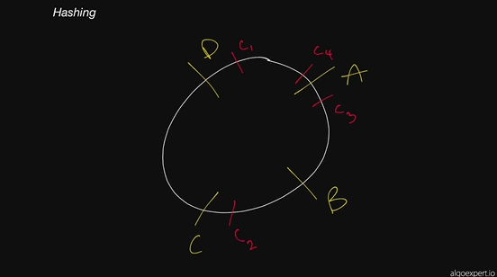
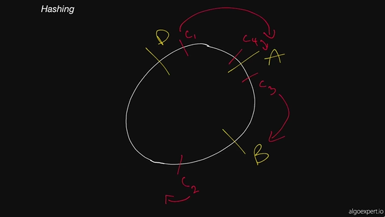
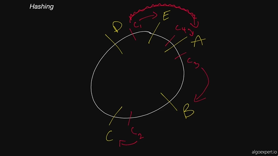
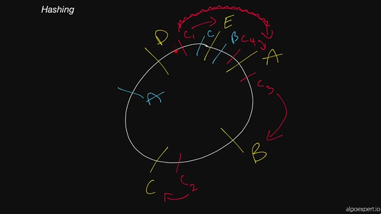
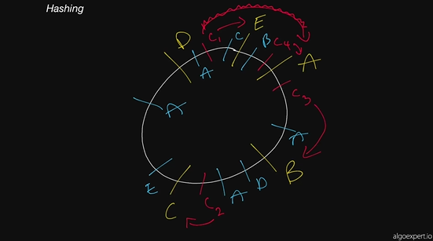
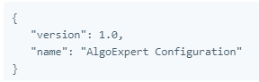
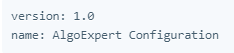
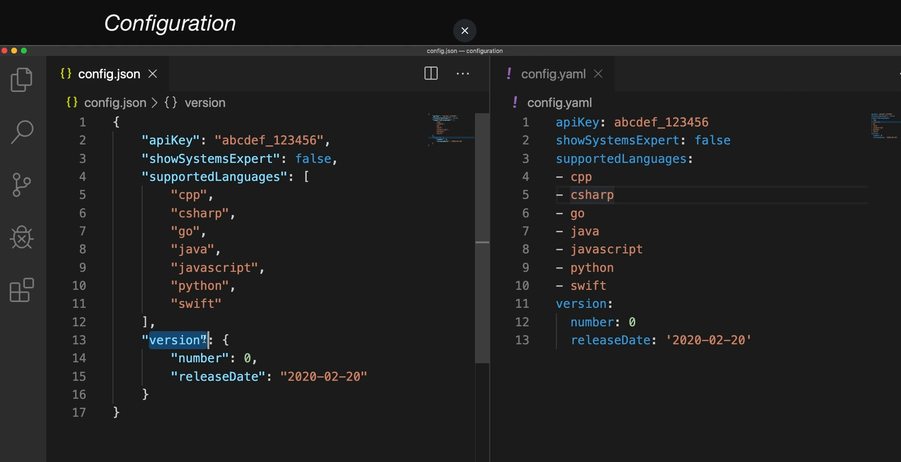

# SystemsExpert Notes
## Myles Thomas
### 5/12/2023
#### algoexpert.io
---


---
### Lesson 1: Introduction

Coding Interviews vs. Systems Design Interviews

Coding Interviews

- Tests ability to problem solve 

+ Data Structrures: somewhat necessary (for optimal answer sure, but no)

* A smart person could figure some out without prior experience


Systems Design Interviews

+ Requires a lot of knowledge about robust/scalable systems

* Design fundamentals = Absolutely necessary

    * A smart person could figure some out without prior experience

    * You can't begin to answers these questions without learning them

    * There are a lot of design fundamentals out there


---
### Lesson 2: What Are Design Fundamentals

Design fundamental questions: very vague questions

- The point is to take a 45 minutes to talk about things like this:

    - System

    - Characteristics

- Unlike coding questions, these are much more SUBJECTIVE

- You can use concepts incorrectly, but if you have the right understanding, you can confidently justify your choices for your system

    - "Defend your position"

Design fundamentals come in a lot of flavors, but 4 categories explain the most:

1. Fundamental Knowledge
    - Network protocols / how systems interactive
    - Client server model
1. Key Characteristics of Systems
    - Latency
1. Key Components
    - Load balances
    - Caching 
1. Actual Tech (Already existing / Real life tools)
    - Examples:  
        - Zookeeper
        - Google cloud storage
        - S3
    - This section is often-times overlooked!

Takeaways: 
- This stuff is hard and non-trivial
- Luckily, they have condensed the important stuff into a bite-sized format 

---
### Lesson 3: Client-Server Model
- Foundation of the internet
- The model is made up of a bunch of clients and servers talking to one another

Key terms: 

##### Client
A machine or process that request data or service from a server
- Single machines or piece of software can be both a client and a server at the same time
    - Example: A Single machine could act as a server for end users and as a client for a database

##### Server
A machine or process that provides data or a service for a client, usually by listening for incoming network calls

##### Client Server Model
The paradigm by which modern systems are designed
- consists of clients requesting data or service from servers and servers providing data or service to clients 

##### IP Address
An address given to each machine connected to the public internet 
- IPv4 address consist of 4 numbers separated by dots ie. a.b.c.d 
- All numbers between 0-255
- Special values:
    - 127.0.0.1: Your own local machine (localhost)
    - 192.168.x.y: Your private network (your machine and all machines on your private wifi network will have the 192.168 prefix)\

##### Port
In order for multiple paradigms to listen for new network connections on the same machine without colliding, they pick a port to listen on 
- A port is an integer between 0 and 65,535 (There are 2^16 ports total)
- Ports 0-1023 are reserved for system ports
    - "Well-known ports"
    - Shoulldn't be used by user-level processes
- Other examples of important ports:
    - 22: Secure Shell
    - 53: DNS lookup
    - 80: HTTP
    - 443: HTTPS

##### DNS: Domain Name System
Describes the entities and protocols involved in the translation from domain names to IP addresses 
- Typically, machine make a DNS query to a well known entity
- That entity is responsible for returning the IP address(s) of the requested domain name in the response 

My notes to the Video:

What happens when you go to AlgoExpert.io?
1. Client: my browser (I asked server for data)
1. Server: algoexpert.io (returns data to the client, my browser)
- Client doesn't know how to talk to Server
- Makes a DNS in order to find out the IP address
    - Now, the client (browser) knows what the server (algoexpert) is 
        - IP Address = Unique identifier for a machine 
1. Once the client gets the IP address and knows/understands the HTTP format...
- it knows that the client (browser) wants to look at the HTML of the server (algoexpert)
- The server (algoexpert) returns/replies to this request of looking at the HTML by sending back the HTML 
- Your browser (client) receives this response and renders it on your screen
 
Mailbox analogy
- IP address: mailbox to apartment complex
- Ports: apartment numbers
    - Mail writing to that mailbox has to note the port
    - If client wants to speak to a server with HTTP, picks that apartment number
- These numbers were decided on a very long time ago

---
### Lesson 4: - Network Protocols 
- IP packets
- TCP headers
- HTTP requests

- As daunting as they may seem, these low-level networking concepts are essential to understanding how machines in a system communicate with one another. And as we all know, proper communication is key for thriving relationships!

### Key Terms: 

##### IP - Internet Protocol: 
This network protocol outlines how almost all machine-to-machine communications happen in the world
- Other protocols built on top of IP: TCP, UDP, HTTP

##### TCP: 
Allows for ordered, reliable data delivery between machines over the public internet by creating a connections
- Built on top of IP
- Usually implemented in the kernel
- This exposes sockets to applications that they can use to stream data through an open connection

##### HTTP - HyperText Transfer Protocol: 
- Very common
- Implemented on top of TCP
- How it works:
    - Clients make HTTP requests, with schema such as:
        - Host: string ie. algoexpert.io
        - Port: integer ie. 80/443
        - Method: string ie. GET/SET/PUT/DELETE
        - Headers: pair list ie. "Content-Type" -> "application/json"
        - Body: opaque sequence of bytes
    - Servers respond with one of these responses, such as:
        - Status code: integer ie. 200/401
        - Headers: pair list ie. "Content-Length" -> 1238
        - Body: opaque sequence of bytes

##### IP Packet - Network Packet: 
- Besides bytes, is effectively the smallest unit used to describe data being sent over IP
- Consists of the following:
    - IP Header, which contains: 
        - source IP address
        - destination IP address
        - Other information related to the network
    - Payload: the data being sent over the network

### My Notes to the Video: 
- This is a topic that scares off a lot of people
    - network protocolos usually are low-level and not relevant to many engineers days
    - For interviews, they are quite simple
    - If you are beginner, this is good because you should have an "aha!" moment
- Example: network protocol = 2 people who vaguely know each other walk down a hall past each other
    - "Hey how are you"
    - This is a communication/network protocol
        - Between 2 machines, instead of human beings!
        - Communication between the 2 machines follows this "network protocol"
            - Kinds of messages
            - Format of messages
            - Order of messages
            - Whether or not there should be a response
            - How they are received by the other machine
 - Note: There are a lot of network protocols, you don't need to know most!
    - IP, TCP, and HTTP are the important 3

IP
- Modern internet runs on IP
- Data is sent as an IP packets
    - IP packets: building blocks of communication between machines over the internet 
    - IP packets are made up of bytes, and are 
    - 2 main sections of IP Packets: 
        - 1 - Header: useful information at the beginning (small, only 20-60 bytes!)
            - Source: ip address it is coming from
            - destination: ip address it is going out to
            - Total size of packet
            - Version of internet protocol it is operating on (Version 4 or 6)
                - "Difference Between IPv4 vs IPv6? most obvious difference is that IPv4 uses a 32-bit address while IPv6 uses a 128-bit address. This means that IPv6 offers 1,028 times more addresses than IPv4, which essentially solves the "running out of addresses" problem (at least for the foreseeable future)" (Source: https://www.google.com/search?q=ipv4+vs+ipv6&oq=ipv4+vs+&aqs=chrome.0.0i131i433i512j69i57j0i512l8.1997j0j7&sourceid=chrome&ie=UTF-8)
                - This can change things like the structure of how machine interprets it 
        - 2 - Data: Where information is stored 
            - IP packets are limited to be 2^16 bytes in size
                - May sound like a lot, but is only 65,000 bytes, which is 0.065 MB, aka tiny
                - Multiple IP packets will be packaged together
                - How does this work?
                    - When multiple packets are sent between machines over Internet Protocol (IP), it is possible for the following to happen:
                        - Packets get lost
                        - Packets get out of order
        - In a nutshell, multiple IP packets being sent togethr is where IP falls apart and we need TCP to built on top of IP to save the day!

TCP: transmission control protocol
- Built on top of IP 
- Sends IP packets in ordered way
    - Guarantees order of IP packets being received 
    - If they get corrupted or errors, we are let known and you can re-send in an un-corrupted way
- TCP is used in all web apps 
- Lets you send arbitrarily long/any amount of data to another machine 
- Note: Unless you work in networks/networking, not as important to know
- You could do an entire course for this topic
    - ie. not relevant for SWE or interviews
    - Important to know just the high-level details
- High level details that are important:
    - 1 - "TCP is built on top of IP"
        - If you have an IP packet, you have the following:
            - IP header 
            - IP data 
            - In this data portion of the IP packet:
                - TCP header, which contains information about ordering of packets
Note: core idea of TCP: When machine wants to communicate with another machine over TCP, it does the following:
- 1st, Creates a TCP connection with the destination computer/server
    - Example: browser wants to communicate with algoexpert servers
- This is a handshake, or a special TCP interaction where the following occurs:
    - Computer contacts the other by sending 1 or more packets saying "I want to connect with you"
    - Other computer responses saying "yes we can chat/connect"
    - Once connection agreed, both machines can send data back and forth freely
        - More on this:
            - If 1 machine doesn't send data for a long time, connection can time out
            - If 1 machine wants to end the connection, it will send something that ends the connection

TCP Takeaways:
- In a nutshell, more powerful wrapper around IP
- Downsides/what it is missing:
    - a robust framework that developers/SWEs can use to really define easy and simple to use communication channels for clients and servers in a system
- In TCP, all you are sending is arbitrary data that fit into IP packets
    - This is where HTTP comes into play!

HTTP (HyperText Transfer Portocol)
- Built on top of TCP
- Introduces a Higher level abstraction ie. the "request/response paradigm"
    - 1 machine sends a request
    - The other machine sends a response
- This request/response paradigm, with other rules, makes it easy for developers to create robust and easy to maintain systems:
    - Robust: it keeps stability and performance without using adaptation methods ie. coping strategies
    - Easy to maintain: Readable, high quality code that is well-documented
- This is why most modern-day systems nowadays rely on HTTP protocol for communication
    - Forgot about IP packets
    - Forgot about TCP
    - Focus on HTTP requests and HTTP responses
        - Request: Machine wants to interactive with other machine
        - Responses: How machine reacts to response

- Objects of Requests and Responses and their important fields:


httpRequest: 
- Host: describes destination server's host
- Port: describes destination server's port
- Method: Purpose of request
    - ie. GET/SET/DELETE are typically guidelines for implementation of the method
- Path: Where you start to have logic in the server
    - Ie. '/payments' (server may have multiple paths for different servers)
        - Clients may issue requests to different servers with different methods
- Headers: collection of key value pairs with type/length info
    - Content type: type of the body
    - Content length: length of the body
- body: The actual data request that gets sent to the server
    - Ie. "data" : "This is a piece ofdata in JSON format." 
httpResponse: 
- Status code: describes the type of response 
- Examples:
    - 404: data was not found
    - 403: data is forbidden / you don't have access
    - You can use the guidelines or ignore them, up to you 
- Headers: Key value pairs with type and length info
- body: The actual data sent to the server

How Clement runs an HTTP transfer example (of a client interacting with a server, using javascript's express):
Link to Google Doc that explains how to do all of this!
- https://docs.google.com/document/d/1Ncs9CcpymBbGECgkZfapoAlVzzzgfOqLNq2Ixyn6yGI/edit?usp=sharing

Takeaways:
- IP, TCP, HTTP are all 3 very important for the internet
    - IP and TCP: Data transfers only 
    - HTTP: Introduces the opportunity to add business logic 
        - More logic is needed for large scale systems
        - Implementation of error handling, etc.
- IP and TCP are much more low-level
- HTTP is more more relevant for business. 
- Need to know the following:
    - Requests/Responses 
    - Methods 
    - Path names

---
### Lesson 5: - Storage

### Key terms: 

##### Databases: 
Programs that either use disk or memory to do 2 cores things:
1. Record Data
1. Query Data
- Databases are long-lived and interact with the rest of your application through network calls (with protocols on top of TCP, or even HTTP)
- Some databases: Keep records in memory
    - The users of these Databases are aware that those records could disappear forever
- Most databases: Write to Disk
    - Anything written to disk will remain through power loss, network partitions (pretty much will keep it permanently no matter what)
    - Machines die pretty often in a large scale system, so special disk partitions or volumes are used by the databases processes
        - Those volumes can get recovered even if the machine goes down permanently

##### Disk: 
- Usually refers to one of the following:
1. HDD (Hard-disk drive)
1. SDD (Solid-state drive)
- Data written to disk will persist problems and is known as non-volatile storage

SDD vs. HDD
- SDD:
    - Faster (lower latency)
    - More expensive
    - Used for data that is frequently accessed and/or updated
- HDD:
    - Slower
    - Cheaper
    - Used for data that is rarely accessed and/or updated

##### Memory: 
- Short for RAM (Random Access Memory)
- Data stored in memory will be lost when the process that has written that data dies
    - Example: The Kernel for Jupyter 
    - Good to know: Virtual Memory/Virtual Ram vs. Physical Memory/Ram
        - RAM is faster, more expensive
        - Virtual memory is only used when RAM is filled 	

##### Persistent Storage: 
- Usually a reference to disk
- In general, any form of storage that persists if the process in charge of it dies
- Good to know: Disk vs. Memory
    - Memory is what the computer stores temporarily
        - When you save a file, it transfers from being 'Memory' into being 'Disk/Storage'
    - Disk is permanent storage

### My notes to the Video: 
- If you think of any system, it will need some form of storage for information/metrics, and that is what a database is for
- Database pairs for data that are synonymous and mean the same thing:
    - Store/Retrieve
    - Write/Read
    - Get/Set
- Misconception about database: It is a magic opaque box that lives somewhere in the ether
- In reality: A server ie. you can make this local computer set up to be a server that can people can read data from, and write data to

Persistence: The assumption data will make it through outages
- Disk: Save a file permanently to your local disk
- Memory: Temporarily existing data that we could possible lose

Example: Simple example of data server that Clement cooked up for us:
Link: 
https://docs.google.com/document/d/1rDz2rpQn12Ob6xQ3CCNwu3SYDqnssPQDBMpVP-9NIEU/edit?usp=sharing

- After this simple example, you may think databases are easy (not true!)
    - Storage is very complicated
    - Lots of depth and breadth to this subject
    - 100's of database offering out there
        - Google Platform has 8 different offerings!
        - We have touched important stuff for system design interviews, but there is way more

- Why are there so many offerings?
    - Different databases do different things (storing on disk/memory is easy and all do that)
    - Structure of data (relation)
    - Availability (uptime of system)
        - If database goes down, system could effectively go down
    - Distributed storage
        - 1 machine vs. 2+ machines
        - You don't want your entire system to get brought down if 1 system goes down
        - Do you split it up or replicate across machines?
    - Consistency issues
        - Staleness/up-to-dateness 
        - If it is across machines, will you always get the most up to date/fresh data?
In a nutshell:
- Complex subject area
- The 100's of database offerings have their own properties (can't have all the pros!)

---
## Lesson 6: Latency and Throughput

### Key terms:

##### Latency
- The time it takes for a certain operation to complete
    - ie. data to go from point a to point b 
- This is often measured in time duration

##### Throughput
- The number of operations that a system can handle properly per time unit
    - Can be measured in requests per second (RPS/QPS)

### Notes from the video:

Latency and Throughput are the 2 most important measures of the performance of a system 

Latency: How long it takes data to traverse a system ie. get from 1 point to another
- time to get from server to client and back
- time to read data from memory or disk
- different things in systems have different latency
- There are tradeoffs between _ ie. some are faster and some are slower

Examples of latency times for common operations: 
- read 1 megabyte from memory: 1 unit (250us)
- read 1 megabyte from ssd/solid state driver, which is smaller and faster than hard disk drive: 4 units (1000us)
- send network request for api calls, sending 1mb data takes 40 units (10,000us)
- reading 1mb data from hdd/hard drive: 80 units (20,000us)
- sending a packet, which is smaller than 1mb, from CA -> Netherlands -> CA: 600 units (150,000us)

For the most part, you will want to optimize your system by optimizing/minimizing latency
- not all systems will need this, but some will
- examples: 
    - video games: latency matter A LOT for online gaming
    - server you are playing on halfway across the world can take awhile to make requests to the server
    - websites: latency does not matter as much
        - may not care about page loading for 5 seconds as long as the page ends up showing accurate information / never has crahses or failures

Note: as you go through systems design interviews, you will have to make a list and start thinking of tradeoffs
- latency is a big one 

Throughput: how much "work" a machine can do in a given period of time 
- computing usually measured in "how much data can be transfered from point a in the system to point b, in a given amount of time" 
- ie. 1 gigabit per second or 1,000,000 bits per seconds 
    - in systems design interviews AND in general

Example: a server with not just 1 client, but 5 or 1000's of clients making requests
- requests coming from all over the place.... how many can this system handle in 1 second?
    - reduce the question to bits: how many bits can this server let through per second
    - think of a clock/bottle neck where only a certain amount can fit

How to improve throughput to optimize system?
- simple, you pay for it 
- the #1 thing that determines how much can go in and out of algoexpert's servers in 1 second is determined by their cloud provider (google cloud services)
    - in theory, you can always pay google to bump up/improve throughput 
    - Note: just because you increase throughput, doesn't mean you will solve all problems with a system!

Example: google search / facebook messenger 
- suppose there are 1,000,000's of requests per second, a bottleneck still exists at some point!
    - this is where you have a "contrived" system where multiple servers handle the requests

Closing thoughts on latency and throughput: 
- they are not correlated
    - you cannot make assumptions on latency OR throughput based on the other (even though they are related and both very important to a system's performance, still different entities)
    - example: you have extremely low latency (good) but then you have low throughput (bad) so it doesn't end up mattering 


---
## Lesson 7: Availability

### Prerequisites 

##### Process: 
A program that is currently running on a machine
- You should always assume that any process can be terminated at any given time
    - especially if the system is large

##### Server: 
A machine or process that provides data or a service for a client, usually by listening for incoming networks calls/requests
- Note: 1 single machine OR piece of software can simulataneously act as the server and client 
    - Exampmle: my machine could be a server for end users and a client for another database 

##### Node/Instance/Host: 
A virtual or physical machine on which the developer runs processes
- (These 3 terms refer to the same exact things most of the time)
    - "Server" also refers to this concept, at times

### Key terms

##### Availability: 
The odds/probability of a particular service/server being up and running at any point in time 
- Measured in percentages i
- A server with 99% availability will be operational 99% of the time you interact with it 
    - This would be describes as having 2 "Nines" of availability 


##### High Availability: 
Systems with particularly high levels of availability, typically 9 "Nines" or more 
- Abbreviation: "HA"

##### Nines: 
Refers to percentages of uptime 
- Example: 5 Nines of availability means an uptime of 99.999% of the time.
    - Below, more examples of the downtimes expected per year (depending on those 9s)
    - 99% (two 9's): 87.7 hours per year 
    - 99.9% (three 9's): 8.8 hours per year 
    - 99.99% (four 9's): 52.6 minutes per year 
    - 99.999% (five 9's): 5.3 minutes per year 

##### Redundancy: 
The process of replicating parts of a system, in order to make it more reliable

##### SLA (Service-level agreement): 
a collection of guarantees given to a customer by a service provider
- SLAs typically make guarantees on a sytem's availability (among other things)
    - SLAs are made up of one or more SLOs

##### SLO (Service-level objective): 
a guarantee given to a customer by a service provider
- SLOs typically make guarantees on a system's availability (among other things)
    - SLO's make up/constitute into 1 SLA agreement

### Notes from the video:

Reminder: When evaluating a system, here are 2 things to consider: 
- latency
- throughput

- Let's add another to that list: Availability

You can think about systems a few different ways:
- fault tolerance: how resistant it is to failures ie. if 1 server/database fails, will the entire system go down?
- a: the % of time in a given time period ie. 1 month/1 year that all primary functions are satisfied

Note: nowadays, most systems have an implied "guarantee" of very good availability
- Example: algo expert. you purchase access to the content, but there is an implied understanding that it will always be available 
    - if you were to long on and all/certain features or data were not showing up for 2 hours, you would not be happy!
        - would lead to losing money/customers
         - bad publicity

Varying degrees of availability to expect from systems
- Example: AlgoExpert
    - Would be upsetting, but not the end of the world
- Example: Airplane software 
    - Would be unnacceptable and could lead to deaths 
    - You would expect a VERY HIGH availability
- Example: Youtube or Amazon Web Services
    - This would affect tons and tons of people 
        - in 2019, google cloud platform affected 1000's of businesses

How do you measure availability?
- % of a system's up-time in a given year
    - Facebook or Uber being down 50% of the time would be awful
    - Even 90% would be awful
    - We end up measuring it in Nines

Availability in Nines: 
2: 99.0%
5: 99.999%
9: 99.9999999%

- Once you get into 3-4 Nines, you start to see decent numbers
    - High availability (HA): 5+ Nines

Availability is really important to end users and system designers
- Because of this, it is not implied, but guaranteed availabilities
- This takes us to SLAs

SLA (Service level agreement)
- Written agreement of between the service provider and the client/end-user
    - "We guarantee that our servers are up x % of the time"
        - This is an example of part of an SLO
- Established products like AWS or Google Cloud will have clearly stated SLAs
    - SLAs will explain to customers what happens when SLA is broken 
        - Oftentimes, will mean the service provider has to pay the users something

SLO (Service level objective)
- The individual objectives that makes up an SLA
    - Think 1 singular page/section of an entire lawyer's contract


Tradeoffs
- It is not always the case that you need 5 Nines of Availability!
- It is difficult to achieve high availability, which causes you to make tradeoffs for less than stellar performance in other areas of your system
    - Examples: 
    - Higher latency (data takes longer to get from point 1 to 2)
    - Lower throughput (less data can be sent per second)

Example: Strike
- Provides payment services for businesses
    - AlgoExpert uses it for everything that is paid for besides Paypal transactions
- Parts of system that require high availability ie. core services: 
    - Handling payments 
    - Charging customers
        - Could have really bad problems for provider/users if this goes down!
- Less important parts: 
    - Dashboard that shows/monitors sales
        - If this went down, it is not the end of the world

Takeaway: "What parts of my systems would be OK to fail?"


How do you make a system highly available?
- Make sure there is not Single points of failure
    - This is where Redundancy comes into play

Redundancy
- The act of duplicating/tripling/etc. parts of a system
    - If 1 server goes down in a single-server system, the entire system is done for
    - If 1 server goes down in a 1,000 server system, the system is good probably
- Load balancers are used to avoid having single points of failure
    - You even need to have redundancy with load balancers ie. have 3 load balancers 
        - AlgoExpert has 5 

- Passive Redundancy
    - When you have multiple components, if any of the components die, nothing will happen
    - Example: 1 server of a 3 server system goes down
        - While 1 is being fixed, 2 and 3 take on a bigger load in the meantime and all is good
    - Example: 1 engine of an airplane goes down, the other can keep it going 

- Active Redundancy 
    - Only 1 or a few of the machines is going to be handling traffic and/or doing work
        - If the 1 machine doing work goes down, the others that were NOT doing work will start doing work 
            - Example: System of 5 machines where only 1 at a time is working
                - If 1 dies, 1 of the other 4 will take over 
    - This goes into "Leader election"
        - The simple idea of giving 1 thing (a host/server) special powers 

Takeaways: 
- Eliminate single points of failure with redundancy
- Make sure to have rigorous processes in place to deal with the situation of a system failure
    - Human intervention will be needed at times
     

## Lesson 8: Caching 

Punching bag + Caching
"They can both take a hit"

### Prerequisites:

##### Latency
- The time it takes for a certain operation to complete
    - ie. data to go from point a to point b 
- This is often measured in time duration

##### Throughput
- The number of operations that a system can handle properly per time unit
    - Can be measured in requests per second (RPS/QPS)

##### Memory
- Short for RAM (Random Access Memory)
- Data stored in memory will be lost when the process that has written that data dies
    - Example: The Kernel for Jupyter 
    - Good to know: Virtual Memory/Virtual Ram vs. Physical Memory/Ram
        - RAM is faster, more expensive
        - Virtual memory is only used when RAM is filled 

### Key Terms:

##### Cache
A piece of hardware or software that stores data, typically meant to retrieve that data faster than usual
- Often used to store responses to network requests
- Also results of computationally-long operations
- Note: data in a cache can become "stale" if the main source of truth for that data (ie. the main database) gets updated and the cache does not

##### Cache Hit
When requested data is found in a cache

##### Cache Miss
When requested data could have been found in a cache but is NOT
- typically used to refer to a negative consequence of a system failure or of a poor design choice 
- example:
    - "if a server goes down, our load balancer will have to forward requests to a new server, which will result in cache misses"

##### Cache Eviction Policy
The policy by which values get evicted or removed from a cache
- Popular cache eviction policies:
    - LRU (least-recently used)
    - FIFO (first in, first out)
    - LFU (least-frequently used)

##### Content Delivery Network
A CDN is a 3rd party service that acts like a cache for your servers
- Sometimes, web apps can be slow for users in a particular region if your servers are only located in another region
- A CDN has servers all around the world
    - The latency to a CDN's servers will almost always be better than latency to other servers
- The CDN's server's are often referred to as PoP's (Points of Presence)
    - Two of the most popular CDN's:
        - Cloudfare
        - Google Cloud CDN

### Notes from the video:

Caching is one of the most important topics in system design interviews
- You will use it in almost all interviews
- If you have done any algoexpert problems, you have problem used caching
    - You do it to avoid re-doing operations + improve time-complexity

To put it simply:
- Caching is used to speed up a system (Reduce latency)
- The way to design a system so that we can replace operations that are expensive like network requests/data transferws
    - Storing data in a place that is different from its original place, such that it is faster to access it in the new spot
        - Can be used in a BUNCH of different places in a system
        - Examples: 
            - Client-level: Client caches some data so they don't have to go to the server 
            - Server-level: Client always need to interact with server, but server can have a cache between server and client
            - Hardware-level: CPU caches that make it faster to retrieve data from memories
                - Less important in system design interviews

Context of Systems Design interviews, where instances of caching is really helpful
1. You are doing a lot of network requests
- You want to avoid doing all of these requests
    - Example: Client > Server, Server > Database, Database > Server, Server > Client (client can now do stuff with the data)
        - Cache could speed it up to be this: 
            - Cache at client level
            - Cache at server level
1. You are doing a computationally long operations
- You want to only perform these operations 1 time
1. Operations that are done a ton of time
- You have multiple servers all interacting with the database in the same way
- Not necessarily to speed up the server
- Example: A bunch of clients are all going to the same celebrity's page
    - You don't want to read from this database 1,000,000 times
    - The servers will have cache where the profile is saved (avoids reads at a database level)

Concret Examples of Caching in Actions
1. AlgoExpert coding interview questions
- First time you go on that page, it will have a loading icon
    - If you go on another page, and come back, the questions list is pre-loaded
        - They have cached the questions list on the client
            - They know the questions page is constant and is not going to change, so instead of making a server request every time, you get a faster experience on the website
1. Running code blocks on AlgoExpert
- Average takes 1 seconds (lots of stuff behind the scenes)
- When using solutions that they are have solutions to, no matter who is running the code 
    - Don't need to run the code again because the correct value has already been cached
    - When running code you are making a network request, Where is this cache located?
        - Server-level
            - Redis (popular in-memory database for key-value store)
            - How this works: Client goes on algoexpert > Run code with one of their solutions (This sends HTTP request to AlgoExpert servers) > AlgoExpert servers say "hey we have this request (which is a bunch of bytes), we are going to hash it down to a single integer, then check out cache to see if it already exists in-memory on the server here" > If the key is on Redis, we take the value and return it to the client
                - This is how you use the value on the cache (instead of having the server run the code)

Example: Clement codes up a database file and a server file 
Link to my instructions on how to do this myself: 
https://docs.google.com/document/d/1s7LyboaDUrVthFzmJSE8SjvOi6W7B7cRr7r0D9KYXBI/edit?usp=sharing

At this point, we have only looked at examples of where we are READING data
- What about caching for when we need to WRITE data?

Writing w/ Cache
- We are designing a web app/system where uses can read AND WRITE and EDIT posts (think of Facebook/LinkedIn)
    - Client: browser that you interact with 
    - Server: when you write a post, you make a request to this server to write / edit
    - Database: when you write OR edit a post, the server interacts with the database
- Let's say you want to cache these posts,you now have 2 sources of truth in this system: 
    - Source of truth #1: database
    - Source of truth #2: server's cache
- Example: 
    - Client makes network request to the server for the post
    - Server made requests to database to store the post 
        - It gets posted/displayed on the website's page
    - Somehow the post gets stored in the server's cache
        - This takes us to 2 different types of caches

1. Write-through cache
- When you write a piece of data, your  system writes to the following at the same time:
    - database (the main source of truth)
    - cache
- Example: You want to make an edit to an already existing post because there is a typo
    - You make a request to the server 
    - Server overwrites what is in the cache
    - Server makes a request to the database to overwrite what is in the database
        - Upside: Cache and database are always in sync
        - Downside: You still have to make a request to the database (not optimal for time complexity)
            - There are types of cache's where you do not need to make network calls or interact with the database at all
1. Write-back cache
- Only the cache gets updated
- Behind the scenes, your system will 'asynchronously' (at a different time) update the values stored in the cache
    - This can happen a couple of ways: 
        - Over an interval of time ie. every 5 minutes
        - When the cache gets full (cache eviction)
- Example: You want to make an edit to an already existing post because there is a typo
    - You make a request to the server 
    - Server only overwrites what is in the cache
    - Server makes a request to the database to overwrite what is in the database
        - Upside: You go right back to the client and do not need to make a request to the database 
        - Downsides: Cache and database are not in sync
            - If something happens to your cache before the lose data in the cache, you will lose the data
                - This is really bad, but there are ways to mitigate this

Example: We are desinging the system for Youtube's comment section
- We have a bunch of servers
    - Every server caches the comments on that video
- We have a bunch of clients who interact with these servers
    - when they read from the comments, they read from the respective caches
- Hypothetical/Let's say:
    - client 1 posts comment to video 1
    - client 2 visits video 1
        - server goes to database to fetch comments, stores in cache
        - time lapses...
    - client 1 edits initial comment to video 1
    - client 2 visits video 1 again and replies to the comment made by client 1
        - because the server for video 1 already has a comment in cache memory, it doesn't go to the database to receive the most up-to-date comment. 
            - this is a problem because client 2 has now replies to an out-of-date comment made by client 1
            - Replying to stale comments would be unnacceptable for a system with written like this

Concept: Staleness
- Caches can become stale if they haven't been updated properly
    - Youtube example: would be a bad system because client would often be dealing with caches holding stale data 
    - A remedy could be moving the cache out of the servers and into the 'middle' so there is 1 single cache
        - all of the servers go to this single cache for a "single source of truth"
- Certain features, staleness is not going to matter:
    - Example: view count of youtube videos 
        - Not the most important thing on the page
        - If 1 client sees a stale view count, that is not really the end of the world

For system design interviews:
- Do we care about the accuracy of our data/if it is staleness and consistency?
    - Are we able to properly validate/remove stale data in our caches (especially in a distributed system)
- Is our data static/immutable or dynamic/mutable?
- Is a single thing reading/writing data or are multiple things?


Caching Takeaways:
- Caching is great. Rule of thumb:
    - Static/immutable data: Caching is great
    - Editable/mutable data: Caching is tricky (data exists in 2 spots)
- Unfortunately, caching has pitfalls we need to watch out for 
    - Staleness and inconsistencies

Final point on caching: Eviction policies of caching
- "How do we actually get rid of data in the cache?
- what policies and rules do we follow?
    - We do not have unlimited space in the caches
    - Examples of policies: 
        - LRU: Least recently used ie. remove the oldest data in the cache (Assumption: old data is irrelevant)
        - LFU: Least frequently used ie. you have a bunch of data in your cache, remove the data you used the least (Assumption: data you don't use much is irrelevant)
        - LIFO: last in, first out 
        - FIFO: first in, first out 
    - There are many different ways to evict data from a cache
        - Depends on use-case/product/system


---
## Lesson 9: Proxies 

Often used by 'nefarious' evil hackers to conceal their identity and 'obfuscate' hide their location, these special intermediary servers boast many important real-life applications ithin the following contexts: 
- Caching 
- Access control
- Cencorship Bypassing
- More!

### Prerequisites:

##### Client
A machine or process that request data or service from a server
- Single machines or piece of software can be both a client and a server at the same time
    - Example: A Single machine could act as a server for end users and as a client for a database

##### Server
A machine or process that provides data or a service for a client, usually by listening for incoming network calls

### Key Terms:

##### Forward Proxy
A server that sits between a client and servers and acts on behalf of the client 
- Typically, used to mask the client's identity/IP address
- Note: Forward proxies are often referred to as just "Proxies"

##### Reverse Proxy
A server that sits between a client and servers and acts on behalf of the servers
- Typically, used for the following: 
    - Logging
    - Load balancing
    - Caching

##### Nginx
A very popular webserver that is often used as a reverse proxy AND load balancer
- Pronuncation: "engine X"

### Notes from the video:

Proxies are a very important/fundamental topic to systems design
- Simple to understand
- They sounds cool
    - probably have heard it in a movie

One important note: 
- Proxy: Forward Proxy
    - In the industry, people loosely use the word "proxy" so they assume "proxy" is "forward proxy" 

Forward Proxy
- A server that sits in between a client (or clients) and a server (or set of servers)
    - Can help the client hide their identity to access restricted servers/websites that are unavailable to your country/organization/etc.
    - "On the client's team"
        - Assuming the forward proxy has been set up correctly, if Client A issues a request to the server, it will first go through the forward proxy, then the server 
        - "Hey forward proxy, communicate with the server for me"
        - When the server replies to the proxy, the proxy will then send that response to the client
    - The forward proxy can be used to hide the client's identity
        - The source address of the client (A) is hidden because source address of the Proxy (P) is what shows up when making requests to Server (S)
    - Note: There are types of forward proxies that still can give up the IP address of the client up to the server
    - This is how essentially how VPN works
        - "A VPN is similar to a proxy, but instead of working with single apps or websites, it works with every site you visit or app you access."


Backward Proxy
- A server that sits in between a client (or clients) and a server (or set of servers)
    - When the client makes requests to the server, it has no idea that it is actually going to a backward proxy
    - Whereas forward proxy acts for client, backward proxy acts for the server ie. "On the server's team"
        - If the backward proxy has been configured correctly by the server/entity that owns the server, the request will go from client > reverse proxy > server
            - The client will not know there are 2 entities
            - The DNS query will return the address of the reverse proxy (not the actual server)

When designing complex systems, proxies (especially reverse proxies) are very useful. How useful are proxies?

- Reverse Proxies: 
    - Best example of a reverse proxy: Load Balancers
        - In a nutshell, Load Balaners can distribute 'request load' among servers
            - Example: You have a very complex systems with multiple servers. Your load balancer/reverse server distributes requests among different servers according to a certain pattern
                - Can ensure/deal with malicious clients that may be overloading a server with a ton of requests
    - Other examples: 
        - Filter out requests that you want to ignore
            - Example: You don't want your system to deal with certain kinds of requests
        - Logging system
        - Grabbing metrics
        - Cache certain things
            - Example: HTML pages

- Forward Proxies: 
    - 

Example: Node.JS server with NGinx
- NGinx: a web server that can be used as a reverse proxy/load balancer
    - This example sets up a reverse proxy that can overwrite/mutate the headers of a request
        - It does not affect what the client/user gets on their screen, but whoever set up the server gets more information than they normally would:
            - localhost3000: Client accesses Server (regular)
            - localhost8081: Client accesses Load Balancer/Reverse Proxy, which appends values to the header, and then directs the client to the server at localhost3000 (new way)
            
Instructions on how to set this up: 
https://docs.google.com/document/d/1xhDgzKvkTUhOFpDz2z2WZZqMcIG4sqCTSekGl32d_Pw/edit?usp=sharing

Takeaways on Proxies:
- Not that complicated
- Very powerful!


---
## Lesson 10: Load Balancers 

"Digital Traffic Cops"
- Load Balancers act as watchful guardians for your system
    - They ensure it operates at peak performance, day AND night

### Prerequisites:

##### Reverse Proxy
- A server that sits between clients and servers and acts on behalf of the servers, typically for one of the following:
    - Logging
    - Load balancing
    - Caching

### Key Terms:

##### Load Balancer
A type of reverse proxy that distributes traffic across servers
- Can be found in many parts of a system, including:
    - DNS layer
    - Database layer
    - And more!

##### Server-Selection Strategy
How a load balancer chooses servers when distributing traffic amongst 2+ servers
- Commonly used strategies: 
    - Round-robin
    - Random selection
    - Performance-based section
        - Examples: 
            - Fastest response time
            - Least amount of traffic
    - IP-based routing

##### Hot Spot
When distributing a workload across a set of servers, that workload might be spread unevenly. 
- This creates a hot spot!
- How it occurs:
    - Your sharding key is suboptimal
    - Your hashing function is suboptimal
    - Your workload is naturally skewed ie. some servers will receive a lot more traffic than others

##### Nginx
A very popular webserver that's often uses as a reverse proxy and load balancer
- "engine-X" (https://www.nginx.com/)

### Notes from the video:

Intro to Load Balancers
- Extremely important
- Used in almost every system
- Comes up in nearly every system design interview

Example using a very simple system:
- Client: Sends/Issues requests to server
    - We have 4+ clients, and one of the clients is issuing multiple requests to the server
- Server: Receives requests from client ie. fetch from databases, sends responses
    - Our server has limited resources to respond to requests (limited throughput)
    - The more requests, the more likely we are to overloading ie. have more requests than it can handle, which leads to the following:
        - Failure in our system
        - Slowdowns in our system
    - How do we improve our system? Scaling. What kinds of scaling?
        - Vertically scaling: Increase the power in our 1 server
            - This is limited because there is only so much we can do to boost the power/performance of 1 server
        - Horizontally scaling: Add more machines/servers to our system
            - Obvious solution - assuming each server has similar/same power, we can 4x the system's power
            - This would assume each client is issuing similar # of requests/balanced distribution of requests, which is not always the case!
                - This is where the load balancer comes in to save the day, allowing us to properly horizontally scale!
- Load Balancer: Server that sits between set of clients and set of servers
    - Job = balancing workload across resources/servers/rerouting traffic evenly
        - Clients issues requests to load balancer, load balancer decides which server(s) get which tasks to do
            - There are a number of ways/methods/common procedures to divvy up the work, more on this later
    - Not only does it prevent a single server from getting overloaded, but it also makes overall system improve in the following ways:
        - Better throughput: servers won't be overloaded
        - Better latency: servers will be able to respond faster since they won't be bogged down
        - Better use of resources: if you are adding servers, the load balancer will know to make use of these new resources
    - It is a type of Reverse Proxy most of the time
        - They act on behalf of the servers!

    - Can be in multiple different places in a system, such as:
        - Client > Load Balancer > Server
        - Server > Load Balancer > Database
        - Client > Load Balancer > DNS Server (dealing with websites - you type in algoexpert.io, browser makes DNS query to locate IP address for that domain name)
            - DNS round-robin: A type of load balancing at DNS layer
                - Single domain name gets multiple IP addresses, when DNS query is made to get IP addresses of that domain name, the multiple IP addresses associated w/ that domani name are returned in a load-balanced way

Example w/ 2 Command Lines and the 'dig' command:
Instructions on how to replicate this: 
.......a
zzalsdlkdjkl

1. Terminal 1: 'dig' command to get IP address of google.com: dig google.com
- IP = 172.217.10.14
1. Terminal 2: 'dig' command to get IP address of google.com: dig google.com
- IP = 172.217.10.238
    - Why are they but google.com but different IP addresses?? 
        - Use curl commands to see
1. Terminal 1: 'curl' to find domain associated w/ the IP address: curl 172.217.10.14
- We get google.com
1. Terminal 2: 'curl' to find domain associated w/ the IP address: curl 172.217.10.238
- We get google.com (again)
- What does this mean?
    - Load Balancing is in play!
        - The same domain name (google.com) is associated with 2+ IP addresses
        - 2 different terminals (different clients) got served 2 different IP addresses

Quick note: software load balancers vs. hardware load balancer (they are very different)
- Hardware load balancer: Physical machine dedicated to load balancing
    - Limited the the hardware you are given (and hardware is expensive)
- Software load balancer: Program dedicated to load balancing
    - Main difference: You can do more with the software load balancer
        - More power of custominzation, scaling 
        - These are the load balancers we will focus on/go over today
    
How does the SOFTWARE load balancer distribute load/traffic to the servers? (algorithm, etc.)
1. How does it know that it has servers to distribute traffic to?
- Example: A new server is added - how does it know that this new server is something that it can route traffic to?
- The owner/creator of system can configure so that the load balancer and server will register/de-register when adding/removing
1. How does it select servers to send traffic to?
- Lots of ways to do so, such as:
    - Pure randomization: The easiest, exactly what it sounds like
        - Pros: easy
        - Cons: could cause problems with 1 server being overloaded 
    - Round robin: method that goes through all servers in 1 order from top to bottom, then repeat (ie. 1 > 2 > 3 > 1 > 2 > 3 > ...)
        - Pros: ideally, you equally distribute traffic across servers
        - Cons: 
    - Weighted Round robin: Round robin ordering, but you put weights on specific servers so that they get more/less traffic re-directed to them
        - Pros: great for when you have 1 server that is more powerful than the other servers
        - Cons: 
    - Performance/load: 
        - This strategy is a bit more involved 
            - Load balancer performs 'health checks' on your server so it knows the following: 
                - How much traffic the server is handling, at any given time
                - How long it takes to respond to traffic
                - How many resources the server is using
        - Based on that, it will assign traffic accordingly
            - Example: Load balancer sees a server is performing very well, it will re-direct more traffic to this server
        - Pros: 
        - Cons: 
    - IP-based server selection: When load balancer gets IP address from client, it hashes the IP address
        - Can help you maximize your cached requests
        - Depending on the value of the hashed IP address, it re-directs traffic for you 
            - Example: IP address of a client is hashed to 1, load balancer will direct traffic from this client to server 1 
        - Pros: Can be very useful if you have caching going on 
            - Imagine you are caching results of requests in your servers, it would make sense/be helpful to have requests from a specific client go to the server where their requests have already been cached!
        - Cons: 
        - If you ever want to deploy big changes to a service, it only affects servers that have to do with that service
            - Example: If algoexpert wants to make changes to code execution engine, the changes only affect the server(s) handling the code execution engine
                - Payment servers for example, are not affected, even if the code execution servers start failing
1. As you can see, there are a lot of options for selecting a method of routing traffic through your load balancer to servers
- When designing systems, you want to keep this in mind for your use-case
    - This may be multiple load balancers that use different server-selection strategies


Contrived Example:
- Brand new system
    - 3 clients 
    - clients requests go to load balancer #1
    - load balancer #1 sends requests to load balancers #2 and #3
        - Load balancer #1 distributes to servers based on IP addresses
            - Client 1 requests: LB #1 sends to top LB #2
            - Clients 2-3 requests: LB #1 sends to bottom LB #3
    - load balancers #2 and #3 distribute workload to servers 1-4 based on round-robin 
        - Client 1 requests via Load balancer #2: sends to Servers 1-2
        - Clients 2-3 requests via Load balancer #3: sends to Servers 3-4

What happens if a load balancer itself gets overloaded?
- This is where a 2nd/3rd load balancer can come in
    - 2 and 3 can communicate with each other to decide how to re-route traffic


Very Simple/Cool Example of Clement's Load Balancer using  (similar to Proxies example)
- Using port variable from 'env', instead of hardcoding it 
    - This allows use to set our port while making the curl call in command line ie. 'PORT=3000 node server.js'
- 3 terminals windows:
    - 1: PORT=3000 (has weight=3 ie. weighted-round robin method)
    - 2: PORT=3001
    - 3: PORT=8081
        - When making requests to this port 8081, about 3x as many will get routed to Port 1/3000 than Port 2/3001
    
    - Instruction on how to do this: 
    - Link: 
    
Takeaways - Load Balancers:
- Load Balancers are the following:
    - simple
    - critical to large-scale systems 
    - almost certainly will use them in systems design interviews!


---
## Lesson 11: Hashing 

### Prerequisites:

##### Hashing Function
A function that takes in a specific data type (string, identifier, etc.) and outputs a number
- Different inputs can have the same output potentially
    - A good hashing function attempts to minimize this occuring (otherwise known as "maximizing uniformity")
        - This is called a "hashing collision"

##### Load Balancer
a type of reverse proxy that distributes traffic across servers.
- can be found in many parts of the system, such as: 
    - DNS layer
    - Database layer


### Key Terms:

##### Consistent Hashing
A type of hashing that minimzes the number of keys that need to be remapped when a hash table gets resized
- often used by load balancers to distribute traffic to servers
    - it minimizes the number of requests that get forwarded to different servers when new servers are added (or when existing servers are brought down/removed)

##### Rendezvous Hashing
- A type of hashing that allows for minimal re-distribution of mappings when a server goes down
- Also coined "highest random weight hashing"

##### SHA (Secure Hash Algorithms)
- collection of cryptographic hash functions used in the industry nowadays
    - SHA-3 is currently a popular choice to use in a system

### Notes from the video:

Types of hashing:
1. Original Hashing
1. Consistent Hasing
1. Rendezvous Hasing

Intro to Hashing
- To put it simple, hashing turns data into an integer value
    - It can be IP address, HTTP requests, and more

Example:
- 4 clients
    - makes a lot of computationally expensive requests
- 1 load balancer
    - server selection strategy: round-robin
- 4 servers
    - servers are caching requests received
        - everytime it gets a request, server checks if the cached value exists:
            - yes? skip the process + return cached value
            - no? run the process, cache the value + return the cached value
        - solid method to choose if you know your clients are going to be sending computationally expensive requests 

- Problem with this example: 
    - If are using a round-robin approach with computationally expensive requests, it is likely you will have the load balancer route the request to the wrong server
        - example: 
            - client 1 makes requests that LB routes to Server A (server A has never seen this request before, so runs it and caches result)
            - client 1 makes the SAME request, now LB routes to Server B (server B has never seen this request before, so process gets ran again and cached)
                - See the issue? We would hope that this long process never has to be repeated again!
- Solution to this example: 
    - Hashing! 
- How does hashing work with this example: 
    - Hash the requests that come into the load balancer
        - Based on the hash, bucket the requests (based on the position of the servers)
    - Once requests have been hashed, bucket the requests in the servers with a little business logic

Example: 
1. We are hashing the clients names themselves: (remember: hashing function turns data into fixed size value)
    - Request from Client 1: 11
    - Request from Client 2: 12
    - Request from Client 3: 13
    - Request from Client 4: 14
2. 'Mod' these hashes by the number of servers we have 
- modulo operator (%)
- in action, with 4 servers: 
    - Client 1 (11): 11 % 4 = 3 (11/4=2.75=2+(3*1/4))
    - Client 2 (12): 12 % 4 = 0
    - Client 3 (13): 13 % 4 = 1
    - Client 4 (14): 14 % 4 = 2
        - We now have numbers for each client's requests to be routed to: 
            - Example: Client 1's 11 gets routed to 3, so Client 1's requests go to server 3 (Server D; since 0 goes to Server A)
- using this hashing function, we are maximizing our probability of 'cache hits'
    - if Client 1 goes to Server A, there is a 100% probability of a cache hit


Problems/Downsides of this method: 

- This is a large-scale distributed system, where a lot of things can happen/go wrong! 
* These are some of the things that can happen:
    - Servers can die

        * Server A dies

    - Servers experience too much traffic, to the point we need to add more
        * Server A is overloaded, we need to introduce Server E
            - if we do this, we cannot continue to modulate servers by 4, must update that number to 5
                - Updating this number has 2 issues:
                    - The in-memory cache of the servers is useless 
                    -  Not all of the servers are guaranteed to be used

Note: When dealing with a hashing function, it is important that the hashing function has 'uniformity'
- We did not distribute evenly 'by chance', that is the point of the hashing function doing a good job 
- Typically you do not make your own hashing function, you use an industry-grade one such as: 
    - Mv5
    - B cript hashing (idk what he said...)

What do we do when we need to hash?
1. Constistent Hashing
- In a nutshell: Preserves the cache hits
- Instead of organizing servers in a vertical line, visualize them on a circle plane that loops around:

    

    - The way you place the servers on the circle is with a hashing function
        - If it is a good/uniform hashing function, it will be uniform
    - Now that servers/client are on the circle, how do we decide which clients get routed to which servers?
        * Go to each client, and from each client, move clockwise (counter-clockwise is possible too) and the first server you encounter is the server that the load balancer will re-route the requests to
            - Somewhat uniformly distributed
        - What does this accomplish?
            - Example: Server C dies
                - Client 2 now re-routes to Server D

                

            - Example: We add a new server E
                - Client 1 now re-routes to Server E

                

    - What this method accomplishes: 
        - If we add/remove a server, we maintain most of the mappings
            - Only a few will change, preserving the cache hits
    
    - Another possibility with consistent hashing:
        - has the potential to pass servers through multiple hashing functions, and place the hashes you get on the circle (ie. Server A has 2+ spots on the circle)

        
            
        - This is especially powerful if one of your servers is more powerful than the others
            - Example: Server A is more powerful
                - Pass server A through more hashing functions
                    - Server A will end up with more locations on the circle (higher likelihood of the client ending up on Server A)

                    


1. Rendezvous Hashing
- Code example to see strategy in action - link to instructions: 

Example Instructions: 11 - Hashing

1. Directory Setup
- mkdir/cd in
- npm init -y
- npm install express

2. Code
- write all code into file named 'hashing_example.js' and 'hashing_utils.js'

3. Run the example
- node hashing_example.js

- How it works: 
    - For every client/username, it is going to calculate a score/ranking of the destinations
        - Example: username 0 - I will rank the servers and pick the best/highest ranking server
        - If a username's highest ranking server is removed, route it to its 2nd favorite server
    - How are these scores/rankings calculated?
        - 

Takeaways from Hashing:
Hashing Methods Ranked: 
1. Rendezvous Hashing
1. Consistent Hashing
    - they are fairly interchangeable (both accomplish the same thing)
    - Rendezvous Hashing does the best job of keeping clients directed to the same servers (consistency, even when servers are added/removed)
1. Naive hashing
- This method using the modulator is not fit for large-scale systems
    - especially if in-memory caching is used in the system


---
## Lesson 12: Relational Databases 

### Prerequisites:

##### Databases
Programs that either use disk or memory to do the 2 following things:
1. Record data
1. Query data
- In general, they are servers that are long-lived and interact with the rest of your application through networks. These network calls use protocols on top of TCP, or even HTTP.
- Some databases: only keep records in memory (users must be aware that these records can be lost forever if the machine/process dies)
- Most databases: have/need persistence of records (uses disk instead of memory)
    - Since machines often die in large scale systems, special disk partitions or volumes are used by the database processes 
        - These volumes can get recovered even if the machine goes down permanently 

##### Disk
Data written to disk will persist through power failures and general machine crashes
- "non-volatile storage"

2 types: 
1. HDD/Hard disk drive
- Slower, less expensive (used for data that is rarely accessed/updated)
1. SDD/Solid state drive
- Faster, more expensive (used for data that's frequently accessed/updated)

##### Memory
Data stored in memory will be lost forever when the process that has written that data dies
- Short for Random Access Memory (RAM)

### Key Terms:

##### Relational Database
A type of structured database in which data is stored following a tabular format
- Often supports SQL for powerful querying

##### Non-Relational Database
A type of database that is fre of imposed/tabular-like structure
- Often referred to as NoSQL

##### SQL (Structured Query Langauge)
-relational databases can be used using a derivative of SQL ie. PostgreSQL

##### SQL Database
Any database that supports SQL
- Often used synonymously with "Relational Database"
    - In practice, not all relational databases supports SQL!

##### NoSQL Database
Any database that is not SQL-compatible

##### ACID Transaction
A type of database that has the following 4 important properties:
1. Atomicity: The operations that constitute the transaction will either ALL succeed or ALL fail (there is no in between)
1. Consistency: The transaction cannot bring the database to an invalid state
- After the transaction is committed/rolled back, the rules for each record will still apply
- All future transactions will see the effect of the transactions
- Also known as "Strong Consistency"
1. Isolation: The execution of multiple transactions concurrently will have the same effect as if they had all been executed sequentially
1. Durability: Any committed transaction is written to non-volatile storage 
- It cannot be un-done by a crash/power loss/network partition

##### Database Index
A special auxiliary data structure that allows your databse to perform certain queries much faster
- Indexes can typically only exist to reference structured data ie. relational databases
    - In pratice, you create an index on one or multiple columns in your database to great speed up read queries that you run very often
    - Downside: It takes slightly longer writes to your database (this is because writes have to also take place in the relevant index)

##### Strong Consistency
Refers to the consistency of ACID transactions
- opposite: "Eventual Consistency"

##### Eventual Consistency
In this model, reads might return a view of the system that is stale 
- An eventually consistent datastore will give guarantees that the state of the database will eventually reflect writes within a time period (10 seconds, 10 minutes, etc.)
- A consistency model which is unlike Strong Consistency

##### Postgres
A relational database that uses a dialect of SQL called PostgrSQL
- Provides ACID transactions
- https://www.postgresql.org/


### Notes from the video:

Relatinal databases

Remember from storage video:
- 100's of databases
    - Some more optimal for certain use cases than others
        - functionality
        - guarantees
        - properties
    - it is hard to categorize databases into buckets
        - Structure: the only good way to do this

Structure of Databases:
- Relational vs. Non-Relational
- Relational:
    - Rigorous/well-defined/Very strict Table-like structure
    - SQL (most, not all support this programming/query langauge)
    - Rows = instance of entity
    - Columns = attributes of the entity
    - Defined schemas across tables

- Non-Relational:
    - Don't impose tabular structure
        - They may have structure, but not necessarily table
    
SQL
- People pick relational databases because of SQL capability
- Relational database and SQL database are interchangeable
- Entire course could be on SQL, it is not necessary to be an expert though
- Key points:
    - a
    - a
NoSQL
- Will oftentimes support their own querying language instead of SQL 

Example: Google Cloud Data Store
- NoSQL Database
- Ran into a lot of issues with querying 
    - This affected operations negatively
    - More specifically, could not make complex queries
    - Example: 
        - Algoexpert storing 'user events' in google cloud data store
            - logging in/running code/purchasing algoexpert
        * When attempting even simple queries, they wouldn't work with Datastore's querying language
            - could work: "Get all events where user ran code after December 1, 2017"
            - could not work: "Get all events where user ran code after December 1, 2017 AND the user was logged into the platform"
- Ended up changing to PostgreSQL

Why don't we do this with a Python/Javascript script?
- Answer: We must assume we are dealing with a large-scale distributed system
    - You might have terabytes of data, which is non-trivial/damn near impossible to load into memory
        - need to load in-memory to use pandas/
            
More about SQL Databases:

Transaction/operations in a database with 4 properties

ACID Transactions:

4 properties:

    - Atomicity: If a transaction has multiple sub-operations, it is either all or nothing

        - Example: transfer funds from 1 bank account to another
            1. deduct funds from bank account #1
            1. deposit funds into bank account #2
                - If 1 of these fails, neither will happen!

    - "If 1 sub-operations fails, everything is rolled back"

    - Consistency: Any transaction/operation will conform to/abide by the rules of the database
        - Any future transaction in the database will take into account the past transactions
            - There will be no "stale" state/ ie. one transaction has executed but another transaction doesn't know about the first one happening!  

    - Isolation: Multiple transactions can occur at the same time; but, ultimately it will execute as if they were done 1 by 1 in a queue

    - Durability: When you make a transaction in the database, the effects are permanent
        - In other words: data is stored on disk

- It can be tough to remember an acronym like ACID, here is how to remember: 
    - if you forget most of the knowledge you remember about databases, the things that most people think of when they think about databases 
        - pretend you don't know systems design/CS
        - most people's naive image of a database conforms to ACID
    - remember that 1 transactions is multiple operations under the hood!

Final thing about Relational Databases before code example: 
- Database Index:
    - "Table of contents"
        - Makes it easy to search for things faster
        - Best to use if you know you will be searching for a given thing more than a few times for a table!
    - Very complex, but here is a high level overview
    - There are a lot of different types 
- Idea is to create auxiliary data structure that is optimized for searching a given attribute
    - Loose Example to explain why it speeds it up: Finding the largest 'amount' for transaction in the table of a database
        - O(n) time operation
            - very slow if you have a ton of data
            - DB index can make it O(log(n)) OR O(1)
        - Sorts data: 10, 45, ..., 8000
        - Points to relevant records rows
    - Pros: 
        - READ operations are a lot faster
    - Cons: 
        - WRITE operations are slower
            - Takes up more space
                - You have to write to the database AND the database index
                - It is effectively an auxiliary data structure

Example using SQL/Coding Example: 

Summary:

SQL Tables:
1. Payments
- mock values
1. Balances 
- accounting
1. large table
- 1 column with random integers 
    - gigantic table w/ 50 million rows and integers up to 50 billion
        - will show power of database indexes!

SQL Queries:
- Simple/medium complexity 
    - some business knowledge
    - shows power of SQL

SQL Transactions
- Shows how to do transactions in SQL
    - ACID in practice
    - Postgres updates values in the table
- Logic: 
    1. Begin transaction
    1. Make changes
    1. Commit

Database Indexes:
- Select 10 largest integers
    - remember, the 10 largest are huge numbers and come from an array of 50 million rows
    - this command will take a long time (Clement took 16 seconds - this is expected)
- What if we had an index on the random integers?
    - CREATE INDEX ...
        - this will take a bit
    - now, if you run same command as above, it is executed INSTANTLY!

Instructions on how to set this up Link:

https://docs.google.com/document/d/1oDHYfrhRBGkUAqxzo9dXyCk1-yWwofNOz8_2AHHjrWY/edit?usp=sharing

Relational Databases in a nutshell
- Complex field
    - Need to know: 
        * relational db vs. non-relational db
        - power of SQL
        - ACID transactions
        - database indexes

    - Don't need to know: 
        - everything

    - Final takeaway:
        - database selection in system design is very important
            - remember: algoexpert used to use google Cloud Datastore, had to switch to PostgreSQL because 
                - Problem #1: No powerful queries
                - Problem #2: Database that only has 'eventual consistency'
                    - stale data (non-ACID) was bad
                    - needed strong consistency for functionality of that part of the system
                

---
## Lesson 13: Key-Value Stores 

One of the most commonly used NoSQL paradigms today is key-value store
- bases its data model on the associative array data type
- Why?
    - Fast/flexible storage machine 
    - Resembles a hash table

### Prerequisites:

##### Relational Database
Structured database 
- data in tabular format
- often supports SQL

##### Non-Relational Database
Exact opposite of Structured database (Referred to as "NoSQL")
- data NOT in tabular format
- supports their own querying languages

### Key Terms:

##### Key-Value Store
Flexible NoSQL database that's often used for caching and dynamic configuration
- Popular options include the following:
    - DynamoDB
    - Etcd
    - Redis
    - ZooKeeper

##### Etcd
Strongly consistent/highly available key-value store
- Often used to implement leader election in a system
    - Leader election: 
https://etcd.io/

##### Redis
An in-memory key-value store
- Typically used as a really fast/best-effort caching solution
    - Offers some persistent storage options 
- Often used to implement 'rate limiting'
    - Rate limiting: a strategy for limiting network traffic (It puts a cap on how often someone can repeat an action within a certain timeframe)
https://redis.io/

##### ZooKeeper
Strongly consistent/highly available key-value store
- Often used for the following:
    - store important configuration 
    * perform leader election
https://zookeeper.apache.org/

### Notes from the video:

Key-Value stores

Intro
- Relational databases are great 
    - BUT can be difficult/unnecessary at times
- NoSQL is good when we don't need tabular data

Key-Value pairs:
- Database that has keys that map to arbitrary values 
    - Just like a hash table

- Comes with the following attributes:
    - Flexible: They don't have any imposed structure
    - Simple: Nothing is more simple that a key-value mapping conceptually!

Use Cases
- Use Case #1: Caching
    - Lends itself perfectly because typically you are storing values as a response to a given request 
        - Example: Response to a network request
            - Key=Hash/IP address/username
            - Value=Response

- Use Case #2: Dynamic Configuration
    - Sometimes you need special parameters/constants to rely on 
        - Example: Algoexpert "SystemsExpert is launched"
            - Key: systemsExpertIsLaunched
            - Value: boolean true/false

Pros about Key-Value pairs: 
- Speed: 
    - Accessing values directly through keys is fast
        - Improved throughput
        - lower latency
    - You don't need to search

- Comes in various shapes and flavors (can cater to many use-cases)
    - Just like other databases, there are a lot of options out there
        - DynamoDB
        - Redis
        - ZooKeepe
    - Different ones behave differently
        - Example: 
            - Memory vs. Disk
                - Redis uses memory, others use Disk
                - Depending on the system ie. cache hits, it is okay to lose these to memory
            - Strong Consistency vs. Eventual Consistency


Example:
(using the same code from lesson 8 caching essentially)
Link: 
https://docs.google.com/document/d/1oWCzLemIzCDQnWpOI6nY3xRxZ643rYFMz0LCJoHV2yY/edit?usp=sharing

Final Thoughts: 
- Key-Value store is very useful
- You will probably use it in a lot of systems you design!


---
## Lesson 14: Specialized Storage Padadigms 

Nope, there's more videos about storage...

### Prerequisites:

##### Relational Database
A type of structured database in which data is stored following a tabular format
- Often supports SQL for powerful querying

##### Non-Relational Database
A type of database that is fre of imposed/tabular-like structure
- Often referred to as NoSQL

##### SQL (Structured Query Langauge)
-relational databases can be used using a derivative of SQL ie. PostgreSQL

##### SQL Database
Any database that supports SQL
- Often used synonymously with "Relational Database"
    - In practice, not all relational databases supports SQL!

##### NoSQL Database
Any database that is not SQL-compatible

##### Key-Value Store
Flexible NoSQL database that's often used for caching and dynamic configuration
- Popular options include the following:
    - DynamoDB
    - Etcd
    - Redis
    - ZooKeeper

##### Database Index
A special auxiliary data structure that allows your databse to perform certain queries much faster
- Indexes can typically only exist to reference structured data ie. relational databases
    - In pratice, you create an index on one or multiple columns in your database to great speed up read queries that you run very often
    - Downside: It takes slightly longer writes to your database (this is because writes have to also take place in the relevant index)

##### Postgres
A relational database that uses a dialect of SQL called PostgrSQL
- Provides ACID transactions
- https://www.postgresql.org/

### Key Terms:

##### Blob Storage
Widely used kind of storage in small AND large scale systems
- Don't really count as databases because they only allow the user to store/retrieve data based on the name of the blob
    - Sort of like a key-value store
    - The differences:
        - usually, blob stores have different guarantees 
        - might be slower than Key-Value stores
            - values can be huge ie. megabytes (or even GB)
                - used to store things like the following:
                    - Large binaries
                    - Database snapshots
                    - Images
                    - Other static assets a website may have!

- Complicated to have on premise
    - Only giant companies like Google/Amazon have infrastructure that supports it
    - Context of systems design interviews: 
        - Assume you can use GCS or S3
        - Costs depend on these 2: 
            - how much storage you use
            - How often you store/retrieve blobs from that storage

My notes on GCS vs. S3:
- GCS: Google (2012)
    - Hierarchy Model Storage w/ free access to cloud computing
        - Information is stored using files that are moved into folders
        - Folder themselves are organized into directories/sub-directories
            - FUSE adapter to store files in buckets (later converting them to file system)
            - Newer and easier than Object storage found in S3
    - 
- S3: Amazon (2006)
    - Object Storage w/ high functionality and scalability
        - Object storage = Data is manipulated into units stored in a flat environment without organinzatin or hierarchy
        - Object will have unique name/ID to help the user navigate the data once it is stored
            - Example: You upload documents/images/videos and they are transformed into an object that remains stored on S3

##### Time Series Database (TSDB)
Special kind of database optimized for storing/analyzing time-indexed data
- Data points that specifically occur at a given moment in time
- Examples: 
    - InfluxDB
    - Prometheus
    - Graphite

##### Graph Database
A type of database that stores data following the graph data model
- Data entries in a graph database can have explicitly defined relationship (kind of like ndoes in a graph have edges)
- Graph databases take advantage of their underlying graph structure to perform complex queries on deeply connected data, fast
- Graph databses are often preferred to relational databases when dealing with systems where data points naturally form a graph and have multiple levels of relatioships
    - Example: Social networks

##### Cypher
Graph query language originally developed for the Neo4j graph database
- Since, has been standardized to be used with other graph databases
- "The SQL for graphs"
- Often are much simpler queries than SQL queries
    - Example: This query finds data in Neo4j (a popular graph database): 
        - MATCH (some_node:SomeLabel)-[:SOME_RELATIONSHIP]->(some_other_node:SomeLabel{some_property:'value'})

##### Spatial Database
A type of database optimized for storing/querying spatial data ie. Locations on a map 
- Rely on spatial indexes to quickly perform spatial queries
    - Example Query: find all locations in the vicinity of a region
    - Example indexes: Quadtrees

##### Quadtree
A tree data structure that is most commonly used to index 2-dimensional spatial data
- contains spatial data
- each node in a quadtree has either 0 children nodes OR 4 children nodes
    - example: locations on a map 
        - maximum capacity of 'n'
        - 0: if you are not at capacity, remains leaf nodes w/ 0 children
        - 4: once at capacity (n), given 4 children nodes, data entries are split across those 4 children

- lends itself well to storing spatial data because it can be represented as a grid filled with rectangles 
    - recursively sub-divided into four sub-rectangles
        - each quadtree node is represented by a rectange 
            - each rectangle is represents a spatial region 

    - assuming we're storing locations in the world, imagine a quadtree with maximum node-capacity 'n':
        - Root node: outermost rectangle (entire world)
            - Entire world has more than n locations, so the outermost rectangle is split into 4 quadrants (each represent a region of the world)
                - If a region has 'n' locations, its corresponding rectangle is subdivided into 4 qudarants (the corresponding node in the quadtree is given 4 children)
                - Regions with less than 'n' locations are undivided rectangles (leaf nodes w/ 0 children)
                    - The parts of the grid that have many subdivided rectangles represent densely populated areas (ie. cities)
                    - The parts of the grid that have fewe subdivided rectangles represent sparsely populated areas (ie. country/rural areas)

- Finding a given location in a perfect quadtree is extremely fast!
    - Log 4 (x) time
        - x = total number of locations
        - 4 = represents the 4 children nodes 

##### Google Cloud Storage
GCS is a blob storage service by Google
https://cloud.google.com/storage

##### S3
S3 is a blob storage service by Amazon (via AWS - Amazon Web Services)
https://aws.amazon.com/s3/

##### InfluxDB
A popular open-source time series database
https://www.influxdata.com/

##### Prometheus
A popular open-source time series database
- Typically used for monitoring services
https://prometheus.io/

##### Neo4j
A popular graph database
- consists of the following: 
    - nodes
    - relationships
    - properties
    - labels
https://neo4j.com/


### Notes from the video:

Despite covering a lot, the field of storage is very fast
- There is too much for any 1 person to know 
- There are a few that we should know because their use-cases will show in systems design interviews


Blob Storage
- BLOB = Binary Large Object
    - Arbitrary piece of unstructured data ie. data that doesn't fit into a Tabular/SQL database
        - unstructured data: video/photo/text file

- Properties of blob storage:
    - Most common (you will frequently find yourself using these)
    - Most straight forward

- Specialized/Optimized in storing/retrieving large amounts of data
    - Not easy to implement
    - You will always use an existing product from a large tech company
    - Similar, but not the same as key-value store
        - Key-value store might be different because:
            - might not be able to store same size of data
            - optimized for latency
            - not optimized for durability

- Most commonly used Blob Stores: 
    - GCS
    - S3
    - Azure


Time Series Database
- less likely to see time series data than large unstructured
- still important to know 
- used for data every seconds/millisecond/etc.
    - often used for the following:
        - monitoring events that happen at a given timestamp
        - iot system: millions of devices capturing 
        - stock prices: changing every second/minute

- examples of already existing products: 
    - InfluxDB
    - Prometheus


Graph Database
- nice bridge between data structures/algos
- what is it?
    - data is stored in non-tabular format
    - data is in relationships, 
        - if you have a lot of SQL tables based on relationships, things get complicated fast with joins
        - core concept: data is connected via data model 
            - in tabular data, it is implied

- Most popular product:
    - Neo4j
        - Example: SWE's interviewing at Google
            - Out of all interviewers who have interviewed 'Clement' and happened to fail 'Clement', which have interviewed at Facebook and were rejected by Facebook?
                - SQL:
                    - complicated!
                    - 2 joins
                    - tough to reason
                    - may be expensive with large amounts of data

                - Cypher: 
                    - create data nodes AND relationships 
                        - ie. between interviewers/candidates
                    - MATCH/WHERE/RETURN
                        - traverses code quickly and returns the 1 person's name (Molly)
                        - no more complex joins

Replicate this example with Neo4j sandbox: 
Link: 
https://docs.google.com/document/d/16hHTc-1eVeNZrWAFVZZf_heGn1db0_Q1jzYTKEhHemE/edit?usp=sharing

- Remember: Storing data in graph-like matter makes a lot more sense for some use-cases:
    - social networks
    - anything with a lot of connections between data nodes


Spatial Data 
- Very complicated
    - Will focus on Quadtree

- Examples: 
    - Restaurants
    - Hotels

- How does it work?
    - Spatial Indexes
        - Remember: Database index with standard data
        - If you are relying on 2 variables (ie. 2 locations)
        - Types of spatial indices: 
            - Quadtree
            - Lots of other trees!

- Quadtree: tree that has 4 children nodes or 0 
    - Think binary tree, but 4 instead of 2

    - Think of quadtree as a grid
        - outer square (the world)
        - dots represent locations
        - keep sub-dividing until you can no longer split it up 
            - ones keep going if you have more than a certain number x locations
            - "keep dividing if the sub-division has more than 5 locations"
        - You can traverse through this grid VERY fast
            - optimized for these queries
            - Log4(x)

        - Green dots: have system return top 10-25 restaurants
            - The rest get returned in a future query

    - You may implement a quadtree in memorry
        - Example: location based system
            - don't want to query database all the time

Closing Note: 
Lots of databases are smart and you can use classic databases usually
- Example: Postgres
    - Provides classic/out of the box solutions for spatial data
    - Depends what your interviewer is looking for 
        - Hopefully interviewer guides you along 
        - "What are you looking for here?"
        - "We could optimize with a...
            - "special spatial database"
            - "implement our own spatial index in memory"


---
## Lesson 15: Replication and Sharding 

A system's performance is often only as good as its database's
- Optimize the database, the system will improve!

- Data redundancy/data partitioning techniques can be used to enhance a system's following attributes: 
    - fault tolerance
    - throughput
    - overall reliability

### Prerequisites:

##### Availability: 
The odds/probability of a particular service/server being up and running at any point in time 
- Measured in percentages i
- A server with 99% availability will be operational 99% of the time you interact with it 
    - This would be describes as having 2 "Nines" of availability 
    
##### Latency
- The time it takes for a certain operation to complete
    - ie. data to go from point a to point b 
- This is often measured in time duration

##### Throughput
- The number of operations that a system can handle properly per time unit
    - Can be measured in requests per second (RPS/QPS)

##### Redundancy: 
The process of replicating parts of a system, in order to make it more reliable

##### Databases: 
Programs that either use disk or memory to do 2 cores things:
1. Record Data
1. Query Data
- Databases are long-lived and interact with the rest of your application through network calls (with protocols on top of TCP, or even HTTP)
- Some databases: Keep records in memory
    - The users of these Databases are aware that those records could disappear forever
- Most databases: Write to Disk
    - Anything written to disk will remain through power loss, network partitions (pretty much will keep it permanently no matter what)
    - Machines die pretty often in a large scale system, so special disk partitions or volumes are used by the databases processes
        - Those volumes can get recovered even if the machine goes down permanently

##### Reverse Proxy
A server that sits between a client and servers and acts on behalf of the servers
- Typically, used for the following: 
    - Logging
    - Load balancing
    - Caching

### Key Terms:

##### Replication
The act of duplicating the data from one database over to another/others
- Sometimes: used to increase the redundancy of your system
    - helps tolerate regional failures
- Other times: used to move data closer to your clients    
    - reduces latency of accessing that data 

##### Sharding
The act of splitting a database into 2+ pieces (shards)
- also called data partitioning
- What is sharding for?
    - increase throughput 
- Popular sharding strategies based on:
    - client's region
    - type of data being stored
        - ie. user data in shard 1, payments data in shard 2, etc.
    - the hash of a column (applies to structured data only)

##### Hot Spot
While distributing a workload acrosss a set of servers, when some servers receive a lot more traffic/workload than others
- causing a potential issue or Hot Spot 

- When does this occur? 
    - sharding key is suboptimal
    - hashing function is suboptimal
    - workload is naturally skeweed


### Notes from the video:

Replication + Sharding
- Other videos: Because database is so essential to a system, 
    - If system database has high latency/low throughput, the entire system will too!
    - Your database can cause the entire system to fall apart

Replication
- improves database/systems following attributes: 
    - availability
    - latency
    - 

Example - Availability: 
- main database that handles all reads/writes fails
    - We cannot read/write data to database, so the entire system is down now!
- Remedy: Replication!
    - On standby, we have a replica that takes over if the main fails
    - When the main starts working again, replica database updates the main that was down, and roles are traded back to normal
        - replica must be up to date with main database
            - sync: whenever a WRITE occurs on main, it happens to the replica database as well

Example - Latency: 
- Product has a lot of users in USA/India
    - latency increases as distance increases
- Remedy: Replication!
    - Have 2 databases: 
        - USA database 
        - India database 
    
    - Need to replicate the posts you make 
        - doesn't need to be instant (can be asynchrous)
            - asynchrously update every 1/5/10 minutes
            - all updates from USA go onto India, vice versa
                - this is not the only way, but this is 1 

Note: there are many products/services where replication is not viable!

Example: 
- You work at google and have a piece of software that is used across the world
    - deploy the change (new binary/container image) locally to 1 database
    - later, it goes to the other


Example: 
- 1 main database
    - deals with 10000000 requests
    - bottleneck with throughput 
    - Remedies: 
        - scale vertically (make server better - limited)
        - scale horizontally (add more servers!)
            - having 5/10/20 increases the throughput 

- What if we have tons of data?
    - we may not want to have this data stored in a ton of places all over
        - not optimal for space

    - Remedy: split up and store parts in different servers
        - Sharding: Splitting up/partitioning data 
        - main data becomes shards

        - How to know where to put the data?

        - Options: 
            - relational data: store certain rows in some shards
                - example: shard transaction data based on customer name (shards for A-E, F-J, etc.)
                - example: shard transaction data based on customer name (shards for USA/Europe/etc.)
                - problem: Hot spots!
                    - transaction data: some letters have more names
                    - transaction data: some countries have way more population

Hot spots
- How to deal with hot spots: 
    - Hashing function: guarantees uniformity
        - want to ensure reads/writes go to same database servers
        - consisent hashing could work 
            - if existent databaser server goes down, we have a problem
            - we would need replicates of the shards 
    
    - Reverse proxy can be used:
        - servers makes request to proxy
        - reverse proxy decides which shard to go to 
                 

Example: See Sharding in Actions
- Seeing how a reverse proxy will forward work to the shards
- extension of storage from lesson 8 (storing data on disk)

- Database 
    - 2 endpoints: 
        - post 
        - get
            - both have key parameters 
                - based on key passed, destination files
                - read will look for destination file

    - 2 directories / 2 database shards: (example in lesson 8 had only 1)
        - aedb_data_0 / aedb_data_1
            - this is to represent how sharding works!

            - How this works: 
                - PORT and DATA_DIR are based on process environement variables
                    - When running the javascript script aedb.js, we run it twice
                        - 1 maps to 0
                        - 1 maps to 1 

- Reverse Proxy: 
    - clients interact with this proxy
        - listens on port 8000

    - main difference: proxy does not store/retrieve data
        - it forwards requests to the shards (we have 2)
            - it returns 3000 or 3001

        - returns what the shards returns
            - after going to 3000/3001, tells us what they said

Instructions link to setup:
Link: 
https://docs.google.com/document/d/1blouE7-2Ok-mfLbpK0WsdGOg2Cjk42N6Exe2fZv_8ec/edit?usp=sharing

Notes on this example
- Good for 2 key-value pairs, but in practice that is not the case:
    - what happens if we take a lot of keys and keep going to the same shard? (example: we keep storing data into shard 1 since words starting with F are popular)
        - System could get overloaded
            - this defeats the purpose of hashing!

        - How to fix:
            - real hashing function
                - robust/popular hashing function

- This example is very simple
    - In reality, shards would be on different machines, not the same 1!

Takeaways: 
- replication and sharding are very powerful tools
    - especially for trying to improve system performance!

- replication: having all of the data replicated in different spots
    - ie. all of it is here, all of it is also here
        - asynchronous updates

- sharding: split up the data
    - ie. some is here, some is there, etc.

    - the topic as a whole is complicated stuff (if you dive deep, it is super complicated)


---
## Lesson 16: Leader Election 

Citizens in a society typically elect a leader by voting for their preferred candidate. 

How does this work with servers in a distributed system?
- they choose a 'master node' via algorithms
    - "algorithm democracy" => "leader election"

### Prerequisites:

##### Availability: 
The odds/probability of a particular service/server being up and running at any point in time 
- Measured in percentages i
- A server with 99% availability will be operational 99% of the time you interact with it 
    - This would be describes as having 2 "Nines" of availability 


##### High Availability: 
Systems with particularly high levels of availability, typically 9 "Nines" or more 
- Abbreviation: "HA"

##### Redundancy: 
The process of replicating parts of a system, in order to make it more reliable

##### Strong Consistency
Refers to the consistency of ACID transactions
- opposite: "Eventual Consistency"

##### Eventual Consistency
In this model, reads might return a view of the system that is stale 
- An eventually consistent datastore will give guarantees that the state of the database will eventually reflect writes within a time period (10 seconds, 10 minutes, etc.)
- A consistency model which is unlike Strong Consistency


### Key Terms:

##### Leader Election
Process by which nodes in a cluster (ie. servers in a set of servers) elect a "leader"
- leader: responsible for the primary operations of the service supported
- when a leader is correctly implemented, we guarantee the following:
    - all nodes in the cluster know who is leader/boss
    - a new leader can easily be elected if the current leader dies


##### Consensus Algorithm
A type of complex algorithm used to have multiple entities agree on 1 single data value 
- similar to who the 'leader' is amongst a group of machines
- popular consensus algorithms:
    - Paxos
    - Raft

##### Paxos & Raft
Two consensus algorithms that allow for the synchronization of certain operations
- even in distributed systems
- must ensure implementation is correct

##### Etcd
Strongly consistent/highly available key-value store
- Often used to implement leader election in a system
    - Leader election: 
https://etcd.io/

##### ZooKeeper
Strongly consistent/highly available key-value store
- Often used for the following:
    - store important configuration 
    * perform leader election
https://zookeeper.apache.org/


### Notes from the video:

Leader Election
- a relatively advanced topic
    - especialy if you go into details

- high level understanding: 
    - 

Example: System that allows users to subscribe on a recurring (monthly/annual basis)

- Database:
    - Whether or not user is currently subscriibed
    - Data it should re-new
    - Cost

- 3rd party service to charge the custoemrs
    - Paypal/Stripe 
    - Needs to communicate with database
        - When to charge
        - How much to charge

    - How to hook up the database and 3rd party service?
        - We do not want them directly linked 
            - Database has sensitive information 
            - Remedy: Insert a service in the middle 

- Service between 3rd party payment and Database
    - 
    - Process:
        - Communicate with database
        - Get data from database
        - Tell 3rd party service to actually charge customer

    - Potential problem: This service is 1 server
        - What happens if this single server fails?
            - Entire payment system goes down 
            - Remedy: Redundancy!
                - How that we have 5 servers, now what is the issue?
                    - We don't want to duplicate certain requests:
                        - Example: Actually charging the customer should happen 1x (5 servers could mess up - we need to ensure this doesn't happen)
                        - Remnedy: Leader Election!


Group of Servers in charge of Service
    - Leader election has the 5 servers choose 1 server to be in charge of the actual work
        - Leader (1): only server responsible for business logic
        - Followers (2-5): on standby for it leader goes down

    - This may sound trivial, but it is not!
        - This simple task of having distributed machines all on the same page is very difficult 
        - Why?
            - When multiple machines share a 'state'

            - Example: network partition
                - Easy: Choosing the new leader
                - Hard: multiple machines gain consensus 

Consensus Algorithm:
- allows multiple nodes to reach consensus
- math heavy algos 
- popular algos: 
    - Paxos
    - Raft
        - These are super complex, past scope of course

- How to use these in practice?
    - In industry, you use another product that leverages Paxos & Raft
    
    - Examples of these products:
        - ZooKeeper
        - Etcd
            - Not only used for leader election, but both can be 

Example: Uber
- They used ZooKeeper for a lot of leader election

Etcd: 
- Strongly consistent (single source of truth)
- Highly available 
- How?
    - It uses Raft
        
How to use Etcd to implement our own leader election: 
- multiple servers communicate with etcd's key-value pair 
    - 1 key-value pair represents the leader
        - due to consistency/high availability, we know that the value of the leader is correct


Code Example: 

Etcd
- 4 terminals/servers
    - define leader key 

- script: 
    - get server name and run main function

    - main function: 
        - runs leader election, saying if we are a leader or follower
            - leader election function uses lease(5) before doing any real work ie. do_work()
                - if leader does not refresh/say anything for 5 seconds, elect a new leader!
                    - keyboard interrupt can be what we used to do what we need here...

    - what happens if a leader is killed?

        - the other 3 servers know that LEADERSHIP CHANGE REQUIRED
            - A new leader is elected

    - what happens if a follower is killed?

        - nothing! 

    - what happens if a new server is added/follower is added?

        - it becomes a follower and waits around 

    

Link: 
https://docs.google.com/document/d/1aByB6ApJxfOMgyNEbts1J34dkhwRjqVUred_Oi2fqhk/edit?usp=sharing


Takeaways: 
- Leader Election is very useful 
    - "handles all client requests which need cluster consensus - any request that requires consensus sent to a follower is automatically forwarded to the leader."

- we did not implement our own consensus algorithm
    - we used a 3rd party tool (Etcd)

        - leveraged its properties of high availability and consistency to implement the consensus algo  


---
## Lesson 17: Peer to Peer Networks 

Cheesy ways to summarize:
- Equity for all
- Sharing is caring
- Unity makes strength
- The more the merrier
- Teamwork makes the dream work

### Prerequisites:

##### Client Server Model
The paradigm by which modern systems are designed
- consists of clients requesting data or service from servers and servers providing data or service to clients 


##### Throughput
- The number of operations that a system can handle properly per time unit
    - Can be measured in requests per second (RPS/QPS)

### Key Terms:

##### Peer-To-Peer Network
A collection of machines (referred to as peers) that divide a workload between themselves to (presumably) compute the workload faster
-  often used in file distribution systems
- Peers are equally privileged


##### Gossip Protocol
When a set of machines talk to each other in an uncoordinated manner in a cluster
- spreads information through a system without requiring a central source of data 
- "ensure that data is disseminated to all members of a group"

### Notes from the video:

Peer to peer networks
- Cool
- Advanced

first use case: design system for big tech company that lets you deploy/transfer large files to 1000's of machines at once 
- 1 machine transfers 5GB files to 1000 machines
    - examples: security footage, ml modeling

- size of 1000 files: 5GB
    - 

- throughput: 5 GB/second (or 40 giga bits since 40bits==5bytes)
    - system lives in powerful data center by the big tech company (this is reasonable throughput)

- When we send to all 1000 machines, this takes 1000 seconds
    - math: 1000 5GB files = 5,000 GB, so at 5GB/second it takes 1000 seconds!
        - 17 minutes is way too long for a process that has to occur a lot of times! (bottleneck at main machine)
    
    - How to remedy/improve bottleneck:
        1. Have multiple machines handle the 1000 requests

        - Now that we have 10 machines:
            - not great. why?
                - size: all 1000 5GB files have to be replicated on 10 machines
                - time: 17/10 is still almost 2 minutes

        2. Sharding
        - some files in 1, ..., some in 10

        - Now that we have 100 5GB files in 10 machines:
            - still not great. why?
                - everytime we transfer 1 file, all 1000 machines go to the 1 machine with that file
                    - right back at the 17 minutes bottleneck....


        3. Peer to peer networks!
        - - 1000 machines are known as "peers"
        - The other solutions don't work, but this can suffice for sure!

        - Overview of Peer to Peer networks for this example: 
            - Think Back to example with 1 machine trying to send 5gb file to 1000 machines, and we saw a bottleneck.

        - What if we did the following:
            - Split up the large file on the single machine into very small chunks/pieces
                - 1 5GB file becomes 1000 5MB files

            - Transfer 1 chunk to each of the peers
                - 1000 5MB files go to 1000 peers
                    - Takes 1 second
                        - Network throughput: 5 GB/second
                            - It is still only 5GB total (1000*5MB = 5GB)
                            - if we ignore overhead - we can for now!

            - Ppeers communicate with each other to get other files need to build up their own large file
                - Single Machines have 1 of 1000 5MB files
                    - Need 999 more 5MB files to make up the original 5GB
                    - Time to take: 999 * 1/1000 seconds for 5MB = 0.99 seconds (1 second)
                        - Single machine needs to talk to 999 machines

                - Take Machine 1: 
                    - While it is talking to Machine 2, the other 998 machines can talk as well
                        * This idea allows you to parallelize all 1000 transactions at once
                        * Bottleneck is removed

Step-by-Step: Naive Solution vs. Peer-to-peer Solution
- assume the following: 
    - 1 host/server with all 5gb of data
    - 1000 peers
    - 

Naive Solution:
1. Peer 1 receives 5mb of data from server/main machine
- 1 5mb chunk transferred
2. Peer 1 receives another 5mb of data from server/main machine
- 3 5mb chunks transferred
3. Peer 1 receives another 5mb of data from server/main machine
- 3 5mb chunks transferred
4. Peer 1 receives another 5mb of data from server/main machine
- 4 5mb chunks transferred


Peer-to-peer Solution:
1. Peer 1 receives 5mb of data from server/main machine
- 1 5mb chunk transferred
2. Peer 2 receives 5mb of data from server/main machine
AND 
Peer 3 receives 5mb of data from Peer 1
- 3 5mb chunks transferred
3. Peer 4 receives 5mb of data from server/main machine
AND 
Peer 5 receives 5mb of data from Peer 1
AND 
Peer 6 receives 5mb of data from Peer 2
AND 
Peer 7 receives 5mb of data from Peer 3
- 7 5mb chunks transferred
4. ...
- 15 5mb chunks transferred


Requirements for peer-to-peer network: 
- peers have to know which peer to talk to next (we had done it randomly)
- "Peer Discovery"
    - gets complicated, but here are 2 ways: 
        1. central database/other machine orchestrates the network
        2. Gossip Protocol
            - instead of centralized way, the peers are able to talk to another and exchange information
                - better way!
            - Peers contain mappings about what peers others have
                - Think of an IP address mapped to another peer's hash table/mapping

                - Distributed hash table


Example of peer-to-peer network: Kraken (Crypto E)
- at peak production load, distributes 20,000 1mb blobs in under 30 seconds
    - you could speed up some operations by up to 600x!

Final notes: 
- Last example: Torrenting
    - spreading files from one peer across the world 
        - main machine that had original file doesn't need to send it more than 1x
        - it just needs to send all of the chunks in the file, and let peer-to-peer network take over 

---
## Lesson 18: Polling and Streaming 

Classroom
- sometimes students ask the teacher lots of questions
- other times they listen to the lecture

### Prerequisites:

##### Client Server Model
The paradigm by which modern systems are designed
- consists of clients requesting data or service from servers and servers providing data or service to clients 

##### Socket 
A kind of file that acts like a stream
- processes can read/write to sockets and communicate in this manner
- sockets are fronts for TCP Connection (most of the time)

### Key Terms:

##### Polling
The act of fetching a resource/piece of data regularly
- at an interval to make sure your data is not too stale

##### Streaming
In networking, it refers to the act of continuously getting a feed of information from a server
- does this by keeping an open connections between the two machines/processes 

### Notes from the video:


So far
- Clients issue requests (ask for info)
- Server responds to client (replies with data)

- What happens if you build a system where data gets updated/changes regularly?
    - weather
    - chat


Polling vs. Streaming
- fetching data at a time interval 
- fetching data with an open connections

Polling
- The client issues a request for data following a set interval 
    - "I need to update the weather every 30 seconds"

    - Limitations: 
        - You will want to receive messages/updates instantly (live feeling)
        - Polling with small intervals puts a huge load on the server
            - 10 requests/second with 1000000 users is a huge load on the server


Streaming
- Continuous stream of data
- Using a client open a long-lived connection with a socket, listens to any data that your server might push through
    - Socket: computer file that acts like a stream
        - a portal
- Instead of requesting data repeatedly to the server

Difference between streaming and polling: 
- polling: client says "Hey server, send me the data" every few seconds
    - 
- streaming: client says "Hey server, I am listening for data"
    - servers push/send data to the clients

Note: Streaming is not necessarily better than polling!
- General rule of thumb:
    - Instantaneous experience: Streaming
        - chat
        - live trading
    - Instantaneous experience: Polling
        - weather changes
        - viewing stock data 


Example of polling and streaming side-by-side:
Link:


Takeaways
- polling and streaming are both very powerful

- know the functionality your system has to support that
    - depending on that, choose:
        - polling
        - streaming
        - something else!


---
## Lesson 19: Configuration 

The config file is like the genome
- stores parameters that define your system's critical settings
    - just like DNA stores the genes for our characteristics!
- unlike DNA, config file is easily editable 

### Prerequisites:

##### JSON
A file format heavily used in APIs and configuration
- JSON = JavaScript Object Notation

    

##### YAML
A file format mostly used in configuration
- 

##### Key-Value Store

Flexible NoSQL Database that's often used for caching and dynamic configuration
- Popular options: 
    - DynamoDB
    - Etcd
    - Redis
    - ZooKeeper

### Key Terms:

##### Configuration
A set of parameters or constants that are critical to a system
- typically written in JSON or YAML
- can be either one of the following: 
    - STATIC: hard-coded in and shipped with your system's application code
        - example: Frontend!

    - DYNAMIC: lives outside of your system's application code

### Notes from the video:

Configuration Intro
- very simple
    - overlooked because it is easy
- most large scale systems rely on configuration

Definition, in a nutshell: 
- A set of parameters that your application uses, written in another file

- Examples: 

    

- Note: 1 is not better than the other, Clement said at Google different teams used different files


2 types of Configuration files: 

1. Static: 
- configuration is bundled with application code
    - example: if config.json has showSystemsExpert: false and you want it to be true, you have to deploy entire code

- Pros:
    - Safer: When you submit a change to codebase, it will go through code review (the break will be caught in testing)
- Cons: 
    - Slower: entire application needs to be re-deployed

2. Dynamic
- you can change configuration, at a moment's notice you'll see the changes 
- gives you a lot of power and flexibility
    - example: build user interface (UI) to change configuration with a click of a buttom with a 

- Pros:
    - Changes make impact fast: You can deploy things fast
- Cons: 
    - Riskier: You might not have things thoroughly reviewed
        - no tests


How does this all work in big companies?
- Dynamic configuration is used
    - too many benefits to pass up 

    - Tools built around dynamic configuration to keep it safe

    - Examples:
        - review system on top of (others review)
        - access control (you have to own the feature)
        - deployment systems
            - deploy it every 4 hours
            - get deployed to 1% of users 

Key Takeaways: 
- Dynamic configuration gives you a lot of power
    - Great power comes with great responsibility!

    - How to make sure we keep dynamic config safe: 
        1. have great responsiblity
        2. develop complex tools 


Code example: 
Link:

Takeaways from Configuration Lesson: 
- simple, yet powerful/important
    - every large scale system relies on it 

---
## Lesson 20: Rate Limiting 

### Prerequisites:

##### 

### Key Terms:

##### 

### Notes from the video:


---
## Lesson 21: Logging and Monitoring

### Prerequisites:

##### 

### Key Terms:

##### 

### Notes from the video:


---
## Lesson 22: Publish/Subscribe Pattern 

### Prerequisites:

##### 

### Key Terms:

##### 

### Notes from the video:


---
## Lesson 23: MapReduce

### Prerequisites:

##### 

### Key Terms:

##### 

### Notes from the video:


---
## Lesson 24: Security and HTTPS

### Prerequisites:

##### 

### Key Terms:

##### 

### Notes from the video:


---
## Lesson 25: API Design 

### Prerequisites:

##### 

### Key Terms:

##### 

### Notes from the video:


##### Ending Notes on SystemsExpert


# VSCode Stuff

Guide for Markdown in VSCode:

Resources for this knowledge: 
https://code.visualstudio.com/docs/sourcecontrol/overview
https://www.youtube.com/watch?v=Hgucu1ch3mo

### Include an image: 

1. Find image in VSCode Explorer
1. Drag it over the screen
1. Press shift before dropping it in


### Include code:

1. Put 3 ticks above/below where code will go
1. Specify language

``` python
# Python
n = 100
for i in range(0, len(n)):
    print(i)
```

``` js
// JavaScript
var Increment = function(num) {
    return num++;
};
```

```

```

### Bullet points

Example 1: 

Topic 

* 1st Sub topic

    * 2nd Sub topic

        * 3rd Sub topic

            * 4th Sub topic


Example 2: 

Topic 

* 1st Sub topic

    * 2nd sub topic

        Paragraph nested inside of this bullet (inline)

        (We can put images and cool stuff here)

        ![do not need a caption] (http://unsplash.it/500/300?random)

        Let's even add a code block in this paragraph:

        ``` cpp
        // C++
        #include <assert.h>     //assert()
        #include <cstdio>       //printf()
        #include <string>       //strings
        #include <iostream>     //In order to read or write to the standard input/output streams, you need to include this header file
        using namespace std;

        int main() {
            string ref_url_str;
            ref_url_str = "https://cplusplus.com/reference/cstdio/printf/";
            int x = 10;
            int y = 20;
            int z = x + y;
            assert(z == 30);
            printf("%d + %d = %d \n", x,y,z); 
            printf("Reference on how to how to use f-strings in C++:");
            printf("Link: %s", ref_url_str);
        }
        ```

        Why not some Java just for fun...

        ``` Java
        // Java
        import java.util.*
        //create a generic pairs tuple so I can return 2 items in Program.whoAmI()
        public class Pair<A,B> {    //https://stackoverflow.com/questions/457629/how-to-return-multiple-objects-from-a-java-method
            public final A a;       //you cannot change name, ie. 'final'
            public B b;      
            //constructor
            public Pair(A a, B b) {
                this.a = a;
                this.b = b;
            }
        };
        //create our class Program
        public class Program {
            public String name;
            public Integer age;
            //constructor
            public Program(String name, Integer age) {
                this.name = name;
                this.age = age;
            };
            //method 1
            public Pair whoAmI() {
                Pair my_tuple = new Pair(name, age);
                return my_tuple;
            }
            //method 2
            public boolean doesTwoPlusTwoEqualFour(Integer x, Integer y) {
                assert((x + y) == 4);
                return true;
            }
            //main
            public static void main(String[] args) {
                //setup class method
                Program my_class_instance = new Program("Myles", 25);
                my_class_instance.age = 26;
                //run the 2 methods in this class
                Pair mylesChristianGeorgeThomas = my_class_instance.whoAmI();
                String.format("My name is _ and I am _ years old.");
                Boolean bools = my_class_instance.doesTwoPlusTwoEqualFour(2, 2);
                String.format("After all, it turns out that %d + %d = %d!", 2, 2, 2 + 2);
            }
        }
        ```