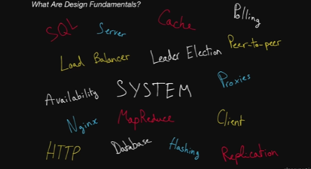

# SystemsExpert Notes
## Myles Thomas
### 5/12/2023
#### algoexpert.io
---


---
### Lesson 1: Introduction

Coding Interviews vs. Systems Design Interviews

Coding Interviews

- Tests ability to problem solve 

+ Data Structrures: somewhat necessary (for optimal answer sure, but no)

* A smart person could figure some out without prior experience


Systems Design Interviews

+ Requires a lot of knowledge about robust/scalable systems

* Design fundamentals = Absolutely necessary

    * A smart person could figure some out without prior experience

    * You can't begin to answers these questions without learning them

    * There are a lot of design fundamentals out there


---
### Lesson 2: What Are Design Fundamentals

Design fundamental questions: very vague questions

- The point is to take a 45 minutes to talk about things like this:

    - System

    - Characteristics

- Unlike coding questions, these are much more SUBJECTIVE

- You can use concepts incorrectly, but if you have the right understanding, you can confidently justify your choices for your system

    - "Defend your position"

Design fundamentals come in a lot of flavors, but 4 categories explain the most:

1. Fundamental Knowledge
    - Network protocols / how systems interactive
    - Client server model
1. Key Characteristics of Systems
    - Latency
1. Key Components
    - Load balances
    - Caching 
1. Actual Tech (Already existing / Real life tools)
    - Examples:  
        - Zookeeper
        - Google cloud storage
        - S3
    - This section is often-times overlooked!

Takeaways: 
- This stuff is hard and non-trivial
- Luckily, they have condensed the important stuff into a bite-sized format 

---
### Lesson 3: Client-Server Model
- Foundation of the internet
- The model is made up of a bunch of clients and servers talking to one another

Key terms: 

##### Client
A machine or process that request data or service from a server
- Single machines or piece of software can be both a client and a server at the same time
    - Example: A Single machine could act as a server for end users and as a client for a database

##### Server
A machine or process that provides data or a service for a client, usually by listening for incoming network calls

##### Client Server Model
The paradigm by which modern systems are designed
- consists of clients requesting data or service from servers and servers providing data or service to clients 

##### IP Address
An address given to each machine connected to the public internet 
- IPv4 address consist of 4 numbers separated by dots ie. a.b.c.d 
- All numbers between 0-255
- Special values:
    - 127.0.0.1: Your own local machine (localhost)
    - 192.168.x.y: Your private network (your machine and all machines on your private wifi network will have the 192.168 prefix)\

##### Port
In order for multiple paradigms to listen for new network connections on the same machine without colliding, they pick a port to listen on 
- A port is an integer between 0 and 65,535 (There are 2^16 ports total)
- Ports 0-1023 are reserved for system ports
    - "Well-known ports"
    - Shoulldn't be used by user-level processes
- Other examples of important ports:
    - 22: Secure Shell
    - 53: DNS lookup
    - 80: HTTP
    - 443: HTTPS

##### DNS: Domain Name System
Describes the entities and protocols involved in the translation from domain names to IP addresses 
- Typically, machine make a DNS query to a well known entity
- That entity is responsible for returning the IP address(s) of the requested domain name in the response 

My notes to the Video:

What happens when you go to AlgoExpert.io?
1. Client: my browser (I asked server for data)
1. Server: algoexpert.io (returns data to the client, my browser)
- Client doesn't know how to talk to Server
- Makes a DNS in order to find out the IP address
    - Now, the client (browser) knows what the server (algoexpert) is 
        - IP Address = Unique identifier for a machine 
1. Once the client gets the IP address and knows/understands the HTTP format...
- it knows that the client (browser) wants to look at the HTML of the server (algoexpert)
- The server (algoexpert) returns/replies to this request of looking at the HTML by sending back the HTML 
- Your browser (client) receives this response and renders it on your screen
 
Mailbox analogy
- IP address: mailbox to apartment complex
- Ports: apartment numbers
    - Mail writing to that mailbox has to note the port
    - If client wants to speak to a server with HTTP, picks that apartment number
- These numbers were decided on a very long time ago

---
### Lesson 4: - Network Protocols 
- IP packets
- TCP headers
- HTTP requests

- As daunting as they may seem, these low-level networking concepts are essential to understanding how machines in a system communicate with one another. And as we all know, proper communication is key for thriving relationships!

### Key Terms: 

##### IP - Internet Protocol: 
This network protocol outlines how almost all machine-to-machine communications happen in the world
- Other protocols built on top of IP: TCP, UDP, HTTP

##### TCP: 
Allows for ordered, reliable data delivery between machines over the public internet by creating a connections
- Built on top of IP
- Usually implemented in the kernel
- This exposes sockets to applications that they can use to stream data through an open connection

##### HTTP - HyperText Transfer Protocol: 
- Very common
- Implemented on top of TCP
- How it works:
    - Clients make HTTP requests, with schema such as:
        - Host: string ie. algoexpert.io
        - Port: integer ie. 80/443
        - Method: string ie. GET/SET/PUT/DELETE
        - Headers: pair list ie. "Content-Type" -> "application/json"
        - Body: opaque sequence of bytes
    - Servers respond with one of these responses, such as:
        - Status code: integer ie. 200/401
        - Headers: pair list ie. "Content-Length" -> 1238
        - Body: opaque sequence of bytes

##### IP Packet - Network Packet: 
- Besides bytes, is effectively the smallest unit used to describe data being sent over IP
- Consists of the following:
    - IP Header, which contains: 
        - source IP address
        - destination IP address
        - Other information related to the network
    - Payload: the data being sent over the network

### My Notes to the Video: 
- This is a topic that scares off a lot of people
    - network protocolos usually are low-level and not relevant to many engineers days
    - For interviews, they are quite simple
    - If you are beginner, this is good because you should have an "aha!" moment
- Example: network protocol = 2 people who vaguely know each other walk down a hall past each other
    - "Hey how are you"
    - This is a communication/network protocol
        - Between 2 machines, instead of human beings!
        - Communication between the 2 machines follows this "network protocol"
            - Kinds of messages
            - Format of messages
            - Order of messages
            - Whether or not there should be a response
            - How they are received by the other machine
 - Note: There are a lot of network protocols, you don't need to know most!
    - IP, TCP, and HTTP are the important 3

IP
- Modern internet runs on IP
- Data is sent as an IP packets
    - IP packets: building blocks of communication between machines over the internet 
    - IP packets are made up of bytes, and are 
    - 2 main sections of IP Packets: 
        - 1 - Header: useful information at the beginning (small, only 20-60 bytes!)
            - Source: ip address it is coming from
            - destination: ip address it is going out to
            - Total size of packet
            - Version of internet protocol it is operating on (Version 4 or 6)
                - "Difference Between IPv4 vs IPv6? most obvious difference is that IPv4 uses a 32-bit address while IPv6 uses a 128-bit address. This means that IPv6 offers 1,028 times more addresses than IPv4, which essentially solves the "running out of addresses" problem (at least for the foreseeable future)" (Source: https://www.google.com/search?q=ipv4+vs+ipv6&oq=ipv4+vs+&aqs=chrome.0.0i131i433i512j69i57j0i512l8.1997j0j7&sourceid=chrome&ie=UTF-8)
                - This can change things like the structure of how machine interprets it 
        - 2 - Data: Where information is stored 
            - IP packets are limited to be 2^16 bytes in size
                - May sound like a lot, but is only 65,000 bytes, which is 0.065 MB, aka tiny
                - Multiple IP packets will be packaged together
                - How does this work?
                    - When multiple packets are sent between machines over Internet Protocol (IP), it is possible for the following to happen:
                        - Packets get lost
                        - Packets get out of order
        - In a nutshell, multiple IP packets being sent togethr is where IP falls apart and we need TCP to built on top of IP to save the day!

TCP: transmission control protocol
- Built on top of IP 
- Sends IP packets in ordered way
    - Guarantees order of IP packets being received 
    - If they get corrupted or errors, we are let known and you can re-send in an un-corrupted way
- TCP is used in all web apps 
- Lets you send arbitrarily long/any amount of data to another machine 
- Note: Unless you work in networks/networking, not as important to know
- You could do an entire course for this topic
    - ie. not relevant for SWE or interviews
    - Important to know just the high-level details
- High level details that are important:
    - 1 - "TCP is built on top of IP"
        - If you have an IP packet, you have the following:
            - IP header 
            - IP data 
            - In this data portion of the IP packet:
                - TCP header, which contains information about ordering of packets
Note: core idea of TCP: When machine wants to communicate with another machine over TCP, it does the following:
- 1st, Creates a TCP connection with the destination computer/server
    - Example: browser wants to communicate with algoexpert servers
- This is a handshake, or a special TCP interaction where the following occurs:
    - Computer contacts the other by sending 1 or more packets saying "I want to connect with you"
    - Other computer responses saying "yes we can chat/connect"
    - Once connection agreed, both machines can send data back and forth freely
        - More on this:
            - If 1 machine doesn't send data for a long time, connection can time out
            - If 1 machine wants to end the connection, it will send something that ends the connection

TCP Takeaways:
- In a nutshell, more powerful wrapper around IP
- Downsides/what it is missing:
    - a robust framework that developers/SWEs can use to really define easy and simple to use communication channels for clients and servers in a system
- In TCP, all you are sending is arbitrary data that fit into IP packets
    - This is where HTTP comes into play!

HTTP (HyperText Transfer Portocol)
- Built on top of TCP
- Introduces a Higher level abstraction ie. the "request/response paradigm"
    - 1 machine sends a request
    - The other machine sends a response
- This request/response paradigm, with other rules, makes it easy for developers to create robust and easy to maintain systems:
    - Robust: it keeps stability and performance without using adaptation methods ie. coping strategies
    - Easy to maintain: Readable, high quality code that is well-documented
- This is why most modern-day systems nowadays rely on HTTP protocol for communication
    - Forgot about IP packets
    - Forgot about TCP
    - Focus on HTTP requests and HTTP responses
        - Request: Machine wants to interactive with other machine
        - Responses: How machine reacts to response

- Objects of Requests and Responses and their important fields:


httpRequest: 
- Host: describes destination server's host
- Port: describes destination server's port
- Method: Purpose of request
    - ie. GET/SET/DELETE are typically guidelines for implementation of the method
- Path: Where you start to have logic in the server
    - Ie. '/payments' (server may have multiple paths for different servers)
        - Clients may issue requests to different servers with different methods
- Headers: collection of key value pairs with type/length info
    - Content type: type of the body
    - Content length: length of the body
- body: The actual data request that gets sent to the server
    - Ie. "data" : "This is a piece ofdata in JSON format." 
httpResponse: 
- Status code: describes the type of response 
- Examples:
    - 404: data was not found
    - 403: data is forbidden / you don't have access
    - You can use the guidelines or ignore them, up to you 
- Headers: Key value pairs with type and length info
- body: The actual data sent to the server

How Clement runs an HTTP transfer example (of a client interacting with a server, using javascript's express):
Link to Google Doc that explains how to do all of this!
- https://docs.google.com/document/d/1Ncs9CcpymBbGECgkZfapoAlVzzzgfOqLNq2Ixyn6yGI/edit?usp=sharing

Takeaways:
- IP, TCP, HTTP are all 3 very important for the internet
    - IP and TCP: Data transfers only 
    - HTTP: Introduces the opportunity to add business logic 
        - More logic is needed for large scale systems
        - Implementation of error handling, etc.
- IP and TCP are much more low-level
- HTTP is more more relevant for business. 
- Need to know the following:
    - Requests/Responses 
    - Methods 
    - Path names

---
### Lesson 5: - Storage

### Key terms: 

##### Databases: 
Programs that either use disk or memory to do 2 cores things:
1. Record Data
1. Query Data
- Databases are long-lived and interact with the rest of your application through network calls (with protocols on top of TCP, or even HTTP)
- Some databases: Keep records in memory
    - The users of these Databases are aware that those records could disappear forever
- Most databases: Write to Disk
    - Anything written to disk will remain through power loss, network partitions (pretty much will keep it permanently no matter what)
    - Machines die pretty often in a large scale system, so special disk partitions or volumes are used by the databases processes
        - Those volumes can get recovered even if the machine goes down permanently

##### Disk: 
- Usually refers to one of the following:
1. HDD (Hard-disk drive)
1. SDD (Solid-state drive)
- Data written to disk will persist problems and is known as non-volatile storage

SDD vs. HDD
- SDD:
    - Faster (lower latency)
    - More expensive
    - Used for data that is frequently accessed and/or updated
- HDD:
    - Slower
    - Cheaper
    - Used for data that is rarely accessed and/or updated

##### Memory: 
- Short for RAM (Random Access Memory)
- Data stored in memory will be lost when the process that has written that data dies
    - Example: The Kernel for Jupyter 
    - Good to know: Virtual Memory/Virtual Ram vs. Physical Memory/Ram
        - RAM is faster, more expensive
        - Virtual memory is only used when RAM is filled 	

##### Persistent Storage: 
- Usually a reference to disk
- In general, any form of storage that persists if the process in charge of it dies
- Good to know: Disk vs. Memory
    - Memory is what the computer stores temporarily
        - When you save a file, it transfers from being 'Memory' into being 'Disk/Storage'
    - Disk is permanent storage

### My notes to the Video: 
- If you think of any system, it will need some form of storage for information/metrics, and that is what a database is for
- Database pairs for data that are synonymous and mean the same thing:
    - Store/Retrieve
    - Write/Read
    - Get/Set
- Misconception about database: It is a magic opaque box that lives somewhere in the ether
- In reality: A server ie. you can make this local computer set up to be a server that can people can read data from, and write data to

Persistence: The assumption data will make it through outages
- Disk: Save a file permanently to your local disk
- Memory: Temporarily existing data that we could possible lose

Example: Simple example of data server that Clement cooked up for us:
Link: 
https://docs.google.com/document/d/1rDz2rpQn12Ob6xQ3CCNwu3SYDqnssPQDBMpVP-9NIEU/edit?usp=sharing

- After this simple example, you may think databases are easy (not true!)
    - Storage is very complicated
    - Lots of depth and breadth to this subject
    - 100's of database offering out there
        - Google Platform has 8 different offerings!
        - We have touched important stuff for system design interviews, but there is way more

- Why are there so many offerings?
    - Different databases do different things (storing on disk/memory is easy and all do that)
    - Structure of data (relation)
    - Availability (uptime of system)
        - If database goes down, system could effectively go down
    - Distributed storage
        - 1 machine vs. 2+ machines
        - You don't want your entire system to get brought down if 1 system goes down
        - Do you split it up or replicate across machines?
    - Consistency issues
        - Staleness/up-to-dateness 
        - If it is across machines, will you always get the most up to date/fresh data?
In a nutshell:
- Complex subject area
- The 100's of database offerings have their own properties (can't have all the pros!)

---
## Lesson 6: Latency and Throughput

### Key terms:

##### Latency
- The time it takes for a certain operation to complete
    - ie. data to go from point a to point b 
- This is often measured in time duration

##### Throughput
- The number of operations that a system can handle properly per time unit
    - Can be measured in requests per second (RPS/QPS)

### Notes from the video:

Latency and Throughput are the 2 most important measures of the performance of a system 

Latency: How long it takes data to traverse a system ie. get from 1 point to another
- time to get from server to client and back
- time to read data from memory or disk
- different things in systems have different latency
- There are tradeoffs between _ ie. some are faster and some are slower

Examples of latency times for common operations: 
- read 1 megabyte from memory: 1 unit (250us)
- read 1 megabyte from ssd/solid state driver, which is smaller and faster than hard disk drive: 4 units (1000us)
- send network request for api calls, sending 1mb data takes 40 units (10,000us)
- reading 1mb data from hdd/hard drive: 80 units (20,000us)
- sending a packet, which is smaller than 1mb, from CA -> Netherlands -> CA: 600 units (150,000us)

For the most part, you will want to optimize your system by optimizing/minimizing latency
- not all systems will need this, but some will
- examples: 
    - video games: latency matter A LOT for online gaming
    - server you are playing on halfway across the world can take awhile to make requests to the server
    - websites: latency does not matter as much
        - may not care about page loading for 5 seconds as long as the page ends up showing accurate information / never has crahses or failures

Note: as you go through systems design interviews, you will have to make a list and start thinking of tradeoffs
- latency is a big one 

Throughput: how much "work" a machine can do in a given period of time 
- computing usually measured in "how much data can be transfered from point a in the system to point b, in a given amount of time" 
- ie. 1 gigabit per second or 1,000,000 bits per seconds 
    - in systems design interviews AND in general

Example: a server with not just 1 client, but 5 or 1000's of clients making requests
- requests coming from all over the place.... how many can this system handle in 1 second?
    - reduce the question to bits: how many bits can this server let through per second
    - think of a clock/bottle neck where only a certain amount can fit

How to improve throughput to optimize system?
- simple, you pay for it 
- the #1 thing that determines how much can go in and out of algoexpert's servers in 1 second is determined by their cloud provider (google cloud services)
    - in theory, you can always pay google to bump up/improve throughput 
    - Note: just because you increase throughput, doesn't mean you will solve all problems with a system!

Example: google search / facebook messenger 
- suppose there are 1,000,000's of requests per second, a bottleneck still exists at some point!
    - this is where you have a "contrived" system where multiple servers handle the requests

Closing thoughts on latency and throughput: 
- they are not correlated
    - you cannot make assumptions on latency OR throughput based on the other (even though they are related and both very important to a system's performance, still different entities)
    - example: you have extremely low latency (good) but then you have low throughput (bad) so it doesn't end up mattering 


---
## Lesson 7: Availability

### Prerequisites 

##### Process: 
A program that is currently running on a machine
- You should always assume that any process can be terminated at any given time
    - especially if the system is large

##### Server: 
A machine or process that provides data or a service for a client, usually by listening for incoming networks calls/requests
- Note: 1 single machine OR piece of software can simulataneously act as the server and client 
    - Exampmle: my machine could be a server for end users and a client for another database 

##### Node/Instance/Host: 
A virtual or physical machine on which the developer runs processes
- (These 3 terms refer to the same exact things most of the time)
    - "Server" also refers to this concept, at times

### Key terms

##### Availability: 
The odds/probability of a particular service/server being up and running at any point in time 
- Measured in percentages i
- A server with 99% availability will be operational 99% of the time you interact with it 
    - This would be describes as having 2 "Nines" of availability 


##### High Availability: 
Systems with particularly high levels of availability, typically 9 "Nines" or more 
- Abbreviation: "HA"

##### Nines: 
Refers to percentages of uptime 
- Example: 5 Nines of availability means an uptime of 99.999% of the time.
    - Below, more examples of the downtimes expected per year (depending on those 9s)
    - 99% (two 9's): 87.7 hours per year 
    - 99.9% (three 9's): 8.8 hours per year 
    - 99.99% (four 9's): 52.6 minutes per year 
    - 99.999% (five 9's): 5.3 minutes per year 

##### Redundancy: 
The process of replicating parts of a system, in order to make it more reliable

##### SLA (Service-level agreement): 
a collection of guarantees given to a customer by a service provider
- SLAs typically make guarantees on a sytem's availability (among other things)
    - SLAs are made up of one or more SLOs

##### SLO (Service-level objective): 
a guarantee given to a customer by a service provider
- SLOs typically make guarantees on a system's availability (among other things)
    - SLO's make up/constitute into 1 SLA agreement

### Notes from the video:

Reminder: When evaluating a system, here are 2 things to consider: 
- latency
- throughput

- Let's add another to that list: Availability

You can think about systems a few different ways:
- fault tolerance: how resistant it is to failures ie. if 1 server/database fails, will the entire system go down?
- a: the % of time in a given time period ie. 1 month/1 year that all primary functions are satisfied

Note: nowadays, most systems have an implied "guarantee" of very good availability
- Example: algo expert. you purchase access to the content, but there is an implied understanding that it will always be available 
    - if you were to long on and all/certain features or data were not showing up for 2 hours, you would not be happy!
        - would lead to losing money/customers
         - bad publicity

Varying degrees of availability to expect from systems
- Example: AlgoExpert
    - Would be upsetting, but not the end of the world
- Example: Airplane software 
    - Would be unnacceptable and could lead to deaths 
    - You would expect a VERY HIGH availability
- Example: Youtube or Amazon Web Services
    - This would affect tons and tons of people 
        - in 2019, google cloud platform affected 1000's of businesses

How do you measure availability?
- % of a system's up-time in a given year
    - Facebook or Uber being down 50% of the time would be awful
    - Even 90% would be awful
    - We end up measuring it in Nines

Availability in Nines: 
2: 99.0%
5: 99.999%
9: 99.9999999%

- Once you get into 3-4 Nines, you start to see decent numbers
    - High availability (HA): 5+ Nines

Availability is really important to end users and system designers
- Because of this, it is not implied, but guaranteed availabilities
- This takes us to SLAs

SLA (Service level agreement)
- Written agreement of between the service provider and the client/end-user
    - "We guarantee that our servers are up x % of the time"
        - This is an example of part of an SLO
- Established products like AWS or Google Cloud will have clearly stated SLAs
    - SLAs will explain to customers what happens when SLA is broken 
        - Oftentimes, will mean the service provider has to pay the users something

SLO (Service level objective)
- The individual objectives that makes up an SLA
    - Think 1 singular page/section of an entire lawyer's contract


Tradeoffs
- It is not always the case that you need 5 Nines of Availability!
- It is difficult to achieve high availability, which causes you to make tradeoffs for less than stellar performance in other areas of your system
    - Examples: 
    - Higher latency (data takes longer to get from point 1 to 2)
    - Lower throughput (less data can be sent per second)

Example: Strike
- Provides payment services for businesses
    - AlgoExpert uses it for everything that is paid for besides Paypal transactions
- Parts of system that require high availability ie. core services: 
    - Handling payments 
    - Charging customers
        - Could have really bad problems for provider/users if this goes down!
- Less important parts: 
    - Dashboard that shows/monitors sales
        - If this went down, it is not the end of the world

Takeaway: "What parts of my systems would be OK to fail?"


How do you make a system highly available?
- Make sure there is not Single points of failure
    - This is where Redundancy comes into play

Redundancy
- The act of duplicating/tripling/etc. parts of a system
    - If 1 server goes down in a single-server system, the entire system is done for
    - If 1 server goes down in a 1,000 server system, the system is good probably
- Load balancers are used to avoid having single points of failure
    - You even need to have redundancy with load balancers ie. have 3 load balancers 
        - AlgoExpert has 5 

- Passive Redundancy
    - When you have multiple components, if any of the components die, nothing will happen
    - Example: 1 server of a 3 server system goes down
        - While 1 is being fixed, 2 and 3 take on a bigger load in the meantime and all is good
    - Example: 1 engine of an airplane goes down, the other can keep it going 

- Active Redundancy 
    - Only 1 or a few of the machines is going to be handling traffic and/or doing work
        - If the 1 machine doing work goes down, the others that were NOT doing work will start doing work 
            - Example: System of 5 machines where only 1 at a time is working
                - If 1 dies, 1 of the other 4 will take over 
    - This goes into "Leader election"
        - The simple idea of giving 1 thing (a host/server) special powers 

Takeaways: 
- Eliminate single points of failure with redundancy
- Make sure to have rigorous processes in place to deal with the situation of a system failure
    - Human intervention will be needed at times
     

## Lesson 8: Caching 

Punching bag + Caching
"They can both take a hit"

### Prerequisites:

##### Latency
- The time it takes for a certain operation to complete
    - ie. data to go from point a to point b 
- This is often measured in time duration

##### Throughput
- The number of operations that a system can handle properly per time unit
    - Can be measured in requests per second (RPS/QPS)

##### Memory
- Short for RAM (Random Access Memory)
- Data stored in memory will be lost when the process that has written that data dies
    - Example: The Kernel for Jupyter 
    - Good to know: Virtual Memory/Virtual Ram vs. Physical Memory/Ram
        - RAM is faster, more expensive
        - Virtual memory is only used when RAM is filled 

### Key Terms:

##### Cache
A piece of hardware or software that stores data, typically meant to retrieve that data faster than usual
- Often used to store responses to network requests
- Also results of computationally-long operations
- Note: data in a cache can become "stale" if the main source of truth for that data (ie. the main database) gets updated and the cache does not

##### Cache Hit
When requested data is found in a cache

##### Cache Miss
When requested data could have been found in a cache but is NOT
- typically used to refer to a negative consequence of a system failure or of a poor design choice 
- example:
    - "if a server goes down, our load balancer will have to forward requests to a new server, which will result in cache misses"

##### Cache Eviction Policy
The policy by which values get evicted or removed from a cache
- Popular cache eviction policies:
    - LRU (least-recently used)
    - FIFO (first in, first out)
    - LFU (least-frequently used)

##### Content Delivery Network
A CDN is a 3rd party service that acts like a cache for your servers
- Sometimes, web apps can be slow for users in a particular region if your servers are only located in another region
- A CDN has servers all around the world
    - The latency to a CDN's servers will almost always be better than latency to other servers
- The CDN's server's are often referred to as PoP's (Points of Presence)
    - Two of the most popular CDN's:
        - Cloudfare
        - Google Cloud CDN

### Notes from the video:

Caching is one of the most important topics in system design interviews
- You will use it in almost all interviews
- If you have done any algoexpert problems, you have problem used caching
    - You do it to avoid re-doing operations + improve time-complexity

To put it simply:
- Caching is used to speed up a system (Reduce latency)
- The way to design a system so that we can replace operations that are expensive like network requests/data transferws
    - Storing data in a place that is different from its original place, such that it is faster to access it in the new spot
        - Can be used in a BUNCH of different places in a system
        - Examples: 
            - Client-level: Client caches some data so they don't have to go to the server 
            - Server-level: Client always need to interact with server, but server can have a cache between server and client
            - Hardware-level: CPU caches that make it faster to retrieve data from memories
                - Less important in system design interviews

Context of Systems Design interviews, where instances of caching is really helpful
1. You are doing a lot of network requests
- You want to avoid doing all of these requests
    - Example: Client > Server, Server > Database, Database > Server, Server > Client (client can now do stuff with the data)
        - Cache could speed it up to be this: 
            - Cache at client level
            - Cache at server level
1. You are doing a computationally long operations
- You want to only perform these operations 1 time
1. Operations that are done a ton of time
- You have multiple servers all interacting with the database in the same way
- Not necessarily to speed up the server
- Example: A bunch of clients are all going to the same celebrity's page
    - You don't want to read from this database 1,000,000 times
    - The servers will have cache where the profile is saved (avoids reads at a database level)

Concret Examples of Caching in Actions
1. AlgoExpert coding interview questions
- First time you go on that page, it will have a loading icon
    - If you go on another page, and come back, the questions list is pre-loaded
        - They have cached the questions list on the client
            - They know the questions page is constant and is not going to change, so instead of making a server request every time, you get a faster experience on the website
1. Running code blocks on AlgoExpert
- Average takes 1 seconds (lots of stuff behind the scenes)
- When using solutions that they are have solutions to, no matter who is running the code 
    - Don't need to run the code again because the correct value has already been cached
    - When running code you are making a network request, Where is this cache located?
        - Server-level
            - Redis (popular in-memory database for key-value store)
            - How this works: Client goes on algoexpert > Run code with one of their solutions (This sends HTTP request to AlgoExpert servers) > AlgoExpert servers say "hey we have this request (which is a bunch of bytes), we are going to hash it down to a single integer, then check out cache to see if it already exists in-memory on the server here" > If the key is on Redis, we take the value and return it to the client
                - This is how you use the value on the cache (instead of having the server run the code)

Example: Clement codes up a database file and a server file 
Link to my instructions on how to do this myself: 
https://docs.google.com/document/d/1s7LyboaDUrVthFzmJSE8SjvOi6W7B7cRr7r0D9KYXBI/edit?usp=sharing

At this point, we have only looked at examples of where we are READING data
- What about caching for when we need to WRITE data?

Writing w/ Cache
- We are designing a web app/system where uses can read AND WRITE and EDIT posts (think of Facebook/LinkedIn)
    - Client: browser that you interact with 
    - Server: when you write a post, you make a request to this server to write / edit
    - Database: when you write OR edit a post, the server interacts with the database
- Let's say you want to cache these posts,you now have 2 sources of truth in this system: 
    - Source of truth #1: database
    - Source of truth #2: server's cache
- Example: 
    - Client makes network request to the server for the post
    - Server made requests to database to store the post 
        - It gets posted/displayed on the website's page
    - Somehow the post gets stored in the server's cache
        - This takes us to 2 different types of caches

1. Write-through cache
- When you write a piece of data, your  system writes to the following at the same time:
    - database (the main source of truth)
    - cache
- Example: You want to make an edit to an already existing post because there is a typo
    - You make a request to the server 
    - Server overwrites what is in the cache
    - Server makes a request to the database to overwrite what is in the database
        - Upside: Cache and database are always in sync
        - Downside: You still have to make a request to the database (not optimal for time complexity)
            - There are types of cache's where you do not need to make network calls or interact with the database at all
1. Write-back cache
- Only the cache gets updated
- Behind the scenes, your system will 'asynchronously' (at a different time) update the values stored in the cache
    - This can happen a couple of ways: 
        - Over an interval of time ie. every 5 minutes
        - When the cache gets full (cache eviction)
- Example: You want to make an edit to an already existing post because there is a typo
    - You make a request to the server 
    - Server only overwrites what is in the cache
    - Server makes a request to the database to overwrite what is in the database
        - Upside: You go right back to the client and do not need to make a request to the database 
        - Downsides: Cache and database are not in sync
            - If something happens to your cache before the lose data in the cache, you will lose the data
                - This is really bad, but there are ways to mitigate this

Example: We are desinging the system for Youtube's comment section
- We have a bunch of servers
    - Every server caches the comments on that video
- We have a bunch of clients who interact with these servers
    - when they read from the comments, they read from the respective caches
- Hypothetical/Let's say:
    - client 1 posts comment to video 1
    - client 2 visits video 1
        - server goes to database to fetch comments, stores in cache
        - time lapses...
    - client 1 edits initial comment to video 1
    - client 2 visits video 1 again and replies to the comment made by client 1
        - because the server for video 1 already has a comment in cache memory, it doesn't go to the database to receive the most up-to-date comment. 
            - this is a problem because client 2 has now replies to an out-of-date comment made by client 1
            - Replying to stale comments would be unnacceptable for a system with written like this

Concept: Staleness
- Caches can become stale if they haven't been updated properly
    - Youtube example: would be a bad system because client would often be dealing with caches holding stale data 
    - A remedy could be moving the cache out of the servers and into the 'middle' so there is 1 single cache
        - all of the servers go to this single cache for a "single source of truth"
- Certain features, staleness is not going to matter:
    - Example: view count of youtube videos 
        - Not the most important thing on the page
        - If 1 client sees a stale view count, that is not really the end of the world

For system design interviews:
- Do we care about the accuracy of our data/if it is staleness and consistency?
    - Are we able to properly validate/remove stale data in our caches (especially in a distributed system)
- Is our data static/immutable or dynamic/mutable?
- Is a single thing reading/writing data or are multiple things?


Caching Takeaways:
- Caching is great. Rule of thumb:
    - Static/immutable data: Caching is great
    - Editable/mutable data: Caching is tricky (data exists in 2 spots)
- Unfortunately, caching has pitfalls we need to watch out for 
    - Staleness and inconsistencies

Final point on caching: Eviction policies of caching
- "How do we actually get rid of data in the cache?
- what policies and rules do we follow?
    - We do not have unlimited space in the caches
    - Examples of policies: 
        - LRU: Least recently used ie. remove the oldest data in the cache (Assumption: old data is irrelevant)
        - LFU: Least frequently used ie. you have a bunch of data in your cache, remove the data you used the least (Assumption: data you don't use much is irrelevant)
        - LIFO: last in, first out 
        - FIFO: first in, first out 
    - There are many different ways to evict data from a cache
        - Depends on use-case/product/system


---
## Lesson 9: Proxies 

Often used by 'nefarious' evil hackers to conceal their identity and 'obfuscate' hide their location, these special intermediary servers boast many important real-life applications ithin the following contexts: 
- Caching 
- Access control
- Cencorship Bypassing
- More!

### Prerequisites:

##### Client
A machine or process that request data or service from a server
- Single machines or piece of software can be both a client and a server at the same time
    - Example: A Single machine could act as a server for end users and as a client for a database

##### Server
A machine or process that provides data or a service for a client, usually by listening for incoming network calls

### Key Terms:

##### Forward Proxy
A server that sits between a client and servers and acts on behalf of the client 
- Typically, used to mask the client's identity/IP address
- Note: Forward proxies are often referred to as just "Proxies"

##### Reverse Proxy
A server that sits between a client and servers and acts on behalf of the servers
- Typically, used for the following: 
    - Logging
    - Load balancing
    - Caching

##### Nginx
A very popular webserver that is often used as a reverse proxy AND load balancer
- Pronuncation: "engine X"

### Notes from the video:

Proxies are a very important/fundamental topic to systems design
- Simple to understand
- They sounds cool
    - probably have heard it in a movie

One important note: 
- Proxy: Forward Proxy
    - In the industry, people loosely use the word "proxy" so they assume "proxy" is "forward proxy" 

Forward Proxy
- A server that sits in between a client (or clients) and a server (or set of servers)
    - Can help the client hide their identity to access restricted servers/websites that are unavailable to your country/organization/etc.
    - "On the client's team"
        - Assuming the forward proxy has been set up correctly, if Client A issues a request to the server, it will first go through the forward proxy, then the server 
        - "Hey forward proxy, communicate with the server for me"
        - When the server replies to the proxy, the proxy will then send that response to the client
    - The forward proxy can be used to hide the client's identity
        - The source address of the client (A) is hidden because source address of the Proxy (P) is what shows up when making requests to Server (S)
    - Note: There are types of forward proxies that still can give up the IP address of the client up to the server
    - This is how essentially how VPN works
        - "A VPN is similar to a proxy, but instead of working with single apps or websites, it works with every site you visit or app you access."


Backward Proxy
- A server that sits in between a client (or clients) and a server (or set of servers)
    - When the client makes requests to the server, it has no idea that it is actually going to a backward proxy
    - Whereas forward proxy acts for client, backward proxy acts for the server ie. "On the server's team"
        - If the backward proxy has been configured correctly by the server/entity that owns the server, the request will go from client > reverse proxy > server
            - The client will not know this
            - 
        - 


---
## Lesson 10: Load Balancers 

### Prerequisites:

##### 

### Key Terms:

##### 

### Notes from the video:


---
## Lesson 11: Hashing 

### Prerequisites:

##### 

### Key Terms:

##### 

### Notes from the video:


---
## Lesson 12: Relational Databases 

### Prerequisites:

##### 

### Key Terms:

##### 

### Notes from the video:


---
## Lesson 13: Key-Value Stores 

### Prerequisites:

##### 

### Key Terms:

##### 

### Notes from the video:


---
## Lesson 14: Specialized Storage Padadigms 

### Prerequisites:

##### 

### Key Terms:

##### 

### Notes from the video:


---
## Lesson 15: Replication and Sharding 

### Prerequisites:

##### 

### Key Terms:

##### 

### Notes from the video:


---
## Lesson 16: Leader Election 

### Prerequisites:

##### 

### Key Terms:

##### 

### Notes from the video:


---
## Lesson 17: Peer to Peer Networks 

### Prerequisites:

##### 

### Key Terms:

##### 

### Notes from the video:


---
## Lesson 18: Polling and Streaming 

### Prerequisites:

##### 

### Key Terms:

##### 

### Notes from the video:


---
## Lesson 19: Configuration 

### Prerequisites:

##### 

### Key Terms:

##### 

### Notes from the video:


---
## Lesson 20: Rate Limiting 

### Prerequisites:

##### 

### Key Terms:

##### 

### Notes from the video:


---
## Lesson 21: Logging and Monitoring

### Prerequisites:

##### 

### Key Terms:

##### 

### Notes from the video:


---
## Lesson 22: Publish/Subscribe Pattern 

### Prerequisites:

##### 

### Key Terms:

##### 

### Notes from the video:


---
## Lesson 23: MapReduce

### Prerequisites:

##### 

### Key Terms:

##### 

### Notes from the video:


---
## Lesson 24: Security and HTTPS

### Prerequisites:

##### 

### Key Terms:

##### 

### Notes from the video:


---
## Lesson 25: API Design 

### Prerequisites:

##### 

### Key Terms:

##### 

### Notes from the video:


##### Ending Notes on SystemsExpert


# VSCode Stuff

Guide for Markdown in VSCode:

Resources for this knowledge: 
https://code.visualstudio.com/docs/sourcecontrol/overview
https://www.youtube.com/watch?v=Hgucu1ch3mo

### Include an image: 

1. Find image in VSCode Explorer
1. Drag it over the screen
1. Press shift before dropping it in


### Include code:

1. Put 3 ticks above/below where code will go
1. Specify language

``` python
# Python
n = 100
for i in range(0, len(n)):
    print(i)
```

``` js
// JavaScript
var Increment = function(num) {
    return num++;
};
```

```

```

### Bullet points

Example 1: 

Topic 

* 1st Sub topic

    * 2nd Sub topic

        * 3rd Sub topic

            * 4th Sub topic


Example 2: 

Topic 

* 1st Sub topic

    * 2nd sub topic

        Paragraph nested inside of this bullet (inline)

        (We can put images and cool stuff here)

        ![do not need a caption] (http://unsplash.it/500/300?random)

        Let's even add a code block in this paragraph:

        ``` cpp
        // C++
        #include <assert.h>     //assert()
        #include <cstdio>       //printf()
        #include <string>       //strings
        #include <iostream>     //In order to read or write to the standard input/output streams, you need to include this header file
        using namespace std;

        int main() {
            string ref_url_str;
            ref_url_str = "https://cplusplus.com/reference/cstdio/printf/";
            int x = 10;
            int y = 20;
            int z = x + y;
            assert(z == 30);
            printf("%d + %d = %d \n", x,y,z); 
            printf("Reference on how to how to use f-strings in C++:");
            printf("Link: %s", ref_url_str);
        }
        ```

        Why not some Java just for fun...

        ``` Java
        // Java
        import java.util.*
        //create a generic pairs tuple so I can return 2 items in Program.whoAmI()
        public class Pair<A,B> {    //https://stackoverflow.com/questions/457629/how-to-return-multiple-objects-from-a-java-method
            public final A a;       //you cannot change name, ie. 'final'
            public B b;      
            //constructor
            public Pair(A a, B b) {
                this.a = a;
                this.b = b;
            }
        };
        //create our class Program
        public class Program {
            public String name;
            public Integer age;
            //constructor
            public Program(String name, Integer age) {
                this.name = name;
                this.age = age;
            };
            //method 1
            public Pair whoAmI() {
                Pair my_tuple = new Pair(name, age);
                return my_tuple;
            }
            //method 2
            public boolean doesTwoPlusTwoEqualFour(Integer x, Integer y) {
                assert((x + y) == 4);
                return true;
            }
            //main
            public static void main(String[] args) {
                //setup class method
                Program my_class_instance = new Program("Myles", 25);
                my_class_instance.age = 26;
                //run the 2 methods in this class
                Pair mylesChristianGeorgeThomas = my_class_instance.whoAmI();
                String.format("My name is _ and I am _ years old.");
                Boolean bools = my_class_instance.doesTwoPlusTwoEqualFour(2, 2);
                String.format("After all, it turns out that %d + %d = %d!", 2, 2, 2 + 2);
            }
        }
        ```